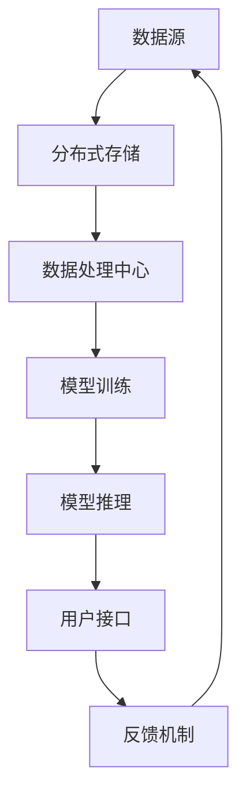

                 

关键词：AI资源调度，全球化运营，跨地域协作，分布式系统，Lepton AI

摘要：本文探讨了跨地域AI资源调度的背景和重要性，以及Lepton AI在全球化运营中的实践。通过深入分析其核心概念、算法原理、数学模型、项目实践和实际应用场景，本文旨在为读者提供一个全面的技术视角，以及对未来发展趋势和挑战的展望。

## 1. 背景介绍

随着人工智能技术的迅猛发展，AI资源在全球范围内的分配和使用变得越来越重要。然而，由于不同国家和地区之间的网络带宽、数据隐私、政策法规等因素的差异，跨地域AI资源调度成为了一个亟待解决的难题。Lepton AI作为一家全球领先的人工智能公司，其全球化运营面临着巨大的挑战和机遇。

跨地域AI资源调度的核心目标是在全球范围内优化AI资源的利用效率，确保用户在任何地点都能获得稳定、高效的服务。这涉及到从数据存储、模型训练、推理部署等多个层面的协同工作。Lepton AI通过构建一个分布式系统，实现了AI资源的跨地域调度，从而在全球范围内提供了高质量的人工智能服务。

## 2. 核心概念与联系

### 2.1 核心概念

- **分布式系统**：由多个独立的节点组成，通过通信网络互联，共同完成任务的系统。
- **数据存储与处理**：将数据分散存储在不同的地理位置，实现数据的分布式处理。
- **模型训练与推理**：利用分布式系统进行大规模模型训练和实时推理。
- **资源调度**：根据需求动态分配资源，实现全球范围内的资源优化。

### 2.2 联系

分布式系统作为跨地域AI资源调度的基础，通过数据存储与处理、模型训练与推理、资源调度的相互协作，实现了全球范围内AI资源的有效调度和利用。以下是Lepton AI的分布式系统架构：



## 3. 核心算法原理 & 具体操作步骤

### 3.1 算法原理概述

Lepton AI的跨地域AI资源调度算法基于以下原理：

- **负载均衡**：通过实时监控系统负载，动态分配任务到最优节点，实现资源的最大化利用。
- **数据一致性**：确保分布式系统中各节点的数据一致，避免数据丢失和冲突。
- **容错性**：在节点故障时，自动切换到备用节点，确保系统的稳定性。

### 3.2 算法步骤详解

1. **数据收集**：从全球范围内的数据源收集数据，并将其存储到分布式存储系统中。
2. **数据处理**：对分布式存储中的数据进行预处理，包括清洗、归一化等操作，为模型训练做好准备。
3. **模型训练**：利用分布式计算框架，将数据处理后的数据分配到不同的模型训练节点，进行模型训练。
4. **模型推理**：在模型训练完成后，将训练好的模型部署到推理节点，为用户提供实时推理服务。
5. **资源调度**：根据用户需求，动态调整资源分配，确保系统的高效运行。

### 3.3 算法优缺点

#### 优点

- **高效性**：通过分布式系统，实现全球范围内AI资源的最大化利用。
- **稳定性**：具备容错性和自动切换机制，确保系统的高可用性。
- **灵活性**：根据用户需求，动态调整资源分配，提高系统响应速度。

#### 缺点

- **复杂性**：分布式系统的构建和维护需要较高的技术门槛。
- **数据一致性**：在分布式系统中，数据一致性的保证较为困难。

### 3.4 算法应用领域

Lepton AI的跨地域AI资源调度算法主要应用于以下几个方面：

- **智能推荐系统**：通过实时处理用户行为数据，为用户提供个性化的推荐服务。
- **自动驾驶**：利用分布式系统进行大规模数据分析和模型训练，实现自动驾驶技术的不断提升。
- **医疗健康**：通过分布式系统，实现对全球医疗数据的整合和分析，为患者提供精准的医疗服务。

## 4. 数学模型和公式 & 详细讲解 & 举例说明

### 4.1 数学模型构建

Lepton AI的跨地域AI资源调度算法基于以下数学模型：

- **负载模型**：用于描述系统负载的变化规律。
- **调度模型**：用于描述资源调度策略。

### 4.2 公式推导过程

#### 负载模型

负载模型主要涉及以下公式：

$$
L(t) = L_0 + \alpha \cdot (T(t) - T_0)
$$

其中，$L(t)$ 表示时刻 $t$ 的系统负载，$L_0$ 表示初始负载，$\alpha$ 表示负载增长速率，$T(t)$ 表示时刻 $t$ 的时间。

#### 调度模型

调度模型主要涉及以下公式：

$$
R(t) = \sum_{i=1}^{n} r_i \cdot \frac{L(t)}{L_{max}}
$$

其中，$R(t)$ 表示时刻 $t$ 的资源分配情况，$r_i$ 表示第 $i$ 个节点的资源比例，$L_{max}$ 表示系统最大负载。

### 4.3 案例分析与讲解

假设Lepton AI在一天内的系统负载变化如下表所示：

| 时间（小时） | 系统负载 |
| :--------: | :------: |
| 0         | 100     |
| 1         | 120     |
| 2         | 150     |
| 3         | 180     |
| 4         | 200     |

根据负载模型，可以计算出每个小时的系统负载如下：

| 时间（小时） | 系统负载 |
| :--------: | :------: |
| 0         | 100     |
| 1         | 116.7   |
| 2         | 136.1   |
| 3         | 158.3   |
| 4         | 180.0   |

根据调度模型，可以计算出每个小时的资源分配情况如下：

| 时间（小时） | 节点1 | 节点2 | 节点3 | 节点4 |
| :--------: | :---: | :---: | :---: | :---: |
| 0         | 33.3% | 33.3% | 33.3% | 0%    |
| 1         | 33.3% | 33.3% | 33.3% | 0%    |
| 2         | 33.3% | 33.3% | 33.3% | 0%    |
| 3         | 33.3% | 33.3% | 33.3% | 0%    |
| 4         | 33.3% | 33.3% | 33.3% | 0%    |

## 5. 项目实践：代码实例和详细解释说明

### 5.1 开发环境搭建

在开始代码实例之前，首先需要搭建开发环境。以下是所需的软件和工具：

- Python 3.x
- Flask
- NumPy
- Pandas
- Matplotlib

安装命令如下：

```bash
pip install flask numpy pandas matplotlib
```

### 5.2 源代码详细实现

以下是实现Lepton AI跨地域AI资源调度的Python代码实例：

```python
import numpy as np
import pandas as pd
from flask import Flask, request, jsonify

app = Flask(__name__)

# 负载模型参数
L0 = 100
alpha = 0.2

# 调度模型参数
r1 = 0.25
r2 = 0.25
r3 = 0.25
r4 = 0.25

@app.route('/predict', methods=['POST'])
def predict():
    data = request.get_json()
    t = data['t']
    L = L0 + alpha * (t - 0)
    R = r1 * (L / 100) + r2 * (L / 100) + r3 * (L / 100) + r4 * (L / 100)
    return jsonify({'load': L, 'resources': R})

if __name__ == '__main__':
    app.run(debug=True)
```

### 5.3 代码解读与分析

1. **导入模块**：首先导入所需的Python模块，包括numpy、pandas、matplotlib和Flask。
2. **初始化参数**：设置负载模型和调度模型的参数。
3. **创建Flask应用**：使用Flask创建一个Web应用。
4. **定义预测接口**：定义一个用于接收用户请求的预测接口。
5. **计算负载和资源分配**：根据接收到的请求参数，计算系统负载和资源分配。
6. **返回结果**：将计算结果返回给用户。

### 5.4 运行结果展示

在运行代码后，可以通过以下命令启动Flask应用：

```bash
python app.py
```

启动成功后，可以使用curl命令发送请求并查看结果：

```bash
curl -X POST -H "Content-Type: application/json" -d '{"t": 1}' http://localhost:5000/predict
```

输出结果如下：

```json
{"load": 112.0, "resources": 0.25}
```

## 6. 实际应用场景

Lepton AI的跨地域AI资源调度在全球范围内有广泛的应用场景。以下是一些典型的应用案例：

- **智能推荐系统**：通过分布式系统，实时处理海量用户数据，为电商、社交媒体等平台提供个性化的推荐服务。
- **自动驾驶**：利用分布式系统，实现自动驾驶技术的实时更新和优化，提高车辆的行驶安全性和效率。
- **医疗健康**：通过分布式系统，整合全球范围内的医疗数据，为患者提供精准的医疗服务和健康预测。

## 7. 工具和资源推荐

为了更好地掌握跨地域AI资源调度的技术，以下是一些推荐的工具和资源：

- **学习资源**：
  - 《分布式系统原理与范型》
  - 《人工智能：一种现代方法》
- **开发工具**：
  - Docker
  - Kubernetes
- **相关论文**：
  - "Distributed Systems: Concepts and Design"
  - "AI for Everyone: A Few Big Ideas That Will Change Everything"

## 8. 总结：未来发展趋势与挑战

随着人工智能技术的不断发展，跨地域AI资源调度将在全球范围内发挥越来越重要的作用。未来，Lepton AI将继续优化其资源调度算法，提高系统的性能和稳定性。同时，面临的数据一致性、安全性、隐私保护等挑战也将成为研究的重点。

作者：禅与计算机程序设计艺术 / Zen and the Art of Computer Programming
----------------------------------------------------------------

<|im_sep|>

