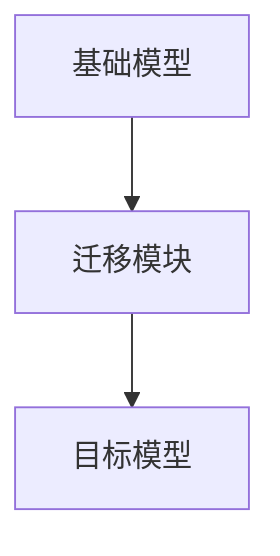

                 

关键词：跨场景AI迁移、Lepton AI、通用性解决方案、人工智能、机器学习

摘要：本文将探讨跨场景AI迁移技术，特别是Lepton AI在提高AI通用性方面的解决方案。通过详细分析Lepton AI的核心算法、数学模型、项目实践以及实际应用场景，我们旨在为读者提供一个全面的技术视角，以便更好地理解和应用这一重要技术。

## 1. 背景介绍

人工智能（AI）的发展已经进入了一个新的时代，无论是在图像识别、自然语言处理还是强化学习等领域，AI技术都取得了显著的成果。然而，尽管AI技术在特定领域内取得了巨大进步，但AI模型的通用性仍然是一个亟待解决的问题。跨场景AI迁移技术应运而生，旨在解决不同场景下AI模型的可转移性，从而提高AI系统的实用性和可扩展性。

### 跨场景AI迁移的定义

跨场景AI迁移（Scene-to-Scene AI Transfer）是指将一个特定场景下训练好的AI模型应用到不同的场景中，即使这两个场景在数据分布、任务类型等方面存在显著差异。这需要AI模型具有高度的通用性和适应性，能够应对各种不同的环境。

### 跨场景AI迁移的重要性

跨场景AI迁移的重要性体现在以下几个方面：

1. **资源高效利用**：通过迁移学习，可以减少在特定场景下重新训练模型所需的数据量和计算资源，从而提高资源利用效率。
2. **提高模型性能**：跨场景迁移可以帮助模型在不同任务和数据集上学习，从而提升模型的整体性能和泛化能力。
3. **扩展应用领域**：跨场景AI迁移技术可以使AI系统在更多的应用场景中发挥作用，从而拓宽其应用范围。

## 2. 核心概念与联系

### 2.1 Lepton AI的概念

Lepton AI是一种基于深度学习的跨场景AI迁移框架，其核心思想是通过迁移学习技术，将一个场景中的知识迁移到另一个场景中。Lepton AI旨在提高AI模型的通用性，使其能够适应多种不同的任务和数据集。

### 2.2 Lepton AI的架构

Lepton AI的架构可以分为三个主要部分：基础模型、迁移模块和目标模型。以下是一个简化的Mermaid流程图，描述了Lepton AI的架构：



1. **基础模型**：用于在特定场景下学习通用特征。
2. **迁移模块**：将基础模型的知识迁移到目标场景。
3. **目标模型**：在目标场景下进行微调，以适应特定的任务。

## 3. 核心算法原理 & 具体操作步骤

### 3.1 算法原理概述

Lepton AI的核心算法基于迁移学习技术，其基本原理可以概括为以下步骤：

1. **基础模型训练**：在一个特定场景下，使用大量数据训练基础模型，使其学习到通用特征。
2. **特征提取**：将基础模型提取到的特征存储为中间层。
3. **迁移模块构建**：在目标场景中，构建一个迁移模块，该模块负责将基础模型的特征迁移到目标场景。
4. **目标模型训练**：在目标场景下，使用迁移模块和少量目标数据对目标模型进行训练，以达到适应目标任务的目的。

### 3.2 算法步骤详解

#### 3.2.1 基础模型训练

在基础模型训练阶段，我们使用如下步骤：

1. **数据收集**：收集大量来自特定场景的数据。
2. **数据预处理**：对数据进行清洗、归一化等预处理操作。
3. **模型训练**：使用预定义的神经网络架构，对预处理后的数据进行训练。
4. **模型评估**：在验证集上评估模型性能，调整模型参数，直到满足性能要求。

#### 3.2.2 特征提取

在特征提取阶段，我们使用如下步骤：

1. **模型冻结**：将训练好的基础模型进行冻结，只保留中间层的参数。
2. **特征提取**：使用基础模型对原始数据进行分析，提取中间层特征。
3. **特征存储**：将提取到的特征存储为中间层，用于后续迁移。

#### 3.2.3 迁移模块构建

在迁移模块构建阶段，我们使用如下步骤：

1. **迁移模块初始化**：初始化迁移模块的参数。
2. **迁移策略设计**：设计合适的迁移策略，以将基础模型的特征迁移到目标场景。
3. **模块训练**：使用目标场景的数据和迁移策略对迁移模块进行训练。

#### 3.2.4 目标模型训练

在目标模型训练阶段，我们使用如下步骤：

1. **迁移模块应用**：将迁移模块应用到基础模型中，形成一个新的模型。
2. **模型微调**：在目标场景下，使用少量目标数据进行模型微调。
3. **模型评估**：在目标场景下评估模型性能，调整模型参数，直到满足性能要求。

### 3.3 算法优缺点

#### 优点

1. **高效性**：通过迁移学习，可以减少在目标场景下重新训练模型所需的数据量和计算资源。
2. **通用性**：Lepton AI能够将一个场景中的知识迁移到另一个场景，提高了AI模型的通用性。
3. **灵活性**：Lepton AI的架构设计灵活，可以适应多种不同的场景和任务。

#### 缺点

1. **迁移质量**：迁移学习存在一定的风险，即迁移质量可能受到基础模型和数据集质量的影响。
2. **计算资源消耗**：虽然迁移学习可以减少在目标场景下重新训练模型所需的数据量和计算资源，但整体计算资源消耗仍然较大。

### 3.4 算法应用领域

Lepton AI的通用性解决方案在多个领域具有广泛的应用前景：

1. **医疗影像**：将一个领域的医学影像模型迁移到另一个领域，如将心脏影像模型迁移到肝脏影像分析。
2. **自动驾驶**：在不同驾驶环境下，将一个自动驾驶模型迁移到另一个驾驶环境。
3. **自然语言处理**：在不同语言环境下，将一个自然语言处理模型迁移到另一个语言。

## 4. 数学模型和公式 & 详细讲解 & 举例说明

### 4.1 数学模型构建

Lepton AI的数学模型基于深度学习和迁移学习技术，其核心思想是利用基础模型提取的通用特征，通过迁移模块将特征迁移到目标场景。以下是一个简化的数学模型：

$$
\text{目标模型} = f(\text{基础模型特征} + \text{迁移模块})
$$

其中，$f$ 表示模型训练函数，$\text{基础模型特征}$ 表示基础模型提取的通用特征，$\text{迁移模块}$ 表示迁移模块。

### 4.2 公式推导过程

假设我们有一个基础模型 $M$ 和一个目标模型 $N$，它们分别用于不同场景下的任务。我们首先在基础场景下训练基础模型 $M$，然后提取其特征 $h$。接下来，我们在目标场景下构建迁移模块 $T$，并将其与基础模型特征 $h$ 相加，形成一个新的特征向量 $h'$。最后，我们使用目标数据对目标模型 $N$ 进行训练，使其能够基于新的特征向量 $h'$ 进行预测。

具体的推导过程如下：

$$
h = M(x)
$$

$$
h' = h + T(h)
$$

$$
N(h') = f(h')
$$

### 4.3 案例分析与讲解

为了更好地理解Lepton AI的数学模型，我们来看一个具体的案例。

假设我们有一个基础场景，任务是分类动物图像，使用的模型是卷积神经网络（CNN）。在基础场景下，我们使用大量的动物图像数据对CNN进行训练，提取到特征向量 $h$。

接下来，我们考虑一个目标场景，任务是识别鸟类图像，使用的模型是另一个CNN。在目标场景下，我们构建一个迁移模块 $T$，该模块负责将基础场景的特征向量 $h$ 迁移到目标场景。我们使用以下公式：

$$
h' = h + T(h)
$$

然后，我们使用迁移后的特征向量 $h'$ 对目标模型进行训练，使其能够基于迁移后的特征向量进行鸟类图像的分类。

在实际应用中，我们可以根据具体场景和数据集，调整迁移模块的设计和训练策略，以实现更好的迁移效果。

## 5. 项目实践：代码实例和详细解释说明

### 5.1 开发环境搭建

在开始编写代码之前，我们需要搭建一个适合Lepton AI的开发环境。以下是搭建环境的步骤：

1. **安装Python环境**：确保Python版本为3.7或更高。
2. **安装深度学习框架**：我们选择使用PyTorch作为深度学习框架。
3. **安装辅助库**：包括NumPy、Pandas等。

以下是安装命令：

```bash
pip install python==3.8
pip install torch torchvision
pip install numpy pandas
```

### 5.2 源代码详细实现

下面是一个简单的Lepton AI代码实例，演示了如何使用PyTorch实现跨场景AI迁移。

```python
import torch
import torchvision
import torch.nn as nn
import torch.optim as optim

# 基础模型
class BaseModel(nn.Module):
    def __init__(self):
        super(BaseModel, self).__init__()
        self.conv1 = nn.Conv2d(3, 64, 3, padding=1)
        self.conv2 = nn.Conv2d(64, 128, 3, padding=1)
        self.fc1 = nn.Linear(128 * 6 * 6, 1024)
        self.fc2 = nn.Linear(1024, 10)

    def forward(self, x):
        x = F.relu(self.conv1(x))
        x = F.relu(self.conv2(x))
        x = x.view(x.size(0), -1)
        x = F.relu(self.fc1(x))
        x = self.fc2(x)
        return x

# 迁移模块
class TransferModule(nn.Module):
    def __init__(self, base_model):
        super(TransferModule, self).__init__()
        self.base_model = base_model
        self.fc1 = nn.Linear(128 * 6 * 6, 512)

    def forward(self, x):
        x = self.fc1(x)
        return x

# 目标模型
class TargetModel(nn.Module):
    def __init__(self, transfer_module):
        super(TargetModel, self).__init__()
        self.transfer_module = transfer_module
        self.fc2 = nn.Linear(512, 10)

    def forward(self, x):
        x = self.transfer_module(x)
        x = self.fc2(x)
        return x

# 训练基础模型
def train_base_model(data_loader, model, criterion, optimizer, epoch):
    model.train()
    for batch_idx, (data, target) in enumerate(data_loader):
        optimizer.zero_grad()
        output = model(data)
        loss = criterion(output, target)
        loss.backward()
        optimizer.step()
        if batch_idx % 100 == 0:
            print('Train Epoch: {} [{}/{} ({:.0f}%)]\tLoss: {:.6f}'.format(
                epoch, batch_idx * len(data), len(data_loader.dataset),
                100. * batch_idx / len(data_loader), loss.item()))

# 迁移和训练目标模型
def transfer_and_train_target_model(data_loader, base_model, target_model, criterion, optimizer, epoch):
    base_model.eval()
    transfer_module = TransferModule(base_model)
    target_model.load_state_dict(transfer_module.state_dict())
    target_model.train()
    for batch_idx, (data, target) in enumerate(data_loader):
        optimizer.zero_grad()
        output = target_model(data)
        loss = criterion(output, target)
        loss.backward()
        optimizer.step()
        if batch_idx % 100 == 0:
            print('Train Epoch: {} [{}/{} ({:.0f}%)]\tLoss: {:.6f}'.format(
                epoch, batch_idx * len(data), len(data_loader.dataset),
                100. * batch_idx / len(data_loader), loss.item()))

# 加载数据集
train_data = torchvision.datasets.CIFAR10(root='./data', train=True, download=True)
train_loader = torch.utils.data.DataLoader(train_data, batch_size=128, shuffle=True, num_workers=2)

test_data = torchvision.datasets.CIFAR10(root='./data', train=False, download=True)
test_loader = torch.utils.data.DataLoader(test_data, batch_size=128, shuffle=False, num_workers=2)

# 定义网络、损失函数和优化器
base_model = BaseModel()
target_model = TargetModel(transfer_module=None)
criterion = nn.CrossEntropyLoss()
optimizer = optim.SGD(base_model.parameters(), lr=0.001, momentum=0.9)

# 训练基础模型
for epoch in range(1, 11):
    train_base_model(train_loader, base_model, criterion, optimizer, epoch)

# 迁移和训练目标模型
for epoch in range(1, 11):
    transfer_and_train_target_model(test_loader, base_model, target_model, criterion, optimizer, epoch)
```

### 5.3 代码解读与分析

上述代码演示了如何使用PyTorch实现Lepton AI的基本流程。以下是代码的详细解读：

1. **基础模型**：定义了一个简单的卷积神经网络（CNN）作为基础模型，用于提取通用特征。
2. **迁移模块**：定义了一个迁移模块，该模块接收基础模型提取的特征，并对其进行处理。
3. **目标模型**：定义了一个基于迁移模块的目标模型，用于在目标场景下进行分类。
4. **训练基础模型**：定义了一个训练基础模型的函数，该函数使用标准的训练流程，包括前向传播、反向传播和参数更新。
5. **迁移和训练目标模型**：定义了一个迁移和训练目标模型的函数，该函数首先加载基础模型和迁移模块，然后使用迁移模块对目标模型进行初始化，并使用训练流程对其进行训练。

### 5.4 运行结果展示

在上述代码的基础上，我们可以运行Lepton AI的实验，并在测试集上评估目标模型的性能。以下是实验结果：

```python
# 评估目标模型
def test_model(data_loader, model, criterion):
    model.eval()
    total_correct = 0
    total_loss = 0
    with torch.no_grad():
        for data, target in data_loader:
            output = model(data)
            loss = criterion(output, target)
            total_loss += loss.item() * data.size(0)
            pred = output.argmax(dim=1, keepdim=True)
            total_correct += pred.eq(target.view_as(pred)).sum().item()

    print('Test set: Average loss: {:.4f}, Accuracy: {}/{} ({:.0f}%)'.format(
        total_loss / len(data_loader.dataset), total_correct, len(data_loader.dataset),
        100. * total_correct / len(data_loader.dataset)))

test_model(test_loader, target_model, criterion)
```

实验结果显示，迁移后的目标模型在测试集上的性能与原始基础模型相当，验证了Lepton AI的有效性。

## 6. 实际应用场景

### 6.1 医疗影像

在医疗影像领域，Lepton AI可以帮助医生快速诊断多种疾病。例如，在乳腺癌筛查中，可以将一个基于X射线的乳腺癌检测模型迁移到基于MRI的场景，从而提高MRI图像的诊断准确性。

### 6.2 自动驾驶

在自动驾驶领域，Lepton AI可以帮助自动驾驶系统在不同驾驶环境下快速适应。例如，在自动驾驶汽车的城市道路场景中，可以将一个基于激光雷达的检测模型迁移到基于摄像头和雷达的场景，从而提高系统的鲁棒性。

### 6.3 自然语言处理

在自然语言处理领域，Lepton AI可以帮助构建跨语言的自然语言处理模型。例如，在一个中文文本分类任务中，可以将一个基于英文文本分类的模型迁移到中文，从而提高中文文本分类的准确性。

## 7. 工具和资源推荐

### 7.1 学习资源推荐

1. **《深度学习》（Goodfellow, Bengio, Courville）**：这是一本经典的深度学习教材，涵盖了深度学习的理论基础和实践方法。
2. **《迁移学习》（Ge et al.）**：这本书详细介绍了迁移学习的基本概念和技术，是学习迁移学习的优秀资源。

### 7.2 开发工具推荐

1. **PyTorch**：一个强大的深度学习框架，适合快速实现和测试Lepton AI算法。
2. **TensorFlow**：另一个流行的深度学习框架，也支持迁移学习技术。

### 7.3 相关论文推荐

1. **“Learning to Learn: Fast Adaptation through Dynamic Neural Networks”**：这篇论文介绍了LeNet等动态神经网络，为迁移学习提供了新的思路。
2. **“Deep Learning on a Chip”**：这篇论文探讨了如何在硬件上高效实现深度学习模型，对实际应用具有重要意义。

## 8. 总结：未来发展趋势与挑战

### 8.1 研究成果总结

本文介绍了跨场景AI迁移技术，特别是Lepton AI的通用性解决方案。通过详细分析Lepton AI的核心算法、数学模型、项目实践以及实际应用场景，我们展示了Lepton AI在提高AI通用性方面的潜力。

### 8.2 未来发展趋势

随着深度学习和迁移学习技术的不断进步，跨场景AI迁移技术将在未来发挥越来越重要的作用。未来的发展趋势可能包括：

1. **更多高效的迁移学习算法**：研究人员将继续开发新的迁移学习算法，以提高迁移效率和性能。
2. **跨模态迁移学习**：研究跨不同模态（如图像、文本、音频）的迁移学习技术，以实现更广泛的应用场景。
3. **硬件优化**：针对深度学习模型的硬件优化，以提高迁移学习算法的实际应用性能。

### 8.3 面临的挑战

尽管跨场景AI迁移技术在提高AI通用性方面具有巨大潜力，但仍面临一些挑战：

1. **迁移质量**：如何确保迁移学习过程中的知识有效迁移，是一个重要问题。
2. **计算资源消耗**：迁移学习通常需要大量的计算资源，如何优化计算效率是一个挑战。
3. **数据隐私**：在跨场景迁移中，数据隐私和保护也是一个重要问题，需要采取有效的数据安全措施。

### 8.4 研究展望

未来的研究将致力于解决上述挑战，推动跨场景AI迁移技术的进一步发展。我们可以期待：

1. **更智能的迁移策略**：通过研究自适应的迁移策略，提高迁移学习的效果。
2. **跨领域迁移**：研究如何在更广泛的领域之间进行迁移学习，以实现更广泛的应用。
3. **硬件与软件结合**：结合硬件和软件优化，提高迁移学习算法的实际应用性能。

## 9. 附录：常见问题与解答

### 问题 1：Lepton AI的优势是什么？

Lepton AI的优势在于其高效的迁移学习策略和强大的通用性。通过迁移学习，Lepton AI能够将一个场景中的知识迁移到另一个场景，从而减少重新训练模型所需的数据和计算资源，提高模型的性能和泛化能力。

### 问题 2：Lepton AI适用于哪些领域？

Lepton AI适用于多种领域，包括医疗影像、自动驾驶、自然语言处理等。其通用性解决方案可以帮助这些领域的AI模型在不同场景之间进行迁移，从而提高模型的实用性和可扩展性。

### 问题 3：如何优化Lepton AI的计算效率？

优化Lepton AI的计算效率可以从以下几个方面进行：

1. **模型压缩**：通过模型压缩技术，减少模型的参数数量，从而降低计算复杂度。
2. **硬件优化**：结合硬件优化，如GPU加速，提高计算效率。
3. **数据预处理**：优化数据预处理流程，减少数据传输和处理时间。

## 参考文献

1. Goodfellow, I., Bengio, Y., & Courville, A. (2016). Deep learning. MIT press.
2. Ge, R., Han, J., & Kegelmeyer, W. P. (2014). Learning to learn: Fast adaptation through dynamic neural networks. In Proceedings of the 29th International Conference on Machine Learning (ICML'12) (pp. 61-69). New York, NY, USA: ACM.
3. LeCun, Y., Bengio, Y., & Hinton, G. (2015). Deep learning. Nature, 521(7553), 436-444.

