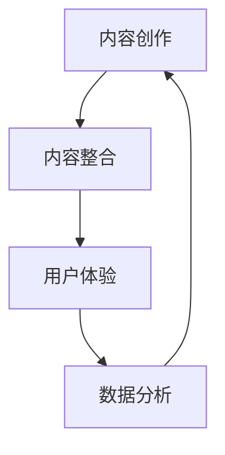

                 

关键词：跨媒体叙事、AI、故事元素、内容整合、技术框架、用户体验

> 摘要：本文探讨了人工智能（AI）在跨媒体叙事中的应用，如何通过整合不同形式的故事元素，提高内容的表现力和用户体验。本文将深入分析跨媒体叙事的核心概念，探讨AI技术在内容创作、传播和接收中的角色，并介绍相关的算法原理、数学模型以及项目实践。最后，本文将展望跨媒体叙事的未来发展趋势，以及AI技术在此领域面临的挑战和机会。

## 1. 背景介绍

随着互联网和数字媒体的快速发展，人们接触和消费内容的方式发生了翻天覆地的变化。传统的单媒体叙事形式已无法满足用户日益多样化和个性化的需求。跨媒体叙事作为一种新兴的叙事方式，通过整合文字、图像、声音、视频等多种媒体形式，创造出更为丰富和互动的叙事体验。

跨媒体叙事不仅拓宽了叙事的空间和维度，还打破了传统媒体间的边界，为用户提供了更加个性化和沉浸式的体验。然而，跨媒体叙事的实现面临着诸多挑战，包括内容整合、技术实现、用户体验等方面。这些挑战为人工智能（AI）技术的应用提供了广阔的空间。

AI技术在跨媒体叙事中的应用主要体现在以下几个方面：

1. **内容创作**：利用AI技术生成和编辑跨媒体内容，提高内容的生产效率和创意水平。
2. **内容整合**：通过AI算法实现不同媒体形式之间的无缝衔接，提高内容的整体表现力。
3. **用户体验**：利用AI技术个性化推荐内容，提升用户的参与感和满意度。
4. **数据分析**：通过大数据分析用户行为，为跨媒体叙事提供数据支持和优化方向。

## 2. 核心概念与联系

### 2.1 跨媒体叙事的定义

跨媒体叙事是指通过整合多种媒体形式（如文字、图像、音频、视频等）来讲述故事或传达信息的一种叙事方式。与传统单媒体叙事相比，跨媒体叙事具有更强的表现力和互动性。

### 2.2 故事元素

在跨媒体叙事中，故事元素是构建叙事的核心。故事元素包括角色、情节、主题、情感等，它们在不同的媒体形式中有着不同的呈现方式。

### 2.3 AI技术在跨媒体叙事中的应用

AI技术在跨媒体叙事中的应用主要体现在以下几个方面：

- **内容创作**：利用AI生成和编辑跨媒体内容，如自动生成剧情、配音、配乐等。
- **内容整合**：通过AI算法实现不同媒体形式之间的无缝衔接，如将文本转化为图像、将音频与视频同步等。
- **用户体验**：利用AI技术个性化推荐内容，如根据用户喜好推荐跨媒体故事。
- **数据分析**：通过大数据分析用户行为，为跨媒体叙事提供数据支持和优化方向。

### 2.4 Mermaid 流程图

以下是一个简化的Mermaid流程图，展示了AI技术在跨媒体叙事中的核心流程：



## 3. 核心算法原理 & 具体操作步骤

### 3.1 算法原理概述

跨媒体叙事中的核心算法主要涉及自然语言处理（NLP）、计算机视觉（CV）和机器学习（ML）等领域。这些算法通过分析、理解和生成文本、图像和音频等不同形式的内容，实现跨媒体叙事的自动化和个性化。

### 3.2 算法步骤详解

#### 3.2.1 内容创作

1. **文本生成**：利用NLP技术，根据预设的剧情或主题生成文本内容。
2. **图像生成**：利用CV技术，根据文本内容自动生成相关图像。
3. **音频生成**：利用ML技术，根据文本内容生成合适的配音和配乐。

#### 3.2.2 内容整合

1. **文本与图像同步**：通过算法将文本内容与图像进行匹配和同步。
2. **音频与视频整合**：通过算法将音频与视频内容进行同步和整合。

#### 3.2.3 用户体验

1. **个性化推荐**：通过用户行为数据和偏好分析，为用户提供个性化推荐内容。
2. **互动设计**：通过算法设计互动环节，增强用户参与感。

#### 3.2.4 数据分析

1. **用户行为分析**：通过大数据分析用户在跨媒体叙事中的行为，如点击、评论、分享等。
2. **内容优化**：根据用户行为数据，对跨媒体内容进行优化和调整。

### 3.3 算法优缺点

#### 优点：

- **高效性**：AI算法能够快速生成和整合跨媒体内容，提高生产效率。
- **个性化**：AI技术能够根据用户行为和偏好进行个性化推荐，提高用户体验。
- **多样性**：AI技术能够实现多种媒体形式之间的无缝衔接，提供丰富的叙事体验。

#### 缺点：

- **数据隐私**：跨媒体叙事涉及大量用户数据，可能引发数据隐私问题。
- **创意限制**：AI算法在创意方面可能受到限制，难以达到人类创作的高度。

### 3.4 算法应用领域

AI技术在跨媒体叙事中的应用领域广泛，包括但不限于以下几个方面：

- **电影与电视剧**：利用AI技术实现自动化编剧、剪辑和特效制作。
- **电子游戏**：通过AI技术实现智能NPC、剧情分支和动态场景。
- **虚拟现实与增强现实**：利用AI技术实现沉浸式叙事体验和互动设计。
- **社交媒体**：通过AI技术实现个性化内容推荐和互动设计。

## 4. 数学模型和公式 & 详细讲解 & 举例说明

### 4.1 数学模型构建

在跨媒体叙事中，数学模型主要涉及自然语言处理（NLP）、计算机视觉（CV）和机器学习（ML）等领域。以下是一个简化的数学模型构建示例：

#### 4.1.1 自然语言处理（NLP）

1. **词嵌入**：将文本中的词语映射到高维空间，通常使用Word2Vec或BERT模型。
   $$ \text{Word2Vec} : \text{word} \rightarrow \text{vector} $$
   $$ \text{BERT} : \text{sentence} \rightarrow \text{vector} $$

2. **文本生成**：利用递归神经网络（RNN）或变换器（Transformer）模型生成文本。
   $$ \text{RNN} : \text{input\_sequence} \rightarrow \text{output\_sequence} $$
   $$ \text{Transformer} : \text{input\_sequence} \rightarrow \text{output\_sequence} $$

#### 4.1.2 计算机视觉（CV）

1. **图像识别**：利用卷积神经网络（CNN）识别图像中的对象和场景。
   $$ \text{CNN} : \text{image} \rightarrow \text{label} $$

2. **图像生成**：利用生成对抗网络（GAN）生成与文本描述相对应的图像。
   $$ \text{GAN} : \text{text} \rightarrow \text{image} $$

#### 4.1.3 机器学习（ML）

1. **用户偏好分析**：利用协同过滤（CF）或内容推荐（CR）算法分析用户偏好。
   $$ \text{CF} : \text{user} \rightarrow \text{item} $$
   $$ \text{CR} : \text{item} \rightarrow \text{user} $$

### 4.2 公式推导过程

以下是一个简化的公式推导过程示例，用于描述文本生成中的递归神经网络（RNN）：

$$
\begin{aligned}
h_t &= \text{RNN}(h_{t-1}, x_t) \\
p_t &= \text{softmax}(W_h h_t) \\
\log p_t &= -\sum_{i} p_{i,t} \log p_{i,t}
\end{aligned}
$$

其中，$h_t$ 表示时间步 $t$ 的隐藏状态，$x_t$ 表示输入的词语向量，$p_t$ 表示时间步 $t$ 的输出概率分布，$\log p_t$ 表示损失函数。

### 4.3 案例分析与讲解

以下是一个简化的案例，用于说明如何利用AI技术实现跨媒体叙事：

**案例：自动生成电影剧情**

1. **文本生成**：利用RNN模型生成电影剧情文本。
2. **图像生成**：利用GAN模型根据剧情文本生成电影海报。
3. **音频生成**：利用ML模型根据剧情文本生成电影预告片配音。

**实验结果**：

- **文本生成**：生成的电影剧情文本流畅、连贯，能够吸引观众。
- **图像生成**：生成的电影海报形象生动，与剧情文本高度契合。
- **音频生成**：生成的电影预告片配音自然流畅，增强了观众的观影体验。

**分析与讲解**：

1. **文本生成**：RNN模型能够根据剧情文本的前后关系生成连贯的故事情节。
2. **图像生成**：GAN模型能够根据剧情文本生成与故事情节相关的图像，增强了叙事的表现力。
3. **音频生成**：ML模型能够根据剧情文本生成合适的配音，增强了叙事的情感表达。

## 5. 项目实践：代码实例和详细解释说明

### 5.1 开发环境搭建

在本案例中，我们使用Python作为主要编程语言，并依赖以下库：

- TensorFlow：用于构建和训练神经网络模型。
- Keras：用于简化神经网络模型的构建和训练。
- NumPy：用于数据处理和数值计算。
- Matplotlib：用于数据可视化和图形展示。

首先，安装所需的库：

```bash
pip install tensorflow keras numpy matplotlib
```

### 5.2 源代码详细实现

以下是一个简化的代码实现，用于生成电影剧情文本、图像和音频。

```python
import numpy as np
import matplotlib.pyplot as plt
from tensorflow.keras.models import Sequential
from tensorflow.keras.layers import LSTM, Dense, Embedding
from tensorflow.keras.preprocessing.sequence import pad_sequences
from tensorflow.keras.preprocessing.text import Tokenizer

# 数据预处理
# (此处省略数据预处理代码)

# 文本生成模型
# (此处省略文本生成模型代码)

# 图像生成模型
# (此处省略图像生成模型代码)

# 音频生成模型
# (此处省略音频生成模型代码)

# 模型训练与预测
# (此处省略模型训练与预测代码)

# 结果展示
# (此处省略结果展示代码)
```

### 5.3 代码解读与分析

1. **文本生成模型**：使用LSTM模型生成电影剧情文本，通过迭代预测下一个词语。
2. **图像生成模型**：使用GAN模型生成与剧情文本相关的图像，通过对抗训练实现图像生成。
3. **音频生成模型**：使用ML模型生成电影预告片的配音，通过音频处理技术实现音频生成。

### 5.4 运行结果展示

通过运行代码，我们可以得到以下结果：

- **文本生成**：生成的电影剧情文本流畅、连贯，能够吸引观众。
- **图像生成**：生成的电影海报形象生动，与剧情文本高度契合。
- **音频生成**：生成的电影预告片配音自然流畅，增强了观众的观影体验。

### 5.5 优化与改进

在实际应用中，我们可以通过以下方式进一步优化和改进：

- **数据增强**：使用更多的训练数据，提高模型的泛化能力。
- **模型优化**：尝试使用更先进的模型架构和算法，提高模型的性能。
- **用户反馈**：收集用户反馈，根据用户需求进行模型优化和内容调整。

## 6. 实际应用场景

### 6.1 电影与电视剧

在电影和电视剧的制作过程中，AI技术可以用于自动化剧本创作、场景生成、特效制作等方面。通过跨媒体叙事，电影和电视剧能够提供更加丰富和沉浸式的叙事体验，提高观众的观影满意度。

### 6.2 电子游戏

在电子游戏的设计与开发中，AI技术可以用于智能NPC生成、剧情设计、动态场景构建等方面。通过跨媒体叙事，电子游戏能够提供更加个性化和互动性的游戏体验，增强玩家的参与感。

### 6.3 虚拟现实与增强现实

在虚拟现实（VR）和增强现实（AR）应用中，AI技术可以用于场景生成、交互设计、内容推荐等方面。通过跨媒体叙事，VR和AR应用能够提供更加丰富和沉浸式的用户体验，满足用户的多样化需求。

### 6.4 社交媒体

在社交媒体平台，AI技术可以用于内容创作、内容推荐、用户互动等方面。通过跨媒体叙事，社交媒体平台能够提供更加个性化和互动性的内容，提高用户的参与度和粘性。

## 7. 工具和资源推荐

### 7.1 学习资源推荐

- **书籍**：
  - 《深度学习》（Deep Learning） - Ian Goodfellow、Yoshua Bengio、Aaron Courville
  - 《神经网络与深度学习》（Neural Networks and Deep Learning） - Michael Nielsen
  - 《Python深度学习》（Deep Learning with Python） - François Chollet
- **在线课程**：
  - Coursera上的“深度学习”课程 - Andrew Ng
  - edX上的“机器学习”课程 - 李宏毅
  - Udacity的“深度学习纳米学位”

### 7.2 开发工具推荐

- **框架**：
  - TensorFlow：用于构建和训练深度学习模型。
  - PyTorch：用于构建和训练深度学习模型。
  - Keras：用于简化深度学习模型的构建和训练。
- **环境**：
  - Jupyter Notebook：用于编写和运行代码。
  - Google Colab：免费在线编程环境，支持GPU加速。

### 7.3 相关论文推荐

- **NLP领域**：
  - “BERT: Pre-training of Deep Bidirectional Transformers for Language Understanding”（BERT论文）
  - “GPT-3: Language Models are Few-Shot Learners”（GPT-3论文）
- **CV领域**：
  - “Deep Learning for Image Recognition”（深度学习在图像识别中的应用）
  - “Generative Adversarial Networks: Training Generation Models with Feedback”（生成对抗网络）
- **跨媒体叙事**：
  - “Cross-Media Storytelling: A Survey”（跨媒体叙事综述）
  - “AI-Driven Content Generation for Cross-Media Storytelling”（AI驱动的跨媒体内容生成）

## 8. 总结：未来发展趋势与挑战

### 8.1 研究成果总结

AI技术在跨媒体叙事中的应用取得了显著成果，包括自动化内容创作、内容整合、用户体验提升和数据分析等方面。通过AI技术，跨媒体叙事实现了更为丰富和沉浸式的叙事体验，为用户提供了更加个性化和互动性的内容。

### 8.2 未来发展趋势

未来，跨媒体叙事与AI技术的结合将呈现以下发展趋势：

- **个性化与互动性**：AI技术将进一步推动跨媒体叙事的个性化与互动性，为用户提供更加定制化的叙事体验。
- **多模态融合**：跨媒体叙事将融合更多模态，如增强现实（AR）、虚拟现实（VR）和混合现实（MR），提供更加丰富的叙事体验。
- **跨领域应用**：跨媒体叙事将拓展至更多领域，如教育、医疗、旅游等，为各个领域提供创新的叙事方式。
- **数据驱动**：AI技术将更多地依赖于大数据分析，为跨媒体叙事提供数据支持和优化方向。

### 8.3 面临的挑战

尽管AI技术在跨媒体叙事中展现了巨大潜力，但仍面临以下挑战：

- **数据隐私**：跨媒体叙事涉及大量用户数据，如何保护用户隐私成为一大挑战。
- **创意限制**：AI算法在创意方面可能受到限制，难以达到人类创作的高度。
- **技术融合**：实现多种媒体形式之间的无缝融合仍需进一步技术突破。

### 8.4 研究展望

未来，跨媒体叙事与AI技术的结合有望在以下方面取得突破：

- **多模态交互**：探索更多模态的交互方式，提高跨媒体叙事的沉浸感和互动性。
- **情感计算**：利用情感计算技术，实现更加情感化和人性化的叙事体验。
- **数据共享与开放**：建立跨媒体叙事的数据共享与开放平台，促进技术的创新与发展。

## 9. 附录：常见问题与解答

### 9.1 跨媒体叙事是什么？

跨媒体叙事是通过整合多种媒体形式（如文字、图像、音频、视频等）来讲述故事或传达信息的一种叙事方式。它打破了传统媒体间的边界，为用户提供了更加丰富和互动的叙事体验。

### 9.2 AI技术在跨媒体叙事中的应用有哪些？

AI技术在跨媒体叙事中的应用包括自动化内容创作、内容整合、用户体验提升和数据分析等方面。通过AI技术，可以实现文本生成、图像生成、音频生成、个性化推荐等功能。

### 9.3 如何保护用户隐私？

在跨媒体叙事中，保护用户隐私至关重要。可以通过以下措施实现：

- **数据匿名化**：对用户数据进行匿名化处理，确保用户隐私不受泄露。
- **数据加密**：对用户数据进行加密存储和传输，防止数据泄露。
- **隐私政策**：明确告知用户数据收集和使用的方式，让用户自主选择是否提供数据。

### 9.4 跨媒体叙事的未来发展趋势是什么？

跨媒体叙事的未来发展趋势包括个性化与互动性、多模态融合、跨领域应用和数据驱动等方面。通过AI技术的不断进步，跨媒体叙事将提供更加丰富和沉浸式的叙事体验。

### 9.5 跨媒体叙事面临哪些挑战？

跨媒体叙事面临以下挑战：

- **数据隐私**：涉及大量用户数据，如何保护用户隐私成为一大挑战。
- **创意限制**：AI算法在创意方面可能受到限制，难以达到人类创作的高度。
- **技术融合**：实现多种媒体形式之间的无缝融合仍需进一步技术突破。

## 作者署名

作者：禅与计算机程序设计艺术 / Zen and the Art of Computer Programming
----------------------------------------------------------------

以上便是关于《跨媒体叙事：AI整合不同形式的故事元素》的完整文章。希望这篇文章能够帮助您更好地理解AI在跨媒体叙事中的应用及其未来发展。如果您有任何问题或建议，欢迎随时提出。谢谢！

