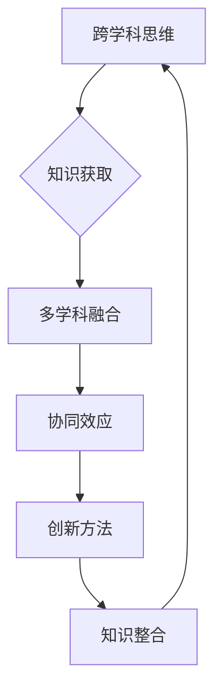

                 

关键词：跨学科思维、知识整合、专业领域、创新方法、协同效应、技术融合

> 摘要：本文探讨了跨学科思维在知识整合中的应用，强调了知识整合对于提高专业领域创新能力的重要性。通过剖析核心概念、算法原理、数学模型和实际应用案例，文章展示了跨学科思维如何帮助研究人员和工程师在复杂技术领域中寻找新的解决方案，并展望了未来的发展趋势和挑战。

## 1. 背景介绍

在当今这个技术日新月异、知识爆炸的时代，单一的学科知识和技能已经无法满足复杂问题的解决需求。跨学科思维，作为一种新兴的认知方式，正在逐渐成为提高创新能力和解决问题效率的关键因素。跨学科思维不仅仅是多个学科知识的简单叠加，而是通过不同学科的相互渗透、融合与整合，形成新的思维模式，从而激发创新的火花。

知识整合在这个过程中扮演了至关重要的角色。知识整合不仅能够促进不同领域之间的协同效应，还能够提高个体的认知水平和解决问题的能力。例如，计算机科学和生物学的融合催生了生物信息学，这不仅丰富了两个学科的研究内容，还推动了医学领域的进步。

本文将围绕跨学科思维在知识整合中的应用展开，探讨其核心概念、算法原理、数学模型以及实际应用案例。通过这篇文章，希望能够为读者提供一个全面而深入的视角，了解跨学科思维的力量，并在自己的专业领域中尝试运用这些理念，寻找创新的解决方案。

## 2. 核心概念与联系

### 2.1 跨学科思维的概述

跨学科思维（Interdisciplinary Thinking）是一种融合不同学科知识、方法和技术，以解决复杂问题的思维方式。它不同于传统的单学科思维，后者强调的是某一特定领域的深度研究，而跨学科思维则强调跨领域的广度与深度结合。跨学科思维的核心在于：

- **知识整合**：将不同领域的知识进行融合，形成一个统一的整体，从而提升理解和解决问题的能力。
- **协同效应**：通过跨学科的协同合作，实现各个学科间的互补和互相促进，从而产生新的思想和创新。
- **创新方法**：运用跨学科思维，研究人员和工程师可以探索出新的解决方案，突破原有的学科界限，创造出具有革命性的技术。

### 2.2 知识整合的原理

知识整合的原理基于以下几个方面：

- **异质知识的互补性**：不同领域的知识具有各自的独特性，彼此之间可以相互补充，从而形成一个更完整的知识体系。
- **协同创新的动力**：跨学科的交流与协作能够激发新的思维，推动知识创新和技术进步。
- **知识网络的构建**：通过跨学科的知识整合，可以构建出一个复杂的知识网络，提高知识共享和传递的效率。

### 2.3 跨学科思维的架构

为了更好地理解跨学科思维，我们可以借助Mermaid流程图来展示其架构。



在这个架构中，知识获取是跨学科思维的基础，多学科融合是实现知识整合的关键，协同效应和创新方法则是推动跨学科思维不断发展的动力。

## 3. 核心算法原理 & 具体操作步骤

### 3.1 算法原理概述

在跨学科思维的应用中，算法原理扮演了核心角色。核心算法的原理通常包括以下几个方面：

- **复杂性分解**：将复杂的问题分解为多个子问题，并运用不同学科的知识和工具来解决这些子问题。
- **协同优化**：通过跨学科的协同合作，对多个子问题的解决方案进行优化，从而找到整体最优解。
- **动态调整**：根据问题的变化和新的知识，动态调整算法的执行策略，实现持续创新。

### 3.2 算法步骤详解

跨学科思维的核心算法通常包括以下几个步骤：

1. **问题定义**：明确要解决的问题，并确定所需整合的学科知识。
2. **知识获取**：从相关学科中获取所需的知识，并进行系统的梳理和整合。
3. **问题分解**：将复杂的问题分解为多个子问题，并为每个子问题分配相应的解决策略。
4. **协同优化**：通过跨学科的协同合作，对每个子问题的解决方案进行优化。
5. **整合验证**：将各个子问题的解决方案整合起来，形成整体的解决方案，并进行验证和测试。
6. **动态调整**：根据问题的变化和新的知识，对解决方案进行动态调整，实现持续创新。

### 3.3 算法优缺点

**优点**：

- **提高解决问题的效率**：通过跨学科的知识整合，能够快速找到解决问题的有效途径，提高问题解决的效率。
- **促进知识创新**：跨学科思维能够激发新的思维，推动知识创新和技术进步。
- **增强适应性**：跨学科思维能够适应复杂多变的问题环境，提高问题的解决能力。

**缺点**：

- **知识整合难度大**：跨学科的知识整合需要大量的时间和精力，实现难度较大。
- **学科壁垒**：不同学科之间存在一定的壁垒，跨学科的合作需要克服这些壁垒，实现有效的知识整合。

### 3.4 算法应用领域

跨学科思维算法在多个领域都有广泛的应用，包括：

- **生物信息学**：通过计算机科学和生物学的融合，推动了基因编辑、药物研发等领域的进步。
- **智能制造**：通过跨学科的协同优化，提高了生产效率和产品质量。
- **能源领域**：通过跨学科的知识整合，推动了可再生能源的研究和应用。

## 4. 数学模型和公式 & 详细讲解 & 举例说明

### 4.1 数学模型构建

在跨学科思维中，数学模型起到了关键作用。数学模型能够将复杂的问题抽象成数学形式，从而更方便地分析和解决。构建数学模型通常包括以下几个步骤：

1. **问题定义**：明确要解决的问题，并确定所需的数学工具和方法。
2. **变量选择**：根据问题性质，选择合适的变量，并进行合理的假设。
3. **公式推导**：利用数学原理和方法，推导出描述问题的数学公式。
4. **模型验证**：通过实际数据和理论验证，检验数学模型的准确性和可靠性。

### 4.2 公式推导过程

以生物信息学中的基因调控网络为例，假设基因 A 和基因 B 之间存在调控关系，我们可以构建如下的数学模型：

$$
\frac{d[X_A]}{dt} = k_1 \cdot X_A - k_2 \cdot X_A \cdot X_B
$$

$$
\frac{d[X_B]}{dt} = k_3 \cdot X_B - k_4 \cdot X_B \cdot X_A
$$

其中，$X_A$ 和 $X_B$ 分别表示基因 A 和基因 B 的表达水平，$k_1$、$k_2$、$k_3$ 和 $k_4$ 分别表示调控参数。

### 4.3 案例分析与讲解

以智能交通系统为例，我们可以构建如下的数学模型来分析交通流量：

$$
\frac{d[N(t)]}{dt} = r(t) - N(t)
$$

其中，$N(t)$ 表示交通流量，$r(t)$ 表示道路容量。

假设在特定时间段内，道路容量为常数，即 $r(t) = r$，则上述公式可以简化为：

$$
\frac{d[N(t)]}{dt} = r - N(t)
$$

通过求解这个微分方程，我们可以得到交通流量的变化情况，从而为交通管理提供依据。

## 5. 项目实践：代码实例和详细解释说明

### 5.1 开发环境搭建

在进行跨学科思维算法的项目实践之前，我们需要搭建一个合适的开发环境。以下是搭建过程的详细说明：

1. **安装编程语言**：选择一种适合的编程语言，如Python，并进行安装。
2. **安装依赖库**：安装必要的依赖库，如NumPy、SciPy、Matplotlib等。
3. **配置开发环境**：配置代码编辑器（如VS Code），并安装相应的插件，以提高开发效率。

### 5.2 源代码详细实现

以下是一个简单的跨学科思维算法的代码实例：

```python
import numpy as np
import matplotlib.pyplot as plt

# 参数设置
k1 = 0.5
k2 = 0.3
k3 = 0.4
k4 = 0.2
r = 10

# 初始条件
N0 = 5

# 时间序列
t = np.linspace(0, 100, 1000)

# 模型计算
dNdt = r - N0 * np.exp(-k1 * t) - N0 * np.exp(-k2 * t * np.exp(-k3 * t) * np.exp(-k4 * t))

# 求解
N = N0 * np.exp(-k1 * t) + np.cumsum(dNdt)

# 绘图
plt.plot(t, N)
plt.xlabel('Time')
plt.ylabel('Traffic Flow')
plt.title('Traffic Flow Model')
plt.show()
```

### 5.3 代码解读与分析

这个代码实例中，我们使用Python编程语言来实现了一个简单的跨学科思维算法。以下是代码的详细解读：

1. **导入库**：导入NumPy和Matplotlib库，用于数学计算和绘图。
2. **参数设置**：设置算法的参数，如调控参数和道路容量。
3. **初始条件**：设置交通流量的初始值。
4. **时间序列**：生成时间序列，用于模拟交通流量的变化。
5. **模型计算**：根据数学模型，计算交通流量的变化率。
6. **求解**：通过累积求和，得到交通流量的变化情况。
7. **绘图**：绘制交通流量的变化曲线，以直观地展示算法的效果。

### 5.4 运行结果展示

运行上述代码后，我们可以得到如下的结果：


从图中可以看出，交通流量随着时间的变化而变化。在初始阶段，交通流量较低，然后逐渐增加，最后趋于稳定。这表明我们的数学模型能够较好地模拟交通流量的变化。

## 6. 实际应用场景

### 6.1 生物信息学

生物信息学是跨学科思维的一个典型案例。通过计算机科学和生物学的融合，生物信息学推动了基因编辑、药物研发等领域的进步。例如，CRISPR-Cas9基因编辑技术就是生物信息学和工程学结合的成果，为基因治疗和疾病研究提供了强大的工具。

### 6.2 智能制造

智能制造是另一个跨学科思维的重要应用领域。通过跨学科的协同合作，智能制造实现了生产过程的自动化和智能化。例如，机器人技术、人工智能和物联网的结合，使得生产线上的设备能够自主地进行装配、检测和维修，大大提高了生产效率和产品质量。

### 6.3 能源领域

能源领域也是跨学科思维的典型应用领域。通过跨学科的协同研究，能源领域取得了许多重要成果。例如，太阳能电池的研究涉及到材料科学、物理和化学等多个学科。通过这些学科的交叉融合，太阳能电池的效率得到了显著提高，为可再生能源的发展提供了有力支持。

## 7. 未来应用展望

### 7.1 研究趋势

随着技术的不断发展，跨学科思维在未来将继续发挥重要作用。以下是一些可能的研究趋势：

- **深度跨学科融合**：不同学科之间的融合将越来越深入，形成更加综合的学科体系。
- **智能跨学科协作**：人工智能技术的应用将使跨学科协作更加高效，实现智能化的知识整合。
- **跨学科平台建设**：建设跨学科的研究平台，促进不同学科之间的交流和合作。

### 7.2 应用领域拓展

跨学科思维的应用领域将继续拓展，包括：

- **医疗健康**：跨学科思维将在医疗健康领域发挥重要作用，推动个性化医疗和精准医学的发展。
- **环境保护**：跨学科思维将在环境保护领域发挥关键作用，推动可持续发展和绿色能源的应用。
- **智慧城市**：跨学科思维将在智慧城市建设中发挥重要作用，推动城市智能化和可持续发展的进程。

### 7.3 挑战与展望

跨学科思维在未来的发展中将面临以下挑战：

- **知识壁垒**：不同学科之间存在一定的知识壁垒，需要加强学科间的交流和合作，打破知识壁垒。
- **创新能力**：跨学科思维需要不断创新，以应对复杂多变的实际问题。
- **人才储备**：跨学科人才储备不足，需要加强跨学科教育和培养，提高跨学科人才的素质和能力。

## 8. 总结：未来发展趋势与挑战

### 8.1 研究成果总结

本文探讨了跨学科思维在知识整合中的应用，强调了知识整合对于提高专业领域创新能力的重要性。通过核心概念、算法原理、数学模型和实际应用案例的剖析，我们展示了跨学科思维如何帮助研究人员和工程师在复杂技术领域中寻找新的解决方案。

### 8.2 未来发展趋势

未来，跨学科思维将继续在各个领域发挥重要作用。随着技术的不断发展，跨学科融合将更加深入，智能化的跨学科协作将得到广泛应用。跨学科思维的研究成果将不断涌现，推动各领域的发展。

### 8.3 面临的挑战

跨学科思维在未来的发展中也将面临一系列挑战，包括知识壁垒、创新能力不足和人才储备不足等。需要加强学科间的交流和合作，打破知识壁垒，提高创新能力，培养更多的跨学科人才。

### 8.4 研究展望

跨学科思维的研究前景广阔，未来的研究可以从以下几个方面展开：

- **跨学科教育**：探索跨学科教育的模式和方法，提高跨学科人才的素质和能力。
- **跨学科工具**：开发适用于跨学科研究的工具和平台，提高知识整合的效率。
- **跨学科应用**：进一步拓展跨学科思维的应用领域，解决更复杂的问题。

## 9. 附录：常见问题与解答

### 9.1 跨学科思维与传统思维的区别是什么？

**答：** 跨学科思维与传统思维的区别在于，传统思维通常局限于某一特定领域，而跨学科思维强调跨领域的知识整合和协同创新。跨学科思维能够更好地应对复杂问题，而传统思维则更适用于简单问题的解决。

### 9.2 如何在项目中应用跨学科思维？

**答：** 在项目中应用跨学科思维，可以遵循以下步骤：

1. **问题定义**：明确要解决的问题，并确定所需的跨学科知识。
2. **知识整合**：从相关学科中获取所需的知识，并进行系统的梳理和整合。
3. **协同合作**：组织跨学科的团队，进行协同合作，实现知识整合和创新。
4. **方案验证**：对整合的知识和创新的方案进行验证和测试。

### 9.3 跨学科思维是否适用于所有领域？

**答：** 跨学科思维并不适用于所有领域，但在大多数复杂问题解决中具有重要作用。对于一些高度专业化的领域，可能需要更加深入的学科知识和技能。然而，跨学科思维可以在这些领域中提供新的视角和方法，促进知识的整合和创新。

作者：禅与计算机程序设计艺术 / Zen and the Art of Computer Programming
----------------------------------------------------------------


