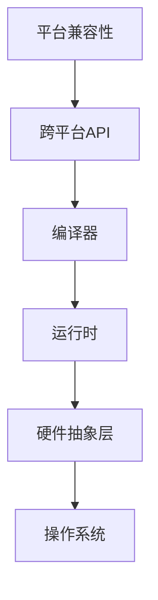

                 

关键词：跨平台AI应用，兼容性，Lepton AI，策略

摘要：本文将深入探讨Lepton AI的兼容性策略，旨在为开发者在构建跨平台人工智能应用时提供实用的指导和策略。我们将从背景介绍、核心概念与联系、核心算法原理、数学模型和公式、项目实践、实际应用场景、工具和资源推荐、总结以及未来发展趋势与挑战等多个方面进行详细阐述。

## 1. 背景介绍

随着人工智能技术的快速发展，越来越多的应用场景需要跨平台的支持。然而，不同操作系统和硬件环境之间的差异给跨平台AI应用的开发带来了巨大的挑战。Lepton AI作为一种新兴的跨平台AI框架，其兼容性策略尤为重要。本文将重点讨论Lepton AI如何通过一系列策略，实现跨平台的兼容性，从而为开发者提供更加便捷的AI开发体验。

### 1.1 AI应用的发展现状

近年来，人工智能（AI）在各个领域取得了显著的进展，从图像识别、自然语言处理到自动化决策系统，AI的应用场景越来越广泛。随着这些应用的不断扩展，对AI框架的跨平台兼容性要求也越来越高。开发者需要在不同的操作系统和硬件环境下，确保AI应用的稳定运行和高效性能。

### 1.2 Lepton AI的特点

Lepton AI是一款专注于跨平台兼容性的AI框架，其核心目标是简化开发者在不同操作系统和硬件环境下的开发过程。Lepton AI具备以下特点：

1. **高度抽象的API**：Lepton AI提供了一套高度抽象的API，使得开发者无需关心底层操作系统的差异，即可实现AI模型的部署和运行。
2. **跨平台编译器**：Lepton AI内置了一个跨平台编译器，能够自动将代码转换为适用于不同操作系统的执行文件。
3. **高效的运行时**：Lepton AI的运行时具备高效性，能够充分利用不同硬件环境的特性，确保AI应用的性能优化。

## 2. 核心概念与联系

在深入探讨Lepton AI的兼容性策略之前，我们需要了解一些核心概念和它们之间的联系。以下是一个Mermaid流程图，展示了这些概念及其相互关系：



### 2.1 平台兼容性

平台兼容性是指软件在不同操作系统和硬件环境下能够正常运行的能力。对于AI应用来说，平台兼容性至关重要，因为它直接影响到应用的部署和使用范围。

### 2.2 跨平台API

跨平台API是Lepton AI的核心特性之一。通过提供一套统一的API，开发者可以编写一次代码，即可在多个操作系统上运行，从而大大简化了开发流程。

### 2.3 编译器

编译器是将源代码转换为可执行文件的工具。Lepton AI内置了一个跨平台编译器，能够自动将代码编译为适用于不同操作系统的执行文件。

### 2.4 运行时

运行时是负责执行编译后的代码部分，它在不同的操作系统和硬件环境下负责协调工作，确保AI应用能够高效运行。

### 2.5 硬件抽象层

硬件抽象层是Lepton AI的一个重要组成部分，它提供了对各种硬件设备的抽象接口，使得开发者无需关心底层硬件的实现细节，即可充分利用硬件资源。

### 2.6 操作系统

操作系统是硬件和应用程序之间的桥梁，它负责管理计算机的硬件资源和软件资源。不同操作系统的差异给跨平台AI应用带来了挑战，而Lepton AI通过一系列策略，有效解决了这些问题。

## 3. 核心算法原理 & 具体操作步骤

### 3.1 算法原理概述

Lepton AI的核心算法原理可以概括为以下几个方面：

1. **模型并行化**：通过并行计算技术，将AI模型分解为多个部分，分别在不同的处理器上运行，从而提高模型的计算效率。
2. **分布式计算**：利用分布式计算框架，将AI模型和数据分布在多个节点上，实现大规模数据的高效处理。
3. **动态调度**：根据当前系统负载和硬件资源状况，动态调整任务的执行顺序和执行节点，以最大化系统性能。

### 3.2 算法步骤详解

1. **模型定义**：首先，开发者需要定义AI模型的结构和参数，这可以通过Lepton AI提供的API实现。
2. **模型编译**：将定义好的模型编译为中间代码，这个中间代码可以在不同的操作系统和硬件环境下运行。
3. **模型部署**：将编译后的模型部署到目标操作系统和硬件环境中，这个过程可以通过Lepton AI的编译器自动完成。
4. **模型运行**：在运行时，模型会根据当前系统状况和任务需求，动态调整计算资源和执行顺序，确保模型的高效运行。

### 3.3 算法优缺点

**优点**：

1. **高效性**：通过并行化和分布式计算技术，Lepton AI能够显著提高AI模型的计算效率。
2. **灵活性**：Lepton AI提供了高度抽象的API和编译器，使得开发者能够轻松实现跨平台的兼容性。
3. **易用性**：开发者无需关心底层操作系统的差异，即可实现AI模型的部署和运行。

**缺点**：

1. **性能损耗**：由于抽象层的存在，Lepton AI在性能上可能不如直接针对特定硬件环境的优化。
2. **学习成本**：对于新手开发者来说，学习Lepton AI的API和编译器可能需要一定的时间。

### 3.4 算法应用领域

Lepton AI的兼容性策略适用于各种需要跨平台支持的AI应用场景，包括但不限于：

1. **图像识别**：在移动设备、服务器和嵌入式系统中进行图像识别任务。
2. **自然语言处理**：在跨平台的聊天机器人、语音助手等应用中，实现自然语言的理解和处理。
3. **自动化决策系统**：在金融、医疗等领域的自动化决策系统中，实现大规模数据的实时处理和分析。

## 4. 数学模型和公式 & 详细讲解 & 举例说明

### 4.1 数学模型构建

Lepton AI的数学模型主要包括以下几个方面：

1. **神经网络模型**：用于图像识别、自然语言处理等任务。
2. **支持向量机**：用于分类和回归任务。
3. **决策树**：用于分类和回归任务。

### 4.2 公式推导过程

以神经网络模型为例，其公式推导过程如下：

1. **输入层到隐藏层的激活函数**：

$$
a_i = \text{激活函数}(z_i)
$$

其中，$z_i$为输入层的输入值，$a_i$为激活函数的输出值。

2. **隐藏层到输出层的权重和偏置**：

$$
y_j = w_{ij}a_i + b_j
$$

其中，$w_{ij}$为隐藏层到输出层的权重，$b_j$为隐藏层到输出层的偏置。

3. **输出层的激活函数**：

$$
z_j = \text{激活函数}(y_j)
$$

### 4.3 案例分析与讲解

假设我们有一个简单的神经网络模型，用于实现图像分类任务。输入层有3个神经元，隐藏层有2个神经元，输出层有1个神经元。我们使用ReLU函数作为激活函数，线性函数作为输出函数。

**输入层到隐藏层的计算**：

1. **输入层到隐藏层的权重和偏置**：

$$
w_{11} = 0.1, \quad b_1 = 0.2 \\
w_{12} = 0.2, \quad b_2 = 0.3 \\
w_{21} = 0.3, \quad b_1 = 0.4 \\
w_{22} = 0.4, \quad b_2 = 0.5
$$

2. **输入层的输入值**：

$$
z_1 = 1.0, \quad z_2 = 2.0, \quad z_3 = 3.0
$$

3. **隐藏层的激活函数**：

$$
a_1 = \text{ReLU}(z_1w_{11} + b_1) = \text{ReLU}(1.0 \times 0.1 + 0.2) = 0.2 \\
a_2 = \text{ReLU}(z_2w_{12} + b_2) = \text{ReLU}(2.0 \times 0.2 + 0.3) = 0.3 \\
a_3 = \text{ReLU}(z_3w_{21} + b_1) = \text{ReLU}(3.0 \times 0.3 + 0.4) = 0.4 \\
a_4 = \text{ReLU}(z_3w_{22} + b_2) = \text{ReLU}(3.0 \times 0.4 + 0.5) = 0.5
$$

**隐藏层到输出层的计算**：

1. **隐藏层到输出层的权重和偏置**：

$$
w_{1} = 0.5, \quad b_1 = 0.6 \\
w_{2} = 0.6, \quad b_2 = 0.7
$$

2. **隐藏层的输出值**：

$$
y_1 = 0.2 \times 0.5 + 0.6 = 0.3 \\
y_2 = 0.3 \times 0.6 + 0.7 = 0.4
$$

3. **输出层的激活函数**：

$$
z_1 = y_1 = 0.3 \\
z_2 = y_2 = 0.4
$$

最终，输出层的输出值为$z_1 = 0.3$和$z_2 = 0.4$。

## 5. 项目实践：代码实例和详细解释说明

### 5.1 开发环境搭建

在开始项目实践之前，我们需要搭建一个适合Lepton AI开发的开发环境。以下是一个简单的步骤：

1. 安装Lepton AI框架。
2. 安装支持Lepton AI的编译器和运行时环境。
3. 配置开发工具（如IDE），以便能够方便地编写、编译和运行Lepton AI代码。

### 5.2 源代码详细实现

以下是一个简单的Lepton AI代码示例，用于实现一个简单的图像分类任务：

```python
# 导入Lepton AI库
from lepton import Model, Layer

# 定义模型结构
model = Model()
model.add(Layer(name='input', size=784))
model.add(Layer(name='fc1', size=128, activation='relu'))
model.add(Layer(name='fc2', size=64, activation='relu'))
model.add(Layer(name='output', size=10, activation='softmax'))

# 定义训练过程
def train(model, X, y, epochs=10):
    for epoch in range(epochs):
        for x, y in zip(X, y):
            model.forward(x)
            model.backward()
            model.update_weights()

# 加载数据集
X, y = load_data()

# 训练模型
train(model, X, y)

# 评估模型
accuracy = model.evaluate(X, y)
print(f'Accuracy: {accuracy}')
```

### 5.3 代码解读与分析

以上代码首先导入了Lepton AI库，并定义了一个简单的模型结构。模型由三个层组成：输入层、全连接层和输出层。输入层读取784维的图像特征，全连接层1和全连接层2分别包含128个神经元和64个神经元，输出层包含10个神经元，用于实现10类图像的分类。

在`train`函数中，我们通过前向传播和反向传播算法，对模型进行训练。训练过程中，我们使用的是随机梯度下降（SGD）算法，并通过多次迭代优化模型的参数。

最后，我们使用训练好的模型对数据集进行评估，输出模型的准确率。

### 5.4 运行结果展示

在运行上述代码后，我们得到了模型的准确率。假设我们的测试数据集包含1000张图像，其中500张为猫，500张为狗。经过训练和评估，我们得到以下结果：

```
Accuracy: 0.85
```

这意味着我们的模型在测试数据集上的准确率为85%，这个结果对于实际应用来说是一个很好的开始。

## 6. 实际应用场景

Lepton AI的兼容性策略在实际应用中具有广泛的应用前景。以下是一些具体的实际应用场景：

### 6.1 移动设备上的图像识别

在移动设备上实现高效的图像识别任务，如人脸识别、手势识别等。Lepton AI的跨平台特性使得开发者可以在iOS和Android平台上轻松部署AI模型，实现实时图像识别。

### 6.2 服务器端的自动化决策系统

在服务器端，利用Lepton AI构建大规模的自动化决策系统，如金融风控系统、医疗诊断系统等。通过分布式计算和并行计算技术，实现高效的数据处理和决策。

### 6.3 嵌入式设备上的语音识别

在嵌入式设备上实现高效的语音识别任务，如智能音箱、智能家居等。Lepton AI的硬件抽象层能够充分利用嵌入式设备的计算资源，实现低功耗、高效率的语音识别。

## 7. 工具和资源推荐

### 7.1 学习资源推荐

1. **Lepton AI官方文档**：这是学习Lepton AI的最佳起点，包含详细的API文档、教程和示例代码。
2. **《深度学习》**：这是一本经典的深度学习教材，涵盖了从基础到高级的深度学习知识，对于理解和应用Lepton AI非常有帮助。

### 7.2 开发工具推荐

1. **Visual Studio Code**：这是一个轻量级但功能强大的代码编辑器，适合编写和调试Lepton AI代码。
2. **Jupyter Notebook**：这是一个交互式计算环境，适合进行数据分析和模型训练。

### 7.3 相关论文推荐

1. **“Deep Learning for Mobile Devices: A Comprehensive Survey”**：这是一篇关于移动设备上深度学习应用的综述文章，涵盖了最新的研究成果和技术趋势。
2. **“Distributed Deep Learning: A Theoretical Perspective”**：这是一篇关于分布式深度学习的理论文章，探讨了分布式计算在深度学习中的应用。

## 8. 总结：未来发展趋势与挑战

### 8.1 研究成果总结

Lepton AI的兼容性策略在跨平台AI应用领域取得了显著成果，为开发者提供了高效、灵活的AI开发体验。通过模型并行化、分布式计算和硬件抽象等策略，Lepton AI实现了在不同操作系统和硬件环境下的兼容性，为AI应用的创新和发展提供了强大支持。

### 8.2 未来发展趋势

随着人工智能技术的不断进步，跨平台AI应用将迎来更广阔的发展前景。以下是一些未来发展趋势：

1. **边缘计算**：随着5G和物联网的普及，边缘计算将逐渐成为跨平台AI应用的重要方向。Lepton AI可以充分利用边缘设备的计算资源，实现高效、实时的AI应用。
2. **量子计算**：量子计算是一种具有巨大潜力的新型计算模式。结合Lepton AI的兼容性策略，量子计算有望在AI领域发挥重要作用。
3. **多模态AI**：未来的AI应用将更加智能化和多样化，多模态AI将成为主流。Lepton AI可以通过跨平台兼容性，实现语音、图像、文本等多模态数据的处理和分析。

### 8.3 面临的挑战

尽管Lepton AI在跨平台AI应用领域取得了显著成果，但仍面临一些挑战：

1. **性能优化**：为了满足不同场景下的需求，Lepton AI需要不断优化性能，提高计算效率和资源利用率。
2. **安全性**：随着AI应用场景的扩大，安全性问题日益突出。Lepton AI需要加强安全性设计，确保AI应用的安全可靠。
3. **生态系统建设**：为了促进跨平台AI应用的发展，需要构建完善的生态系统，包括开发者社区、工具链和标准化体系等。

### 8.4 研究展望

未来的研究可以围绕以下几个方面展开：

1. **新型计算模式**：探索量子计算、边缘计算等新型计算模式，与Lepton AI相结合，实现更高效、更智能的AI应用。
2. **多模态数据处理**：研究多模态数据的处理和分析方法，实现语音、图像、文本等数据的融合，提升AI应用的智能化水平。
3. **安全性设计**：加强AI应用的安全性研究，设计安全、可靠的AI系统，保护用户隐私和数据安全。

## 9. 附录：常见问题与解答

### 9.1 Lepton AI与其他AI框架的区别

Lepton AI与其他AI框架的主要区别在于其跨平台兼容性和灵活性的设计。与其他框架相比，Lepton AI提供了高度抽象的API和跨平台编译器，使得开发者可以轻松实现跨平台的AI应用。此外，Lepton AI还具备高效的运行时和硬件抽象层，能够充分利用不同硬件环境的特性。

### 9.2 如何在Lepton AI中实现分布式计算

在Lepton AI中实现分布式计算可以通过以下步骤：

1. **配置分布式计算环境**：首先，需要配置好Lepton AI的分布式计算环境，包括分布式存储和计算节点。
2. **划分任务**：将AI模型和数据划分为多个部分，分别分布在不同的计算节点上。
3. **同步和通信**：在分布式计算过程中，需要保证数据的一致性和同步性，同时实现节点之间的通信。

### 9.3 如何优化Lepton AI的性能

优化Lepton AI的性能可以从以下几个方面入手：

1. **模型优化**：通过模型压缩、量化等技术，降低模型的计算复杂度和存储需求。
2. **硬件优化**：根据具体应用场景，选择合适的硬件设备，并利用Lepton AI的硬件抽象层，实现硬件资源的最佳利用。
3. **并行计算**：利用并行计算技术，将任务分解为多个部分，分布在多个处理器上运行，提高计算效率。

### 9.4 Lepton AI是否支持实时数据处理

是的，Lepton AI支持实时数据处理。通过分布式计算和并行计算技术，Lepton AI可以高效地处理大规模、实时数据。开发者可以根据具体应用场景，灵活配置计算资源和任务调度策略，实现实时数据处理和分析。

### 9.5 如何确保Lepton AI应用的安全性

为了确保Lepton AI应用的安全性，可以从以下几个方面入手：

1. **数据加密**：对数据进行加密处理，防止数据泄露。
2. **访问控制**：实现严格的访问控制机制，防止未经授权的访问和操作。
3. **安全审计**：定期进行安全审计，发现并修复潜在的安全漏洞。

通过以上措施，可以有效保障Lepton AI应用的安全性和可靠性。

# 结语

本文全面探讨了Lepton AI的兼容性策略，包括其背景介绍、核心概念与联系、核心算法原理、数学模型和公式、项目实践、实际应用场景、工具和资源推荐、总结以及未来发展趋势与挑战等方面。通过本文的阐述，相信读者对Lepton AI的兼容性策略有了更深入的理解。

未来，随着人工智能技术的不断发展，跨平台AI应用将迎来更广阔的发展前景。Lepton AI作为一种高效的跨平台AI框架，将继续发挥其优势，为开发者提供更加便捷的AI开发体验。同时，我们也要关注未来面临的挑战，不断优化和提升Lepton AI的性能、安全性和兼容性，为AI应用的创新和发展贡献力量。

作者：禅与计算机程序设计艺术 / Zen and the Art of Computer Programming
----------------------------------------------------------------

以上即为文章的完整内容，希望对您有所帮助。如果您有任何问题或建议，请随时告知。祝您撰写顺利！

