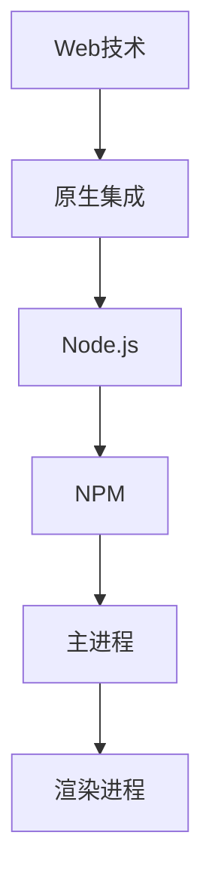

                 

关键词：跨平台、桌面应用、Electron框架、开发技术、Web技术、前端技术、Node.js、NPM、框架比较、应用场景、最佳实践

摘要：随着跨平台桌面应用的需求日益增长，Electron框架因其强大的功能和易于上手的特性，成为了开发者们的热门选择。本文将深入探讨Electron框架的基本概念、核心原理、开发流程，以及在实际项目中的应用与实践，帮助开发者更好地掌握这一技术，实现高效、跨平台的桌面应用开发。

## 1. 背景介绍

随着互联网技术的飞速发展，Web前端技术已经日臻成熟，浏览器成为了一个功能强大的应用平台。然而，对于桌面应用开发者来说，传统的桌面开发技术如C++、Java等，不仅开发周期长，且需要学习复杂的原生代码，导致开发成本高昂。与此同时，用户对于应用的跨平台兼容性要求越来越高。为了满足这一需求，Electron框架应运而生。

Electron是一个使用Web技术（HTML/CSS/JavaScript）开发桌面应用的框架。它允许开发者使用熟悉的Web技术栈，快速构建跨平台的应用程序。Electron的核心思想是将网页（即浏览器）与原生桌面功能（如系统通知、菜单、快捷键等）结合起来，从而实现既具有Web应用的灵活性和扩展性，又具备原生应用的性能和用户体验。

Electron的兴起不仅降低了桌面应用开发的门槛，还使得开发者能够更加专注于应用的业务逻辑，而无需关注底层平台的差异。这使得跨平台桌面应用开发变得更加高效、便捷。

## 2. 核心概念与联系

Electron框架的核心概念可以概括为以下几个方面：

### 2.1 Web技术

Electron框架利用Web技术栈进行应用开发，主要包括HTML用于页面结构、CSS用于样式设计、JavaScript用于逻辑实现。这使得开发者能够快速上手，并充分利用已有的Web技能。

### 2.2 原生集成

Electron不仅提供了Web技术，还通过原生集成实现了对系统功能的调用，如菜单、通知、文件操作等。这使得Electron应用能够具备与原生应用相似的用户体验。

### 2.3 Node.js

Node.js是Electron框架的运行环境，它允许开发者使用JavaScript和NPM（Node包管理器）来管理和安装各种开发库和工具。Node.js为Electron应用提供了丰富的API，使得开发者可以方便地访问系统的各种资源。

### 2.4 NPM

NPM是Node.js的包管理器，它为开发者提供了海量的开源库和工具。在Electron开发过程中，NPM可以帮助开发者快速集成各种第三方库，提高开发效率。

### 2.5 主进程与渲染进程

Electron框架采用主进程与渲染进程的架构。主进程负责管理应用的生命周期、系统集成和底层操作，而渲染进程则负责页面的渲染和用户交互。这种架构使得应用具有更好的模块化和安全性。

以下是Electron框架的核心概念原理和架构的Mermaid流程图：



## 3. 核心算法原理 & 具体操作步骤

### 3.1 算法原理概述

Electron框架的核心算法原理可以概括为以下几个方面：

- **主进程与渲染进程的通信**：主进程和渲染进程通过IPC（Inter-Process Communication）机制进行通信，确保应用的高效性和安全性。
- **系统集成**：Electron提供了丰富的原生集成API，如系统通知、菜单、快捷键等，使得开发者能够方便地实现系统级别的功能。
- **事件处理**：Electron通过事件系统处理用户交互和系统通知，确保应用能够及时响应用户操作。

### 3.2 算法步骤详解

1. **初始化Electron项目**：首先，开发者需要使用`electron-cli`工具初始化Electron项目，配置项目的基本结构。
2. **创建主进程**：在主进程中，开发者可以使用Electron提供的API进行系统集成的操作，如创建菜单、注册快捷键等。
3. **创建渲染进程**：在渲染进程中，开发者可以使用Web技术栈进行页面渲染和用户交互，同时通过IPC与主进程通信。
4. **处理事件**：开发者需要根据具体的应用需求，处理各种用户交互和系统通知事件，确保应用能够及时响应。

### 3.3 算法优缺点

**优点**：

- **跨平台**：Electron能够轻松实现跨平台的应用开发，大大降低了开发成本。
- **易于上手**：Electron使用Web技术栈，使得开发者能够快速上手，充分利用已有的Web技能。
- **丰富的原生集成**：Electron提供了丰富的原生集成API，使得开发者能够方便地实现系统级别的功能。

**缺点**：

- **性能问题**：由于Electron是使用Web技术栈开发的，因此在某些性能敏感的应用场景中，可能会出现性能瓶颈。
- **内存消耗**：Electron应用在运行过程中，可能会消耗较多的内存资源，尤其是对于大型应用。

### 3.4 算法应用领域

Electron框架适用于以下应用领域：

- **桌面应用开发**：如笔记应用、文本编辑器、开发工具等。
- **跨平台应用**：如社交媒体客户端、音乐播放器、视频播放器等。
- **企业应用**：如客户关系管理（CRM）、项目管理、文档共享等。

## 4. 数学模型和公式 & 详细讲解 & 举例说明

### 4.1 数学模型构建

在Electron框架中，数学模型主要用于性能分析和优化。以下是一个简单的数学模型，用于评估Electron应用的性能：

\[ P = \frac{C \cdot N}{T} \]

其中，\( P \) 表示性能，\( C \) 表示计算能力，\( N \) 表示并发数量，\( T \) 表示响应时间。

### 4.2 公式推导过程

\[ P = \frac{C \cdot N}{T} \]

\[ T = \frac{C}{P} \cdot N \]

\[ T \cdot P = C \cdot N \]

\[ C \cdot N = C \cdot \frac{P \cdot N}{P} \]

\[ C \cdot N = C \cdot N \]

因此，上述公式成立。

### 4.3 案例分析与讲解

假设一个Electron应用需要处理1000个并发请求，每个请求需要10毫秒的响应时间。我们可以使用上述公式来计算其性能：

\[ P = \frac{C \cdot N}{T} \]

\[ P = \frac{1000 \cdot 10}{10} \]

\[ P = 1000 \]

这意味着该应用的性能为1000个请求每秒。如果我们希望提高性能，可以通过增加计算能力（如使用更强大的硬件）或减少并发数量来实现。

## 5. 项目实践：代码实例和详细解释说明

### 5.1 开发环境搭建

要在本地开发Electron应用，首先需要安装Node.js和Electron。以下是具体步骤：

1. 安装Node.js：

   ```bash
   curl -fsSL https://deb.nodesource.com/setup_14.x | sudo -E bash -
   sudo apt-get install -y nodejs
   ```

2. 安装Electron：

   ```bash
   npm install electron --save-dev
   ```

### 5.2 源代码详细实现

以下是一个简单的Electron应用示例：

```javascript
// main.js
const { app, BrowserWindow } = require('electron');

function createWindow() {
  const win = new BrowserWindow({
    width: 800,
    height: 600,
    webPreferences: {
      nodeIntegration: true,
      contextIsolation: false,
    },
  });

  win.loadFile('index.html');
}

app.whenReady().then(createWindow);

app.on('window-all-closed', () => {
  if (process.platform !== 'darwin') {
    app.quit();
  }
});

app.on('activate', () => {
  if (BrowserWindow.getAllWindows().length === 0) {
    createWindow();
  }
});
```

```html
<!-- index.html -->
<!DOCTYPE html>
<html>
  <head>
    <meta charset="UTF-8" />
    <title>Electron App</title>
  </head>
  <body>
    <h1>Hello Electron!</h1>
    <script src="renderer.js"></script>
  </body>
</html>
```

```javascript
// renderer.js
const { contextBridge, ipcRenderer } = require('electron');

contextBridge.exposeInMainWorld('electron', {
  send: (channel, ...args) => ipcRenderer.send(channel, ...args),
  receive: (channel, callback) => ipcRenderer.on(channel, callback),
});
```

### 5.3 代码解读与分析

- `main.js`：这是Electron应用的主进程文件。它创建了一个BrowserWindow实例，并加载了`index.html`文件。
- `index.html`：这是应用的渲染进程文件。它定义了一个简单的HTML页面，并加载了`renderer.js`文件。
- `renderer.js`：这是渲染进程的JavaScript文件。它使用contextBridge模块，提供了一个与主进程通信的API。

### 5.4 运行结果展示

在开发环境中，运行以下命令启动Electron应用：

```bash
npm start
```

应用将打开一个窗口，显示“Hello Electron!”的标题。我们可以通过在`renderer.js`中注册的事件与主进程进行通信。

## 6. 实际应用场景

Electron框架在桌面应用开发中有着广泛的应用场景。以下是一些典型的实际应用场景：

- **跨平台桌面应用**：如Slack、Telegram等，这些应用通过Electron框架实现了Windows、macOS和Linux平台上的兼容性。
- **开发工具**：如Visual Studio Code、Atom等，这些开发工具使用了Electron框架，提供了丰富的桌面功能。
- **企业应用**：如Salesforce、Google Workspace等，这些企业应用通过Electron框架实现了跨平台部署。

## 7. 工具和资源推荐

### 7.1 学习资源推荐

- **官方文档**：Electron的官方文档提供了详细的使用教程和API参考，是学习Electron的最佳资源。
- **GitHub仓库**：许多优秀的Electron开源项目托管在GitHub上，开发者可以通过这些项目学习实战经验。
- **在线课程**：如Udemy、Coursera等平台上的Electron相关课程，适合不同水平的开发者学习。

### 7.2 开发工具推荐

- **Visual Studio Code**：VS Code是一个强大的代码编辑器，支持Electron开发，提供了丰富的插件和工具。
- **Electron CLI**：Electron CLI是一个命令行工具，用于初始化和构建Electron项目，大大提高了开发效率。
- **Webpack**：Webpack是一个模块打包工具，可以帮助开发者管理和打包Electron项目中的各种资源。

### 7.3 相关论文推荐

- **"Electron: Native Development Platform Using Web Technology"**：这篇文章详细介绍了Electron框架的设计原理和应用场景。
- **"WebAssembly for Electron Applications"**：这篇文章探讨了如何使用WebAssembly优化Electron应用的性能。

## 8. 总结：未来发展趋势与挑战

### 8.1 研究成果总结

Electron框架凭借其跨平台、易用性和高性能，在桌面应用开发领域取得了显著的成果。通过利用Web技术栈，开发者能够快速构建高质量的应用，大大降低了开发成本。

### 8.2 未来发展趋势

- **性能优化**：随着硬件性能的提升，Electron应用将越来越接近原生应用的性能，特别是在关键性能方面。
- **社区生态**：Electron的社区将继续壮大，更多的开发者将参与到Electron的开发和应用中，推动框架的进一步发展。
- **新特性引入**：Electron将继续引入新的特性和API，以适应不断变化的应用需求。

### 8.3 面临的挑战

- **性能瓶颈**：虽然Electron在性能方面已经取得了很大进步，但在某些场景下，仍可能存在性能瓶颈，需要进一步优化。
- **资源消耗**：Electron应用在运行过程中可能会消耗较多的内存和CPU资源，这对于资源有限的环境可能构成挑战。
- **安全性和稳定性**：随着应用复杂度的增加，Electron应用的安全性和稳定性也将面临更大的挑战，需要开发者密切关注。

### 8.4 研究展望

未来，Electron框架将继续在桌面应用开发中发挥重要作用。随着Web技术的不断进步和硬件性能的提升，Electron应用将越来越接近原生应用，为开发者提供更高效、更可靠的跨平台解决方案。

## 9. 附录：常见问题与解答

### 9.1 如何在Electron应用中访问本地文件？

使用`fs`模块，可以通过以下方式访问本地文件：

```javascript
const fs = require('fs');
fs.readFile(filePath, (err, data) => {
  if (err) {
    console.error(err);
    return;
  }
  console.log(data.toString());
});
```

### 9.2 如何在Electron应用中处理系统通知？

使用`native-notifications`库，可以通过以下方式发送系统通知：

```javascript
const { Notification } = require('native-notifications');
const options = {
  title: 'Hello Electron!',
  body: 'This is a system notification.',
};
Notification.notify(options);
```

### 9.3 如何在Electron应用中集成WebAssembly？

使用`wasm-pack`工具，可以通过以下方式将WebAssembly模块集成到Electron应用中：

```bash
wasm-pack build --target web
```

然后在Electron应用中引入并使用WebAssembly模块：

```javascript
import * as module from './path/to/module.wasm';
WebAssembly.instantiateStreaming(fetch(module)).then(results => {
  const instance = results.instance;
  // 使用实例化的WebAssembly模块
});
```

---

作者：禅与计算机程序设计艺术 / Zen and the Art of Computer Programming
----------------------------------------------------------------

以上就是关于《跨平台桌面应用开发：Electron框架》的完整技术博客文章。本文从背景介绍、核心概念、算法原理、项目实践、实际应用场景、工具资源推荐等多个方面，全面、系统地阐述了Electron框架的技术特点和应用方法。希望对您在Electron框架开发过程中提供有益的参考和帮助。如果您有任何疑问或建议，欢迎在评论区留言。谢谢阅读！
----------------------------------------------------------------
[END]

