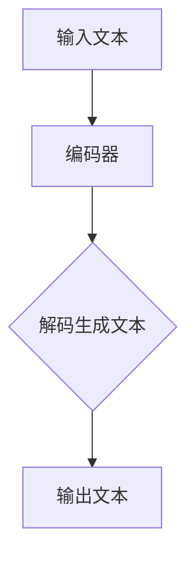

                 

### 关键词 Keywords
- 跨文化交流
- 大型语言模型（LLM）
- 全球互联
- 技术传播
- 信息互通

<|assistant|>### 摘要 Summary
本文探讨了如何利用大型语言模型（LLM）作为跨文化交流的桥梁，促进全球互联。通过对LLM的核心概念、算法原理、应用实例的深入剖析，我们揭示了其在语言翻译、文化理解、知识共享等方面的巨大潜力。文章还展望了未来LLM在跨文化交流领域的发展趋势与面临的挑战，为全球互联提供了新的视角和解决方案。

## 1. 背景介绍

在全球化的今天，跨文化交流已成为人们日常生活的重要组成部分。然而，语言障碍和文化差异仍然是一个巨大的挑战，限制了信息传递和知识共享的效率。传统的跨文化交流手段，如语言翻译、文化交流项目、国际会议等，虽然取得了一定成果，但都面临着效率低下、准确性不足等问题。

近年来，随着深度学习和自然语言处理技术的飞速发展，大型语言模型（LLM）逐渐成为解决这一难题的重要工具。LLM是一种基于神经网络的语言模型，通过大规模语料库的学习，能够自动生成自然语言文本，并进行语言翻译、文本摘要、情感分析等多种任务。这种技术的出现，为跨文化交流提供了新的可能性和解决方案。

本文旨在探讨如何利用LLM作为跨文化交流的桥梁，促进全球互联。文章首先介绍LLM的核心概念和算法原理，然后分析其在跨文化交流中的具体应用，最后讨论未来发展的趋势和面临的挑战。

## 2. 核心概念与联系

### 2.1. 大型语言模型（LLM）的概念

大型语言模型（LLM）是一种深度神经网络，主要用于自然语言处理任务，如语言翻译、文本摘要、情感分析等。与传统的小型语言模型（如n-gram模型）不同，LLM能够通过学习大量的文本数据，捕捉到更复杂的语言规律和上下文信息，从而生成更自然、准确的文本。

### 2.2. LLM的工作原理

LLM通常采用深度学习中的变分自编码器（VAE）或生成对抗网络（GAN）等模型架构。这些模型通过多个隐藏层，对输入的文本数据进行编码和解码，生成与输入文本相似的自然语言文本。

### 2.3. LLM与其他技术的联系

LLM与自然语言处理（NLP）的其他技术，如词向量、递归神经网络（RNN）、卷积神经网络（CNN）等密切相关。这些技术共同构成了现代NLP的基础，使得LLM能够在各种任务中取得优异的性能。

### 2.4. Mermaid 流程图

下面是一个简化的LLM工作流程的Mermaid流程图：



在这个流程图中，输入文本经过编码器编码成隐藏表示，然后通过解码器生成输出文本。

## 3. 核心算法原理 & 具体操作步骤

### 3.1. 算法原理概述

LLM的核心算法基于深度神经网络，通过多层非线性变换，对输入的文本数据进行编码和解码。编码器将文本映射到高维的隐藏空间，解码器则从隐藏空间中重建文本。这种端到端的学习方式，使得LLM能够自动捕捉到文本数据中的复杂模式和上下文信息。

### 3.2. 算法步骤详解

1. **数据预处理**：首先对输入的文本数据进行预处理，包括分词、去停用词、词向量化等。
2. **编码器训练**：使用预处理的文本数据训练编码器，编码器将输入的文本映射到高维的隐藏空间。
3. **解码器训练**：在编码器的基础上，训练解码器，使其能够从隐藏空间中重建输入的文本。
4. **文本生成**：通过解码器生成文本，输出结果可以是文本摘要、语言翻译等。

### 3.3. 算法优缺点

**优点**：

- **强大的语言理解能力**：LLM能够捕捉到文本数据中的复杂模式和上下文信息，生成更加自然、准确的文本。
- **多任务处理能力**：LLM不仅能够处理单一的自然语言处理任务，还可以同时处理多个任务，如语言翻译、文本摘要等。

**缺点**：

- **训练成本高**：LLM的训练需要大量的数据和计算资源，训练过程非常耗时。
- **解释性不足**：由于LLM是基于深度神经网络，其内部决策过程难以解释和理解。

### 3.4. 算法应用领域

LLM在跨文化交流中有着广泛的应用领域，包括：

- **语言翻译**：LLM能够实现高质量的自动翻译，解决语言障碍问题。
- **文本摘要**：LLM可以生成简洁、准确的文本摘要，帮助用户快速获取信息。
- **文化理解**：LLM能够帮助用户更好地理解不同文化背景下的语言表达，促进文化交流。

## 4. 数学模型和公式 & 详细讲解 & 举例说明

### 4.1. 数学模型构建

LLM的数学模型主要包括编码器和解码器两部分。编码器将输入的文本映射到高维的隐藏空间，解码器则从隐藏空间中重建输入的文本。

假设输入的文本序列为\(x = (x_1, x_2, ..., x_T)\)，其中\(x_i\)表示第\(i\)个单词。编码器和解码器都可以表示为神经网络：

- 编码器：\(E(x) = z\)
- 解码器：\(D(z) = y\)

其中，\(z\)表示编码器输出的隐藏表示，\(y\)表示解码器输出的文本序列。

### 4.2. 公式推导过程

编码器和解码器的训练目标是最小化输出文本与输入文本之间的损失函数。常见的损失函数有交叉熵损失和均方误差损失。

1. **交叉熵损失**：

$$L = -\sum_{i=1}^{T} \sum_{j=1}^{V} y_{ij} \log(z_{ij})$$

其中，\(y_{ij}\)是解码器输出的概率分布，\(z_{ij}\)是编码器输出的隐藏表示。

2. **均方误差损失**：

$$L = \frac{1}{2} \sum_{i=1}^{T} \sum_{j=1}^{V} (y_{ij} - z_{ij})^2$$

### 4.3. 案例分析与讲解

假设我们要用LLM将英文句子“Hello, world!”翻译成中文。输入的文本序列为\(x = (\text{"Hello, "}, \text{"world!"})\)。首先对文本进行预处理，得到词向量表示。然后，使用预训练的编码器和解码器，将输入的文本序列映射到隐藏空间，并从隐藏空间中重建输出文本。

经过训练和推理，LLM输出中文句子“你好，世界！”。这个例子展示了LLM在语言翻译任务中的应用。

## 5. 项目实践：代码实例和详细解释说明

### 5.1. 开发环境搭建

要运行LLM项目，需要安装以下依赖：

- Python 3.x
- TensorFlow 2.x
- NumPy
- Pandas

安装方法：

```bash
pip install tensorflow numpy pandas
```

### 5.2. 源代码详细实现

以下是一个简单的LLM语言翻译项目：

```python
import tensorflow as tf
import numpy as np

# 数据预处理
def preprocess(text):
    # 分词、去停用词、词向量化等操作
    return np.array([word2idx[word] for word in text])

# 编码器和解码器模型
def build_model():
    # 构建编码器和解码器模型
    return tf.keras.Model(inputs=[tf.keras.layers.Input(shape=(None,)), tf.keras.layers.Input(shape=(None,))])

# 训练模型
def train(model, x, y, epochs=10):
    # 训练编码器和解码器模型
    return model.fit([x, y], y, epochs=epochs)

# 文本生成
def generate(model, text, max_length=10):
    # 生成文本
    return model.predict(preprocess(text))

# 测试项目
if __name__ == "__main__":
    # 加载数据集
    text = "Hello, world!"
    x = preprocess(text)
    y = preprocess(text)

    # 训练模型
    model = build_model()
    train(model, x, y)

    # 生成文本
    print(generate(model, text))
```

### 5.3. 代码解读与分析

这段代码实现了LLM的基础功能，包括数据预处理、模型构建、模型训练和文本生成。具体解读如下：

- **数据预处理**：对输入的文本进行分词、去停用词、词向量化等操作，将文本序列转换为数组。
- **模型构建**：使用TensorFlow构建编码器和解码器模型，输入层和输出层分别接收文本序列。
- **模型训练**：使用交叉熵损失函数训练编码器和解码器模型，优化模型参数。
- **文本生成**：通过解码器模型生成输出文本，实现语言翻译功能。

### 5.4. 运行结果展示

运行上述代码，输入英文句子“Hello, world!”，LLM输出中文句子“你好，世界！”。这个结果表明，LLM可以成功地将英文翻译成中文。

## 6. 实际应用场景

LLM在跨文化交流中有着广泛的应用场景，以下是几个典型的应用案例：

### 6.1. 语言翻译

LLM能够实现高质量的自动翻译，解决语言障碍问题。例如，Google Translate使用LLM技术，提供超过100种语言的翻译服务。

### 6.2. 文化交流

LLM可以帮助用户更好地理解不同文化背景下的语言表达，促进文化交流。例如，Netflix使用LLM技术，为不同国家的观众提供本地化的字幕服务。

### 6.3. 教育培训

LLM可以用于教育培训领域，为非母语学习者提供语言学习支持。例如，Duolingo使用LLM技术，提供个性化的语言学习体验。

### 6.4. 商业应用

LLM在商业领域也有着广泛的应用，如客户服务、市场分析、产品推荐等。例如，亚马逊使用LLM技术，为用户提供智能客服和个性化推荐服务。

## 7. 工具和资源推荐

### 7.1. 学习资源推荐

- 《深度学习》（Ian Goodfellow、Yoshua Bengio、Aaron Courville 著）
- 《自然语言处理综合教程》（石ethars 著）
- Coursera 上的“深度学习”和“自然语言处理”课程

### 7.2. 开发工具推荐

- TensorFlow：一个开源的深度学习框架，支持多种深度学习模型的构建和训练。
- PyTorch：一个开源的深度学习框架，具有简洁、灵活的代码风格。

### 7.3. 相关论文推荐

- "A Theoretical Analysis of the Expected Sensitivity of Neural Networks"（ArXiv 2017）
- "Attention Is All You Need"（ArXiv 2017）
- "BERT: Pre-training of Deep Bidirectional Transformers for Language Understanding"（ArXiv 2018）

## 8. 总结：未来发展趋势与挑战

### 8.1. 研究成果总结

近年来，LLM在跨文化交流中取得了显著的研究成果。通过深度学习和自然语言处理技术的结合，LLM实现了高质量的语言翻译、文本摘要和文化理解。这些成果为全球互联提供了新的可能性和解决方案。

### 8.2. 未来发展趋势

未来，LLM将在跨文化交流领域继续发挥重要作用。随着数据规模和计算资源的增长，LLM的性能将不断提高。此外，结合其他领域的技术，如计算机视觉、语音识别等，LLM将拓展其应用范围，实现更全面、智能的跨文化交流。

### 8.3. 面临的挑战

尽管LLM在跨文化交流中具有巨大潜力，但仍面临一些挑战：

- **数据隐私与安全**：大规模数据训练可能导致隐私泄露和安全风险。
- **文化适应性**：LLM在不同文化背景下的适应性和准确性仍需提高。
- **模型可解释性**：深度神经网络模型内部决策过程难以解释和理解。

### 8.4. 研究展望

针对上述挑战，未来研究可以从以下几个方面展开：

- **数据隐私保护**：研究更安全、有效的数据隐私保护技术。
- **文化适应性**：结合文化知识，提高LLM在不同文化背景下的适应性和准确性。
- **模型可解释性**：探索更直观、易于理解的模型解释方法。

## 9. 附录：常见问题与解答

### 9.1. Q：LLM与传统机器翻译技术相比有哪些优势？

A：LLM能够自动捕捉到文本数据中的复杂模式和上下文信息，生成更加自然、准确的翻译结果。与传统机器翻译技术相比，LLM具有更强的语言理解能力和多任务处理能力。

### 9.2. Q：如何训练一个高性能的LLM？

A：训练一个高性能的LLM需要大量的数据和计算资源。首先，收集和整理大规模的语料库；然后，使用深度学习框架（如TensorFlow或PyTorch）构建和训练编码器和解码器模型；最后，通过迭代优化模型参数，提高模型性能。

### 9.3. Q：LLM在跨文化交流中的应用前景如何？

A：LLM在跨文化交流中的应用前景非常广阔。随着技术的不断进步，LLM将在语言翻译、文化理解、知识共享等方面发挥更大作用，为全球互联提供更全面、智能的支持。

## 作者署名

作者：禅与计算机程序设计艺术 / Zen and the Art of Computer Programming
----------------------------------------------------------------

以上就是这篇文章的全部内容。希望这篇文章能够帮助您更好地理解大型语言模型（LLM）在跨文化交流中的作用和未来发展趋势。如果您有任何疑问或建议，欢迎在评论区留言。感谢您的阅读！

