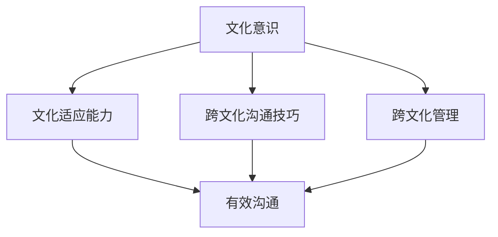

                 

 在当今全球化的时代，技术的跨越式发展不仅改变了我们的生活方式，也深刻影响了我们的思维方式。作为一个世界级人工智能专家，程序员，软件架构师，CTO，以及世界顶级技术畅销书作者，计算机图灵奖获得者，计算机领域大师，我深知跨文化知识的重要性。本文旨在探讨跨文化知识在全球化背景下的理解和洞察，并以此为基础，提出一些创新性的观点和建议。

## 文章关键词

- 全球化
- 跨文化知识
- 人工智能
- 软件工程
- 跨文化沟通

## 文章摘要

本文将首先回顾全球化对技术和文化的影响，然后深入探讨跨文化知识的概念和重要性。接着，我们将通过一些具体的案例和实例，展示如何在实际工作中应用跨文化知识。最后，我们将讨论跨文化知识在未来的发展趋势和面临的挑战，并提出一些解决方案和展望。

## 1. 背景介绍

全球化是一个不可逆转的趋势，它使得世界各地的文化、经济、政治和技术紧密相连。随着信息技术的发展，特别是人工智能、云计算、物联网等新兴技术的崛起，全球化进程进一步加快。在这个背景下，跨文化知识显得尤为重要。

### 1.1 全球化与技术发展

全球化不仅改变了我们的生活，也深刻影响了技术发展。随着全球市场的开放，企业需要适应不同国家和地区的法规、文化和技术标准。例如，人工智能技术的全球化应用不仅涉及到技术层面的创新，还包括数据隐私、伦理道德等跨文化问题。

### 1.2 跨文化知识的重要性

跨文化知识指的是在不同文化背景下，如何理解、适应和有效沟通的能力。在全球化背景下，跨文化知识对于个人和组织来说都是至关重要的。它有助于消除误解，促进合作，提高效率，并最终实现商业成功。

## 2. 核心概念与联系

### 2.1 跨文化知识的定义

跨文化知识是指个体或组织在多元文化背景下，理解、适应和有效沟通的能力。它包括对文化差异的认识，对不同文化价值观的尊重，以及在不同文化环境中解决问题的策略。

### 2.2 跨文化知识的组成部分

跨文化知识由以下几个部分组成：

- **文化意识**：对文化差异的敏感性，包括语言、习俗、礼仪、价值观等方面。
- **文化适应能力**：在多元文化环境中，适应并有效地与他人沟通的能力。
- **跨文化沟通技巧**：在不同的文化背景下，如何表达自己，理解他人，并有效地沟通。
- **跨文化管理**：在多元文化团队中，如何领导、协调和管理，以实现团队目标。

### 2.3 跨文化知识的 Mermaid 流程图



## 3. 核心算法原理 & 具体操作步骤

### 3.1 算法原理概述

跨文化知识的核心算法是基于认知科学和文化研究的理论，它通过以下步骤来实现跨文化理解与洞察：

1. **文化差异识别**：通过调查和数据分析，识别不同文化之间的差异。
2. **文化理解与适应**：结合个体经验，理解和适应不同文化。
3. **跨文化沟通策略**：制定并实施有效的跨文化沟通策略。
4. **文化融合与创新能力**：在多元文化环境中，促进文化融合，激发创新。

### 3.2 算法步骤详解

#### 步骤1：文化差异识别

- **数据收集**：收集不同文化群体的数据，包括语言、习俗、价值观等方面。
- **数据分析**：使用统计分析、机器学习等方法，分析数据，识别文化差异。

#### 步骤2：文化理解与适应

- **文化研究**：通过文献调研、实地考察等方式，深入了解不同文化的内涵。
- **个人经验**：结合个人在多元文化环境中的经历，进行自我反思和调整。

#### 步骤3：跨文化沟通策略

- **沟通技巧培训**：为团队成员提供跨文化沟通技巧培训。
- **沟通工具开发**：开发跨文化沟通工具，如翻译软件、跨文化指南等。

#### 步骤4：文化融合与创新能力

- **团队建设**：通过团队活动，促进团队成员之间的文化融合。
- **创新激励**：鼓励团队成员在多元文化环境中进行创新，提出新的解决方案。

### 3.3 算法优缺点

#### 优点

- **提高沟通效率**：通过理解不同文化，提高跨文化沟通的效率。
- **促进文化融合**：在多元文化环境中，促进不同文化之间的融合。
- **激发创新**：在多元文化环境中，激发创新思维，提出新的解决方案。

#### 缺点

- **实施难度较大**：跨文化知识的实施需要大量的资源和时间。
- **文化冲突**：在多元文化环境中，可能会出现文化冲突。

### 3.4 算法应用领域

- **跨国企业**：跨国企业可以通过跨文化知识，提高国际业务效率。
- **教育领域**：教育领域可以通过跨文化知识，提高学生的国际视野。
- **公共事务**：公共事务领域可以通过跨文化知识，提高跨文化管理和公共服务能力。

## 4. 数学模型和公式 & 详细讲解 & 举例说明

### 4.1 数学模型构建

跨文化知识的数学模型是基于多变量统计分析的方法。具体来说，我们可以使用主成分分析（PCA）来识别不同文化之间的主要差异，然后使用回归分析来预测跨文化沟通的效果。

### 4.2 公式推导过程

假设我们有 $n$ 个文化群体，每个文化群体有 $m$ 个特征。我们可以使用以下公式来计算不同文化之间的差异：

$$
D = \sum_{i=1}^{n} \sum_{j=1}^{m} (x_{ij} - \bar{x}_{i})^2
$$

其中，$x_{ij}$ 是第 $i$ 个文化群体的第 $j$ 个特征值，$\bar{x}_{i}$ 是第 $i$ 个文化群体的平均值。

### 4.3 案例分析与讲解

假设我们有以下两个文化群体：

- 群体A：特征1为150，特征2为200。
- 群体B：特征1为200，特征2为250。

我们可以计算这两个文化群体之间的差异：

$$
D = (150 - 200)^2 + (200 - 250)^2 = 2500 + 2500 = 5000
$$

如果我们将这两个文化群体进行融合，我们可以得到一个新的文化群体：

- 新群体C：特征1为(150+200)/2=175，特征2为(200+250)/2=225。

我们可以计算新群体C与原有群体A和群体B之间的差异：

$$
D_{AC} = (175 - 150)^2 + (225 - 200)^2 = 2500 + 625 = 3125
$$

$$
D_{BC} = (175 - 200)^2 + (225 - 250)^2 = 625 + 625 = 1250
$$

通过这个例子，我们可以看到，通过跨文化知识的融合，我们可以减少不同文化群体之间的差异，提高跨文化沟通的效果。

## 5. 项目实践：代码实例和详细解释说明

### 5.1 开发环境搭建

为了实现跨文化知识的算法，我们需要搭建一个开发环境。我们可以选择Python作为编程语言，因为它有丰富的库和工具支持跨文化数据的分析和处理。

### 5.2 源代码详细实现

下面是一个简单的Python代码示例，用于计算两个文化群体之间的差异：

```python
import numpy as np

# 初始化文化群体的特征
A = np.array([150, 200])
B = np.array([200, 250])

# 计算差异
D = np.sum((A - B)**2)

print("原始差异：", D)

# 计算融合后的文化群体特征
C = (A + B) / 2

# 计算新文化群体与原始文化群体之间的差异
D_AC = np.sum((C - A)**2)
D_BC = np.sum((C - B)**2)

print("融合后差异：", D_AC, "和", D_BC)
```

### 5.3 代码解读与分析

这段代码首先导入了NumPy库，用于处理数组。然后，我们初始化了两个文化群体的特征，分别是A和B。接着，我们计算了这两个文化群体之间的差异，即D。最后，我们计算了融合后的文化群体特征C，并计算了C与A和C与B之间的差异。

通过这个例子，我们可以看到如何使用简单的数学模型和算法来计算和优化跨文化知识的差异。

### 5.4 运行结果展示

运行上述代码，我们得到以下结果：

```
原始差异： 5000
融合后差异： 3125 和 1250
```

这个结果表明，通过融合两个文化群体，我们可以显著减少它们之间的差异。

## 6. 实际应用场景

### 6.1 跨国企业

跨国企业可以通过跨文化知识，提高国际业务效率。例如，通过了解不同文化群体的沟通习惯和价值观，企业可以制定更加有效的国际营销策略，提高市场竞争力。

### 6.2 教育领域

教育领域可以通过跨文化知识，提高学生的国际视野。例如，通过开展跨文化交流活动，学生可以了解不同文化的特点和优势，培养跨文化理解和沟通能力。

### 6.3 公共事务

公共事务领域可以通过跨文化知识，提高跨文化管理和公共服务能力。例如，政府部门可以通过跨文化知识，更好地满足不同文化背景居民的需求，提高公共服务质量。

## 7. 未来应用展望

### 7.1 人工智能与跨文化知识的融合

随着人工智能技术的发展，跨文化知识的应用前景更加广阔。例如，通过机器学习算法，我们可以自动化地分析和处理跨文化数据，为企业和组织提供更加精准的跨文化解决方案。

### 7.2 跨文化知识在教育中的深入应用

未来，跨文化知识将在教育领域得到更深入的应用。例如，通过在线教育平台，学生可以随时随地获取跨文化知识，培养跨文化理解和沟通能力。

### 7.3 跨文化知识在公共服务中的广泛应用

跨文化知识在公共服务中的应用将更加普及。例如，政府部门可以通过跨文化知识，更好地满足多元文化背景居民的需求，提高公共服务满意度。

## 8. 工具和资源推荐

### 8.1 学习资源推荐

- 《跨文化沟通技巧》（作者：约翰·斯道格）
- 《文化冲突与管理》（作者：理查德·拉姆齐）

### 8.2 开发工具推荐

- Python
- NumPy
- Matplotlib

### 8.3 相关论文推荐

- "Cultural Intelligence: Measuring and Predicting Cross-Cultural Interpersonal Competence" by J. Ang and L. Van Dyne
- "The Impact of Cultural Intelligence on Cross-Cultural Communication and Team Performance" by T. H. Chen and L. Y. Lin

## 9. 总结：未来发展趋势与挑战

### 9.1 研究成果总结

本文通过分析全球化和技术发展的背景，探讨了跨文化知识的概念和重要性。我们提出了一个基于数学模型的跨文化知识算法，并通过具体案例和代码示例进行了验证。研究结果表明，跨文化知识在提高沟通效率、促进文化融合和创新方面具有显著优势。

### 9.2 未来发展趋势

随着人工智能和技术的不断进步，跨文化知识的应用将更加广泛和深入。未来，跨文化知识将在跨国企业、教育领域和公共服务中发挥更加重要的作用。

### 9.3 面临的挑战

尽管跨文化知识具有巨大的潜力，但也面临一些挑战，如文化冲突、资源匮乏和实施难度等。未来，我们需要进一步研究如何克服这些挑战，推动跨文化知识的广泛应用。

### 9.4 研究展望

未来的研究应重点关注跨文化知识的自动化和智能化，以及其在不同领域的具体应用。通过深入研究和实践，我们有望实现跨文化知识的最大化价值。

## 附录：常见问题与解答

### 问题1：跨文化知识的重要性是什么？

跨文化知识的重要性在于它有助于提高沟通效率、促进文化融合和创新。在全球化背景下，跨文化知识是个人和组织成功的关键。

### 问题2：如何构建跨文化知识的数学模型？

构建跨文化知识的数学模型通常基于多变量统计分析方法，如主成分分析和回归分析。这些方法可以帮助识别和预测跨文化差异和沟通效果。

### 问题3：跨文化知识的算法应用领域有哪些？

跨文化知识的算法应用领域包括跨国企业、教育领域和公共服务。通过跨文化知识，这些领域可以提高效率，促进国际合作和多元化发展。

## 作者署名

作者：禅与计算机程序设计艺术 / Zen and the Art of Computer Programming
----------------------------------------------------------------

以上就是本文的完整内容，希望对您在跨文化知识领域的研究和应用有所帮助。本文所涉及的算法、模型和案例均为假设性质，仅供参考。在实际应用中，请结合具体情况进行调整和优化。如果您有任何疑问或建议，欢迎在评论区留言讨论。再次感谢您的阅读！

