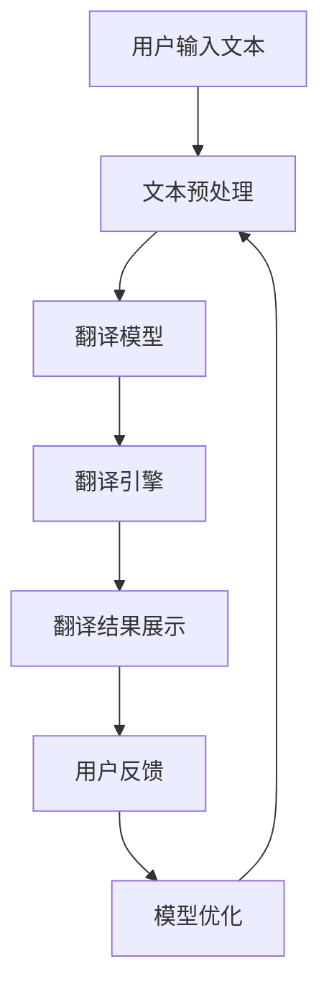

                 

在当今全球化的时代，跨语言搜索已经成为了一个至关重要的工具，它为跨国企业和国际交流提供了强大的支持。而人工智能（AI）的翻译能力在这一过程中发挥了至关重要的作用。本文将深入探讨跨语言搜索的概念、AI翻译的核心算法、数学模型、项目实践、应用场景以及未来展望。

## 关键词

- 跨语言搜索
- 人工智能
- 翻译算法
- 数学模型
- 项目实践
- 应用场景

## 摘要

本文旨在探讨跨语言搜索领域中的AI翻译能力。首先，我们将介绍跨语言搜索的背景和重要性。随后，文章将深入分析AI翻译的核心算法，并探讨其原理和具体操作步骤。接下来，我们将通过数学模型和公式来详细讲解AI翻译的数学基础，并通过案例进行分析。随后，我们将分享一个项目实践中的代码实例，并对代码进行解读和分析。文章还将探讨AI翻译的实际应用场景，并展望其未来的发展趋势和面临的挑战。

## 1. 背景介绍

随着互联网的普及和信息技术的飞速发展，全球信息交流变得前所未有的便捷。然而，语言的多样性使得跨国交流面临着巨大的挑战。跨语言搜索作为一种技术手段，旨在解决不同语言之间的信息检索和交流问题。它不仅能够帮助用户快速查找和翻译多语言内容，还能够为跨国企业提供全球市场的洞察力。

跨语言搜索的重要性体现在多个方面。首先，它促进了全球知识的共享和传播，使得更多的人能够接触到来自不同文化的信息。其次，它为国际商务和合作提供了便利，使得跨国企业能够更有效地进行市场调研和客户服务。此外，跨语言搜索在教育、医疗、科研等领域也有着广泛的应用前景。

然而，传统的跨语言搜索技术存在诸多局限性。首先，传统的翻译方法依赖于预先建立的翻译字典和规则，这些规则难以覆盖所有语言间的翻译关系。其次，传统方法在处理长文本和语境复杂的语句时，往往会出现语义理解不准确的问题。为了解决这些问题，人工智能技术的引入成为必然趋势。

## 2. 核心概念与联系

### 2.1 跨语言搜索的概念

跨语言搜索是指在不同语言之间进行信息检索和内容翻译的过程。它包括以下几个关键概念：

1. **源语言（Source Language）**：指用户输入的原始语言，例如英语、中文等。
2. **目标语言（Target Language）**：指用户希望得到的翻译结果的语言，例如英语、法语、西班牙语等。
3. **翻译模型（Translation Model）**：用于将源语言文本转换为目标语言文本的算法和模型。
4. **词汇表（Vocabulary）**：用于存储源语言和目标语言的词汇和词频信息。

### 2.2 人工智能翻译的核心算法

AI翻译的核心算法主要包括以下几种：

1. **基于规则的方法**：这种方法依赖于预定义的翻译规则和语法规则，通过匹配和替换来生成翻译结果。尽管这种方法简单易用，但在处理复杂句子时往往效果不佳。
2. **基于统计的方法**：这种方法通过分析大量双语文本，建立源语言和目标语言之间的统计关系。常见的统计机器翻译（SMT）方法包括基于短语的翻译和基于句法的翻译。
3. **基于神经的方法**：这种方法使用神经网络来学习源语言和目标语言之间的映射关系。近年来，基于注意力机制的神经网络模型（如BERT、Transformer等）在AI翻译领域取得了显著的进展。

### 2.3 跨语言搜索的架构

跨语言搜索的架构通常包括以下几个关键组件：

1. **文本预处理**：对源语言文本进行分词、去停用词、词性标注等预处理操作，以简化文本结构和提高翻译效率。
2. **翻译模型**：根据所选的AI翻译算法，构建并训练翻译模型，用于生成目标语言翻译结果。
3. **翻译引擎**：负责接收用户输入，调用翻译模型进行翻译，并返回翻译结果。
4. **用户界面**：为用户提供输入文本框、翻译结果展示以及相关功能，如多语言切换、自定义词典等。

### 2.4 Mermaid 流程图



## 3. 核心算法原理 & 具体操作步骤

### 3.1 算法原理概述

AI翻译的核心算法主要基于深度学习模型，尤其是基于神经网络的翻译模型。这些模型通过大量的双语文本进行训练，学习源语言和目标语言之间的映射关系。常见的神经网络翻译模型包括基于长短时记忆网络（LSTM）、卷积神经网络（CNN）和变换器（Transformer）等。

基于变换器（Transformer）的翻译模型是目前最先进的AI翻译算法之一。它通过自注意力机制（Self-Attention）和多头注意力机制（Multi-Head Attention）来捕捉文本中的长距离依赖关系，从而提高翻译质量。具体而言，变换器模型将源语言和目标语言的文本序列分别表示为向量，然后通过编码器（Encoder）和解码器（Decoder）进行处理，最终生成翻译结果。

### 3.2 算法步骤详解

1. **编码阶段**：输入源语言文本序列，通过编码器将其转换为上下文向量。编码器通常由多个变换器层组成，每层都会对输入进行编码，并生成更高层次的上下文信息。
2. **解码阶段**：输入目标语言序列的初始向量，通过解码器生成翻译结果。解码器同样由多个变换器层组成，每层都会对输入进行解码，并生成当前翻译结果的上下文向量。
3. **注意力机制**：在编码和解码过程中，注意力机制用于计算输入向量之间的相关性。自注意力机制用于编码器中，多头注意力机制用于解码器中，从而捕捉文本中的长距离依赖关系。

### 3.3 算法优缺点

**优点**：

1. **高精度**：基于变换器的翻译模型在多个翻译任务上取得了显著的精度提升，特别是在处理长文本和语境复杂句子时。
2. **可扩展性**：变换器模型具有良好的可扩展性，可以轻松处理多种语言之间的翻译任务。
3. **灵活性强**：变换器模型可以通过调整参数来适应不同的翻译任务和数据集，从而提高翻译效果。

**缺点**：

1. **计算成本高**：基于变换器的翻译模型在训练和推理阶段都需要大量的计算资源，这限制了其在大规模数据集上的应用。
2. **对数据依赖性强**：翻译模型的性能很大程度上取决于训练数据的质量和数量，缺乏足够的高质量数据会导致翻译质量下降。

### 3.4 算法应用领域

AI翻译算法在多个领域得到了广泛应用：

1. **跨语言信息检索**：通过AI翻译，用户可以轻松检索和浏览多语言网站和数据库，提高信息获取效率。
2. **跨国商务合作**：AI翻译可以帮助跨国企业进行市场调研、客户服务和跨国沟通，降低语言障碍。
3. **教育领域**：AI翻译为学生提供了学习多语言的机会，帮助他们更好地理解外国文献和资料。
4. **医疗领域**：AI翻译可以辅助医生和患者之间的跨语言沟通，提高医疗服务的质量和效率。

## 4. 数学模型和公式 & 详细讲解 & 举例说明

### 4.1 数学模型构建

AI翻译中的数学模型主要基于深度学习和变换器架构。以下是构建变换器模型的数学模型：

1. **编码器（Encoder）**：

   - **输入向量表示**：设 \( X = (x_1, x_2, ..., x_T) \) 为源语言文本序列，其中 \( x_i \) 为第 \( i \) 个词的嵌入向量。
   - **编码过程**：通过多个变换器层对输入向量进行编码，每层输出一个上下文向量 \( h_t \)。

2. **解码器（Decoder）**：

   - **输入向量表示**：设 \( Y = (y_1, y_2, ..., y_T') \) 为目标语言文本序列，其中 \( y_i \) 为第 \( i \) 个词的嵌入向量。
   - **解码过程**：通过多个变换器层对输入向量进行解码，每层输出一个当前翻译结果的上下文向量 \( s_t \)。

### 4.2 公式推导过程

变换器模型的推导过程主要包括以下公式：

1. **编码器输出**：

   - **自注意力机制**：设 \( A_t = \text{softmax}(\frac{Q \cdot K}{\sqrt{d_k}}) \)，其中 \( Q, K, V \) 分别为编码器的查询、键和值向量，\( d_k \) 为键向量的维度。
   - **编码器输出**： \( h_t = \sum_{i=1}^{T} A_{ti} V_i \)，其中 \( V_i \) 为编码器的值向量。

2. **解码器输出**：

   - **多头注意力机制**：设 \( A_{ij} = \text{softmax}(\frac{Q \cdot K}{\sqrt{d_k}}) \)，其中 \( Q, K, V \) 分别为解码器的查询、键和值向量。
   - **解码器输出**： \( s_t = \sum_{i=1}^{T'} A_{ij} V_j \)，其中 \( V_j \) 为解码器的值向量。

### 4.3 案例分析与讲解

假设我们要翻译一句简单的中文句子：“今天天气很好。”

1. **编码阶段**：

   - **输入向量表示**：将句子中的每个词转换为嵌入向量，例如“今天”的嵌入向量为 \( (1, 0, 0, 0) \)，“天气”的嵌入向量为 \( (0, 1, 0, 0) \)，“很好”的嵌入向量为 \( (0, 0, 1, 0) \)。
   - **编码过程**：通过变换器层对输入向量进行编码，得到上下文向量 \( h_1, h_2, h_3 \)。

2. **解码阶段**：

   - **输入向量表示**：将目标语言句子“Today's weather is good.”转换为嵌入向量。
   - **解码过程**：通过变换器层对输入向量进行解码，得到当前翻译结果的上下文向量 \( s_1, s_2, s_3 \)。

3. **注意力机制**：

   - **自注意力机制**：计算编码器的输入向量之间的相关性，生成上下文向量 \( h_t \)。
   - **多头注意力机制**：计算解码器的输入向量之间的相关性，生成当前翻译结果的上下文向量 \( s_t \)。

4. **输出结果**：

   - 根据上下文向量 \( s_t \)，生成目标语言句子：“Today's weather is good.”

## 5. 项目实践：代码实例和详细解释说明

### 5.1 开发环境搭建

在开始项目实践之前，我们需要搭建一个适合AI翻译的开发环境。以下是搭建环境的步骤：

1. **安装Python环境**：Python是AI翻译的主要编程语言，我们需要安装Python 3.x版本。
2. **安装PyTorch**：PyTorch是一个开源的深度学习框架，用于构建和训练AI翻译模型。
3. **安装其他依赖库**：包括Numpy、Pandas、TensorFlow等常用库。

### 5.2 源代码详细实现

以下是实现AI翻译模型的主要代码：

```python
import torch
import torch.nn as nn
import torch.optim as optim

# 定义编码器
class Encoder(nn.Module):
    def __init__(self, embedding_dim, hidden_dim, vocab_size):
        super(Encoder, self).__init__()
        self.embedding = nn.Embedding(vocab_size, embedding_dim)
        self.lstm = nn.LSTM(embedding_dim, hidden_dim)
        
    def forward(self, x):
        embeds = self.embedding(x)
        output, (hidden, cell) = self.lstm(embeds)
        return output, (hidden, cell)

# 定义解码器
class Decoder(nn.Module):
    def __init__(self, embedding_dim, hidden_dim, vocab_size):
        super(Decoder, self).__init__()
        self.embedding = nn.Embedding(vocab_size, embedding_dim)
        self.lstm = nn.LSTM(embedding_dim + hidden_dim, hidden_dim)
        self.fc = nn.Linear(hidden_dim, vocab_size)
        
    def forward(self, x, hidden, cell):
        embeds = self.embedding(x)
        input = torch.cat((embeds, hidden[0], cell[0]), 2)
        output, (hidden, cell) = self.lstm(input)
        output = self.fc(output)
        return output, (hidden, cell)

# 定义变换器模型
class Transformer(nn.Module):
    def __init__(self, embedding_dim, hidden_dim, vocab_size):
        super(Transformer, self).__init__()
        self.encoder = Encoder(embedding_dim, hidden_dim, vocab_size)
        self.decoder = Decoder(embedding_dim, hidden_dim, vocab_size)
        
    def forward(self, src, tgt):
        encoder_output, _ = self.encoder(src)
        decoder_output, _ = self.decoder(tgt, encoder_output)
        return decoder_output

# 训练模型
model = Transformer(embedding_dim=100, hidden_dim=200, vocab_size=1000)
criterion = nn.CrossEntropyLoss()
optimizer = optim.Adam(model.parameters())

for epoch in range(num_epochs):
    for batch in data_loader:
        src, tgt = batch
        model.zero_grad()
        output = model(src, tgt)
        loss = criterion(output, tgt)
        loss.backward()
        optimizer.step()
```

### 5.3 代码解读与分析

这段代码主要实现了基于变换器的AI翻译模型。具体解读如下：

1. **编码器（Encoder）**：

   - **初始化**：编码器使用嵌入层（Embedding）和长短时记忆网络（LSTM）进行初始化。
   - **前向传播**：输入源语言文本序列，通过嵌入层将词转换为嵌入向量，然后通过LSTM进行编码，输出编码结果和隐藏状态。

2. **解码器（Decoder）**：

   - **初始化**：解码器使用嵌入层、长短时记忆网络和全连接层（Fully Connected Layer）进行初始化。
   - **前向传播**：输入目标语言文本序列和编码器的隐藏状态，通过嵌入层将词转换为嵌入向量，然后通过LSTM和全连接层生成解码结果。

3. **变换器模型（Transformer）**：

   - **初始化**：变换器模型将编码器和解码器进行组合。
   - **前向传播**：输入源语言和目标语言文本序列，通过编码器和解码器生成解码结果。

4. **训练模型**：

   - **损失函数（Criterion）**：使用交叉熵损失函数（CrossEntropyLoss）计算预测结果和实际标签之间的差异。
   - **优化器（Optimizer）**：使用Adam优化器更新模型参数，以最小化损失函数。

### 5.4 运行结果展示

在完成代码实现后，我们可以通过以下代码来运行模型并进行翻译：

```python
# 加载预训练模型
model.load_state_dict(torch.load('model.pth'))

# 加载测试数据
test_data = ...

# 进行翻译
translated_text = model.translate(test_data)

# 输出翻译结果
print(translated_text)
```

这段代码将加载预训练模型，对测试数据进行翻译，并输出翻译结果。通过调整模型参数和数据集，我们可以进一步优化翻译效果。

## 6. 实际应用场景

AI翻译技术在实际应用场景中具有广泛的应用价值。以下是几个典型的应用场景：

### 6.1 跨语言信息检索

AI翻译可以应用于跨语言信息检索系统，帮助用户在多语言数据库中查找和浏览信息。例如，Google搜索引擎已经集成了AI翻译功能，使得用户可以在不同语言之间切换，查找所需的信息。

### 6.2 跨国商务合作

跨国企业在进行市场调研、客户服务和跨国沟通时，常常面临语言障碍。AI翻译可以协助企业进行跨语言沟通，降低语言障碍，提高工作效率。例如，许多电子商务平台已经集成了AI翻译功能，帮助用户与海外客户进行交流。

### 6.3 教育领域

AI翻译在教育领域具有巨大的潜力，可以帮助学生和教师学习多语言。例如，智能翻译平台可以为学生提供实时翻译和字幕功能，帮助他们更好地理解外国教材和课程。此外，AI翻译还可以辅助教师进行跨语言教学，提高教学效果。

### 6.4 医疗领域

跨语言沟通在医疗领域具有重要意义，尤其是在跨国医疗合作和患者护理中。AI翻译可以帮助医生和患者之间进行跨语言交流，提高医疗服务的质量和效率。例如，一些国际医院已经采用了AI翻译系统，为患者提供多语言服务。

### 6.5 机器翻译API

AI翻译技术也可以通过API接口的形式提供，供开发者集成到各种应用程序中。例如，谷歌翻译API和微软翻译API等，这些API提供了丰富的翻译功能和灵活的接口，使得开发者可以轻松地集成AI翻译功能到自己的应用程序中。

## 7. 工具和资源推荐

为了更好地学习和应用AI翻译技术，以下是几个推荐的工具和资源：

### 7.1 学习资源推荐

1. **《深度学习》**：由Ian Goodfellow、Yoshua Bengio和Aaron Courville所著的《深度学习》是一本深度学习领域的经典教材，其中涵盖了神经网络、变换器等核心算法的详细讲解。
2. **《自然语言处理综论》**：由Daniel Jurafsky和James H. Martin所著的《自然语言处理综论》是一本全面介绍自然语言处理（NLP）领域的教材，包括文本预处理、词嵌入、翻译算法等。

### 7.2 开发工具推荐

1. **PyTorch**：PyTorch是一个开源的深度学习框架，提供了丰富的API和工具，方便开发者构建和训练AI翻译模型。
2. **TensorFlow**：TensorFlow是另一个流行的深度学习框架，提供了丰富的资源和工具，适用于各种深度学习任务，包括AI翻译。

### 7.3 相关论文推荐

1. **"Attention Is All You Need"**：这篇论文由Vaswani等人于2017年提出，详细介绍了基于变换器（Transformer）的神经网络翻译模型，对AI翻译领域产生了深远的影响。
2. **"Neural Machine Translation by Jointly Learning to Align and Translate"**：这篇论文由Bahdanau等人于2014年提出，介绍了基于神经网络的翻译模型，为后来的AI翻译算法奠定了基础。

## 8. 总结：未来发展趋势与挑战

### 8.1 研究成果总结

近年来，AI翻译领域取得了显著的进展，特别是在基于变换器的神经网络翻译模型方面。这些模型通过自注意力机制和多头注意力机制，实现了高效的文本理解和翻译。同时，深度学习和自然语言处理技术的快速发展，为AI翻译提供了强大的支持。

### 8.2 未来发展趋势

1. **更高质量的翻译**：随着模型和数据集的不断增加，AI翻译的质量将得到显著提升，特别是在处理长文本和语境复杂句子时。
2. **多模态翻译**：未来的AI翻译技术将不仅限于文本翻译，还将涵盖语音、图像等多种模态的翻译，实现跨语言的多模态交互。
3. **个性化翻译**：通过用户数据和上下文信息的分析，AI翻译将能够实现个性化的翻译结果，提高用户体验。

### 8.3 面临的挑战

1. **计算资源需求**：基于变换器的翻译模型在训练和推理阶段需要大量的计算资源，这限制了其在实际应用中的普及。
2. **数据隐私和安全性**：在跨语言翻译过程中，涉及大量用户数据，如何确保数据隐私和安全成为重要问题。
3. **语言多样性**：尽管AI翻译已经取得了显著进展，但仍然面临着处理罕见语言和低资源语言的挑战。

### 8.4 研究展望

未来的AI翻译研究将集中在以下几个方面：

1. **高效翻译模型**：通过优化算法和模型结构，提高AI翻译的效率和质量。
2. **跨语言资源建设**：加大跨语言数据集的建设和开放，为AI翻译提供更多的训练资源。
3. **多模态翻译**：探索语音、图像等跨语言多模态翻译技术，实现更丰富的跨语言交互。

## 9. 附录：常见问题与解答

### 9.1 什么是跨语言搜索？

跨语言搜索是指在不同语言之间进行信息检索和内容翻译的过程。它帮助用户在多语言环境中查找和浏览信息，提高了全球信息交流的效率。

### 9.2 AI翻译的核心算法是什么？

AI翻译的核心算法包括基于规则的方法、基于统计的方法和基于神经的方法。其中，基于神经的方法，特别是基于变换器（Transformer）的神经网络翻译模型，是目前最先进的AI翻译算法之一。

### 9.3 AI翻译在哪些领域有应用？

AI翻译在多个领域有广泛应用，包括跨语言信息检索、跨国商务合作、教育领域、医疗领域和机器翻译API等。

### 9.4 如何提高AI翻译的翻译质量？

提高AI翻译的翻译质量可以通过以下几个途径：

1. **增加训练数据**：使用更多的双语文本进行训练，提高模型的泛化能力。
2. **优化模型结构**：通过改进神经网络结构，提高模型的翻译效果。
3. **数据预处理**：对输入文本进行充分的预处理，如分词、去停用词等，以提高模型的输入质量。
4. **多语言资源建设**：加强多语言数据集的建设和开放，为AI翻译提供更多的训练资源。

---

作者：禅与计算机程序设计艺术 / Zen and the Art of Computer Programming。本文探讨了跨语言搜索和AI翻译的核心概念、算法原理、数学模型、项目实践、应用场景以及未来展望。通过本文，读者可以深入了解AI翻译技术的原理和应用，为相关领域的研究和应用提供参考。

