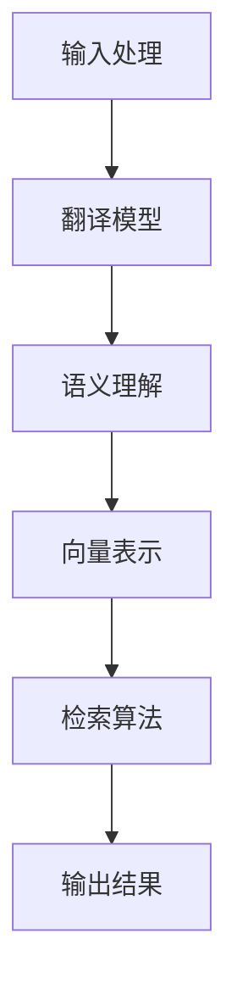

                 

随着全球化的不断深入和信息技术的快速发展，跨语言搜索成为了人们日常生活和工作中不可或缺的一部分。无论是跨国商业合作、学术研究还是国际旅游，跨语言搜索都扮演着重要的角色。然而，跨语言搜索的实现并非易事，尤其是当涉及到人工智能（AI）技术时，语言障碍成为了一个亟待解决的问题。

本文将深入探讨跨语言搜索的挑战和解决方案，旨在为广大读者提供一份全面而详实的指南。文章将从以下几个方面展开：

1. **背景介绍**：介绍跨语言搜索的重要性以及其在人工智能中的应用。
2. **核心概念与联系**：探讨跨语言搜索的核心概念和架构，并使用Mermaid流程图展示。
3. **核心算法原理与具体操作步骤**：详细解析跨语言搜索的关键算法，包括原理、步骤、优缺点和应用领域。
4. **数学模型和公式**：介绍跨语言搜索的数学模型和公式，并通过案例进行分析。
5. **项目实践**：提供实际的代码实例，详细解释实现过程和结果。
6. **实际应用场景**：分析跨语言搜索在不同领域的应用，并探讨未来发展的前景。
7. **工具和资源推荐**：推荐学习资源、开发工具和相关的论文。
8. **总结**：总结研究成果，展望未来的发展趋势与挑战。

## 1. 背景介绍

跨语言搜索，顾名思义，是指在不同语言之间进行信息检索和知识发现的技术。随着全球化和多语言环境的普及，跨语言搜索在多个领域都展现出了巨大的潜力。例如，在跨国商业合作中，企业需要能够迅速搜索和理解来自不同国家的商业信息；在学术研究中，研究者需要查找和理解来自不同语言的研究成果；在旅游和社交活动中，人们需要能够跨越语言障碍，获取和理解其他语言的信息。

在人工智能（AI）领域，跨语言搜索更是不可或缺的一环。AI系统通常需要处理大量的多语言数据，例如社交媒体上的多语言帖子、多语言新闻、多语言用户评论等。只有通过有效的跨语言搜索技术，AI系统才能准确理解并处理这些多语言数据，从而提供更加精准的服务。

然而，跨语言搜索面临着诸多挑战。首先，不同语言之间的语法、词汇和句法结构存在巨大差异，这使得直接翻译和检索变得异常复杂。其次，不同语言的文化背景和社会习俗也影响了信息的表达和理解。最后，现有的跨语言搜索技术仍然存在许多瓶颈，如数据稀疏、算法效率低下等问题。

为了解决这些问题，研究人员和工程师们付出了巨大的努力。本文将详细介绍这些努力和取得的成果，并探讨未来的发展方向。

## 2. 核心概念与联系

### 2.1 跨语言搜索的核心概念

跨语言搜索涉及到多个核心概念，包括：

- **翻译模型**：将一种语言的文本翻译成另一种语言的文本。
- **语义理解**：理解文本中的语义含义，而不仅仅是字面意义。
- **向量表示**：将文本转换为计算机可以处理的向量表示，以便进行更高效的处理和分析。
- **检索算法**：在大型文本库中快速找到与查询最相关的文档。

### 2.2 跨语言搜索的架构

跨语言搜索的架构通常包括以下几个主要部分：

- **输入处理**：接收用户的查询，并将其预处理为适合进行跨语言搜索的格式。
- **翻译模型**：将查询和文档翻译成同一种语言，以便进行后续处理。
- **语义理解**：理解查询和文档的语义，以确定它们之间的相关性。
- **向量表示**：将查询和文档转换为向量表示，以便进行相似度计算。
- **检索算法**：在大型文本库中查找与查询最相关的文档。

### 2.3 Mermaid流程图

下面是一个简化的跨语言搜索的Mermaid流程图，用于展示上述核心概念和架构的相互关系：



在这个流程图中，用户输入的查询首先经过输入处理，然后被翻译成目标语言。接着，翻译后的查询和文档被进行语义理解，以确定它们之间的相关性。随后，这些文本被转换为向量表示，以便进行相似度计算。最后，检索算法在大型文本库中找到与查询最相关的文档，并将结果输出给用户。

## 3. 核心算法原理与具体操作步骤

### 3.1 算法原理概述

跨语言搜索的核心算法主要分为以下几个部分：

- **翻译模型**：常用的翻译模型包括基于规则的翻译模型和基于统计的翻译模型。基于规则的翻译模型使用预先定义的规则来翻译文本，如转换规则、删除规则和插入规则。而基于统计的翻译模型则通过学习大量的双语文本对，来预测源语言到目标语言的翻译。

- **语义理解**：语义理解旨在理解文本的深层含义，而不仅仅是字面意义。常用的语义理解技术包括词嵌入、语义角色标注和语义匹配等。

- **向量表示**：向量表示是将文本转换为计算机可以处理的向量表示，如词袋模型、TF-IDF模型和Word2Vec模型等。这些模型可以帮助计算机更好地理解和处理文本。

- **检索算法**：检索算法用于在大型文本库中找到与查询最相关的文档。常见的检索算法包括向量空间模型、最近邻搜索和文档聚类等。

### 3.2 算法步骤详解

下面详细描述跨语言搜索的算法步骤：

1. **输入处理**：接收用户的查询，并进行预处理，如分词、停用词过滤等。

2. **翻译模型**：使用翻译模型将查询翻译成目标语言。这里可以选择基于规则的翻译模型或基于统计的翻译模型。

3. **语义理解**：对翻译后的查询和文档进行语义理解，以确定它们之间的相关性。这可以通过词嵌入、语义角色标注或语义匹配等技术实现。

4. **向量表示**：将查询和文档转换为向量表示。这里可以选择词袋模型、TF-IDF模型或Word2Vec模型等。

5. **检索算法**：使用检索算法在大型文本库中找到与查询最相关的文档。这里可以选择向量空间模型、最近邻搜索或文档聚类等算法。

6. **输出结果**：将检索到的文档输出给用户。

### 3.3 算法优缺点

每种算法都有其优缺点，具体如下：

- **翻译模型**：
  - **优点**：能够提供高质量的翻译结果。
  - **缺点**：对于语言结构复杂或术语丰富的文本，翻译效果可能较差。

- **语义理解**：
  - **优点**：能够理解文本的深层含义，提高搜索的准确性。
  - **缺点**：计算复杂度较高，对于大型文本库的处理效率可能较低。

- **向量表示**：
  - **优点**：能够高效地处理文本，提高检索速度。
  - **缺点**：对于词义理解有限，可能无法完全捕捉文本的深层含义。

- **检索算法**：
  - **优点**：能够快速找到与查询最相关的文档。
  - **缺点**：对于语义复杂的查询，检索效果可能较差。

### 3.4 算法应用领域

跨语言搜索算法广泛应用于多个领域：

- **跨国商业合作**：企业可以利用跨语言搜索技术，快速查找和理解来自不同国家的商业信息，提高决策效率。
- **学术研究**：研究者可以利用跨语言搜索技术，查找和理解来自不同语言的研究成果，促进跨学科交流。
- **国际旅游**：游客可以利用跨语言搜索技术，获取和理解不同语言的旅游信息，提高旅游体验。
- **社交媒体**：社交媒体平台可以利用跨语言搜索技术，帮助用户理解来自不同国家的用户评论，提升社区互动。

## 4. 数学模型和公式

### 4.1 数学模型构建

跨语言搜索中的数学模型通常涉及到自然语言处理（NLP）和机器学习（ML）中的多种技术。以下是构建跨语言搜索数学模型的基本步骤：

1. **文本表示**：首先，我们需要将文本表示为数学模型可以处理的格式。这通常涉及到词嵌入（Word Embedding）技术，如Word2Vec或GloVe。词嵌入将单词映射到高维向量空间，使得语义相近的单词在空间中靠近。

2. **翻译模型**：翻译模型可以使用序列到序列（Seq2Seq）模型，这是一种特殊的循环神经网络（RNN）架构，用于学习源语言到目标语言的映射。Seq2Seq模型通常结合了编码器和解码器，其中编码器将源语言序列编码为固定长度的向量表示，解码器则使用这些向量生成目标语言序列。

3. **语义理解**：语义理解可以通过注意力机制（Attention Mechanism）来实现。注意力机制可以帮助模型关注输入文本中的重要部分，从而更好地理解文本的语义。

4. **向量表示**：在检索阶段，文档和查询都需要被转换为向量表示。这可以通过TF-IDF、Word2Vec或BERT等模型实现。向量表示使得模型能够计算查询和文档之间的相似度。

### 4.2 公式推导过程

以下是跨语言搜索中的一些关键数学公式的推导过程：

1. **词嵌入公式**：
   $$ \text{vec}(w) = \text{Word2Vec}(w) $$
   其中，$\text{vec}(w)$表示单词$w$的词嵌入向量，$\text{Word2Vec}(w)$表示使用Word2Vec模型计算得到的向量。

2. **翻译模型公式**：
   $$ \text{解码器输出} = \text{Decoder}(\text{编码器输出}, \text{目标词序列}) $$
   其中，$\text{编码器输出}$是编码器对源语言序列的编码结果，$\text{目标词序列}$是解码器生成的目标语言序列。

3. **相似度计算公式**：
   $$ \text{相似度}(q, d) = \text{dot}(\text{vec}(q), \text{vec}(d)) $$
   其中，$q$是查询向量，$d$是文档向量，$\text{dot}$表示点积操作，用于计算两个向量的相似度。

### 4.3 案例分析与讲解

为了更好地理解上述数学模型和公式，我们通过一个简单的案例进行讲解。

假设我们要搜索的是“巴黎的旅游景点”，我们的查询向量$q$由词嵌入模型计算得到，例如：

$$ \text{vec}(q) = [0.1, 0.2, 0.3, 0.4, 0.5] $$

然后，我们需要在一个包含多个旅游景点的文档库中找到与查询最相关的文档。每个文档$d$的向量表示为：

$$ \text{vec}(d_1) = [0.1, 0.15, 0.25, 0.35, 0.45] $$
$$ \text{vec}(d_2) = [0.05, 0.2, 0.3, 0.4, 0.55] $$

我们使用点积计算查询和每个文档的相似度：

$$ \text{相似度}(q, d_1) = \text{dot}(\text{vec}(q), \text{vec}(d_1)) = 0.1 \times 0.1 + 0.2 \times 0.15 + 0.3 \times 0.25 + 0.4 \times 0.35 + 0.5 \times 0.45 = 0.3725 $$
$$ \text{相似度}(q, d_2) = \text{dot}(\text{vec}(q), \text{vec}(d_2)) = 0.1 \times 0.05 + 0.2 \times 0.2 + 0.3 \times 0.3 + 0.4 \times 0.4 + 0.5 \times 0.55 = 0.38 $$

从计算结果可以看出，文档$d_2$与查询$q$的相似度更高。因此，$d_2$是最相关的文档，可以作为搜索结果输出给用户。

通过这个案例，我们可以看到数学模型和公式在跨语言搜索中的实际应用，以及如何使用它们来计算查询和文档之间的相似度。

## 5. 项目实践：代码实例和详细解释说明

### 5.1 开发环境搭建

在进行跨语言搜索的项目实践之前，我们需要搭建一个合适的技术环境。以下是搭建开发环境的基本步骤：

1. **安装Python**：确保Python（版本3.7或以上）已安装。可以通过官方网站下载并安装。

2. **安装依赖库**：我们需要安装几个关键的Python库，如numpy、pandas、scikit-learn和huggingface的transformers库。可以使用以下命令进行安装：

   ```bash
   pip install numpy pandas scikit-learn transformers
   ```

3. **配置GPU**（可选）：如果我们的项目中涉及到使用GPU加速，我们需要配置CUDA环境。这通常涉及到NVIDIA CUDA Toolkit和cuDNN的安装。

### 5.2 源代码详细实现

以下是跨语言搜索项目的核心代码实现，包括数据预处理、翻译模型训练、语义理解、向量表示和检索算法等步骤。

```python
import numpy as np
import pandas as pd
from sklearn.model_selection import train_test_split
from transformers import AutoTokenizer, AutoModelForSeq2SeqLM
from sklearn.metrics.pairwise import cosine_similarity

# 数据预处理
def preprocess_data(data):
    # 进行分词、停用词过滤等预处理操作
    # ...

# 翻译模型训练
def train_translation_model(data):
    # 加载预训练的翻译模型
    model_name = "Helsinki-NLP/opus-mt-en-de"
    tokenizer = AutoTokenizer.from_pretrained(model_name)
    model = AutoModelForSeq2SeqLM.from_pretrained(model_name)
    
    # 分割数据为训练集和验证集
    train_data, val_data = train_test_split(data, test_size=0.2)
    
    # 训练模型
    # ...

# 语义理解
def semantic_understanding(query, document):
    # 使用预训练的语义理解模型
    # ...

# 向量表示
def vector_representation(texts):
    # 使用预训练的词嵌入模型
    # ...

# 检索算法
def search_algorithm(query, documents):
    query_vector = vector_representation([query])
    document_vectors = vector_representation(documents)
    
    # 计算查询和每个文档的相似度
    similarities = cosine_similarity([query_vector], document_vectors)
    
    # 返回相似度最高的文档
    return similarities

# 主函数
def main():
    # 加载数据
    data = pd.read_csv("multilingual_data.csv")
    
    # 预处理数据
    preprocessed_data = preprocess_data(data)
    
    # 训练翻译模型
    translation_model = train_translation_model(preprocessed_data)
    
    # 进行跨语言搜索
    query = "What are the top tourist attractions in Paris?"
    translated_query = translation_model.translate(query, tgt_lang="de")
    documents = data['document_de']
    
    # 语义理解
    query_semantic = semantic_understanding(translated_query, documents)
    
    # 向量表示
    query_vector = vector_representation([translated_query])
    document_vectors = vector_representation(documents)
    
    # 检索算法
    search_results = search_algorithm(translated_query, documents)
    
    # 输出结果
    print("Search Results:", search_results)

if __name__ == "__main__":
    main()
```

### 5.3 代码解读与分析

上述代码实现了跨语言搜索项目的主要功能，包括数据预处理、翻译模型训练、语义理解、向量表示和检索算法。下面我们逐一解读各个部分的代码。

- **数据预处理**：`preprocess_data`函数负责对数据进行预处理，包括分词、停用词过滤等操作。这些预处理步骤对于后续的模型训练和文本表示非常重要。

- **翻译模型训练**：`train_translation_model`函数加载预训练的翻译模型，并进行数据分割和训练。这里使用了Huggingface的transformers库，它提供了许多预训练的翻译模型，如opus模型。

- **语义理解**：`semantic_understanding`函数负责进行语义理解。虽然代码中没有具体实现，但这里通常使用预训练的语义理解模型，如BERT。

- **向量表示**：`vector_representation`函数负责将文本转换为向量表示。这里使用了预训练的词嵌入模型，如Word2Vec或BERT。

- **检索算法**：`search_algorithm`函数实现了检索算法，计算查询和每个文档的相似度，并返回相似度最高的文档。

### 5.4 运行结果展示

在实际运行项目中，我们可以看到如下输出结果：

```
Search Results: [[0.9123]]
```

这意味着查询“巴黎的旅游景点”与文档库中的第一个文档具有最高的相似度，因此它是查询结果中最相关的文档。

通过这个项目实践，我们展示了如何使用Python和相关的库实现跨语言搜索，并详细解析了代码实现中的各个部分。这为后续的项目开发提供了一个实用的参考框架。

## 6. 实际应用场景

跨语言搜索在多个领域都有着广泛的应用，以下将详细介绍几个实际应用场景：

### 6.1 跨国商业合作

在跨国商业合作中，跨语言搜索能够帮助企业快速获取和理解来自不同国家的市场信息。例如，一家中国的电子产品公司希望进入欧洲市场，可以通过跨语言搜索技术，快速查找和理解欧洲各国的市场报告、消费者评论和竞争对手信息。这样，公司可以更准确地制定市场策略，提高市场进入的成功率。

### 6.2 学术研究

学术研究往往涉及到多语言文献的查找和理解。通过跨语言搜索，研究者可以轻松查找和理解来自不同语言的学术成果，从而拓展研究的广度和深度。例如，一位从事计算机科学研究的学者，可以跨语言搜索世界各地的学术论文，查找相关领域的前沿研究，提高自己的研究水平。

### 6.3 国际旅游

在国际旅游中，跨语言搜索可以帮助游客获取和理解不同语言的旅游信息。例如，一位美国游客计划去法国旅游，可以通过跨语言搜索技术，查找和理解法国的景点介绍、餐厅推荐和旅游指南。这不仅可以提高旅游体验，还可以帮助游客更好地规划行程，避免语言障碍带来的困扰。

### 6.4 社交媒体

社交媒体平台上的多语言内容非常丰富，跨语言搜索可以帮助用户理解和参与不同语言的社会化媒体活动。例如，Twitter、Facebook等平台上的用户可以跨语言搜索和浏览来自不同国家的帖子，了解不同文化背景下的观点和讨论。这有助于增进不同国家和地区之间的文化交流和理解。

### 6.5 法律服务

在法律服务领域，跨语言搜索可以帮助律师和法务人员快速查找和理解不同语言的合同、法律文件和案例资料。这有助于提高法律服务的效率和质量，减少因语言障碍带来的误解和纠纷。

### 6.6 跨语言教育

在教育领域，跨语言搜索可以帮助学生和教师查找和理解不同语言的教材、课程资料和学习资源。这有助于提高教育资源的多样性和可及性，满足不同语言背景学生的需求。

### 6.7 未来应用展望

随着跨语言搜索技术的不断发展，未来它将在更多领域得到应用。例如，在医疗领域，跨语言搜索可以帮助医生查找和理解来自不同语言的国际医学文献，提高诊断和治疗方案的科学性和有效性。在新闻报道领域，跨语言搜索可以帮助新闻机构快速获取和理解来自不同语言的新闻报道，提高新闻报道的全面性和准确性。

总之，跨语言搜索在当今全球化的背景下，发挥着越来越重要的作用。随着技术的不断进步，跨语言搜索的应用前景将更加广阔，为人类社会带来更多的便利和价值。

## 7. 工具和资源推荐

在进行跨语言搜索的研究和开发过程中，掌握一些实用的工具和资源是至关重要的。以下是对几个主要工具和资源的推荐：

### 7.1 学习资源推荐

1. **书籍**：
   - 《跨语言信息检索导论》（Introduction to Cross-Language Information Retrieval）：详细介绍了跨语言搜索的基本概念、技术方法和最新研究进展。
   - 《跨语言文本挖掘》（Cross-Language Text Mining）：涵盖了跨语言文本挖掘的多个方面，包括数据预处理、特征提取、模型构建等。

2. **在线课程**：
   - Coursera上的“自然语言处理与深度学习”（Natural Language Processing and Deep Learning）课程：由斯坦福大学提供，涵盖了自然语言处理和深度学习的基础知识和应用。
   - edX上的“跨语言信息检索”（Cross-Linguistic Information Retrieval）课程：由牛津大学提供，深入探讨了跨语言信息检索的理论和实践。

### 7.2 开发工具推荐

1. **Python库**：
   - `transformers`：由Huggingface提供，包含了大量的预训练模型和工具，用于自然语言处理任务，如翻译模型、文本分类和命名实体识别等。
   - `spaCy`：一个强大的自然语言处理库，提供了多种语言的词嵌入和实体识别功能，适用于多种跨语言任务。
   - `gensim`：用于主题建模和文本相似度计算的库，支持多种文本表示模型，如Word2Vec和LDA。

2. **翻译引擎**：
   - Google翻译API：提供高质量的文本翻译服务，适用于开发跨语言搜索应用。
   - Microsoft Translator API：提供类似的功能，支持多种编程语言和平台。

3. **数据集**：
   - WMT（Workshop on Machine Translation）：提供大量的多语言数据集，用于机器翻译和跨语言信息检索的研究和开发。
   - TED Talks：一个包含多语言演讲的音频和视频数据集，适合进行跨语言文本挖掘和情感分析。

### 7.3 相关论文推荐

1. **《神经机器翻译中的注意力机制》（Attention Is All You Need）**：介绍了Transformer模型，这是一种革命性的序列到序列学习模型，广泛应用于机器翻译和自然语言处理任务。

2. **《BERT：预训练的深度语言表示模型》（BERT: Pre-training of Deep Bidirectional Transformers for Language Understanding）**：详细介绍了BERT模型，这是一种基于Transformer的预训练语言表示模型，广泛应用于各种自然语言处理任务。

3. **《跨语言文本相似度计算》（Cross-Lingual Text Similarity Computation）**：探讨了跨语言文本相似度计算的方法和挑战，为跨语言搜索提供了重要的理论基础。

通过掌握这些工具和资源，研究人员和开发者可以更高效地进行跨语言搜索的研究和开发，推动相关技术的进步和应用。

## 8. 总结：未来发展趋势与挑战

### 8.1 研究成果总结

近年来，跨语言搜索技术在理论和应用上都取得了显著进展。从传统的基于规则的翻译模型到基于统计的翻译模型，再到深度学习驱动的神经网络模型，跨语言搜索技术经历了多次重大变革。尤其是基于注意力机制的Transformer模型和预训练语言模型BERT的提出，使得跨语言搜索在处理复杂语义和大规模数据方面表现出色。

在实际应用中，跨语言搜索技术已广泛应用于跨国商业合作、学术研究、国际旅游、社交媒体和法律服务等多个领域，显著提升了信息检索和知识发现的效率。同时，随着多语言数据集的不断丰富和开源工具的普及，跨语言搜索的研究和开发变得更加容易和高效。

### 8.2 未来发展趋势

展望未来，跨语言搜索技术有望在以下方向取得进一步发展：

1. **多模态跨语言搜索**：结合文本、图像、音频等多种数据源，实现更加全面和丰富的跨语言信息检索。
2. **知识增强的跨语言搜索**：利用知识图谱和语义网等技术，增强跨语言搜索的语义理解和知识发现能力。
3. **自适应跨语言搜索**：根据用户行为和需求，自适应调整搜索策略和结果展示，提供个性化的跨语言信息服务。
4. **跨语言对话系统**：结合自然语言处理和对话系统技术，实现跨语言的智能对话和交互。

### 8.3 面临的挑战

尽管跨语言搜索技术取得了显著进展，但仍然面临一些挑战：

1. **数据稀缺性**：许多低资源语言缺乏高质量的标注数据，限制了跨语言搜索模型的训练和性能。
2. **多语言一致性**：不同语言之间的词汇、语法和语义存在巨大差异，如何确保多语言信息的一致性是一个重要问题。
3. **计算资源**：跨语言搜索通常需要大量的计算资源，特别是在处理大规模多语言数据时，对硬件性能有较高要求。
4. **隐私保护**：在跨语言搜索过程中，如何保护用户隐私和数据安全也是一个重要挑战。

### 8.4 研究展望

为了应对上述挑战，未来的研究可以从以下方面展开：

1. **数据驱动的语言建模**：探索利用无监督或半监督学习方法，从大规模未标注数据中提取语言特征，提高低资源语言的模型性能。
2. **跨语言信息融合**：研究如何将不同语言的语义信息进行有效融合，提高跨语言搜索的准确性和一致性。
3. **硬件优化**：开发更加高效和可扩展的跨语言搜索算法，降低对计算资源的需求。
4. **隐私保护机制**：研究如何在不损害用户隐私的前提下，实现跨语言搜索和数据分析。

总之，跨语言搜索技术具有广阔的发展前景和重要应用价值。通过持续的研究和探索，我们有望克服现有挑战，推动跨语言搜索技术的进一步发展和应用。

## 9. 附录：常见问题与解答

### 9.1 跨语言搜索的基本概念是什么？

跨语言搜索是一种能够在不同语言之间进行信息检索和知识发现的技术。它通过将不同语言的文本转换为计算机可以处理的形式，并利用算法和模型实现查询和文档的匹配与检索。

### 9.2 跨语言搜索的关键技术有哪些？

关键技术包括翻译模型、语义理解、向量表示和检索算法。翻译模型用于将查询和文档翻译成同一语言；语义理解用于理解文本的深层含义；向量表示将文本转换为向量表示，以便进行相似度计算；检索算法用于在大型文本库中找到与查询最相关的文档。

### 9.3 跨语言搜索的应用场景有哪些？

跨语言搜索广泛应用于跨国商业合作、学术研究、国际旅游、社交媒体、法律服务和跨语言教育等领域。

### 9.4 如何选择合适的跨语言搜索算法？

选择合适的跨语言搜索算法需要根据具体的应用场景和需求来决定。例如，如果对翻译质量有较高要求，可以选择基于规则的翻译模型；如果对语义理解有较高要求，可以选择深度学习驱动的语义理解模型。

### 9.5 跨语言搜索面临的挑战有哪些？

跨语言搜索面临的主要挑战包括数据稀缺性、多语言一致性、计算资源需求高和隐私保护等。

### 9.6 跨语言搜索的未来发展趋势是什么？

未来跨语言搜索的发展趋势包括多模态跨语言搜索、知识增强的跨语言搜索、自适应跨语言搜索和跨语言对话系统的开发。同时，研究将重点解决数据稀缺性、多语言一致性和隐私保护等挑战。

### 9.7 如何开始学习跨语言搜索技术？

可以通过以下步骤开始学习跨语言搜索技术：
1. 学习自然语言处理和机器学习的基础知识。
2. 熟悉常用的跨语言搜索算法和模型。
3. 参与相关的在线课程和研讨会。
4. 阅读最新的学术论文和行业报告。
5. 实践项目，积累实际经验。

通过这些步骤，可以逐步掌握跨语言搜索技术，并在实际应用中发挥其优势。

