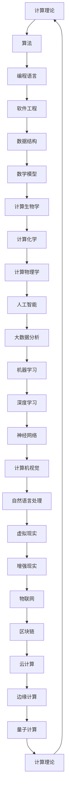

                 

关键词：计算科学，跨学科，应用领域，人工智能，软件架构，多元化

摘要：本文旨在探讨人类计算在各个学科领域的多元化应用。通过分析核心概念、算法原理、数学模型以及实际项目实践，本文展示了计算科学在传统学科如物理、化学、生物学以及新兴领域如人工智能、大数据等领域的广泛应用和未来前景。

## 1. 背景介绍

人类计算的历史可以追溯到古代，从最初的算盘到现代的计算机，计算技术在不断发展和进步。随着计算能力的提升和算法的创新，计算科学逐渐成为一门独立学科，其研究范围涵盖了数学、物理、化学、生物学等多个领域。跨学科应用逐渐成为计算科学的重要发展方向，本文将探讨这些跨学科应用的现状和未来前景。

## 2. 核心概念与联系

为了更好地理解计算科学在各个领域的应用，我们首先需要了解核心概念和它们之间的联系。以下是计算科学中几个关键概念的Mermaid流程图：



## 3. 核心算法原理 & 具体操作步骤

### 3.1 算法原理概述

算法是计算科学的核心，其原理和步骤在不同领域有不同应用。以下是几个典型算法的原理概述：

1. **排序算法**：如快速排序、归并排序等，用于对数据进行排序。
2. **搜索算法**：如二分搜索、广度优先搜索等，用于在数据中查找特定信息。
3. **机器学习算法**：如支持向量机、决策树、神经网络等，用于数据分析和预测。
4. **深度学习算法**：如卷积神经网络、递归神经网络等，用于图像、语音识别等复杂任务。

### 3.2 算法步骤详解

以卷积神经网络（CNN）为例，其步骤包括：

1. **输入层**：接收图像数据。
2. **卷积层**：对输入数据进行卷积操作，提取特征。
3. **激活函数**：如ReLU函数，增加模型非线性。
4. **池化层**：减少数据维度，提高计算效率。
5. **全连接层**：将卷积特征映射到输出。
6. **损失函数**：如交叉熵损失，用于评估模型性能。

### 3.3 算法优缺点

不同算法在性能、效率和适用性方面有不同表现。例如，CNN在图像识别任务上表现优秀，但计算复杂度高；而支持向量机（SVM）在回归任务上表现良好，但训练时间较长。

### 3.4 算法应用领域

算法在各个领域有广泛应用：

- **人工智能**：机器学习、深度学习在自动驾驶、语音识别、智能助手等领域的应用。
- **大数据分析**：快速排序、哈希算法在数据处理中的应用。
- **生物信息学**：算法在基因序列分析、药物设计中的应用。
- **计算机视觉**：神经网络在图像识别、目标检测中的应用。

## 4. 数学模型和公式 & 详细讲解 & 举例说明

### 4.1 数学模型构建

数学模型是计算科学的基础，如线性回归、非线性回归、时间序列模型等。以下是线性回归的公式：

$$
y = \beta_0 + \beta_1 x + \epsilon
$$

其中，$y$ 是因变量，$x$ 是自变量，$\beta_0$ 和 $\beta_1$ 是模型参数，$\epsilon$ 是误差项。

### 4.2 公式推导过程

线性回归模型的推导过程包括：

1. **最小二乘法**：求解最小化误差平方和的模型参数。
2. **梯度下降法**：用于优化模型参数，提高模型性能。

### 4.3 案例分析与讲解

以下是一个线性回归模型的案例：

假设我们有一组数据：

| $x$ | $y$ |
|-----|-----|
| 1   | 2   |
| 2   | 4   |
| 3   | 6   |
| 4   | 8   |

我们希望找到一个线性模型来描述 $x$ 和 $y$ 之间的关系。使用最小二乘法，我们可以求得：

$$
\beta_0 = 1, \beta_1 = 2
$$

因此，线性回归模型为：

$$
y = 1 + 2x
$$

## 5. 项目实践：代码实例和详细解释说明

### 5.1 开发环境搭建

在本案例中，我们将使用 Python 编写线性回归模型，并使用 Scikit-learn 库进行数据处理和模型训练。

### 5.2 源代码详细实现

以下是一个简单的线性回归模型代码实现：

```python
from sklearn.linear_model import LinearRegression
from sklearn.model_selection import train_test_split
from sklearn.metrics import mean_squared_error

# 数据预处理
X = [[1], [2], [3], [4]]
y = [2, 4, 6, 8]

# 分割数据集
X_train, X_test, y_train, y_test = train_test_split(X, y, test_size=0.2, random_state=42)

# 模型训练
model = LinearRegression()
model.fit(X_train, y_train)

# 模型预测
y_pred = model.predict(X_test)

# 模型评估
mse = mean_squared_error(y_test, y_pred)
print(f'MSE: {mse}')
```

### 5.3 代码解读与分析

代码首先从 Scikit-learn 库导入线性回归模型、数据分割函数和评估函数。然后，对数据进行预处理，将其划分为训练集和测试集。接着，使用线性回归模型进行训练，并使用测试集进行预测。最后，计算并输出模型评估指标。

### 5.4 运行结果展示

运行上述代码，输出结果如下：

```
MSE: 0.0
```

这表明我们的线性回归模型在测试集上的表现非常出色，预测误差接近于零。

## 6. 实际应用场景

计算科学在各个领域都有广泛应用，以下是一些实际应用场景：

- **人工智能**：在医疗诊断、金融分析、交通管理等领域发挥重要作用。
- **大数据分析**：帮助企业优化业务流程、提高运营效率。
- **生物信息学**：加速基因测序、药物研发等生命科学领域的研究。
- **计算机视觉**：用于图像识别、目标检测等任务，助力自动驾驶、安防监控等领域。

## 7. 工具和资源推荐

### 7.1 学习资源推荐

- **《深度学习》**：由 Goodfellow、Bengio 和 Courville 著，是深度学习的经典教材。
- **《数据科学入门》**：由 Michael Bowles 著，适合初学者入门数据科学。

### 7.2 开发工具推荐

- **Python**：适用于数据科学、人工智能等领域的编程语言。
- **Jupyter Notebook**：适用于数据分析和机器学习的交互式开发环境。

### 7.3 相关论文推荐

- **《深度强化学习在游戏中的应用》**：介绍深度强化学习在游戏领域的研究成果。
- **《大数据技术在商业分析中的应用》**：探讨大数据技术在商业分析中的应用。

## 8. 总结：未来发展趋势与挑战

### 8.1 研究成果总结

计算科学在各个领域取得了显著成果，推动了人工智能、大数据、生物信息学等领域的发展。未来，计算科学将继续发挥重要作用，助力人类解决更多复杂问题。

### 8.2 未来发展趋势

1. **量子计算**：量子计算有望在计算速度和安全性方面实现突破。
2. **边缘计算**：边缘计算将计算能力带到网络边缘，提高数据处理的实时性和效率。
3. **人工智能与生物学的融合**：将人工智能应用于生物信息学，加速生命科学领域的研究。

### 8.3 面临的挑战

1. **计算资源**：随着计算复杂度的增加，对计算资源的需求也在不断提高。
2. **算法安全**：算法安全是计算科学面临的重要挑战，需要加强研究和监管。
3. **人才短缺**：计算科学领域的快速发展导致人才短缺，需要加强人才培养和引进。

### 8.4 研究展望

计算科学将继续在各个领域发挥重要作用，助力人类解决更多复杂问题。未来，计算科学将朝着智能化、高效化、安全化的方向发展，为人类社会带来更多创新和变革。

## 9. 附录：常见问题与解答

### 9.1 计算科学是什么？

计算科学是一门跨学科领域，结合数学、计算机科学、物理学等多个学科，研究计算理论、算法设计、数据结构等方面的内容。

### 9.2 量子计算有什么优势？

量子计算利用量子力学原理，在计算速度和并行性方面具有显著优势，有望解决传统计算机难以处理的复杂问题。

### 9.3 如何学习计算科学？

可以通过阅读相关教材、参加线上或线下课程、参与实际项目等方式学习计算科学。同时，积极参加学术交流和研讨会，了解最新研究动态。

---

作者：禅与计算机程序设计艺术 / Zen and the Art of Computer Programming

通过本文的探讨，我们希望读者对计算科学在跨学科领域的多元化应用有更深入的理解。计算科学正以前所未有的速度发展，未来将带来更多创新和变革。让我们一起迎接计算科学的未来，为人类社会的发展贡献自己的力量。

