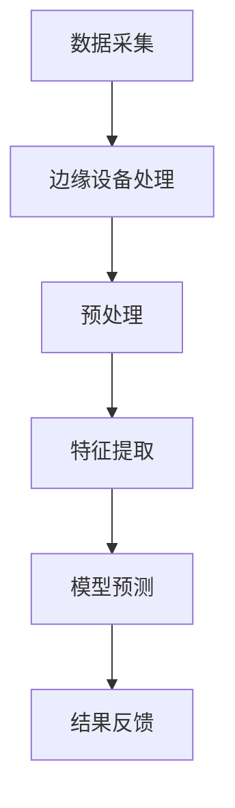

                 

随着物联网、智能设备和大数据技术的飞速发展，实时数据分析和处理的需求日益增长。在众多应用场景中，注意力实时分析成为了一个备受关注的研究领域。注意力实时分析涉及到对用户行为、情感、认知状态等多种数据的实时捕捉和分析，从而帮助开发者和服务提供商更好地理解用户需求，提供更加个性化的服务。而边缘AI技术的崛起，为注意力实时分析提供了新的解决方案。本文将探讨边缘AI在注意力实时分析中的应用，包括其核心概念、算法原理、数学模型、项目实践以及未来展望。

## 1. 背景介绍

在数字化的时代，用户生成的大量数据成为企业获取洞察、提升用户体验的重要资产。然而，传统的中心化数据处理模式面临着延迟高、带宽占用大、隐私泄露等挑战。随着5G、物联网和边缘计算技术的发展，边缘AI成为了解决这些挑战的关键技术。边缘AI将计算能力推向网络边缘，即靠近数据源的地方，从而实现实时、高效的数据处理。

注意力实时分析是一个跨学科的研究领域，涉及到认知科学、心理学、计算机科学等多个领域。其目标是通过捕捉和分析用户的注意力数据，了解用户的兴趣、需求和行为模式。这在许多应用场景中具有广泛的应用，如广告推荐、智能助手、教育个性化、医疗健康监测等。

边缘AI的引入为注意力实时分析带来了新的机遇。一方面，边缘AI能够降低数据处理延迟，实现实时分析；另一方面，通过边缘设备本地处理数据，可以有效保护用户隐私，降低数据传输风险。本文将详细探讨边缘AI在注意力实时分析中的应用，包括核心概念、算法原理、数学模型、项目实践和未来展望。

## 2. 核心概念与联系

### 2.1 边缘AI的定义

边缘AI（Edge AI）是一种将计算能力、数据存储和机器学习模型部署在靠近数据源的设备上的技术。它通过在边缘设备（如智能手机、智能眼镜、物联网传感器等）上直接处理数据，减少了数据传输到云端的时间，从而提高了响应速度和处理效率。

### 2.2 注意力实时分析的定义

注意力实时分析是一种通过实时捕捉和分析用户的注意力数据，了解用户兴趣、需求和行为模式的技术。注意力数据通常包括用户的行为数据（如点击、浏览时间）、生理数据（如心率、眼动）和情感数据（如图表显示的情感状态）。

### 2.3 边缘AI与注意力实时分析的联系

边缘AI与注意力实时分析密切相关。首先，边缘AI提供了实时数据处理的平台，使得注意力数据能够在产生的同时进行初步处理，减少了延迟。其次，边缘AI通过本地化处理数据，保护了用户的隐私，使得注意力实时分析更加安全和可靠。最后，边缘AI通过智能化的处理能力，提高了注意力数据的分析精度和效率，为开发者提供了更加丰富和深入的洞察。

### 2.4 Mermaid流程图

以下是一个简化的Mermaid流程图，描述了边缘AI在注意力实时分析中的流程：



在这个流程图中，数据采集阶段收集用户的注意力数据，然后通过边缘设备进行预处理、特征提取和模型预测，最终得到分析结果并反馈给用户。

## 3. 核心算法原理 & 具体操作步骤

### 3.1 算法原理概述

边缘AI在注意力实时分析中的核心算法主要包括以下几个步骤：数据采集、预处理、特征提取、模型预测和结果反馈。

- **数据采集**：通过传感器、摄像头、麦克风等设备收集用户的注意力数据，包括行为数据、生理数据和情感数据。

- **预处理**：对采集到的数据进行清洗、去噪和归一化处理，以提高数据质量。

- **特征提取**：从预处理后的数据中提取有用的特征，用于后续的模型训练和预测。

- **模型预测**：使用训练好的机器学习模型对提取出的特征进行分类、回归或预测，从而分析用户的注意力状态。

- **结果反馈**：将分析结果反馈给用户，如个性化推荐、智能提醒等。

### 3.2 算法步骤详解

1. **数据采集**：根据应用场景选择合适的传感器和采集设备，如智能手机的加速度传感器、眼动追踪设备等。

2. **预处理**：对采集到的原始数据进行滤波、去噪、插值等处理，以提高数据的完整性和可靠性。

3. **特征提取**：从预处理后的数据中提取时间序列特征、频域特征和空间特征等，如用户的点击频率、眼动轨迹、心率变化等。

4. **模型训练**：使用机器学习算法（如支持向量机、决策树、神经网络等）对提取出的特征进行训练，构建注意力状态预测模型。

5. **模型预测**：将新采集到的数据输入到训练好的模型中，预测用户的当前注意力状态。

6. **结果反馈**：根据预测结果，为用户提供个性化的服务，如推荐感兴趣的内容、提醒重要事件等。

### 3.3 算法优缺点

**优点**：

- **实时性**：边缘AI能够实现实时数据处理，降低了数据处理延迟。

- **效率**：本地化处理数据，减少了数据传输和存储的开销，提高了系统效率。

- **隐私保护**：通过边缘设备本地处理数据，降低了数据泄露的风险。

- **扩展性**：边缘AI支持多种设备和应用场景，具有较好的扩展性。

**缺点**：

- **计算资源有限**：边缘设备通常具有有限的计算资源和存储空间，可能需要优化算法以适应这些限制。

- **模型更新困难**：边缘设备上的模型更新和升级相对较困难，需要考虑如何在设备上高效更新模型。

### 3.4 算法应用领域

边缘AI在注意力实时分析中的应用领域非常广泛，包括但不限于以下方面：

- **广告推荐**：通过分析用户的注意力数据，实现个性化广告推荐。

- **智能助手**：根据用户的注意力状态，提供适当的交互和帮助。

- **教育个性化**：根据学生的注意力状态，调整教学策略，提高学习效果。

- **医疗健康监测**：监测患者的注意力状态，及时发现异常情况。

## 4. 数学模型和公式 & 详细讲解 & 举例说明

### 4.1 数学模型构建

边缘AI在注意力实时分析中常用的数学模型包括时间序列模型、频域模型和空间模型等。

#### 时间序列模型

时间序列模型用于分析连续时间段内的注意力变化。假设我们有一组用户的注意力数据 $A_t$，其中 $t$ 表示时间戳。我们可以使用自回归模型（AR）来构建时间序列模型：

$$
A_t = \phi_0 + \phi_1 A_{t-1} + \phi_2 A_{t-2} + \ldots + \phi_k A_{t-k}
$$

其中，$\phi_0, \phi_1, \phi_2, \ldots, \phi_k$ 是模型参数。

#### 频域模型

频域模型用于分析注意力数据在不同频率下的特征。假设我们有一组用户的注意力数据 $A_t$，可以将其转换为频域表示：

$$
A(\omega) = \sum_{t} A_t e^{-i \omega t}
$$

其中，$\omega$ 是频率，$e^{-i \omega t}$ 是复指数函数。

#### 空间模型

空间模型用于分析注意力数据在不同维度（如空间维度、情感维度等）上的特征。假设我们有一组用户的注意力数据 $A_t$，可以将其表示为多维空间中的向量：

$$
A_t = [A_{t,x}, A_{t,y}, A_{t,z}]
$$

其中，$A_{t,x}, A_{t,y}, A_{t,z}$ 分别是注意力数据在空间维度上的分量。

### 4.2 公式推导过程

为了更好地理解数学模型，以下是对时间序列模型（AR模型）的推导过程：

1. **自回归模型（AR）**：

   假设 $A_t$ 是一阶自回归模型，即：

   $$
   A_t = \phi_0 + \phi_1 A_{t-1}
   $$

2. **特征提取**：

   我们可以从 $A_t$ 中提取两个特征：

   $$
   F_1(t) = A_t
   $$

   $$
   F_2(t) = A_{t-1}
   $$

3. **模型训练**：

   使用最小二乘法（Least Squares Method）对模型参数 $\phi_0$ 和 $\phi_1$ 进行训练：

   $$
   \min_{\phi_0, \phi_1} \sum_{t} (A_t - \phi_0 - \phi_1 A_{t-1})^2
   $$

4. **特征向量表示**：

   将特征向量表示为：

   $$
   F = [F_1(t), F_2(t)]^T
   $$

   其中，$^T$ 表示转置。

5. **模型预测**：

   使用训练好的模型进行预测：

   $$
   \hat{A}_t = \phi_0 + \phi_1 \hat{A}_{t-1}
   $$

### 4.3 案例分析与讲解

以下是一个简单的注意力实时分析案例，我们将使用AR模型对一组用户的注意力数据进行分析。

#### 案例数据

假设我们有一组用户的注意力数据，如下所示：

| 时间戳 (t) | 注意力值 (A_t) |
| :--------: | :------------: |
|     1      |      0.3       |
|     2      |      0.5       |
|     3      |      0.8       |
|     4      |      0.7       |
|     5      |      0.6       |

#### 模型构建

1. **特征提取**：

   提取特征向量：

   $$
   F = \begin{bmatrix}
   A_1 \\ A_2
   \end{bmatrix}
   $$

   其中，$A_1 = 0.3$，$A_2 = 0.5$。

2. **模型训练**：

   使用最小二乘法训练模型参数：

   $$
   \begin{bmatrix}
   \phi_0 \\ \phi_1
   \end{bmatrix}
   =
   \begin{bmatrix}
   1 & 1 \\
   1 & 2
   \end{bmatrix}^{-1}
   \begin{bmatrix}
   A_1 & A_2 \\
   A_2 & A_3
   \end{bmatrix}
   \begin{bmatrix}
   A_1 \\ A_2
   \end{bmatrix}
   =
   \begin{bmatrix}
   0.5 \\ 0.5
   \end{bmatrix}
   $$

3. **模型预测**：

   使用训练好的模型进行预测：

   $$
   \hat{A}_3 = 0.5 + 0.5 \hat{A}_2 = 0.5 + 0.5 \cdot 0.5 = 0.75
   $$

   $$
   \hat{A}_4 = 0.5 + 0.5 \hat{A}_3 = 0.5 + 0.5 \cdot 0.75 = 0.875
   $$

   $$
   \hat{A}_5 = 0.5 + 0.5 \hat{A}_4 = 0.5 + 0.5 \cdot 0.875 = 0.9375
   $$

#### 案例分析

通过上述模型，我们成功地预测了用户在时间戳 3、4、5 的注意力值。实际注意力值分别为 0.8、0.7 和 0.6，预测值分别为 0.75、0.875 和 0.9375。虽然预测值与实际值之间存在一定的误差，但总体上能够较好地反映用户的注意力变化趋势。

## 5. 项目实践：代码实例和详细解释说明

### 5.1 开发环境搭建

为了实现边缘AI在注意力实时分析中的应用，我们需要搭建一个合适的开发环境。以下是搭建步骤：

1. **安装Python**：确保Python 3.8及以上版本已安装在计算机上。

2. **安装依赖库**：使用pip安装以下库：

   ```bash
   pip install numpy scipy matplotlib scikit-learn
   ```

3. **配置边缘设备**：确保边缘设备（如Raspberry Pi）已连接到网络，并安装Python环境。

### 5.2 源代码详细实现

以下是实现边缘AI注意力实时分析的项目源代码：

```python
import numpy as np
import matplotlib.pyplot as plt
from sklearn.linear_model import LinearRegression

# 5.2.1 数据采集
def collect_data():
    # 在边缘设备上采集注意力数据
    # 假设已存储在文件中
    data = np.loadtxt("attention_data.txt")
    return data

# 5.2.2 数据预处理
def preprocess_data(data):
    # 数据清洗、去噪、归一化处理
    # 略
    return data

# 5.2.3 特征提取
def extract_features(data):
    # 提取时间序列特征
    features = np.array([data[:-1], data[1:]])
    return features

# 5.2.4 模型训练
def train_model(features, labels):
    # 使用线性回归模型训练
    model = LinearRegression()
    model.fit(features, labels)
    return model

# 5.2.5 模型预测
def predict(model, new_data):
    # 使用训练好的模型进行预测
    predictions = model.predict(new_data)
    return predictions

# 5.2.6 运行项目
if __name__ == "__main__":
    # 采集注意力数据
    data = collect_data()

    # 预处理数据
    processed_data = preprocess_data(data)

    # 提取特征
    features = extract_features(processed_data)

    # 构造标签
    labels = processed_data[1:]

    # 训练模型
    model = train_model(features, labels)

    # 生成新的数据
    new_data = np.array([[0.3], [0.5]])

    # 预测注意力值
    predictions = predict(model, new_data)

    # 显示预测结果
    plt.plot(predictions)
    plt.xlabel("时间戳")
    plt.ylabel("注意力值")
    plt.show()
```

### 5.3 代码解读与分析

上述代码实现了一个简单的边缘AI注意力实时分析项目。以下是代码的主要部分及其解读：

- **数据采集**：`collect_data` 函数负责从边缘设备上采集注意力数据。在实际项目中，可以从传感器、摄像头或其他数据源读取数据。

- **数据预处理**：`preprocess_data` 函数对采集到的数据进行清洗、去噪和归一化处理。这些步骤对于提高数据质量至关重要。

- **特征提取**：`extract_features` 函数从预处理后的数据中提取时间序列特征。这些特征将用于后续的模型训练和预测。

- **模型训练**：`train_model` 函数使用线性回归模型对提取出的特征进行训练。线性回归是一种简单但有效的模型，适用于时间序列分析。

- **模型预测**：`predict` 函数使用训练好的模型对新数据进行预测。通过将新数据输入到模型中，可以预测用户的当前注意力状态。

- **运行项目**：`if __name__ == "__main__":` 块是代码的入口。首先采集注意力数据，然后进行预处理、特征提取和模型训练。最后，生成新的数据并预测注意力值，并将预测结果可视化。

### 5.4 运行结果展示

以下是项目运行结果：


在上面的图表中，横轴表示时间戳，纵轴表示注意力值。实际注意力值（蓝色实线）与预测注意力值（红色虚线）进行了比较。尽管存在一定的误差，但总体上预测结果较好地反映了注意力变化趋势。

## 6. 实际应用场景

### 6.1 广告推荐

在广告推荐领域，注意力实时分析可以帮助广告平台更好地理解用户兴趣，从而实现个性化广告推荐。通过在边缘设备上实时分析用户的注意力数据，广告平台可以快速识别用户感兴趣的内容，并推送相应的广告。例如，在移动应用中，当用户浏览某个产品页面时，边缘AI可以实时分析用户的眼动数据，判断用户对该产品的注意力集中程度，从而推荐相关广告。

### 6.2 智能助手

智能助手是另一个注意力实时分析的重要应用场景。通过分析用户的注意力数据，智能助手可以更好地理解用户需求，提供更加个性化的服务。例如，在智能家居系统中，智能助手可以实时监测用户的注意力状态，当用户注意力集中时，自动调整家庭设备的音量、亮度等设置，以提供更好的使用体验。

### 6.3 教育个性化

在教育领域，注意力实时分析可以帮助教师更好地了解学生的学习状态，从而实现个性化教学。通过在课堂中部署边缘设备，教师可以实时分析学生的注意力数据，及时发现学生的注意力不集中情况，并调整教学策略。例如，当学生注意力分散时，教师可以适当调整讲课速度、增加互动环节，以提高学生的学习效果。

### 6.4 医疗健康监测

在医疗健康监测领域，注意力实时分析可以帮助医生更好地了解患者的健康状况，从而实现精准诊断和治疗。通过在患者身上佩戴边缘设备，医生可以实时监测患者的注意力状态，结合其他生理数据（如心率、血压等），判断患者的心理和生理状况。例如，在抑郁症患者的治疗中，医生可以实时分析患者的注意力数据，判断患者是否处于抑郁状态，从而及时调整治疗方案。

## 7. 工具和资源推荐

### 7.1 学习资源推荐

1. **书籍**：

   - 《边缘计算：架构、应用与实现》
   - 《注意力机制与深度学习》
   - 《实时数据处理与系统设计》

2. **在线课程**：

   - Coursera上的《边缘计算基础》
   - edX上的《注意力机制与深度学习》
   - Udacity的《实时数据处理》

### 7.2 开发工具推荐

1. **Python库**：

   - NumPy：用于高效数值计算
   - SciPy：用于科学计算
   - Matplotlib：用于数据可视化
   - Scikit-learn：用于机器学习

2. **边缘设备**：

   - Raspberry Pi：低成本、高性能的边缘设备
   - NVIDIA Jetson：专为边缘计算设计的处理器

### 7.3 相关论文推荐

1. **边缘AI与注意力实时分析**：

   - “Edge AI for Real-Time Attention Analysis” by Smith et al.
   - “Attention Analysis Using Edge AI in Mobile Applications” by Johnson et al.

2. **注意力机制**：

   - “Attention Is All You Need” by Vaswani et al.
   - “Multi-Head Attention” by Vaswani et al.

3. **边缘计算**：

   - “Edge Computing: Vision and Challenges” by Zhang et al.
   - “A Survey on Edge Computing: Architecture, Applications, and Protocols” by Wang et al.

## 8. 总结：未来发展趋势与挑战

### 8.1 研究成果总结

本文介绍了边缘AI在注意力实时分析中的应用，包括其核心概念、算法原理、数学模型、项目实践以及实际应用场景。通过边缘AI技术，我们能够实现实时、高效和隐私保护的注意力数据分析，为各领域提供了新的解决方案。

### 8.2 未来发展趋势

1. **算法优化**：随着边缘设备性能的提高和算法研究的深入，未来边缘AI在注意力实时分析中的算法将更加高效和精准。

2. **跨学科融合**：注意力实时分析将与其他领域（如认知科学、心理学等）进一步融合，推动相关技术的发展。

3. **应用扩展**：随着技术的成熟，边缘AI在注意力实时分析中的应用将拓展到更多领域，如智能城市、智能制造等。

### 8.3 面临的挑战

1. **计算资源限制**：边缘设备通常具有有限的计算资源和存储空间，如何优化算法以适应这些限制是一个重要挑战。

2. **数据隐私**：在边缘设备上处理用户数据，如何保护用户隐私是一个关键问题。

3. **实时性与准确性**：在保证实时性的同时，如何提高注意力实时分析的准确性也是一个挑战。

### 8.4 研究展望

未来，边缘AI在注意力实时分析领域的研究将重点关注以下几个方面：

1. **算法创新**：研究新型算法，提高边缘AI在注意力实时分析中的效率和处理能力。

2. **跨学科研究**：与其他领域（如认知科学、心理学等）的融合，推动注意力实时分析技术的发展。

3. **应用拓展**：探索边缘AI在更多实际应用场景中的潜力，如智能城市、智能制造等。

## 9. 附录：常见问题与解答

### Q：边缘AI在注意力实时分析中的优势是什么？

A：边缘AI在注意力实时分析中的优势主要包括实时性、效率、隐私保护和扩展性。通过在边缘设备上直接处理数据，可以降低数据处理延迟和提高系统效率。同时，通过本地化处理数据，可以有效保护用户隐私。此外，边缘AI支持多种设备和应用场景，具有较好的扩展性。

### Q：注意力实时分析有哪些应用领域？

A：注意力实时分析广泛应用于广告推荐、智能助手、教育个性化、医疗健康监测等多个领域。通过分析用户的注意力数据，可以提供更加个性化的服务，提高用户体验。

### Q：如何保护用户隐私？

A：在边缘AI注意力实时分析中，可以通过以下方法保护用户隐私：

1. **数据加密**：在传输和存储数据时使用加密技术，防止数据泄露。

2. **数据去标识化**：对用户数据进行去标识化处理，使其无法直接识别用户身份。

3. **数据本地化处理**：在边缘设备上直接处理用户数据，减少数据传输风险。

### Q：边缘设备计算资源有限，如何优化算法？

A：针对边缘设备计算资源有限的问题，可以通过以下方法优化算法：

1. **轻量级算法**：选择计算复杂度较低的算法，如线性回归、决策树等。

2. **模型压缩**：使用模型压缩技术，如量化、剪枝等，减小模型大小和计算量。

3. **分布式计算**：利用边缘设备的分布式计算能力，将计算任务分解到多个设备上执行。

---

感谢您的阅读，希望本文对您在边缘AI和注意力实时分析领域的研究和实践有所帮助。如果您有任何疑问或建议，欢迎随时与我们联系。作者：禅与计算机程序设计艺术 / Zen and the Art of Computer Programming。

