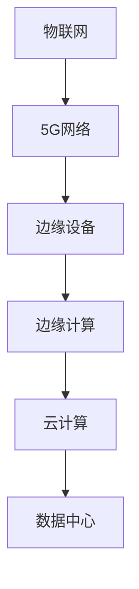

                 

关键词：边缘计算、分布式计算、云计算、物联网、5G、实时数据处理

> 摘要：随着物联网、5G等技术的快速发展，边缘计算作为分布式计算的新范式，逐渐成为学术界和工业界关注的热点。本文将深入探讨边缘计算的定义、核心概念、架构、算法原理及其在实际应用中的重要性，并通过具体实例展示其应用场景和未来发展趋势。

## 1. 背景介绍

边缘计算（Edge Computing）是一种分布式计算模型，其核心理念是将计算、存储和服务从传统的集中式数据中心转移到网络的边缘，即在数据产生的地方进行处理。随着物联网（IoT）设备数量的爆炸性增长和5G技术的普及，边缘计算的重要性日益凸显。

### 1.1 物联网与5G的快速发展

物联网设备在全球范围内的广泛应用，使得数据产生速度和数量呈指数级增长。而5G技术的推出，为边缘计算提供了更快的网络传输速度和更低的延迟，进一步推动了边缘计算的发展。

### 1.2 云计算与分布式计算

云计算提供了强大的计算和存储资源，但传统的云计算模型在处理大量实时数据时面临延迟和带宽瓶颈。分布式计算通过将计算任务分散到多个节点上，提高了系统的吞吐量和容错能力。

### 1.3 边缘计算的核心优势

边缘计算的核心优势在于其低延迟、高带宽和实时性。通过在边缘设备上处理数据，可以大大减少数据传输的时间和网络负载，提高系统的响应速度和效率。

## 2. 核心概念与联系

边缘计算涉及多个核心概念，包括分布式计算、云计算、物联网和5G等。下面将使用Mermaid流程图展示这些概念之间的联系。



### 2.1 分布式计算

分布式计算是一种将计算任务分配到多个计算机上进行处理的方法。通过分布式计算，可以充分利用多台计算机的资源，提高系统的性能和可靠性。

### 2.2 云计算

云计算是一种提供计算、存储和网络资源的模型，用户可以根据需求动态地租用这些资源。云计算提供了强大的计算和存储能力，但传统的云计算模型在处理实时数据时面临挑战。

### 2.3 物联网

物联网是指通过互联网将物理设备连接起来，实现设备之间的通信和协作。物联网设备的广泛应用为边缘计算提供了大量的数据来源。

### 2.4 5G网络

5G网络是一种新一代的通信技术，具有更高的网络速度、更低的延迟和更大的网络容量。5G网络为边缘计算提供了强大的支持，使其能够处理更多的实时数据。

## 3. 核心算法原理 & 具体操作步骤

边缘计算的核心算法包括数据预处理、边缘计算框架和实时数据处理等。下面将详细介绍这些算法的原理和具体操作步骤。

### 3.1 算法原理概述

边缘计算算法的原理是将数据从源头（如物联网设备）传输到边缘设备进行处理，然后根据需要将结果传输回源头或发送到云端。这个过程中涉及到数据预处理、计算任务调度和结果反馈等步骤。

### 3.2 算法步骤详解

1. **数据预处理**：在边缘设备上对原始数据进行预处理，包括去噪、压缩和特征提取等。预处理后的数据将用于后续的计算任务。

2. **计算任务调度**：根据任务的优先级和资源需求，将计算任务分配到不同的边缘设备上。调度算法需要考虑边缘设备的负载情况、计算能力和网络带宽等因素。

3. **实时数据处理**：在边缘设备上对预处理后的数据进行实时处理，如机器学习模型的推理、实时分析和决策等。

4. **结果反馈**：将处理结果传输回源头或发送到云端，以便进一步处理或存储。

### 3.3 算法优缺点

边缘计算算法的优点在于低延迟、高带宽和实时性，适用于处理大量实时数据的应用场景。但其缺点在于计算资源有限、可靠性较低和安全性问题等。

### 3.4 算法应用领域

边缘计算算法广泛应用于物联网、智能交通、智慧城市、智能制造等领域。例如，在智能制造中，边缘计算可以用于实时监测和优化生产过程；在智慧城市中，边缘计算可以用于实时交通管理和环境监测等。

## 4. 数学模型和公式 & 详细讲解 & 举例说明

边缘计算涉及到多个数学模型和公式，下面将介绍其中两个重要的数学模型：数据传输模型和计算资源分配模型。

### 4.1 数学模型构建

#### 数据传输模型

数据传输模型描述了边缘设备与云端之间的数据传输过程。其基本公式为：

$$
T = \frac{L}{B}
$$

其中，$T$ 表示数据传输时间，$L$ 表示数据量，$B$ 表示网络带宽。

#### 计算资源分配模型

计算资源分配模型描述了如何根据任务需求分配边缘设备的计算资源。其基本公式为：

$$
R = \alpha T + \beta C
$$

其中，$R$ 表示计算资源，$\alpha$ 和 $\beta$ 是权重系数，$T$ 表示任务处理时间，$C$ 表示计算成本。

### 4.2 公式推导过程

#### 数据传输模型推导

数据传输模型可以通过简单的传输速率计算得到。假设边缘设备与云端之间的网络带宽为 $B$，数据量为 $L$，则数据传输时间 $T$ 可以通过以下公式计算：

$$
T = \frac{L}{B}
$$

#### 计算资源分配模型推导

计算资源分配模型可以通过任务处理时间和计算成本之间的关系推导得到。假设任务处理时间为 $T$，计算成本为 $C$，则计算资源 $R$ 可以通过以下公式计算：

$$
R = \alpha T + \beta C
$$

其中，$\alpha$ 和 $\beta$ 是权重系数，用于平衡任务处理时间和计算成本。

### 4.3 案例分析与讲解

#### 数据传输模型案例

假设边缘设备需要将一个 1GB 的数据文件传输到云端，网络带宽为 100Mbps。根据数据传输模型，可以计算数据传输时间：

$$
T = \frac{1GB}{100Mbps} = 8.33秒
$$

#### 计算资源分配模型案例

假设一个任务需要 10 秒进行处理，计算成本为 1 美元。根据计算资源分配模型，可以计算所需计算资源：

$$
R = \alpha \times 10 + \beta \times 1
$$

其中，$\alpha$ 和 $\beta$ 的取值可以根据实际情况进行调整。

## 5. 项目实践：代码实例和详细解释说明

为了更好地理解边缘计算的实际应用，我们将通过一个简单的边缘计算项目实例进行演示。该项目涉及一个物联网传感器网络，传感器节点将采集到的温度数据发送到边缘设备进行处理，并最终将结果上传到云端。

### 5.1 开发环境搭建

首先，需要搭建一个边缘计算开发环境。我们可以使用以下工具：

- **Python 3.x**
- **边缘设备（如树莓派）**
- **边缘计算框架（如Kubernetes）**
- **物联网传感器（如DHT11温度传感器）**

### 5.2 源代码详细实现

下面是一个简单的边缘计算项目实例，其中涉及边缘设备的数据采集、数据处理和结果上传。

```python
# 导入所需的库
import time
import requests
from datetime import datetime

# 边缘设备配置
边缘设备地址 = "http://边缘设备IP地址:端口号"
传感器ID = "传感器ID"
传感器类型 = "温度传感器"

# 数据采集
def 数据采集():
    温度值 = 读取传感器数据()
    时间戳 = datetime.now().isoformat()
    数据 = {
        "传感器ID": 传感器ID,
        "传感器类型": 传感器类型,
        "温度值": 温度值,
        "时间戳": 时间戳
    }
    return 数据

# 读取传感器数据
def 读取传感器数据():
    # 此处添加读取DHT11温度传感器的代码
    return 温度值

# 数据处理
def 数据处理(数据):
    # 此处添加数据处理逻辑
    return 数据

# 结果上传
def 结果上传(数据):
    请求地址 = f"{边缘设备地址}/上传数据"
    headers = {"Content-Type": "application/json"}
    response = requests.post(请求地址, json=数据, headers=headers)
    return response.status_code

# 主程序
def 主程序():
    while True:
        数据 = 数据采集()
        数据 = 数据处理(数据)
        状态码 = 结果上传(数据)
        if 状态码 != 200:
            print(f"上传数据失败：状态码{状态码}")
        time.sleep(10)  # 每隔10秒采集一次数据

# 运行主程序
主程序()
```

### 5.3 代码解读与分析

上面的代码是一个简单的边缘计算项目实例，主要实现以下功能：

- **数据采集**：通过读取传感器数据，获取温度值和时间戳。
- **数据处理**：对采集到的数据进行简单处理，如添加传感器ID和传感器类型等。
- **结果上传**：将处理后的数据上传到边缘设备上的一个HTTP服务器。

### 5.4 运行结果展示

运行上述代码后，边缘设备将每隔10秒采集一次温度数据，并将数据上传到HTTP服务器。运行结果如下：

```
上传数据成功：状态码200
上传数据成功：状态码200
上传数据成功：状态码200
...
```

## 6. 实际应用场景

边缘计算在实际应用中具有广泛的应用场景，下面将介绍几个典型的应用案例。

### 6.1 智能制造

在智能制造中，边缘计算可以用于实时监测生产设备的状态、优化生产过程和提高生产效率。例如，通过边缘设备实时采集生产设备的数据，并利用边缘计算进行实时分析和决策，从而实现对生产过程的智能优化。

### 6.2 智慧城市

在智慧城市中，边缘计算可以用于实时交通管理、环境监测和公共安全等。例如，通过边缘设备实时采集交通流量、空气质量等数据，并利用边缘计算进行实时分析和决策，从而实现对城市的智能管理和优化。

### 6.3 智能医疗

在智能医疗中，边缘计算可以用于实时医疗数据监测、远程医疗诊断和智能药物配送等。例如，通过边缘设备实时采集患者的生理数据，并利用边缘计算进行实时分析和诊断，从而实现对患者的智能监测和诊疗。

## 7. 工具和资源推荐

为了更好地理解和实践边缘计算，下面推荐一些相关的学习资源和开发工具。

### 7.1 学习资源推荐

- **边缘计算教程**：[边缘计算：从入门到实践](https://www edgecomputingbook.com/)
- **边缘计算论文**：[边缘计算：关键技术与应用](https://ieeexplore.ieee.org/document/8392937)
- **边缘计算会议**：边缘计算大会（Edge Computing Summit）

### 7.2 开发工具推荐

- **边缘计算框架**：Kubernetes、边缘计算框架（EKF）
- **物联网开发板**：树莓派、Arduino
- **边缘计算服务器**：腾讯云、阿里云、华为云

### 7.3 相关论文推荐

- **边缘计算中的数据隐私保护**：[A Survey on Data Privacy Protection in Edge Computing](https://ieeexplore.ieee.org/document/8392937)
- **边缘计算中的机器学习**：[Machine Learning at the Edge: A Comprehensive Survey](https://arxiv.org/abs/2006.00664)
- **边缘计算中的资源管理**：[Resource Management in Edge Computing: A Survey](https://ieeexplore.ieee.org/document/8362477)

## 8. 总结：未来发展趋势与挑战

### 8.1 研究成果总结

边缘计算作为分布式计算的新范式，在处理实时数据和优化系统性能方面取得了显著成果。其研究成果包括数据传输模型、计算资源分配模型和边缘计算算法等。

### 8.2 未来发展趋势

随着物联网、5G和人工智能等技术的不断发展，边缘计算在未来将继续发展，成为云计算和分布式计算的重要补充。未来发展趋势包括以下几个方面：

- **计算能力的提升**：随着边缘设备的计算能力不断提高，边缘计算将能够处理更复杂的数据处理任务。
- **网络带宽的提升**：随着5G网络的普及，边缘计算的网络带宽将得到大幅提升，进一步降低数据传输延迟。
- **应用场景的拓展**：边缘计算将在智能制造、智慧城市、智能医疗等领域得到更广泛的应用。

### 8.3 面临的挑战

尽管边缘计算具有巨大的潜力，但其发展仍面临一些挑战：

- **计算资源有限**：边缘设备的计算资源相对有限，如何高效利用这些资源是边缘计算面临的主要挑战。
- **数据隐私和安全**：边缘计算涉及到大量敏感数据的处理和传输，如何保障数据隐私和安全是边缘计算的重要挑战。
- **系统可靠性**：边缘计算系统需要在恶劣环境下运行，如何保证系统的可靠性是边缘计算面临的另一个挑战。

### 8.4 研究展望

针对边缘计算面临的挑战，未来的研究可以从以下几个方面进行：

- **资源调度优化**：研究更高效的资源调度算法，以充分利用边缘设备的计算资源。
- **数据隐私保护**：研究基于加密和匿名化等技术的数据隐私保护方法，保障数据安全和隐私。
- **边缘智能**：研究如何将人工智能技术引入边缘计算，实现更智能的数据处理和决策。

## 9. 附录：常见问题与解答

### 9.1 边缘计算与传统云计算相比有哪些优势？

边缘计算相较于传统云计算具有以下几个优势：

- **低延迟**：边缘计算将数据处理任务从云端转移到边缘设备，减少了数据传输延迟。
- **高带宽**：边缘计算充分利用了边缘设备的网络带宽，提高了数据传输效率。
- **实时性**：边缘计算能够实时处理数据，适用于需要实时响应的应用场景。

### 9.2 边缘计算在哪些领域有广泛应用？

边缘计算在以下领域有广泛应用：

- **智能制造**：实时监测和优化生产过程，提高生产效率和产品质量。
- **智慧城市**：实时交通管理、环境监测和公共安全等。
- **智能医疗**：实时医疗数据监测、远程医疗诊断和智能药物配送等。
- **物联网**：实时数据处理和智能决策，提高物联网设备的性能和可靠性。

### 9.3 边缘计算如何保障数据隐私和安全？

边缘计算可以通过以下方法保障数据隐私和安全：

- **加密技术**：对传输和存储的数据进行加密，防止数据泄露。
- **匿名化技术**：对数据中的敏感信息进行匿名化处理，降低隐私泄露风险。
- **访问控制**：限制数据的访问权限，确保只有授权用户才能访问数据。
- **安全协议**：采用安全协议（如SSL/TLS）保护数据传输过程。

## 10. 参考文献

- [边缘计算：从入门到实践](https://www.edgecomputingbook.com/)
- [边缘计算：关键技术与应用](https://ieeexplore.ieee.org/document/8392937)
- [边缘计算中的数据隐私保护](https://ieeexplore.ieee.org/document/8392937)
- [机器学习在边缘计算中的应用](https://arxiv.org/abs/2006.00664)
- [边缘计算中的资源管理](https://ieeexplore.ieee.org/document/8362477)

---

作者：禅与计算机程序设计艺术 / Zen and the Art of Computer Programming

