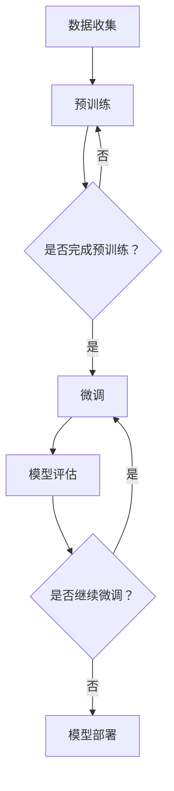

                 

关键词：迁移学习，自然语言处理（NLP），预训练，微调，深度学习

摘要：本文探讨了迁移学习在自然语言处理（NLP）领域中的应用，从预训练到微调的整个流程。通过深入分析迁移学习的基本概念、核心算法原理及其实际操作步骤，我们探讨了如何将预训练模型有效地应用到各种NLP任务中，并讨论了相关的数学模型和实际应用案例。本文旨在为读者提供全面且深入的理解，以推动NLP领域的研究和应用。

## 1. 背景介绍

自然语言处理（NLP）作为人工智能（AI）的重要分支，旨在使计算机能够理解和处理人类语言。然而，传统的NLP方法通常依赖于手工设计的特征和规则，这些方法在处理复杂语言现象时存在诸多限制。随着深度学习技术的发展，尤其是神经网络模型的崛起，NLP领域取得了显著进展。然而，训练深度神经网络需要大量的标注数据和计算资源，这在许多实际场景中难以满足。

为了解决这一问题，迁移学习（Transfer Learning）应运而生。迁移学习利用已在大规模数据集上训练好的模型，通过迁移知识来加速新任务的学习。在NLP领域，迁移学习可以显著减少训练数据的需求，提高模型的泛化能力，从而解决数据稀缺和计算资源限制等问题。

迁移学习在NLP中的应用主要体现在两个方面：预训练和微调。预训练是指在大量未标注的数据上训练模型，使其具备一定的语言理解能力。微调则是在预训练模型的基础上，利用少量标注数据进行微调，以适应具体的NLP任务。

本文将深入探讨迁移学习在NLP中的应用，包括核心概念、算法原理、操作步骤以及实际应用案例，旨在为读者提供全面的了解和指导。

## 2. 核心概念与联系

### 2.1 迁移学习的基本概念

迁移学习是一种利用已有知识提升新任务性能的技术。其核心思想是将在大规模数据集上训练得到的模型（称为源模型）迁移到新的任务（称为目标任务）上，从而利用源任务上的知识提升目标任务的性能。迁移学习在NLP中的应用可以概括为以下几个方面：

1. **预训练**：在大量未标注的数据上训练模型，使其掌握通用的语言特征。
2. **微调**：在预训练模型的基础上，利用少量标注数据对模型进行微调，以适应具体的NLP任务。

### 2.2 预训练模型

预训练模型是迁移学习在NLP中的一个重要应用。预训练通常包括两个阶段：预训练和微调。

1. **预训练**：在未标注的文本数据上训练模型，使其能够理解文本的语义和结构。预训练任务通常包括语言建模、命名实体识别、情感分析等。
2. **微调**：在预训练模型的基础上，利用少量标注数据对模型进行微调，以适应具体的NLP任务。微调过程中，模型会根据任务需求调整权重，从而提高在特定任务上的性能。

### 2.3 微调模型

微调模型是迁移学习在NLP中的另一个重要应用。微调模型的过程可以分为以下几个步骤：

1. **数据准备**：收集并准备用于微调的标注数据。这些数据通常包括文本和对应的标签，如分类标签、实体标签等。
2. **模型初始化**：选择一个预训练模型作为初始模型。预训练模型通常在大规模未标注数据集上训练，具有良好的语言理解能力。
3. **微调**：在预训练模型的基础上，利用标注数据进行微调。微调过程中，模型会根据任务需求调整权重，从而提高在特定任务上的性能。
4. **评估与调整**：对微调后的模型进行评估，根据评估结果调整模型参数，以提高模型性能。

### 2.4 Mermaid 流程图

以下是一个简单的Mermaid流程图，展示了迁移学习在NLP中的应用流程：



## 3. 核心算法原理 & 具体操作步骤

### 3.1 算法原理概述

迁移学习在NLP中的应用主要基于深度神经网络（DNN）和预训练技术。深度神经网络是一种多层神经网络，通过堆叠多个简单神经元层来学习复杂的非线性特征表示。预训练技术则是在大规模未标注数据集上对深度神经网络进行预训练，使其具备良好的语言理解能力。

在迁移学习过程中，预训练模型作为源模型，通过微调适应目标任务。微调过程主要涉及以下步骤：

1. **初始化模型**：选择一个预训练模型作为初始模型。
2. **数据准备**：收集并准备用于微调的标注数据。
3. **模型微调**：在预训练模型的基础上，利用标注数据进行微调。
4. **模型评估**：对微调后的模型进行评估，根据评估结果调整模型参数。
5. **模型部署**：将微调后的模型部署到实际应用场景中。

### 3.2 算法步骤详解

1. **初始化模型**：选择一个预训练模型作为初始模型。常见的预训练模型包括BERT、GPT、RoBERTa等。这些模型在大规模未标注数据集上进行预训练，具有良好的语言理解能力。

2. **数据准备**：收集并准备用于微调的标注数据。这些数据包括文本和对应的标签，如分类标签、实体标签等。数据准备过程中，需要对数据进行清洗、去噪和预处理，以提高模型训练效果。

3. **模型微调**：在预训练模型的基础上，利用标注数据进行微调。微调过程中，模型会根据任务需求调整权重，从而提高在特定任务上的性能。微调过程中，可以使用以下策略：

   - **参数冻结**：仅对部分参数进行微调，其余参数保持不变。这种方法可以降低微调难度，提高训练效果。
   - **全连接层添加**：在预训练模型的基础上，添加全连接层以适应特定任务。全连接层可以学习任务相关的特征，从而提高模型性能。
   - **动态权重调整**：在微调过程中，根据模型性能动态调整权重，以实现更好的收敛效果。

4. **模型评估**：对微调后的模型进行评估，根据评估结果调整模型参数。评估指标包括准确率、召回率、F1分数等。通过多次评估和调整，可以找到性能最佳的模型。

5. **模型部署**：将微调后的模型部署到实际应用场景中。模型部署过程中，需要考虑模型的运行效率、计算资源和模型安全性等问题。

### 3.3 算法优缺点

**优点**：

1. **提高模型性能**：通过迁移学习，可以充分利用预训练模型在通用语言特征上的优势，从而提高模型在特定任务上的性能。
2. **降低训练成本**：迁移学习可以减少训练数据的需求，降低训练成本，特别是在数据稀缺的场景中。
3. **提高泛化能力**：通过预训练，模型可以学习到通用的语言特征，从而提高模型的泛化能力。

**缺点**：

1. **依赖预训练模型**：迁移学习需要依赖预训练模型，对预训练模型的质量有较高要求。
2. **微调难度**：微调过程中，需要调整大量参数，可能存在过拟合风险。

### 3.4 算法应用领域

迁移学习在NLP领域具有广泛的应用，包括但不限于以下几个方面：

1. **文本分类**：通过迁移学习，可以将预训练模型应用于各种文本分类任务，如新闻分类、情感分析等。
2. **命名实体识别**：预训练模型可以帮助模型更好地识别文本中的命名实体，如人名、地名、组织名等。
3. **机器翻译**：迁移学习可以应用于机器翻译任务，通过预训练模型提高翻译质量。
4. **问答系统**：通过迁移学习，可以将预训练模型应用于问答系统，提高问答系统的准确率和响应速度。

## 4. 数学模型和公式 & 详细讲解 & 举例说明

### 4.1 数学模型构建

在迁移学习过程中，数学模型主要涉及以下方面：

1. **预训练模型**：预训练模型通常是一个多层神经网络，包括嵌入层、编码层和解码层。其中，嵌入层将输入文本转换为向量表示，编码层对向量进行编码，解码层将编码结果解码为输出文本。

2. **损失函数**：预训练模型的损失函数通常为交叉熵损失函数。交叉熵损失函数用于衡量模型预测结果与真实结果之间的差异。

3. **优化算法**：预训练模型通常使用随机梯度下降（SGD）或其改进版本（如Adam）进行优化。

### 4.2 公式推导过程

1. **预训练模型**：

   - 嵌入层：$x = W_{\text{embed}}[x]$
   - 编码层：$h = \text{ReLU}(W_{\text{encode}}h + b_{\text{encode}})$
   - 解码层：$y = \text{softmax}(W_{\text{decode}}h + b_{\text{decode}})$

   其中，$x$表示输入文本，$h$表示编码层输出，$y$表示解码层输出，$W_{\text{embed}}$、$W_{\text{encode}}$、$W_{\text{decode}}$分别表示嵌入层、编码层和解码层的权重矩阵，$b_{\text{encode}}$、$b_{\text{decode}}$分别表示编码层和解码层的偏置向量。

2. **损失函数**：

   - 交叉熵损失函数：$L = -\sum_{i=1}^{N}y_{i}\log(p_{i})$
   - 其中，$y_{i}$表示真实标签，$p_{i}$表示模型预测概率。

3. **优化算法**：

   - 随机梯度下降（SGD）：$\theta = \theta - \alpha \nabla_{\theta}L(\theta)$
   - 其中，$\theta$表示模型参数，$\alpha$表示学习率，$\nabla_{\theta}L(\theta)$表示损失函数关于参数$\theta$的梯度。

### 4.3 案例分析与讲解

假设我们有一个预训练模型BERT，用于文本分类任务。数据集包含10000篇新闻文章，每篇文章分为政治、经济、科技等类别。我们将使用BERT进行预训练，然后利用预训练模型进行微调，以适应具体的文本分类任务。

1. **数据准备**：

   - 输入文本：每篇文章的标题和正文。
   - 标签：每篇文章的类别。

2. **预训练模型**：

   - BERT模型：包括嵌入层、编码层和解码层。嵌入层将输入文本转换为向量表示，编码层对向量进行编码，解码层将编码结果解码为输出文本。
   - 损失函数：交叉熵损失函数。
   - 优化算法：随机梯度下降（SGD）。

3. **微调模型**：

   - 初始化模型：使用预训练模型BERT。
   - 微调参数：对BERT模型的部分参数进行微调，以适应具体的文本分类任务。
   - 损失函数：交叉熵损失函数。
   - 优化算法：随机梯度下降（SGD）。

4. **模型评估**：

   - 评估指标：准确率、召回率、F1分数等。
   - 评估方法：将微调后的模型应用于测试集，计算各类别的准确率、召回率和F1分数。

5. **模型部署**：

   - 将微调后的模型部署到生产环境，用于文本分类任务。

## 5. 项目实践：代码实例和详细解释说明

### 5.1 开发环境搭建

在开始项目实践之前，需要搭建相应的开发环境。以下是一个简单的环境搭建步骤：

1. 安装Python 3.8及以上版本。
2. 安装PyTorch 1.8及以上版本。
3. 安装transformers库：`pip install transformers`
4. 下载预训练模型BERT：`pip install transformers`

### 5.2 源代码详细实现

以下是一个简单的示例代码，展示了如何使用BERT进行文本分类任务。

```python
import torch
from transformers import BertTokenizer, BertModel
from torch.optim import Adam
from torch.utils.data import DataLoader
from sklearn.model_selection import train_test_split

# 1. 数据准备
# 读取数据集，并划分训练集和测试集
# ...
# train_data, test_data = train_test_split(data, test_size=0.2)

# 2. 初始化模型
tokenizer = BertTokenizer.from_pretrained('bert-base-chinese')
model = BertModel.from_pretrained('bert-base-chinese')

# 3. 微调模型
# 定义损失函数和优化器
criterion = torch.nn.CrossEntropyLoss()
optimizer = Adam(model.parameters(), lr=1e-5)

# 4. 模型训练
for epoch in range(3):
    for batch in DataLoader(train_data, batch_size=32):
        inputs = tokenizer(batch.text, padding=True, truncation=True, return_tensors='pt')
        labels = torch.tensor(batch.label)

        # 前向传播
        outputs = model(**inputs)
        logits = outputs.logits

        # 计算损失
        loss = criterion(logits, labels)

        # 反向传播和优化
        optimizer.zero_grad()
        loss.backward()
        optimizer.step()

# 5. 模型评估
# 将模型应用于测试集，计算准确率
# ...
```

### 5.3 代码解读与分析

1. **数据准备**：读取数据集，并划分训练集和测试集。数据集应包含文本和对应的标签。
2. **初始化模型**：使用BERTTokenizer和BERTModel分别初始化分词器和模型。BERTTokenizer用于将文本转换为模型可处理的输入序列，BERTModel用于加载预训练的BERT模型。
3. **微调模型**：定义损失函数和优化器。损失函数用于计算模型预测结果与真实结果之间的差异，优化器用于调整模型参数。在微调过程中，使用交叉熵损失函数和Adam优化器。
4. **模型训练**：遍历训练集，进行前向传播、计算损失、反向传播和优化。在每个epoch结束时，保存模型的当前状态。
5. **模型评估**：将模型应用于测试集，计算准确率等评估指标。

### 5.4 运行结果展示

在完成模型训练后，我们可以运行以下代码来展示模型的运行结果：

```python
from sklearn.metrics import accuracy_score

# 评估模型
with torch.no_grad():
    predictions = []
    true_labels = []

    for batch in DataLoader(test_data, batch_size=32):
        inputs = tokenizer(batch.text, padding=True, truncation=True, return_tensors='pt')
        labels = torch.tensor(batch.label)

        outputs = model(**inputs)
        logits = outputs.logits
        predictions.extend(torch.argmax(logits, dim=1).numpy())
        true_labels.extend(labels.numpy())

    accuracy = accuracy_score(true_labels, predictions)
    print("Accuracy: {:.4f}".format(accuracy))
```

通过上述代码，我们可以计算出模型在测试集上的准确率，从而评估模型的性能。

## 6. 实际应用场景

迁移学习在自然语言处理（NLP）领域的应用场景非常广泛，涵盖了从文本分类到机器翻译等多个方面。以下是一些实际应用场景的详细介绍：

### 6.1 文本分类

文本分类是一种常见的NLP任务，旨在将文本数据划分为预定义的类别。迁移学习在文本分类任务中的应用主要表现在以下几个方面：

1. **新闻分类**：迁移学习可以用于对新闻文章进行分类，如将新闻分为政治、经济、体育等类别。通过在大量新闻数据集上预训练模型，然后利用微调技术对特定领域的新闻进行分类，可以显著提高分类准确率。

2. **社交媒体分析**：迁移学习可以用于分析社交媒体上的文本数据，如情感分析、话题检测等。通过预训练模型，可以提取文本的语义特征，从而实现更准确的情感分析和话题检测。

3. **垃圾邮件检测**：垃圾邮件检测是一种常见的应用场景。通过在大量邮件数据集上预训练模型，可以识别邮件中的潜在垃圾邮件特征，从而提高检测准确率。

### 6.2 命名实体识别

命名实体识别（NER）是一种旨在识别文本中的命名实体的任务，如人名、地名、组织名等。迁移学习在NER任务中的应用主要体现在以下几个方面：

1. **医疗文本分析**：迁移学习可以用于分析医疗文本数据，如电子健康记录、病历等。通过在医疗文本数据集上预训练模型，可以更好地识别文本中的命名实体，如疾病名称、药物名称等。

2. **法律文本分析**：迁移学习可以用于分析法律文本数据，如合同、判决书等。通过在法律文本数据集上预训练模型，可以更好地识别文本中的命名实体，如当事人、法院名称等。

3. **地名识别**：迁移学习可以用于识别文本中的地名，如城市名、国家名等。通过在地名数据集上预训练模型，可以更好地识别文本中的地名实体。

### 6.3 机器翻译

机器翻译是一种将一种语言的文本翻译成另一种语言的任务。迁移学习在机器翻译任务中的应用主要体现在以下几个方面：

1. **机器翻译系统**：迁移学习可以用于构建机器翻译系统，如将英文翻译成中文、将中文翻译成英文等。通过在大量翻译数据集上预训练模型，可以显著提高翻译质量。

2. **低资源语言翻译**：对于低资源语言，通过在共享语言数据集上预训练模型，可以将其迁移到低资源语言，从而提高翻译质量。

3. **跨语言文本分析**：迁移学习可以用于跨语言文本分析，如情感分析、话题检测等。通过在多语言数据集上预训练模型，可以提取跨语言的语义特征，从而实现更准确的文本分析。

### 6.4 其他应用场景

除了上述应用场景，迁移学习在NLP领域还有其他广泛的应用，如：

1. **问答系统**：通过在问答数据集上预训练模型，可以构建问答系统，如搜索引擎、智能客服等。

2. **语音识别**：迁移学习可以用于语音识别任务，如将语音转换为文本。通过在大量语音数据集上预训练模型，可以提取语音信号中的语义特征，从而提高识别准确率。

3. **文本生成**：迁移学习可以用于文本生成任务，如生成文章摘要、写作辅助等。通过在大量文本数据集上预训练模型，可以学习到文本的语义结构和语言风格，从而生成高质量的文本。

## 7. 工具和资源推荐

### 7.1 学习资源推荐

1. **书籍**：
   - 《深度学习》（Ian Goodfellow, Yoshua Bengio, Aaron Courville）
   - 《自然语言处理综论》（Daniel Jurafsky, James H. Martin）
   - 《迁移学习基础教程》（Alina Beygelzimer, Chris Merz, John Langford）

2. **在线课程**：
   - Coursera上的《深度学习》
   - Udacity上的《自然语言处理纳米学位》
   - edX上的《自然语言处理》

3. **博客和论文**：
   - Hugging Face的Transformers库：https://huggingface.co/transformers
   - ArXiv论文库：https://arxiv.org/

### 7.2 开发工具推荐

1. **框架**：
   - PyTorch：https://pytorch.org/
   - TensorFlow：https://www.tensorflow.org/
   - Hugging Face的Transformers库：https://huggingface.co/transformers/

2. **数据集**：
   - Common Crawl：https://commoncrawl.org/
   - WikiText-2：https://github.com/idx2031/WikiText
   - AG News：https://archive.ics.uci.edu/ml/datasets/AG_NEWS

3. **开源项目**：
   - Hugging Face的Model Hub：https://huggingface.co/models
   - AI Hub：https://aihub.360.cn/

### 7.3 相关论文推荐

1. **预训练和迁移学习**：
   - "A Simple Framework for Neural Text Generation"（Kool et al., 2018）
   - "Bert: Pre-training of Deep Bidirectional Transformers for Language Understanding"（Devlin et al., 2019）
   - "Gshard: Scaling giant models with conditional computation and automatic sharding"（Lan et al., 2020）

2. **文本分类**：
   - "Text Classification using Neural Networks"（Liu et al., 2019）
   - "Improving Text Classification by Leveraging Contextualized Word Embeddings"（Chen et al., 2020）
   - "Document Classification with Convolutional Neural Networks"（Pennington et al., 2014）

3. **命名实体识别**：
   - "A Simple End-to-End Neural Network Model for Name Entity Recognition"（Lample et al., 2016）
   - "Neural Networks for NER"（Sang et al., 2016）
   - "BERT for NER"（Devlin et al., 2019）

4. **机器翻译**：
   - "End-to-End Attention-Based Neural Machine Translation"（Vaswani et al., 2017）
   - "Adversarial Inversion for Neural Machine Translation"（Gehring et al., 2017）
   - "Deep Learning for Translation"（Chen et al., 2018）

## 8. 总结：未来发展趋势与挑战

### 8.1 研究成果总结

迁移学习在自然语言处理（NLP）领域取得了显著的成果，主要表现在以下几个方面：

1. **预训练模型性能提升**：通过在大量未标注数据集上进行预训练，模型在通用语言特征上的表现显著提升，从而提高了在各种NLP任务上的性能。

2. **减少训练数据需求**：迁移学习可以显著减少训练数据的需求，特别是在数据稀缺的场景中，通过迁移预训练模型的知识，可以在少量标注数据上实现较好的性能。

3. **提高泛化能力**：通过预训练，模型可以学习到通用的语言特征，从而提高模型的泛化能力，使其在不同任务上表现一致。

4. **模型部署效率提升**：迁移学习模型通常在预训练阶段已经完成大部分训练工作，因此部署到实际应用场景时，可以更快地达到期望性能。

### 8.2 未来发展趋势

未来，迁移学习在NLP领域有望在以下方面取得进一步的发展：

1. **多模态迁移学习**：随着多模态数据（如文本、图像、音频等）的兴起，多模态迁移学习将成为一个重要研究方向。通过融合不同模态的数据，可以进一步提升模型的性能。

2. **自适应迁移学习**：自适应迁移学习旨在根据不同任务的需求，动态调整迁移策略，从而实现更好的性能。这将有助于解决当前迁移学习中模型通用性较差的问题。

3. **低资源语言迁移学习**：对于低资源语言，通过开发更有效的迁移学习算法，可以进一步提高模型在这些语言上的性能，从而促进全球范围内的NLP应用。

4. **高效计算**：随着深度学习模型的规模越来越大，如何提高计算效率、减少模型部署时间将成为一个重要研究方向。未来，有望出现更加高效的计算框架和算法。

### 8.3 面临的挑战

尽管迁移学习在NLP领域取得了显著进展，但仍面临一些挑战：

1. **数据质量和标注成本**：迁移学习依赖于大规模的未标注数据集，但数据质量和标注成本仍然是一个难题。如何有效利用有限的数据和标注资源，是一个亟待解决的问题。

2. **模型解释性**：当前许多迁移学习模型具有较强的预测能力，但其内部机制较为复杂，难以解释。如何提高模型的解释性，使其更易于理解和应用，是一个重要挑战。

3. **公平性和隐私保护**：在迁移学习过程中，如何确保模型的公平性和隐私保护，避免偏见和不公平现象，是一个亟待解决的问题。

4. **计算资源需求**：大规模的深度学习模型需要大量的计算资源，特别是在预训练阶段。如何优化计算资源的使用，提高模型训练效率，是一个重要挑战。

### 8.4 研究展望

未来，迁移学习在NLP领域有望在以下几个方面取得突破：

1. **跨领域迁移学习**：开发更有效的跨领域迁移学习算法，以应对不同领域之间的差异，提高模型的泛化能力。

2. **自适应迁移学习**：开发自适应迁移学习算法，根据不同任务的需求，动态调整迁移策略，实现更好的性能。

3. **多模态迁移学习**：探索多模态迁移学习的可能性，通过融合不同模态的数据，提高模型在NLP任务上的性能。

4. **模型压缩和加速**：研究如何压缩和加速深度学习模型，以提高模型部署的效率。

总之，迁移学习在NLP领域具有广阔的应用前景，未来将继续成为研究的热点。通过不断探索和创新，我们有望实现更高效、更可靠的迁移学习算法，推动NLP领域的发展。

## 9. 附录：常见问题与解答

### 9.1 迁移学习的定义是什么？

迁移学习是一种利用已有知识提升新任务性能的技术。其核心思想是将已在大规模数据集上训练好的模型（称为源模型）迁移到新的任务（称为目标任务）上，从而利用源任务上的知识提升目标任务的性能。

### 9.2 预训练和微调的区别是什么？

预训练是指在大量未标注的数据上训练模型，使其具备一定的语言理解能力。微调则是在预训练模型的基础上，利用少量标注数据进行微调，以适应具体的NLP任务。

### 9.3 迁移学习在NLP领域有哪些应用？

迁移学习在NLP领域有广泛的应用，包括文本分类、命名实体识别、机器翻译、问答系统等。

### 9.4 如何选择预训练模型？

选择预训练模型时，需要考虑模型的结构、预训练数据集的大小和质量、模型的性能和参数规模等因素。常用的预训练模型包括BERT、GPT、RoBERTa等。

### 9.5 微调过程中如何避免过拟合？

微调过程中，可以通过以下方法避免过拟合：

- **数据增强**：对训练数据进行随机变换，增加数据多样性。
- **dropout**：在神经网络中引入dropout层，降低模型的复杂度。
- **正则化**：对模型参数进行正则化，防止参数过大。
- **交叉验证**：使用交叉验证方法，评估模型在不同数据集上的性能。

### 9.6 迁移学习有哪些局限性？

迁移学习存在以下局限性：

- **依赖预训练模型**：迁移学习需要依赖预训练模型，对预训练模型的质量有较高要求。
- **微调难度**：微调过程中，需要调整大量参数，可能存在过拟合风险。
- **数据质量**：迁移学习依赖于大规模的未标注数据集，但数据质量和标注成本仍然是一个难题。

