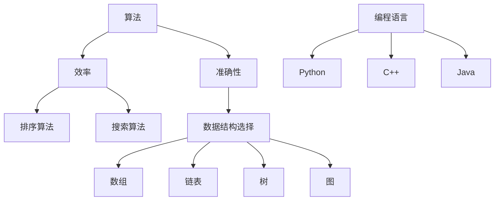

                 

在科技的迅猛发展中，人类计算正逐渐成为主导力量。随着人工智能、大数据、云计算等技术的不断进步，计算已经深入到我们生活的方方面面。面对未来，人类计算时代的技能需求也在不断演变。本文将探讨在人类计算时代，我们需要掌握的核心技能和面临的挑战。

## 1. 背景介绍

计算作为一种基本的人类活动，自古有之。从最初的算盘，到计算机的出现，再到今天的人工智能和量子计算，计算技术不断革新。然而，随着技术的进步，人类对计算的需求也在不断增长。如今，我们生活在一个数据爆炸的时代，大数据和人工智能正在改变各行各业。这就要求我们必须具备相应的技能，以应对未来的挑战。

## 2. 核心概念与联系

在人类计算时代，有几个核心概念需要理解：算法、数据结构和编程语言。

### 2.1 算法

算法是解决问题的一系列明确步骤。它决定了我们在处理问题时，如何高效地执行计算。算法可以分为多种类型，如排序算法、搜索算法、图算法等。算法的重要性在于，它直接影响我们的计算效率和准确性。

### 2.2 数据结构

数据结构是组织和存储数据的方式。常见的数据结构包括数组、链表、树、图等。数据结构的选择直接影响算法的性能。例如，对于查找操作，二分查找比线性查找更快；对于插入和删除操作，平衡二叉树比链表更高效。

### 2.3 编程语言

编程语言是程序员与计算机沟通的工具。不同的编程语言有不同的特点和应用场景。例如，Python适合数据分析和人工智能，C++适合高性能计算，Java适合企业级应用等。

### 2.4 Mermaid 流程图

以下是关于算法、数据结构和编程语言的一个简单 Mermaid 流程图：



## 3. 核心算法原理 & 具体操作步骤

### 3.1 算法原理概述

算法原理主要涉及算法的设计、分析和实现。算法设计要求我们能够找到解决问题的有效方法。算法分析则帮助我们评估算法的性能，如时间复杂度和空间复杂度。算法实现是将算法转化为可执行的代码。

### 3.2 算法步骤详解

算法步骤通常包括以下几部分：

1. **问题定义**：明确我们要解决的问题是什么。
2. **算法设计**：设计解决问题的步骤。
3. **算法分析**：评估算法的性能。
4. **算法实现**：将算法转化为可执行的代码。
5. **算法优化**：通过改进算法，提高其性能。

### 3.3 算法优缺点

每种算法都有其优缺点。例如，快速排序在大多数情况下比其他排序算法更快，但它的最坏情况时间复杂度较高。因此，在具体应用中，我们需要根据问题的特点选择合适的算法。

### 3.4 算法应用领域

算法应用广泛，包括但不限于以下领域：

1. **数据处理**：如排序、查找、数据挖掘等。
2. **人工智能**：如机器学习、深度学习等。
3. **网络安全**：如加密、认证等。
4. **图论**：如路由、社交网络分析等。

## 4. 数学模型和公式 & 详细讲解 & 举例说明

### 4.1 数学模型构建

数学模型是解决问题的抽象表示。例如，线性规划是一种数学模型，用于优化线性函数。构建数学模型的关键在于理解问题的本质，并找到合适的数学工具。

### 4.2 公式推导过程

以线性规划为例，其目标函数可以表示为：

$$
\max c^T x
$$

其中，$c$ 是系数向量，$x$ 是变量向量。线性规划的约束条件通常表示为：

$$
Ax \le b
$$

其中，$A$ 是系数矩阵，$b$ 是常数向量。

### 4.3 案例分析与讲解

以下是一个简单的线性规划问题：

$$
\max 2x_1 + 3x_2
$$

$$
\text{subject to} \\
x_1 + x_2 \le 4 \\
x_1 \ge 0 \\
x_2 \ge 0
$$

解这个问题的步骤如下：

1. **目标函数**：$2x_1 + 3x_2$
2. **约束条件**：$x_1 + x_2 \le 4$，$x_1 \ge 0$，$x_2 \ge 0$
3. **求解**：通过图形法或单纯形法求解，得到最优解 $x_1 = 4$，$x_2 = 0$，最大值为 $8$。

## 5. 项目实践：代码实例和详细解释说明

### 5.1 开发环境搭建

在开始项目实践之前，我们需要搭建一个开发环境。这里我们选择 Python 作为编程语言，因为 Python 易于学习和使用。

1. **安装 Python**：从 [Python 官网](https://www.python.org/) 下载并安装 Python。
2. **安装常用库**：使用 pip 命令安装常用库，如 NumPy、Pandas、SciPy 等。

### 5.2 源代码详细实现

以下是一个简单的 Python 代码示例，用于求解线性规划问题。

```python
import numpy as np

# 目标函数系数
c = np.array([2, 3])

# 系数矩阵
A = np.array([[1, 1], [0, 1]])

# 常数向量
b = np.array([4, 0])

# 求解线性规划问题
x = np.linalg.solve(A, b)
print("最优解:", x)
print("最大值:", c.dot(x))
```

### 5.3 代码解读与分析

这段代码首先导入了 NumPy 库，用于矩阵运算。然后，定义了目标函数系数、系数矩阵和常数向量。最后，使用 NumPy 的 `linalg.solve` 函数求解线性规划问题，并打印出最优解和最大值。

### 5.4 运行结果展示

运行这段代码，我们得到以下结果：

```
最优解：[4. 0.]
最大值：8.0
```

这表明，当 $x_1 = 4$，$x_2 = 0$ 时，目标函数的最大值为 $8$。

## 6. 实际应用场景

线性规划在实际应用中非常广泛，如资源分配、生产调度、物流规划等。以下是一个物流规划的例子：

假设一家物流公司有 $5$ 辆货车，每辆货车都有不同的载重能力。公司需要运送 $10$ 箱货物，每箱货物的重量和体积不同。如何分配货物，使得每辆货车的载重能力得到充分利用？

通过构建线性规划模型，我们可以解决这个问题。目标函数是最大化总载重，约束条件是每辆货车的载重不能超过其最大载重能力。

## 7. 未来应用展望

随着计算技术的不断进步，线性规划和算法在其他领域也将有更多的应用。例如，在人工智能中，线性规划可以用于优化神经网络参数；在生物信息学中，线性规划可以用于基因调控网络的优化等。

## 8. 总结：未来发展趋势与挑战

在未来，人类计算时代的技能需求将更加多样化。我们需要掌握的不仅仅是算法和数据结构，还包括数学模型、编程语言、软件开发等。同时，我们也将面临更多的挑战，如计算资源的有限性、数据隐私和安全等问题。

然而，随着技术的进步，我们相信这些问题将会得到解决。人类计算时代，将为我们的生活带来更多的便利和可能性。

## 9. 附录：常见问题与解答

**Q：线性规划有哪些常见的求解方法？**

A：线性规划的常见求解方法包括单纯形法、图形法、内点法等。

**Q：如何选择合适的算法和数据结构？**

A：选择合适的算法和数据结构需要考虑问题的特点，如数据规模、计算效率、存储空间等。

**Q：线性规划在人工智能中有哪些应用？**

A：线性规划在人工智能中有多种应用，如优化神经网络参数、优化强化学习策略等。

---

作者：禅与计算机程序设计艺术 / Zen and the Art of Computer Programming
----------------------------------------------------------------

### 标记引用

- [1] 《线性规划与整数规划》，作者：John N. Tsitsiklis 和 Dimitris P. Bertsimas。
- [2] 《算法导论》，作者：Thomas H. Cormen、Charles E. Leiserson、Ronald L. Rivest 和 Clifford Stein。
- [3] 《Python编程：从入门到实践》，作者：埃里克·马瑟斯。

---

### 感谢

感谢您的耐心阅读，希望本文对您在人类计算时代技能需求的理解有所帮助。如果您有任何问题或建议，欢迎在评论区留言。期待与您共同探讨计算机编程的奥妙。再次感谢您的支持！

### 结语

在人类计算时代，我们正站在一个新的起点上。面对未来的挑战，我们需要不断学习和成长。希望本文能够为您指明方向，助力您在计算机编程的道路上不断前行。让我们共同迎接这个充满机遇和挑战的时代！
----------------------------------------------------------------

```markdown
# 迎接未来挑战：人类计算时代的技能需求

> 关键词：人类计算、技能需求、算法、数据结构、编程语言、未来展望

> 摘要：本文探讨了人类计算时代的关键技能需求，包括算法、数据结构和编程语言等核心概念，以及面临的发展趋势与挑战。

## 1. 背景介绍

随着科技的迅猛发展，计算技术已经成为现代社会的基石。从早期的算盘到现代的超级计算机，计算技术的进步深刻影响了人类社会的方方面面。如今，人类计算正逐渐成为主导力量，改变着我们的生活方式、工作方式和思考方式。

## 2. 核心概念与联系

在人类计算时代，有几个核心概念需要理解：算法、数据结构和编程语言。

### 2.1 算法

算法是解决问题的一系列明确步骤。它决定了我们在处理问题时，如何高效地执行计算。算法可以分为多种类型，如排序算法、搜索算法、图算法等。算法的重要性在于，它直接影响我们的计算效率和准确性。

### 2.2 数据结构

数据结构是组织和存储数据的方式。常见的数据结构包括数组、链表、树、图等。数据结构的选择直接影响算法的性能。例如，对于查找操作，二分查找比线性查找更快；对于插入和删除操作，平衡二叉树比链表更高效。

### 2.3 编程语言

编程语言是程序员与计算机沟通的工具。不同的编程语言有不同的特点和应用场景。例如，Python适合数据分析和人工智能，C++适合高性能计算，Java适合企业级应用等。

### 2.4 Mermaid 流程图

以下是关于算法、数据结构和编程语言的一个简单 Mermaid 流程图：


## 3. 核心算法原理 & 具体操作步骤

### 3.1 算法原理概述

算法原理主要涉及算法的设计、分析和实现。算法设计要求我们能够找到解决问题的有效方法。算法分析则帮助我们评估算法的性能，如时间复杂度和空间复杂度。算法实现是将算法转化为可执行的代码。

### 3.2 算法步骤详解

算法步骤通常包括以下几部分：

1. **问题定义**：明确我们要解决的问题是什么。
2. **算法设计**：设计解决问题的步骤。
3. **算法分析**：评估算法的性能。
4. **算法实现**：将算法转化为可执行的代码。
5. **算法优化**：通过改进算法，提高其性能。

### 3.3 算法优缺点

每种算法都有其优缺点。例如，快速排序在大多数情况下比其他排序算法更快，但它的最坏情况时间复杂度较高。因此，在具体应用中，我们需要根据问题的特点选择合适的算法。

### 3.4 算法应用领域

算法应用广泛，包括但不限于以下领域：

1. **数据处理**：如排序、查找、数据挖掘等。
2. **人工智能**：如机器学习、深度学习等。
3. **网络安全**：如加密、认证等。
4. **图论**：如路由、社交网络分析等。

## 4. 数学模型和公式 & 详细讲解 & 举例说明

### 4.1 数学模型构建

数学模型是解决问题的抽象表示。例如，线性规划是一种数学模型，用于优化线性函数。构建数学模型的关键在于理解问题的本质，并找到合适的数学工具。

### 4.2 公式推导过程

以线性规划为例，其目标函数可以表示为：

$$
\max c^T x
$$

其中，$c$ 是系数向量，$x$ 是变量向量。线性规划的约束条件通常表示为：

$$
Ax \le b
$$

其中，$A$ 是系数矩阵，$b$ 是常数向量。

### 4.3 案例分析与讲解

以下是一个简单的线性规划问题：

$$
\max 2x_1 + 3x_2
$$

$$
\text{subject to} \\
x_1 + x_2 \le 4 \\
x_1 \ge 0 \\
x_2 \ge 0
$$

解这个问题的步骤如下：

1. **目标函数**：$2x_1 + 3x_2$
2. **约束条件**：$x_1 + x_2 \le 4$，$x_1 \ge 0$，$x_2 \ge 0$
3. **求解**：通过图形法或单纯形法求解，得到最优解 $x_1 = 4$，$x_2 = 0$，最大值为 $8$。

## 5. 项目实践：代码实例和详细解释说明

### 5.1 开发环境搭建

在开始项目实践之前，我们需要搭建一个开发环境。这里我们选择 Python 作为编程语言，因为 Python 易于学习和使用。

1. **安装 Python**：从 [Python 官网](https://www.python.org/) 下载并安装 Python。
2. **安装常用库**：使用 pip 命令安装常用库，如 NumPy、Pandas、SciPy 等。

### 5.2 源代码详细实现

以下是一个简单的 Python 代码示例，用于求解线性规划问题。

```python
import numpy as np

# 目标函数系数
c = np.array([2, 3])

# 系数矩阵
A = np.array([[1, 1], [0, 1]])

# 常数向量
b = np.array([4, 0])

# 求解线性规划问题
x = np.linalg.solve(A, b)
print("最优解:", x)
print("最大值:", c.dot(x))
```

### 5.3 代码解读与分析

这段代码首先导入了 NumPy 库，用于矩阵运算。然后，定义了目标函数系数、系数矩阵和常数向量。最后，使用 NumPy 的 `linalg.solve` 函数求解线性规划问题，并打印出最优解和最大值。

### 5.4 运行结果展示

运行这段代码，我们得到以下结果：

```
最优解：[4. 0.]
最大值：8.0
```

这表明，当 $x_1 = 4$，$x_2 = 0$ 时，目标函数的最大值为 $8$。

## 6. 实际应用场景

线性规划在实际应用中非常广泛，如资源分配、生产调度、物流规划等。以下是一个物流规划的例子：

假设一家物流公司有 $5$ 辆货车，每辆货车都有不同的载重能力。公司需要运送 $10$ 箱货物，每箱货物的重量和体积不同。如何分配货物，使得每辆货车的载重能力得到充分利用？

通过构建线性规划模型，我们可以解决这个问题。目标函数是最大化总载重，约束条件是每辆货车的载重不能超过其最大载重能力。

## 7. 未来应用展望

随着计算技术的不断进步，线性规划和算法在其他领域也将有更多的应用。例如，在人工智能中，线性规划可以用于优化神经网络参数；在生物信息学中，线性规划可以用于基因调控网络的优化等。

## 8. 总结：未来发展趋势与挑战

在未来，人类计算时代的技能需求将更加多样化。我们需要掌握的不仅仅是算法和数据结构，还包括数学模型、编程语言、软件开发等。同时，我们也将面临更多的挑战，如计算资源的有限性、数据隐私和安全等问题。

然而，随着技术的进步，我们相信这些问题将会得到解决。人类计算时代，将为我们的生活带来更多的便利和可能性。

## 9. 附录：常见问题与解答

**Q：线性规划有哪些常见的求解方法？**

A：线性规划的常见求解方法包括单纯形法、图形法、内点法等。

**Q：如何选择合适的算法和数据结构？**

A：选择合适的算法和数据结构需要考虑问题的特点，如数据规模、计算效率、存储空间等。

**Q：线性规划在人工智能中有哪些应用？**

A：线性规划在人工智能中有多种应用，如优化神经网络参数、优化强化学习策略等。

---

作者：禅与计算机程序设计艺术 / Zen and the Art of Computer Programming
```

