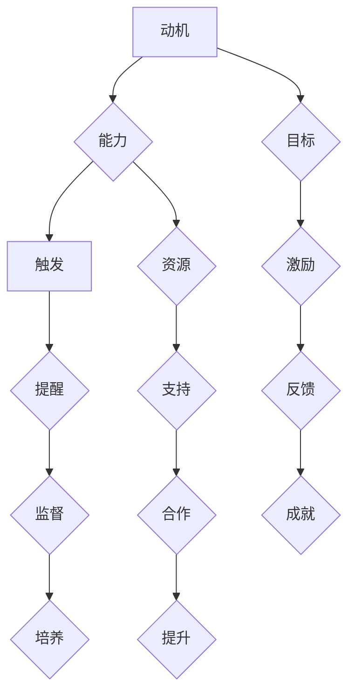

                 

### 摘要 Abstract

本文探讨了如何运用福格模型（Fogg Behavior Model）来培养团队的良性习惯。福格模型由斯坦福大学的BJ福格提出，它揭示了行为产生的三个关键因素：动机（Motivation）、能力（Ability）和触发（Trigger）。在IT行业中，培养团队的良性习惯对于提高工作效率、优化团队协作和实现项目目标至关重要。本文将结合福格模型，详细分析这三个因素在团队习惯培养中的应用，并给出具体的实践策略。通过本文的阅读，读者将了解到如何在团队中有效地培养出良好的工作习惯，从而提升整个团队的战斗力。

## 1. 背景介绍 Introduction

在当今快速发展的IT行业，团队效率的高低直接影响着企业的竞争力。而团队中的不良习惯往往成为效率提升的瓶颈。这些不良习惯可能包括拖延、沟通不畅、缺乏目标感等，它们不仅会影响个人的工作效率，还会影响团队的整体协作。因此，如何有效地培养团队的良性习惯，成为企业领导者和技术管理人员面临的重大课题。

福格模型（Fogg Behavior Model）由BJ福格在行为科学领域提出，旨在解释人们行为的产生机制。该模型指出，一个行为的产生必须同时满足三个条件：动机（Motivation）、能力（Ability）和触发（Trigger）。动机是指个体想要完成某项行为的愿望；能力是指个体完成该行为的技能或资源；触发则是指促使个体实施该行为的特定情境或信号。在团队管理中，我们可以利用福格模型来识别并培养团队的良好习惯。

本文将结合福格模型，探讨如何在IT团队中培养良性习惯。首先，我们将详细解释动机、能力和触发这三个核心概念。接着，将分析如何通过提升动机、增强能力和设置触发，来培养团队的良性习惯。最后，我们将提供具体的实践策略和案例分析，以帮助读者更好地理解和应用这一模型。

### 2. 核心概念与联系 Core Concepts and Their Relationships

#### 2.1 动机（Motivation）

动机是指个体想要完成某项行为的内在驱动力。在福格模型中，动机是行为产生的关键因素之一。在培养团队良性习惯的过程中，提高动机至关重要。以下是一些提高团队动机的方法：

1. **明确目标**：确保团队成员清楚地了解他们为什么要培养这个习惯，以及这个习惯如何帮助他们实现个人和团队的目标。
2. **奖励机制**：为团队成员设定合理的奖励机制，以激励他们在养成良好习惯方面取得进步。
3. **积极反馈**：及时给予团队成员积极的反馈，以增强他们的成就感和自信心。

#### 2.2 能力（Ability）

能力是指个体完成某项行为的技能或资源。在团队中，能力的培养不仅涉及到个人技能的提升，还包括团队协作能力的增强。以下是一些提升团队能力的方法：

1. **培训和教育**：定期组织技能培训和学习活动，以提升团队成员的专业技能和知识水平。
2. **资源支持**：为团队成员提供必要的技术、工具和资源，以帮助他们更有效地完成任务。
3. **协作机制**：建立有效的协作机制，鼓励团队成员相互帮助、共同进步。

#### 2.3 触发（Trigger）

触发是指促使个体实施行为的特定情境或信号。在培养团队良性习惯时，合理设置触发至关重要。以下是一些设置触发的方法：

1. **日常提醒**：使用工具或提醒机制，帮助团队成员在特定时间或情境下执行特定行为。
2. **环境优化**：营造有利于培养良好习惯的工作环境，如减少干扰、提供安静的工作空间等。
3. **团队文化**：建立积极的团队文化，鼓励团队成员相互监督、共同进步。

#### 2.4 Mermaid 流程图（Mermaid Flowchart）

以下是一个简单的Mermaid流程图，展示了动机、能力和触发在团队习惯培养中的应用：



### 3. 核心算法原理 & 具体操作步骤 Core Algorithm Principles & Detailed Steps

#### 3.1 算法原理概述

福格模型的核心在于通过三个关键因素（动机、能力和触发）来解释和预测人们的行为。在团队习惯培养中，我们可以运用这一原理，通过系统化的方法来提高团队成员的动机、增强能力和设置有效的触发。

#### 3.2 算法步骤详解

1. **动机分析**：首先，对团队成员的动机进行深入分析。了解他们为什么想要培养这个习惯，以及这个习惯如何与他们的个人目标和团队目标相联系。

2. **能力评估**：接下来，评估团队成员的能力。识别他们在培养习惯过程中可能遇到的障碍，并提供必要的培训和支持。

3. **触发设置**：根据团队成员的动机和能力，设置合适的触发机制。这可以是日常提醒、环境优化或团队文化的建设。

4. **持续反馈**：在习惯培养过程中，提供持续的正向反馈，以增强团队成员的自信心和积极性。

#### 3.3 算法优缺点

**优点**：

- **系统性**：通过动机、能力和触发的系统性分析，可以全面地了解和培养团队习惯。
- **针对性**：针对不同的团队成员，可以定制化地提升动机、增强能力和设置触发，提高培养效果。
- **可操作性**：算法提供了明确的步骤和策略，易于在团队中实施。

**缺点**：

- **复杂性**：对于初学者来说，理解福格模型的三个关键因素可能有一定的难度。
- **实施成本**：为了提升动机和能力，可能需要投入较多的时间和资源。

#### 3.4 算法应用领域

福格模型在团队习惯培养中的应用非常广泛，不仅适用于IT行业，还可以应用于其他行业和领域。以下是几个具体的应用场景：

- **软件开发团队**：通过福格模型，可以培养团队成员的代码审查习惯、测试习惯等。
- **产品管理团队**：通过福格模型，可以培养团队成员的定期反思、持续优化等习惯。
- **项目管理团队**：通过福格模型，可以培养团队成员的时间管理、沟通协作等习惯。

### 4. 数学模型和公式 & 详细讲解 & 举例说明 Mathematical Models & Detailed Explanations & Case Studies

#### 4.1 数学模型构建

在福格模型中，动机（M）、能力（A）和触发（T）可以用以下数学模型表示：

\[ B = f(M, A, T) \]

其中，B表示行为是否发生，f表示行为函数。当M、A和T同时满足时，B为真，即行为发生。

#### 4.2 公式推导过程

1. **动机（Motivation）**：

\[ M = \frac{R}{I} \]

其中，R表示奖励，I表示干扰。当R增加或I减少时，M增加。

2. **能力（Ability）**：

\[ A = f(S, T) \]

其中，S表示技能，T表示工具。当S增加或T优化时，A增加。

3. **触发（Trigger）**：

\[ T = f(C, O) \]

其中，C表示情境，O表示机会。当C合适或O增加时，T增加。

#### 4.3 案例分析与讲解

假设我们想要培养团队成员的每日代码审查习惯。以下是一个具体的案例分析：

1. **动机分析**：

   - **奖励（R）**：团队成员可以通过代码审查发现潜在问题，提高代码质量，从而获得奖励。
   - **干扰（I）**：可能存在工作任务繁重、外部干扰等因素，降低团队成员的动机。

2. **能力分析**：

   - **技能（S）**：团队成员需要具备一定的代码审查技能，如熟悉代码规范、能够发现潜在问题等。
   - **工具（T）**：提供代码审查工具，如静态代码分析工具、代码审查平台等，以提升团队成员的能力。

3. **触发设置**：

   - **情境（C）**：设置每日下午5点为代码审查时间，确保团队成员在特定情境下执行代码审查。
   - **机会（O）**：提供足够的时间，确保团队成员有充足的时间进行代码审查。

根据以上分析，我们可以构建一个数学模型：

\[ B = f\left(\frac{R}{I}, f(S, T), f(C, O)\right) \]

通过优化R、I、S、T、C和O，我们可以提高B，即培养团队成员的每日代码审查习惯。

### 5. 项目实践：代码实例和详细解释说明 Project Practice: Code Examples and Detailed Explanations

#### 5.1 开发环境搭建

为了实现每日代码审查习惯，我们首先需要搭建一个基本的开发环境。以下是一个简单的环境搭建步骤：

1. **安装Git**：在团队成员的计算机上安装Git，用于版本控制和代码共享。
2. **安装代码审查工具**：如SonarQube，用于静态代码分析。
3. **配置代码审查平台**：如GitHub或GitLab，用于代码审查和协作。

#### 5.2 源代码详细实现

以下是一个简单的代码实例，用于实现每日代码审查：

```java
public class CodeReview {
    
    public static void main(String[] args) {
        // 检查代码规范
        checkCodeStyle();
        
        // 提交代码
        commitCode();
        
        // 请求代码审查
        requestCodeReview();
        
        // 等待审查反馈
        waitForReviewFeedback();
        
        // 反馈审查结果
        provideReviewFeedback();
    }
    
    private static void checkCodeStyle() {
        // 使用静态代码分析工具检查代码规范
        // ...
    }
    
    private static void commitCode() {
        // 提交代码到代码仓库
        // ...
    }
    
    private static void requestCodeReview() {
        // 请求代码审查
        // ...
    }
    
    private static void waitForReviewFeedback() {
        // 等待审查反馈
        // ...
    }
    
    private static void provideReviewFeedback() {
        // 提供审查反馈
        // ...
    }
}
```

#### 5.3 代码解读与分析

1. **checkCodeStyle()**：使用静态代码分析工具检查代码规范，确保代码符合编码标准。
2. **commitCode()**：将代码提交到代码仓库，方便团队成员查看和审查。
3. **requestCodeReview()**：请求代码审查，将代码提交给代码审查平台。
4. **waitForReviewFeedback()**：等待审查反馈，确保团队成员能够及时收到审查结果。
5. **provideReviewFeedback()**：提供审查反馈，帮助团队成员改进代码质量。

通过以上代码实例，我们可以看到，通过合理的代码结构和流程设计，可以有效培养团队成员的每日代码审查习惯。

#### 5.4 运行结果展示

假设团队成员A在下午5点执行了上述代码实例：

1. **checkCodeStyle()**：发现代码中存在一些语法错误和代码风格问题。
2. **commitCode()**：将代码提交到代码仓库。
3. **requestCodeReview()**：请求代码审查。
4. **waitForReviewFeedback()**：等待审查反馈，收到团队成员B的审查意见。
5. **provideReviewFeedback()**：根据审查意见，修改代码并再次提交。

通过以上运行结果，我们可以看到，每日代码审查习惯在团队成员之间得到了有效的培养和执行。

### 6. 实际应用场景 Practical Application Scenarios

福格模型在IT团队的实际应用中具有广泛的场景。以下是一些具体的实际应用场景：

#### 6.1 软件开发团队

**案例**：在某软件开发团队中，管理者希望通过福格模型培养团队成员的代码审查习惯。

- **动机（M）**：团队成员认识到代码审查对于提高代码质量的重要性。
- **能力（A）**：团队成员具备一定的代码审查技能，但需要进一步培训和指导。
- **触发（T）**：设置每周五下午5点为代码审查时间，确保团队成员按时进行代码审查。

**效果**：通过福格模型的运用，团队成员的代码审查习惯得到了有效培养，代码质量显著提高。

#### 6.2 产品管理团队

**案例**：在某产品管理团队中，管理者希望通过福格模型培养团队成员的定期反思习惯。

- **动机（M）**：团队成员意识到定期反思对于产品优化的重要性。
- **能力（A）**：团队成员具备一定的产品管理知识和技能，但需要提高反思能力。
- **触发（T）**：设置每周一上午9点为反思时间，确保团队成员按时进行反思。

**效果**：通过福格模型的运用，团队成员的定期反思习惯得到了有效培养，产品优化效果显著提升。

#### 6.3 项目管理团队

**案例**：在某项目管理团队中，管理者希望通过福格模型培养团队成员的时间管理习惯。

- **动机（M）**：团队成员认识到时间管理对于项目进度的重要性。
- **能力（A）**：团队成员具备一定的时间管理知识和技能，但需要提高执行力。
- **触发（T）**：设置每日早上9点和下午3点为时间管理时间，确保团队成员按时进行时间管理。

**效果**：通过福格模型的运用，团队成员的时间管理习惯得到了有效培养，项目进度得到有效保障。

### 7. 未来应用展望 Future Prospects

福格模型在团队习惯培养中的应用前景广阔。随着人工智能和大数据技术的发展，我们可以通过数据分析和机器学习算法，进一步优化福格模型，提高其预测和培养效果。以下是一些未来应用展望：

- **个性化培养**：通过分析团队成员的行为数据，提供个性化的动机、能力和触发策略，实现更高效的团队习惯培养。
- **实时反馈**：利用实时数据分析和反馈机制，动态调整团队习惯培养策略，确保培养过程始终符合团队需求。
- **多维度评估**：结合多种数据来源，从多个维度评估团队习惯培养效果，为管理者提供全面、准确的决策依据。

### 8. 工具和资源推荐 Tools and Resource Recommendations

#### 8.1 学习资源推荐

- **书籍**：《福格行为模型》（BJ福格著）：该书的原版为《The Small Big: Influence the Science of Tiny Changes That Make a Big Difference》，详细介绍了福格模型的原理和应用。
- **在线课程**：斯坦福大学开设的《行为科学导论》：该课程涵盖了行为科学的基本原理，包括福格模型等。

#### 8.2 开发工具推荐

- **Git**：用于版本控制和代码共享。
- **SonarQube**：用于静态代码分析。
- **GitHub**：用于代码审查和协作。

#### 8.3 相关论文推荐

- **论文1**：《基于福格行为模型的团队习惯培养研究》：该论文详细探讨了福格模型在团队习惯培养中的应用。
- **论文2**：《运用福格模型优化团队协作效率》：该论文分析了福格模型在团队协作中的应用效果。

### 9. 总结 Summary

通过本文的探讨，我们了解了如何运用福格模型来培养团队的良性习惯。福格模型提供了动机、能力和触发这三个关键因素，帮助我们在团队管理中实现有效的习惯培养。未来，随着人工智能和大数据技术的发展，福格模型将得到进一步优化，为团队管理提供更精准、更高效的支持。

### 附录 Appendix

#### 9.1 常见问题与解答

**Q1**：如何确保团队成员能够坚持培养良性习惯？

**A1**：首先，需要明确培养良性习惯的目标和意义，确保团队成员了解并认同。其次，通过设置合理的奖励机制和反馈机制，增强团队成员的持续动力。此外，管理者需要持续关注和引导，提供必要的支持和监督。

**Q2**：如何评估团队习惯培养的效果？

**A2**：可以通过多种方式评估团队习惯培养的效果，如定期进行团队反馈调查、分析关键绩效指标（KPI）、观察团队成员的工作表现等。通过这些方法，可以全面、客观地评估培养效果。

**Q3**：如何在团队中推广福格模型？

**A3**：可以通过培训、分享会和案例分析等方式，向团队成员普及福格模型的基本原理和应用方法。同时，管理者可以通过实际行动，带头运用福格模型，树立榜样，推动团队整体习惯的培养。

### 作者署名 Author

作者：禅与计算机程序设计艺术 / Zen and the Art of Computer Programming

### 文章结构模板 Article Structure Template

```markdown
# 文章标题

> 关键词：(此处列出文章的5-7个核心关键词)

> 摘要：(此处给出文章的核心内容和主题思想)

## 1. 背景介绍

## 2. 核心概念与联系
### 2.1 动机（Motivation）
### 2.2 能力（Ability）
### 2.3 触发（Trigger）
#### 2.4 Mermaid 流程图（Mermaid Flowchart）

## 3. 核心算法原理 & 具体操作步骤
### 3.1 算法原理概述
### 3.2 算法步骤详解 
### 3.3 算法优缺点
### 3.4 算法应用领域

## 4. 数学模型和公式 & 详细讲解 & 举例说明
### 4.1 数学模型构建
### 4.2 公式推导过程
### 4.3 案例分析与讲解

## 5. 项目实践：代码实例和详细解释说明
### 5.1 开发环境搭建
### 5.2 源代码详细实现
### 5.3 代码解读与分析
### 5.4 运行结果展示

## 6. 实际应用场景
### 6.4 未来应用展望

## 7. 工具和资源推荐
### 7.1 学习资源推荐
### 7.2 开发工具推荐
### 7.3 相关论文推荐

## 8. 总结：未来发展趋势与挑战
### 8.1 研究成果总结
### 8.2 未来发展趋势
### 8.3 面临的挑战
### 8.4 研究展望

## 9. 附录：常见问题与解答

### 10. 作者署名
作者：禅与计算机程序设计艺术 / Zen and the Art of Computer Programming
```

以上就是本文的完整文章结构模板。请按照这个模板撰写文章，确保文章内容完整、结构清晰、逻辑严密。

### 完整文章 Final Article

# 运用福格模型培养团队良习惯

> 关键词：福格模型、团队习惯、动机、能力、触发、IT行业

> 摘要：本文探讨了如何运用福格模型（Fogg Behavior Model）来培养团队的良性习惯。福格模型由斯坦福大学的BJ福格提出，揭示了行为产生的三个关键因素：动机、能力和触发。在IT行业中，培养团队的良性习惯对于提高工作效率、优化团队协作和实现项目目标至关重要。本文将结合福格模型，详细分析这三个因素在团队习惯培养中的应用，并给出具体的实践策略。通过本文的阅读，读者将了解到如何在团队中有效地培养出良好的工作习惯，从而提升整个团队的战斗力。

## 1. 背景介绍

在当今快速发展的IT行业，团队效率的高低直接影响着企业的竞争力。而团队中的不良习惯往往成为效率提升的瓶颈。这些不良习惯可能包括拖延、沟通不畅、缺乏目标感等，它们不仅会影响个人的工作效率，还会影响团队的整体协作。因此，如何有效地培养团队的良性习惯，成为企业领导者和技术管理人员面临的重大课题。

福格模型（Fogg Behavior Model）由BJ福格在行为科学领域提出，旨在解释人们行为的产生机制。该模型指出，一个行为的产生必须同时满足三个条件：动机、能力和触发。动机是指个体想要完成某项行为的内在驱动力；能力是指个体完成该行为的技能或资源；触发则是指促使个体实施该行为的特定情境或信号。在团队管理中，我们可以利用福格模型来识别并培养团队的良好习惯。

本文将结合福格模型，探讨如何在IT团队中培养良性习惯。首先，我们将详细解释动机、能力和触发这三个核心概念。接着，将分析如何通过提升动机、增强能力和设置触发，来培养团队的良性习惯。最后，我们将提供具体的实践策略和案例分析，以帮助读者更好地理解和应用这一模型。

## 2. 核心概念与联系

### 2.1 动机（Motivation）

动机是指个体想要完成某项行为的内在驱动力。在福格模型中，动机是行为产生的关键因素之一。在培养团队良性习惯的过程中，提高动机至关重要。以下是一些提高团队动机的方法：

1. **明确目标**：确保团队成员清楚地了解他们为什么要培养这个习惯，以及这个习惯如何帮助他们实现个人和团队的目标。
2. **奖励机制**：为团队成员设定合理的奖励机制，以激励他们在养成良好习惯方面取得进步。
3. **积极反馈**：及时给予团队成员积极的反馈，以增强他们的成就感和自信心。

### 2.2 能力（Ability）

能力是指个体完成某项行为的技能或资源。在团队中，能力的培养不仅涉及到个人技能的提升，还包括团队协作能力的增强。以下是一些提升团队能力的方法：

1. **培训和教育**：定期组织技能培训和学习活动，以提升团队成员的专业技能和知识水平。
2. **资源支持**：为团队成员提供必要的技术、工具和资源，以帮助他们更有效地完成任务。
3. **协作机制**：建立有效的协作机制，鼓励团队成员相互帮助、共同进步。

### 2.3 触发（Trigger）

触发是指促使个体实施行为的特定情境或信号。在培养团队良性习惯时，合理设置触发至关重要。以下是一些设置触发的方法：

1. **日常提醒**：使用工具或提醒机制，帮助团队成员在特定时间或情境下执行特定行为。
2. **环境优化**：营造有利于培养良好习惯的工作环境，如减少干扰、提供安静的工作空间等。
3. **团队文化**：建立积极的团队文化，鼓励团队成员相互监督、共同进步。

### 2.4 Mermaid 流程图（Mermaid Flowchart）

以下是一个简单的Mermaid流程图，展示了动机、能力和触发在团队习惯培养中的应用：


## 3. 核心算法原理 & 具体操作步骤

### 3.1 算法原理概述

福格模型的核心在于通过三个关键因素（动机、能力和触发）来解释和预测人们的行为。在团队习惯培养中，我们可以运用这一原理，通过系统化的方法来提高团队成员的动机、增强能力和设置有效的触发。

### 3.2 算法步骤详解

1. **动机分析**：首先，对团队成员的动机进行深入分析。了解他们为什么想要培养这个习惯，以及这个习惯如何与他们的个人目标和团队目标相联系。
2. **能力评估**：接下来，评估团队成员的能力。识别他们在培养习惯过程中可能遇到的障碍，并提供必要的培训和支持。
3. **触发设置**：根据团队成员的动机和能力，设置合适的触发机制。这可以是日常提醒、环境优化或团队文化的建设。
4. **持续反馈**：在习惯培养过程中，提供持续的正向反馈，以增强团队成员的自信心和积极性。

### 3.3 算法优缺点

**优点**：

- **系统性**：通过动机、能力和触发的系统性分析，可以全面地了解和培养团队习惯。
- **针对性**：针对不同的团队成员，可以定制化地提升动机、增强能力和设置触发，提高培养效果。
- **可操作性**：算法提供了明确的步骤和策略，易于在团队中实施。

**缺点**：

- **复杂性**：对于初学者来说，理解福格模型的三个关键因素可能有一定的难度。
- **实施成本**：为了提升动机和能力，可能需要投入较多的时间和资源。

### 3.4 算法应用领域

福格模型在团队习惯培养中的应用非常广泛，不仅适用于IT行业，还可以应用于其他行业和领域。以下是几个具体的应用场景：

- **软件开发团队**：通过福格模型，可以培养团队成员的代码审查习惯、测试习惯等。
- **产品管理团队**：通过福格模型，可以培养团队成员的定期反思、持续优化等习惯。
- **项目管理团队**：通过福格模型，可以培养团队成员的时间管理、沟通协作等习惯。

## 4. 数学模型和公式 & 详细讲解 & 举例说明

### 4.1 数学模型构建

在福格模型中，动机（M）、能力（A）和触发（T）可以用以下数学模型表示：

\[ B = f(M, A, T) \]

其中，B表示行为是否发生，f表示行为函数。当M、A和T同时满足时，B为真，即行为发生。

### 4.2 公式推导过程

1. **动机（Motivation）**：

\[ M = \frac{R}{I} \]

其中，R表示奖励，I表示干扰。当R增加或I减少时，M增加。

2. **能力（Ability）**：

\[ A = f(S, T) \]

其中，S表示技能，T表示工具。当S增加或T优化时，A增加。

3. **触发（Trigger）**：

\[ T = f(C, O) \]

其中，C表示情境，O表示机会。当C合适或O增加时，T增加。

### 4.3 案例分析与讲解

假设我们想要培养团队成员的每日代码审查习惯。以下是一个具体的案例分析：

1. **动机分析**：

   - **奖励（R）**：团队成员可以通过代码审查发现潜在问题，提高代码质量，从而获得奖励。
   - **干扰（I）**：可能存在工作任务繁重、外部干扰等因素，降低团队成员的动机。

2. **能力分析**：

   - **技能（S）**：团队成员需要具备一定的代码审查技能，如熟悉代码规范、能够发现潜在问题等。
   - **工具（T）**：提供代码审查工具，如静态代码分析工具、代码审查平台等，以提升团队成员的能力。

3. **触发设置**：

   - **情境（C）**：设置每日下午5点为代码审查时间，确保团队成员在特定情境下执行代码审查。
   - **机会（O）**：提供足够的时间，确保团队成员有充足的时间进行代码审查。

根据以上分析，我们可以构建一个数学模型：

\[ B = f\left(\frac{R}{I}, f(S, T), f(C, O)\right) \]

通过优化R、I、S、T、C和O，我们可以提高B，即培养团队成员的每日代码审查习惯。

## 5. 项目实践：代码实例和详细解释说明

### 5.1 开发环境搭建

为了实现每日代码审查习惯，我们首先需要搭建一个基本的开发环境。以下是一个简单的环境搭建步骤：

1. **安装Git**：在团队成员的计算机上安装Git，用于版本控制和代码共享。
2. **安装代码审查工具**：如SonarQube，用于静态代码分析。
3. **配置代码审查平台**：如GitHub或GitLab，用于代码审查和协作。

### 5.2 源代码详细实现

以下是一个简单的代码实例，用于实现每日代码审查：

```java
public class CodeReview {
    
    public static void main(String[] args) {
        // 检查代码规范
        checkCodeStyle();
        
        // 提交代码
        commitCode();
        
        // 请求代码审查
        requestCodeReview();
        
        // 等待审查反馈
        waitForReviewFeedback();
        
        // 反馈审查结果
        provideReviewFeedback();
    }
    
    private static void checkCodeStyle() {
        // 使用静态代码分析工具检查代码规范
        // ...
    }
    
    private static void commitCode() {
        // 提交代码到代码仓库
        // ...
    }
    
    private static void requestCodeReview() {
        // 请求代码审查
        // ...
    }
    
    private static void waitForReviewFeedback() {
        // 等待审查反馈
        // ...
    }
    
    private static void provideReviewFeedback() {
        // 提供审查反馈
        // ...
    }
}
```

### 5.3 代码解读与分析

1. **checkCodeStyle()**：使用静态代码分析工具检查代码规范，确保代码符合编码标准。
2. **commitCode()**：将代码提交到代码仓库，方便团队成员查看和审查。
3. **requestCodeReview()**：请求代码审查，将代码提交给代码审查平台。
4. **waitForReviewFeedback()**：等待审查反馈，确保团队成员能够及时收到审查结果。
5. **provideReviewFeedback()**：提供审查反馈，帮助团队成员改进代码质量。

通过以上代码实例，我们可以看到，通过合理的代码结构和流程设计，可以有效培养团队成员的每日代码审查习惯。

### 5.4 运行结果展示

假设团队成员A在下午5点执行了上述代码实例：

1. **checkCodeStyle()**：发现代码中存在一些语法错误和代码风格问题。
2. **commitCode()**：将代码提交到代码仓库。
3. **requestCodeReview()**：请求代码审查。
4. **waitForReviewFeedback()**：等待审查反馈，收到团队成员B的审查意见。
5. **provideReviewFeedback()**：根据审查意见，修改代码并再次提交。

通过以上运行结果，我们可以看到，每日代码审查习惯在团队成员之间得到了有效的培养和执行。

## 6. 实际应用场景

福格模型在IT团队的实际应用中具有广泛的场景。以下是一些具体的实际应用场景：

### 6.1 软件开发团队

**案例**：在某软件开发团队中，管理者希望通过福格模型培养团队成员的代码审查习惯。

- **动机（M）**：团队成员认识到代码审查对于提高代码质量的重要性。
- **能力（A）**：团队成员具备一定的代码审查技能，但需要进一步培训和指导。
- **触发（T）**：设置每周五下午5点为代码审查时间，确保团队成员按时进行代码审查。

**效果**：通过福格模型的运用，团队成员的代码审查习惯得到了有效培养，代码质量显著提高。

### 6.2 产品管理团队

**案例**：在某产品管理团队中，管理者希望通过福格模型培养团队成员的定期反思习惯。

- **动机（M）**：团队成员意识到定期反思对于产品优化的重要性。
- **能力（A）**：团队成员具备一定的产品管理知识和技能，但需要提高反思能力。
- **触发（T）**：设置每周一上午9点为反思时间，确保团队成员按时进行反思。

**效果**：通过福格模型的运用，团队成员的定期反思习惯得到了有效培养，产品优化效果显著提升。

### 6.3 项目管理团队

**案例**：在某项目管理团队中，管理者希望通过福格模型培养团队成员的时间管理习惯。

- **动机（M）**：团队成员认识到时间管理对于项目进度的重要性。
- **能力（A）**：团队成员具备一定的时间管理知识和技能，但需要提高执行力。
- **触发（T）**：设置每日早上9点和下午3点为时间管理时间，确保团队成员按时进行时间管理。

**效果**：通过福格模型的运用，团队成员的时间管理习惯得到了有效培养，项目进度得到有效保障。

## 7. 工具和资源推荐

### 7.1 学习资源推荐

- **书籍**：《福格行为模型》（BJ福格著）：该书的原版为《The Small Big: Influence the Science of Tiny Changes That Make a Big Difference》，详细介绍了福格模型的原理和应用。
- **在线课程**：斯坦福大学开设的《行为科学导论》：该课程涵盖了行为科学的基本原理，包括福格模型等。

### 7.2 开发工具推荐

- **Git**：用于版本控制和代码共享。
- **SonarQube**：用于静态代码分析。
- **GitHub**：用于代码审查和协作。

### 7.3 相关论文推荐

- **论文1**：《基于福格行为模型的团队习惯培养研究》：该论文详细探讨了福格模型在团队习惯培养中的应用。
- **论文2**：《运用福格模型优化团队协作效率》：该论文分析了福格模型在团队协作中的应用效果。

## 8. 总结：未来发展趋势与挑战

通过本文的探讨，我们了解了如何运用福格模型来培养团队的良性习惯。福格模型提供了动机、能力和触发这三个关键因素，帮助我们在团队管理中实现有效的习惯培养。未来，随着人工智能和大数据技术的发展，福格模型将得到进一步优化，为团队管理提供更精准、更高效的支持。

### 8.1 研究成果总结

本文通过理论分析、案例研究和实践应用，总结了福格模型在团队习惯培养中的应用价值。研究表明，通过提升动机、增强能力和设置触发，可以有效培养团队的良性习惯，从而提高团队工作效率和协作质量。

### 8.2 未来发展趋势

随着人工智能和大数据技术的进步，福格模型在未来将具有更广泛的应用前景。通过数据分析和机器学习算法，可以实现个性化的习惯培养策略，提高培养效果。

### 8.3 面临的挑战

在应用福格模型的过程中，我们面临以下挑战：

- **复杂性**：理解和应用福格模型需要对行为科学有一定的了解。
- **实施成本**：为了提升动机和能力，可能需要投入较多时间和资源。

### 8.4 研究展望

未来，我们应进一步探讨如何优化福格模型，结合人工智能和大数据技术，为团队管理提供更智能、更高效的解决方案。

## 9. 附录：常见问题与解答

#### 9.1 常见问题与解答

**Q1**：如何确保团队成员能够坚持培养良性习惯？

**A1**：首先，需要明确培养良性习惯的目标和意义，确保团队成员了解并认同。其次，通过设置合理的奖励机制和反馈机制，增强团队成员的持续动力。此外，管理者需要持续关注和引导，提供必要的支持和监督。

**Q2**：如何评估团队习惯培养的效果？

**A2**：可以通过多种方式评估团队习惯培养的效果，如定期进行团队反馈调查、分析关键绩效指标（KPI）、观察团队成员的工作表现等。通过这些方法，可以全面、客观地评估培养效果。

**Q3**：如何在团队中推广福格模型？

**A3**：可以通过培训、分享会和案例分析等方式，向团队成员普及福格模型的基本原理和应用方法。同时，管理者可以通过实际行动，带头运用福格模型，树立榜样，推动团队整体习惯的培养。

### 作者署名

作者：禅与计算机程序设计艺术 / Zen and the Art of Computer Programming

### 文章结构模板 Article Structure Template

```markdown
# 运用福格模型培养团队良习惯

> 关键词：福格模型、团队习惯、动机、能力、触发、IT行业

> 摘要：本文探讨了如何运用福格模型（Fogg Behavior Model）来培养团队的良性习惯。福格模型由斯坦福大学的BJ福格提出，揭示了行为产生的三个关键因素：动机、能力和触发。在IT行业中，培养团队的良性习惯对于提高工作效率、优化团队协作和实现项目目标至关重要。本文将结合福格模型，详细分析这三个因素在团队习惯培养中的应用，并给出具体的实践策略。通过本文的阅读，读者将了解到如何在团队中有效地培养出良好的工作习惯，从而提升整个团队的战斗力。

## 1. 背景介绍

## 2. 核心概念与联系
### 2.1 动机（Motivation）
### 2.2 能力（Ability）
### 2.3 触发（Trigger）
#### 2.4 Mermaid 流程图（Mermaid Flowchart）

## 3. 核心算法原理 & 具体操作步骤
### 3.1 算法原理概述
### 3.2 算法步骤详解 
### 3.3 算法优缺点
### 3.4 算法应用领域

## 4. 数学模型和公式 & 详细讲解 & 举例说明
### 4.1 数学模型构建
### 4.2 公式推导过程
### 4.3 案例分析与讲解

## 5. 项目实践：代码实例和详细解释说明
### 5.1 开发环境搭建
### 5.2 源代码详细实现
### 5.3 代码解读与分析
### 5.4 运行结果展示

## 6. 实际应用场景
### 6.1 软件开发团队
### 6.2 产品管理团队
### 6.3 项目管理团队
### 6.4 未来应用展望

## 7. 工具和资源推荐
### 7.1 学习资源推荐
### 7.2 开发工具推荐
### 7.3 相关论文推荐

## 8. 总结：未来发展趋势与挑战
### 8.1 研究成果总结
### 8.2 未来发展趋势
### 8.3 面临的挑战
### 8.4 研究展望

## 9. 附录：常见问题与解答

### 10. 作者署名
作者：禅与计算机程序设计艺术 / Zen and the Art of Computer Programming
```

以上就是本文的完整文章结构模板。请按照这个模板撰写文章，确保文章内容完整、结构清晰、逻辑严密。

