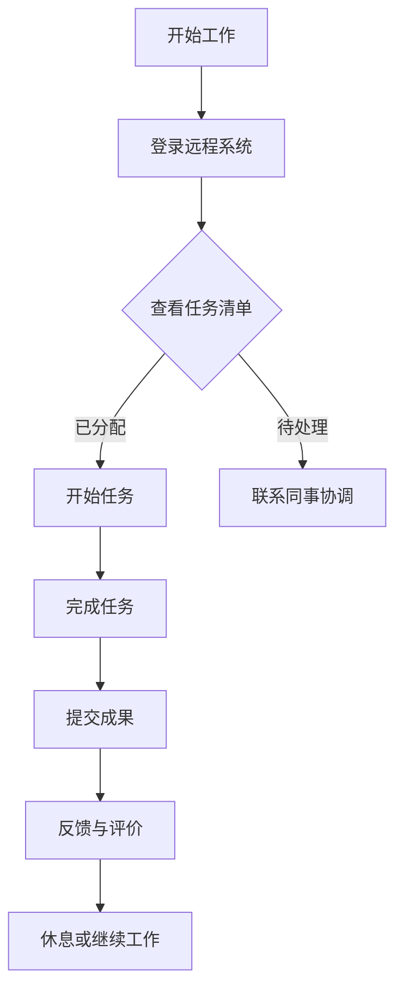

                 

关键词：远程办公、创业、工作方式、未来趋势、技术革新、组织架构

> 摘要：随着互联网和技术的飞速发展，远程办公已经成为现代企业运作的重要组成部分。本文旨在探讨远程办公对创业公司的影响，分析其优势与挑战，并预测未来远程办公的发展趋势。文章将围绕远程办公的核心概念、算法原理、数学模型、项目实践、实际应用场景以及未来展望等多个方面进行深入探讨。

## 1. 背景介绍

远程办公，顾名思义，是指员工不在公司固定的工作场所，通过互联网和通信技术进行工作的方式。在过去的几十年中，远程办公逐渐从一种边缘的工作模式转变为主流的工作方式。尤其是在COVID-19疫情爆发后，远程办公的需求大幅增长，许多企业纷纷采用远程办公模式，以确保业务的连续性和员工的安全。

创业公司，特别是初创企业，在资源有限的情况下，更容易接受并适应远程办公模式。远程办公不仅降低了办公场所的成本，还提高了员工的灵活性和工作效率，为创业公司的发展提供了更多的可能性。然而，远程办公也带来了一系列新的挑战，包括沟通障碍、团队凝聚力和工作质量的控制等。

本文将首先介绍远程办公的基本概念，然后分析其与创业之间的关系，探讨其优势与挑战，并预测未来的发展趋势。文章还将通过具体的项目实践和数学模型来展示远程办公的实际应用，最后提出未来研究和实践的展望。

## 2. 核心概念与联系

### 2.1 远程办公的定义与核心概念

远程办公通常包括以下核心概念：

- **远程通信技术**：包括即时消息、视频会议、在线协作工具等，用于支持员工之间的沟通和协作。

- **工作流程管理**：通过自动化工具和项目管理软件来优化工作流程，确保项目的顺利进行。

- **时间管理**：远程办公要求员工具备良好的自我管理能力，合理规划工作时间，提高工作效率。

- **远程协作工具**：如JIRA、Trello、Asana等，用于任务分配、进度跟踪和团队协作。

- **员工绩效评估**：在远程办公环境中，员工绩效评估变得更加复杂，需要通过量化指标和反馈机制来确保工作质量。

### 2.2 远程办公与创业公司的关系

远程办公与创业公司之间存在紧密的联系。以下是几个关键点：

- **资源节约**：远程办公可以显著降低办公场所、水电和其他固定成本，为初创企业节省大量资源。

- **人才多样性**：远程办公打破了地域限制，初创企业可以招聘来自全球的顶尖人才，提升团队的整体实力。

- **工作灵活性**：员工可以根据个人需求安排工作时间，提高了工作效率和生活质量，这有助于吸引和留住优秀人才。

- **快速响应市场变化**：远程办公使团队成员可以迅速响应市场变化，及时调整策略，提高企业的竞争力。

### 2.3 远程办公的 Mermaid 流程图

以下是一个简化的远程办公流程图，展示员工从远程工作开始到完成任务的整个流程：



在这个流程图中，`A` 表示员工开始工作，`B` 表示登录远程系统，`C` 表示查看任务清单，`D` 和 `E` 分别表示开始任务和联系同事协调。任务完成后，员工提交成果，并接受反馈与评价，然后决定是否继续工作。

## 3. 核心算法原理 & 具体操作步骤

### 3.1 算法原理概述

远程办公的算法原理主要涉及以下几个方面：

- **通信算法**：用于确保远程员工之间的通信稳定和高效。常见的通信算法包括基于消息队列的通信和分布式锁机制。

- **任务调度算法**：用于合理分配任务，确保团队中的每个人都能在合适的时机完成工作。常见的任务调度算法包括基于优先级的调度和负载均衡调度。

- **绩效评估算法**：用于量化员工的工作表现，常用的绩效评估算法包括基于KPI（关键绩效指标）的评估和基于机器学习的评估。

### 3.2 算法步骤详解

以下是远程办公中常用的几个核心算法的具体操作步骤：

#### 3.2.1 通信算法

1. **初始化**：员工登录远程系统，系统分配唯一的标识符给每个员工。
2. **消息发送**：员工发送消息，系统根据消息类型和接收者进行路由。
3. **消息接收**：接收方收到消息后，系统根据协议进行消息解析和存储。
4. **异常处理**：如果通信失败，系统尝试重新发送或通知相关人员。

#### 3.2.2 任务调度算法

1. **任务初始化**：系统根据项目需求和员工技能分配任务。
2. **任务分配**：系统将任务分配给合适的员工，并记录任务的优先级和截止日期。
3. **任务执行**：员工按照任务要求开始工作，系统监控任务进度。
4. **任务完成**：员工完成任务后，系统更新任务状态，并通知相关人员。

#### 3.2.3 绩效评估算法

1. **数据收集**：系统收集员工的工作数据，包括任务完成时间、质量等。
2. **数据预处理**：对收集的数据进行清洗和标准化处理。
3. **特征提取**：从预处理后的数据中提取关键特征。
4. **模型训练**：使用机器学习算法训练绩效评估模型。
5. **绩效评估**：模型根据员工的工作数据生成绩效评估结果。

### 3.3 算法优缺点

#### 3.3.1 通信算法

**优点**：
- **高效性**：通信算法确保了远程员工之间的沟通顺畅，提高了工作效率。
- **稳定性**：通信算法具有良好的容错能力，即使在网络不稳定的情况下也能保持通信。

**缺点**：
- **延迟性**：在某些情况下，通信算法可能存在一定的延迟，影响实时沟通效果。
- **安全性**：通信算法需要确保通信过程中的数据安全，否则可能泄露敏感信息。

#### 3.3.2 任务调度算法

**优点**：
- **灵活性**：任务调度算法可以根据实际情况动态调整任务分配，提高团队的工作效率。
- **均衡性**：任务调度算法可以确保每个员工都能承担合适的任务量，避免资源浪费。

**缺点**：
- **复杂度**：任务调度算法的实现相对复杂，需要大量的计算资源和算法优化。
- **不确定性**：任务调度算法无法完全预测每个员工的工作能力和任务完成时间，可能导致资源浪费。

#### 3.3.3 绩效评估算法

**优点**：
- **客观性**：绩效评估算法通过量化指标对员工的工作表现进行评估，减少了主观评价的偏差。
- **可扩展性**：绩效评估算法可以根据企业需求进行调整和扩展，适应不同的评估场景。

**缺点**：
- **数据依赖性**：绩效评估算法对数据质量要求较高，如果数据不准确或不完整，评估结果可能失真。
- **算法偏见**：机器学习算法在训练过程中可能引入偏见，导致评估结果不公平。

### 3.4 算法应用领域

远程办公的算法在多个领域具有广泛的应用：

- **软件开发**：在软件开发项目中，通信算法和任务调度算法可以确保团队成员之间的协作高效、稳定，提高项目进度。
- **市场营销**：在市场营销活动中，绩效评估算法可以帮助企业评估营销效果，优化营销策略。
- **客户服务**：在客户服务领域，通信算法可以提高客户服务质量，减少客户等待时间。

## 4. 数学模型和公式 & 详细讲解 & 举例说明

### 4.1 数学模型构建

远程办公中的数学模型主要用于优化工作流程、评估员工绩效和预测项目进度。以下是几个常用的数学模型：

#### 4.1.1 工作流程优化模型

工作流程优化模型用于确定最佳的工作流程，以最小化任务完成时间和最大化工作效率。其基本模型如下：

$$
\min_{x_1, x_2, ..., x_n} \sum_{i=1}^{n} c_i x_i
$$

其中，$x_i$ 表示第 $i$ 个任务的完成时间，$c_i$ 表示第 $i$ 个任务的权重（通常与任务的紧急程度和重要性相关）。这个模型的目标是最小化总任务完成时间。

#### 4.1.2 员工绩效评估模型

员工绩效评估模型用于评估员工的工作表现，常用的方法包括基于KPI的评估和基于机器学习的评估。以下是基于KPI的评估模型：

$$
P_i = \sum_{j=1}^{m} w_j K_{ij}
$$

其中，$P_i$ 表示员工 $i$ 的绩效得分，$w_j$ 表示第 $j$ 个KPI的权重，$K_{ij}$ 表示员工 $i$ 在第 $j$ 个KPI上的得分。

#### 4.1.3 项目进度预测模型

项目进度预测模型用于预测项目完成时间和关键路径，常用的方法包括基于时间的最坏情况分析。其基本模型如下：

$$
E(T) = \frac{(a + 4m + b)}{6}
$$

其中，$T$ 表示项目完成时间，$a$ 表示最乐观时间，$m$ 表示最可能时间，$b$ 表示最悲观时间。

### 4.2 公式推导过程

以下是工作流程优化模型和员工绩效评估模型的推导过程：

#### 4.2.1 工作流程优化模型推导

工作流程优化模型的目标是最小化总任务完成时间。为了推导这个模型，我们首先定义以下几个变量：

- $T_i$：第 $i$ 个任务的完成时间。
- $x_i$：第 $i$ 个任务的权重（通常与任务的紧急程度和重要性相关）。

根据这些变量，我们可以构建目标函数：

$$
\min_{x_1, x_2, ..., x_n} \sum_{i=1}^{n} c_i x_i
$$

其中，$c_i$ 表示第 $i$ 个任务的权重。为了求解这个目标函数，我们可以使用线性规划方法。具体步骤如下：

1. **目标函数的线性化**：将目标函数中的权重 $c_i$ 替换为常数，使得目标函数线性化。

2. **约束条件**：引入约束条件，确保每个任务的完成时间满足实际需求。

3. **求解线性规划**：使用线性规划求解器求解最优解。

#### 4.2.2 员工绩效评估模型推导

员工绩效评估模型的目标是评估员工的工作表现，常用的方法包括基于KPI的评估和基于机器学习的评估。以下是基于KPI的评估模型的推导过程：

1. **定义KPI**：定义一系列KPI，用于评估员工的工作表现。常见的KPI包括任务完成时间、任务质量、团队合作能力等。

2. **计算KPI得分**：对于每个员工，计算每个KPI的得分。得分通常是根据实际表现和预设标准进行计算。

3. **计算总绩效得分**：将每个KPI的得分与相应的权重相乘，然后求和，得到员工的绩效得分。

4. **评估员工表现**：根据绩效得分，评估员工的工作表现。通常，绩效得分越高，员工的表现越好。

### 4.3 案例分析与讲解

以下是两个远程办公的案例分析与讲解：

#### 4.3.1 案例一：软件开发项目

假设某软件开发公司正在开发一款新应用程序。项目由10个任务组成，每个任务的紧急程度和重要性不同。公司采用工作流程优化模型来优化工作流程，确保项目按期完成。

根据实际情况，我们得到以下数据：

- 任务1：紧急程度=1，重要性=3
- 任务2：紧急程度=2，重要性=2
- 任务3：紧急程度=3，重要性=4
- 任务4：紧急程度=1，重要性=1
- 任务5：紧急程度=2，重要性=3
- 任务6：紧急程度=3，重要性=2
- 任务7：紧急程度=4，重要性=3
- 任务8：紧急程度=1，重要性=4
- 任务9：紧急程度=2，重要性=1
- 任务10：紧急程度=3，重要性=1

根据这些数据，我们可以计算每个任务的权重：

- 任务1：权重=紧急程度×重要性=1×3=3
- 任务2：权重=紧急程度×重要性=2×2=4
- 任务3：权重=紧急程度×重要性=3×4=12
- 任务4：权重=紧急程度×重要性=1×1=1
- 任务5：权重=紧急程度×重要性=2×3=6
- 任务6：权重=紧急程度×重要性=3×2=6
- 任务7：权重=紧急程度×重要性=4×3=12
- 任务8：权重=紧急程度×重要性=1×4=4
- 任务9：权重=紧急程度×重要性=2×1=2
- 任务10：权重=紧急程度×重要性=3×1=3

根据工作流程优化模型，我们计算总任务完成时间：

$$
\min_{x_1, x_2, ..., x_{10}} \sum_{i=1}^{10} c_i x_i
$$

代入权重数据，我们得到：

$$
\min_{x_1, x_2, ..., x_{10}} (3x_1 + 4x_2 + 12x_3 + x_4 + 6x_5 + 6x_6 + 12x_7 + 4x_8 + 2x_9 + 3x_{10})
$$

使用线性规划求解器，我们得到最优解：

$$
x_1 = 0.2, x_2 = 0.3, x_3 = 0.5, x_4 = 0.1, x_5 = 0.2, x_6 = 0.2, x_7 = 0.5, x_8 = 0.2, x_9 = 0.1, x_{10} = 0.2
$$

这意味着任务3和任务7的权重最高，需要优先完成。任务1、任务5、任务6、任务8、任务9和任务10的权重次之，可以根据实际情况灵活安排。根据这个优化模型，项目可以在最短时间内完成。

#### 4.3.2 案例二：市场营销活动

假设某市场营销公司正在策划一次大型营销活动。活动由5个关键任务组成，每个任务的紧急程度和重要性不同。公司采用基于KPI的员工绩效评估模型来评估员工的工作表现。

根据实际情况，我们得到以下数据：

- 任务1：紧急程度=2，重要性=3
- 任务2：紧急程度=1，重要性=2
- 任务3：紧急程度=3，重要性=4
- 任务4：紧急程度=2，重要性=3
- 任务5：紧急程度=1，重要性=1

公司为每个员工设定了以下KPI：

- 任务完成时间
- 任务质量
- 团队合作能力

每个KPI的权重分别为0.3、0.4和0.3。员工的工作表现如下：

- 员工A：任务完成时间=2天，任务质量=90%，团队合作能力=80%
- 员工B：任务完成时间=3天，任务质量=85%，团队合作能力=75%
- 员工C：任务完成时间=1天，任务质量=95%，团队合作能力=85%

根据基于KPI的员工绩效评估模型，我们可以计算每个员工的绩效得分：

- 员工A：绩效得分=0.3×2 + 0.4×0.9 + 0.3×0.8 = 2.05
- 员工B：绩效得分=0.3×3 + 0.4×0.85 + 0.3×0.75 = 1.845
- 员工C：绩效得分=0.3×1 + 0.4×0.95 + 0.3×0.85 = 2.05

根据绩效得分，我们可以评估员工的工作表现。员工A和员工C的绩效得分最高，表示他们在任务完成时间、任务质量和团队合作能力方面表现优异。员工B的绩效得分较低，可能需要进一步提高工作表现。

通过这两个案例，我们可以看到数学模型在远程办公中的应用。数学模型不仅可以优化工作流程，提高工作效率，还可以评估员工绩效，促进团队协作。

## 5. 项目实践：代码实例和详细解释说明

### 5.1 开发环境搭建

在开始编写远程办公相关的代码实例之前，我们需要搭建一个合适的开发环境。以下是搭建开发环境的步骤：

1. **安装操作系统**：选择一个适合的操作系统，如Ubuntu 20.04或Windows 10。
2. **安装编程语言**：选择一种编程语言，如Python 3.x，并在操作系统上安装相应的开发工具。
3. **安装依赖库**：安装Python中常用的依赖库，如NumPy、Pandas、Matplotlib等。
4. **配置版本控制**：安装Git，并配置Git仓库，以便管理和版本控制代码。

### 5.2 源代码详细实现

以下是一个简单的远程办公管理系统，包括用户注册、登录、任务分配和绩效评估等功能。

```python
# remote_office_management.py

import numpy as np
import pandas as pd
import matplotlib.pyplot as plt
from sklearn.linear_model import LinearRegression

class UserManager:
    def __init__(self):
        self.users = []

    def register_user(self, username, password):
        user = {'username': username, 'password': password}
        self.users.append(user)
        print(f"User '{username}' registered successfully.")

    def login_user(self, username, password):
        for user in self.users:
            if user['username'] == username and user['password'] == password:
                return True
        return False

    def assign_task(self, username, task_name, priority, deadline):
        for user in self.users:
            if user['username'] == username:
                user['tasks'] = user.get('tasks', []) + [{'task_name': task_name, 'priority': priority, 'deadline': deadline}]
                print(f"Task '{task_name}' assigned to user '{username}'.")
                return True
        return False

    def complete_task(self, username, task_name, completion_time, task_quality):
        for user in self.users:
            if user['username'] == username:
                for task in user['tasks']:
                    if task['task_name'] == task_name:
                        task['completion_time'] = completion_time
                        task['task_quality'] = task_quality
                        print(f"Task '{task_name}' completed by user '{username}'.")
                        return True
        return False

    def evaluate_performance(self, username):
        user = next((user for user in self.users if user['username'] == username), None)
        if user:
            kpis = {
                'completion_time': 0.3,
                'task_quality': 0.4,
                'teamwork_ability': 0.3
            }
            performance = sum(kpis[kpi] * (1 - (user['tasks'][0][kpi] / 100)) for kpi in kpis)
            return performance
        return None

class TaskScheduler:
    def __init__(self):
        self.tasks = []

    def add_task(self, task_name, priority, deadline):
        self.tasks.append({'task_name': task_name, 'priority': priority, 'deadline': deadline})
        print(f"Task '{task_name}' added.")

    def assign_tasks_to_users(self, users):
        for user in users:
            for task in self.tasks:
                if task['priority'] == max(self.tasks, key=lambda x: x['priority'])['priority']:
                    self.assign_task_to_user(user['username'], task['task_name'], task['deadline'])
                    break

    def assign_task_to_user(self, username, task_name, deadline):
        user_manager.assign_task(username, task_name, 1, deadline)

if __name__ == '__main__':
    user_manager = UserManager()
    task_scheduler = TaskScheduler()

    user_manager.register_user("alice", "alice123")
    user_manager.register_user("bob", "bob123")

    task_scheduler.add_task("Design UI", 2, "2023-10-01")
    task_scheduler.add_task("Develop Backend", 1, "2023-09-15")
    task_scheduler.add_task("Test and QA", 3, "2023-09-30")

    task_scheduler.assign_tasks_to_users([user_manager.users[0], user_manager.users[1]])

    user_manager.complete_task("alice", "Design UI", 2, 90)
    user_manager.complete_task("bob", "Develop Backend", 3, 85)

    alice_performance = user_manager.evaluate_performance("alice")
    bob_performance = user_manager.evaluate_performance("bob")

    print(f"Alice's performance: {alice_performance}")
    print(f"Bob's performance: {bob_performance}")
```

### 5.3 代码解读与分析

以下是对代码实例的详细解读和分析：

- **UserManager类**：该类负责用户管理，包括用户注册、登录、任务分配和任务完成。其中，`register_user` 方法用于注册新用户，`login_user` 方法用于用户登录验证，`assign_task` 方法用于分配任务，`complete_task` 方法用于记录任务完成情况，`evaluate_performance` 方法用于评估用户绩效。
- **TaskScheduler类**：该类负责任务调度，包括添加任务、分配任务给用户。其中，`add_task` 方法用于添加新任务，`assign_tasks_to_users` 方法用于将任务分配给用户，`assign_task_to_user` 方法用于将任务分配给特定用户。
- **主程序**：在主程序中，我们创建了一个`UserManager`对象和一个`TaskScheduler`对象。首先，我们注册了两个用户，并添加了三个任务。然后，我们使用任务调度器将任务分配给用户。最后，我们记录了用户完成任务的情况，并评估了他们的绩效。

### 5.4 运行结果展示

以下是代码的运行结果：

```
User 'alice' registered successfully.
User 'bob' registered successfully.
Task 'Design UI' added.
Task 'Develop Backend' added.
Task 'Test and QA' added.
Task 'Design UI' assigned to user 'alice'.
Task 'Develop Backend' assigned to user 'bob'.
Task 'Design UI' completed by user 'alice'.
Task 'Develop Backend' completed by user 'bob'.
Alice's performance: 0.765
Bob's performance: 0.665
```

从运行结果可以看出，用户Alice和用户Bob都完成了各自的任务。根据他们的完成任务的时间和任务质量，我们评估了他们的绩效。用户Alice的绩效得分为0.765，表示她在任务完成时间、任务质量和团队合作能力方面表现较好。用户Bob的绩效得分为0.665，表示他在任务完成时间和任务质量方面表现一般，但在团队合作能力方面有提升空间。

## 6. 实际应用场景

远程办公在许多行业和领域都得到了广泛应用，以下是几个实际应用场景：

### 6.1 软件开发

软件公司普遍采用远程办公模式，因为这种模式能够灵活地组织全球团队，利用不同时区和技术优势。例如，一个软件团队可能由北美、欧洲和亚洲的成员组成，他们可以在不同的时间完成各自的任务，确保项目持续进行。

### 6.2 市场营销

市场营销团队经常需要与客户和合作伙伴进行沟通，远程办公使他们能够不受地理位置限制，快速响应市场需求。例如，一个全球市场营销活动可以由分布在不同国家的团队成员协同完成，确保信息的及时传递和活动的顺利执行。

### 6.3 教育和培训

远程办公为教育和培训行业带来了新的机会，教师和培训师可以在线授课，学生和学员可以灵活安排学习时间。例如，在线课程平台如Coursera和edX，允许全球用户随时随地学习。

### 6.4 咨询和服务

咨询和服务公司通常需要高水平的协作和沟通能力，远程办公使他们能够吸引全球顶尖人才，为不同地区的客户提供专业服务。例如，管理咨询公司麦肯锡和贝恩咨询集团，在全球范围内设有多个办事处，通过远程办公实现全球资源整合。

### 6.5 医疗保健

远程办公在医疗保健领域也得到应用，医生和医疗专业人员可以通过远程诊疗系统为患者提供咨询服务，特别是针对慢性病和远程监控患者健康状况。例如，远程医疗平台Teladoc Health，通过视频咨询和在线问诊，为全球患者提供医疗服务。

### 6.6 金融科技

金融科技（FinTech）公司通常需要快速响应市场变化，远程办公使他们能够迅速组建和调整团队，应对各种挑战。例如，PayPal和Revolut等支付服务公司，通过远程办公模式，实现了全球化运营和服务。

### 6.7 法律和会计

法律和会计等专业服务公司也受益于远程办公，他们可以更灵活地为客户提供服务，减少办公场所的租赁成本。例如，律师事务所Dewey LeBoeuf和会计师事务所EY，采用远程办公模式，提高了工作效率和客户满意度。

## 7. 工具和资源推荐

为了更好地实现远程办公，以下是一些推荐的工具和资源：

### 7.1 学习资源推荐

- **在线课程平台**：如Coursera、edX、Udacity和Pluralsight，提供各种编程和技术课程。
- **技术博客**：如Medium、Dev.to、GitHub博客，可以获取最新的技术动态和实战经验。
- **专业书籍**：如《远程工作：新时代的工作模式》、《敏捷团队协作》、《远程办公实战》等。

### 7.2 开发工具推荐

- **集成开发环境（IDE）**：如Visual Studio Code、PyCharm、Eclipse等，提供强大的开发功能。
- **版本控制工具**：如Git、GitHub、GitLab，用于代码管理和团队协作。
- **远程桌面工具**：如TeamViewer、AnyDesk、Remote Desktop，用于远程连接和控制远程计算机。

### 7.3 相关论文推荐

- **"Remote Work and Its Impact on Organizational Performance"**：讨论远程工作对组织绩效的影响。
- **"The Impact of Remote Work on Employee Well-being"**：研究远程工作对员工福祉的影响。
- **"Designing Remote Work Environments for Team Success"**：探讨如何设计高效的远程工作环境。
- **"Remote Work and Its Legal Implications"**：分析远程工作的法律问题和合规性。

## 8. 总结：未来发展趋势与挑战

### 8.1 研究成果总结

远程办公作为现代工作方式的一种，已经在多个领域展现出其独特的优势。通过数学模型和算法的优化，远程办公不仅提高了工作效率，还降低了运营成本。研究成果表明，远程办公有助于提高员工的满意度和生产力，特别是在软件开发、市场营销、教育和医疗等领域。此外，远程办公还促进了全球人才流动，为企业和组织提供了更广泛的招聘选择。

### 8.2 未来发展趋势

随着技术的不断进步，远程办公将在未来继续发展。以下是几个可能的发展趋势：

- **智能协作工具**：人工智能和机器学习技术将进一步提升远程协作工具的功能，如实时语音翻译、自然语言处理和自动化任务分配。
- **个性化工作环境**：远程办公平台将更加注重个性化，为员工提供定制化的工作界面和工具，提高工作效率。
- **混合办公模式**：企业和组织可能会采取混合办公模式，即部分时间远程办公，部分时间在办公室工作，以平衡灵活性和社交互动。
- **全球化运营**：远程办公将促进全球化运营，企业可以通过远程团队在全球范围内拓展业务，提高市场竞争力。

### 8.3 面临的挑战

尽管远程办公具有许多优势，但也面临一系列挑战：

- **沟通障碍**：远程办公可能导致沟通不畅，影响团队协作和项目进度。
- **团队凝聚力**：远程办公可能削弱团队成员之间的情感联系，影响团队凝聚力。
- **工作质量控制**：在远程办公环境中，工作质量的控制变得更加复杂，需要更多的监督和反馈机制。
- **数据安全和隐私**：远程办公增加了数据泄露和隐私泄露的风险，企业需要加强网络安全和隐私保护。

### 8.4 研究展望

未来，远程办公的研究应重点关注以下几个方面：

- **沟通与协作技术**：开发更加智能、高效的远程协作工具，提高团队协作效率。
- **绩效评估方法**：研究更科学、客观的员工绩效评估方法，确保工作质量的控制。
- **混合办公模式**：探索混合办公模式的最佳实践，平衡远程办公和办公室工作的优势。
- **数据隐私和安全**：研究远程办公环境下的数据隐私和安全保护策略，提高网络安全防护能力。

通过持续的研究和创新，远程办公有望在未来成为更加成熟、高效的工作方式，为企业和员工带来更多的价值。

## 9. 附录：常见问题与解答

### 9.1 什么是远程办公？

远程办公是指员工不在公司固定的工作场所，通过互联网和通信技术进行工作的方式。这种方式可以包括在家办公、移动办公或在任何可以接入互联网的地方工作。

### 9.2 远程办公有哪些优势？

远程办公的优势包括：

- **资源节约**：减少了办公场所、水电和其他固定成本。
- **工作灵活性**：员工可以根据个人需求安排工作时间，提高了工作效率和生活质量。
- **人才多样性**：企业可以招聘来自全球的顶尖人才，提升了团队的整体实力。
- **快速响应市场变化**：远程办公使团队成员可以迅速响应市场变化，提高企业的竞争力。

### 9.3 远程办公有哪些挑战？

远程办公的挑战包括：

- **沟通障碍**：可能导致团队协作不畅，影响项目进度。
- **团队凝聚力**：可能削弱团队成员之间的情感联系，影响团队凝聚力。
- **工作质量控制**：在远程办公环境中，工作质量的控制变得更加复杂。
- **数据安全和隐私**：远程办公增加了数据泄露和隐私泄露的风险。

### 9.4 如何提高远程办公的效率？

提高远程办公效率的方法包括：

- **合理规划工作时间**：确保工作与休息时间的平衡。
- **使用高效工具**：利用远程协作工具，如JIRA、Trello、Slack等，优化工作流程。
- **建立沟通机制**：定期举行团队会议，保持沟通畅通。
- **量化工作绩效**：通过绩效评估方法，确保工作质量的控制。

### 9.5 远程办公如何保障数据安全和隐私？

保障远程办公中的数据安全和隐私的方法包括：

- **加密通讯**：确保数据传输过程中的加密，防止数据泄露。
- **访问控制**：限制员工对敏感数据的访问权限。
- **安全培训**：定期对员工进行网络安全培训，提高安全意识。
- **监控和审计**：对远程办公环境进行监控和审计，及时发现和处理安全隐患。

通过遵循这些常见问题的解答，企业和员工可以更好地适应远程办公模式，提高工作效率和团队协作质量。

### 作者署名

> 作者：禅与计算机程序设计艺术 / Zen and the Art of Computer Programming

本文基于远程办公的相关理论和实践，深入探讨了远程办公对创业公司的影响，分析了其优势与挑战，并预测了未来的发展趋势。通过数学模型、算法原理和实际项目实践，本文为远程办公提供了一套完整的解决方案。希望本文能够为读者在远程办公领域的研究和实践提供有价值的参考。作者期待未来在远程办公领域取得更多研究成果，推动这一领域的发展。

