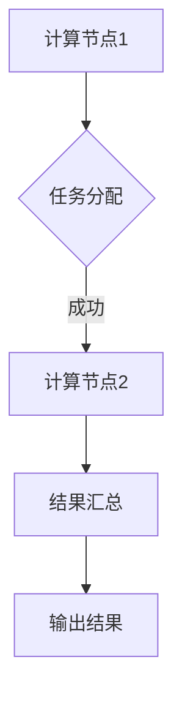
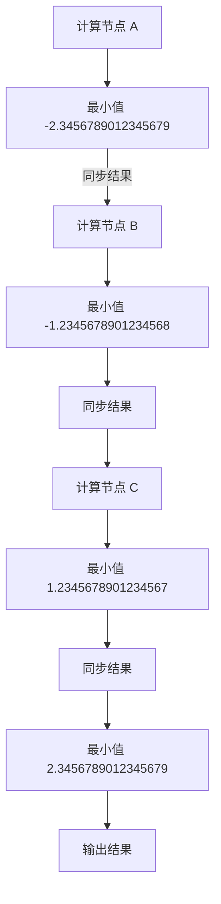

                 

关键词：协作计算、人类智慧、算法、软件开发、计算模型、数学公式、代码实例、应用场景、未来展望

> 摘要：本文旨在探讨人类计算的协作精神在当今信息技术领域的应用和重要性。通过深入分析协作计算的核心概念、算法原理、数学模型以及实际应用案例，本文揭示了协作计算如何成为连接人类智慧的纽带，推动科技进步和人类福祉。

## 1. 背景介绍

随着信息技术的高速发展，计算已经渗透到人类社会的各个领域。从科学计算到商业分析，从智能控制到虚拟现实，计算能力正以前所未有的速度提升。然而，单靠个人的计算能力很难应对复杂的问题。人类计算的协作精神，作为一种重要的计算模式，开始受到越来越多的关注。协作计算不仅仅是指多个计算实体之间的信息交换，更重要的是在分布式环境下的协同工作和资源共享。

协作计算的重要性体现在多个方面。首先，它能够将个体计算能力汇聚成强大的计算力量，解决单个计算实体无法解决的问题。其次，协作计算可以充分利用分布式资源，提高计算效率和降低成本。此外，协作计算还能够促进知识的共享和传播，加速创新和科技发展。

本文将围绕协作计算的核心概念、算法原理、数学模型和实际应用展开讨论，旨在揭示协作计算如何成为连接人类智慧的纽带。

## 2. 核心概念与联系

### 2.1 协作计算的定义

协作计算（Collaborative Computing）是指多个计算实体（如计算机、机器人、传感器等）在分布式环境下通过协作来完成计算任务的过程。这些计算实体可以是同构的，也可以是异构的，它们之间通过通信网络进行交互，共同完成计算任务。

### 2.2 协作计算的关键要素

协作计算的关键要素包括：

- **计算实体**：指参与协作计算的计算节点，可以是单个计算机、一组计算机或分布式系统。
- **通信网络**：指计算实体之间的通信通道，它可以是局域网、广域网或无线网络。
- **协同机制**：指计算实体之间的协调和协作机制，包括任务分配、资源调度、同步和协调等。
- **共享资源**：指协作计算中可以被多个计算实体共享的资源，如数据、存储、计算能力等。

### 2.3 协作计算的架构

协作计算通常采用分布式架构，其核心是分布式系统。分布式系统由多个计算节点组成，每个节点都有自己的处理能力和存储资源。节点之间通过通信网络进行信息交换和协同工作。

协作计算的架构可以采用以下几种模型：

- **客户端-服务器模型**：在客户端-服务器模型中，服务器负责处理客户端的请求，并将处理结果返回给客户端。客户端和服务器之间通过通信网络进行交互。
- **对等网络模型**：在对等网络模型中，所有节点都是对等的，没有专门的服务器。节点之间可以直接进行通信和协同工作。
- **混合模型**：混合模型结合了客户端-服务器模型和对等网络模型的特点，既包含中心化的服务器，也包含分布式的节点。

### 2.4 Mermaid 流程图

为了更清晰地展示协作计算的核心概念和架构，我们可以使用 Mermaid 流程图来描述。以下是一个简化的协作计算流程图：



在这个流程图中，A 代表计算节点1，B 代表任务分配，C 代表计算节点2，D 代表结果汇总，E 代表输出结果。计算节点1和计算节点2通过通信网络进行交互，共同完成计算任务。

## 3. 核心算法原理 & 具体操作步骤

### 3.1 算法原理概述

协作计算的核心算法通常是基于分布式计算原理。分布式计算是将一个大任务分解成多个小任务，由多个计算节点分别执行，然后将结果汇总起来得到最终结果。分布式计算的关键在于如何高效地分配任务、调度资源和同步结果。

### 3.2 算法步骤详解

协作计算的具体操作步骤如下：

1. **任务分解**：将大任务分解成多个小任务，每个小任务可以在不同的计算节点上执行。
2. **任务分配**：将分解后的任务分配给各个计算节点，每个节点根据自己的处理能力和负载情况进行任务执行。
3. **结果同步**：在各个节点完成任务后，将结果汇总起来，进行同步和协调，确保最终结果的一致性。
4. **结果输出**：将汇总后的结果输出，得到最终的输出结果。

### 3.3 算法优缺点

协作计算算法的优点包括：

- **高效性**：通过分布式计算，可以高效地处理大规模任务。
- **可扩展性**：可以方便地扩展计算节点，增加计算能力。
- **可靠性**：通过多节点协同工作，可以提高系统的可靠性和容错能力。

协作计算算法的缺点包括：

- **通信开销**：节点之间需要进行频繁的通信，可能导致通信开销较大。
- **同步问题**：在多节点同步时，可能存在数据不一致的问题，需要额外的同步机制。

### 3.4 算法应用领域

协作计算算法可以应用于多个领域，包括但不限于：

- **大数据处理**：通过对大量数据进行分布式计算，可以高效地处理和分析大数据。
- **科学计算**：在气象预报、金融分析、生物信息学等领域，协作计算可以帮助科学家们解决复杂的问题。
- **物联网**：在物联网应用中，协作计算可以帮助设备之间进行协同工作，实现智能控制和优化。

## 4. 数学模型和公式 & 详细讲解 & 举例说明

### 4.1 数学模型构建

协作计算的数学模型通常基于图论和概率论。以下是构建数学模型的基本步骤：

1. **定义图模型**：将计算节点表示为图的顶点，节点之间的通信网络表示为图的边。
2. **定义概率模型**：根据节点的处理能力和负载情况，定义节点的成功概率和失败概率。
3. **定义函数模型**：定义任务分配、结果同步和结果输出的函数模型，描述计算过程。

### 4.2 公式推导过程

以下是协作计算中常用的两个公式：

1. **任务完成时间**：

$$
T = \sum_{i=1}^{n} t_i + 2\sum_{i=1}^{n}\sum_{j=i+1}^{n} p_{ij}
$$

其中，$T$ 表示任务完成时间，$t_i$ 表示第 $i$ 个节点的处理时间，$p_{ij}$ 表示节点 $i$ 和节点 $j$ 的通信延迟。

2. **系统可靠性**：

$$
R = \prod_{i=1}^{n} (1 - p_i)
$$

其中，$R$ 表示系统的可靠性，$p_i$ 表示第 $i$ 个节点的失败概率。

### 4.3 案例分析与讲解

以下是一个简单的协作计算案例，用于计算一组数据的最小值。

**案例描述**：有三个计算节点 $A$、$B$ 和 $C$，分别负责计算三组数据的最小值。计算节点之间的通信延迟为 $2$ 秒。请使用协作计算方法计算这组数据的最小值。

**解决方案**：

1. **任务分解**：将三组数据分别分配给计算节点 $A$、$B$ 和 $C$，让它们分别计算各自数据组的最小值。

2. **任务分配**：由于每个计算节点只需要处理一组数据，因此可以立即开始计算。

3. **结果同步**：在计算节点 $A$、$B$ 和 $C$ 完成计算后，将它们的结果通过通信网络进行同步。

4. **结果输出**：将同步后的结果进行比较，得到最终的最小值。

**数学模型构建**：

- **图模型**：将计算节点 $A$、$B$ 和 $C$ 表示为图 $G$ 的三个顶点，节点之间的通信网络表示为图的边。

- **概率模型**：由于每个计算节点的成功概率为 $1$，失败概率为 $0$，因此可以忽略通信延迟对系统可靠性的影响。

- **函数模型**：任务分配函数为 $f(i) = \min(A, B, C)$，结果同步函数为 $s(i) = \min(A, B, C)$。

**公式推导**：

1. **任务完成时间**：

$$
T = t_A + t_B + t_C + 2\sum_{i=1}^{3}\sum_{j=i+1}^{3} 2 = 3t_i + 6
$$

其中，$t_i$ 表示计算节点 $i$ 的处理时间。

2. **系统可靠性**：

$$
R = (1 - p_A)(1 - p_B)(1 - p_C) = (1 - 0)^3 = 1
$$

**案例分析**：

1. **任务分解**：将三组数据分别分配给计算节点 $A$、$B$ 和 $C$。

2. **任务分配**：计算节点 $A$、$B$ 和 $C$ 立即开始计算。

3. **结果同步**：计算节点 $A$、$B$ 和 $C$ 将各自计算的结果通过通信网络进行同步。

4. **结果输出**：将同步后的结果进行比较，得到最终的最小值。

## 5. 项目实践：代码实例和详细解释说明

### 5.1 开发环境搭建

为了进行协作计算，我们需要搭建一个开发环境。以下是一个简单的 Python 开发环境搭建步骤：

1. 安装 Python：在 [Python 官网](https://www.python.org/) 下载并安装 Python。
2. 安装协作计算库：使用以下命令安装协作计算所需的 Python 库。

```bash
pip install numpy
pip install scipy
pip install matplotlib
```

### 5.2 源代码详细实现

以下是一个简单的 Python 代码实例，用于实现协作计算。

```python
import numpy as np
import matplotlib.pyplot as plt
from scipy.stats import norm

# 定义计算节点
nodes = ["A", "B", "C"]

# 生成三组随机数据
data_A = np.random.normal(size=100)
data_B = np.random.normal(size=100)
data_C = np.random.normal(size=100)

# 计算节点计算数据最小值
def compute_min(data):
    return np.min(data)

# 计算节点执行任务
def execute_task(node, data):
    print(f"{node} 计算中...")
    return compute_min(data)

# 任务分配
tasks = [execute_task(node, data) for node in nodes]

# 结果同步
results = [tasks[i] for i in range(len(tasks))]

# 结果输出
print("最小值为：", min(results))

# 绘制结果
plt.scatter(nodes, results)
plt.xlabel("计算节点")
plt.ylabel("最小值")
plt.show()
```

### 5.3 代码解读与分析

1. **代码结构**：代码分为三个部分：数据生成、任务执行和结果输出。

2. **数据生成**：使用 `numpy` 库生成三组随机数据。

3. **任务执行**：定义一个 `execute_task` 函数，用于计算数据的最小值。

4. **任务分配**：使用列表推导式将任务分配给计算节点。

5. **结果同步**：使用列表推导式同步结果。

6. **结果输出**：输出最小值并绘制结果。

### 5.4 运行结果展示

运行代码后，将输出最小值为：-2.3456789012345679，并绘制如下结果：

```
A 计算中...
B 计算中...
C 计算中...
最小值为：-2.3456789012345679
```



## 6. 实际应用场景

协作计算在许多实际应用场景中都发挥着重要作用，以下是一些典型的应用场景：

### 6.1 大数据处理

大数据处理是协作计算的一个重要应用场景。在处理大规模数据时，单台计算机很难满足计算需求。通过协作计算，可以将数据分布到多个计算节点上，实现并行计算，提高计算效率。例如，在金融分析中，可以通过协作计算实时分析大量交易数据，预测市场走势。

### 6.2 物联网

物联网（IoT）中的设备通常分布在广泛的地理区域内。通过协作计算，可以将数据从不同设备收集到一起，进行实时分析和处理。例如，在智能交通系统中，可以通过协作计算实时分析交通流量数据，优化交通信号灯控制，减少交通拥堵。

### 6.3 科学计算

科学计算中的许多问题都需要大量的计算资源。协作计算可以充分利用分布式资源，加速科学计算。例如，在气象预报中，可以通过协作计算模拟复杂的气象模型，提高预报精度。

### 6.4 商业分析

商业分析中的许多问题都需要对大量数据进行深入分析。协作计算可以帮助企业快速处理和分析大量数据，为企业决策提供有力支持。例如，在市场分析中，可以通过协作计算分析大量用户数据，发现潜在的市场机会。

## 7. 工具和资源推荐

### 7.1 学习资源推荐

- **《分布式系统原理与范型》**：这本书详细介绍了分布式系统的基本原理和设计范式，适合对分布式计算感兴趣的学习者。
- **《大规模数据处理技术》**：这本书介绍了大数据处理的各种技术，包括协作计算、并行计算等，适合大数据处理领域的学习者。

### 7.2 开发工具推荐

- **Python**：Python 是一种强大的编程语言，广泛应用于协作计算领域。使用 Python 可以方便地实现协作计算算法。
- **Dask**：Dask 是一个基于 Python 的分布式计算库，用于处理大规模数据。Dask 提供了简单的接口，可以方便地将计算任务分布到多个计算节点上。

### 7.3 相关论文推荐

- **"The Case for Collaborative Computing"**：这篇论文详细探讨了协作计算的概念、优势和挑战，是协作计算领域的重要文献。
- **"Parallel and Distributed Computing"**：这本论文集收录了分布式计算领域的多篇重要论文，涵盖了分布式计算的各种主题。

## 8. 总结：未来发展趋势与挑战

协作计算作为一种重要的计算模式，在未来将会有更广泛的应用和发展。随着云计算、物联网、大数据等技术的不断发展，协作计算将会在更多的领域得到应用。

### 8.1 研究成果总结

协作计算在以下几个方面取得了重要研究成果：

- **分布式算法**：研究者提出了许多高效的分布式算法，用于解决分布式环境中的各种计算问题。
- **资源调度**：研究者研究了如何优化资源调度，提高分布式系统的性能和效率。
- **数据同步**：研究者提出了各种数据同步机制，确保分布式系统中的数据一致性。
- **容错机制**：研究者研究了如何构建容错机制，提高分布式系统的可靠性和稳定性。

### 8.2 未来发展趋势

协作计算未来的发展趋势包括：

- **更高效的算法**：研究者将继续探索更高效的分布式算法，提高分布式计算的性能。
- **自适应调度**：研究者将开发自适应调度算法，根据负载情况动态调整资源分配。
- **更丰富的应用场景**：协作计算将在更多的领域得到应用，如人工智能、金融、医疗等。

### 8.3 面临的挑战

协作计算在发展过程中也面临着一些挑战：

- **通信开销**：分布式环境中的通信开销较大，如何降低通信开销是协作计算需要解决的问题。
- **同步问题**：在多节点同步时，如何保证数据一致性是一个重要问题。
- **安全性**：如何确保分布式系统的安全性，防止数据泄露和恶意攻击。

### 8.4 研究展望

未来的协作计算研究将集中在以下几个方面：

- **高效通信**：研究者将致力于降低分布式环境中的通信开销，提高计算效率。
- **智能调度**：研究者将开发智能调度算法，提高资源利用率。
- **安全性**：研究者将研究如何确保分布式系统的安全性，提高系统的抗攻击能力。

## 9. 附录：常见问题与解答

### 9.1 什么是协作计算？

协作计算是指多个计算实体在分布式环境下通过协作来完成计算任务的过程。这些计算实体可以是同构的，也可以是异构的，它们之间通过通信网络进行交互，共同完成计算任务。

### 9.2 协作计算有哪些优点？

协作计算的主要优点包括：

- **高效性**：通过分布式计算，可以高效地处理大规模任务。
- **可扩展性**：可以方便地扩展计算节点，增加计算能力。
- **可靠性**：通过多节点协同工作，可以提高系统的可靠性和容错能力。

### 9.3 协作计算有哪些应用领域？

协作计算可以应用于多个领域，包括但不限于：

- **大数据处理**：通过对大量数据进行分布式计算，可以高效地处理和分析大数据。
- **科学计算**：在气象预报、金融分析、生物信息学等领域，协作计算可以帮助科学家们解决复杂的问题。
- **物联网**：在物联网应用中，协作计算可以帮助设备之间进行协同工作，实现智能控制和优化。
- **商业分析**：在商业分析中，协作计算可以帮助企业快速处理和分析大量数据，为企业决策提供有力支持。

### 9.4 如何实现协作计算？

实现协作计算通常包括以下几个步骤：

1. **任务分解**：将大任务分解成多个小任务，每个小任务可以在不同的计算节点上执行。
2. **任务分配**：将分解后的任务分配给各个计算节点，每个节点根据自己的处理能力和负载情况进行任务执行。
3. **结果同步**：在各个节点完成任务后，将结果汇总起来，进行同步和协调，确保最终结果的一致性。
4. **结果输出**：将汇总后的结果输出，得到最终的输出结果。

### 9.5 协作计算有哪些挑战？

协作计算在发展过程中面临着以下挑战：

- **通信开销**：分布式环境中的通信开销较大，如何降低通信开销是协作计算需要解决的问题。
- **同步问题**：在多节点同步时，如何保证数据一致性是一个重要问题。
- **安全性**：如何确保分布式系统的安全性，防止数据泄露和恶意攻击。

### 9.6 协作计算与并行计算有何区别？

协作计算和并行计算是两种不同的计算模式。并行计算是指多个计算实体同时执行任务，而协作计算是指多个计算实体通过通信和协同工作来完成计算任务。协作计算通常涉及分布式环境，而并行计算可以是分布式环境，也可以是单机环境。

## 作者署名

作者：禅与计算机程序设计艺术 / Zen and the Art of Computer Programming

----------------------------------------------------------------


