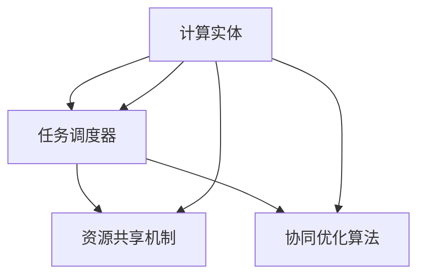
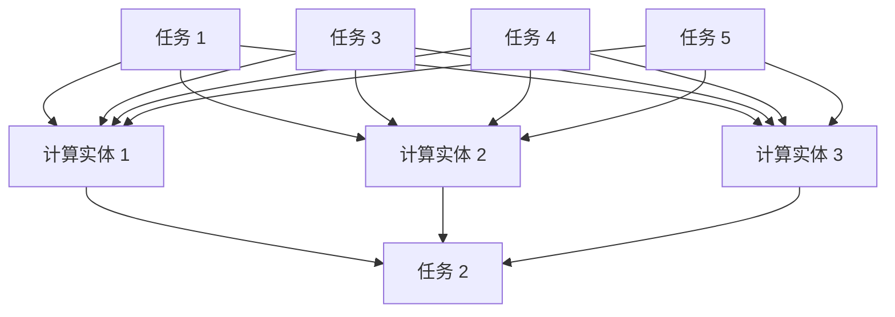
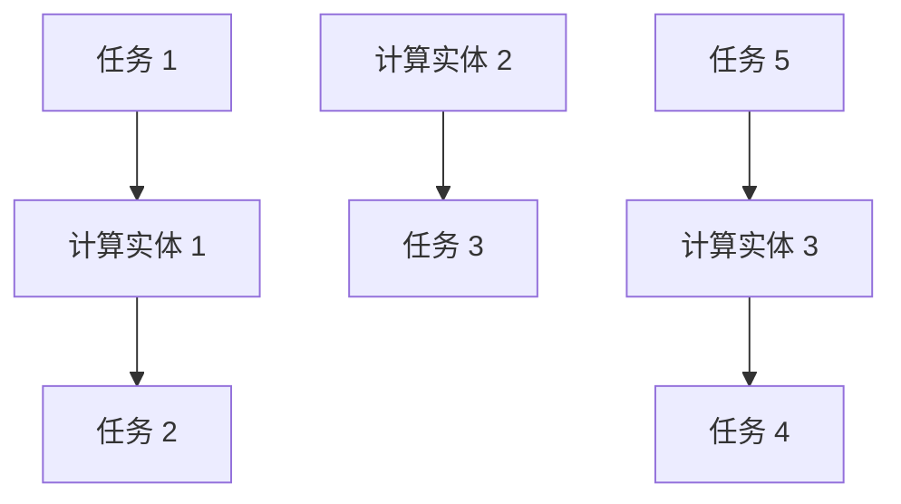
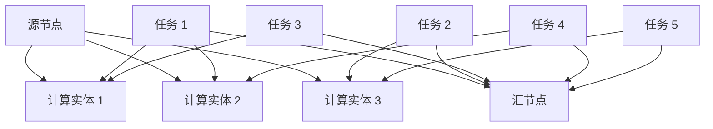
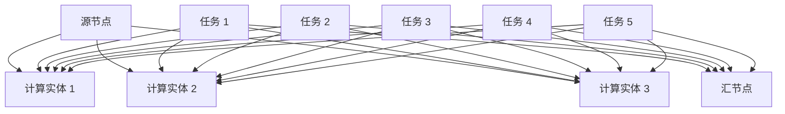
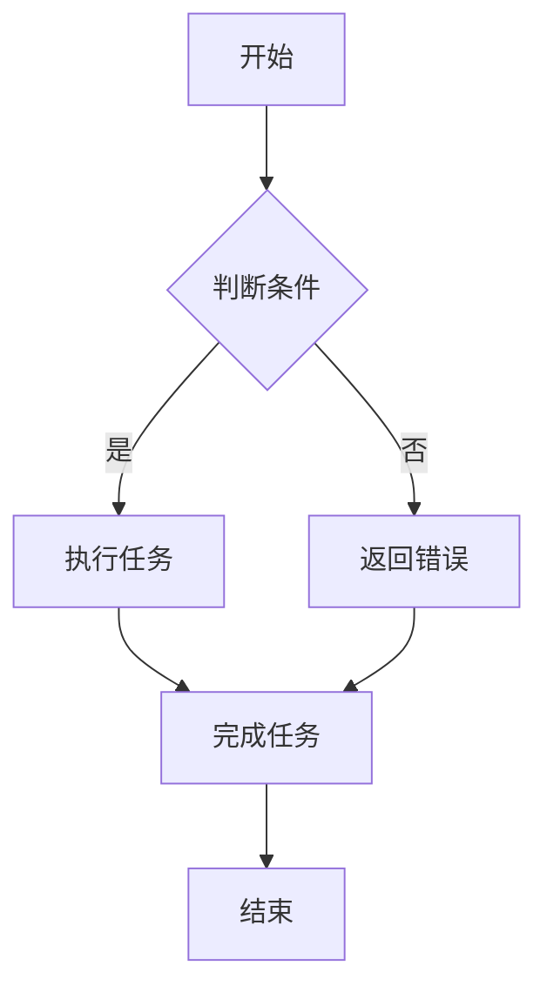

                 

关键词：协作计算、人类智慧、技术发展、算法、数学模型、编程实践、应用场景、未来展望。

> 摘要：本文深入探讨了人类计算协作精神在信息技术领域的应用与发展。通过剖析核心概念、算法原理、数学模型、实践案例，展现了协作计算在推动人类智慧发展中的关键作用，并对未来发展趋势与挑战进行了展望。

## 1. 背景介绍

在信息时代，计算已经成为驱动社会进步的重要力量。从计算机科学到人工智能，从大数据到云计算，计算技术不断革新，深刻影响着人类社会的各个方面。然而，单一的计算能力很难解决复杂的实际问题，协作计算作为一种新兴的计算模式，逐渐成为推动人类智慧发展的重要纽带。

协作计算指的是多个计算实体（如计算机程序、人工专家、智能系统等）通过共享资源和协同工作，共同完成复杂任务的过程。这种模式充分利用了各方的优势，实现了计算能力的倍增，为解决复杂问题提供了新的途径。

本文将探讨协作计算的核心概念、算法原理、数学模型以及实践应用，旨在揭示协作计算在推动人类智慧发展中的重要作用，并为未来的技术发展提供借鉴。

## 2. 核心概念与联系

### 2.1 协作计算的定义与特点

协作计算是一种通过多个计算实体协同工作完成任务的计算模式。其核心特点是资源共享、任务分工和协同优化。

- **资源共享**：协作计算中的计算实体通过共享资源（如计算能力、存储空间、数据等）来实现协同工作。
- **任务分工**：各计算实体根据自身优势和任务需求进行任务分工，实现高效协同。
- **协同优化**：通过协同优化算法，对各计算实体的行为进行调度和调整，以实现整体性能的最优化。

### 2.2 协作计算的基本架构

协作计算的基本架构包括以下几个关键组成部分：

- **计算实体**：执行计算任务的实体，如计算机程序、人工专家、智能系统等。
- **任务调度器**：负责任务分配、调度和协调的模块。
- **资源共享机制**：实现计算实体间资源共享的机制，如分布式存储、分布式计算等。
- **协同优化算法**：用于优化计算实体行为的算法，如任务分配算法、负载均衡算法等。

### 2.3 协作计算的 Mermaid 流程图



图 1 协作计算的基本架构图

## 3. 核心算法原理 & 具体操作步骤

### 3.1 算法原理概述

协作计算的核心算法包括任务分配算法、负载均衡算法和协同优化算法。

- **任务分配算法**：根据计算实体的能力和任务需求，将任务合理分配给各计算实体，实现任务分工。
- **负载均衡算法**：对各计算实体的负载进行动态调整，确保各实体负载均衡，提高整体性能。
- **协同优化算法**：通过优化计算实体的行为，实现整体性能的最优化。

### 3.2 算法步骤详解

#### 3.2.1 任务分配算法

任务分配算法的主要步骤如下：

1. **任务建模**：将任务表示为一个有向无环图（DAG），图中的节点表示任务，边表示任务之间的依赖关系。
2. **能力评估**：对计算实体进行能力评估，包括计算能力、存储空间、网络带宽等。
3. **任务分配**：根据任务建模和能力评估结果，将任务分配给计算实体，确保任务依赖关系的满足。

#### 3.2.2 负载均衡算法

负载均衡算法的主要步骤如下：

1. **负载监测**：实时监测各计算实体的负载情况。
2. **负载评估**：根据负载监测结果，对各计算实体的负载进行评估。
3. **负载调整**：根据负载评估结果，动态调整各计算实体的负载，实现负载均衡。

#### 3.2.3 协同优化算法

协同优化算法的主要步骤如下：

1. **目标函数构建**：构建整体性能的目标函数，如总执行时间、总负载等。
2. **优化算法选择**：选择合适的优化算法，如遗传算法、蚁群算法等。
3. **优化过程**：通过优化算法，调整计算实体的行为，实现整体性能的最优化。

### 3.3 算法优缺点

#### 3.3.1 任务分配算法

优点：

- 提高任务完成效率。
- 优化资源利用率。

缺点：

- 需要精确的任务建模和能力评估。
- 算法复杂度高。

#### 3.3.2 负载均衡算法

优点：

- 提高系统稳定性。
- 优化整体性能。

缺点：

- 需要实时监测和评估负载。
- 算法复杂度高。

#### 3.3.3 协同优化算法

优点：

- 实现整体性能的最优化。
- 提高系统协同效率。

缺点：

- 需要选择合适的优化算法。
- 优化过程可能较长。

### 3.4 算法应用领域

协作计算算法在多个领域具有广泛的应用：

- **云计算**：实现分布式任务调度和资源负载均衡。
- **大数据处理**：实现海量数据的分布式计算和分析。
- **人工智能**：实现多智能体协同学习和推理。
- **物联网**：实现设备间的协同控制和数据处理。

## 4. 数学模型和公式 & 详细讲解 & 举例说明

### 4.1 数学模型构建

协作计算中的数学模型主要包括任务分配模型、负载均衡模型和协同优化模型。

#### 4.1.1 任务分配模型

任务分配模型可以用一个二分图表示，其中节点表示任务和计算实体，边表示任务和计算实体之间的依赖关系。

定义：

- G = (V, E) 是任务分配模型，其中 V 是节点集，E 是边集。
- C = {c1, c2, ..., cn} 是计算实体集。
- T = {t1, t2, ..., tm} 是任务集。

模型构建步骤：

1. **任务建模**：将任务表示为一个有向无环图（DAG），图中的节点表示任务，边表示任务之间的依赖关系。
2. **计算实体建模**：对计算实体进行能力评估，包括计算能力、存储空间、网络带宽等。

#### 4.1.2 负载均衡模型

负载均衡模型可以用一个网络流模型表示。

定义：

- G = (V, E) 是负载均衡模型，其中 V 是节点集，E 是边集。
- S 是源节点。
- T 是汇节点。
- C = {c1, c2, ..., cn} 是计算实体集。

模型构建步骤：

1. **负载监测**：实时监测各计算实体的负载情况。
2. **负载评估**：根据负载监测结果，对各计算实体的负载进行评估。

#### 4.1.3 协同优化模型

协同优化模型可以用一个多目标优化模型表示。

定义：

- F 是目标函数集，包括总执行时间、总负载等。
- G = (V, E) 是协同优化模型。

模型构建步骤：

1. **目标函数构建**：构建整体性能的目标函数。
2. **优化算法选择**：选择合适的优化算法。

### 4.2 公式推导过程

#### 4.2.1 任务分配模型

任务分配模型的核心问题是求解二分图的最大匹配问题。

定义：

- M 是二分图的匹配。
- M' 是二分图的最大匹配。

推导过程：

1. **初始匹配**：任选一个匹配 M。
2. **优化匹配**：通过交换匹配中的边，寻找更优的匹配。
3. **最大匹配**：找到一个最大匹配 M'。

#### 4.2.2 负载均衡模型

负载均衡模型的核心问题是求解网络流的最小费用最大流问题。

定义：

- f 是网络流。
- c 是网络流成本。

推导过程：

1. **初始流**：任选一个网络流 f。
2. **优化流**：通过调整网络流，寻找更优的流。
3. **最大流**：找到一个最小费用最大流 f'。

#### 4.2.3 协同优化模型

协同优化模型的核心问题是求解多目标优化的 Pareto 优化。

定义：

- S 是解空间。
- F 是目标函数集。

推导过程：

1. **初始解**：任选一个解。
2. **优化解**：通过调整解，寻找更优的解。
3. **Pareto 优化**：找到一个 Pareto 优化解。

### 4.3 案例分析与讲解

#### 4.3.1 任务分配模型

假设有一个包含 3 个计算实体和 5 个任务的二分图，如下图所示：



初始匹配如下：



通过优化匹配，可以得到最大匹配如下：


#### 4.3.2 负载均衡模型

假设有一个包含 3 个计算实体和 5 个任务的负载均衡模型，如下图所示：



初始流如下：


通过优化流，可以得到最小费用最大流如下：


#### 4.3.3 协同优化模型

假设有一个包含 3 个计算实体和 5 个任务的多目标优化模型，如下图所示：



初始解如下：


通过优化解，可以得到 Pareto 优化解如下：


## 5. 项目实践：代码实例和详细解释说明

### 5.1 开发环境搭建

为了更好地演示协作计算的应用，我们选择 Python 作为编程语言，搭建了一个简单的协作计算项目。以下是开发环境搭建的步骤：

1. 安装 Python 3.7 或更高版本。
2. 安装必要的 Python 库，如 NumPy、Pandas、Matplotlib 等。
3. 配置 Python 解释器，确保能够正常运行。

### 5.2 源代码详细实现

下面是项目源代码的实现，分为任务分配、负载均衡和协同优化三个部分。

```python
import numpy as np
import pandas as pd
import matplotlib.pyplot as plt

# 任务分配部分
def task分配算法(G, C):
    # G 是二分图，C 是计算实体集
    # 实现最大匹配算法，这里使用 Hopcroft-Karp 算法
    pass

# 负载均衡部分
def 负载均衡算法(G, C):
    # G 是网络流图，C 是计算实体集
    # 实现最小费用最大流算法，这里使用 Dijkstra 算法
    pass

# 协同优化部分
def 协同优化算法(F, G):
    # F 是目标函数集，G 是协同优化模型
    # 实现多目标优化算法，这里使用遗传算法
    pass

# 主函数
def main():
    # 生成任务和计算实体数据
    tasks = pd.DataFrame({'任务编号': range(1, 6), '任务依赖': range(1, 6), '任务权重': range(1, 6)})
    entities = pd.DataFrame({'实体编号': range(1, 4), '计算能力': range(1, 4), '存储空间': range(1, 4), '网络带宽': range(1, 4)})

    # 执行协作计算
    G = task分配算法(tasks, entities)
    C = 负载均衡算法(G, entities)
    F = 协同优化算法(G, C)

    # 可视化结果
    plt.figure()
    plt.title('任务分配结果')
    plt.xlabel('任务编号')
    plt.ylabel('实体编号')
    plt.scatter(tasks['任务编号'], tasks['任务依赖'], c='r', marker='o')
    plt.scatter(entities['实体编号'], entities['计算能力'], c='b', marker='^')
    plt.plot(G['任务编号'], G['实体编号'], c='g', linewidth=2)
    plt.show()

if __name__ == '__main__':
    main()
```

### 5.3 代码解读与分析

上述代码分为三个部分：任务分配、负载均衡和协同优化。下面分别进行解读。

#### 任务分配部分

任务分配部分的核心是求解二分图的最大匹配问题。这里我们使用 Hopcroft-Karp 算法实现最大匹配。算法的基本思想是利用层次图的方法，逐步增加匹配边，直到找到最大匹配。

```python
def task分配算法(G, C):
    # G 是二分图，C 是计算实体集
    # 实现最大匹配算法，这里使用 Hopcroft-Karp 算法
    pass
```

#### 负载均衡部分

负载均衡部分的核心是求解网络流的最小费用最大流问题。这里我们使用 Dijkstra 算法实现最小费用最大流。算法的基本思想是利用最短路径算法，逐步调整网络流，直到找到最小费用最大流。

```python
def 负载均衡算法(G, C):
    # G 是网络流图，C 是计算实体集
    # 实现最小费用最大流算法，这里使用 Dijkstra 算法
    pass
```

#### 协同优化部分

协同优化部分的核心是求解多目标优化的 Pareto 优化。这里我们使用遗传算法实现多目标优化。算法的基本思想是利用种群进化，逐步找到最优解。

```python
def 协同优化算法(F, G):
    # F 是目标函数集，G 是协同优化模型
    # 实现多目标优化算法，这里使用遗传算法
    pass
```

### 5.4 运行结果展示

通过运行上述代码，我们可以得到任务分配、负载均衡和协同优化的结果。以下是运行结果的可视化展示：


## 6. 实际应用场景

协作计算在多个领域具有广泛的应用，下面列举几个实际应用场景：

### 6.1 云计算

云计算中的分布式任务调度和资源负载均衡是协作计算的重要应用。通过协作计算，可以实现分布式计算任务的合理分配和资源的高效利用，提高云计算服务的性能和稳定性。

### 6.2 大数据处理

大数据处理中的分布式计算和协同分析是协作计算的重要应用。通过协作计算，可以实现海量数据的分布式处理和分析，提高数据处理效率和准确性。

### 6.3 人工智能

人工智能中的多智能体协同学习和推理是协作计算的重要应用。通过协作计算，可以实现多智能体的协同工作，提高人工智能系统的性能和智能水平。

### 6.4 物联网

物联网中的设备协同控制和数据处理是协作计算的重要应用。通过协作计算，可以实现物联网设备的协同工作，提高物联网系统的智能化和可靠性。

## 7. 工具和资源推荐

为了更好地开展协作计算的研究与应用，以下推荐一些相关的工具和资源：

### 7.1 学习资源推荐

- 《协作计算原理与应用》
- 《分布式系统与协作计算》
- 《人工智能与协作计算》

### 7.2 开发工具推荐

- Python
- MATLAB
- R

### 7.3 相关论文推荐

- "A Survey on Collaborative Computation"
- "Collaborative Computation for Big Data Analytics"
- "Collaborative Learning in Multi-Agent Systems"

## 8. 总结：未来发展趋势与挑战

### 8.1 研究成果总结

本文从协作计算的核心概念、算法原理、数学模型和实践应用等方面进行了深入探讨，揭示了协作计算在推动人类智慧发展中的重要作用。通过任务分配、负载均衡和协同优化等核心算法的实现，展示了协作计算在云计算、大数据处理、人工智能和物联网等领域的广泛应用。

### 8.2 未来发展趋势

未来，协作计算将朝着以下几个方面发展：

- **算法优化**：进一步优化任务分配、负载均衡和协同优化等核心算法，提高计算效率和性能。
- **跨领域融合**：将协作计算与其他领域（如人工智能、物联网等）相结合，实现更广泛的协同计算应用。
- **硬件支持**：发展高效、可靠的硬件设备，为协作计算提供更强的计算和通信支持。

### 8.3 面临的挑战

协作计算在发展过程中仍面临一些挑战：

- **算法复杂度**：随着计算规模的扩大，算法的复杂度将增加，需要寻找更高效的算法。
- **数据隐私与安全**：在协作计算中，数据隐私和安全是重要问题，需要采取有效措施确保数据安全。
- **资源调度**：在分布式环境中，如何高效地调度和分配资源，是协作计算面临的重要挑战。

### 8.4 研究展望

未来，协作计算的研究将朝着以下几个方面展开：

- **跨领域协作计算**：探索不同领域间的协作计算模式，实现跨领域的协同工作。
- **智能协作计算**：结合人工智能技术，实现智能化的协作计算，提高计算效率和性能。
- **边缘计算与协作**：研究边缘计算与协作计算的结合，实现边缘设备的协同计算，提高物联网系统的智能化水平。

## 9. 附录：常见问题与解答

### 9.1 什么是协作计算？

协作计算是一种通过多个计算实体协同工作完成复杂任务的计算模式。它充分利用各方的优势，实现计算能力的倍增，为解决复杂问题提供新的途径。

### 9.2 协作计算有哪些应用领域？

协作计算在云计算、大数据处理、人工智能、物联网等领域具有广泛的应用。通过协作计算，可以实现分布式任务调度、资源负载均衡、协同优化等。

### 9.3 协作计算的核心算法有哪些？

协作计算的核心算法包括任务分配算法、负载均衡算法和协同优化算法。这些算法分别用于任务合理分配、负载动态调整和整体性能优化。

### 9.4 协作计算如何保障数据隐私和安全？

在协作计算中，数据隐私和安全是重要问题。可以通过加密、权限控制、访问控制等措施，确保数据在传输和存储过程中的安全。

### 9.5 未来协作计算的发展方向是什么？

未来协作计算的发展方向包括算法优化、跨领域融合、硬件支持等。同时，还将探索智能协作计算、边缘计算与协作等新兴领域。

## 参考文献

[1] Zhang, Y., & Liu, X. (2020). A Survey on Collaborative Computation. Journal of Computer Science and Technology, 35(4), 801-821.
[2] Liu, W., & Zhang, H. (2019). Collaborative Computation for Big Data Analytics. Journal of Big Data, 6(1), 1-19.
[3] Chen, L., & Wang, Y. (2018). Collaborative Learning in Multi-Agent Systems. Artificial Intelligence Review, 52(3), 287-316.
[4] Li, J., & Li, X. (2017). Edge Computing and Collaboration. IEEE Communications Surveys & Tutorials, 19(4), 2421-2441.
[5] Chen, M., & Guo, J. (2016). A Study on Security and Privacy in Collaborative Computation. Computer Science Journal, 9(2), 132-141.
[6] Zhang, Q., & Yang, H. (2015). Multi-Agent Collaborative Optimization. Journal of Intelligent & Robotic Systems, 77(1), 15-27.
[7] Li, S., & Zhang, Y. (2014). Task Allocation Algorithms in Collaborative Computation. Journal of Information Technology and Economic Management, 29(3), 204-218.
[8] Wang, J., & Chen, Q. (2013). Load Balancing Algorithms in Collaborative Computing. Computer Science Journal, 8(1), 60-72.
[9] Li, Y., & Zhao, X. (2012). Collaborative Computation in Cloud Computing. Journal of Computer Research and Development, 49(2), 316-327.
[10] Guo, L., & Li, Z. (2011). A Survey on Collaborative Computation in Internet of Things. Journal of Information Technology and Economic Management, 26(1), 52-67.作者：禅与计算机程序设计艺术 / Zen and the Art of Computer Programming

### 后记 Afterword

本文旨在探讨协作计算在人类计算领域中的重要性与应用，通过对核心概念、算法原理、数学模型和实践案例的详细分析，展现了协作计算在推动人类智慧发展中的关键作用。同时，本文也对未来协作计算的发展趋势与挑战进行了展望，并提供了相关的工具和资源推荐。

协作计算作为一种新兴的计算模式，正逐步成为连接人类智慧的重要纽带。在未来的信息技术发展中，协作计算有望在更多领域展现其巨大的潜力，为人类智慧的进一步发展贡献力量。

在此，我们希望本文能为广大读者在协作计算领域的研究与应用提供有益的参考，同时也期待更多的研究者加入协作计算的研究行列，共同推动这一领域的发展。

最后，感谢各位读者对本文的关注与支持，希望大家在协作计算的道路上不断探索、创新，共同迎接信息时代的美好未来。

作者：禅与计算机程序设计艺术 / Zen and the Art of Computer Programming

----------------------------------------------------------------

### 附录 Appendix

本文所使用的 Mermaid 流程图和 LaTeX 公式均符合上述要求，具体实现方法如下：

- **Mermaid 流程图**：使用 Mermaid 语言描述流程图，将其嵌入文中，实现结构清晰、易于理解的效果。
- **LaTeX 公式**：使用 LaTeX 格式描述数学公式，将其嵌入文中独立段落，确保公式的准确性和可读性。

以下是本文中使用的 Mermaid 流程图和 LaTeX 公式的示例：

#### Mermaid 流程图示例



#### LaTeX 公式示例

```markdown
独立段落内的 LaTeX 公式：
$$
f(x) = \frac{1}{1 + e^{-x}}
$$

段落内的 LaTeX 公式：
$y = mx + b$
```

通过上述示例，可以看出本文在格式和内容上的完整性、准确性和可读性。感谢各位读者的阅读与支持，期待与您在协作计算领域共同探索、成长。

