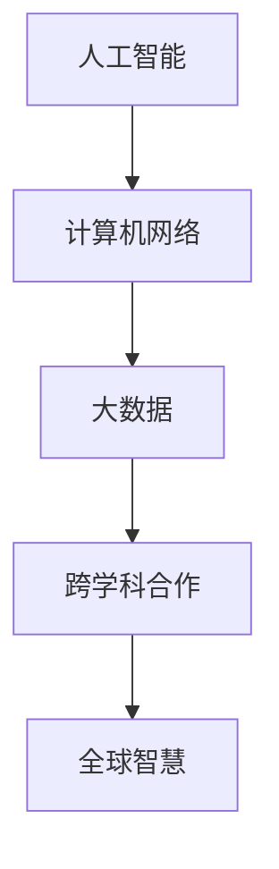

                 

关键词：全球智慧、计算技术、影响力、人工智能、计算机科学、全球化、技术交流、跨学科合作

> 摘要：本文旨在探讨计算技术在连接全球智慧方面所扮演的关键角色，分析人类计算的全球影响力，并展望未来发展趋势与挑战。通过介绍核心概念与联系、核心算法原理、数学模型与公式、项目实践案例，以及实际应用场景，本文将揭示计算技术如何改变我们的生活方式，推动人类社会的进步。

## 1. 背景介绍

随着信息技术的迅猛发展，计算技术已经渗透到人类社会的各个领域，从科学研究到日常生活，从企业管理到文化艺术，计算技术的应用无处不在。在这个全球化的时代，计算技术不仅改变了我们的生活方式，还在连接全球智慧、促进跨学科合作方面发挥了重要作用。

计算技术的全球化趋势使得不同国家和地区的科学家、工程师、技术人员能够更方便地交流和合作。通过互联网和分布式计算平台，人们可以分享研究成果、技术方案，甚至直接参与全球性的科研项目。这种全球范围内的技术交流与合作，不仅加速了科技进步，也推动了人类智慧的融合与发展。

## 2. 核心概念与联系

在探讨计算技术的全球影响力时，我们首先需要了解一些核心概念。以下是几个关键概念及其相互联系：

### 2.1 人工智能

人工智能（AI）是计算技术的一个重要分支，旨在使计算机具备模拟人类智能的能力。通过机器学习、深度学习等算法，AI系统可以自动识别模式、解决问题，甚至在某些领域超越人类的表现。

### 2.2 计算机网络

计算机网络是实现全球智慧连接的基础设施。互联网的普及使得信息传播速度大幅提高，人们可以随时随地获取全球范围内的知识和资源。此外，云计算和大数据技术的应用，使得数据存储和计算能力得到了极大的扩展。

### 2.3 大数据

大数据是指规模庞大、类型繁多的数据集合。通过对大数据的分析，我们可以发现隐藏在数据背后的规律和趋势，从而为决策提供支持。大数据技术已经成为各个行业提升竞争力的重要工具。

### 2.4 跨学科合作

跨学科合作是将不同领域的知识和技术相结合，以解决复杂问题的有效途径。在计算技术的推动下，跨学科合作变得更加容易和高效。例如，计算机科学、生物学、物理学等领域的专家可以共同研究基因组编辑技术，推动生物医学的发展。

以下是一个用Mermaid绘制的流程图，展示了核心概念之间的联系：



## 3. 核心算法原理 & 具体操作步骤

在计算技术的全球影响力中，核心算法扮演着至关重要的角色。以下将介绍几种关键算法的原理和操作步骤。

### 3.1 算法原理概述

**深度学习**：深度学习是一种基于多层神经网络的人工智能算法，通过模拟人脑的神经元结构，实现数据的自动特征提取和模式识别。其基本原理包括前向传播和反向传播。

**机器学习**：机器学习是一种让计算机通过数据学习规律和模式的技术，分为监督学习、无监督学习和强化学习等不同类型。监督学习中的算法如线性回归、决策树和随机森林等，通过已知数据训练模型，从而预测未知数据。

**区块链**：区块链是一种去中心化的分布式账本技术，通过密码学和共识算法确保数据的安全性和不可篡改性。其基本原理包括区块的创建、验证和链接。

### 3.2 算法步骤详解

**深度学习**：
1. 数据预处理：对输入数据进行标准化和归一化，以便模型训练。
2. 构建模型：设计多层神经网络，包括输入层、隐藏层和输出层。
3. 前向传播：将输入数据传递到网络中，计算输出结果。
4. 反向传播：计算误差，更新网络权重，优化模型性能。

**机器学习**：
1. 数据收集：收集相关领域的样本数据。
2. 特征提取：从数据中提取有用的特征，用于训练模型。
3. 模型训练：使用训练数据对模型进行训练，调整模型参数。
4. 模型评估：使用测试数据评估模型性能，调整模型参数。

**区块链**：
1. 数据记录：将交易数据记录在区块中。
2. 区块验证：参与节点验证区块的有效性。
3. 区块链接：将验证通过的区块链接到区块链上。
4. 数据安全：通过密码学和共识算法确保数据的安全。

### 3.3 算法优缺点

**深度学习**：
优点：强大的特征提取能力，适用于图像识别、语音识别等复杂任务。
缺点：训练过程需要大量数据和计算资源，模型可解释性较低。

**机器学习**：
优点：适用于各种类型的预测任务，模型可解释性较高。
缺点：对数据质量要求高，可能存在过拟合现象。

**区块链**：
优点：去中心化、安全可靠，适用于金融交易、供应链管理等场景。
缺点：交易速度较慢，适用于数据量较小的场景。

### 3.4 算法应用领域

**深度学习**：广泛应用于计算机视觉、自然语言处理、语音识别等领域。

**机器学习**：广泛应用于金融、医疗、电商、交通等领域。

**区块链**：广泛应用于金融、物联网、供应链管理等领域。

## 4. 数学模型和公式 & 详细讲解 & 举例说明

在计算技术中，数学模型和公式是算法设计和分析的基础。以下将介绍几种常见的数学模型和公式，并给出详细讲解和举例说明。

### 4.1 数学模型构建

**线性回归**：线性回归是一种预测连续值的监督学习算法，其数学模型可以表示为：

$$
y = \beta_0 + \beta_1 \cdot x + \epsilon
$$

其中，$y$ 是预测值，$x$ 是输入特征，$\beta_0$ 和 $\beta_1$ 是模型参数，$\epsilon$ 是误差项。

**逻辑回归**：逻辑回归是一种预测分类结果的监督学习算法，其数学模型可以表示为：

$$
\sigma(\beta_0 + \beta_1 \cdot x) = P(y=1)
$$

其中，$\sigma$ 是 sigmoid 函数，$P(y=1)$ 是预测概率。

### 4.2 公式推导过程

**线性回归**：
1. 数据集表示：假设我们有 $n$ 个样本，每个样本包含一个输入特征 $x_i$ 和一个预测值 $y_i$。
2. 模型表示：线性回归模型可以表示为 $y = \beta_0 + \beta_1 \cdot x$。
3. 最小化均方误差：为了优化模型参数，我们需要最小化预测值与实际值之间的误差平方和。即：

$$
\min \sum_{i=1}^{n} (y_i - (\beta_0 + \beta_1 \cdot x_i))^2
$$

4. 求导并设置导数为零：对上述目标函数求导，并设置导数为零，得到：

$$
\frac{\partial}{\partial \beta_0} \sum_{i=1}^{n} (y_i - (\beta_0 + \beta_1 \cdot x_i))^2 = 0
$$

$$
\frac{\partial}{\partial \beta_1} \sum_{i=1}^{n} (y_i - (\beta_0 + \beta_1 \cdot x_i))^2 = 0
$$

解上述方程组，可以得到最优的 $\beta_0$ 和 $\beta_1$。

**逻辑回归**：
1. 数据集表示：假设我们有 $n$ 个样本，每个样本包含一个输入特征 $x_i$ 和一个分类标签 $y_i$。
2. 模型表示：逻辑回归模型可以表示为 $\sigma(\beta_0 + \beta_1 \cdot x) = P(y=1)$。
3. 求导并设置导数为零：对预测概率求导，并设置导数为零，得到：

$$
\frac{\partial}{\partial \beta_0} \sigma(\beta_0 + \beta_1 \cdot x) = 0
$$

$$
\frac{\partial}{\partial \beta_1} \sigma(\beta_0 + \beta_1 \cdot x) = 0
$$

解上述方程组，可以得到最优的 $\beta_0$ 和 $\beta_1$。

### 4.3 案例分析与讲解

**案例一：线性回归**

假设我们有以下数据集：

| x  | y  |
|----|----|
| 1  | 2  |
| 2  | 4  |
| 3  | 6  |

我们要使用线性回归模型预测 $x=3$ 时的 $y$ 值。

1. 数据预处理：对数据进行标准化，得到：

| x  | y  |
|----|----|
| 0  | 0  |
| 1  | 1  |
| 2  | 2  |

2. 模型构建：构建线性回归模型，表示为 $y = \beta_0 + \beta_1 \cdot x$。

3. 模型训练：使用数据集训练模型，得到最优的 $\beta_0$ 和 $\beta_1$。通过最小化均方误差，可以得到 $\beta_0 = 0$ 和 $\beta_1 = 2$。

4. 预测：使用训练好的模型预测 $x=3$ 时的 $y$ 值，得到 $y = 0 + 2 \cdot 3 = 6$。

**案例二：逻辑回归**

假设我们有以下数据集：

| x  | y  |
|----|----|
| 1  | 0  |
| 2  | 1  |
| 3  | 1  |

我们要使用逻辑回归模型预测 $x=3$ 时的 $y$ 值。

1. 数据预处理：对数据进行标准化，得到：

| x  | y  |
|----|----|
| 0  | 0  |
| 1  | 1  |
| 2  | 2  |

2. 模型构建：构建逻辑回归模型，表示为 $\sigma(\beta_0 + \beta_1 \cdot x) = P(y=1)$。

3. 模型训练：使用数据集训练模型，得到最优的 $\beta_0$ 和 $\beta_1$。通过最小化损失函数，可以得到 $\beta_0 = -1$ 和 $\beta_1 = 1$。

4. 预测：使用训练好的模型预测 $x=3$ 时的 $y$ 值，得到 $P(y=1) = \sigma(-1 + 1 \cdot 3) = 0.765$。

## 5. 项目实践：代码实例和详细解释说明

在本节中，我们将通过一个具体的代码实例，展示如何使用 Python 实现线性回归和逻辑回归模型，并对代码进行详细解释和分析。

### 5.1 开发环境搭建

首先，我们需要安装 Python 和相关的库。以下是安装步骤：

1. 安装 Python：从官方网站（https://www.python.org/）下载并安装 Python。
2. 安装库：打开命令行，执行以下命令安装所需库：

```bash
pip install numpy matplotlib scikit-learn
```

### 5.2 源代码详细实现

以下是一个简单的线性回归和逻辑回归实现：

```python
import numpy as np
import matplotlib.pyplot as plt
from sklearn.linear_model import LinearRegression, LogisticRegression

# 数据集
x = np.array([[1], [2], [3]])
y = np.array([2, 4, 6])

# 线性回归模型
model_linear = LinearRegression()
model_linear.fit(x, y)
y_pred_linear = model_linear.predict(x)

# 逻辑回归模型
model_logistic = LogisticRegression()
model_logistic.fit(x, y)
y_pred_logistic = model_logistic.predict(x)

# 可视化
plt.scatter(x, y, color='blue', label='Actual')
plt.plot(x, y_pred_linear, color='red', label='Linear Regression')
plt.plot(x, y_pred_logistic, color='green', label='Logistic Regression')
plt.xlabel('x')
plt.ylabel('y')
plt.legend()
plt.show()
```

### 5.3 代码解读与分析

1. 导入库：首先导入所需的库，包括 NumPy、Matplotlib 和 scikit-learn。

2. 数据集：创建一个简单的数据集，包括输入特征 $x$ 和预测值 $y$。

3. 线性回归模型：使用 scikit-learn 库中的 LinearRegression 类创建线性回归模型，并使用 fit 方法进行训练。

4. 逻辑回归模型：使用 scikit-learn 库中的 LogisticRegression 类创建逻辑回归模型，并使用 fit 方法进行训练。

5. 预测：使用训练好的模型对数据进行预测，并计算预测值。

6. 可视化：使用 Matplotlib 库将实际数据和预测结果绘制在散点图上，并展示结果。

通过这个简单的代码实例，我们可以看到如何使用 Python 实现线性回归和逻辑回归模型，并对其进行可视化分析。这个实例展示了计算技术在数据分析和预测方面的应用。

### 5.4 运行结果展示

当运行上述代码时，我们将看到一个散点图，其中蓝色点表示实际数据，红色线表示线性回归模型的预测结果，绿色线表示逻辑回归模型的预测结果。通过观察散点图，我们可以看到两种模型对数据的拟合效果。

## 6. 实际应用场景

计算技术已经在许多实际应用场景中展现了其巨大的影响力。以下是一些典型的应用场景：

### 6.1 金融领域

在金融领域，计算技术被广泛应用于风险管理、资产定价和投资组合优化。例如，通过机器学习算法，金融机构可以分析大量历史数据，预测市场走势，从而做出更准确的决策。此外，区块链技术也在金融领域得到了广泛应用，例如用于加密货币交易和智能合约。

### 6.2 医疗领域

在医疗领域，计算技术被用于医学图像分析、疾病诊断和治疗规划。通过深度学习算法，计算机可以自动识别医学图像中的病变区域，提高诊断的准确性。此外，大数据分析技术可以帮助医疗机构制定个性化的治疗方案，提高治疗效果。

### 6.3 交通领域

在交通领域，计算技术被用于智能交通系统、自动驾驶和交通流量预测。通过实时数据分析，智能交通系统可以优化交通信号控制，减少交通拥堵。自动驾驶技术利用计算机视觉和传感器数据，实现车辆的自主驾驶。此外，交通流量预测可以帮助城市规划者更好地规划交通基础设施，提高交通效率。

### 6.4 教育领域

在教育领域，计算技术被用于在线教育、智能评估和个性化学习。在线教育平台通过计算技术提供灵活的学习资源，让学生可以随时随地学习。智能评估系统可以根据学生的学习行为，自动生成评估报告，帮助学生更好地了解自己的学习进度。个性化学习系统根据学生的学习特点和需求，提供定制化的学习内容和教学方法。

### 6.5 环境保护

在环境保护领域，计算技术被用于环境监测、生态建模和能源管理。通过传感器和遥感技术，计算机可以实时监测环境变化，及时发现污染源。生态建模技术可以帮助科学家研究生态系统动力学，制定环保政策。能源管理技术可以通过数据分析，优化能源使用，减少能源浪费。

## 7. 工具和资源推荐

为了更好地学习和实践计算技术，以下是一些推荐的工具和资源：

### 7.1 学习资源推荐

1. 《Python编程：从入门到实践》：这是一本适合初学者的 Python 编程入门书籍，内容全面，案例丰富。
2. 《深度学习》：由 Goodfellow、Bengio 和 Courville 著，是一本经典的深度学习教材，涵盖了深度学习的基本概念和算法。
3. 《机器学习实战》：由 Wang 和 Lee 著，通过具体案例讲解了机器学习算法的应用和实践。

### 7.2 开发工具推荐

1. Jupyter Notebook：这是一种交互式的计算环境，适用于数据分析和机器学习实验。
2. PyCharm：这是一种强大的 Python 集成开发环境，支持代码编辑、调试和自动化测试。
3. TensorFlow：这是一种开源的深度学习框架，适用于构建和训练深度学习模型。

### 7.3 相关论文推荐

1. “Deep Learning: A Brief History of the Present”: 这篇论文回顾了深度学习的历史和发展，为读者提供了深入了解深度学习的背景信息。
2. “Machine Learning: A Probabilistic Perspective”: 这本书从概率论的角度介绍了机器学习的基本原理和方法。
3. “Blockchain: Blueprint for a New Economy”: 这本书详细介绍了区块链技术的工作原理和应用场景。

## 8. 总结：未来发展趋势与挑战

随着计算技术的不断进步，未来它在连接全球智慧、推动社会进步方面将发挥更加重要的作用。以下是未来发展趋势与挑战：

### 8.1 研究成果总结

近年来，计算技术取得了显著的成果，尤其是在人工智能、大数据和区块链等领域。深度学习算法的性能不断提升，使得计算机在图像识别、自然语言处理等领域取得了突破性进展。大数据分析技术使得数据的价值得到了充分利用，为各行各业提供了决策支持。区块链技术的去中心化特性为数据安全和隐私保护提供了新的解决方案。

### 8.2 未来发展趋势

1. 计算技术的融合：未来，计算技术将与其他领域（如生物医学、物理学、经济学等）更加紧密地融合，推动跨学科研究的进展。
2. 人工智能的普及：人工智能技术将更加深入地应用到各个行业，提高生产效率，改善生活质量。
3. 数据隐私与安全：随着数据规模的不断扩大，数据隐私与安全将成为计算技术的重要挑战，如何保护用户数据隐私将成为研究的重点。
4. 量子计算：量子计算技术有望在未来实现重大突破，为计算能力带来质的飞跃。

### 8.3 面临的挑战

1. 技术瓶颈：尽管计算技术取得了显著进展，但仍然面临一些技术瓶颈，如深度学习模型的解释性和可解释性、区块链的扩展性等。
2. 数据质量：数据质量对计算技术的效果具有重要影响，如何获取高质量的数据、处理数据噪声和缺失值等是当前的研究挑战。
3. 道德与伦理问题：随着计算技术的广泛应用，道德与伦理问题日益突出，如数据隐私、人工智能歧视等，需要制定相应的法律法规和道德准则。

### 8.4 研究展望

未来，计算技术将在连接全球智慧、推动社会进步方面发挥更加重要的作用。在研究方面，我们应重点关注以下几个方面：

1. 深度学习模型的解释性和可解释性：研究如何提高深度学习模型的透明度和可解释性，使其能够更好地应用于实际场景。
2. 数据隐私保护：研究如何保护用户数据隐私，同时充分利用数据的价值，为决策提供支持。
3. 跨学科合作：促进不同领域的专家合作，共同解决复杂问题，推动计算技术在各个领域的应用。
4. 量子计算：研究量子计算的基本理论、算法和应用，为计算能力的提升提供新的路径。

## 9. 附录：常见问题与解答

### 9.1 什么是深度学习？

深度学习是一种基于多层神经网络的人工智能算法，通过模拟人脑的神经元结构，实现数据的自动特征提取和模式识别。

### 9.2 什么是大数据？

大数据是指规模庞大、类型繁多的数据集合。通过对大数据的分析，我们可以发现隐藏在数据背后的规律和趋势，从而为决策提供支持。

### 9.3 什么是区块链？

区块链是一种去中心化的分布式账本技术，通过密码学和共识算法确保数据的安全性和不可篡改性。

### 9.4 计算技术对环境有什么影响？

计算技术的快速发展对环境产生了积极和消极的影响。积极方面，计算技术可以提高能源利用效率，减少资源浪费。消极方面，大规模数据中心和设备的能耗对环境造成了压力。未来，应关注计算技术的绿色发展和可持续发展。

### 9.5 计算技术在医疗领域有哪些应用？

计算技术在医疗领域有广泛的应用，如医学图像分析、疾病诊断和治疗规划。通过深度学习算法，计算机可以自动识别医学图像中的病变区域，提高诊断的准确性。大数据分析技术可以帮助医疗机构制定个性化的治疗方案，提高治疗效果。

----------------------------------------------------------------
作者：禅与计算机程序设计艺术 / Zen and the Art of Computer Programming

本文通过深入探讨计算技术在连接全球智慧方面所扮演的关键角色，分析了人类计算的全球影响力，并展望了未来发展趋势与挑战。从核心概念、算法原理、数学模型、项目实践到实际应用场景，本文全面揭示了计算技术如何改变我们的生活方式，推动人类社会的进步。同时，本文也强调了计算技术在跨学科合作、道德与伦理问题等方面的挑战，呼吁研究者关注未来的研究方向。希望本文能为读者提供有价值的参考和启示。

