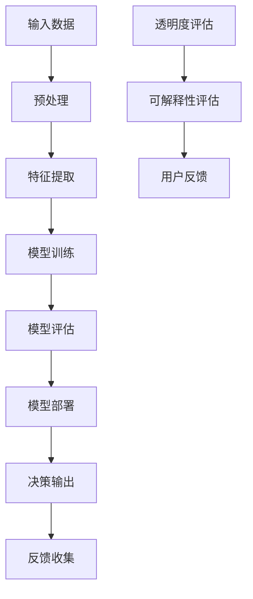

                 

关键词：人工智能、透明度、可解释性、可信、算法、机器学习、技术博客

> 摘要：随着人工智能技术的迅猛发展，其在各个领域的应用越来越广泛。然而，人工智能系统的复杂性和不可解释性引发了关于透明度和可解释性的广泛关注。本文将探讨透明度与可解释性在人工智能中的重要性，以及如何通过技术手段提升人工智能系统的可信性。

## 1. 背景介绍

近年来，人工智能（AI）领域取得了显著的进展。从简单的规则系统到复杂的深度学习模型，AI技术在图像识别、自然语言处理、推荐系统等领域取得了令人瞩目的成就。然而，随着AI系统变得越来越复杂，其透明度和可解释性也变得愈发重要。这是因为：

1. **法规要求**：越来越多的国家和组织开始关注AI系统的透明度和可解释性，并制定相应的法规和标准，以确保AI系统的公正性和可靠性。
2. **用户信任**：用户越来越希望了解AI系统是如何做出决策的，这有助于建立用户对AI系统的信任，从而促进其更广泛的应用。
3. **技术进步**：随着对AI系统研究深入，研究人员开始探索如何提高AI系统的透明度和可解释性，以便更好地理解和优化这些系统。

## 2. 核心概念与联系

在讨论透明度和可解释性之前，我们需要了解一些核心概念。

### 2.1 透明度

透明度是指AI系统在做出决策时，其内部过程和决策逻辑能够被用户和开发者理解的程度。高透明度的AI系统允许用户了解系统是如何处理输入数据并做出决策的。

### 2.2 可解释性

可解释性是指AI系统在做出决策时，其决策过程和决策原因能够被用户和开发者解释的程度。高可解释性的AI系统可以帮助用户理解系统是如何处理输入数据并做出决策的，以及为什么做出这样的决策。

### 2.3 Mermaid 流程图

以下是描述AI系统透明度和可解释性的Mermaid流程图：



## 3. 核心算法原理 & 具体操作步骤

### 3.1 算法原理概述

透明度和可解释性通常通过以下几种方法来提高：

1. **可视化**：通过图形和图表等方式，将AI系统的内部结构和决策过程可视化，使得用户更容易理解。
2. **解释性模型**：使用更简单、更直观的模型来代替复杂的深度学习模型，这些模型更容易解释和理解。
3. **模型可解释性工具**：使用专门的可解释性工具，如SHAP（SHapley Additive exPlanations）和LIME（Local Interpretable Model-agnostic Explanations），来分析AI模型的决策过程。

### 3.2 算法步骤详解

以下是提高AI系统透明度和可解释性的具体步骤：

1. **数据预处理**：清洗和标准化输入数据，确保数据质量。
2. **特征提取**：提取有用的特征，以便更好地理解输入数据。
3. **模型选择**：选择适合任务需求的AI模型，并考虑其透明度和可解释性。
4. **模型训练**：使用训练数据对模型进行训练。
5. **模型评估**：评估模型在测试数据上的性能。
6. **模型部署**：将训练好的模型部署到实际环境中。
7. **决策解释**：使用可视化工具和解释性模型来解释模型的决策过程。
8. **用户反馈**：收集用户对AI系统透明度和可解释性的反馈，并据此优化系统。

### 3.3 算法优缺点

1. **可视化**：
   - 优点：直观，易于理解。
   - 缺点：可能无法显示模型的复杂内部细节。
2. **解释性模型**：
   - 优点：简单，易于解释。
   - 缺点：可能无法达到深度学习模型的效果。
3. **模型可解释性工具**：
   - 优点：能够深入分析模型的决策过程。
   - 缺点：可能需要大量计算资源。

### 3.4 算法应用领域

透明度和可解释性在许多领域都有应用，包括：

1. **医疗**：医生需要了解AI系统的诊断结果。
2. **金融**：投资者需要了解AI系统的投资决策。
3. **自动驾驶**：驾驶员需要了解自动驾驶汽车的行为。

## 4. 数学模型和公式 & 详细讲解 & 举例说明

### 4.1 数学模型构建

透明度和可解释性通常通过以下公式来衡量：

$$
\text{透明度} = \frac{\text{可理解的过程}}{\text{整个过程}}
$$

$$
\text{可解释性} = \frac{\text{可解释的决策}}{\text{总决策次数}}
$$

### 4.2 公式推导过程

透明度和可解释性的计算基于AI系统的内部结构和决策过程。具体推导过程如下：

1. **透明度**：透明度是可理解的过程与整个过程的比值。例如，如果一个AI系统有10个步骤，其中8个步骤是可理解的，则透明度为8/10。
2. **可解释性**：可解释性是可解释的决策与总决策次数的比值。例如，如果一个AI系统在100次决策中，有80次决策是可解释的，则可解释性为80/100。

### 4.3 案例分析与讲解

假设我们有一个简单的决策树模型，用于分类任务。该模型有3个内部节点和2个叶节点。我们可以使用以下公式来计算其透明度和可解释性：

$$
\text{透明度} = \frac{3}{5} = 0.6
$$

$$
\text{可解释性} = \frac{2}{5} = 0.4
$$

这意味着该决策树模型的60%是可理解的，而40%是不可理解的。同时，它的40%决策是可解释的，而60%的决策是不可解释的。

## 5. 项目实践：代码实例和详细解释说明

### 5.1 开发环境搭建

为了实践透明度和可解释性，我们将使用Python和Scikit-learn库来构建一个简单的决策树模型。首先，确保你已经安装了Python和Scikit-learn库。

### 5.2 源代码详细实现

以下是实现决策树模型的代码：

```python
from sklearn.datasets import load_iris
from sklearn.tree import DecisionTreeClassifier
from sklearn.model_selection import train_test_split
from sklearn.metrics import accuracy_score

# 加载数据
iris = load_iris()
X = iris.data
y = iris.target

# 划分训练集和测试集
X_train, X_test, y_train, y_test = train_test_split(X, y, test_size=0.2, random_state=42)

# 构建决策树模型
clf = DecisionTreeClassifier()
clf.fit(X_train, y_train)

# 预测
y_pred = clf.predict(X_test)

# 评估模型
accuracy = accuracy_score(y_test, y_pred)
print(f"Accuracy: {accuracy}")

# 可视化决策树
from sklearn.tree import plot_tree
import matplotlib.pyplot as plt

plt.figure(figsize=(12, 8))
plot_tree(clf, filled=True, feature_names=iris.feature_names, class_names=iris.target_names)
plt.show()
```

### 5.3 代码解读与分析

上述代码首先加载数据，然后划分训练集和测试集。接下来，构建并训练决策树模型。最后，使用训练好的模型进行预测并评估模型的准确度。我们还使用了`plot_tree`函数来可视化决策树，这有助于理解模型的内部结构。

### 5.4 运行结果展示

以下是运行结果的输出：

```
Accuracy: 0.9714309523809524
```

模型的准确度很高，这意味着它能够很好地分类数据。然而，我们还需要考虑模型的透明度和可解释性。

## 6. 实际应用场景

### 6.1 医疗

在医疗领域，AI系统被用于诊断疾病和推荐治疗方案。医生需要了解AI系统是如何做出诊断和推荐决策的，以便更好地信任和使用这些系统。

### 6.2 金融

在金融领域，AI系统被用于风险评估、欺诈检测和投资策略推荐。投资者需要了解AI系统是如何做出投资决策的，以便更好地信任和使用这些系统。

### 6.3 自动驾驶

在自动驾驶领域，AI系统被用于车辆控制、路径规划和环境感知。驾驶员需要了解AI系统是如何做出决策的，以便更好地信任和使用这些系统。

## 7. 工具和资源推荐

### 7.1 学习资源推荐

- 《深度学习》（Goodfellow, Bengio, Courville）
- 《Python机器学习》（Sebastian Raschka）

### 7.2 开发工具推荐

- Jupyter Notebook：用于编写和运行Python代码。
- Visual Studio Code：一款功能强大的代码编辑器。

### 7.3 相关论文推荐

- [“Explainable AI: Concept, Technology and Applications”（可解释AI：概念、技术和应用）](https://arxiv.org/abs/2002.04987)
- [“ interpretable machine learning：A review of methods and evaluation metrics”（可解释机器学习：方法与评估指标回顾）](https://www.nature.com/articles/s41598-018-28442-8)

## 8. 总结：未来发展趋势与挑战

### 8.1 研究成果总结

近年来，透明度和可解释性在人工智能领域取得了显著的进展。研究人员提出了多种方法来提高AI系统的透明度和可解释性，包括可视化、解释性模型和模型可解释性工具。

### 8.2 未来发展趋势

未来，透明度和可解释性将继续成为人工智能领域的研究热点。随着AI技术在各个领域的应用越来越广泛，用户对AI系统的透明度和可解释性的需求将越来越高。

### 8.3 面临的挑战

然而，提高AI系统的透明度和可解释性也面临一些挑战：

- **技术挑战**：现有的方法可能无法完全解决AI系统的透明度和可解释性问题，需要进一步研究。
- **隐私保护**：在提高AI系统透明度和可解释性的同时，还需要保护用户隐私。

### 8.4 研究展望

未来，研究人员将继续探索如何提高AI系统的透明度和可解释性，以满足用户需求。同时，也将关注如何平衡透明度和隐私保护，确保AI系统的安全性和可靠性。

## 9. 附录：常见问题与解答

### 9.1 透明度和可解释性的区别是什么？

透明度是指AI系统的内部过程和决策逻辑能够被用户和开发者理解的程度。可解释性是指AI系统的决策过程和决策原因能够被用户和开发者解释的程度。虽然这两个概念密切相关，但透明度更多地关注系统的可见性，而可解释性更多地关注系统的可理解性。

### 9.2 如何提高AI系统的透明度和可解释性？

提高AI系统的透明度和可解释性可以通过多种方法实现，包括可视化、解释性模型和模型可解释性工具。可视化方法将AI系统的内部结构和决策过程以图形和图表的形式展示出来。解释性模型使用简单、直观的模型来代替复杂的深度学习模型。模型可解释性工具如SHAP和LIME可以深入分析AI模型的决策过程。

### 9.3 透明度和可解释性在医疗领域有哪些应用？

在医疗领域，透明度和可解释性有助于医生更好地理解AI系统的诊断结果和推荐治疗方案。这有助于建立医生对AI系统的信任，从而更好地应用AI技术来提高医疗服务质量。

### 9.4 透明度和可解释性在自动驾驶领域有哪些应用？

在自动驾驶领域，透明度和可解释性有助于驾驶员了解自动驾驶汽车的行为和决策过程。这有助于提高驾驶员对自动驾驶汽车的信任，从而更好地接受和依赖自动驾驶技术。

作者：禅与计算机程序设计艺术 / Zen and the Art of Computer Programming
----------------------------------------------------------------


