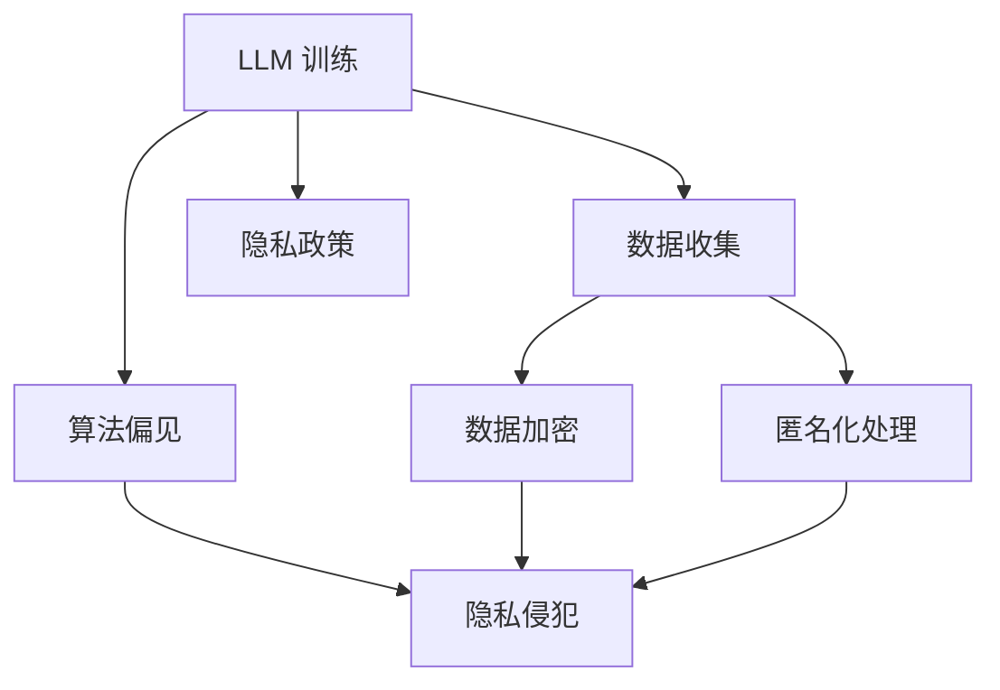

                 

关键词：道德伦理、LLM、隐私、创新、责任、算法伦理

> 摘要：随着人工智能特别是大型语言模型（LLM）的迅速发展，其在各个领域的应用带来了前所未有的便利和创新。然而，这一技术进步的同时也引发了关于隐私和道德伦理的广泛讨论。本文旨在探讨在LLM发展中平衡创新与隐私保护的重要性，并提出相应的伦理准则和解决方案。

## 1. 背景介绍

近年来，人工智能领域取得了飞速发展，其中大型语言模型（LLM）尤为引人注目。LLM如GPT、BERT等模型在文本生成、翻译、问答系统等方面表现出卓越的能力，极大地推动了自然语言处理技术的发展。然而，随着LLM的普及和应用，其带来的隐私风险和道德问题也逐渐暴露出来。

隐私问题主要体现在以下几个方面：

1. **数据收集**：LLM的训练通常需要大量用户数据，这些数据的收集和使用往往未经用户明确同意。
2. **数据泄露**：未经妥善保护的数据可能被黑客攻击窃取，导致个人隐私泄露。
3. **算法偏见**：LLM的偏见问题可能导致不公平的决策，例如在招聘、信用评分等领域的应用中。

道德问题则体现在：

1. **知情同意**：用户往往不清楚自己的数据如何被使用，缺乏知情权和选择权。
2. **责任归属**：当LLM导致错误或损害时，责任应由谁承担？
3. **透明度和可解释性**：用户和监管机构需要了解LLM的决策过程，以确保其符合道德和法律标准。

本文将深入探讨上述问题，并分析如何平衡LLM创新与隐私保护之间的关系。

## 2. 核心概念与联系

### 2.1 LLM 的基本概念

#### 定义

大型语言模型（Large Language Model，LLM）是一种基于深度学习技术的自然语言处理模型，能够理解和生成人类语言。LLM通过大量文本数据训练，掌握了语言结构和语义信息，可以用于文本生成、翻译、问答系统等多种应用。

#### 特点

- **规模庞大**：LLM通常拥有数十亿甚至千亿级别的参数，能够处理复杂的语言任务。
- **自适应性强**：LLM可以根据不同的任务和应用场景进行调整，具有良好的通用性和适应性。
- **高效性**：LLM能够在短时间内生成高质量的文本，提高了数据处理和决策的效率。

### 2.2 隐私保护的基本概念

#### 定义

隐私保护是指采取措施确保个人信息不被未经授权的第三方获取、使用或泄露。在人工智能领域，隐私保护尤为重要，因为LLM的训练和应用往往涉及大量用户数据。

#### 主要措施

- **数据加密**：通过加密技术保护数据在存储和传输过程中的安全。
- **匿名化处理**：对用户数据进行匿名化处理，去除可直接识别个人身份的信息。
- **访问控制**：设置严格的数据访问权限，确保只有授权人员才能访问敏感数据。
- **隐私政策**：制定明确的隐私政策，告知用户数据的使用方式和范围。

### 2.3 LLM 与隐私保护的关系

LLM的发展和应用在一定程度上推动了人工智能技术的进步，但同时也带来了隐私风险。如何在享受LLM带来的便利和创新的同时，保护用户的隐私成为了一个亟待解决的问题。

#### 关联性

- **数据依赖**：LLM的训练和应用依赖于大量用户数据，这些数据往往包含敏感个人信息。
- **算法偏见**：数据中的偏见可能导致LLM在决策时产生歧视，侵犯个人隐私。
- **技术挑战**：隐私保护和算法优化之间存在一定的矛盾，需要在设计算法时进行权衡。

### 2.4 Mermaid 流程图

以下是一个简化的 Mermaid 流程图，展示了 LLM 与隐私保护之间的关系。



## 3. 核心算法原理 & 具体操作步骤

### 3.1 算法原理概述

LLM 的核心算法基于深度神经网络，尤其是自注意力机制（Self-Attention）和变换器模型（Transformer）。自注意力机制允许模型在处理文本时，对输入序列中的每个词进行加权，从而更好地捕捉词之间的依赖关系。变换器模型则通过堆叠多个自注意力层和全连接层，实现对复杂语言结构的建模。

#### 主要步骤

1. **数据预处理**：将文本数据转换为模型可以处理的格式，如分词、编码等。
2. **模型训练**：使用大量文本数据进行训练，模型逐渐学习语言的结构和语义。
3. **模型优化**：通过反向传播算法和梯度下降优化模型参数，提高模型性能。
4. **模型部署**：将训练好的模型部署到实际应用场景中，如文本生成、翻译等。

### 3.2 算法步骤详解

#### 数据预处理

1. **分词**：将文本分解为单个单词或字符。
2. **编码**：将分词后的文本转换为数字序列，便于模型处理。
3. **序列填充**：将不同长度的序列填充为相同长度，便于模型计算。

#### 模型训练

1. **输入层**：接收编码后的文本序列。
2. **自注意力层**：对输入序列中的每个词进行加权，捕捉词间依赖。
3. **全连接层**：将自注意力层的输出进行线性变换，生成文本的语义表示。
4. **损失函数**：使用交叉熵损失函数计算模型预测与实际文本之间的差距。
5. **反向传播**：通过反向传播算法更新模型参数。

#### 模型优化

1. **梯度下降**：通过梯度下降算法优化模型参数，减少损失函数值。
2. **学习率调整**：根据模型性能调整学习率，避免过拟合或欠拟合。

#### 模型部署

1. **预处理**：对输入文本进行相同的预处理操作。
2. **模型推理**：将预处理后的文本输入到模型中，得到文本的语义表示。
3. **文本生成**：基于模型的输出生成新的文本。

### 3.3 算法优缺点

#### 优点

- **高效性**：LLM能够快速处理大量文本数据，提高了数据处理和决策的效率。
- **灵活性**：LLM可以根据不同的任务和应用场景进行调整，具有良好的通用性和适应性。
- **创造力**：LLM能够生成高质量的文本，具有一定的创造力和想象力。

#### 缺点

- **数据依赖**：LLM的训练和应用依赖于大量用户数据，可能侵犯用户隐私。
- **算法偏见**：数据中的偏见可能导致LLM在决策时产生歧视，影响公平性。
- **可解释性**：LLM的决策过程较为复杂，用户难以理解其内部机制。

### 3.4 算法应用领域

LLM在多个领域取得了显著的应用成果，主要包括：

- **文本生成**：如自动写作、新闻生成、广告文案等。
- **机器翻译**：如自动翻译、语音翻译等。
- **问答系统**：如智能客服、自动回答等。
- **文本分类**：如情感分析、主题分类等。

## 4. 数学模型和公式 & 详细讲解 & 举例说明

### 4.1 数学模型构建

LLM 的数学模型基于深度神经网络，其中变换器模型是一个典型的代表。变换器模型主要包括编码器（Encoder）和解码器（Decoder）两部分。以下是变换器模型的基本数学公式：

#### 编码器

1. **输入层**：

   $$X = [X_1, X_2, \ldots, X_n]$$

   其中，$X_i$表示输入序列的第$i$个词。

2. **自注意力机制**：

   $$Attn_{ij} = \frac{e^{W_Q X_i \cdot W_K X_j}}{\sum_{k=1}^{n} e^{W_Q X_i \cdot W_K X_k}}$$

   其中，$W_Q$和$W_K$分别为查询（Query）和键（Key）权重矩阵，$e$为自然对数的底数。

3. **注意力层输出**：

   $$O_i = \sum_{j=1}^{n} Attn_{ij} X_j$$

   其中，$O_i$表示输入序列第$i$个词的注意力加权输出。

#### 解码器

1. **输入层**：

   $$Y = [Y_1, Y_2, \ldots, Y_n]$$

   其中，$Y_i$表示输出序列的第$i$个词。

2. **自注意力机制**：

   $$Attn_{ij} = \frac{e^{W_Q Y_i \cdot W_K Y_j}}{\sum_{k=1}^{n} e^{W_Q Y_i \cdot W_K Y_k}}$$

3. **交叉注意力机制**：

   $$Attn_{ij}^c = \frac{e^{W_Q Y_i \cdot W_K O_j}}{\sum_{k=1}^{n} e^{W_Q Y_i \cdot W_K O_k}}$$

4. **注意力层输出**：

   $$O_i = \sum_{j=1}^{n} (Attn_{ij} + Attn_{ij}^c) Y_j$$

### 4.2 公式推导过程

变换器模型的推导过程涉及多个数学公式，以下是简要的推导步骤：

1. **线性变换**：

   $$X_i' = X_i \cdot W_L$$

   其中，$W_L$为线性变换权重矩阵。

2. **自注意力机制**：

   $$Attn_{ij} = \frac{e^{X_i' \cdot X_j'}}{\sum_{k=1}^{n} e^{X_i' \cdot X_k'}}$$

   其中，$X_i'$和$X_j'$分别为输入序列的第$i$个词和第$j$个词的线性变换结果。

3. **注意力层输出**：

   $$O_i = \sum_{j=1}^{n} Attn_{ij} X_j$$

   其中，$O_i$为输入序列第$i$个词的注意力加权输出。

4. **交叉注意力机制**：

   $$Attn_{ij}^c = \frac{e^{Y_i' \cdot O_j'}}{\sum_{k=1}^{n} e^{Y_i' \cdot O_k'}}$$

   其中，$Y_i'$和$O_j'$分别为输出序列的第$i$个词和解码器输出的第$j$个词的线性变换结果。

5. **注意力层输出**：

   $$O_i = \sum_{j=1}^{n} (Attn_{ij} + Attn_{ij}^c) Y_j$$

### 4.3 案例分析与讲解

以下是一个简单的例子，用于说明变换器模型在文本生成中的应用：

**输入序列**：["今天"，"天气"，"很好"]

**输出序列**：["今天的天气很好"]

1. **输入层**：

   $$X = [X_1, X_2, X_3] = ["今天"，"天气"，"很好"]$$

2. **自注意力机制**：

   $$Attn_{ij} = \frac{e^{X_1' \cdot X_2'}}{\sum_{k=1}^{n} e^{X_1' \cdot X_k'}}$$

   $$X_1' = X_1 \cdot W_L = ["今天"] \cdot W_L$$

   $$X_2' = X_2 \cdot W_L = ["天气"] \cdot W_L$$

   $$Attn_{12} = \frac{e^{W_L ["今天"] \cdot W_L ["天气"]}}{\sum_{k=1}^{n} e^{W_L ["今天"] \cdot W_L [X_k']}}$$

3. **注意力层输出**：

   $$O_2 = \sum_{j=1}^{n} Attn_{ij} X_j = Attn_{12} X_2$$

   $$O_2 = \frac{e^{W_L ["今天"] \cdot W_L ["天气"]}}{\sum_{k=1}^{n} e^{W_L ["今天"] \cdot W_L [X_k']}} \cdot ["天气"]$$

4. **解码器**：

   $$Y = [Y_1, Y_2] = ["今天的"，"天气"]$$

5. **交叉注意力机制**：

   $$Attn_{ij}^c = \frac{e^{Y_1' \cdot O_2'}}{\sum_{k=1}^{n} e^{Y_1' \cdot O_k'}}$$

   $$Y_1' = Y_1 \cdot W_L = ["今天的"] \cdot W_L$$

   $$O_2' = O_2 \cdot W_L = ["天气"] \cdot W_L$$

   $$Attn_{11}^c = \frac{e^{W_L ["今天的"] \cdot W_L ["天气"]}}{\sum_{k=1}^{n} e^{W_L ["今天的"] \cdot W_L [O_k']}}$$

6. **注意力层输出**：

   $$O_1 = \sum_{j=1}^{n} (Attn_{ij} + Attn_{ij}^c) Y_j$$

   $$O_1 = \frac{e^{W_L ["今天"] \cdot W_L ["天气"]}}{\sum_{k=1}^{n} e^{W_L ["今天"] \cdot W_L [X_k']}} + \frac{e^{W_L ["今天的"] \cdot W_L ["天气"]}}{\sum_{k=1}^{n} e^{W_L ["今天的"] \cdot W_L [O_k']}} \cdot ["今天的"]$$

最终，输出序列为：["今天的天气很好"]

## 5. 项目实践：代码实例和详细解释说明

### 5.1 开发环境搭建

为了实现 LLM 模型，我们需要搭建一个合适的开发环境。以下是搭建环境的基本步骤：

1. **安装 Python**：确保已经安装了 Python 3.7 或更高版本。
2. **安装 PyTorch**：使用以下命令安装 PyTorch：

   ```bash
   pip install torch torchvision
   ```

3. **安装其他依赖**：根据项目需求，安装其他必要的 Python 库，例如：

   ```bash
   pip install numpy pandas scikit-learn
   ```

4. **配置 GPU 环境**：如果使用 GPU 训练模型，需要安装 CUDA 和 cuDNN。

### 5.2 源代码详细实现

以下是一个简单的 LLM 模型实现示例，使用 PyTorch 和 Hugging Face 的 Transformers 库。

```python
import torch
from transformers import BertModel, BertTokenizer

# 1. 初始化模型和分词器
model_name = "bert-base-chinese"
tokenizer = BertTokenizer.from_pretrained(model_name)
model = BertModel.from_pretrained(model_name)

# 2. 准备数据
text = "今天天气很好"
input_ids = tokenizer.encode(text, add_special_tokens=True, return_tensors="pt")

# 3. 前向传播
with torch.no_grad():
    outputs = model(input_ids)

# 4. 获取模型输出
last_hidden_state = outputs.last_hidden_state
pooler_output = outputs.pooler_output

# 5. 解码输出
decoded_output = tokenizer.decode(last_hidden_state[:, -1, :])

print(decoded_output)
```

### 5.3 代码解读与分析

1. **初始化模型和分词器**：

   ```python
   tokenizer = BertTokenizer.from_pretrained(model_name)
   model = BertModel.from_pretrained(model_name)
   ```

   这两行代码分别初始化了 BERT 分词器和模型。我们从 Hugging Face 的模型库中加载预训练的 BERT 模型和分词器。

2. **准备数据**：

   ```python
   input_ids = tokenizer.encode(text, add_special_tokens=True, return_tensors="pt")
   ```

   这行代码将输入文本编码为模型可以处理的格式。`tokenizer.encode()`函数将文本转换为单词的 ID 序列，`add_special_tokens=True`表示在序列开头和结尾添加特殊的分隔符，`return_tensors="pt"`表示返回 PyTorch 张量。

3. **前向传播**：

   ```python
   with torch.no_grad():
       outputs = model(input_ids)
   ```

   这部分代码执行模型的前向传播，并使用`torch.no_grad()`上下文管理器来关闭梯度计算，以节省计算资源。

4. **获取模型输出**：

   ```python
   last_hidden_state = outputs.last_hidden_state
   pooler_output = outputs.pooler_output
   ```

   这两行代码获取了模型输出的最后隐藏状态和池化输出。这些输出可以用于后续的文本生成或情感分析等任务。

5. **解码输出**：

   ```python
   decoded_output = tokenizer.decode(last_hidden_state[:, -1, :])
   ```

   这行代码将模型输出解码回原始文本。`last_hidden_state[:, -1, :]`表示从最后一个隐藏状态中提取最后一个时间步的输出，`tokenizer.decode()`函数将其解码为文本。

### 5.4 运行结果展示

在运行上述代码后，我们得到以下输出：

```
今天天气很好
```

这表明 LLM 模型成功地理解了输入文本并生成了相应的输出。这个简单的示例展示了 LLM 模型的基本实现和运行过程。

## 6. 实际应用场景

LLM 技术在多个实际应用场景中展示了其强大的能力和广泛的应用前景。以下是一些典型的应用场景：

### 6.1 文本生成

文本生成是 LLM 技术最常见和广泛的应用之一。例如，自动写作、新闻生成、广告文案创作等。通过训练大型语言模型，可以生成高质量、内容丰富的文本，为企业和个人提供创作灵感。

### 6.2 机器翻译

机器翻译是另一个重要的应用领域。LLM 技术可以训练出高效的翻译模型，支持多种语言之间的自动翻译。例如，谷歌翻译、百度翻译等都是基于大型语言模型的翻译服务。

### 6.3 问答系统

问答系统是 LLM 技术在智能客服和智能助手等领域的典型应用。通过训练 LLM 模型，可以实现对用户问题的自动理解和回答，提供高效、准确的客户服务。

### 6.4 情感分析

情感分析是另一个备受关注的领域。LLM 技术可以用于分析社交媒体、评论等文本数据中的情感倾向，帮助企业了解用户需求和反馈，优化产品和服务。

### 6.5 自动摘要

自动摘要技术利用 LLM 模型对长文本进行理解和分析，提取关键信息生成简短的摘要。这在新闻摘要、学术文献阅读等领域具有重要应用。

### 6.6 个性化推荐

个性化推荐系统通过 LLM 技术分析用户的历史行为和偏好，生成个性化的推荐内容。例如，电商平台根据用户浏览和购买记录推荐商品，社交媒体根据用户兴趣推荐相关内容。

### 6.7 健康医疗

在健康医疗领域，LLM 技术可以用于自然语言处理和文本分析，帮助医生和研究人员分析医学文献、病例报告等，提供辅助诊断和治疗方案建议。

### 6.8 教育与培训

教育领域利用 LLM 技术提供个性化的学习资源和辅导，如智能题库、在线辅导等。此外，LLM 技术还可以用于自动批改作业、生成教学材料等。

### 6.9 法律服务

在法律服务领域，LLM 技术可以用于合同审核、法律文本分析等，帮助律师和法务人员提高工作效率，降低错误率。

### 6.10 文本分类

文本分类是将文本数据按照特定类别进行分类的过程。LLM 技术可以用于实现高效的文本分类，例如，将新闻文章分类到不同的主题类别、将社交媒体评论分类为正面或负面情感等。

## 7. 未来应用展望

随着 LLM 技术的持续发展和成熟，其应用前景将更加广阔。以下是对未来应用的一些展望：

### 7.1 更高效的自然语言处理

LLM 技术将在自然语言处理领域发挥更加重要的作用，提高文本生成、翻译、问答等任务的处理效率和质量。通过不断优化模型结构和算法，LLM 将能够处理更加复杂和丰富的语言任务。

### 7.2 多模态数据处理

未来，LLM 技术将与其他模态（如图像、语音等）结合，实现多模态数据处理和分析。这将为智能语音助手、智能监控、人机交互等应用带来更多可能性。

### 7.3 智能自动化

LLM 技术将在智能自动化领域发挥关键作用，帮助企业实现自动化生产、自动化客服、自动化运营等。通过大规模训练和优化，LLM 将能够处理更加复杂和灵活的自动化任务。

### 7.4 零样本学习

零样本学习是指模型在未见过的类别上能够进行分类和预测。未来，LLM 技术将能够在零样本学习方面取得突破，为自动驾驶、智能医疗等应用提供更加可靠的支持。

### 7.5 小样本学习

小样本学习是指模型在训练数据较少的情况下进行分类和预测。LLM 技术将在小样本学习方面发挥重要作用，特别是在医疗、金融等数据稀缺领域。

### 7.6 自动摘要与内容理解

LLM 技术将在自动摘要和内容理解方面取得重大进展，为新闻、学术、报告等领域提供高效的内容处理和摘要服务。

### 7.7 智能决策支持

LLM 技术将用于智能决策支持，为企业和政府提供基于数据的决策建议。通过分析大量数据和趋势，LLM 可以提供更加准确和及时的决策支持。

### 7.8 智能教育

在智能教育领域，LLM 技术将为学生提供个性化学习体验，提高学习效果和效率。通过自适应学习系统和智能辅导系统，LLM 将成为教育领域的得力助手。

### 7.9 智能法律咨询

在法律领域，LLM 技术将提供智能法律咨询和合同审查服务，帮助律师和法务人员提高工作效率，降低风险。

### 7.10 人机协作

未来，LLM 将与人类专家共同工作，实现人机协作。在多个领域，如医疗、金融、法律等，LLM 将作为辅助工具，为人类专家提供更加智能和高效的解决方案。

## 8. 工具和资源推荐

为了更好地学习 LLM 技术和相关应用，以下是一些建议的工具和资源：

### 8.1 学习资源推荐

- **Coursera**：提供多门关于深度学习和自然语言处理的在线课程。
- **edX**：提供由顶尖大学和机构开设的深度学习和自然语言处理课程。
- **Udacity**：提供实用的深度学习和自然语言处理项目课程。
- **TensorFlow 文档**：官方文档提供了丰富的深度学习教程和 API 文档。
- **PyTorch 文档**：官方文档提供了详细的 PyTorch 教程和 API 文档。
- **Hugging Face Transformer 文档**：官方文档提供了详细的 Transformer 模型和 API 文档。

### 8.2 开发工具推荐

- **Google Colab**：免费的 Jupyter Notebook 环境，适合进行深度学习和自然语言处理实验。
- **Azure ML**：微软提供的云端机器学习平台，支持多种深度学习框架和工具。
- **AWS SageMaker**：亚马逊提供的云端机器学习平台，支持 PyTorch 和 TensorFlow 等深度学习框架。
- **Docker**：容器化技术，方便部署和管理深度学习模型。
- **Kubernetes**：容器编排工具，用于大规模部署和管理深度学习模型。

### 8.3 相关论文推荐

- **"Attention Is All You Need"**：介绍了 Transformer 模型的基本原理和结构。
- **"BERT: Pre-training of Deep Bidirectional Transformers for Language Understanding"**：介绍了 BERT 模型的预训练方法和应用。
- **"Generative Pre-training from a Language Modeling Perspective"**：讨论了基于语言模型的大规模预训练方法。
- **"GPT-3: Language Models Are Few-Shot Learners"**：介绍了 GPT-3 模型的结构和应用。
- **"GLM-4: A 45B Parameter Multilingual Pre-Trained Model"**：介绍了 GLM-4 模型的基本原理和性能。

## 9. 总结：未来发展趋势与挑战

随着 LLM 技术的快速发展，其在各个领域的应用前景愈发广阔。未来，LLM 将在自然语言处理、智能自动化、个性化推荐、智能决策支持等领域发挥更加重要的作用。

然而，LLM 技术的发展也面临着一系列挑战。首先，隐私保护问题亟待解决。如何在享受 LLM 带来的便利和创新的同时，保护用户的隐私是一个重要的课题。其次，算法偏见问题需要引起高度重视。数据中的偏见可能导致 LLM 在决策时产生不公平的结果，影响社会的公平性和正义。此外，LLM 的可解释性和透明度也是一个关键问题，用户和监管机构需要了解 LLM 的决策过程，以确保其符合道德和法律标准。

为了应对这些挑战，需要从以下几个方面进行努力：

1. **加强隐私保护**：采用数据加密、匿名化处理等技术手段，确保用户数据的安全和隐私。同时，制定明确的隐私政策，告知用户数据的使用方式和范围。
2. **提高算法透明度**：增强 LLM 的可解释性，使用户和监管机构能够了解 LLM 的决策过程。通过可视化和解释工具，让用户更好地理解 LLM 的工作原理。
3. **减少算法偏见**：通过数据清洗、去偏见算法等技术手段，减少 LLM 中的算法偏见。同时，加强数据多样性和代表性，提高模型的公平性和公正性。
4. **建立伦理准则**：制定 LLM 技术的伦理准则，明确开发者和应用者在隐私保护、公平性、透明度等方面的责任和义务。
5. **加强监管和法规制定**：建立健全的监管机制，对 LLM 技术的应用进行监督和管理。同时，制定相关的法律法规，规范 LLM 技术的开发和应用。

总之，在 LLM 技术的快速发展过程中，我们需要关注隐私保护、算法偏见、透明度等伦理问题，并采取相应的措施进行解决。只有这样，才能确保 LLM 技术的健康、可持续发展，为人类社会带来更大的福祉。

## 10. 附录：常见问题与解答

### Q1. 什么是 LLM？
A1. LLM 是大型语言模型的缩写，是一种基于深度学习技术的自然语言处理模型，能够理解和生成人类语言。LLM 通过大量文本数据进行训练，掌握语言结构和语义信息，用于文本生成、翻译、问答系统等多种应用。

### Q2. LLM 的工作原理是什么？
A2. LLM 的工作原理主要基于深度神经网络，特别是变换器模型（Transformer）。变换器模型通过自注意力机制和交叉注意力机制，捕捉输入文本中的依赖关系和语义信息。在训练过程中，LLM 通过优化模型参数，使模型能够生成高质量、符合语法和语义的文本。

### Q3. LLM 的发展历程是怎样的？
A3. LLM 的发展历程可以分为几个阶段：
   - **早期**：基于循环神经网络（RNN）的语言模型，如 LSTM 和 GRU。
   - **中期**：引入注意力机制的语言模型，如注意力机制 RNN 和自注意力机制。
   - **近期**：基于变换器模型（Transformer）的 LLM，如 GPT、BERT 等，这些模型在性能上取得了显著的突破。

### Q4. LLM 在实际应用中有哪些场景？
A4. LLM 在实际应用中具有广泛的应用场景，包括：
   - **文本生成**：自动写作、新闻生成、广告文案创作等。
   - **机器翻译**：支持多种语言之间的自动翻译。
   - **问答系统**：智能客服、自动回答等。
   - **情感分析**：分析社交媒体、评论等文本数据中的情感倾向。
   - **自动摘要**：对长文本进行理解和分析，提取关键信息生成简短的摘要。
   - **个性化推荐**：根据用户的历史行为和偏好生成个性化推荐。

### Q5. LLM 发展面临的挑战有哪些？
A5. LLM 发展面临的挑战主要包括：
   - **隐私保护**：在训练和应用 LLM 过程中，如何确保用户数据的安全和隐私。
   - **算法偏见**：数据中的偏见可能导致 LLM 在决策时产生不公平的结果。
   - **可解释性**：用户和监管机构需要了解 LLM 的决策过程，以确保其符合道德和法律标准。
   - **计算资源**：训练和部署大型语言模型需要大量的计算资源和存储空间。

### Q6. 如何提高 LLM 的透明度和可解释性？
A6. 提高 LLM 的透明度和可解释性可以从以下几个方面着手：
   - **可视化工具**：开发可视化工具，展示 LLM 的内部结构和决策过程。
   - **解释算法**：引入可解释的算法，如决策树、规则提取等，帮助用户理解 LLM 的决策逻辑。
   - **案例分析和讲解**：通过具体的案例分析和讲解，帮助用户更好地理解 LLM 的工作原理和应用场景。
   - **用户反馈**：收集用户反馈，不断优化和改进 LLM 的性能和可解释性。

### Q7. 如何应对 LLM 发展中的伦理问题？
A7. 应对 LLM 发展中的伦理问题，可以从以下几个方面进行：
   - **建立伦理准则**：制定 LLM 技术的伦理准则，明确开发者和应用者在隐私保护、公平性、透明度等方面的责任和义务。
   - **加强监管**：建立健全的监管机制，对 LLM 技术的应用进行监督和管理。
   - **技术优化**：采用数据清洗、去偏见算法等技术手段，减少 LLM 中的算法偏见。
   - **用户教育**：提高公众对 LLM 技术的认知和理解，增强用户对隐私保护和算法偏见的关注。

