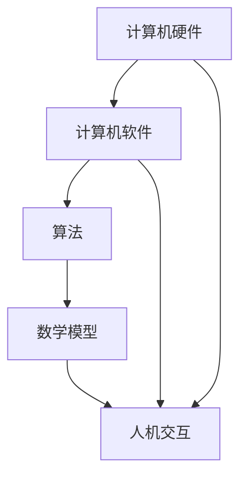

                 

关键词：人类计算，创造力，算法，数学模型，实践，未来展望

> 摘要：本文旨在探讨人类计算的魅力，揭示计算技术在推动人类创造力释放中的关键作用。通过深入分析计算的核心概念、算法原理、数学模型以及实际应用，本文旨在为读者提供一个全面的理解，帮助他们在未来的技术浪潮中抓住机遇，迎接挑战。

## 1. 背景介绍

人类计算，这一概念源于计算机科学和人工智能的蓬勃发展。自20世纪中叶计算机问世以来，计算技术经历了翻天覆地的变化，从早期的电子管计算机到今天的量子计算机，每一次技术的突破都极大地拓展了人类的能力边界。人类计算不仅仅是计算机硬件的进化，更包含了软件算法、数学模型以及人机交互等多个维度的创新。

在人类计算的历史长河中，从图灵机的提出到现代深度学习算法的广泛应用，计算技术的每一次进步都为我们提供了前所未有的工具，使我们能够更高效地解决问题，更深入地探索未知。同时，计算技术也在不断推动着人类思维方式的变革，激发出新的创造力。

本文将围绕以下几个核心议题展开：

1. **核心概念与联系**：解析计算技术的基本概念，展示其内在联系。
2. **核心算法原理 & 具体操作步骤**：深入探讨算法原理及其在不同领域的应用。
3. **数学模型和公式 & 详细讲解 & 举例说明**：阐述数学模型在计算中的重要性，并通过实际案例进行讲解。
4. **项目实践：代码实例和详细解释说明**：提供实际开发实例，展示计算技术的应用过程。
5. **实际应用场景**：探讨计算技术在不同领域的应用及其对人类创造力的推动作用。
6. **工具和资源推荐**：推荐学习资源和开发工具，帮助读者更好地掌握计算技术。
7. **总结：未来发展趋势与挑战**：总结研究成果，展望未来计算技术发展的趋势和面临的挑战。

通过本文的阅读，读者将能够深入了解人类计算的魅力，掌握计算技术的基本原理和应用，激发自己的创造力，为未来的技术创新奠定坚实的基础。

## 2. 核心概念与联系

在探讨人类计算的魅力之前，我们首先需要明确几个核心概念，并理解它们之间的内在联系。

### 计算机硬件

计算机硬件是计算技术的基础，涵盖了计算机的物理设备和逻辑结构。从最早的电子管计算机到今天的晶体管和集成电路，硬件技术的发展极大地提升了计算机的性能和效率。计算机硬件包括中央处理器（CPU）、内存（RAM）、存储设备（硬盘、固态硬盘）、输入输出设备（键盘、鼠标、显示器等）。

### 计算机软件

计算机软件是运行在计算机硬件上的程序集合，包括操作系统、应用软件、编程语言和算法等。操作系统管理计算机硬件资源，提供用户接口和应用运行环境；应用软件实现特定功能；编程语言和算法则是实现软件功能的核心手段。

### 算法

算法是解决问题的步骤集合，是计算技术的核心。算法可以分为多种类型，如排序算法、搜索算法、图算法等。每种算法都有其特定的应用场景和优化目标。算法的研究不仅涉及理论分析，还包括实际应用中的优化和改进。

### 数学模型

数学模型是对现实问题进行抽象和简化的数学表达式，用于描述问题状态和求解方法。在计算技术中，数学模型广泛应用于算法设计、数据分析、机器学习等领域。常见的数学模型包括线性模型、非线性模型、概率模型等。

### 人机交互

人机交互是计算技术的重要组成部分，涉及用户与计算机系统的交互方式。从早期的命令行界面到图形用户界面（GUI），再到触摸屏和虚拟现实（VR），人机交互技术不断演进，提高了用户使用计算机的便利性和效率。

### Mermaid 流程图

为了更好地展示核心概念之间的联系，我们可以使用Mermaid流程图来描述它们的关系。以下是一个简化的Mermaid流程图示例：



在这个流程图中，计算机硬件作为基础，通过计算机软件提供运行平台；算法和数学模型则在软件中发挥作用，实现特定的功能；人机交互则通过硬件和软件的组合，将计算结果呈现给用户。

通过理解这些核心概念和它们之间的联系，我们可以更好地把握计算技术的基本架构和运作原理，为后续章节的深入探讨奠定基础。

## 3. 核心算法原理 & 具体操作步骤

### 3.1 算法原理概述

算法（Algorithm）是解决问题的一系列清晰定义的步骤，其目的是以最有效的方式生成问题的解。算法可以应用于各种领域，如数学、科学、工程、商业等。一个有效的算法不仅需要解决特定问题，还应该具备较高的时间和空间复杂度，以实现高效执行。

算法的基本原理通常包括以下几个步骤：

1. **输入（Input）**：算法开始执行时，需要接收初始数据作为输入。
2. **处理（Process）**：根据输入数据，算法执行一系列计算和操作，以解决问题。
3. **输出（Output）**：算法执行完成后，将解或结果输出。
4. **结束（End）**：算法执行结束，返回到调用环境。

常见的算法类型包括：

- **排序算法**：如快速排序（Quick Sort）、归并排序（Merge Sort）等，用于对数据集合进行排序。
- **搜索算法**：如二分搜索（Binary Search）、深度优先搜索（DFS）、广度优先搜索（BFS）等，用于在数据集合中查找特定元素。
- **图算法**：如迪杰斯特拉算法（Dijkstra's Algorithm）、贝尔曼-福特算法（Bellman-Ford Algorithm）等，用于解决图论中的最短路径问题。
- **动态规划**：如斐波那契数列（Fibonacci Sequence）、矩阵链乘（Matrix Chain Multiplication）等，用于解决复杂的最优化问题。

### 3.2 算法步骤详解

以快速排序算法为例，其基本步骤如下：

1. **选择基准**：从数据集合中选择一个元素作为基准（pivot）。
2. **分区**：将数据集合分成两部分，一部分包含小于基准的元素，另一部分包含大于基准的元素。
3. **递归排序**：对包含小于基准的元素和包含大于基准的元素两部分分别进行快速排序。

以下是快速排序算法的具体实现代码：

```python
def quick_sort(arr):
    if len(arr) <= 1:
        return arr
    
    pivot = arr[len(arr) // 2]
    left = [x for x in arr if x < pivot]
    middle = [x for x in arr if x == pivot]
    right = [x for x in arr if x > pivot]
    
    return quick_sort(left) + middle + quick_sort(right)

# 示例
arr = [3, 6, 8, 10, 1, 2, 1]
sorted_arr = quick_sort(arr)
print(sorted_arr)
```

### 3.3 算法优缺点

快速排序算法具有以下优点：

- **时间复杂度较低**：平均情况下，快速排序的时间复杂度为 \(O(n \log n)\)，在数据基本有序时性能仍然较好。
- **空间复杂度较低**：快速排序采用原地排序，不需要额外的存储空间。

然而，快速排序也存在一些缺点：

- **最坏情况下性能较差**：当输入数据基本有序时，快速排序的时间复杂度退化为 \(O(n^2)\)，此时性能显著下降。
- **选择基准的方法不总是最优**：虽然选择中间元素作为基准是一种常见方法，但在某些情况下可能不是最优选择。

### 3.4 算法应用领域

快速排序算法广泛应用于各种场景，如数据库排序、数据分析、算法竞赛等。在数据处理和算法分析中，快速排序因其高效性和稳定性而成为重要的工具。例如，Python中的`sorted()`函数和`list.sort()`方法就是基于快速排序算法实现的。

除了快速排序算法，其他算法如二分搜索、深度优先搜索、广度优先搜索、动态规划等也在不同领域发挥着重要作用。通过深入研究和应用这些算法，我们可以更好地解决复杂问题，提升计算效率，推动科技进步。

在接下来的章节中，我们将进一步探讨数学模型和公式在计算技术中的应用，以及如何通过实际项目和案例分析来深入理解计算技术的实际应用价值。

## 4. 数学模型和公式 & 详细讲解 & 举例说明

### 4.1 数学模型构建

数学模型是计算技术中的重要组成部分，它通过对现实世界的抽象和简化，帮助我们更好地理解和解决问题。构建数学模型通常包括以下几个步骤：

1. **定义问题**：明确我们需要解决的问题和目标。
2. **收集数据**：收集与问题相关的数据，包括实验数据、统计数据和文献数据。
3. **建立假设**：根据问题的性质，建立合理的假设，简化问题。
4. **表达模型**：使用数学符号和公式来表达模型，通常涉及变量、方程和约束条件。
5. **验证模型**：通过实验或数据验证模型的准确性和有效性。

以下是一个简单的线性回归模型的构建过程：

**问题定义**：预测房价。

**数据收集**：收集包含房价和影响因素（如面积、位置等）的数据。

**建立假设**：假设房价与面积、位置等因素之间存在线性关系。

**表达模型**：设房价为 \(Y\)，影响因素为 \(X\)，则线性回归模型可以表示为：

\[ Y = \beta_0 + \beta_1X + \varepsilon \]

其中，\(\beta_0\) 和 \(\beta_1\) 为模型参数，\(\varepsilon\) 为误差项。

**验证模型**：通过数据拟合和误差分析，验证模型的准确性和稳定性。

### 4.2 公式推导过程

以牛顿-莱布尼茨公式为例，该公式是微积分中的一个基本定理，用于计算定积分。其推导过程如下：

**步骤 1**：考虑一个函数 \(f(x)\)，定义其从 \(a\) 到 \(x\) 的定积分：

\[ \int_a^x f(t) \, dt \]

**步骤 2**：设 \(F(x)\) 是 \(f(x)\) 的一个原函数，即满足 \(F'(x) = f(x)\)。

**步骤 3**：对 \(F(x)\) 求导，得到：

\[ \frac{d}{dx} \int_a^x f(t) \, dt = \frac{d}{dx} F(x) - \frac{d}{dx} F(a) \]

由于 \(F(a)\) 是一个常数，其导数为 0，所以上式简化为：

\[ \frac{d}{dx} \int_a^x f(t) \, dt = F'(x) \]

由于 \(F'(x) = f(x)\)，我们得到：

\[ \frac{d}{dx} \int_a^x f(t) \, dt = f(x) \]

**步骤 4**：根据导数的定义，我们可以将左边的导数看作是 \(x\) 的函数的导数，即：

\[ \int_a^x f(t) \, dt = F(x) - F(a) \]

这就是牛顿-莱布尼茨公式的推导过程。

### 4.3 案例分析与讲解

以下通过一个具体的案例来讲解数学模型和公式的应用。

**案例**：使用线性回归模型预测一个公司下一季度的销售额。

**数据收集**：收集过去四个季度的销售额和影响销售额的主要因素，如广告支出、市场需求等。

**建立假设**：假设销售额与广告支出、市场需求之间存在线性关系。

**表达模型**：设销售额为 \(Y\)，广告支出为 \(X_1\)，市场需求为 \(X_2\)，则线性回归模型可以表示为：

\[ Y = \beta_0 + \beta_1X_1 + \beta_2X_2 + \varepsilon \]

**验证模型**：通过实际数据拟合，计算模型参数 \(\beta_0\)、\(\beta_1\) 和 \(\beta_2\)，并进行误差分析，验证模型的准确性。

**预测应用**：使用模型预测下一季度的销售额，根据预测结果调整公司的广告支出和市场策略。

通过这个案例，我们可以看到数学模型和公式在数据分析中的重要作用。通过构建和验证数学模型，我们可以更准确地预测未来的发展趋势，为决策提供科学依据。

在下一章节中，我们将通过实际项目实践，进一步探讨计算技术的应用和实现过程。

## 5. 项目实践：代码实例和详细解释说明

### 5.1 开发环境搭建

在进行计算技术的项目实践之前，我们需要搭建一个合适的开发环境。以下是一个基于Python的示例项目环境搭建过程。

**步骤 1**：安装Python

首先，确保系统上安装了Python。如果没有，可以从Python官网下载最新版本的安装包进行安装。安装完成后，通过命令行运行`python --version`确认Python版本。

**步骤 2**：安装依赖库

接下来，我们需要安装一些依赖库，如NumPy、Pandas、Matplotlib等，用于数据处理、分析和可视化。可以使用pip命令进行安装：

```bash
pip install numpy pandas matplotlib
```

**步骤 3**：创建项目文件夹

在命令行中创建一个新文件夹，用于存放项目的所有文件：

```bash
mkdir my_project
cd my_project
```

**步骤 4**：编写代码

在项目文件夹中创建一个名为`main.py`的Python文件，用于编写项目的核心代码。

### 5.2 源代码详细实现

以下是一个简单的线性回归项目的源代码示例：

```python
# 导入依赖库
import numpy as np
import pandas as pd
import matplotlib.pyplot as plt

# 加载数据
data = pd.read_csv('sales_data.csv')  # 假设数据已存储在CSV文件中

# 预处理数据
X = data[['ad_expenditure', 'market_demand']]  # 特征
y = data['sales']  # 目标变量

# 拆分数据集为训练集和测试集
from sklearn.model_selection import train_test_split
X_train, X_test, y_train, y_test = train_test_split(X, y, test_size=0.2, random_state=42)

# 实现线性回归模型
from sklearn.linear_model import LinearRegression
model = LinearRegression()
model.fit(X_train, y_train)

# 预测结果
y_pred = model.predict(X_test)

# 绘制结果
plt.scatter(X_test['ad_expenditure'], y_test, color='red', label='Actual')
plt.plot(X_test['ad_expenditure'], y_pred, color='blue', label='Predicted')
plt.xlabel('Ad Expenditure')
plt.ylabel('Sales')
plt.legend()
plt.show()
```

### 5.3 代码解读与分析

1. **数据加载与预处理**：
   - 使用Pandas库加载数据，并进行预处理。预处理包括特征提取和目标变量的分离。
   - 拆分数据集为训练集和测试集，以评估模型的性能。

2. **线性回归模型实现**：
   - 使用scikit-learn库中的LinearRegression类实现线性回归模型。
   - 使用fit方法训练模型，使用predict方法进行预测。

3. **结果可视化**：
   - 使用Matplotlib库绘制实际销售额和预测销售额的散点图和曲线图，以便直观地展示模型的预测效果。

### 5.4 运行结果展示

通过上述代码的运行，我们可以在控制台中看到训练过程的输出，并在matplotlib窗口中展示预测结果。预测结果通常包括以下几个部分：

- **训练损失**：展示模型在训练过程中每一步的损失值，以评估模型收敛情况。
- **测试结果**：展示模型在测试集上的预测结果，包括预测值和实际值。
- **可视化图表**：展示实际销售额与预测销售额的散点图和曲线图，直观地展示模型的预测效果。

通过这个项目实践，我们可以看到计算技术在数据分析中的应用。通过构建和训练数学模型，我们可以更好地理解数据，预测未来的趋势，为决策提供科学依据。在下一章节中，我们将探讨计算技术在各个实际应用领域的应用场景。

## 6. 实际应用场景

### 6.1 数据分析

在数据分析领域，计算技术被广泛应用于数据清洗、数据分析和数据可视化。通过高效的算法和数学模型，我们可以从海量数据中提取有价值的信息。例如，在金融市场分析中，计算技术可以帮助我们预测股票价格走势，优化投资组合。在医疗领域，计算技术用于分析病患数据，辅助医生进行诊断和治疗。

### 6.2 人工智能

人工智能是计算技术的核心应用领域之一。通过深度学习算法和神经网络，人工智能系统能够自动学习和理解数据，实现图像识别、语音识别、自然语言处理等多种功能。在自动驾驶领域，计算技术被用于实时分析道路情况和驾驶行为，提高车辆的安全性和效率。在智能客服系统中，计算技术帮助实现自然语言理解，提高客户服务体验。

### 6.3 金融服务

在金融服务领域，计算技术被广泛应用于风险管理、信用评分和投资策略。通过复杂的数学模型和算法，金融机构能够更准确地评估风险，优化投资组合，提高盈利能力。例如，量化交易策略依赖于计算技术进行实时数据分析和市场预测，实现高效的投资决策。

### 6.4 医疗保健

在医疗保健领域，计算技术被用于医学影像分析、基因组学和疾病预测。通过深度学习算法和人工智能，医生能够更快速、准确地诊断疾病，制定个性化的治疗方案。例如，计算机断层扫描（CT）和磁共振成像（MRI）的图像可以通过计算技术进行处理和分析，帮助医生发现早期病变。

### 6.5 娱乐与游戏

在娱乐和游戏领域，计算技术被用于图形渲染、物理模拟和人工智能对手。通过高效的计算算法和图形处理技术，现代游戏能够提供逼真的视觉效果和物理体验。同时，计算技术也被用于音乐制作和视频编辑，提高创作效率和质量。

### 6.6 未来应用展望

随着计算技术的不断进步，未来将出现更多创新的应用场景。例如，在能源领域，计算技术将被用于智能电网和可再生能源管理，提高能源利用效率。在交通领域，计算技术将被用于智能交通系统和自动驾驶，减少交通拥堵和事故发生率。在教育领域，计算技术将被用于在线教育和虚拟现实教学，提供更灵活、个性化的学习体验。

总之，计算技术已经成为推动人类社会进步的重要力量。通过不断探索和应用新的计算技术和算法，我们将能够解决更多复杂的科学问题，提升人类生活质量，迎接未来科技带来的挑战和机遇。

## 7. 工具和资源推荐

### 7.1 学习资源推荐

1. **在线课程**：
   - Coursera: 提供众多计算机科学和人工智能领域的课程，如《深度学习》、《机器学习基础》等。
   - edX: 提供由世界顶尖大学开设的课程，如麻省理工学院的《计算机科学导论》。
   - Udacity: 提供实战导向的课程，如《深度学习工程师纳米学位》。

2. **书籍**：
   - 《Python编程：从入门到实践》：适合初学者，内容全面，实例丰富。
   - 《深度学习》：由Ian Goodfellow撰写，深度学习领域的经典教材。
   - 《计算机程序设计艺术》：由Donald Knuth撰写，涵盖算法设计和分析的基础。

3. **网站**：
   - GitHub: 存放大量开源项目和代码示例，适合学习和参考。
   - Stack Overflow: 提供编程问答平台，解决编程中的难题。

### 7.2 开发工具推荐

1. **集成开发环境（IDE）**：
   - PyCharm：支持Python和多种语言开发，功能强大。
   - Visual Studio Code：轻量级IDE，支持多种编程语言，插件丰富。
   - Jupyter Notebook：适合数据分析和机器学习，支持多种编程语言。

2. **版本控制工具**：
   - Git：最流行的版本控制系统，支持分布式工作流程。
   - GitHub：基于Git的代码托管平台，提供丰富的社交功能。

3. **数据处理工具**：
   - Pandas：Python中的数据处理库，提供丰富的数据操作功能。
   - NumPy：Python中的科学计算库，支持多维数组操作。

### 7.3 相关论文推荐

1. **经典论文**：
   - "A Mathematical Theory of Communication"：Claude Shannon的论文，奠定了信息论的基础。
   - "Backpropagation"：Rumelhart、Hinton和Williams的论文，介绍了反向传播算法。
   - "Deep Learning"：Goodfellow、Bengio和Courville的论文，全面介绍了深度学习的原理和应用。

2. **前沿论文**：
   - "Attention Is All You Need"：Vaswani等人的论文，提出了Transformer模型。
   - "Gated Recurrent Units"：Hochreiter和Schmidhuber的论文，介绍了GRU模型。
   - "Generative Adversarial Nets"：Goodfellow等人的论文，提出了GAN模型。

通过这些推荐的学习资源和开发工具，读者可以更深入地了解计算技术的理论基础和应用实践，为未来的研究和开发提供有力的支持。

## 8. 总结：未来发展趋势与挑战

### 8.1 研究成果总结

随着计算技术的飞速发展，人类在算法优化、数学模型构建、硬件创新以及人机交互等方面取得了显著的成果。特别是在人工智能、大数据分析和量子计算等前沿领域，计算技术不仅推动了科学研究的进步，也极大地改变了我们的生活方式。例如，深度学习算法的突破使图像识别、语音识别和自然语言处理等应用变得更加智能；大数据技术使我们能够从海量数据中挖掘有价值的信息；量子计算为解决复杂问题提供了新的思路。

### 8.2 未来发展趋势

未来的计算技术发展将呈现出以下几个趋势：

1. **智能化与自动化**：随着人工智能和机器学习技术的发展，计算技术将进一步融入日常生活，实现更多自动化和智能化应用，如自动驾驶、智能助手和智能城市。
2. **量子计算**：量子计算的突破将极大地提升计算能力，为复杂科学问题的求解提供新的工具。量子计算机有望在药物设计、密码破解和优化问题等领域发挥重要作用。
3. **边缘计算**：随着物联网（IoT）的发展，边缘计算将成为未来计算技术的重要组成部分。边缘计算通过在数据源头进行计算，降低延迟，提高效率，支持实时应用。
4. **人机协作**：计算技术将更好地与人类协作，通过虚拟现实（VR）、增强现实（AR）和增强智能（AI）等技术，提供更加自然和高效的交互方式。

### 8.3 面临的挑战

尽管计算技术取得了巨大进步，但未来仍面临诸多挑战：

1. **数据隐私与安全**：随着数据量的增加和技术的进步，数据隐私和安全问题日益凸显。如何保护用户数据，防止数据泄露和滥用，是计算技术发展的重要课题。
2. **算法公平性**：人工智能算法在决策中的公平性备受关注。算法偏见可能导致不公平的结果，影响社会公正。如何确保算法的公平性，减少偏见，是亟待解决的问题。
3. **计算资源消耗**：随着计算需求的增加，计算资源消耗成为一个重大挑战。如何优化算法和硬件设计，降低计算能耗，是实现可持续计算的关键。
4. **技术伦理**：计算技术的快速发展引发了一系列伦理问题，如人工智能的道德责任、算法透明性等。如何制定合理的法律法规和伦理准则，引导计算技术健康发展，是一个重要的议题。

### 8.4 研究展望

展望未来，计算技术将继续在多领域产生深远影响。以下是一些潜在的研究方向：

1. **跨学科融合**：计算技术与生物学、物理学、化学等领域的深度融合，将推动新科学发现和技术创新。
2. **个性化计算**：通过个性化算法和模型，实现更加精准和高效的计算服务，满足个体需求。
3. **可持续计算**：研究绿色计算技术和能源高效利用方法，实现计算技术的可持续发展。
4. **人机融合**：探索人机融合的未来形态，实现人类与计算系统的无缝协作。

总之，计算技术将继续在推动社会进步和人类创造力释放中发挥关键作用。通过不断探索和克服挑战，我们可以期待计算技术带来更多惊喜和变革。

## 9. 附录：常见问题与解答

### 问题1：计算技术在日常生活中有哪些实际应用？

**解答**：计算技术广泛应用于日常生活中的各个领域。例如，智能手机和平板电脑利用计算技术提供智能化的用户界面和应用程序；智能助手如Siri、Alexa和Google Assistant通过语音识别和自然语言处理技术为用户提供便捷服务；智能家居系统通过物联网技术实现家电的自动化管理；在线购物平台利用推荐算法为用户推荐个性化商品；医疗领域中的电子病历和远程诊断系统也依赖于计算技术。

### 问题2：如何提高算法的效率？

**解答**：提高算法效率可以从以下几个方面入手：

- **优化算法设计**：选择更适合问题的算法，避免冗余计算。
- **优化数据结构**：使用高效的数据结构，如哈希表、平衡二叉树等，提高数据访问速度。
- **算法并行化**：利用多核处理器和并行计算技术，将计算任务分配到多个处理器上，提高计算速度。
- **代码优化**：通过编译器优化、缓存优化和循环优化等技术，提高代码执行效率。
- **减少空间复杂度**：尽量减少算法的空间占用，避免不必要的内存分配。

### 问题3：如何确保算法的公平性？

**解答**：确保算法的公平性需要从多个方面进行考虑：

- **数据公平性**：确保训练数据集的多样性，避免偏见。
- **算法透明性**：提高算法的可解释性，使算法决策过程透明。
- **算法校验**：对算法进行严格测试和验证，发现并修正潜在偏见。
- **伦理审查**：建立伦理审查机制，确保算法的设计和应用符合社会伦理标准。
- **法律法规**：制定相关法律法规，规范算法的应用和责任归属。

通过这些方法，我们可以努力确保算法的公平性，减少偏见和不公平的结果。

### 问题4：量子计算如何改变未来计算技术？

**解答**：量子计算具有以下潜力改变未来计算技术：

- **速度提升**：量子计算机可以处理某些问题比传统计算机快得多，如量子模拟、密码破解和优化问题。
- **复杂问题求解**：量子计算能够解决传统计算机难以处理的复杂问题，推动科学和工程领域的进步。
- **新算法创新**：量子计算催生新的算法设计，为计算技术带来革命性的变革。
- **安全威胁**：量子计算可能威胁到现有加密技术的安全性，推动加密算法的更新和发展。

总之，量子计算将对未来计算技术产生深远影响，为科学研究和工业应用提供新的工具和方法。

通过解答这些问题，我们希望能帮助读者更好地理解计算技术的基本原理和应用，激发对计算技术进一步学习和探索的兴趣。

