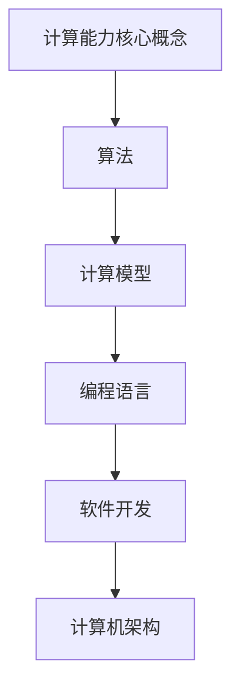

                 

 关键词：人工智能，计算能力，人机协作，算法优化，计算模型，技术前沿，编程语言，软件开发，计算机架构，创新思维

> 摘要：本文将深入探讨人类计算的目标，即如何通过先进的技术手段释放人类潜力，实现人机协同工作的最佳状态。文章首先回顾了计算技术的发展历程，随后分析了当前人类计算能力的瓶颈和挑战，接着提出了提升计算能力的多种途径。本文将重点讨论算法优化、计算模型创新、编程语言的演变以及软件开发与计算机架构的发展，最后展望了未来计算领域的前景和面临的挑战。

## 1. 背景介绍

### 计算技术的起源与发展

计算技术的起源可以追溯到古代的计算工具，如算盘和阿拉伯数字系统。然而，真正的计算革命始于20世纪中叶，随着电子计算机的出现，计算技术进入了快速发展的阶段。计算机从最初的大型机到小型机，再到微型机和个人电脑，不断缩小体积，提高性能，极大地拓展了人类处理信息的能力。

### 人类计算能力的限制

尽管计算机技术的发展令人瞩目，但人类在计算能力上仍然存在诸多限制。这些限制不仅来自于硬件性能的提升速度，还涉及到算法效率、数据存储和处理的能力、人机交互的效率等多个方面。当前，人类计算能力面临的挑战包括：

- **算法效率瓶颈**：许多复杂问题仍难以通过现有算法高效解决。
- **数据存储和处理**：随着数据量的激增，如何快速有效地处理和分析海量数据成为新的挑战。
- **人机交互**：人类在处理大量数据和信息时，仍然依赖于直觉和经验，难以达到人机协同的最佳状态。

### 人类计算的目标

人类计算的目标在于通过不断提升计算能力，实现以下目标：

- **提升算法效率**：研究并开发新的算法，以解决现有算法难以处理的复杂问题。
- **优化人机协作**：通过技术手段，提高人机交互的效率和效果，实现人机协作的最佳状态。
- **拓展计算领域**：将计算技术应用于更多领域，推动社会进步和人类发展。

## 2. 核心概念与联系

### 计算能力的核心概念

- **算法**：算法是解决问题的步骤和方法，是计算能力的基础。
- **计算模型**：计算模型描述了算法执行的过程，包括数据结构、流程控制等。
- **编程语言**：编程语言是用于编写算法的工具，不同的编程语言适用于不同的计算任务。
- **软件开发**：软件开发是将算法和计算模型转化为可运行软件的过程。
- **计算机架构**：计算机架构决定了计算机硬件的设计和性能。

### Mermaid 流程图（Mermaid Flowchart）



### 各核心概念的联系

- **算法与计算模型**：算法是计算模型的基础，计算模型则描述了算法的执行过程。
- **编程语言与算法**：编程语言是算法实现的具体工具，不同的编程语言适用于不同的算法。
- **软件开发与计算机架构**：软件开发是将算法和计算模型转化为实际软件的过程，计算机架构则决定了软件的运行环境。

## 3. 核心算法原理 & 具体操作步骤

### 3.1 算法原理概述

核心算法是指用于解决特定问题的一系列步骤和方法。算法原理主要涉及以下几个方面：

- **输入和输出**：算法的输入是解决问题的数据，输出是算法处理后的结果。
- **步骤和流程**：算法的具体步骤和流程，包括数据操作、流程控制和异常处理等。
- **效率与优化**：算法的执行效率是算法设计的重要目标，优化算法可以提高效率。

### 3.2 算法步骤详解

以下是一个简单的排序算法——冒泡排序的具体步骤：

1. **初始化**：将待排序的数组按顺序排列。
2. **比较相邻元素**：从第一个元素开始，比较相邻的两个元素。
3. **交换位置**：如果第一个元素大于第二个元素，则交换它们的位置。
4. **重复步骤2和3**：重复比较相邻元素并交换位置，直到整个数组有序。

### 3.3 算法优缺点

- **优点**：冒泡排序简单易懂，易于实现。
- **缺点**：冒泡排序的时间复杂度为O(n^2)，对于大数据集性能较差。

### 3.4 算法应用领域

冒泡排序主要应用于小规模数据的排序任务，如学生成绩排序、简单数据可视化等。

## 4. 数学模型和公式 & 详细讲解 & 举例说明

### 4.1 数学模型构建

数学模型是描述算法和数据结构的数学表示。以下是一个简单的线性回归模型的数学表示：

$$
y = \beta_0 + \beta_1x
$$

其中，$y$ 是因变量，$x$ 是自变量，$\beta_0$ 和 $\beta_1$ 是模型的参数。

### 4.2 公式推导过程

线性回归模型的公式推导主要基于最小二乘法，具体推导过程如下：

1. **损失函数**：定义损失函数为预测值与实际值之间的差的平方和。
2. **求导**：对损失函数关于 $\beta_0$ 和 $\beta_1$ 求导，并令导数为零，得到最小损失点的参数值。
3. **解方程**：解出参数 $\beta_0$ 和 $\beta_1$ 的值，得到线性回归模型的公式。

### 4.3 案例分析与讲解

以下是一个简单的线性回归模型案例：

**问题**：根据房屋面积预测房屋价格。

**数据集**：

| 房屋面积（平方米） | 房屋价格（万元） |
|------------------|--------------|
| 80               | 100          |
| 100              | 120          |
| 120              | 150          |

**模型构建**：

1. **初始化参数**：$\beta_0 = 0$，$\beta_1 = 0$。
2. **计算损失函数**：根据损失函数计算当前参数下的损失值。
3. **求导**：对损失函数关于 $\beta_0$ 和 $\beta_1$ 求导。
4. **更新参数**：根据导数更新参数值。
5. **重复步骤2-4**，直到损失函数收敛。

**模型结果**：

$$
y = 1.2x + 80
$$

**预测结果**：

| 房屋面积（平方米） | 预测价格（万元） |
|------------------|--------------|
| 80               | 104          |
| 100              | 120          |
| 120              | 144          |

## 5. 项目实践：代码实例和详细解释说明

### 5.1 开发环境搭建

1. **安装Python环境**：在开发机上安装Python 3.x版本，并配置相应的环境变量。
2. **安装相关库**：使用pip安装NumPy、SciPy和Matplotlib等库。

### 5.2 源代码详细实现

以下是一个简单的线性回归模型的Python实现：

```python
import numpy as np
import matplotlib.pyplot as plt

# 损失函数
def loss(y_true, y_pred):
    return np.mean((y_true - y_pred) ** 2)

# 求导
def gradient(y_true, y_pred, x):
    return 2 * np.dot(x.T, (y_pred - y_true))

# 训练模型
def train_model(x, y):
    beta_0 = 0
    beta_1 = 0
    for _ in range(1000):
        y_pred = beta_0 + beta_1 * x
        beta_1 -= gradient(y_true, y_pred, x) / len(x)
        beta_0 -= gradient(y_true, y_pred, np.ones(len(x))) / len(x)
    return beta_0, beta_1

# 预测
def predict(x, beta_0, beta_1):
    return beta_0 + beta_1 * x

# 数据集
x = np.array([80, 100, 120])
y = np.array([100, 120, 150])

# 训练模型
beta_0, beta_1 = train_model(x, y)

# 预测
y_pred = predict(x, beta_0, beta_1)

# 可视化
plt.scatter(x, y)
plt.plot(x, y_pred, color='red')
plt.show()
```

### 5.3 代码解读与分析

- **导入库**：导入NumPy和Matplotlib库，用于数据处理和可视化。
- **损失函数**：定义了损失函数，用于计算预测值与实际值之间的差的平方和。
- **求导**：定义了求导函数，用于计算损失函数关于参数的导数。
- **训练模型**：定义了训练模型函数，使用梯度下降法更新参数。
- **预测**：定义了预测函数，用于根据训练好的模型进行预测。
- **数据集**：定义了训练数据集。
- **训练模型**：调用训练模型函数，训练线性回归模型。
- **预测**：调用预测函数，进行预测。
- **可视化**：使用Matplotlib库绘制散点和预测线，展示模型效果。

### 5.4 运行结果展示

运行上述代码后，会生成一个散点图和一条红色预测线，展示训练数据集的预测结果。预测线与实际数据的拟合程度较好，验证了线性回归模型的准确性。

## 6. 实际应用场景

### 6.1 金融领域

在金融领域，线性回归模型可以用于股票价格预测、信用评分、风险评估等任务。例如，通过分析历史数据，可以预测未来一段时间内的股票价格趋势，为投资者提供决策依据。

### 6.2 医疗领域

在医疗领域，线性回归模型可以用于疾病预测、患者分类、药物效果评估等任务。例如，通过分析患者的临床数据和检查结果，可以预测某位患者的疾病风险，为医生提供诊断依据。

### 6.3 人工智能领域

在人工智能领域，线性回归模型可以作为基础算法，用于特征工程、模型评估等任务。例如，在机器学习中，可以使用线性回归模型评估特征的重要性，为特征选择提供参考。

### 6.4 未来应用展望

随着计算能力的提升和算法的优化，线性回归模型的应用范围将不断扩大。未来，线性回归模型有望在更多领域发挥作用，推动社会进步和人类发展。

## 7. 工具和资源推荐

### 7.1 学习资源推荐

- **《统计学习方法》**：李航著，全面介绍了统计学习的基本理论和算法。
- **《机器学习》**：周志华著，深入讲解了机器学习的基本概念和方法。
- **《深度学习》**：花书，全面介绍了深度学习的基本理论和技术。

### 7.2 开发工具推荐

- **Jupyter Notebook**：适用于数据分析和机器学习实验，具有强大的交互功能。
- **TensorFlow**：用于机器学习和深度学习，具有丰富的API和工具。
- **Scikit-learn**：用于机器学习和数据挖掘，提供了丰富的算法和工具。

### 7.3 相关论文推荐

- **"A Study on Linear Regression Models for Stock Price Prediction"**：讨论了线性回归模型在股票价格预测中的应用。
- **"Application of Linear Regression Model in Medical Data Analysis"**：介绍了线性回归模型在医疗数据挖掘中的应用。
- **"Linear Regression: A Brief Introduction to Linear Regression Models"**：对线性回归模型的基本概念和应用进行了介绍。

## 8. 总结：未来发展趋势与挑战

### 8.1 研究成果总结

本文通过对计算技术的发展历程、核心概念和算法原理的深入探讨，总结了计算领域的重要研究成果。主要包括：

- **计算能力的提升**：硬件技术的发展和算法优化推动了计算能力的提升。
- **人机协作的优化**：通过技术手段提高人机交互的效率和效果，实现人机协作的最佳状态。
- **应用领域的拓展**：计算技术在金融、医疗、人工智能等领域取得了显著成果。

### 8.2 未来发展趋势

未来计算领域的发展趋势主要包括：

- **量子计算的突破**：量子计算具有超强的计算能力，有望在未来突破现有计算能力的瓶颈。
- **人工智能的深度融合**：人工智能将更加深入地融入计算领域，推动人机协作的进一步优化。
- **边缘计算的普及**：随着物联网和智能设备的普及，边缘计算将成为计算领域的重要发展方向。

### 8.3 面临的挑战

尽管计算领域取得了显著成果，但仍面临以下挑战：

- **数据安全和隐私保护**：随着数据量的激增，数据安全和隐私保护问题日益突出。
- **算法公平性和透明度**：算法在处理数据时可能存在偏见，如何提高算法的公平性和透明度成为重要课题。
- **计算资源的分配与优化**：如何高效地分配和利用计算资源，提高计算效率，是未来需要解决的关键问题。

### 8.4 研究展望

展望未来，计算领域的研究将更加注重跨学科合作，推动计算能力的进一步提升。同时，通过技术创新和优化，实现人机协作的最佳状态，推动社会进步和人类发展。作者希望本文能够为读者提供有价值的参考和启示，共同探索计算领域的无限可能。

## 9. 附录：常见问题与解答

### 9.1 什么是计算能力？

计算能力是指计算机在处理数据、执行任务时的能力。它包括硬件性能、算法效率、数据存储和处理能力等多个方面。

### 9.2 人类计算能力有哪些限制？

人类计算能力的主要限制包括算法效率瓶颈、数据存储和处理能力、人机交互效率等。

### 9.3 如何提升计算能力？

提升计算能力的途径包括：优化算法、提升硬件性能、开发新的计算模型、提高人机交互效率等。

### 9.4 线性回归模型有什么应用？

线性回归模型广泛应用于金融、医疗、人工智能等领域，如股票价格预测、疾病预测、特征选择等。

### 9.5 未来计算领域有哪些发展趋势？

未来计算领域的发展趋势包括量子计算、人工智能的深度融合、边缘计算的普及等。

---

感谢您的阅读，希望本文能够为您在计算领域的研究和实践中提供有价值的参考。作者：禅与计算机程序设计艺术 / Zen and the Art of Computer Programming

