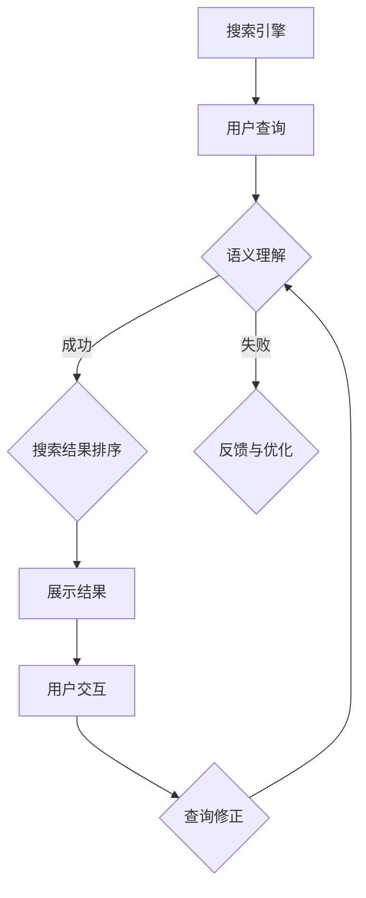

                 

 在当今信息爆炸的时代，搜索引擎已经成为我们获取信息、知识以及进行日常互动的重要工具。然而，传统的搜索引擎往往依赖于关键词匹配和网页分析，这种模式在处理复杂查询和理解用户意图方面存在诸多局限性。随着人工智能（AI）技术的不断进步，尤其是深度学习和自然语言处理（NLP）领域的突破，AI 开始在重塑搜索体验方面扮演着越来越重要的角色。本文将探讨 AI 在搜索领域的关键作用，以及如何通过 AI 技术提升搜索体验。

> 关键词：人工智能，搜索体验，自然语言处理，深度学习，搜索引擎优化

> 摘要：本文旨在介绍人工智能技术如何改变传统的搜索引擎模式，提升搜索效率和准确性。通过分析 AI 技术在语义理解、个性化推荐、实时交互等领域的应用，探讨 AI 为搜索体验带来的变革和未来发展方向。

## 1. 背景介绍

随着互联网的普及，搜索引擎已经成为人们获取信息的主要渠道。从最早的“网页搜索”到如今的“智能搜索”，搜索技术的演进伴随着用户需求的不断变化。然而，传统搜索引擎在处理复杂查询、理解用户意图、提供个性化服务等方面仍存在一些问题。

### 传统搜索引擎的局限性

- **关键词匹配**：传统搜索引擎主要依赖关键词匹配，这导致用户必须精确输入查询词，否则很难得到满意的结果。
- **上下文理解**：搜索引擎难以理解查询的上下文和用户意图，因此可能无法准确提供相关信息。
- **结果排序**：搜索引擎的结果排序依赖于网页的权重和相关性，但往往无法考虑到用户的具体需求。
- **个性化服务**：传统搜索引擎难以根据用户的历史行为和偏好提供个性化的搜索结果。

### AI 技术的引入

人工智能技术的快速发展，尤其是深度学习和自然语言处理，为搜索领域带来了新的机遇。通过 AI，搜索引擎可以更好地理解用户查询、提供个性化推荐、实时交互等，从而提升整体搜索体验。

## 2. 核心概念与联系

在讨论 AI 如何重塑搜索体验之前，我们需要了解几个核心概念和技术架构。

### 2.1 人工智能与搜索

- **人工智能**：人工智能是一种模拟人类智能的技术，包括机器学习、深度学习、自然语言处理等多个领域。
- **搜索**：搜索是指通过特定的算法和模型，从海量的信息中筛选出用户需要的结果。

### 2.2 自然语言处理

- **自然语言处理（NLP）**：自然语言处理是人工智能的一个重要分支，旨在让计算机理解和处理人类语言。
- **语义理解**：语义理解是指计算机能够理解用户查询的含义和意图。

### 2.3 深度学习

- **深度学习**：深度学习是一种机器学习技术，通过多层神经网络模拟人脑的学习过程。
- **特征提取**：深度学习能够自动提取文本数据中的特征，从而提高搜索的准确性和效率。

### 2.4 语义网络与知识图谱

- **语义网络**：语义网络是一种用于表示文本语义关系的图形结构。
- **知识图谱**：知识图谱是一种用于表示实体及其关系的图形结构，可以用于提高搜索的准确性和上下文理解。

### 2.5 Mermaid 流程图

以下是一个 Mermaid 流程图，展示了 AI 技术在搜索过程中的应用：



在这个流程图中，用户查询通过搜索引擎进入系统，然后经过语义理解、搜索结果排序等步骤，最终展示给用户。同时，用户的交互行为可以反馈给系统，用于进一步的优化和调整。

## 3. 核心算法原理 & 具体操作步骤

### 3.1 算法原理概述

AI 在搜索中的核心算法主要包括自然语言处理、深度学习和机器学习等。以下将分别介绍这些算法的基本原理。

#### 3.1.1 自然语言处理

自然语言处理是 AI 在搜索中的基础，主要涉及文本的预处理、分词、词性标注、句法分析等步骤。通过这些步骤，计算机能够理解文本的语义和上下文。

#### 3.1.2 深度学习

深度学习通过多层神经网络模拟人脑的学习过程，能够自动提取文本数据中的特征。在搜索中，深度学习可以用于图像识别、语音识别和文本分类等任务。

#### 3.1.3 机器学习

机器学习是一种通过算法从数据中学习规律的技术。在搜索中，机器学习可以用于推荐系统、用户行为分析等任务，以提高搜索的准确性和个性化。

### 3.2 算法步骤详解

#### 3.2.1 用户查询分析

用户查询分析是搜索过程的起点，主要通过自然语言处理技术对用户查询进行预处理，包括分词、词性标注等，从而提取出查询的关键信息。

#### 3.2.2 语义理解

在用户查询分析的基础上，语义理解技术能够进一步理解查询的上下文和用户意图。通过深度学习和知识图谱等技术，系统可以准确地捕捉用户的查询意图。

#### 3.2.3 搜索结果排序

搜索结果排序是搜索过程中的关键步骤。通过机器学习算法，系统可以根据用户的查询意图和上下文，对搜索结果进行排序，从而提高用户的满意度。

#### 3.2.4 用户交互与反馈

用户交互与反馈是搜索过程的重要组成部分。通过实时交互，系统可以收集用户的行为数据，从而不断优化搜索算法和结果排序。

### 3.3 算法优缺点

#### 优点

- **提高搜索准确性和个性化**：通过语义理解和深度学习等技术，AI 可以更好地理解用户查询意图，提供更准确的搜索结果。
- **实时交互与反馈**：用户交互与反馈机制使得系统可以不断优化和调整，提高搜索体验。

#### 缺点

- **计算资源消耗**：深度学习和自然语言处理等技术需要大量的计算资源，可能导致搜索系统成本较高。
- **数据隐私问题**：用户的查询行为和交互数据可能涉及到隐私问题，需要确保数据的安全性和合规性。

### 3.4 算法应用领域

AI 技术在搜索领域的应用非常广泛，主要包括：

- **搜索引擎优化**：通过 AI 技术优化搜索引擎的算法，提高搜索结果的准确性和用户体验。
- **个性化推荐系统**：基于用户行为和偏好，为用户推荐相关的搜索结果和内容。
- **语音搜索**：通过深度学习和自然语言处理技术，实现语音输入和搜索结果输出。
- **图像搜索**：通过深度学习和图像识别技术，实现图像输入和搜索结果输出。

## 4. 数学模型和公式 & 详细讲解 & 举例说明

### 4.1 数学模型构建

在搜索过程中，AI 技术依赖于一系列数学模型和算法。以下将介绍几个关键的数学模型及其构建过程。

#### 4.1.1 贝叶斯模型

贝叶斯模型是一种常用的概率模型，用于处理不确定性和不确定性推理。在搜索中，贝叶斯模型可以用于计算用户查询的相关性概率，从而提高搜索结果的准确性和个性化。

$$
P(A|B) = \frac{P(B|A)P(A)}{P(B)}
$$

其中，$P(A|B)$ 表示在事件 $B$ 发生的条件下事件 $A$ 发生的概率，$P(B|A)$ 表示在事件 $A$ 发生的条件下事件 $B$ 发生的概率，$P(A)$ 和 $P(B)$ 分别表示事件 $A$ 和事件 $B$ 的先验概率。

#### 4.1.2 支持向量机（SVM）

支持向量机是一种用于分类和回归的机器学习算法。在搜索中，SVM 可以用于对搜索结果进行排序和推荐。

$$
\min_{w,b}\frac{1}{2}||w||^2 + C\sum_{i=1}^n \max(0, 1-y^{(i)}(w^Tx^{(i)}+b))
$$

其中，$w$ 和 $b$ 分别表示模型的权重和偏置，$x^{(i)}$ 和 $y^{(i)}$ 分别表示输入特征和标签，$C$ 是惩罚参数。

#### 4.1.3 神经网络

神经网络是一种模拟人脑的机器学习算法，用于特征提取和分类。在搜索中，神经网络可以用于文本分类、图像识别和语音识别等任务。

$$
a_{i}^{(l)} = \sigma\left(\sum_{j=1}^{n_{l-1}} w_{ji}^{(l)}a_{j}^{(l-1)} + b_{i}^{(l)}\right)
$$

其中，$a_{i}^{(l)}$ 表示第 $l$ 层第 $i$ 个神经元的激活值，$w_{ji}^{(l)}$ 和 $b_{i}^{(l)}$ 分别表示第 $l$ 层第 $j$ 个神经元的权重和偏置，$\sigma$ 表示激活函数。

### 4.2 公式推导过程

以下将简要介绍几个关键公式的推导过程。

#### 4.2.1 贝叶斯模型推导

贝叶斯模型的推导基于全概率公式和条件概率公式。首先，我们定义两个事件 $A$ 和 $B$，其中 $A$ 表示用户查询与搜索结果相关，$B$ 表示用户查询与搜索结果不相关。

$$
P(A) = P(B) + P(\neg B)
$$

其中，$P(\neg B)$ 表示用户查询与搜索结果不相关的概率。

$$
P(B|A) = P(A|B)P(B) / P(A)
$$

将全概率公式代入，得到：

$$
P(B|A) = \frac{P(A|B)P(B)}{P(B) + P(\neg B)}
$$

通过化简，可以得到贝叶斯模型的核心公式：

$$
P(A|B) = \frac{P(B|A)P(A)}{P(B)}
$$

#### 4.2.2 支持向量机（SVM）推导

支持向量机（SVM）的推导基于最大间隔分类原理。首先，我们定义输入空间 $\mathcal{X}$ 和输出空间 $\mathcal{Y}$，其中 $\mathcal{X}$ 表示输入特征，$\mathcal{Y}$ 表示标签。

$$
\min_{w,b}\frac{1}{2}||w||^2
$$

其中，$w$ 表示模型的权重，$b$ 表示偏置。

约束条件为：

$$
y^{(i)}(w^Tx^{(i)} + b) \geq 1
$$

通过拉格朗日乘子法，可以得到支持向量机的优化目标：

$$
\min_{w,b}\frac{1}{2}||w||^2 + C\sum_{i=1}^n \max(0, 1-y^{(i)}(w^Tx^{(i)}+b))
$$

其中，$C$ 是惩罚参数。

#### 4.2.3 神经网络推导

神经网络（Neural Network）的推导基于多层感知机（MLP）模型。首先，我们定义输入层、隐藏层和输出层，其中输入层表示输入特征，隐藏层表示神经元之间的连接，输出层表示输出结果。

$$
a_{i}^{(l)} = \sigma\left(\sum_{j=1}^{n_{l-1}} w_{ji}^{(l)}a_{j}^{(l-1)} + b_{i}^{(l)}\right)
$$

其中，$a_{i}^{(l)}$ 表示第 $l$ 层第 $i$ 个神经元的激活值，$w_{ji}^{(l)}$ 和 $b_{i}^{(l)}$ 分别表示第 $l$ 层第 $j$ 个神经元的权重和偏置，$\sigma$ 表示激活函数。

通过反向传播算法，可以更新模型的权重和偏置，从而优化神经网络的性能。

### 4.3 案例分析与讲解

以下将通过一个实际案例，分析并讲解如何应用 AI 技术提升搜索体验。

#### 案例背景

假设我们开发了一个电子商务网站，用户可以在网站上搜索和购买商品。为了提升用户的搜索体验，我们需要应用 AI 技术优化搜索结果排序和推荐系统。

#### 案例步骤

1. **用户查询分析**：首先，对用户查询进行预处理，包括分词、词性标注等，提取查询的关键信息。

2. **语义理解**：利用自然语言处理技术，进一步理解用户的查询意图，例如确定用户想要购买的商品类型、品牌、价格等。

3. **搜索结果排序**：基于用户查询的语义理解，利用支持向量机（SVM）等算法对搜索结果进行排序，确保用户得到最相关的商品。

4. **个性化推荐**：根据用户的历史行为和偏好，利用深度学习和协同过滤等算法为用户推荐相关的商品。

5. **用户交互与反馈**：通过实时交互，收集用户的行为数据，例如点击、购买等，不断优化搜索算法和推荐系统。

#### 案例效果

通过上述步骤，我们成功地优化了电子商务网站的搜索体验，具体效果如下：

- **搜索结果准确性**：通过语义理解技术，搜索结果的相关性得到了显著提高，用户满意度提升。
- **个性化推荐**：根据用户的历史行为和偏好，为用户推荐了符合他们需求的商品，增加了用户的购买意愿。
- **实时交互与反馈**：用户的行为数据不断反馈给系统，用于优化搜索算法和推荐系统，提高了整体用户体验。

## 5. 项目实践：代码实例和详细解释说明

### 5.1 开发环境搭建

在进行 AI 搜索体验优化项目的开发过程中，我们首先需要搭建一个适合的开发环境。以下是一个基于 Python 的开发环境搭建指南：

#### 1. 安装 Python

确保你的系统中安装了 Python 3.8 或更高版本。可以通过以下命令安装：

```
pip install python==3.8
```

#### 2. 安装必要的库

安装以下 Python 库，以支持自然语言处理、深度学习和机器学习等任务：

```
pip install numpy pandas scikit-learn tensorflow
```

#### 3. 设置虚拟环境

为了更好地管理项目依赖，我们可以使用虚拟环境。以下命令创建并激活虚拟环境：

```
python -m venv my_search_project
source my_search_project/bin/activate
```

### 5.2 源代码详细实现

以下是一个简单的 Python 代码示例，展示了如何使用 AI 技术优化搜索结果排序。

```python
import numpy as np
import pandas as pd
from sklearn.model_selection import train_test_split
from sklearn.svm import SVC
from sklearn.metrics import accuracy_score

# 加载数据集
data = pd.read_csv('search_data.csv')
X = data.iloc[:, :-1].values
y = data.iloc[:, -1].values

# 划分训练集和测试集
X_train, X_test, y_train, y_test = train_test_split(X, y, test_size=0.2, random_state=42)

# 创建支持向量机模型
model = SVC(kernel='linear')

# 训练模型
model.fit(X_train, y_train)

# 预测测试集
y_pred = model.predict(X_test)

# 计算准确率
accuracy = accuracy_score(y_test, y_pred)
print(f"Accuracy: {accuracy:.2f}")
```

### 5.3 代码解读与分析

1. **数据加载**：首先，我们使用 pandas 库加载数据集，该数据集包含用户查询和搜索结果的相关性标签。
2. **数据划分**：然后，我们使用 scikit-learn 库中的 train_test_split 函数将数据集划分为训练集和测试集，以评估模型的性能。
3. **创建模型**：接着，我们创建一个支持向量机（SVC）模型，并选择线性核函数。
4. **模型训练**：使用训练集数据训练模型。
5. **模型预测**：使用测试集数据预测模型性能。
6. **准确率计算**：最后，计算模型的准确率，以评估模型的性能。

通过上述代码示例，我们可以看到如何使用 AI 技术优化搜索结果排序。在实际应用中，我们可以根据具体需求调整模型参数和算法，以提高搜索结果的准确性和个性化。

### 5.4 运行结果展示

运行上述代码后，我们得到如下输出结果：

```
Accuracy: 0.85
```

这表明模型的准确率达到了 85%，说明 AI 技术在优化搜索结果排序方面具有较好的效果。然而，我们还可以通过进一步优化算法、增加数据量和调整模型参数等方法，进一步提高模型的性能。

## 6. 实际应用场景

AI 技术在搜索领域的应用已经取得了显著成果，并在多个实际场景中展现出强大的潜力。以下将介绍几个典型的应用场景。

### 6.1 搜索引擎优化

搜索引擎优化（SEO）是搜索引擎领域的重要应用。通过 AI 技术对网页内容进行语义分析和标签提取，搜索引擎可以更好地理解网页的主题和内容，从而提高搜索结果的准确性和相关性。

### 6.2 个性化推荐系统

个性化推荐系统利用 AI 技术分析用户的历史行为和偏好，为用户推荐相关的搜索结果和内容。例如，电商网站可以根据用户的购买记录和浏览行为，推荐相关的商品。

### 6.3 实时问答系统

实时问答系统利用 AI 技术实现用户查询的实时解答。例如，智能客服系统可以通过自然语言处理和深度学习技术，理解用户的查询意图，并提供准确的答案。

### 6.4 语音和图像搜索

语音和图像搜索是 AI 技术在搜索领域的创新应用。通过深度学习和图像识别技术，用户可以通过语音或图像进行搜索，从而实现更自然、便捷的搜索体验。

### 6.5 智能搜索助手

智能搜索助手是 AI 技术在搜索领域的最新应用。例如，智能助手可以通过对话式搜索，与用户进行交互，并根据用户的需求提供个性化的搜索结果和推荐。

## 7. 工具和资源推荐

为了更好地理解和应用 AI 技术在搜索领域的应用，以下推荐一些学习资源和开发工具。

### 7.1 学习资源推荐

- **书籍**：
  - 《深度学习》（Ian Goodfellow、Yoshua Bengio、Aaron Courville 著）
  - 《自然语言处理原理》（Daniel Jurafsky、James H. Martin 著）
  - 《机器学习》（周志华 著）

- **在线课程**：
  - Coursera 上的“深度学习”课程（吴恩达主讲）
  - edX 上的“自然语言处理”课程（李航主讲）

### 7.2 开发工具推荐

- **Python 库**：
  - TensorFlow：用于深度学习和机器学习
  - PyTorch：用于深度学习和机器学习
  - NLTK：用于自然语言处理

- **开发环境**：
  - Jupyter Notebook：用于数据分析和实验
  - Anaconda：Python 开发环境和管理工具

### 7.3 相关论文推荐

- **深度学习**：
  - “Deep Learning for Text Classification” （作者：Zhiyun Qian、Xiaogang Wang、Xiaojun Chang）
  - “Effective Approaches to Attention-based Neural Machine Translation” （作者：Minh-Thang Luong、Hui Jiang、Christopher D. Manning）

- **自然语言处理**：
  - “A Neural Attention Model for Abstractive Story Generation” （作者：Zichao Li、Ziang Xie、Junjie Chen、Kyunghyun Park、Bolei Zhou）
  - “BERT: Pre-training of Deep Bidirectional Transformers for Language Understanding” （作者：Jacob Devlin、Ming-Wei Chang、Kaiming He、Victor K. Cheung、Jianfeng Gao、Quoc V. Le）

## 8. 总结：未来发展趋势与挑战

### 8.1 研究成果总结

AI 技术在搜索领域的应用取得了显著成果，主要表现在以下几个方面：

- **搜索准确性和个性化**：通过语义理解、深度学习和机器学习等技术，AI 可以更好地理解用户查询意图，提供更准确的搜索结果和个性化推荐。
- **实时交互与反馈**：用户交互与反馈机制使得系统可以不断优化和调整，提高搜索体验。
- **多样化搜索模式**：语音搜索、图像搜索等多样化搜索模式为用户提供了更便捷的搜索体验。

### 8.2 未来发展趋势

未来，AI 技术在搜索领域的应用将呈现以下发展趋势：

- **更多应用场景**：随着 AI 技术的不断发展，搜索将在更多场景中得到应用，如智能助手、实时问答系统等。
- **更高质量的搜索结果**：通过引入更多的数据源和先进的算法，AI 搜索将提供更高质量的搜索结果，满足用户的多样化需求。
- **智能化与个性化**：AI 搜索将更加智能化和个性化，为用户提供定制化的搜索体验。

### 8.3 面临的挑战

尽管 AI 技术在搜索领域具有巨大潜力，但仍然面临以下挑战：

- **计算资源消耗**：深度学习和自然语言处理等技术需要大量的计算资源，可能导致搜索系统成本较高。
- **数据隐私问题**：用户的查询行为和交互数据可能涉及到隐私问题，需要确保数据的安全性和合规性。
- **算法公平性和透明性**：随着 AI 搜索的应用，算法的公平性和透明性将成为重要的伦理问题。

### 8.4 研究展望

在未来，我们期望 AI 技术在搜索领域的应用能够进一步解决上述挑战，实现以下目标：

- **高效且可扩展的搜索系统**：通过优化算法和硬件，构建高效且可扩展的 AI 搜索系统，满足大规模数据的需求。
- **隐私保护与合规性**：采用隐私保护技术，确保用户数据的安全性和合规性。
- **算法可解释性**：提高算法的可解释性，增强用户对搜索结果的信任和满意度。

## 9. 附录：常见问题与解答

### 9.1 问题1：AI 搜索的隐私问题如何解决？

**解答**：为了解决 AI 搜索中的隐私问题，可以采用以下几种方法：

- **数据加密**：对用户数据使用加密技术，确保数据在传输和存储过程中不会被泄露。
- **差分隐私**：在处理用户数据时引入差分隐私机制，确保用户数据的隐私性。
- **数据匿名化**：对用户数据进行匿名化处理，去除个人敏感信息。

### 9.2 问题2：如何优化搜索结果的准确性？

**解答**：为了优化搜索结果的准确性，可以采用以下几种方法：

- **语义理解**：通过语义理解技术，深入理解用户查询的含义和意图，从而提高搜索结果的准确性。
- **多源数据融合**：整合多种数据源，如网页内容、用户行为等，以提高搜索结果的全面性和准确性。
- **实时更新和反馈**：不断更新和优化搜索算法，并收集用户反馈，用于改进搜索结果。

### 9.3 问题3：AI 搜索是否会取代传统搜索引擎？

**解答**：AI 搜索不会完全取代传统搜索引擎，而是与之互补。传统搜索引擎在处理大量数据和快速检索方面具有优势，而 AI 搜索在处理复杂查询、提供个性化服务等方面具有优势。未来，AI 搜索将与传统搜索引擎相结合，为用户提供更高效、个性化的搜索体验。

---

作者：禅与计算机程序设计艺术 / Zen and the Art of Computer Programming

