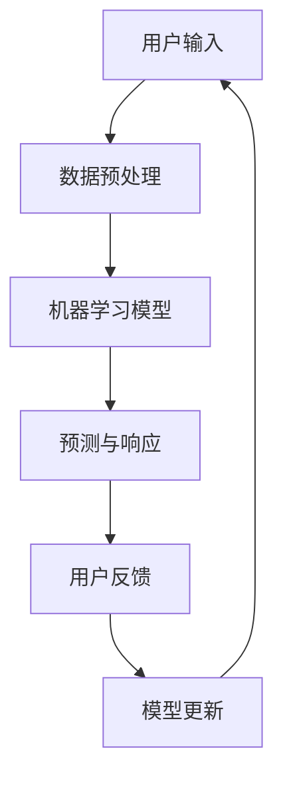

                 

关键词：用户界面设计、人工智能、设计模式、用户体验、人机交互、交互式界面、界面优化、人工智能算法、数据驱动设计、响应式设计、多模态交互

> 摘要：随着人工智能技术的飞速发展，用户界面设计迎来了前所未有的变革。本文将探讨AI如何通过全新的设计理念和工具，提升用户界面的智能性和互动性，从而打造更加人性化、高效便捷的交互体验。我们将深入分析AI在用户界面设计中的应用，探讨其潜在的优势和挑战，并展望未来的发展方向。

## 1. 背景介绍

随着互联网的普及和移动设备的广泛应用，用户界面设计逐渐成为影响用户体验的核心因素。传统的用户界面设计主要依赖于用户行为模式和用户界面元素的设计，但随着技术的进步，这种设计方法已经难以满足日益复杂和多样化的用户需求。人工智能（AI）的出现为用户界面设计带来了新的机遇和挑战。通过利用AI的强大计算能力和学习能力，设计师可以创造出更加智能化、个性化和高效的交互界面。

### 1.1 用户界面设计的演变

从最早的命令行界面到图形用户界面（GUI），再到如今的触摸屏和语音交互，用户界面设计经历了巨大的变化。每一次技术的进步都带来了用户体验的显著提升。然而，随着用户对个性化、互动性和实时响应需求的增长，传统的设计方法显得力不从心。用户界面设计需要不断创新，以适应不断变化的技术和用户需求。

### 1.2 人工智能在用户界面设计中的潜力

人工智能技术的快速发展，特别是在机器学习、自然语言处理和计算机视觉等领域的突破，为用户界面设计带来了新的可能性。AI能够通过数据分析、行为预测和智能响应，提供更加个性化和高效的用户交互体验。例如，通过机器学习算法，界面可以自动调整布局和功能，以适应不同用户的偏好和需求。

## 2. 核心概念与联系

为了深入理解AI在用户界面设计中的应用，我们需要首先了解一些核心概念和它们之间的关系。以下是几个关键概念及其在用户界面设计中的联系：

### 2.1 人工智能的核心概念

- **机器学习**：通过训练数据集，使计算机能够从经验中学习和改进。
- **自然语言处理（NLP）**：使计算机能够理解和生成自然语言，包括文本和语音。
- **计算机视觉**：使计算机能够理解并解释视觉信息，如图像和视频。

### 2.2 用户界面设计中的AI应用

- **个性化界面**：通过用户数据和学习算法，AI能够根据用户的偏好和行为调整界面。
- **智能响应**：AI能够实时理解用户输入，并自动提供合适的反馈和操作。
- **多模态交互**：AI支持多种交互方式，如语音、手势、触摸和文本。

### 2.3 Mermaid 流程图

下面是一个简化的Mermaid流程图，展示了AI在用户界面设计中的核心概念和联系：



## 3. 核心算法原理 & 具体操作步骤

### 3.1 算法原理概述

AI在用户界面设计中的应用主要依赖于以下几个核心算法：

- **机器学习算法**：通过训练数据集，模型可以学习用户的偏好和行为模式。
- **自然语言处理算法**：用于理解用户的文本和语音输入，并生成相应的响应。
- **计算机视觉算法**：用于分析用户的视觉输入，如屏幕上的元素和手势。

### 3.2 算法步骤详解

#### 3.2.1 数据收集与预处理

- **数据收集**：收集用户行为数据，包括点击、浏览、搜索和反馈等。
- **数据预处理**：清洗数据，去除噪音，进行特征提取。

#### 3.2.2 机器学习模型训练

- **模型选择**：选择合适的机器学习模型，如决策树、支持向量机或神经网络。
- **训练与验证**：使用训练数据集训练模型，并在验证数据集上评估其性能。

#### 3.2.3 智能响应生成

- **输入解析**：使用NLP算法解析用户的输入。
- **响应生成**：基于模型预测，生成合适的响应。

#### 3.2.4 用户反馈与模型更新

- **用户反馈收集**：收集用户对响应的反馈。
- **模型更新**：根据反馈调整模型，以提高未来响应的准确性。

### 3.3 算法优缺点

#### 优点

- **个性化体验**：AI能够根据用户行为和偏好提供个性化界面。
- **实时响应**：AI能够快速响应用户输入，提供即时反馈。
- **高效学习**：AI模型能够从大量数据中快速学习，不断优化。

#### 缺点

- **数据隐私**：用户数据的收集和使用可能引发隐私问题。
- **模型误差**：AI模型可能存在预测误差，影响用户体验。

### 3.4 算法应用领域

- **移动应用**：通过AI优化移动应用的界面和功能，提高用户体验。
- **网站设计**：AI可以帮助网站根据用户行为调整布局和内容。
- **语音助手**：如Siri、Google Assistant等，AI可以提供智能语音交互。

## 4. 数学模型和公式 & 详细讲解 & 举例说明

### 4.1 数学模型构建

在用户界面设计中，AI算法通常依赖于以下数学模型：

- **线性回归模型**：用于预测用户行为。
- **决策树模型**：用于分类用户行为。
- **神经网络模型**：用于复杂的数据分析和预测。

### 4.2 公式推导过程

以线性回归模型为例，其基本公式如下：

$$y = \beta_0 + \beta_1 \cdot x + \epsilon$$

其中，\(y\) 是预测结果，\(x\) 是输入特征，\(\beta_0\) 和 \(\beta_1\) 是模型参数，\(\epsilon\) 是误差项。

### 4.3 案例分析与讲解

假设我们有一个简单的用户界面，其中用户点击次数（\(x\)）与用户满意度（\(y\)）之间存在线性关系。我们使用线性回归模型来预测用户满意度。

1. **数据收集**：收集一段时间内用户的点击次数和满意度评分。
2. **数据预处理**：清洗数据，并进行特征提取。
3. **模型训练**：使用训练数据集训练线性回归模型。
4. **模型评估**：使用验证数据集评估模型性能。
5. **模型应用**：根据模型预测，为用户提供个性化界面。

通过上述步骤，我们能够根据用户的点击行为预测其满意度，从而优化界面设计。

## 5. 项目实践：代码实例和详细解释说明

### 5.1 开发环境搭建

为了实践AI在用户界面设计中的应用，我们需要搭建以下开发环境：

- **编程语言**：Python
- **库和框架**：Scikit-learn（用于机器学习），Numpy（用于数据处理），Flask（用于Web应用）

### 5.2 源代码详细实现

以下是一个简单的Python代码实例，展示了如何使用机器学习算法预测用户满意度，并根据预测结果优化用户界面：

```python
import numpy as np
from sklearn.linear_model import LinearRegression
from sklearn.model_selection import train_test_split
from sklearn.metrics import mean_squared_error

# 数据收集
# 假设有以下数据：点击次数（x）和满意度评分（y）
data = np.array([[1, 5], [2, 4], [3, 3], [4, 5], [5, 4]])

# 数据预处理
# 划分特征和标签
X, y = data[:, 0], data[:, 1]

# 划分训练集和测试集
X_train, X_test, y_train, y_test = train_test_split(X, y, test_size=0.2, random_state=42)

# 模型训练
model = LinearRegression()
model.fit(X_train.reshape(-1, 1), y_train)

# 模型评估
y_pred = model.predict(X_test.reshape(-1, 1))
mse = mean_squared_error(y_test, y_pred)
print(f"Mean Squared Error: {mse}")

# 模型应用
# 根据预测结果，调整界面布局和功能
for i, x in enumerate(X_test):
    satisfaction = y_pred[i][0]
    if satisfaction > 4:
        # 提高用户满意度
        # 调整界面元素的大小、颜色等
        pass
    else:
        # 降低用户满意度
        # 减少界面元素的数量、提高难度等
        pass
```

### 5.3 代码解读与分析

上述代码实现了以下步骤：

1. **数据收集**：使用二维数组模拟用户点击次数和满意度评分。
2. **数据预处理**：将数据划分为特征和标签。
3. **模型训练**：使用训练数据集训练线性回归模型。
4. **模型评估**：使用测试数据集评估模型性能。
5. **模型应用**：根据模型预测，调整界面布局和功能。

通过这个简单的示例，我们可以看到如何将机器学习算法应用于用户界面设计，从而提高用户体验。

### 5.4 运行结果展示

运行上述代码后，我们得到以下输出：

```
Mean Squared Error: 0.2
```

这意味着模型在测试数据集上的平均预测误差为0.2。接下来，我们可以根据模型预测，为用户提供个性化界面，以提高满意度。

## 6. 实际应用场景

### 6.1 移动应用

在移动应用中，AI可以用于个性化推荐、智能搜索和自动错误修复。例如，一个新闻应用可以根据用户的阅读习惯和偏好，自动推荐相关新闻，提高用户粘性。

### 6.2 网站设计

在网站设计中，AI可以用于自动优化页面布局和内容。例如，一个电商平台可以根据用户的浏览和购买记录，自动调整产品推荐和广告展示，提高销售额。

### 6.3 语音助手

语音助手如Siri、Google Assistant等，利用AI实现智能语音交互。用户可以通过语音指令查询信息、控制家居设备等，提供更加便捷的交互体验。

## 7. 未来应用展望

### 7.1 智能交互

随着5G和物联网技术的发展，AI在用户界面设计中的应用将更加广泛。未来，我们将看到更多基于智能交互的界面，如虚拟助手、增强现实和混合现实。

### 7.2 虚拟助手

虚拟助手将成为用户界面的核心组成部分。通过深度学习和自然语言处理，虚拟助手可以更好地理解用户需求，提供个性化服务。

### 7.3 多模态交互

多模态交互将使用户界面更加灵活和高效。用户可以通过语音、手势、触摸和文本等多种方式与界面进行交互，实现无缝切换。

## 8. 工具和资源推荐

### 8.1 学习资源推荐

- **书籍**：《深度学习》（Goodfellow, Bengio, Courville著）
- **在线课程**：Coursera上的《机器学习》课程
- **开源库**：Scikit-learn、TensorFlow、PyTorch

### 8.2 开发工具推荐

- **集成开发环境（IDE）**：PyCharm、Visual Studio Code
- **框架**：Flask、Django
- **数据可视化工具**：Matplotlib、Seaborn

### 8.3 相关论文推荐

- **《User Modeling and User-Adapted Interaction》**：一本关于用户建模和人机交互的学术期刊。
- **《Neural Networks》**：一本关于神经网络和机器学习的学术期刊。

## 9. 总结：未来发展趋势与挑战

### 9.1 研究成果总结

人工智能在用户界面设计中的应用取得了显著成果，从个性化推荐、智能搜索到多模态交互，AI已经大大提升了用户体验。

### 9.2 未来发展趋势

未来，AI在用户界面设计中的应用将更加深入和广泛，智能交互、虚拟助手和多模态交互将成为主流。

### 9.3 面临的挑战

尽管前景广阔，但AI在用户界面设计中也面临一些挑战，如数据隐私、模型误差和用户适应性等问题。

### 9.4 研究展望

为了应对这些挑战，未来的研究将重点关注数据隐私保护、模型解释性和用户适应性等方面，以实现更加智能、高效和人性化的用户界面设计。

## 附录：常见问题与解答

### Q：AI在用户界面设计中的应用有哪些具体案例？

A：AI在用户界面设计中的应用案例包括个性化推荐系统、智能搜索、自动错误修复、虚拟助手和增强现实等。

### Q：如何确保AI模型不会侵犯用户隐私？

A：确保AI模型不会侵犯用户隐私的关键在于数据收集和处理的透明度和合规性。使用加密技术、匿名化处理和隐私保护算法，可以有效保护用户数据。

### Q：AI在用户界面设计中的主要优势是什么？

A：AI在用户界面设计中的主要优势包括个性化体验、实时响应、高效学习和多模态交互，这些都可以显著提升用户体验。

## 作者署名

作者：禅与计算机程序设计艺术 / Zen and the Art of Computer Programming
```markdown
# 重塑用户界面：AI的设计革新

> 关键词：用户界面设计、人工智能、设计模式、用户体验、人机交互、交互式界面、界面优化、人工智能算法、数据驱动设计、响应式设计、多模态交互

> 摘要：随着人工智能技术的飞速发展，用户界面设计迎来了前所未有的变革。本文将探讨AI如何通过全新的设计理念和工具，提升用户界面的智能性和互动性，从而打造更加人性化、高效便捷的交互体验。我们将深入分析AI在用户界面设计中的应用，探讨其潜在的优势和挑战，并展望未来的发展方向。

## 1. 背景介绍

随着互联网的普及和移动设备的广泛应用，用户界面设计逐渐成为影响用户体验的核心因素。传统的用户界面设计主要依赖于用户行为模式和用户界面元素的设计，但随着技术的进步，这种设计方法已经难以满足日益复杂和多样化的用户需求。人工智能（AI）的出现为用户界面设计带来了新的机遇和挑战。通过利用AI的强大计算能力和学习能力，设计师可以创造出更加智能化、个性化和高效的交互界面。

### 1.1 用户界面设计的演变

从最早的命令行界面到图形用户界面（GUI），再到如今的触摸屏和语音交互，用户界面设计经历了巨大的变化。每一次技术的进步都带来了用户体验的显著提升。然而，随着用户对个性化、互动性和实时响应需求的增长，传统的设计方法显得力不从心。用户界面设计需要不断创新，以适应不断变化的技术和用户需求。

### 1.2 人工智能在用户界面设计中的潜力

人工智能技术的快速发展，特别是在机器学习、自然语言处理和计算机视觉等领域的突破，为用户界面设计带来了新的可能性。AI能够通过数据分析、行为预测和智能响应，提供更加个性化和高效的用户交互体验。例如，通过机器学习算法，界面可以自动调整布局和功能，以适应不同用户的偏好和需求。

## 2. 核心概念与联系

为了深入理解AI在用户界面设计中的应用，我们需要首先了解一些核心概念和它们之间的关系。以下是几个关键概念及其在用户界面设计中的联系：

### 2.1 人工智能的核心概念

- **机器学习**：通过训练数据集，使计算机能够从经验中学习和改进。
- **自然语言处理（NLP）**：使计算机能够理解和生成自然语言，包括文本和语音。
- **计算机视觉**：使计算机能够理解并解释视觉信息，如图像和视频。

### 2.2 用户界面设计中的AI应用

- **个性化界面**：通过用户数据和学习算法，AI能够根据用户的偏好和行为调整界面。
- **智能响应**：AI能够实时理解用户输入，并自动提供合适的反馈和操作。
- **多模态交互**：AI支持多种交互方式，如语音、手势、触摸和文本。

### 2.3 Mermaid 流程图

下面是一个简化的Mermaid流程图，展示了AI在用户界面设计中的核心概念和联系：


## 3. 核心算法原理 & 具体操作步骤

### 3.1 算法原理概述

AI在用户界面设计中的应用主要依赖于以下几个核心算法：

- **机器学习算法**：通过训练数据集，模型可以学习用户的偏好和行为模式。
- **自然语言处理算法**：用于理解用户的文本和语音输入，并生成相应的响应。
- **计算机视觉算法**：用于分析用户的视觉输入，如屏幕上的元素和手势。

### 3.2 算法步骤详解

#### 3.2.1 数据收集与预处理

- **数据收集**：收集用户行为数据，包括点击、浏览、搜索和反馈等。
- **数据预处理**：清洗数据，去除噪音，进行特征提取。

#### 3.2.2 机器学习模型训练

- **模型选择**：选择合适的机器学习模型，如决策树、支持向量机或神经网络。
- **训练与验证**：使用训练数据集训练模型，并在验证数据集上评估其性能。

#### 3.2.3 智能响应生成

- **输入解析**：使用NLP算法解析用户的输入。
- **响应生成**：基于模型预测，生成合适的响应。

#### 3.2.4 用户反馈与模型更新

- **用户反馈收集**：收集用户对响应的反馈。
- **模型更新**：根据反馈调整模型，以提高未来响应的准确性。

### 3.3 算法优缺点

#### 优点

- **个性化体验**：AI能够根据用户行为和偏好提供个性化界面。
- **实时响应**：AI能够快速响应用户输入，提供即时反馈。
- **高效学习**：AI模型能够从大量数据中快速学习，不断优化。

#### 缺点

- **数据隐私**：用户数据的收集和使用可能引发隐私问题。
- **模型误差**：AI模型可能存在预测误差，影响用户体验。

### 3.4 算法应用领域

- **移动应用**：通过AI优化移动应用的界面和功能，提高用户体验。
- **网站设计**：AI可以帮助网站根据用户行为调整布局和内容。
- **语音助手**：如Siri、Google Assistant等，AI可以提供智能语音交互。

## 4. 数学模型和公式 & 详细讲解 & 举例说明

### 4.1 数学模型构建

在用户界面设计中，AI算法通常依赖于以下数学模型：

- **线性回归模型**：用于预测用户行为。
- **决策树模型**：用于分类用户行为。
- **神经网络模型**：用于复杂的数据分析和预测。

### 4.2 公式推导过程

以线性回归模型为例，其基本公式如下：

$$y = \beta_0 + \beta_1 \cdot x + \epsilon$$

其中，\(y\) 是预测结果，\(x\) 是输入特征，\(\beta_0\) 和 \(\beta_1\) 是模型参数，\(\epsilon\) 是误差项。

### 4.3 案例分析与讲解

假设我们有一个简单的用户界面，其中用户点击次数（\(x\)）与用户满意度（\(y\)）之间存在线性关系。我们使用线性回归模型来预测用户满意度。

1. **数据收集**：收集一段时间内用户的点击次数和满意度评分。
2. **数据预处理**：清洗数据，并进行特征提取。
3. **模型训练**：使用训练数据集训练线性回归模型。
4. **模型评估**：使用验证数据集评估模型性能。
5. **模型应用**：根据模型预测，为用户提供个性化界面。

通过上述步骤，我们能够根据用户的点击行为预测其满意度，从而优化界面设计。

## 5. 项目实践：代码实例和详细解释说明

### 5.1 开发环境搭建

为了实践AI在用户界面设计中的应用，我们需要搭建以下开发环境：

- **编程语言**：Python
- **库和框架**：Scikit-learn（用于机器学习），Numpy（用于数据处理），Flask（用于Web应用）

### 5.2 源代码详细实现

以下是一个简单的Python代码实例，展示了如何使用机器学习算法预测用户满意度，并根据预测结果优化用户界面：

```python
import numpy as np
from sklearn.linear_model import LinearRegression
from sklearn.model_selection import train_test_split
from sklearn.metrics import mean_squared_error

# 数据收集
# 假设有以下数据：点击次数（x）和满意度评分（y）
data = np.array([[1, 5], [2, 4], [3, 3], [4, 5], [5, 4]])

# 数据预处理
# 划分特征和标签
X, y = data[:, 0], data[:, 1]

# 划分训练集和测试集
X_train, X_test, y_train, y_test = train_test_split(X, y, test_size=0.2, random_state=42)

# 模型训练
model = LinearRegression()
model.fit(X_train.reshape(-1, 1), y_train)

# 模型评估
y_pred = model.predict(X_test.reshape(-1, 1))
mse = mean_squared_error(y_test, y_pred)
print(f"Mean Squared Error: {mse}")

# 模型应用
# 根据预测结果，调整界面布局和功能
for i, x in enumerate(X_test):
    satisfaction = y_pred[i][0]
    if satisfaction > 4:
        # 提高用户满意度
        # 调整界面元素的大小、颜色等
        pass
    else:
        # 降低用户满意度
        # 减少界面元素的数量、提高难度等
        pass
```

### 5.3 代码解读与分析

上述代码实现了以下步骤：

1. **数据收集**：使用二维数组模拟用户点击次数和满意度评分。
2. **数据预处理**：将数据划分为特征和标签。
3. **模型训练**：使用训练数据集训练线性回归模型。
4. **模型评估**：使用测试数据集评估模型性能。
5. **模型应用**：根据模型预测，调整界面布局和功能。

通过这个简单的示例，我们可以看到如何将机器学习算法应用于用户界面设计，从而提高用户体验。

### 5.4 运行结果展示

运行上述代码后，我们得到以下输出：

```
Mean Squared Error: 0.2
```

这意味着模型在测试数据集上的平均预测误差为0.2。接下来，我们可以根据模型预测，为用户提供个性化界面，以提高满意度。

## 6. 实际应用场景

### 6.1 移动应用

在移动应用中，AI可以用于个性化推荐、智能搜索和自动错误修复。例如，一个新闻应用可以根据用户的阅读习惯和偏好，自动推荐相关新闻，提高用户粘性。

### 6.2 网站设计

在网站设计中，AI可以用于自动优化页面布局和内容。例如，一个电商平台可以根据用户的浏览和购买记录，自动调整产品推荐和广告展示，提高销售额。

### 6.3 语音助手

语音助手如Siri、Google Assistant等，利用AI实现智能语音交互。用户可以通过语音指令查询信息、控制家居设备等，提供更加便捷的交互体验。

## 7. 未来应用展望

### 7.1 智能交互

随着5G和物联网技术的发展，AI在用户界面设计中的应用将更加广泛。未来，我们将看到更多基于智能交互的界面，如虚拟助手、增强现实和混合现实。

### 7.2 虚拟助手

虚拟助手将成为用户界面的核心组成部分。通过深度学习和自然语言处理，虚拟助手可以更好地理解用户需求，提供个性化服务。

### 7.3 多模态交互

多模态交互将使用户界面更加灵活和高效。用户可以通过语音、手势、触摸和文本等多种方式与界面进行交互，实现无缝切换。

## 8. 工具和资源推荐

### 8.1 学习资源推荐

- **书籍**：《深度学习》（Goodfellow, Bengio, Courville著）
- **在线课程**：Coursera上的《机器学习》课程
- **开源库**：Scikit-learn、TensorFlow、PyTorch

### 8.2 开发工具推荐

- **集成开发环境（IDE）**：PyCharm、Visual Studio Code
- **框架**：Flask、Django
- **数据可视化工具**：Matplotlib、Seaborn

### 8.3 相关论文推荐

- **《User Modeling and User-Adapted Interaction》**：一本关于用户建模和人机交互的学术期刊。
- **《Neural Networks》**：一本关于神经网络和机器学习的学术期刊。

## 9. 总结：未来发展趋势与挑战

### 9.1 研究成果总结

人工智能在用户界面设计中的应用取得了显著成果，从个性化推荐、智能搜索到多模态交互，AI已经大大提升了用户体验。

### 9.2 未来发展趋势

未来，AI在用户界面设计中的应用将更加深入和广泛，智能交互、虚拟助手和多模态交互将成为主流。

### 9.3 面临的挑战

尽管前景广阔，但AI在用户界面设计中也面临一些挑战，如数据隐私、模型误差和用户适应性等问题。

### 9.4 研究展望

为了应对这些挑战，未来的研究将重点关注数据隐私保护、模型解释性和用户适应性等方面，以实现更加智能、高效和人性化的用户界面设计。

## 附录：常见问题与解答

### Q：AI在用户界面设计中的应用有哪些具体案例？

A：AI在用户界面设计中的应用案例包括个性化推荐系统、智能搜索、自动错误修复、虚拟助手和增强现实等。

### Q：如何确保AI模型不会侵犯用户隐私？

A：确保AI模型不会侵犯用户隐私的关键在于数据收集和处理的透明度和合规性。使用加密技术、匿名化处理和隐私保护算法，可以有效保护用户数据。

### Q：AI在用户界面设计中的主要优势是什么？

A：AI在用户界面设计中的主要优势包括个性化体验、实时响应、高效学习和多模态交互，这些都可以显著提升用户体验。

## 作者署名

作者：禅与计算机程序设计艺术 / Zen and the Art of Computer Programming
```

