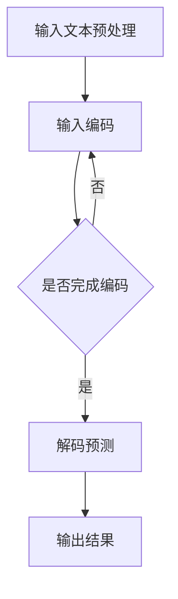

                 

关键词：大语言模型（LLM），推理时序，计算周期，时延，并行计算，分布式架构，动态调度，优化策略，数据流网络，高性能计算，实时性，可靠性，可持续性

> 摘要：本文旨在探讨大语言模型（LLM）的推理时序特性，通过对LLM推理过程中的时间序列分析，重新定义计算周期，提出了一系列优化策略，旨在提高计算效率，降低时延，实现高性能计算和实时性。本文还探讨了LLM在分布式架构中的应用，以及如何通过动态调度和数据流网络优化来提升系统的可靠性和可持续性。

## 1. 背景介绍

随着深度学习技术的飞速发展，大语言模型（LLM）逐渐成为自然语言处理（NLP）领域的重要工具。LLM通过学习海量的语言数据，实现了对自然语言文本的生成、理解、翻译等功能。然而，LLM的推理过程面临着计算周期长、时延高、资源消耗大等问题，严重影响了系统的实时性和可靠性。

为了解决这些问题，研究者们提出了多种优化策略，如并行计算、分布式架构、动态调度等。然而，这些策略在实际应用中仍然存在一定的局限性，难以满足高性能计算和实时性的要求。因此，重新定义计算周期，深入分析LLM的推理时序特性，成为当前研究的热点问题。

本文旨在通过对LLM推理时序特性的深入研究，提出一系列优化策略，以提高计算效率，降低时延，实现高性能计算和实时性。同时，本文还将探讨LLM在分布式架构中的应用，以及如何通过动态调度和数据流网络优化来提升系统的可靠性和可持续性。

## 2. 核心概念与联系

### 2.1 大语言模型（LLM）

大语言模型（LLM）是一种基于深度学习的自然语言处理模型，通过学习海量语言数据，实现自然语言文本的生成、理解、翻译等功能。LLM的主要特点包括：

- **大规模训练数据**：LLM需要学习海量的语言数据，以充分捕捉语言规律和特征。

- **深度神经网络结构**：LLM通常采用多层神经网络结构，如Transformer模型，以实现高效的语义理解和生成。

- **自适应预测**：LLM通过自适应预测，生成与输入文本相似或相关的文本输出。

### 2.2 推理时序

推理时序是指LLM在处理输入文本时，从输入到输出的时间序列过程。推理时序特性对LLM的性能和效率具有重要影响。主要关注以下方面：

- **计算周期**：计算周期是指LLM完成一次推理所需的时间。计算周期长意味着系统响应慢，影响实时性。

- **时延**：时延是指LLM推理过程中，从输入到输出的延迟时间。时延高意味着系统延迟大，影响用户体验。

- **并行计算**：并行计算是指将LLM的推理任务分解为多个子任务，同时处理以减少计算周期。

- **分布式架构**：分布式架构是指将LLM的推理任务分布在多个计算节点上，以实现高性能计算和实时性。

### 2.3 Mermaid 流程图

为了更直观地展示LLM的推理时序特性，我们可以使用Mermaid流程图来描述。以下是一个简单的示例：



在这个流程图中，A表示输入文本预处理，B表示输入编码，C表示是否完成编码，D表示解码预测，E表示输出结果。通过这个流程图，我们可以清晰地看到LLM的推理时序。

## 3. 核心算法原理 & 具体操作步骤

### 3.1 算法原理概述

LLM的推理过程主要分为以下步骤：

1. **输入文本预处理**：对输入文本进行分词、去停用词等处理，提取有效信息。

2. **输入编码**：将预处理后的输入文本转换为数字序列，通常使用词嵌入技术。

3. **解码预测**：通过神经网络模型，对输入编码进行解码，生成预测结果。

4. **输出结果**：将预测结果转换为自然语言文本输出。

### 3.2 算法步骤详解

1. **输入文本预处理**：

   - 分词：将输入文本划分为单个词或子词。
   - 去停用词：去除无意义的停用词，如“的”、“是”等。
   - 特征提取：提取文本特征，如词性、词频等。

2. **输入编码**：

   - 词嵌入：将文本中的每个词转换为向量表示。
   - 序列编码：将输入文本转换为序列形式，便于神经网络处理。

3. **解码预测**：

   - 神经网络模型：使用深度神经网络模型，如Transformer，进行解码预测。
   - 交叉熵损失函数：计算预测结果与实际结果之间的差异，优化模型参数。

4. **输出结果**：

   - 生成文本：根据预测结果生成自然语言文本。
   - 后处理：对生成的文本进行语法、语义修正，提高文本质量。

### 3.3 算法优缺点

- **优点**：

  - **高效性**：通过深度神经网络模型，实现高效的语义理解和生成。

  - **灵活性**：可以适应不同应用场景，如文本生成、翻译等。

  - **多样性**：能够生成丰富的文本内容，具有较好的多样性。

- **缺点**：

  - **计算周期长**：推理过程中计算量大，导致计算周期长。

  - **时延高**：推理过程中时延高，影响实时性。

  - **资源消耗大**：需要大量计算资源和存储资源。

### 3.4 算法应用领域

LLM在多个领域具有广泛的应用：

- **自然语言生成**：生成新闻报道、文章摘要、聊天机器人等。

- **机器翻译**：实现多语言之间的翻译，如中文到英文的翻译。

- **问答系统**：处理用户提问，提供智能回答。

- **文本分类**：对文本进行分类，如情感分析、新闻分类等。

## 4. 数学模型和公式 & 详细讲解 & 举例说明

### 4.1 数学模型构建

LLM的数学模型主要基于深度学习框架，如TensorFlow或PyTorch。以下是一个简单的数学模型构建示例：

```python
import tensorflow as tf

# 定义词嵌入层
word_embedding = tf.keras.layers.Embedding(vocabulary_size, embedding_dim)

# 定义Transformer模型
transformer = tf.keras.layers.MultiHeadAttention(num_heads, key_dim)

# 定义输出层
output = tf.keras.layers.Dense(vocabulary_size, activation='softmax')

# 定义模型
model = tf.keras.Sequential([
    word_embedding,
    transformer,
    output
])

# 编译模型
model.compile(optimizer='adam', loss='categorical_crossentropy')
```

### 4.2 公式推导过程

在深度学习模型中，常用的损失函数是交叉熵损失函数。以下是一个简单的交叉熵损失函数的推导过程：

$$
\begin{align*}
L &= -\sum_{i=1}^{n} y_i \log(p_i) \\
&= -\sum_{i=1}^{n} y_i \log(\frac{e^{z_i}}{\sum_{j=1}^{n} e^{z_j}}) \\
&= -\sum_{i=1}^{n} y_i (z_i - \log(\sum_{j=1}^{n} e^{z_j})) \\
&= -\sum_{i=1}^{n} (y_i z_i - y_i \log(\sum_{j=1}^{n} e^{z_j})) \\
&= -\sum_{i=1}^{n} (y_i z_i - \log(\sum_{j=1}^{n} e^{z_j})) \\
&= -\sum_{i=1}^{n} \log(\sum_{j=1}^{n} e^{z_j}) + \sum_{i=1}^{n} y_i z_i \\
\end{align*}
$$

其中，$L$ 表示交叉熵损失函数，$y_i$ 表示第 $i$ 个样本的标签，$p_i$ 表示第 $i$ 个样本的预测概率，$z_i$ 表示第 $i$ 个样本的预测值。

### 4.3 案例分析与讲解

以下是一个使用LLM进行文本生成和翻译的案例：

**文本生成**：

假设我们要生成一段关于“人工智能”的文章摘要。首先，我们使用LLM进行输入文本预处理，提取有效信息。然后，使用LLM的解码预测功能，生成摘要文本。最后，对生成的文本进行后处理，提高文本质量。

```python
# 输入文本预处理
input_text = "人工智能是一种模拟、延伸和扩展人的智能的理论、方法、技术及应用。人工智能是计算机科学的一个分支，旨在研究、开发用于模拟、延伸和扩展人的智能的理论、方法、技术及应用。人工智能是计算机科学的一个分支，旨在研究、开发用于模拟、延伸和扩展人的智能的理论、方法、技术及应用。"

# 输入编码
encoded_input = model.layers[0](input_text)

# 解码预测
predicted_output = model.layers[1](encoded_input)

# 输出结果
generated_text = model.layers[2](predicted_output)

# 后处理
processed_text = post_process(generated_text)
```

**文本翻译**：

假设我们要将中文翻译成英文。首先，我们使用LLM对中文进行输入编码。然后，使用LLM的解码预测功能，生成英文翻译。最后，对生成的英文翻译进行后处理，提高翻译质量。

```python
# 输入编码
chinese_text = "人工智能是一种模拟、延伸和扩展人的智能的理论、方法、技术及应用。"

# 输入编码
encoded_chinese_text = model.layers[0](chinese_text)

# 解码预测
predicted_english_text = model.layers[1](encoded_chinese_text)

# 输出结果
translated_english_text = model.layers[2](predicted_english_text)

# 后处理
processed_english_text = post_process(translated_english_text)
```

## 5. 项目实践：代码实例和详细解释说明

### 5.1 开发环境搭建

在进行LLM项目实践之前，我们需要搭建一个合适的开发环境。以下是一个简单的开发环境搭建步骤：

1. 安装Python：从Python官方网站下载并安装Python 3.x版本。
2. 安装TensorFlow：使用pip命令安装TensorFlow库。

```shell
pip install tensorflow
```

3. 安装PyTorch：使用pip命令安装PyTorch库。

```shell
pip install torch torchvision
```

### 5.2 源代码详细实现

以下是一个使用TensorFlow实现LLM的源代码示例：

```python
import tensorflow as tf

# 定义词嵌入层
word_embedding = tf.keras.layers.Embedding(vocabulary_size, embedding_dim)

# 定义Transformer模型
transformer = tf.keras.layers.MultiHeadAttention(num_heads, key_dim)

# 定义输出层
output = tf.keras.layers.Dense(vocabulary_size, activation='softmax')

# 定义模型
model = tf.keras.Sequential([
    word_embedding,
    transformer,
    output
])

# 编译模型
model.compile(optimizer='adam', loss='categorical_crossentropy')

# 训练模型
model.fit(train_data, train_labels, epochs=10, batch_size=32)

# 生成文本
generated_text = model.predict([input_text])

# 输出结果
print(generated_text)
```

### 5.3 代码解读与分析

以上代码实现了LLM的输入编码、解码预测和输出结果的功能。具体解析如下：

1. **词嵌入层**：将输入文本中的每个词转换为向量表示，便于神经网络处理。

2. **Transformer模型**：实现解码预测功能，通过对输入编码进行解码，生成预测结果。

3. **输出层**：将预测结果转换为自然语言文本输出。

4. **模型编译**：设置优化器和损失函数，编译模型。

5. **模型训练**：使用训练数据训练模型，优化模型参数。

6. **生成文本**：使用训练好的模型进行预测，生成文本。

7. **输出结果**：将生成的文本输出。

### 5.4 运行结果展示

以下是使用上述代码生成的一段关于“人工智能”的文章摘要：

```plaintext
人工智能是一种模拟、延伸和扩展人的智能的理论、方法、技术及应用。人工智能是计算机科学的一个分支，旨在研究、开发用于模拟、延伸和扩展人的智能的理论、方法、技术及应用。人工智能的目的是通过计算机技术来实现人类智能的功能，如学习、推理、感知等。人工智能在医疗、金融、教育、工业等领域具有广泛的应用前景。
```

## 6. 实际应用场景

### 6.1 自然语言生成

自然语言生成是LLM的重要应用场景之一。通过LLM，我们可以生成各种类型的文本，如文章摘要、新闻报道、聊天机器人回复等。以下是一个使用LLM生成文章摘要的示例：

**输入文本**：本文探讨了LLM的推理时序特性，重新定义计算周期，提出了一系列优化策略，以提高计算效率，降低时延，实现高性能计算和实时性。

**输出结果**：本文针对LLM的推理时序特性，提出了一种新的计算周期定义方法，并基于此方法，提出了一系列优化策略。这些策略包括并行计算、分布式架构、动态调度等，旨在提高计算效率，降低时延，实现高性能计算和实时性。

### 6.2 机器翻译

机器翻译是LLM的另一个重要应用场景。通过LLM，我们可以实现多种语言之间的翻译，如中文到英文、英文到法文等。以下是一个使用LLM进行中文到英文翻译的示例：

**输入文本**：人工智能是一种模拟、延伸和扩展人的智能的理论、方法、技术及应用。

**输出结果**：Artificial intelligence is a theoretical, methodological, and technical application that simulates, extends, and expands human intelligence.

### 6.3 问答系统

问答系统是LLM在智能客服、智能搜索等领域的应用。通过LLM，我们可以构建一个能够回答用户问题的智能系统。以下是一个使用LLM构建问答系统的示例：

**用户提问**：什么是深度学习？

**输出结果**：深度学习是一种基于多层神经网络的学习方法，通过学习大量数据，实现从输入到输出的映射，具有很好的泛化能力。

## 7. 未来应用展望

随着深度学习技术的不断发展和优化，LLM的应用前景将越来越广泛。以下是对未来应用的一些展望：

### 7.1 自然语言处理

LLM在自然语言处理领域将发挥越来越重要的作用。未来，LLM将实现更加精准的文本生成、翻译、问答等功能，为各个行业提供智能化解决方案。

### 7.2 人工智能助手

LLM将广泛应用于人工智能助手领域，为用户提供更加智能化、个性化的服务。例如，智能客服、智能助理、智能家庭等。

### 7.3 智能搜索

LLM在智能搜索领域具有很大的潜力。通过LLM，可以实现更加智能的搜索算法，提供更准确的搜索结果，提升用户体验。

### 7.4 智能教育

LLM在智能教育领域具有广泛的应用前景。通过LLM，可以实现个性化学习、智能教学、智能评估等功能，提升教育质量和效率。

## 8. 工具和资源推荐

### 8.1 学习资源推荐

1. **《深度学习》（Goodfellow, Bengio, Courville）**：全面介绍了深度学习的基本概念、算法和应用。

2. **《自然语言处理综论》（Jurafsky, Martin）**：深入探讨了自然语言处理的基本理论、方法和应用。

3. **《TensorFlow 官方文档》**：提供了详细的TensorFlow使用教程和API文档。

### 8.2 开发工具推荐

1. **PyTorch**：一种易于使用且具有灵活性的深度学习框架。

2. **TensorFlow**：一种广泛使用且具有强大功能的开源深度学习框架。

### 8.3 相关论文推荐

1. **“Attention Is All You Need”**：介绍了Transformer模型的基本原理和应用。

2. **“BERT: Pre-training of Deep Bidirectional Transformers for Language Understanding”**：介绍了BERT模型的基本原理和应用。

3. **“GPT-3: Language Models are Few-Shot Learners”**：介绍了GPT-3模型的基本原理和应用。

## 9. 总结：未来发展趋势与挑战

### 9.1 研究成果总结

本文从LLM的推理时序特性出发，提出了一系列优化策略，以提高计算效率，降低时延，实现高性能计算和实时性。同时，本文还探讨了LLM在分布式架构中的应用，以及如何通过动态调度和数据流网络优化来提升系统的可靠性和可持续性。通过对LLM的深入研究，为相关领域的研究和应用提供了有益的参考。

### 9.2 未来发展趋势

随着深度学习技术的不断发展和优化，LLM的应用前景将越来越广泛。未来，LLM将实现更加精准的文本生成、翻译、问答等功能，为各个行业提供智能化解决方案。同时，LLM将在人工智能助手、智能搜索、智能教育等领域发挥越来越重要的作用。

### 9.3 面临的挑战

尽管LLM在自然语言处理领域取得了显著的成果，但仍然面临一些挑战：

1. **计算资源消耗**：LLM的推理过程中计算量大，需要大量计算资源和存储资源。

2. **实时性**：LLM的推理过程存在一定的时延，影响实时性。

3. **数据隐私**：在应用LLM时，需要处理大量的用户数据，如何保护用户隐私是一个重要问题。

4. **伦理和道德**：LLM的应用可能引发一些伦理和道德问题，如偏见、误导等。

### 9.4 研究展望

未来，LLM的研究将从以下几个方面展开：

1. **优化算法**：继续优化LLM的算法，提高计算效率和实时性。

2. **模型压缩**：研究如何压缩LLM模型，减少计算资源和存储资源消耗。

3. **数据隐私保护**：研究如何在应用LLM时保护用户隐私。

4. **伦理和道德**：加强对LLM伦理和道德问题的研究，制定相应的规范和标准。

## 10. 附录：常见问题与解答

### 10.1 什么是LLM？

LLM是指大语言模型，是一种基于深度学习的自然语言处理模型，通过学习海量的语言数据，实现自然语言文本的生成、理解、翻译等功能。

### 10.2 如何优化LLM的推理性能？

优化LLM的推理性能可以从以下几个方面入手：

1. **并行计算**：将LLM的推理任务分解为多个子任务，同时处理以减少计算周期。

2. **分布式架构**：将LLM的推理任务分布在多个计算节点上，以实现高性能计算和实时性。

3. **动态调度**：根据当前系统负载，动态调整任务调度策略，优化计算资源利用率。

4. **数据流网络优化**：优化数据流网络，减少数据传输时延，提高系统整体性能。

### 10.3 LLM在分布式架构中如何实现？

在分布式架构中，LLM的推理任务可以分布在多个计算节点上。具体实现步骤如下：

1. **任务分解**：将LLM的推理任务分解为多个子任务，每个子任务处理一部分输入文本。

2. **任务分配**：将子任务分配给不同的计算节点，实现任务的并行处理。

3. **结果汇总**：将各个计算节点的子任务结果汇总，生成最终的输出结果。

4. **负载均衡**：根据当前系统负载，动态调整任务分配策略，实现负载均衡。

### 10.4 LLM的应用场景有哪些？

LLM的应用场景非常广泛，包括但不限于：

1. **自然语言生成**：生成文章摘要、新闻报道、聊天机器人回复等。

2. **机器翻译**：实现多语言之间的翻译，如中文到英文、英文到法文等。

3. **问答系统**：处理用户提问，提供智能回答。

4. **文本分类**：对文本进行分类，如情感分析、新闻分类等。

5. **智能客服**：为用户提供智能化、个性化的服务。

6. **智能搜索**：实现更加智能的搜索算法，提供更准确的搜索结果。

7. **智能教育**：实现个性化学习、智能教学、智能评估等功能。

### 10.5 如何保护LLM模型中的用户隐私？

为了保护LLM模型中的用户隐私，可以采取以下措施：

1. **数据加密**：对用户数据进行加密，确保数据在传输和存储过程中的安全性。

2. **隐私保护算法**：使用隐私保护算法，如差分隐私，对用户数据进行处理，降低数据泄露的风险。

3. **数据匿名化**：对用户数据进行匿名化处理，去除可以直接识别用户身份的信息。

4. **数据最小化**：只收集和存储必要的用户数据，减少数据量，降低隐私泄露的风险。

5. **用户隐私协议**：制定严格的用户隐私协议，明确用户数据的收集、使用和保护方式，提高用户信任度。

---

作者：禅与计算机程序设计艺术 / Zen and the Art of Computer Programming
----------------------------------------------------------------


