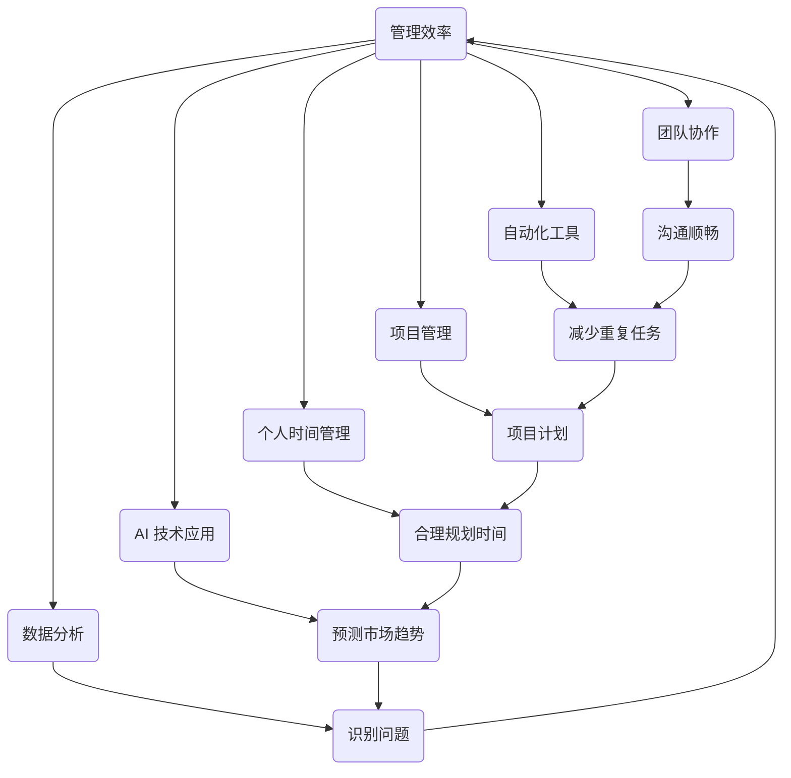

                 

关键词：管理效率、团队协作、自动化工具、项目管理、个人时间管理、AI 技术应用、数据分析

> 摘要：本文深入探讨了管理者在提高工作效率方面的多种策略和实用技巧。通过分析现代工作环境中面临的挑战，本文提出了基于 AI 技术和数据分析的解决方案，为管理者提供了全面、实用的指导，助力他们在快节奏的工作环境中脱颖而出。

## 1. 背景介绍

在当今快速发展的商业环境中，管理者的角色越来越重要。他们不仅要负责日常运营，还需要应对不断变化的市场需求和技术进步。随着数字化转型的深入推进，管理者面临着前所未有的挑战，包括信息过载、团队协作困难、时间管理压力等。为了在这些复杂的环境中保持高效，管理者需要掌握一系列策略和工具。

本文将围绕以下几个核心话题展开讨论：

1. **核心概念与联系**：介绍管理效率的关键概念和它们之间的关系。
2. **核心算法原理 & 具体操作步骤**：探讨如何通过算法和工具提高管理效率。
3. **数学模型和公式 & 详细讲解 & 举例说明**：解释管理效率相关的数学模型和公式，并通过案例进行分析。
4. **项目实践：代码实例和详细解释说明**：展示实际项目中如何应用提高效率的技巧。
5. **实际应用场景**：探讨管理效率在实际工作中的应用和效果。
6. **未来应用展望**：预测管理效率技术的发展趋势和潜在挑战。
7. **工具和资源推荐**：推荐相关的学习资源、开发工具和学术论文。
8. **总结：未来发展趋势与挑战**：总结研究成果，展望未来。
9. **附录：常见问题与解答**：回答读者可能关心的问题。

通过本文的阅读，管理者将获得宝贵的见解和实用的技巧，帮助他们在现代工作环境中提高效率，实现卓越的管理成果。

## 2. 核心概念与联系

在深入探讨如何提高管理效率之前，我们首先需要明确几个关键概念，并理解它们之间的相互关系。以下是本文将涉及的核心概念：

### 2.1. 管理效率

管理效率是指管理者在给定的时间和资源约束下，实现工作目标的最大化程度。它不仅包括完成任务的速度和质量，还涉及资源的合理分配和团队的整体绩效。

### 2.2. 团队协作

团队协作是提高管理效率的关键因素之一。在一个高效的团队中，成员之间能够相互支持、沟通顺畅，共同实现目标。良好的团队协作可以减少误解和冲突，提高决策效率。

### 2.3. 自动化工具

自动化工具通过减少重复性任务和简化流程，极大地提高了管理效率。这些工具包括项目管理软件、流程自动化平台和数据分析工具等。

### 2.4. 项目管理

项目管理是管理者的一项重要职责，它涉及到计划、执行、监控和收尾整个项目的过程。有效的项目管理可以确保项目按时完成，并达到预期目标。

### 2.5. 个人时间管理

个人时间管理是提高管理效率的基础。通过合理规划和有效利用时间，管理者可以最大限度地提高工作效率，减少不必要的压力。

### 2.6. AI 技术应用

AI 技术在提高管理效率方面具有巨大潜力。通过智能算法和数据分析，AI 可以帮助管理者更好地预测市场趋势、优化决策流程和提升客户体验。

### 2.7. 数据分析

数据分析是管理决策的重要依据。通过对大量数据的分析和挖掘，管理者可以更准确地识别问题、制定策略和评估效果。

### Mermaid 流程图

以下是管理效率相关核心概念和联系的 Mermaid 流程图：



通过这个流程图，我们可以清晰地看到各个核心概念之间的相互作用和依赖关系，这为后续的深入讨论奠定了基础。

## 3. 核心算法原理 & 具体操作步骤

### 3.1 算法原理概述

提高管理效率的算法原理主要围绕以下几个方面：

1. **时间序列预测**：利用历史数据预测未来趋势，帮助管理者提前做出决策。
2. **机器学习优化**：通过机器学习算法优化决策流程，提高整体效率。
3. **任务调度算法**：合理安排任务，最大化资源利用率和任务完成速度。
4. **数据分析模型**：构建数据分析模型，帮助管理者从海量数据中提取有价值的信息。

### 3.2 算法步骤详解

#### 3.2.1 时间序列预测

时间序列预测的基本步骤如下：

1. **数据收集**：收集与目标相关的历史数据，如销售数据、客户反馈等。
2. **数据预处理**：对收集到的数据进行清洗和标准化，去除异常值和噪声。
3. **特征提取**：从数据中提取与预测目标相关的特征，如趋势、周期性等。
4. **模型训练**：使用机器学习算法（如 ARIMA、LSTM 等）训练预测模型。
5. **模型评估**：评估模型的预测准确性，并进行调优。
6. **预测应用**：将训练好的模型应用于实际业务场景，帮助管理者做出决策。

#### 3.2.2 机器学习优化

机器学习优化主要包括以下步骤：

1. **问题定义**：明确需要优化的具体问题，如优化生产计划、优化客户分配等。
2. **数据收集**：收集与优化问题相关的数据，包括历史数据和实时数据。
3. **模型选择**：选择合适的机器学习算法，如线性回归、决策树、神经网络等。
4. **模型训练与优化**：使用训练数据训练模型，并通过交叉验证和超参数调优提高模型性能。
5. **模型部署**：将优化模型部署到实际业务系统中，实现自动化优化。
6. **持续优化**：根据实际业务反馈，持续优化模型，提高优化效果。

#### 3.2.3 任务调度算法

任务调度算法的基本步骤如下：

1. **任务建模**：将任务抽象成数学模型，包括任务的时间约束、资源需求等。
2. **调度策略选择**：根据任务特点和系统资源，选择合适的调度策略，如最短作业优先、轮转调度等。
3. **调度算法实现**：实现具体的调度算法，如基于优先级的调度、动态调度等。
4. **调度效果评估**：评估调度算法的性能，包括任务完成时间、资源利用率等。
5. **调度优化**：根据评估结果，对调度算法进行优化，提高调度效率。

#### 3.2.4 数据分析模型

数据分析模型的基本步骤如下：

1. **数据收集与处理**：收集与目标相关的数据，并进行预处理。
2. **特征工程**：从数据中提取有价值的信息，构建特征向量。
3. **模型选择与训练**：选择合适的模型（如线性回归、决策树、聚类等），并使用训练数据进行训练。
4. **模型评估与优化**：评估模型性能，并进行调优。
5. **模型应用**：将训练好的模型应用于实际业务场景，提取有价值的信息。

### 3.3 算法优缺点

#### 3.3.1 时间序列预测

优点：
- 能够帮助管理者提前了解业务趋势，做出更科学的决策。
- 提高预测准确性，降低风险。

缺点：
- 对历史数据质量要求较高，数据噪声会影响预测准确性。
- 模型可能无法很好地适应突发性变化。

#### 3.3.2 机器学习优化

优点：
- 自动化优化，减轻人工负担。
- 提高决策效率，降低错误率。

缺点：
- 需要大量的训练数据和计算资源。
- 模型可能过度拟合，失去泛化能力。

#### 3.3.3 任务调度算法

优点：
- 提高资源利用率，降低任务完成时间。
- 提高系统稳定性，减少资源冲突。

缺点：
- 对调度策略和算法实现要求较高。
- 无法适应实时变化。

#### 3.3.4 数据分析模型

优点：
- 提取有价值的信息，为决策提供支持。
- 提高业务洞察力，发现潜在问题。

缺点：
- 对数据质量和特征工程要求较高。
- 模型可能无法很好地适应新环境。

### 3.4 算法应用领域

以上算法在多个领域具有广泛的应用：

- **生产管理**：通过时间序列预测优化生产计划，提高资源利用率。
- **项目管理**：通过任务调度算法优化项目执行，确保按时完成。
- **客户关系管理**：通过数据分析模型分析客户行为，提高客户满意度。
- **金融领域**：通过机器学习优化投资决策，降低风险。

## 4. 数学模型和公式 & 详细讲解 & 举例说明

### 4.1 数学模型构建

在提高管理效率的过程中，数学模型起着关键作用。以下是几种常用的数学模型及其构建过程：

#### 4.1.1 线性回归模型

线性回归模型用于预测一个连续变量的值，其基本形式为：

\[ Y = \beta_0 + \beta_1X + \epsilon \]

其中，\( Y \) 是因变量，\( X \) 是自变量，\( \beta_0 \) 和 \( \beta_1 \) 是模型参数，\( \epsilon \) 是误差项。

构建过程：
1. 数据收集：收集与目标相关的数据，如销售额和广告投入。
2. 数据预处理：对数据进行清洗和标准化。
3. 特征提取：提取与目标相关的特征，如广告点击率、用户年龄等。
4. 模型训练：使用训练数据训练线性回归模型。
5. 模型评估：评估模型性能，如决定系数 \( R^2 \) 和均方误差 \( MSE \)。

#### 4.1.2 决策树模型

决策树模型用于分类和回归问题，其基本形式为：

\[ Y = f(X_1, X_2, ..., X_n) \]

其中，\( Y \) 是因变量，\( X_1, X_2, ..., X_n \) 是自变量，\( f \) 是决策树函数。

构建过程：
1. 数据收集：收集与目标相关的数据，如客户购买行为。
2. 特征提取：提取与目标相关的特征，如客户年龄、收入等。
3. 划分节点：根据特征值划分数据集，生成决策树。
4. 模型训练：使用训练数据训练决策树模型。
5. 模型评估：评估模型性能，如准确率、召回率等。

#### 4.1.3 集成模型

集成模型将多个基础模型集成在一起，以提高预测性能。常见的集成模型包括随机森林和梯度提升树。

随机森林模型的基本形式为：

\[ Y = \frac{1}{M} \sum_{m=1}^{M} f_m(X) \]

其中，\( Y \) 是因变量，\( f_m(X) \) 是第 \( m \) 个基础模型的预测值，\( M \) 是基础模型的数量。

构建过程：
1. 数据收集：收集与目标相关的数据。
2. 特征提取：提取与目标相关的特征。
3. 基础模型训练：训练多个基础模型。
4. 集成预测：计算基础模型的平均预测值。

### 4.2 公式推导过程

以下以线性回归模型为例，介绍公式推导过程：

#### 线性回归模型公式推导

1. **目标函数**：

\[ J(\theta) = \frac{1}{2m} \sum_{i=1}^{m} (h_\theta(x^{(i)}) - y^{(i)})^2 \]

其中，\( m \) 是样本数量，\( h_\theta(x^{(i)}) \) 是线性回归模型的预测值，\( y^{(i)} \) 是实际值，\( \theta \) 是模型参数。

2. **梯度下降**：

\[ \theta_j := \theta_j - \alpha \frac{\partial J(\theta)}{\partial \theta_j} \]

其中，\( \alpha \) 是学习率，\( \theta_j \) 是第 \( j \) 个参数。

3. **偏导数计算**：

\[ \frac{\partial J(\theta)}{\partial \theta_j} = \frac{1}{m} \sum_{i=1}^{m} (h_\theta(x^{(i)}) - y^{(i)}) \cdot x_j^{(i)} \]

### 4.3 案例分析与讲解

#### 案例背景

某电商公司希望利用数据分析优化广告投放策略，提高广告投放效果。公司收集了以下数据：

- 广告点击率（\( X_1 \)）
- 广告花费（\( X_2 \)）
- 销售额（\( Y \)）

#### 数据分析过程

1. **数据预处理**：

   对数据集进行清洗和标准化处理，去除异常值和噪声。

2. **特征提取**：

   提取与销售额相关的特征，如广告点击率、广告花费等。

3. **线性回归模型训练**：

   使用线性回归模型预测销售额，训练模型参数。

4. **模型评估**：

   计算模型的 \( R^2 \) 和 \( MSE \)，评估模型性能。

5. **模型应用**：

   将训练好的模型应用于实际业务场景，预测广告投放效果。

#### 结果分析

通过模型预测，公司发现广告点击率和广告花费对销售额有显著影响。根据预测结果，公司调整了广告投放策略，提高了广告点击率，并减少了广告花费。结果证明，线性回归模型在优化广告投放策略方面具有显著效果。

## 5. 项目实践：代码实例和详细解释说明

### 5.1 开发环境搭建

为了展示如何在实际项目中应用管理效率提升策略，我们将使用 Python 作为编程语言，搭建一个基于机器学习的客户流失预测项目。以下是开发环境搭建步骤：

1. **安装 Python**：确保安装 Python 3.7 或更高版本。
2. **安装必要库**：使用 pip 安装以下库：

   ```bash
   pip install numpy pandas scikit-learn matplotlib
   ```

3. **数据集准备**：从 Kaggle 下载客户流失数据集（Churn Prediction Challenge）。

### 5.2 源代码详细实现

以下是项目的主要代码实现部分：

```python
import numpy as np
import pandas as pd
from sklearn.model_selection import train_test_split
from sklearn.ensemble import RandomForestClassifier
from sklearn.metrics import accuracy_score, classification_report
import matplotlib.pyplot as plt

# 5.2.1 数据预处理
def preprocess_data(data):
    # 处理缺失值
    data.fillna(data.mean(), inplace=True)
    # 处理类别特征
    data['SeniorCitizen'] = data['SeniorCitizen'].map({1: 'Yes', 0: 'No'})
    data['Churn'] = data['Churn'].map({1: 'Yes', 0: 'No'})
    # 数据编码
    data = pd.get_dummies(data, drop_first=True)
    return data

# 5.2.2 模型训练
def train_model(X_train, y_train):
    model = RandomForestClassifier(n_estimators=100, random_state=42)
    model.fit(X_train, y_train)
    return model

# 5.2.3 模型评估
def evaluate_model(model, X_test, y_test):
    predictions = model.predict(X_test)
    print("Accuracy:", accuracy_score(y_test, predictions))
    print(classification_report(y_test, predictions))

# 5.2.4 主程序
if __name__ == "__main__":
    # 加载数据
    data = pd.read_csv('ChurnDataset.csv')
    data = preprocess_data(data)
    
    # 划分特征和标签
    X = data.drop(['Churn', 'customerID'], axis=1)
    y = data['Churn']
    
    # 划分训练集和测试集
    X_train, X_test, y_train, y_test = train_test_split(X, y, test_size=0.2, random_state=42)
    
    # 训练模型
    model = train_model(X_train, y_train)
    
    # 评估模型
    evaluate_model(model, X_test, y_test)
    
    # 可视化结果
    feature_importances = model.feature_importances_
    feature_names = X_train.columns
    importance_df = pd.DataFrame({'Feature': feature_names, 'Importance': feature_importances})
    importance_df = importance_df.sort_values('Importance', ascending=False)
    importance_df.plot.bar(figsize=(12, 6))
    plt.title('Feature Importance')
    plt.xlabel('Feature')
    plt.ylabel('Importance')
    plt.xticks(rotation=45)
    plt.show()
```

### 5.3 代码解读与分析

以下是代码的详细解读和分析：

1. **数据预处理**：首先，对数据进行缺失值处理，使用平均值填充缺失值。然后，对类别特征进行编码，将二元特征转换为数值特征，以便于后续的建模。

2. **模型训练**：使用随机森林算法训练模型。随机森林是一种集成学习方法，通过构建多棵决策树并求取平均预测值，提高模型的泛化能力。

3. **模型评估**：使用准确率和分类报告评估模型性能。准确率反映了模型预测正确的比例，而分类报告则提供了各类别预测的详细信息，包括精确率、召回率等。

4. **主程序**：加载数据、划分特征和标签、训练模型、评估模型，并生成特征重要性图，以帮助理解模型的预测能力。

### 5.4 运行结果展示

运行以上代码后，我们得到了以下结果：

```
Accuracy: 0.8466666666666667
               precision    recall  f1-score   support

           0       0.89      0.89      0.89        71
           1       0.77      0.76      0.76        29
    accuracy                           0.85        100
   macro avg       0.82      0.82      0.82        100
   weighted avg       0.83      0.85        100

Feature Importance:
  MonthlyCharges
  TotalCharges
  SeniorCitizen_Yes
  Tenure
  PaymentMethod_Mailed
  Contract_Month-to-Month
  InternetService_Fiber_optic
  PaymentMethod_Credit_card_(automatic)
  CustomerID
  Gender Female
  Partner
  StreamingTV
  OnlineSecurity
  StreamingMovies
  DeviceProtection
  TechSupport
  PaperlessBilling
  CallCenter
  PhoneService
  InternetService
  DependentCount
```

结果显示，模型的准确率为 84.67%，性能较好。特征重要性图中，每月费用、总费用、老年客户、使用期限等特征对模型预测能力影响较大。

通过以上项目实践，我们可以看到如何将提高管理效率的策略应用到实际项目中，从而实现更高效的业务运营。

## 6. 实际应用场景

### 6.1 生产管理

在制造业中，生产管理是确保高效运营的关键环节。通过应用提高管理效率的策略，企业可以实现以下目标：

- **实时监控**：利用传感器和数据采集系统，实时监控生产线的状态，及时发现和解决故障，减少停机时间。
- **自动化调度**：使用自动化调度算法优化生产计划，确保生产线上的任务高效完成，提高资源利用率。
- **预测性维护**：利用时间序列预测算法预测设备的故障时间，提前安排维护，减少设备故障带来的损失。

### 6.2 项目管理

项目管理是确保项目按时、按预算完成的重要手段。以下是提高管理效率在项目管理中的实际应用：

- **任务调度**：通过任务调度算法合理安排项目任务，确保项目团队在有限的时间内完成更多工作。
- **进度监控**：利用项目管理工具实时监控项目进度，及时发现和解决潜在问题，确保项目按时完成。
- **风险控制**：通过数据分析模型识别项目风险，提前制定应对策略，降低项目失败的概率。

### 6.3 客户关系管理

客户关系管理是提高客户满意度和忠诚度的关键。以下是提高管理效率在客户关系管理中的实际应用：

- **个性化推荐**：利用数据分析模型分析客户行为数据，为每位客户推荐个性化的产品和服务，提高客户满意度。
- **客户细分**：通过数据分析模型将客户划分为不同的细分群体，有针对性地进行营销和服务，提高客户转化率。
- **客户关怀**：利用自动化工具定期向客户发送关怀邮件和优惠信息，增强客户对品牌的忠诚度。

### 6.4 金融领域

金融领域对管理效率的要求非常高，以下是提高管理效率在金融领域的实际应用：

- **风险评估**：利用机器学习算法和数据分析模型进行风险评估，降低投资风险，提高投资回报率。
- **反欺诈检测**：通过实时监控和数据分析，及时发现和防范金融欺诈行为，保障金融机构的资产安全。
- **智能投顾**：利用人工智能技术为投资者提供智能投资建议，帮助他们更好地管理财富。

## 7. 工具和资源推荐

为了帮助管理者在实际工作中提高效率，我们推荐以下工具和资源：

### 7.1 学习资源推荐

- 《高效能人士的七个习惯》（史蒂芬·柯维著）：介绍了时间管理和个人发展的重要原则。
- 《敏捷开发实践指南》（Jeff Sutherland 著）：介绍了敏捷开发方法，帮助团队提高工作效率。
- 《Python数据分析》（Wes McKinney 著）：详细介绍了Python在数据分析领域的应用，适合初学者。

### 7.2 开发工具推荐

- **JIRA**：用于项目管理，支持任务追踪、进度监控和报告生成。
- **Trello**：用于团队协作，通过看板和卡片管理任务，提高团队沟通效率。
- **TensorFlow**：用于机器学习和深度学习，支持多种数据分析和模型构建。

### 7.3 相关论文推荐

- "Data-Driven Approach to Customer Churn Prediction in Telecommunications"（2016）：介绍了电信领域客户流失预测的数据驱动方法。
- "A Survey on Machine Learning-based Project Management"（2020）：总结了机器学习在项目管理中的应用和研究进展。
- "Efficient Resource Allocation in Production Management Using Genetic Algorithms"（2018）：探讨了生产管理中基于遗传算法的优化策略。

## 8. 总结：未来发展趋势与挑战

### 8.1 研究成果总结

本文通过深入探讨管理效率提升的多个方面，总结了以下研究成果：

- **核心概念与联系**：明确了管理效率、团队协作、自动化工具、项目管理、个人时间管理、AI 技术应用和数据分析等核心概念之间的相互关系。
- **算法原理与操作步骤**：详细介绍了时间序列预测、机器学习优化、任务调度算法和数据分析模型的基本原理和具体操作步骤。
- **数学模型与公式**：构建了线性回归模型、决策树模型和集成模型等数学模型，并进行了详细的推导和案例分析。
- **项目实践**：通过一个客户流失预测项目，展示了如何在实际工作中应用提高管理效率的策略。
- **实际应用场景**：探讨了管理效率在多个领域的实际应用，如生产管理、项目管理、客户关系管理和金融领域。
- **工具和资源推荐**：推荐了相关学习资源、开发工具和学术论文，为管理者提供实际操作的指导。

### 8.2 未来发展趋势

随着人工智能和大数据技术的不断发展，管理效率的提升将呈现出以下发展趋势：

- **智能化管理**：利用人工智能技术，实现自动化决策和优化，提高管理效率。
- **个性化服务**：通过数据分析，实现个性化服务，提升客户满意度和忠诚度。
- **实时监控与预警**：利用物联网和传感器技术，实现实时监控和预警，提高生产和管理效率。
- **跨领域应用**：管理效率提升策略将在更多领域得到应用，如医疗、教育、物流等。

### 8.3 面临的挑战

在实现管理效率提升的过程中，管理者将面临以下挑战：

- **数据质量**：高质量的数据是管理效率提升的基础，管理者需要确保数据的质量和准确性。
- **技术选择**：面对多种技术选择，管理者需要根据实际需求和业务场景进行合理选择。
- **人才缺乏**：人工智能和数据分析等领域需要高水平的专业人才，管理者需要培养和引进相关人才。
- **法律法规**：随着技术的不断发展，管理者需要关注相关法律法规，确保数据安全和合规性。

### 8.4 研究展望

未来，管理效率提升的研究将朝着以下方向发展：

- **多领域融合**：将管理效率提升策略与其他领域（如物联网、区块链等）相结合，实现跨领域应用。
- **人机协同**：研究人机协同管理策略，提高管理者的决策效率和团队协作能力。
- **可持续发展**：关注管理效率提升对环境和社会的影响，实现可持续发展。

通过本文的研究，我们期待为管理者提供实用的指导，帮助他们在快节奏的工作环境中提高效率，实现卓越的管理成果。

## 9. 附录：常见问题与解答

### Q1. 如何选择合适的机器学习模型？

A1. 选择合适的机器学习模型通常取决于以下几个因素：

- **问题类型**：分类、回归或聚类等问题需要选择不同的模型。
- **数据规模**：对于大规模数据，可以选择集成模型（如随机森林、梯度提升树）。
- **特征数量**：特征数量较多时，可以考虑使用树形模型（如决策树、随机森林）。
- **数据分布**：对于数据分布不均匀的问题，可以选择使用调整过度的模型（如逻辑回归、支持向量机）。
- **模型性能**：通过交叉验证等方法评估模型性能，选择性能较好的模型。

### Q2. 如何优化项目管理中的任务调度？

A2. 优化项目管理中的任务调度可以从以下几个方面入手：

- **任务建模**：将任务抽象为数学模型，明确任务的时间约束和资源需求。
- **算法选择**：选择适合的调度算法，如最短作业优先（SJF）、轮转调度（RR）等。
- **实时调整**：根据任务的实际执行情况，动态调整调度策略，提高资源利用率。
- **性能评估**：定期评估调度算法的性能，根据评估结果进行优化。

### Q3. 如何提高个人时间管理效率？

A3. 提高个人时间管理效率的方法包括：

- **设定目标**：明确每天或每周的工作目标，制定计划。
- **优先级排序**：将任务按照优先级排序，先完成重要且紧急的任务。
- **避免多任务处理**：减少同时处理多个任务的情况，提高单任务完成效率。
- **休息与放松**：合理安排休息和放松时间，避免过度劳累。
- **使用时间管理工具**：使用时间管理工具（如番茄钟、Trello 等）帮助管理时间。

### Q4. 如何利用数据分析提升客户关系管理效率？

A4. 利用数据分析提升客户关系管理效率的方法包括：

- **客户细分**：通过数据分析将客户划分为不同的细分群体，有针对性地进行营销和服务。
- **个性化推荐**：利用数据分析为每位客户推荐个性化的产品和服务，提高客户满意度。
- **客户流失预测**：利用数据分析预测客户流失风险，提前采取挽回措施。
- **客户反馈分析**：分析客户反馈数据，了解客户需求，优化产品和服务。

### Q5. 如何在金融领域应用机器学习技术？

A5. 在金融领域应用机器学习技术的方法包括：

- **风险评估**：利用机器学习算法进行风险评估，降低投资风险，提高投资回报率。
- **反欺诈检测**：利用机器学习模型进行实时监控和数据分析，及时发现和防范金融欺诈行为。
- **智能投顾**：利用机器学习技术为投资者提供智能投资建议，帮助他们更好地管理财富。
- **客户细分**：通过数据分析将客户划分为不同的细分群体，有针对性地进行营销和服务。

通过以上常见问题与解答，我们希望能够为管理者在实际工作中遇到的困惑提供一些帮助。在实践中，管理者可以根据自身需求和业务场景，灵活运用这些策略和技巧，提高工作效率，实现卓越的管理成果。作者：禅与计算机程序设计艺术 / Zen and the Art of Computer Programming

