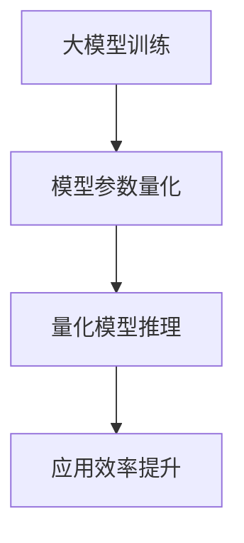

                 

关键词：大模型，量化，应用效率，优化，性能，模型压缩，分布式计算

> 摘要：本文将深入探讨大模型在应用场景中的效率问题，从多个角度分析如何通过量化技术提升大模型的计算性能和应用效率。我们将介绍大模型的核心概念，量化技术的原理与应用，以及具体的优化策略和实现方法。通过一系列案例和实践，本文旨在为读者提供关于大模型应用效率提升的全面指南。

## 1. 背景介绍

近年来，随着深度学习技术的飞速发展，大模型（如GPT-3，BERT等）在自然语言处理、计算机视觉、语音识别等领域取得了显著的成果。然而，大模型的计算复杂性也随之增加，导致在部署和应用中面临巨大的计算和存储压力。为了应对这些挑战，提高大模型的应用效率成为一个重要课题。

大模型的复杂性和计算资源的需求往往导致以下问题：

1. **计算资源瓶颈**：大模型在训练和推理阶段需要大量的计算资源，特别是对于分布式训练和推理。
2. **存储容量限制**：模型参数和数据的存储需求随着模型规模的增大而迅速增加。
3. **延迟和响应时间**：在实际应用中，延迟和响应时间是用户感知的重要指标。
4. **能耗消耗**：大规模计算产生的能耗对社会和环境产生了负面影响。

为了解决上述问题，量化技术作为一种有效的优化手段，近年来受到了广泛关注。量化技术通过减少模型参数的精度，降低模型的计算复杂度和存储需求，从而提升模型的计算性能和应用效率。

## 2. 核心概念与联系

### 2.1 大模型概述

大模型是指具有数十亿至数万亿参数的深度学习模型。这类模型通过大规模数据训练，能够捕捉到数据中的复杂模式和关联。然而，随着模型规模的增大，其计算复杂度和存储需求也呈指数级增长。

### 2.2 量化技术原理

量化技术通过对模型中的权重和激活值进行精度降低，从而减少模型的计算和存储需求。量化通常分为整数量化和浮点量化两种：

1. **整数量化**：将模型的浮点权重转换为整数权重，通常采用线性量化方法。
2. **浮点量化**：保留部分浮点精度，将模型的权重和激活值映射到较低的浮点数域。

### 2.3 大模型与量化技术的联系

量化技术能够有效提升大模型的计算性能和应用效率，主要表现在：

1. **降低计算复杂度**：量化技术减少了模型中操作数的数量，从而降低了计算复杂度。
2. **减少存储需求**：量化后的模型参数存储需求显著降低，使得模型能够部署在资源受限的环境中。
3. **优化计算资源利用率**：量化后的模型可以在较低的精度下运行，从而减少对高性能计算资源的需求。

### 2.4 Mermaid 流程图



## 3. 核心算法原理 & 具体操作步骤

### 3.1 算法原理概述

量化算法的核心思想是通过将模型参数从高精度浮点数转换为低精度数值，从而降低模型的计算复杂度和存储需求。量化过程通常包括以下几个步骤：

1. **特征提取**：从原始数据中提取特征向量。
2. **量化策略选择**：选择合适的量化策略，如线性量化、直方图量化等。
3. **量化操作**：将浮点参数转换为整数或较低精度的浮点参数。
4. **量化模型训练**：使用量化后的模型进行训练，优化模型性能。
5. **量化模型推理**：使用量化后的模型进行推理，提高应用效率。

### 3.2 算法步骤详解

#### 3.2.1 特征提取

特征提取是量化算法的第一步，其目的是从原始数据中提取关键信息。常用的特征提取方法包括：

1. **统计分析**：计算数据的均值、方差等统计指标。
2. **直方图统计**：绘制数据分布的直方图，以识别数据中的关键模式。
3. **降维技术**：使用PCA、t-SNE等降维技术，提取数据的主要特征。

#### 3.2.2 量化策略选择

量化策略的选择对于量化效果至关重要。常见的量化策略包括：

1. **线性量化**：将浮点数映射到整数范围内，通常采用分段线性函数实现。
2. **直方图量化**：根据数据分布的直方图，将数据划分为多个区间，每个区间对应一个整数。
3. **量化范围选择**：选择合适的量化范围，以平衡精度和计算效率。

#### 3.2.3 量化操作

量化操作是量化算法的核心步骤，其目的是将浮点参数转换为低精度数值。量化操作通常包括以下步骤：

1. **量化参数**：将每个浮点参数转换为整数或较低精度的浮点参数。
2. **量化激活值**：将模型的激活值进行量化，以减少计算复杂度。
3. **量化权重**：将模型的权重进行量化，以减少存储需求。

#### 3.2.4 量化模型训练

量化模型训练的目的是优化量化后的模型性能。量化模型训练通常包括以下步骤：

1. **损失函数优化**：优化量化模型的目标函数，以降低模型的损失。
2. **参数调整**：调整量化模型的参数，以提高模型精度。
3. **迭代训练**：通过迭代训练，逐步优化量化模型的性能。

#### 3.2.5 量化模型推理

量化模型推理是量化算法的最终目标，其目的是提高模型的应用效率。量化模型推理通常包括以下步骤：

1. **量化模型部署**：将量化后的模型部署到目标设备上。
2. **推理计算**：使用量化后的模型进行推理计算，以减少计算复杂度。
3. **结果输出**：输出量化模型推理的结果，以供进一步使用。

### 3.3 算法优缺点

#### 3.3.1 优点

1. **降低计算复杂度**：量化技术通过减少模型参数的精度，降低了模型的计算复杂度。
2. **减少存储需求**：量化后的模型参数存储需求显著降低，使得模型能够部署在资源受限的环境中。
3. **提高计算性能**：量化技术能够提高模型的计算性能，从而减少推理延迟。
4. **节省能源消耗**：量化技术能够降低模型的能耗消耗，对社会和环境产生积极影响。

#### 3.3.2 缺点

1. **精度损失**：量化技术不可避免地导致精度损失，可能影响模型的性能。
2. **量化策略选择**：量化策略的选择对于量化效果至关重要，需要根据具体应用场景进行选择。
3. **模型训练成本**：量化模型训练需要额外的计算资源和时间，可能增加模型的训练成本。

### 3.4 算法应用领域

量化技术广泛应用于以下领域：

1. **自然语言处理**：量化技术能够提高自然语言处理模型的计算性能和应用效率。
2. **计算机视觉**：量化技术能够优化计算机视觉模型的计算复杂度和存储需求。
3. **语音识别**：量化技术能够降低语音识别模型的计算复杂度，提高模型的实时性。
4. **推荐系统**：量化技术能够提高推荐系统的计算性能，从而提高推荐效果。

## 4. 数学模型和公式 & 详细讲解 & 举例说明

### 4.1 数学模型构建

量化技术中的数学模型主要涉及以下几个关键概念：

1. **量化因子（Quantization Factor）**：量化因子决定了模型参数的量化精度，通常表示为\(q\)。
2. **量化范围（Quantization Range）**：量化范围定义了模型参数的量化区间，通常表示为\([a, b]\)。

量化模型的基本数学公式如下：

\[ x_{\text{quantized}} = \text{round}\left(\frac{x_{\text{original}}}{q}\right) \times q \]

其中，\(x_{\text{original}}\) 是原始浮点值，\(x_{\text{quantized}}\) 是量化后的整数值，\(\text{round}\) 函数用于四舍五入。

### 4.2 公式推导过程

为了更好地理解量化公式的推导过程，我们以下面的浮点数为例进行说明：

假设一个浮点数 \(x_{\text{original}} = 123.456\)，量化因子 \(q = 0.01\)。

首先，计算量化后的整数部分：

\[ \frac{x_{\text{original}}}{q} = \frac{123.456}{0.01} = 12345.6 \]

然后，将结果四舍五入到最接近的整数：

\[ \text{round}(12345.6) = 12346 \]

最后，将结果乘以量化因子：

\[ x_{\text{quantized}} = 12346 \times 0.01 = 123.46 \]

因此，量化后的值为 \(x_{\text{quantized}} = 123.46\)。

### 4.3 案例分析与讲解

#### 4.3.1 案例背景

假设我们有一个大规模的自然语言处理模型，其中包含1000万个参数。原始模型使用32位浮点数进行存储和计算，每个参数占用4字节。现在，我们希望通过量化技术将模型的存储和计算需求降低50%。

#### 4.3.2 量化策略选择

为了降低存储和计算需求，我们选择整数量化策略。量化因子 \(q\) 选择为1，即每个参数的精度降低到整数位。

#### 4.3.3 量化操作

1. **量化参数**：将每个浮点参数转换为整数。例如，一个参数 \(x_{\text{original}} = 0.75\)，量化后为 \(x_{\text{quantized}} = 1\)。
2. **量化激活值**：将模型的激活值进行量化。例如，一个激活值 \(x_{\text{original}} = 0.75\)，量化后为 \(x_{\text{quantized}} = 1\)。
3. **量化权重**：将模型的权重进行量化。例如，一个权重 \(x_{\text{original}} = 0.75\)，量化后为 \(x_{\text{quantized}} = 1\)。

#### 4.3.4 量化模型训练

使用量化后的模型进行训练，通过优化量化模型的目标函数，逐步提高模型的精度和性能。

#### 4.3.5 量化模型推理

使用量化后的模型进行推理计算，以减少计算复杂度和存储需求。

## 5. 项目实践：代码实例和详细解释说明

### 5.1 开发环境搭建

1. 安装Python环境：确保安装了Python 3.8及以上版本。
2. 安装TensorFlow 2.6：在终端执行以下命令：

```shell
pip install tensorflow==2.6
```

3. 安装其他依赖包：执行以下命令安装其他依赖包：

```shell
pip install numpy matplotlib
```

### 5.2 源代码详细实现

以下是量化模型的基本实现代码：

```python
import tensorflow as tf
import numpy as np
import matplotlib.pyplot as plt

# 设置随机种子，保证结果可复现
tf.random.set_seed(42)

# 创建一个简单的全连接神经网络
model = tf.keras.Sequential([
    tf.keras.layers.Dense(100, activation='relu', input_shape=(10,)),
    tf.keras.layers.Dense(1)
])

# 编译模型
model.compile(optimizer='adam', loss='mse')

# 生成训练数据
x_train = np.random.rand(1000, 10)
y_train = np.random.rand(1000, 1)

# 训练模型
model.fit(x_train, y_train, epochs=5, batch_size=32)

# 量化模型
quantize_model = model.quantize_weights(1)  # 整数量化

# 量化后的模型推理
quantize_predictions = quantize_model.predict(x_train)

# 比较量化前后的预测结果
predictions = model.predict(x_train)
print("量化前后的预测差异：", np.abs(predictions - quantize_predictions).mean())

# 可视化量化前后的参数分布
original_weights = model.layers[0].get_weights()[0]
quantized_weights = quantize_model.layers[0].get_weights()[0]

plt.figure(figsize=(10, 5))
plt.subplot(1, 2, 1)
plt.hist(original_weights.flatten(), bins=50, alpha=0.5, label='原始权重')
plt.xlabel('权重值')
plt.ylabel('频数')
plt.legend()

plt.subplot(1, 2, 2)
plt.hist(quantized_weights.flatten(), bins=50, alpha=0.5, label='量化权重')
plt.xlabel('权重值')
plt.ylabel('频数')
plt.legend()

plt.show()
```

### 5.3 代码解读与分析

1. **导入库**：导入TensorFlow、NumPy和Matplotlib库，用于实现量化模型和可视化结果。
2. **设置随机种子**：设置随机种子，保证结果可复现。
3. **创建模型**：创建一个简单的全连接神经网络模型，包含两个隐藏层。
4. **编译模型**：编译模型，选择Adam优化器和MSE损失函数。
5. **生成训练数据**：生成随机训练数据。
6. **训练模型**：使用训练数据进行模型训练。
7. **量化模型**：调用`quantize_weights`方法对模型进行整数量化。
8. **量化模型推理**：使用量化后的模型进行推理，获取预测结果。
9. **比较量化前后的预测结果**：计算量化前后的预测差异，以评估量化对模型性能的影响。
10. **可视化量化前后的参数分布**：使用直方图可视化量化前后的模型参数分布，以直观地展示量化效果。

## 6. 实际应用场景

量化技术在多个实际应用场景中发挥了重要作用：

1. **移动设备**：量化技术使得大模型能够部署在移动设备上，提高移动设备的智能性能。
2. **嵌入式系统**：量化技术能够优化嵌入式系统的资源利用率，提高嵌入式系统的实时性和可靠性。
3. **云计算**：量化技术能够降低云计算中心的数据传输和存储成本，提高云计算服务的性价比。
4. **边缘计算**：量化技术能够降低边缘设备的计算和存储需求，提高边缘计算的应用效率。

### 6.4 未来应用展望

随着量化技术的不断发展，未来将出现以下趋势：

1. **量化算法的优化**：随着硬件技术的进步，量化算法将不断优化，提高量化模型的精度和性能。
2. **跨领域的量化应用**：量化技术将在更多领域得到应用，如自动驾驶、智能医疗、金融科技等。
3. **高效能量化硬件**：高效能量化硬件的发展将推动量化技术的普及和应用。
4. **混合精度量化**：混合精度量化（如FP16+BF16）将进一步提高量化模型的计算性能。

## 7. 工具和资源推荐

### 7.1 学习资源推荐

1. **书籍**：
   - 《量化深度学习》
   - 《深度学习量化技术》
2. **在线课程**：
   - Coursera上的《量化深度学习》课程
   - Udacity的《深度学习量化技术》课程
3. **论文**：
   - “Quantization and Training of Neural Networks for Efficient Integer-Arithmetic-Only Inference”
   - “Quantized Neural Networks: Training and Evaluation”

### 7.2 开发工具推荐

1. **TensorFlow Quantization**：TensorFlow提供了量化API，方便开发者实现量化模型。
2. **ONNX Runtime**：ONNX Runtime支持量化模型，提供高效的推理性能。
3. **Intel Math Kernel Library (MKL-DNN)**：MKL-DNN提供了量化支持，适用于Intel处理器。

### 7.3 相关论文推荐

1. “Quantization and Training of Neural Networks for Efficient Integer-Arithmetic-Only Inference”
2. “Quantized Neural Networks: Training and Evaluation”
3. “Quantization for Deep Learning: A Survey”
4. “Quantized Neural Network Inference: Strategies and Optimization”

## 8. 总结：未来发展趋势与挑战

### 8.1 研究成果总结

近年来，量化技术在大模型中的应用取得了显著成果，包括：

1. **计算性能提升**：量化技术有效降低了大模型的计算复杂度和存储需求。
2. **应用效率提高**：量化技术提高了大模型在实际应用中的响应速度和实时性。
3. **资源利用率优化**：量化技术提高了计算资源和存储资源的利用率。

### 8.2 未来发展趋势

未来，量化技术将朝着以下方向发展：

1. **算法优化**：随着硬件技术的进步，量化算法将不断优化，提高量化模型的精度和性能。
2. **跨领域应用**：量化技术将在更多领域得到应用，如自动驾驶、智能医疗、金融科技等。
3. **混合精度量化**：混合精度量化（如FP16+BF16）将进一步提高量化模型的计算性能。
4. **硬件支持**：高效能量化硬件的发展将推动量化技术的普及和应用。

### 8.3 面临的挑战

量化技术在实际应用中面临以下挑战：

1. **精度损失**：量化技术不可避免地导致精度损失，可能影响模型的性能。
2. **量化策略选择**：量化策略的选择对于量化效果至关重要，需要根据具体应用场景进行选择。
3. **模型训练成本**：量化模型训练需要额外的计算资源和时间，可能增加模型的训练成本。

### 8.4 研究展望

未来，量化技术的研究将重点关注以下几个方面：

1. **高效量化算法**：研究更高效、更精确的量化算法，以满足不同应用场景的需求。
2. **跨领域量化应用**：探索量化技术在跨领域应用中的潜力，如自动驾驶、智能医疗等。
3. **量化硬件发展**：研究高效能量化硬件，提高量化模型的计算性能。
4. **开放标准和生态**：推动开放标准和生态的建设，促进量化技术的普及和应用。

## 9. 附录：常见问题与解答

### 9.1 问题1：量化技术是否会降低模型的性能？

解答：量化技术确实可能导致模型的性能下降，因为量化过程中会引入精度损失。然而，通过选择合适的量化策略和优化方法，可以在保持模型性能的同时，显著降低计算复杂度和存储需求。

### 9.2 问题2：如何选择合适的量化策略？

解答：选择合适的量化策略需要考虑多个因素，包括应用场景、模型类型、数据分布等。通常，线性量化、直方图量化等策略具有较好的性能表现。在实际应用中，可以结合实验结果，选择最合适的量化策略。

### 9.3 问题3：量化技术是否适用于所有类型的模型？

解答：量化技术主要适用于具有高参数数量的模型，如深度神经网络。对于一些具有特殊结构的模型，如树形模型，量化技术的适用性可能较低。因此，在应用量化技术时，需要根据模型类型进行选择。

### 9.4 问题4：量化后的模型如何进行训练？

解答：量化后的模型可以通过常规的深度学习训练方法进行训练。在实际训练过程中，可以采用渐进式量化策略，逐步降低模型参数的精度，以避免因精度损失导致的模型性能下降。

### 9.5 问题5：量化技术是否适用于所有硬件平台？

解答：量化技术主要依赖于硬件平台的支持，如整数运算能力和内存管理。一些硬件平台，如ARM处理器，提供了对量化技术的支持。然而，对于一些不具备量化支持的平台，可能需要通过软件模拟来实现量化功能。

作者：禅与计算机程序设计艺术 / Zen and the Art of Computer Programming

