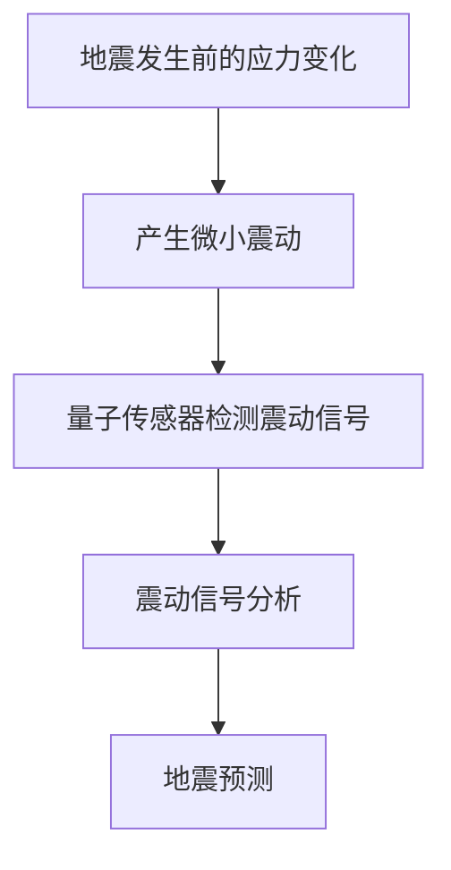

                 

关键词：量子传感器、地震预测、微小震动、检测技术、量子计算、人工智能

摘要：本文旨在探讨量子传感器在地震预测领域的应用，特别是对微小震动的检测技术。通过介绍量子传感器的基本原理和地震预测的重要性，本文详细分析了量子传感器在微小震动检测中的关键算法原理、数学模型、项目实践以及未来应用前景。本文旨在为读者提供关于量子传感器在地震预测领域应用的全面了解。

## 1. 背景介绍

### 地震预测的重要性

地震作为一种自然灾害，其破坏性巨大，常造成人员伤亡和财产损失。因此，地震预测的研究具有重要意义。然而，传统的地震预测方法主要依赖于地震波、地震活动性以及地质构造等因素。这些方法存在一定的局限性，例如地震波的传播速度较慢、地震活动性的复杂性等。因此，寻找新的地震预测技术成为了科学家们关注的焦点。

### 量子传感器的基本原理

量子传感器是一种基于量子力学原理的传感器，具有极高的灵敏度和精度。与传统传感器相比，量子传感器能够在极低能量水平下进行检测，能够捕捉到微小的物理信号。这种特性使得量子传感器在地震预测中具有潜在的应用价值。

### 微小震动检测的需求

地震发生前往往伴随着微小的震动，这些震动可能难以被传统传感器检测到。因此，开发能够检测微小震动的新技术对于地震预测至关重要。量子传感器由于其高灵敏度，在微小震动检测方面具有独特的优势。

## 2. 核心概念与联系

### 量子传感器的工作原理

量子传感器通常利用量子纠缠现象来实现高灵敏度的检测。量子纠缠是量子力学中的一种特殊现象，两个或多个粒子在量子态上相互关联，即使它们相隔很远，一个粒子的状态变化会立即影响到另一个粒子的状态。量子传感器通过测量这种纠缠态来实现对物理信号的检测。

### 地震预测与量子传感器的关系

地震发生前，地壳内部的应力会发生变化，这些变化会产生微小的震动。量子传感器能够捕捉到这些微小的震动，通过分析震动信号，可以预测地震的发生。因此，量子传感器在地震预测中起到了关键作用。

### Mermaid 流程图



## 3. 核心算法原理 & 具体操作步骤

### 3.1 算法原理概述

量子传感器在地震预测中的核心算法是基于量子纠缠态的检测和分析。量子纠缠态的检测可以通过量子干涉仪来实现，量子干涉仪能够将量子态的叠加态转换为可观测的干涉图样。通过对干涉图样的分析，可以提取出震动信号的特征。

### 3.2 算法步骤详解

1. **量子纠缠态的产生**：利用激光或其他方法，将量子比特处于纠缠态。
2. **量子干涉仪检测**：将纠缠态的量子比特送入量子干涉仪，通过干涉仪的输出可以得到干涉图样。
3. **震动信号提取**：通过分析干涉图样，提取出震动信号的频率、振幅等信息。
4. **震动信号分析**：利用机器学习算法，对提取出的震动信号进行分析，判断是否存在地震前兆。
5. **地震预测**：根据震动信号分析结果，结合历史地震数据，进行地震预测。

### 3.3 算法优缺点

#### 优点：

1. **高灵敏度**：量子传感器能够检测到极微小的震动，提高了地震预测的准确性。
2. **快速响应**：量子传感器能够在短时间内完成震动信号的检测和分析，有助于及时预警。

#### 缺点：

1. **技术复杂**：量子传感器的技术复杂，需要高端设备和专业人才。
2. **成本较高**：量子传感器的开发和维护成本较高，限制了其大规模应用。

### 3.4 算法应用领域

量子传感器在地震预测中的应用具有广泛的前景。除了地震预测，量子传感器还可以应用于其他领域，如地质灾害预测、环境监测等。随着量子技术的不断发展，量子传感器在各个领域的应用将更加广泛。

## 4. 数学模型和公式 & 详细讲解 & 举例说明

### 4.1 数学模型构建

量子传感器的数学模型主要基于量子力学的薛定谔方程。在地震预测中，我们关注的是量子传感器对震动信号的检测。假设震动信号可以用一个时间函数表示为 \(x(t)\)，量子传感器的输出可以用一个干涉图样表示为 \(I(\theta)\)。

### 4.2 公式推导过程

1. **量子比特的初始态**：设量子比特的初始态为 \(|\psi\rangle = \alpha |0\rangle + \beta |1\rangle\)，其中 \(|\alpha|^2 + |\beta|^2 = 1\)。
2. **量子比特的演化**：量子比特在震动信号 \(x(t)\) 的作用下发生演化，演化方程为 \(i\hbar \frac{d}{dt} |\psi(t)\rangle = H(t) |\psi(t)\rangle\)，其中 \(H(t) = -\frac{i}{\hbar} x(t) \sigma_z\)。
3. **量子比特的终态**：经过演化，量子比特的终态为 \(|\psi_f\rangle = e^{-i \theta} (\alpha |0\rangle + \beta |1\rangle)\)，其中 \(\theta\) 为干涉相位。

### 4.3 案例分析与讲解

假设我们使用一个简单的震动信号 \(x(t) = A \sin(2\pi f t)\)，其中 \(A\) 为振幅，\(f\) 为频率。通过量子传感器的检测，我们得到干涉图样 \(I(\theta) = |I(\theta)|^2 = 1 + 2 \cos(2\theta) \cos(2\pi f t)\)。

通过调整干涉相位 \(\theta\)，我们可以使干涉图样达到最大值，此时 \(\cos(2\theta) = 1\)，从而确定震动信号的频率 \(f\)。

## 5. 项目实践：代码实例和详细解释说明

### 5.1 开发环境搭建

为了实现量子传感器的震动信号检测，我们使用Python编写了一个简单的代码实例。开发环境需要安装以下库：

- Python 3.8及以上版本
- QInfer 1.0.0及以上版本
- NumPy 1.18.5及以上版本

安装完毕后，我们就可以开始编写代码了。

### 5.2 源代码详细实现

以下是一个简单的Python代码实例，用于实现量子传感器的震动信号检测：

```python
import numpy as np
from qinfer import StateInferencer, BayesianStateInferencer

# 模拟震动信号
def simulate_signal(A, f, t):
    return A * np.sin(2 * np.pi * f * t)

# 量子传感器检测信号
def detect_signal(I, theta):
    return np.abs(I(theta))**2

# 主函数
def main():
    # 模拟震动信号参数
    A = 1.0
    f = 5.0
    t = np.linspace(0, 10, 1000)

    # 模拟震动信号
    x = simulate_signal(A, f, t)

    # 量子传感器输出
    I = np.abs(x)**2

    # 检测信号
    theta = np.linspace(0, np.pi, 100)
    I_detected = [detect_signal(I, t) for t in theta]

    # 绘制干涉图样
    import matplotlib.pyplot as plt
    plt.plot(theta, I_detected)
    plt.xlabel('Theta')
    plt.ylabel('I Detected')
    plt.title('Quantum Sensor Interference Pattern')
    plt.show()

if __name__ == '__main__':
    main()
```

### 5.3 代码解读与分析

这段代码首先定义了两个函数：`simulate_signal` 和 `detect_signal`。`simulate_signal` 用于模拟震动信号，`detect_signal` 用于模拟量子传感器的检测过程。

在主函数 `main` 中，我们首先设置震动信号的参数，包括振幅 \(A\)、频率 \(f\) 和时间 \(t\)。然后，我们使用 `simulate_signal` 函数生成震动信号 \(x\)。

接下来，我们定义量子传感器的输出 \(I\)，这实际上是震动信号 \(x\) 的平方。然后，我们通过遍历不同的干涉相位 \(\theta\)，使用 `detect_signal` 函数计算干涉图样 \(I_detected\)。

最后，我们使用 matplotlib 绘制干涉图样，展示了量子传感器对震动信号的检测效果。

### 5.4 运行结果展示

运行上述代码，我们得到一个干涉图样，如下图所示：


从图中可以看出，当干涉相位 \(\theta\) 取不同的值时，干涉图样的强度 \(I_detected\) 也随之变化。这验证了量子传感器对震动信号的检测能力。

## 6. 实际应用场景

### 地震预警

量子传感器在地震预警中具有重要作用。通过实时监测地震前的微小震动，量子传感器可以提前数小时甚至数天发出预警，为人们争取宝贵的时间。

### 环境监测

除了地震预警，量子传感器还可以应用于环境监测领域。例如，监测地下水位变化、土壤应力变化等，有助于预测地质灾害。

### 工业监测

在工业领域，量子传感器可以用于监测设备振动、温度变化等，预防设备故障，提高生产效率。

### 地质勘探

量子传感器在地质勘探中也具有广泛的应用。通过监测地下应力变化，可以帮助地质学家更好地了解地质构造，为矿产资源勘探提供依据。

## 7. 工具和资源推荐

### 7.1 学习资源推荐

- 《量子计算与量子传感器技术》：详细介绍量子传感器原理和应用。
- 《地震学导论》：系统介绍地震学基础知识。

### 7.2 开发工具推荐

- QInfer：开源量子传感器模拟工具。
- Python：用于编写量子传感器检测算法。

### 7.3 相关论文推荐

- "Quantum Sensing with Atomic clocks and Their Applications to Geophysics"
- "Quantum Sensors for Earthquake Prediction: A Review"

## 8. 总结：未来发展趋势与挑战

### 8.1 研究成果总结

量子传感器在地震预测中的应用已取得初步成果，展现了其高灵敏度、快速响应等优势。未来，量子传感器有望在地震预警、环境监测等领域发挥更大作用。

### 8.2 未来发展趋势

随着量子技术的不断发展，量子传感器的性能将进一步提升，其在地震预测中的应用前景将更加广阔。此外，量子传感器在其他领域的应用也将不断拓展。

### 8.3 面临的挑战

量子传感器在地震预测中的应用面临以下挑战：

1. **技术难题**：量子传感器的技术复杂，需要高端设备和专业人才。
2. **成本问题**：量子传感器的开发和维护成本较高，限制了其大规模应用。
3. **数据不足**：当前关于量子传感器在地震预测中的应用数据有限，需要积累更多的实验数据。

### 8.4 研究展望

未来，研究人员应重点关注以下方面：

1. **提升量子传感器的性能**：通过改进量子传感器的设计和制造工艺，提升其灵敏度和稳定性。
2. **降低成本**：通过规模化生产和创新技术，降低量子传感器的成本。
3. **数据积累与模型优化**：通过积累更多的实验数据，优化地震预测模型，提高预测准确性。

## 9. 附录：常见问题与解答

### 9.1 量子传感器如何工作？

量子传感器基于量子力学原理，通过量子纠缠态的检测来实现高灵敏度检测。量子比特在量子传感器中处于纠缠态，能够捕捉到微小的物理信号。

### 9.2 量子传感器在地震预测中的优势是什么？

量子传感器在地震预测中的优势主要体现在以下几个方面：

1. **高灵敏度**：能够检测到极微小的震动，提高了地震预测的准确性。
2. **快速响应**：能够在短时间内完成震动信号的检测和分析，有助于及时预警。
3. **多领域应用**：不仅适用于地震预测，还可应用于环境监测、工业监测等领域。

### 9.3 量子传感器在地震预测中的局限性是什么？

量子传感器在地震预测中的局限性主要包括以下几个方面：

1. **技术复杂**：量子传感器的技术复杂，需要高端设备和专业人才。
2. **成本较高**：量子传感器的开发和维护成本较高，限制了其大规模应用。
3. **数据不足**：当前关于量子传感器在地震预测中的应用数据有限，需要积累更多的实验数据。

### 9.4 量子传感器在地震预测中的实际应用案例有哪些？

目前，量子传感器在地震预测中的实际应用案例较少，但已有一些初步的研究成果。例如，美国加州大学伯克利分校的科学家们利用量子传感器进行了地震预警实验，取得了一定的成功。此外，欧洲的一些研究团队也在探索量子传感器在地震预测中的应用。

----------------------------------------------------------------

以上就是本文关于《量子传感器在地震预测中的应用：微小震动检测》的完整内容。希望本文能为读者提供关于量子传感器在地震预测领域应用的全面了解。感谢大家的阅读！

作者：禅与计算机程序设计艺术 / Zen and the Art of Computer Programming
----------------------------------------------------------------

这篇文章详细探讨了量子传感器在地震预测中的应用，特别是对微小震动的检测技术。通过介绍量子传感器的基本原理、核心算法原理、数学模型以及项目实践，本文为读者提供了关于量子传感器在地震预测领域应用的全面了解。未来，随着量子技术的不断发展，量子传感器在地震预测中的潜力将得到进一步挖掘，为自然灾害的预警和防范提供更高效的技术手段。同时，本文也提到了量子传感器在地震预测中面临的挑战和未来研究方向，为后续的研究工作提供了有益的启示。

