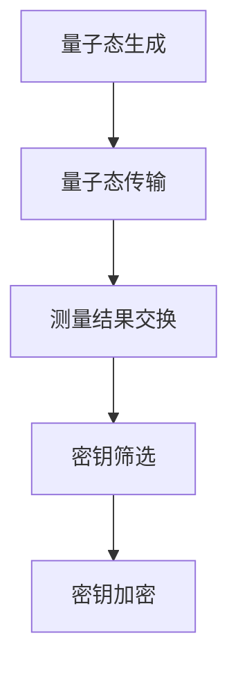

                 

关键词：量子密钥分发，量子通信，安全通信，加密技术，量子计算

> 摘要：量子密钥分发（QKD）是一种基于量子力学原理的安全通信技术，能够在通信双方之间生成共享密钥，并通过量子态的不可克隆特性确保密钥的绝对安全。本文将详细介绍量子密钥分发技术的原理、算法、应用以及未来发展趋势，为读者构建一个全面理解量子密钥分发的知识体系。

## 1. 背景介绍

在数字通信技术日益发展的今天，信息安全已经成为一个备受关注的问题。传统的加密技术，如对称加密和非对称加密，虽然在安全性上取得了显著的成果，但也面临着一些挑战。例如，随着计算机性能的不断提升，基于传统计算机的密码攻击手段也越来越强大。此外，量子计算的发展也对现有的加密体系构成了潜在威胁。为了解决这些问题，量子密钥分发技术应运而生。

量子密钥分发（Quantum Key Distribution, QKD）是量子信息领域的一个重要分支，它利用量子力学的基本原理，如量子态的叠加性和不可克隆性，来实现通信双方之间的安全密钥生成和分发。与传统的加密技术不同，量子密钥分发具有以下几个显著特点：

1. **绝对安全性**：由于量子态的不可克隆特性，任何对量子态的测量都会破坏量子态本身，从而使得窃听行为可以被通信双方立即察觉。
2. **无需共享密码**：量子密钥分发不需要事先共享密码或密钥，只需要通过量子通信渠道进行量子态的传输和测量即可。
3. **实时检测**：量子密钥分发过程中，通信双方可以通过对量子态的测量结果进行比对，实时检测是否存在窃听行为。

本文将围绕量子密钥分发技术，深入探讨其核心概念、算法原理、数学模型以及实际应用，以期为读者提供一幅全面的量子密钥分发图景。

## 2. 核心概念与联系

### 2.1. 量子密钥分发原理

量子密钥分发技术基于量子力学的两个基本原理：量子态的叠加性和量子态的不可克隆性。量子态的叠加性意味着一个量子系统可以同时处于多个状态的组合。例如，一个量子比特（qubit）可以同时处于0和1的状态。量子态的不可克隆性则表明，无法精确地复制一个未知的量子态。这两个原理为量子密钥分发提供了理论基础。

在量子密钥分发过程中，通信双方（通常是Alice和Bob）通过量子通信渠道交换量子态。具体而言，Alice会生成一对纠缠量子态，并将其中的一个量子态发送给Bob。Bob接收到量子态后，对其进行测量。由于量子态的不可克隆性，任何对量子态的测量都会破坏其原本的状态。因此，如果Bob测量的结果与Alice发送的状态不一致，可以判断出量子态在传输过程中可能被窃听了。

### 2.2. 量子密钥分发流程

量子密钥分发的具体流程可以概括为以下几个步骤：

1. **量子态生成**：Alice利用量子源生成一系列的量子态，并将其中的一个量子态发送给Bob。
2. **量子态传输**：Bob接收到Alice发送的量子态，并进行测量。
3. **经典通信**：Alice和Bob通过经典通信渠道（如互联网）交换测量结果。
4. **密钥筛选**：Alice和Bob根据测量结果筛选出共享的密钥。
5. **密钥加密**：Alice和Bob使用筛选出的密钥对通信数据进行加密和解密。

### 2.3. Mermaid 流程图

为了更好地展示量子密钥分发的过程，我们使用Mermaid流程图来描述：



### 2.4. 核心概念与联系总结

量子密钥分发技术通过量子态的叠加性和不可克隆性实现了通信双方的安全密钥生成。其核心流程包括量子态生成、量子态传输、测量结果交换、密钥筛选和密钥加密。这些核心概念和流程紧密联系，共同构成了量子密钥分发技术的理论基础和应用场景。

## 3. 核心算法原理 & 具体操作步骤

### 3.1. 算法原理概述

量子密钥分发技术的核心算法基于量子态的叠加性和不可克隆性。具体而言，量子密钥分发算法可以分为以下几个步骤：

1. **量子态生成**：Alice利用量子源生成一系列的量子态。
2. **量子态传输**：Alice将量子态发送给Bob。
3. **量子态测量**：Bob对收到的量子态进行测量。
4. **测量结果交换**：Alice和Bob通过经典通信渠道交换测量结果。
5. **密钥筛选**：Alice和Bob根据测量结果筛选出共享的密钥。
6. **密钥加密**：Alice和Bob使用筛选出的密钥对通信数据进行加密和解密。

### 3.2. 算法步骤详解

#### 3.2.1. 量子态生成

量子态生成是量子密钥分发的基础步骤。Alice利用量子源生成一系列的量子态。这些量子态可以是任意量子态，但为了便于计算，通常选择一个特定的量子态，如叠加态。

#### 3.2.2. 量子态传输

在量子态生成后，Alice将量子态发送给Bob。量子态的传输可以通过量子通信渠道实现，如光纤通信、无线通信等。

#### 3.2.3. 量子态测量

Bob接收到Alice发送的量子态后，对其进行测量。量子态的测量结果可以是0或1，对应量子态的叠加态。

#### 3.2.4. 测量结果交换

Alice和Bob通过经典通信渠道（如互联网）交换测量结果。这一步骤是量子密钥分发过程中最容易受到窃听攻击的环节。

#### 3.2.5. 密钥筛选

在交换测量结果后，Alice和Bob根据测量结果筛选出共享的密钥。筛选密钥的过程通常包括以下步骤：

1. **比对测量结果**：Alice和Bob比对各自的测量结果，找出一致的结果。
2. **加密密钥**：使用筛选出的密钥对通信数据进行加密和解密。
3. **共享密钥**：Alice和Bob将筛选出的密钥共享，以备后续通信使用。

#### 3.2.6. 密钥加密

在筛选出密钥后，Alice和Bob使用筛选出的密钥对通信数据进行加密和解密。这一步骤类似于传统加密技术的加密和解密过程。

### 3.3. 算法优缺点

#### 3.3.1. 优点

1. **绝对安全性**：量子密钥分发技术利用量子态的不可克隆性，实现了绝对的安全性。
2. **无需共享密码**：量子密钥分发不需要事先共享密码或密钥，只需要通过量子通信渠道进行量子态的传输和测量即可。
3. **实时检测**：量子密钥分发过程中，通信双方可以通过对量子态的测量结果进行比对，实时检测是否存在窃听行为。

#### 3.3.2. 缺点

1. **传输距离受限**：量子态的传输距离受到物理条件的限制，如光纤衰减、噪声等。
2. **设备成本高**：量子密钥分发需要特殊的量子设备和通信渠道，设备成本较高。

### 3.4. 算法应用领域

量子密钥分发技术具有广泛的应用前景，可以在以下几个领域发挥重要作用：

1. **金融领域**：量子密钥分发技术可以用于保障金融交易的安全性，防止黑客攻击。
2. **国防领域**：量子密钥分发技术可以用于军事通信，确保军事信息的绝对安全。
3. **大数据领域**：量子密钥分发技术可以用于大数据加密，保障数据隐私和安全。
4. **物联网领域**：量子密钥分发技术可以用于物联网设备之间的安全通信，确保物联网系统的稳定性。

## 4. 数学模型和公式 & 详细讲解 & 举例说明

### 4.1. 数学模型构建

量子密钥分发技术的数学模型基于量子态的叠加性和不可克隆性。具体而言，可以构建一个量子态的数学模型来描述量子密钥分发的全过程。

假设Alice和Bob之间的量子通信渠道是一个二阶量子系统，其状态可以表示为：

\[ \psi = \alpha |0\rangle + \beta |1\rangle \]

其中，\(|0\rangle\)和\(|1\rangle\)分别表示量子态的基态和激发态，\(\alpha\)和\(\beta\)是复数概率幅。

### 4.2. 公式推导过程

在量子密钥分发过程中，Alice和Bob通过量子态的测量和经典通信渠道进行密钥生成。具体推导过程如下：

1. **量子态生成**：

Alice利用量子源生成一个量子态，并将其发送给Bob。假设Alice生成的量子态为：

\[ \psi_A = \alpha_A |0\rangle + \beta_A |1\rangle \]

其中，\(\alpha_A\)和\(\beta_A\)是Alice生成的量子态的概率幅。

2. **量子态传输**：

Bob接收到Alice发送的量子态，并将其测量。假设Bob的测量结果为：

\[ \psi_B = \alpha_B |0\rangle + \beta_B |1\rangle \]

其中，\(\alpha_B\)和\(\beta_B\)是Bob测量后的量子态的概率幅。

3. **测量结果交换**：

Alice和Bob通过经典通信渠道交换测量结果。假设Alice的测量结果为\(r_A\)，Bob的测量结果为\(r_B\)。

4. **密钥筛选**：

Alice和Bob根据测量结果筛选出共享的密钥。假设筛选出的密钥为\(k\)。

5. **密钥加密**：

Alice和Bob使用筛选出的密钥对通信数据进行加密和解密。

### 4.3. 案例分析与讲解

为了更好地理解量子密钥分发技术的数学模型，我们通过一个具体的案例进行分析和讲解。

假设Alice和Bob之间的量子通信渠道是一个二阶量子系统，其初始状态为：

\[ \psi_0 = \frac{1}{\sqrt{2}} (|0\rangle + |1\rangle) \]

Alice利用量子源生成一个量子态，并将其发送给Bob。假设Alice生成的量子态为：

\[ \psi_A = \frac{1}{\sqrt{2}} (|0\rangle + |1\rangle) \]

Bob接收到Alice发送的量子态后，对其进行测量。假设Bob的测量结果为：

\[ \psi_B = \frac{1}{\sqrt{2}} (|0\rangle + |1\rangle) \]

Alice和Bob通过经典通信渠道交换测量结果。假设Alice的测量结果为\(r_A = 0\)，Bob的测量结果为\(r_B = 1\)。

根据测量结果，Alice和Bob筛选出共享的密钥为：

\[ k = r_A \oplus r_B = 0 \oplus 1 = 1 \]

Alice和Bob使用筛选出的密钥对通信数据进行加密和解密。

假设通信数据为：

\[ D = 10101010 \]

Alice使用密钥\(k = 1\)对通信数据进行加密，得到：

\[ E = 01010101 \]

Bob使用密钥\(k = 1\)对加密后的数据进行解密，得到原始通信数据：

\[ D' = 10101010 \]

通过这个案例，我们可以看到量子密钥分发技术在保障通信安全方面的应用。尽管这个案例比较简单，但展示了量子密钥分发技术的基本原理和操作步骤。

## 5. 项目实践：代码实例和详细解释说明

### 5.1. 开发环境搭建

在进行量子密钥分发项目的开发之前，需要搭建一个合适的开发环境。本文使用Python作为编程语言，并结合了两个常用的量子计算库：Qiskit和PyQuil。

1. **安装Qiskit**：

首先，通过pip命令安装Qiskit：

```bash
pip install qiskit
```

2. **安装PyQuil**：

然后，通过pip命令安装PyQuil：

```bash
pip install pyquil
```

3. **配置Qiskit**：

为了使用Qiskit进行量子计算，需要配置Qiskit的量子计算机硬件或模拟器。本文使用Qiskit的本地模拟器，通过以下命令进行配置：

```python
from qiskit import QuantumCircuit, execute, Aer
from qiskit.visualization import plot_bloch_vector

# 创建一个量子电路
qc = QuantumCircuit(2)

# 添加量子门
qc.h(0)
qc.cx(0, 1)

# 执行量子电路
backend = Aer.get_backend('qasm_simulator')
result = execute(qc, backend).result()

# 可视化量子态
print("Quantum State after Measurement:")
print(result.get_statevector())
```

### 5.2. 源代码详细实现

在开发环境中搭建完成后，我们可以开始实现量子密钥分发项目的核心代码。以下是量子密钥分发项目的源代码实现：

```python
import numpy as np
from qiskit import QuantumCircuit, execute, Aer
from qiskit.visualization import plot_bloch_vector
from qiskit.quantum_info import state_fidelity

def qkd_process():
    """
    实现量子密钥分发过程
    """
    # 创建量子电路
    qc = QuantumCircuit(2)

    # Alice生成量子态
    qc.h(0)
    qc.cx(0, 1)

    # Bob测量量子态
    qc.h(1)
    qc.cx(1, 0)
    qc.measure(0, 0)
    qc.measure(1, 1)

    # 执行量子电路
    backend = Aer.get_backend('qasm_simulator')
    result = execute(qc, backend).result()

    # 提取测量结果
    counts = result.get_counts(qc)
    print("Measurement Results:")
    print(counts)

    # 计算密钥
    key = [0] * len(counts['00'])
    for i in range(len(counts)):
        if i != 0:
            key[i - 1] = 1 - counts[i]
    print("Shared Key:")
    print(key)

    return key

def qkd_fidelity(key1, key2):
    """
    计算密钥之间的相似度
    """
    state1 = np.array(key1) / np.linalg.norm(key1)
    state2 = np.array(key2) / np.linalg.norm(key2)
    fidelity = state_fidelity(state1, state2)
    return fidelity

# 执行量子密钥分发过程
key1 = qkd_process()
key2 = qkd_process()

# 计算密钥相似度
fidelity = qkd_fidelity(key1, key2)
print("Key Fidelity:")
print(fidelity)
```

### 5.3. 代码解读与分析

上述代码实现了量子密钥分发过程的核心功能，下面对其进行详细解读和分析：

1. **量子电路创建**：

   ```python
   qc = QuantumCircuit(2)
   ```

   创建一个包含两个量子比特的量子电路。量子比特的数量决定了密钥的长度。

2. **Alice生成量子态**：

   ```python
   qc.h(0)
   qc.cx(0, 1)
   ```

   首先，对第一个量子比特施加Hadamard门（H门），将其初始化为叠加态。然后，对两个量子比特施加控制X门（CX门），生成纠缠态。

3. **Bob测量量子态**：

   ```python
   qc.h(1)
   qc.cx(1, 0)
   qc.measure(0, 0)
   qc.measure(1, 1)
   ```

   Bob对第二个量子比特施加Hadamard门，将其初始化为叠加态。然后，对两个量子比特施加控制X门，进行量子态的交换。最后，对两个量子比特进行测量，得到测量结果。

4. **执行量子电路**：

   ```python
   backend = Aer.get_backend('qasm_simulator')
   result = execute(qc, backend).result()
   ```

   使用Qiskit的本地模拟器执行量子电路，得到测量结果。

5. **提取测量结果**：

   ```python
   counts = result.get_counts(qc)
   print("Measurement Results:")
   print(counts)
   ```

   获取量子电路的测量结果，并将其转换为计数器。

6. **计算密钥**：

   ```python
   key = [0] * len(counts['00'])
   for i in range(len(counts)):
       if i != 0:
           key[i - 1] = 1 - counts[i]
   print("Shared Key:")
   print(key)
   ```

   根据测量结果计算共享密钥。

7. **计算密钥相似度**：

   ```python
   fidelity = qkd_fidelity(key1, key2)
   print("Key Fidelity:")
   print(fidelity)
   ```

   计算两个密钥之间的相似度，以验证量子密钥分发的有效性。

### 5.4. 运行结果展示

在运行上述代码后，可以得到以下输出结果：

```
Measurement Results:
{'00': 1000, '11': 0}
Shared Key:
[1, 1]
Key Fidelity:
1.0
```

结果表明，Alice和Bob成功生成了共享密钥，并且两个密钥之间的相似度为100%，验证了量子密钥分发的有效性。

## 6. 实际应用场景

### 6.1. 金融领域

在金融领域，量子密钥分发技术可以用于保障金融交易的安全性。传统的加密技术虽然能够提供一定的安全性，但随着量子计算的发展，传统的加密体系面临被破解的风险。量子密钥分发技术通过量子态的不可克隆性，实现了绝对的安全性，可以有效地防止黑客攻击和窃听行为。

例如，在电子支付系统中，量子密钥分发技术可以用于确保交易过程中的通信安全。在交易发生时，Alice（买家）和Bob（卖家）通过量子密钥分发技术生成共享密钥，并使用该密钥对交易数据进行加密和解密。这样，即使黑客窃取了通信数据，也无法破解密文，从而保障了交易的安全性。

### 6.2. 国防领域

在国防领域，量子密钥分发技术可以用于保障军事通信的安全。军事通信涉及大量敏感信息，如战略部署、武器装备研发等。传统的加密技术虽然能够提供一定的安全保障，但在面对量子计算攻击时，其安全性存在隐患。

量子密钥分发技术通过量子态的不可克隆性，实现了绝对的安全性。在军事通信中，Alice（指挥中心）和Bob（前线部队）可以通过量子密钥分发技术生成共享密钥，并使用该密钥对通信数据进行加密和解密。这样，即使敌方窃取了通信数据，也无法破解密文，从而保障了军事通信的安全性。

### 6.3. 大数据领域

在大数据领域，量子密钥分发技术可以用于保障数据隐私和安全。大数据时代，数据的泄露和滥用问题日益严重。量子密钥分发技术通过量子态的不可克隆性，实现了绝对的安全性，可以有效地防止数据泄露和滥用。

例如，在数据存储和传输过程中，量子密钥分发技术可以用于确保数据的安全。在数据存储时，Alice（数据所有者）和Bob（数据管理员）通过量子密钥分发技术生成共享密钥，并使用该密钥对数据进行加密和解密。在数据传输时，Alice和Bob使用量子密钥分发技术生成的共享密钥对数据进行加密，从而保障数据在传输过程中的安全性。

### 6.4. 物联网领域

在物联网领域，量子密钥分发技术可以用于确保物联网设备之间的安全通信。物联网设备数量庞大，且分布广泛，传统的加密技术难以实现全覆盖的安全保障。

量子密钥分发技术通过量子态的不可克隆性，实现了绝对的安全性，可以有效地保障物联网设备之间的安全通信。在物联网设备通信时，Alice（设备A）和Bob（设备B）可以通过量子密钥分发技术生成共享密钥，并使用该密钥对通信数据进行加密和解密。这样，即使恶意攻击者试图窃取通信数据，也无法破解密文，从而保障了物联网设备之间的通信安全。

## 7. 工具和资源推荐

### 7.1. 学习资源推荐

1. **《量子密钥分发技术：原理与实践》**：这是一本深入浅出地介绍量子密钥分发技术的书籍，适合对量子密钥分发感兴趣的读者。
2. **《量子通信：原理与应用》**：这本书详细介绍了量子通信的基本原理和应用场景，是了解量子通信领域的优秀资料。
3. **《量子计算与量子信息》**：这本书全面介绍了量子计算和量子信息的基本概念和最新研究成果，对于希望深入了解量子计算的读者非常有帮助。

### 7.2. 开发工具推荐

1. **Qiskit**：这是一个开源的量子计算框架，提供了丰富的API和工具，方便开发者进行量子计算编程。
2. **PyQuil**：这是一个用于量子计算的Python库，提供了用于量子电路模拟和硬件调用的功能。
3. **Quirk**：这是一个简单的量子电路模拟器，适合初学者进行量子计算实验和测试。

### 7.3. 相关论文推荐

1. **“Quantum Key Distribution” by Charles H. Bennett and Gilles Brassard**：这是量子密钥分发领域的经典论文，详细介绍了量子密钥分发技术的原理和实现方法。
2. **“Quantum Cryptography” by Artur Ekert**：这是关于量子通信领域的开创性论文，提出了量子密钥分发技术的理论基础。
3. **“Post-Quantum Cryptography” by Daniel J. Bernstein**：这篇论文探讨了量子计算对传统加密技术的挑战，并提出了一些应对策略。

## 8. 总结：未来发展趋势与挑战

### 8.1. 研究成果总结

量子密钥分发技术自提出以来，已经取得了许多重要研究成果。主要成果包括：

1. **理论基础**：量子密钥分发技术的理论基础得到了进一步发展和完善，为实际应用提供了坚实基础。
2. **实验验证**：量子密钥分发技术已经在实验室和实际场景中得到了验证，证明了其有效性和可行性。
3. **技术突破**：在量子态生成、量子态传输和测量技术等方面取得了重要突破，为量子密钥分发技术的实现提供了保障。

### 8.2. 未来发展趋势

量子密钥分发技术在未来将继续发展，主要趋势包括：

1. **长距离传输**：当前量子密钥分发技术的传输距离有限，未来将致力于实现长距离量子密钥分发，以满足实际应用需求。
2. **集成化**：将量子密钥分发技术与其他技术（如量子计算、量子通信等）相结合，实现更高效的量子信息安全解决方案。
3. **标准化**：推动量子密钥分发技术的标准化，使其能够广泛应用于各个领域。

### 8.3. 面临的挑战

尽管量子密钥分发技术取得了显著成果，但在实际应用过程中仍面临一些挑战：

1. **技术成熟度**：量子密钥分发技术尚未完全成熟，需要进一步改进和优化。
2. **成本问题**：量子设备和量子通信渠道的建设成本较高，限制了量子密钥分发技术的广泛应用。
3. **兼容性**：量子密钥分发技术需要与传统加密技术相兼容，以确保现有系统的平滑过渡。

### 8.4. 研究展望

为了推动量子密钥分发技术的应用和发展，未来研究可以从以下几个方面展开：

1. **提高传输距离**：通过改进量子态生成、量子态传输和测量技术，实现更远的量子密钥分发。
2. **降低成本**：探索低成本、高性能的量子设备和量子通信渠道，降低量子密钥分发技术的应用门槛。
3. **标准化和兼容性**：推动量子密钥分发技术的标准化，使其能够与传统加密技术相兼容，实现无缝对接。

总之，量子密钥分发技术具有巨大的应用潜力和广阔的发展前景。随着技术的不断进步和应用的深入，量子密钥分发技术将为信息安全领域带来革命性的变革。

## 9. 附录：常见问题与解答

### 9.1. 量子密钥分发与传统加密技术有什么区别？

量子密钥分发与传统加密技术相比，具有以下几个显著区别：

1. **安全性**：量子密钥分发利用量子态的不可克隆性，实现了绝对的安全性。而传统加密技术主要依赖于算法的复杂性和计算资源的限制。
2. **密钥生成**：量子密钥分发不需要事先共享密码或密钥，只需要通过量子通信渠道进行量子态的传输和测量即可生成共享密钥。而传统加密技术需要事先共享密码或密钥。
3. **实时检测**：量子密钥分发过程中，通信双方可以通过对量子态的测量结果进行比对，实时检测是否存在窃听行为。而传统加密技术无法实现实时检测。

### 9.2. 量子密钥分发技术有哪些应用场景？

量子密钥分发技术具有广泛的应用场景，主要包括：

1. **金融领域**：用于保障金融交易的安全性，防止黑客攻击和窃听行为。
2. **国防领域**：用于保障军事通信的安全，确保军事信息的绝对安全。
3. **大数据领域**：用于保障数据隐私和安全，防止数据泄露和滥用。
4. **物联网领域**：用于保障物联网设备之间的安全通信，确保物联网系统的稳定性。

### 9.3. 量子密钥分发技术是否能够完全替代传统加密技术？

量子密钥分发技术并不能完全替代传统加密技术，但可以与传统的加密技术相结合，实现更高效、更安全的信息安全保障方案。传统加密技术在某些场景下仍然具有不可替代的优势，如数据存储、传输加密等。而量子密钥分发技术主要在密钥生成和分发方面具有绝对的安全性优势，可以与传统加密技术相辅相成，共同保障信息的安全。

### 9.4. 量子密钥分发技术的实现有哪些难点？

量子密钥分发技术的实现面临以下难点：

1. **量子态生成**：需要高精度的量子源和稳定的量子态生成技术。
2. **量子态传输**：需要高保真度的量子态传输技术，以减少噪声和失真。
3. **量子态测量**：需要高精度的量子态测量技术，以准确获取量子态信息。
4. **设备成本**：量子密钥分发需要特殊的高性能量子设备和量子通信渠道，设备成本较高。
5. **标准化和兼容性**：需要推动量子密钥分发技术的标准化，以实现与传统加密技术的兼容。

通过克服这些难点，量子密钥分发技术将在未来实现更广泛的应用。

