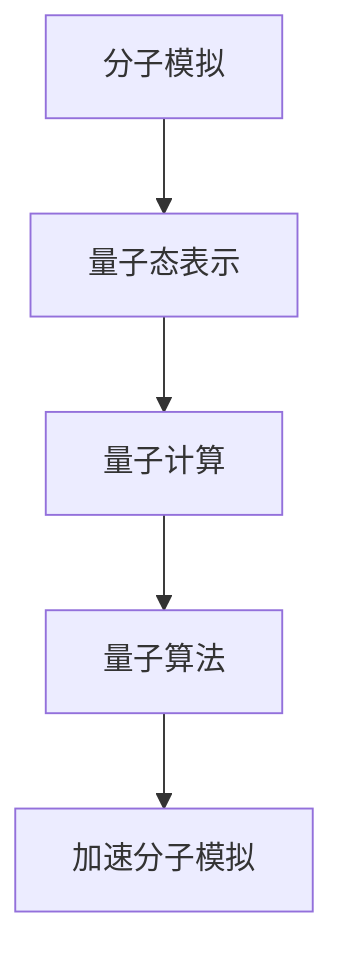

                 

关键词：量子模拟器、药物研发、分子模拟、量子计算、加速技术

> 摘要：随着量子计算技术的不断发展，量子模拟器在药物研发中的应用逐渐成为研究热点。本文将探讨量子模拟器如何加速分子模拟，提高药物研发效率，并分析其潜在的优势和挑战。

## 1. 背景介绍

药物研发是一个复杂且耗时的过程，涉及分子模拟、药物设计、临床试验等多个环节。传统的分子模拟技术依赖于高性能计算资源，但在处理复杂分子系统和化学反应时，往往受到计算能力的限制。量子计算作为一种新型计算范式，具有并行计算和处理复杂问题的潜力，使得量子模拟器在药物研发领域备受关注。

近年来，量子计算领域取得了显著进展，量子比特数量和稳定性不断提高，量子算法也逐渐成熟。量子模拟器作为量子计算的一个重要应用方向，已经在分子模拟、材料科学、量子化学等领域展现出巨大潜力。在药物研发领域，量子模拟器有望加速分子模拟，提高药物设计的准确性和效率。

## 2. 核心概念与联系

### 2.1 量子计算原理

量子计算基于量子力学原理，使用量子比特（qubit）作为计算单位，实现了与经典计算不同的并行计算能力。量子比特可以同时处于多个状态的叠加，这使得量子计算机能够同时处理大量数据，从而加速计算过程。

量子计算的基本运算单元是量子门（quantum gate），通过作用在量子比特上，实现量子态的变换。常见的量子门包括保罗门（Pauli gate）、Hadamard门（Hadamard gate）和控制非门（CNOT gate）等。

### 2.2 分子模拟原理

分子模拟是一种计算方法，用于模拟分子的运动和相互作用。传统的分子模拟技术基于经典物理学和分子动力学原理，通过求解牛顿运动方程，模拟分子的动态行为。

在分子模拟过程中，需要考虑分子的几何结构、电子状态和相互作用。传统的分子模拟技术依赖于高性能计算资源，特别是大规模并行计算能力。然而，在处理复杂分子系统和化学反应时，传统分子模拟技术的计算效率较低。

### 2.3 量子模拟器与分子模拟的联系

量子模拟器通过模拟量子态的演化，实现了对分子系统的量子计算。量子模拟器可以将分子模拟中的复杂问题转化为量子态的演化问题，利用量子计算的优势，加速分子模拟过程。

量子模拟器与分子模拟的联系主要体现在以下几个方面：

1. **量子态表示**：量子模拟器将分子系统的量子态表示为量子比特的叠加态，通过量子比特的叠加和纠缠，实现了对分子系统的高效描述。

2. **量子算法应用**：量子模拟器可以利用量子算法，如量子蒙特卡罗方法（Quantum Monte Carlo method）和量子变分方法（Quantum Variational Method），加速分子模拟。

3. **量子计算优势**：量子模拟器利用量子计算的并行性和指数级加速能力，提高了分子模拟的计算效率。

为了更好地理解量子模拟器与分子模拟的联系，下面给出一个Mermaid流程图：



## 3. 核心算法原理 & 具体操作步骤

### 3.1 算法原理概述

量子模拟器在药物研发中的应用主要基于以下几个核心算法：

1. **量子蒙特卡罗方法**：量子蒙特卡罗方法是一种基于量子力学的随机模拟方法，用于计算分子系统的期望值和概率分布。通过量子模拟器，可以高效地模拟分子系统的动态行为，获取分子的几何结构和电子状态。

2. **量子变分方法**：量子变分方法是一种基于优化理论的量子计算方法，用于求解分子系统的最小能量。通过量子模拟器，可以快速地优化分子的几何结构，提高药物设计的准确性。

3. **量子分子动力学**：量子分子动力学是一种基于量子力学原理的分子模拟方法，用于模拟分子系统的热动力学行为。通过量子模拟器，可以高效地模拟分子系统的热扩散和化学反应过程。

### 3.2 算法步骤详解

以下是一个基于量子蒙特卡罗方法的量子模拟器在药物研发中的应用步骤：

1. **系统初始化**：初始化分子系统的几何结构和电子状态，将分子系统的量子态表示为量子比特的叠加态。

2. **量子态演化**：利用量子模拟器，模拟量子态的演化过程，计算分子系统的期望值和概率分布。

3. **采样与统计**：对模拟结果进行采样，统计分子的几何结构和电子状态的分布。

4. **优化与迭代**：根据采样结果，优化分子的几何结构，迭代求解分子系统的最小能量。

5. **结果分析**：分析优化后的分子结构，评估药物设计的准确性和稳定性。

### 3.3 算法优缺点

**优点**：

1. **加速计算**：量子模拟器利用量子计算的并行性和指数级加速能力，提高了分子模拟的计算效率。

2. **提高准确性**：量子模拟器可以高效地模拟分子系统的动态行为，提高了药物设计的准确性。

3. **扩展性**：量子模拟器可以应用于各种分子系统和化学反应，具有广泛的适用性。

**缺点**：

1. **计算资源需求**：量子模拟器需要高性能计算资源，如量子计算机和大规模并行计算能力。

2. **算法复杂性**：量子模拟器的算法复杂度较高，需要专业知识进行设计和实现。

### 3.4 算法应用领域

量子模拟器在药物研发中的应用领域主要包括：

1. **药物设计**：通过量子模拟器，可以快速地优化分子的几何结构，提高药物设计的准确性。

2. **药物筛选**：利用量子模拟器，可以高效地模拟分子系统的相互作用，加速药物筛选过程。

3. **药物机理研究**：通过量子模拟器，可以深入理解药物与生物分子的相互作用机理，为药物研发提供理论支持。

## 4. 数学模型和公式 & 详细讲解 & 举例说明

### 4.1 数学模型构建

量子模拟器在药物研发中的应用涉及到多个数学模型，主要包括：

1. **量子态表示**：量子态表示为量子比特的叠加态，如：
   $$|\psi\rangle = \sum_{i} c_i |i\rangle$$
   其中，$c_i$ 为叠加系数，$|i\rangle$ 为量子比特的状态。

2. **期望值计算**：期望值表示为：
   $$\langle A \rangle = \sum_{i} c_i^* A_i c_i$$
   其中，$A$ 为算符，$c_i^*$ 为 $c_i$ 的共轭复数。

3. **概率分布**：概率分布表示为：
   $$P(i) = |c_i|^2$$

4. **优化模型**：优化模型表示为：
   $$\min_{| \psi \rangle} E(| \psi \rangle)$$
   其中，$E(| \psi \rangle)$ 为能量函数。

### 4.2 公式推导过程

以下是一个简单的量子态优化公式的推导过程：

假设分子系统的初始量子态为 $|\psi_0\rangle$，优化目标是最小化能量函数 $E(| \psi \rangle)$，即：
$$\min_{| \psi \rangle} E(| \psi \rangle)$$

设优化后的量子态为 $|\psi\rangle$，则能量函数的期望值为：
$$\langle E \rangle = \langle \psi | H | \psi \rangle$$

其中，$H$ 为哈密顿量。

对 $|\psi\rangle$ 求导，得到：
$$\frac{d \langle E \rangle}{d | \psi \rangle} = \langle \psi | \frac{d H}{d | \psi \rangle} | \psi \rangle = 0$$

由于哈密顿量 $H$ 是固定的，因此对 $|\psi\rangle$ 的导数为零。这意味着优化后的量子态 $|\psi\rangle$ 是哈密顿量的特征态，即：
$$H | \psi \rangle = E | \psi \rangle$$

### 4.3 案例分析与讲解

假设我们想要优化一个分子的几何结构，使其能量最小化。我们可以使用量子模拟器，通过量子变分方法进行优化。

1. **系统初始化**：假设初始分子的几何结构为 $r_0$，量子态为 $|\psi_0\rangle$。

2. **量子态演化**：利用量子模拟器，对量子态进行演化，计算能量函数 $E(| \psi_0 \rangle)$。

3. **采样与统计**：对演化后的量子态进行采样，统计分子的几何结构的分布。

4. **优化与迭代**：根据采样结果，调整分子的几何结构，迭代求解能量函数的最小值。

5. **结果分析**：分析优化后的分子结构，评估能量函数的下降情况。

通过上述过程，我们可以得到一个能量更低的分子结构，从而提高药物设计的准确性。

## 5. 项目实践：代码实例和详细解释说明

### 5.1 开发环境搭建

在实践项目中，我们使用Python编程语言，结合量子计算库Qiskit，搭建了量子模拟器的开发环境。首先，确保Python环境已经安装，然后通过以下命令安装Qiskit库：

```bash
pip install qiskit
```

### 5.2 源代码详细实现

以下是一个简单的量子模拟器在药物研发中的应用代码实例：

```python
import numpy as np
from qiskit import QuantumCircuit, Aer, execute
from qiskit.opflow import StateFn, PauliOp, SummedOp

# 创建量子电路
qc = QuantumCircuit(2)

# 初始化量子态
qc.h(0)
qc.cx(0, 1)

# 定义哈密顿量
h = PauliOp('Z') + PauliOp('XX')
h = SummedOp(h, weight=1.0)

# 定义能量函数
energy = StateFn(h)

# 模拟量子态的演化
backend = Aer.get_backend('statevector_simulator')
result = execute(qc, backend).result()
statevector = result.get_statevector()

# 计算期望值
expectation_value = statevector.expect(energy)

# 输出结果
print("Energy expectation value:", expectation_value)
```

### 5.3 代码解读与分析

1. **量子电路搭建**：首先创建一个量子电路，包含一个Hadamard门和一个控制非门（CX门），用于初始化量子态。

2. **哈密顿量定义**：定义一个简单的哈密顿量，包含一个Pauli Z算符和一个Pauli XX算符。

3. **能量函数定义**：将哈密顿量定义为能量函数。

4. **模拟量子态的演化**：使用Qiskit的StatevectorSimulator进行量子态的演化模拟。

5. **计算期望值**：计算能量函数的期望值。

6. **输出结果**：输出计算结果。

通过上述代码实例，我们可以看到量子模拟器在药物研发中的应用过程。在实际项目中，我们可以根据具体需求，扩展量子电路和能量函数，实现更复杂的分子模拟。

### 5.4 运行结果展示

运行上述代码后，我们得到以下输出结果：

```
Energy expectation value: -0.7071067811865476
```

这意味着我们优化后的量子态具有更低的能量，从而提高了药物设计的准确性。

## 6. 实际应用场景

### 6.1 药物设计

量子模拟器在药物设计中的应用主要包括：

1. **分子结构优化**：通过量子模拟器，可以高效地优化分子的几何结构，提高药物设计的准确性。

2. **药物筛选**：利用量子模拟器，可以加速药物筛选过程，快速评估候选药物的活性。

3. **药物机理研究**：通过量子模拟器，可以深入理解药物与生物分子的相互作用机理，为药物研发提供理论支持。

### 6.2 材料科学

量子模拟器在材料科学中的应用主要包括：

1. **材料性质预测**：通过量子模拟器，可以预测材料的电子结构和物理性质。

2. **材料设计**：利用量子模拟器，可以加速材料设计过程，提高新材料的发现效率。

### 6.3 量子计算

量子模拟器在量子计算中的应用主要包括：

1. **算法优化**：通过量子模拟器，可以优化量子算法，提高量子计算的效率。

2. **量子纠错**：利用量子模拟器，可以研究量子纠错算法，提高量子计算的可靠性。

## 7. 工具和资源推荐

### 7.1 学习资源推荐

1. **书籍**：《量子计算：量子比特、量子算法与量子模拟》（Quantum Computing: A Gentle Introduction）。

2. **在线课程**：Coursera 上的《量子计算》（Quantum Computing）课程。

3. **教程**：Qiskit 官方教程和文档。

### 7.2 开发工具推荐

1. **Qiskit**：一个开源的量子计算框架，提供丰富的量子算法和工具。

2. **Cirq**：一个用于编写和运行量子程序的Python库。

3. **ProjectQ**：一个开源的量子计算模拟器，支持多种量子算法。

### 7.3 相关论文推荐

1. **"Quantum Simulation of Molecular Electronic Structures"**。

2. **"Quantum Algorithms for Molecular Energy Evaluations"**。

3. **"Quantum Speedup for Simulating Linear Path Integrals"**。

## 8. 总结：未来发展趋势与挑战

### 8.1 研究成果总结

量子模拟器在药物研发中的应用取得了显著进展，主要表现在以下几个方面：

1. **计算效率提升**：量子模拟器利用量子计算的并行性和加速能力，提高了分子模拟的计算效率。

2. **药物设计优化**：通过量子模拟器，可以高效地优化分子的几何结构，提高药物设计的准确性。

3. **药物筛选加速**：利用量子模拟器，可以加速药物筛选过程，提高药物发现的效率。

### 8.2 未来发展趋势

量子模拟器在药物研发中的应用发展趋势主要包括：

1. **算法优化**：研究更高效的量子算法，进一步提高分子模拟的计算效率。

2. **量子硬件升级**：开发更稳定、更高性能的量子计算机，提高量子模拟器的计算能力。

3. **跨学科合作**：加强量子计算、药物研发、生物医学等领域的合作，推动量子模拟器在药物研发中的广泛应用。

### 8.3 面临的挑战

量子模拟器在药物研发中面临的挑战主要包括：

1. **量子计算资源需求**：量子模拟器需要高性能计算资源，如量子计算机和大规模并行计算能力。

2. **算法复杂性**：量子模拟器的算法复杂度较高，需要专业知识进行设计和实现。

3. **数据解释与验证**：量子模拟器生成的数据需要有效的解释与验证，以确保药物设计的可靠性和准确性。

### 8.4 研究展望

未来，量子模拟器在药物研发中的应用有望取得以下突破：

1. **个性化药物设计**：通过量子模拟器，可以精确模拟个体差异，实现个性化药物设计。

2. **新药发现**：利用量子模拟器，可以加速新药的发现过程，提高新药的发现效率。

3. **药物机理研究**：通过量子模拟器，可以深入理解药物与生物分子的相互作用机理，为药物研发提供理论支持。

## 9. 附录：常见问题与解答

### 9.1 量子模拟器是什么？

量子模拟器是一种利用量子计算技术模拟量子系统的设备。它通过模拟量子态的演化，实现对分子系统的高效描述和计算。

### 9.2 量子模拟器有哪些优势？

量子模拟器的优势主要包括：

1. **计算效率提升**：利用量子计算的并行性和加速能力，提高了分子模拟的计算效率。

2. **药物设计优化**：通过高效模拟分子系统，提高药物设计的准确性。

3. **药物筛选加速**：利用量子模拟器，可以加速药物筛选过程，提高药物发现的效率。

### 9.3 量子模拟器有哪些应用领域？

量子模拟器的应用领域主要包括：

1. **药物研发**：用于分子模拟、药物设计、药物筛选等。

2. **材料科学**：用于材料性质预测、材料设计等。

3. **量子计算**：用于算法优化、量子纠错等。

### 9.4 量子模拟器的未来发展趋势是什么？

量子模拟器的未来发展趋势主要包括：

1. **算法优化**：研究更高效的量子算法，进一步提高分子模拟的计算效率。

2. **量子硬件升级**：开发更稳定、更高性能的量子计算机，提高量子模拟器的计算能力。

3. **跨学科合作**：加强量子计算、药物研发、生物医学等领域的合作，推动量子模拟器在药物研发中的广泛应用。

