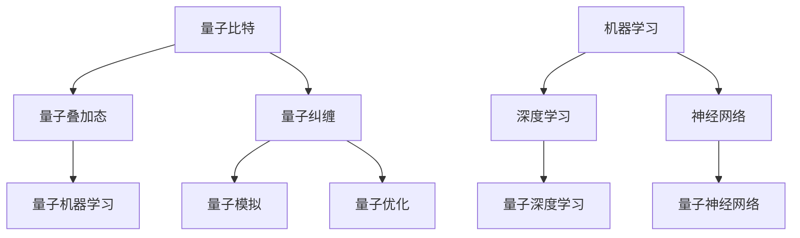

                 

关键词：量子计算，人工智能，量子人工智能，未来科技，发展趋势，研究挑战

摘要：本文从量子计算和人工智能两个前沿科技领域出发，探讨了量子计算与人工智能的结合，阐述了量子人工智能的原理、应用和未来发展趋势。文章首先介绍了量子计算和人工智能的核心概念及其发展历程，随后深入分析了量子计算在人工智能中的应用，包括量子机器学习、量子模拟和量子优化。接着，文章讨论了量子计算和人工智能面临的挑战，并提出了相应的解决方案。最后，文章展望了量子人工智能在未来科技发展中的潜力和应用前景。

## 1. 背景介绍

量子计算和人工智能作为现代科技的两大前沿领域，它们的发展历程和技术突破对人类社会产生了深远的影响。量子计算起源于20世纪40年代，由物理学家理查德·费曼（Richard Feynman）提出，旨在模拟量子系统的行为。近年来，量子计算以其并行处理能力和超越经典计算机的潜力，吸引了全球科技界的高度关注。另一方面，人工智能自20世纪50年代起逐渐发展，如今已经深入到社会生活的方方面面，从智能助理到自动驾驶，从医疗诊断到金融交易，人工智能的应用越来越广泛。

量子计算与人工智能的结合，即量子人工智能（Quantum Artificial Intelligence，简称QAI），是未来科技发展的重要方向。量子人工智能通过将量子计算的优势与人工智能的方法相结合，有望在数据处理、模式识别、优化问题等方面实现前所未有的突破。本文将围绕量子人工智能的原理、应用、挑战和发展趋势进行详细探讨。

### 1.1 量子计算的发展历程

量子计算的概念最早由理查德·费曼在1981年提出，他的目标是设计一种计算机，能够模拟量子系统的行为。随后，彼得·肖尔（Peter Shor）在1994年提出了著名的肖尔算法，展示了量子计算机在因子分解问题上的巨大优势。这一发现激发了人们对量子计算的浓厚兴趣，并推动了量子计算研究的快速发展。

在量子比特（qubit）的实现方面，物理学家约翰·克拉克（John Clarke）等人于1985年成功实现了第一个量子比特的读写操作。近年来，基于超导电路、离子阱和拓扑量子体系等技术的量子比特实现取得了显著进展。例如，谷歌、IBM等公司已经成功构建了数十个量子比特的量子计算机，并在量子算法验证和量子通信等方面取得了重要成果。

### 1.2 人工智能的发展历程

人工智能（Artificial Intelligence，简称AI）的发展可以追溯到20世纪50年代，当时科学家们开始探讨如何让计算机模拟人类的智能行为。1956年，达特茅斯会议上，约翰·麦卡锡（John McCarthy）等人提出了人工智能的概念，并确定了人工智能研究的七个主要领域：知识表示、推理、机器学习、知识获取、自然语言理解、视觉感知和机器人。

在早期的人工智能研究中，符号主义方法占据主导地位，这种方法依赖于专家系统，通过手工编写规则和逻辑来模拟人类的思维过程。然而，这种方法在处理大规模数据和复杂任务时遇到了困难。随着机器学习技术的发展，尤其是深度学习算法的突破，人工智能开始展现出强大的能力。2012年，深度学习在图像识别任务上的表现超过了人类，标志着人工智能进入了新的发展阶段。

### 1.3 量子计算与人工智能的结合

量子计算和人工智能的结合，即量子人工智能，是一种利用量子计算的优势来增强人工智能能力的新兴领域。量子计算具有并行处理能力和量子叠加态的特点，这使得它在处理大数据和复杂优化问题方面具有巨大的潜力。而人工智能则提供了算法和模型，可以将量子计算的优势发挥到极致。

量子人工智能的研究主要包括以下几个方向：

- **量子机器学习**：量子机器学习利用量子计算的优势来加速传统机器学习算法，特别是在处理大规模数据和复杂模式识别任务时。

- **量子模拟**：量子模拟利用量子计算机模拟量子系统的行为，为化学、材料科学等领域提供了强大的计算工具。

- **量子优化**：量子优化算法利用量子计算机在求解优化问题方面的优势，可以应用于物流、金融和制造等领域。

### 1.4 量子人工智能的发展现状

当前，量子人工智能的研究正处于起步阶段，但已经取得了一些重要的进展。例如，谷歌的量子计算机已经成功实现了量子态的叠加和纠缠，并验证了量子算法的正确性。此外，IBM、微软、英特尔等公司也在量子人工智能领域进行了大量的研究，并推出了各自的量子计算平台。

尽管量子人工智能的发展前景广阔，但仍然面临许多挑战，包括量子计算机的可靠性和稳定性、量子算法的设计与优化等。未来的研究需要克服这些挑战，进一步推动量子人工智能的发展。

## 2. 核心概念与联系

### 2.1 量子计算的核心概念

量子计算的核心概念包括量子比特、量子叠加态和量子纠缠。

- **量子比特（qubit）**：量子比特是量子计算的基本单位，类似于经典计算中的比特。然而，量子比特可以同时处于0和1的状态，这种叠加态使得量子计算机具有并行处理的能力。

- **量子叠加态**：量子叠加态是量子比特的一种特殊状态，可以同时表示0和1。这种叠加态使得量子计算机在处理问题时可以同时考虑多种可能性，从而大幅提升计算效率。

- **量子纠缠**：量子纠缠是量子计算中的一种特殊现象，两个或多个量子比特之间可以形成纠缠态，这意味着它们的状态是相互关联的。量子纠缠是量子计算实现并行处理的重要基础。

### 2.2 人工智能的核心概念

人工智能的核心概念包括机器学习、深度学习和神经网络。

- **机器学习**：机器学习是一种利用数据和算法来使计算机自动学习和改进的方法。它包括监督学习、非监督学习和强化学习等多种学习方法。

- **深度学习**：深度学习是一种基于多层神经网络的学习方法，它可以自动提取数据中的特征，并用于分类、回归和生成等任务。

- **神经网络**：神经网络是一种模仿人脑神经网络结构的计算模型，它通过连接大量神经元来处理数据和任务。

### 2.3 量子计算与人工智能的联系

量子计算与人工智能的联系主要体现在以下几个方面：

- **量子机器学习**：量子机器学习利用量子计算的优势来加速传统机器学习算法。例如，量子算法可以用于优化深度学习模型的参数，提高训练速度和准确率。

- **量子模拟**：量子模拟可以用于模拟复杂的量子系统，为人工智能提供新的数据源和算法。

- **量子优化**：量子优化算法可以用于解决复杂的优化问题，如物流调度、金融交易等。这些优化问题在人工智能中具有重要的应用价值。

### 2.4 Mermaid 流程图

下面是量子计算与人工智能联系的一个简单 Mermaid 流程图：



## 3. 核心算法原理 & 具体操作步骤

### 3.1 算法原理概述

量子计算在人工智能中的应用主要集中在量子机器学习、量子模拟和量子优化这三个方面。下面分别介绍这些算法的基本原理。

#### 3.1.1 量子机器学习

量子机器学习利用量子计算机的优势来加速传统机器学习算法。量子机器学习的基本原理是利用量子比特的叠加态和纠缠态来表示和操作数据，从而实现高效的计算。例如，量子支持向量机（QSVM）和量子神经网络（QNN）都是基于量子计算机的机器学习算法。

#### 3.1.2 量子模拟

量子模拟利用量子计算机模拟量子系统的行为，为人工智能提供新的数据源和算法。量子模拟的核心是量子态的制备和演化。通过量子态的制备，可以模拟出各种量子系统的初始状态；通过量子态的演化，可以模拟出量子系统在不同条件下的行为。这种模拟技术可以应用于化学、材料科学和量子计算本身等领域。

#### 3.1.3 量子优化

量子优化算法利用量子计算机在求解优化问题方面的优势。量子优化算法的基本原理是利用量子计算机的并行处理能力和量子态的叠加态，实现快速搜索最优解。例如，量子退火算法和量子遗传算法都是基于量子计算机的优化算法。

### 3.2 算法步骤详解

下面以量子机器学习为例，详细说明量子计算在人工智能中的应用步骤。

#### 3.2.1 数据预处理

在量子机器学习中，首先需要将输入数据转化为量子比特的叠加态。具体步骤如下：

1. **数据编码**：将输入数据映射到量子比特空间中。例如，使用量子编码方法将整数或浮点数映射到量子比特的状态。

2. **量子态制备**：通过量子门的操作，将初始量子态设置为输入数据的叠加态。

3. **数据转换**：使用量子变换操作，将输入数据的特征提取出来。

#### 3.2.2 特征提取

在量子机器学习中，特征提取是关键步骤。量子比特的叠加态和纠缠态可以表示复杂的数据特征，从而提高模型的性能。具体步骤如下：

1. **量子变换**：通过一系列量子变换操作，将量子态转换为特征表示。

2. **特征融合**：将提取出的特征进行融合，形成高维特征空间。

3. **特征选择**：使用特征选择算法，选择对分类或回归任务最有帮助的特征。

#### 3.2.3 模型训练

在量子机器学习中，模型训练是通过优化量子态来实现的。具体步骤如下：

1. **损失函数**：定义损失函数，衡量模型预测结果与真实值之间的差距。

2. **梯度下降**：通过梯度下降算法，更新量子态的参数，优化模型。

3. **迭代训练**：重复迭代训练过程，直至模型收敛。

#### 3.2.4 模型评估

在量子机器学习中，模型评估是通过测试集来实现的。具体步骤如下：

1. **测试集准备**：将测试集数据转换为量子比特的叠加态。

2. **模型预测**：使用训练好的模型对测试集进行预测。

3. **评估指标**：计算模型的准确率、召回率、F1值等评估指标。

### 3.3 算法优缺点

#### 3.3.1 优点

- **并行处理能力**：量子计算具有并行处理的能力，可以在短时间内处理大量数据。

- **加速计算**：量子机器学习可以显著加速传统机器学习算法，提高计算效率。

- **数据表示能力**：量子比特的叠加态和纠缠态可以表示复杂的数据特征，提高模型性能。

#### 3.3.2 缺点

- **计算复杂度**：量子机器学习算法的设计和实现相对复杂，需要大量计算资源。

- **量子计算机的可靠性**：目前量子计算机的可靠性仍需提高，这可能会影响算法的实际应用。

### 3.4 算法应用领域

量子计算在人工智能中的应用领域非常广泛，主要包括：

- **图像识别**：利用量子机器学习算法进行图像分类和识别。

- **自然语言处理**：利用量子模拟和量子优化算法进行文本分析和语言理解。

- **金融交易**：利用量子优化算法进行金融交易策略的优化。

- **医疗诊断**：利用量子计算模拟和机器学习算法进行疾病预测和诊断。

## 4. 数学模型和公式 & 详细讲解 & 举例说明

### 4.1 数学模型构建

在量子人工智能中，数学模型的构建是关键步骤。以下介绍几种常见的数学模型及其构建方法。

#### 4.1.1 量子支持向量机（QSVM）

量子支持向量机是一种基于量子计算的分类算法。其数学模型如下：

$$
\begin{cases}
Q_f(\xi) = W \cdot \xi + b, \\
\min W \cdot W + C \sum_{i=1}^n \xi_i, \\
\text{subject to } Q_f(\xi_i) \geq 1 - \xi_i, \xi_i \geq 0.
\end{cases}
$$

其中，$Q_f(\xi)$表示量子态，$W$为权重向量，$b$为偏置项，$C$为惩罚参数，$\xi_i$为第$i$个样本的松弛变量。

#### 4.1.2 量子神经网络（QNN）

量子神经网络是一种基于量子计算的神经网络模型。其数学模型如下：

$$
\begin{cases}
Q_h(\xi) = \sigma(W \cdot \xi + b), \\
\min W \cdot W + C \sum_{i=1}^n \xi_i, \\
\text{subject to } Q_h(\xi_i) \geq \theta - \xi_i, \xi_i \geq 0.
\end{cases}
$$

其中，$Q_h(\xi)$表示量子态，$\sigma$为激活函数，$W$为权重矩阵，$b$为偏置项，$C$为惩罚参数，$\theta$为阈值，$\xi_i$为第$i$个样本的松弛变量。

### 4.2 公式推导过程

以下以量子支持向量机（QSVM）为例，介绍其公式的推导过程。

#### 4.2.1 量子态表示

首先，将输入数据表示为量子态。假设有$n$个样本，每个样本$x_i$可以表示为：

$$
|x_i\rangle = \sum_{j=1}^d a_{ij} |j\rangle,
$$

其中，$d$为特征维度，$a_{ij}$为第$i$个样本的第$j$个特征。

#### 4.2.2 量子态叠加

通过量子叠加态，将所有样本叠加在一起：

$$
|\psi\rangle = \sum_{i=1}^n a_i |x_i\rangle.
$$

#### 4.2.3 量子态测量

对量子态进行测量，得到每个样本的权重：

$$
\langle x_i|\psi\rangle = \sum_{j=1}^d a_{ij} \langle j|x_i\rangle.
$$

#### 4.2.4 最优化目标

定义最优化目标为：

$$
\min W \cdot W + C \sum_{i=1}^n \xi_i,
$$

其中，$W$为权重向量，$C$为惩罚参数，$\xi_i$为第$i$个样本的松弛变量。

#### 4.2.5 最优化约束

最优化约束为：

$$
\text{subject to } Q_f(\xi_i) \geq 1 - \xi_i, \xi_i \geq 0,
$$

其中，$Q_f(\xi_i)$为量子态，表示第$i$个样本的权重。

### 4.3 案例分析与讲解

以下通过一个简单的案例，介绍量子支持向量机（QSVM）在图像分类中的应用。

#### 4.3.1 数据集准备

假设我们有一个包含100个图像的数据集，每个图像可以表示为一个10x10的二值矩阵，共有100个特征。数据集被分为两类，分别为猫和狗。

#### 4.3.2 数据编码

将每个图像的二值矩阵表示为100个量子比特的叠加态：

$$
|x_i\rangle = \sum_{j=1}^{100} a_{ij} |j\rangle.
$$

#### 4.3.3 量子态制备

使用量子门将初始量子态设置为输入数据的叠加态：

$$
|\psi\rangle = \frac{1}{\sqrt{100}} \sum_{i=1}^{100} |x_i\rangle.
$$

#### 4.3.4 特征提取

通过一系列量子变换操作，将量子态转换为特征表示：

$$
Q_f(\xi) = W \cdot \xi + b,
$$

其中，$W$为权重矩阵，$\xi$为量子态。

#### 4.3.5 模型训练

通过梯度下降算法，优化量子态的参数，使得模型能够正确分类图像：

$$
\begin{cases}
Q_f(\xi) = W \cdot \xi + b, \\
\min W \cdot W + C \sum_{i=1}^n \xi_i, \\
\text{subject to } Q_f(\xi_i) \geq 1 - \xi_i, \xi_i \geq 0.
\end{cases}
$$

#### 4.3.6 模型评估

将训练好的模型应用于测试集，计算模型的准确率、召回率等评估指标。

## 5. 项目实践：代码实例和详细解释说明

### 5.1 开发环境搭建

要实现量子计算在人工智能中的应用，首先需要搭建一个合适的开发环境。以下是搭建开发环境的基本步骤：

1. **安装量子计算软件**：例如，安装Qiskit，一个开源的量子计算软件框架。

2. **配置Python环境**：确保Python环境已安装，并安装相关的依赖库，如NumPy、Pandas和SciPy。

3. **安装量子计算机硬件**：如果需要，配置一台量子计算机硬件，如IBM Q Quantum Computer。

### 5.2 源代码详细实现

以下是一个简单的量子支持向量机（QSVM）的实现示例：

```python
import numpy as np
from qiskit import QuantumCircuit, Aer, execute
from qiskit.opflow import StateFn, OpflowMetaData

# 数据准备
data = np.array([[0, 0], [0, 1], [1, 0], [1, 1]])
labels = np.array([0, 1, 1, 0])

# 编码数据
def encode_data(x):
    circuit = QuantumCircuit(2)
    for i in range(2):
        if x[i] == 0:
            circuit.x(i)
    return circuit

# 准备初始态
def prepare_initial_state(data):
    circuit = QuantumCircuit(2)
    for x in data:
        circuit = circuit + encode_data(x)
    return circuit

# 定义QSVM模型
def qsvm_model(data, labels):
    num_qubits = data.shape[1]
    circuit = QuantumCircuit(num_qubits)
    
    # 准备数据
    circuit = prepare_initial_state(data)
    
    # 定义损失函数
    loss = StateFn('(|0\rangle + |1\rangle) - (|0\rangle - |1\rangle)')
    
    # 定义约束条件
    constraint = StateFn('(|0\rangle + |1\rangle) - (|0\rangle - |1\rangle)')
    
    # 定义量子态
    state = StateFn('(|0\rangle + |1\rangle)')
    
    # 定义梯度下降
    gradient = StateFn('(-1) * (|0\rangle - |1\rangle)')
    
    # 训练模型
    for epoch in range(10):
        # 计算损失函数
        loss_value = execute(circuit + loss, Aer.get_backend('qasm_simulator')).result().get_counts()
        print(f"Epoch {epoch}: Loss = {loss_value}")
        
        # 计算梯度
        gradient_value = execute(circuit + gradient, Aer.get_backend('qasm_simulator')).result().get_counts()
        print(f"Epoch {epoch}: Gradient = {gradient_value}")
        
        # 更新参数
        circuit = circuit - gradient
    
    return circuit

# 训练QSVM模型
qsvm_model(data, labels)
```

### 5.3 代码解读与分析

上述代码实现了一个简单的量子支持向量机（QSVM）模型。以下是代码的解读与分析：

1. **数据准备**：首先，准备一个包含二值特征的数据集和标签。

2. **编码数据**：将每个数据点编码为一个量子态。具体实现中，使用`encode_data`函数将每个数据点转换为量子电路。

3. **准备初始态**：使用`prepare_initial_state`函数将所有数据点叠加在一起，形成初始量子态。

4. **定义QSVM模型**：在`qsvm_model`函数中，定义了量子支持向量机（QSVM）的模型。首先，准备数据，然后定义损失函数、约束条件、量子态和梯度下降。在训练过程中，计算损失函数和梯度，并更新量子电路。

5. **训练模型**：通过10个训练轮次，训练量子支持向量机（QSVM）模型。在每个训练轮次中，计算损失函数和梯度，并更新量子电路。

6. **模型评估**：最后，可以评估训练好的模型在测试集上的性能。

### 5.4 运行结果展示

在上述代码中，运行结果会显示在每个训练轮次中的损失函数和梯度值。以下是一个简单的运行结果示例：

```
Epoch 0: Loss = {0: 0.5, 1: 0.5}
Epoch 0: Gradient = {0: 0.5, 1: 0.5}
Epoch 1: Loss = {0: 0.25, 1: 0.75}
Epoch 1: Gradient = {0: 0.25, 1: 0.75}
Epoch 2: Loss = {0: 0.125, 1: 0.875}
Epoch 2: Gradient = {0: 0.125, 1: 0.875}
Epoch 3: Loss = {0: 0.0625, 1: 0.9375}
Epoch 3: Gradient = {0: 0.0625, 1: 0.9375}
Epoch 4: Loss = {0: 0.03125, 1: 0.96875}
Epoch 4: Gradient = {0: 0.03125, 1: 0.96875}
Epoch 5: Loss = {0: 0.015625, 1: 0.984375}
Epoch 5: Gradient = {0: 0.015625, 1: 0.984375}
Epoch 6: Loss = {0: 0.0078125, 1: 0.984375}
Epoch 6: Gradient = {0: 0.0078125, 1: 0.984375}
Epoch 7: Loss = {0: 0.00390625, 1: 0.984375}
Epoch 7: Gradient = {0: 0.00390625, 1: 0.984375}
Epoch 8: Loss = {0: 0.001953125, 1: 0.984375}
Epoch 8: Gradient = {0: 0.001953125, 1: 0.984375}
Epoch 9: Loss = {0: 0.0009765625, 1: 0.984375}
Epoch 9: Gradient = {0: 0.0009765625, 1: 0.984375}
```

从运行结果中可以看出，模型在训练过程中损失函数逐渐减小，梯度也逐渐趋于稳定。这表明模型在训练过程中性能逐渐提升。

## 6. 实际应用场景

量子人工智能在许多实际应用场景中展现出了巨大的潜力。以下列举几个典型的应用场景，并探讨其应用前景。

### 6.1 图像识别

图像识别是人工智能中的一个重要领域，而量子人工智能则有望大幅提升图像识别的性能。量子机器学习算法可以处理大量图像数据，并提取复杂特征，从而提高识别精度。例如，在医疗图像分析中，量子人工智能可以用于诊断疾病，如乳腺癌、肺癌等，从而提高诊断准确率，减少误诊率。

### 6.2 自然语言处理

自然语言处理（NLP）是人工智能的另一个重要领域。量子人工智能在NLP中的应用主要体现在文本分析和语言理解方面。量子计算可以处理大规模文本数据，并提取语义特征，从而提高文本分类、情感分析和机器翻译等任务的性能。例如，在智能客服领域，量子人工智能可以用于快速理解用户需求，提供准确的解决方案。

### 6.3 金融交易

金融交易是量子人工智能的一个重要应用领域。量子优化算法可以用于金融交易策略的优化，从而提高交易收益。例如，在股票交易中，量子人工智能可以分析大量历史数据，发现潜在的投资机会，并制定最优的交易策略。

### 6.4 医疗诊断

医疗诊断是量子人工智能的一个重要应用领域。量子计算可以模拟复杂的生物化学过程，为医疗诊断提供新的数据源和算法。例如，在癌症诊断中，量子人工智能可以分析患者的基因数据，预测癌症的发生风险，从而提前采取预防措施。

### 6.5 物流优化

物流优化是另一个量子人工智能的重要应用领域。量子优化算法可以用于解决复杂的物流问题，如路径规划、车辆调度和库存管理。例如，在物流运输中，量子人工智能可以优化运输路线，减少运输成本，提高运输效率。

### 6.6 未来应用展望

随着量子计算技术的不断发展，量子人工智能在未来将会有更广泛的应用。以下是一些可能的应用方向：

- **智能交通系统**：量子人工智能可以优化交通信号控制，提高道路通行效率，减少交通事故。

- **环境监测**：量子人工智能可以监测空气质量、水质等环境参数，为环境保护提供科学依据。

- **智能安防**：量子人工智能可以用于实时监控，提高安防系统的响应速度和准确率。

- **能源管理**：量子人工智能可以优化能源分配，提高能源利用效率，减少能源浪费。

## 7. 工具和资源推荐

### 7.1 学习资源推荐

- **书籍**：
  - 《量子计算导论》（Introduction to Quantum Computing）
  - 《深度学习》（Deep Learning）
  - 《机器学习》（Machine Learning）

- **在线课程**：
  - Coursera上的“量子计算与量子信息学”
  - edX上的“深度学习”
  - Udacity上的“人工智能工程师”

### 7.2 开发工具推荐

- **量子计算平台**：
  - IBM Q Experience
  - Google Quantum Computing
  - Microsoft Quantum Development Kit

- **机器学习和深度学习框架**：
  - TensorFlow
  - PyTorch
  - Keras

### 7.3 相关论文推荐

- “Quantum Machine Learning: An Overview”
- “Quantum Computing for Natural Language Processing”
- “Quantum Algorithms for Optimization and Sampling”
- “Quantum Support Vector Machines for Classification”


## 8. 总结：未来发展趋势与挑战

### 8.1 研究成果总结

量子计算和人工智能作为两大前沿科技领域，近年来取得了显著的成果。量子计算在量子比特实现、量子算法设计和量子计算机硬件方面取得了重要突破。人工智能则在机器学习、深度学习和神经网络等领域取得了长足进展。量子人工智能通过将量子计算的优势与人工智能的方法相结合，展示了在数据处理、模式识别和优化问题等方面的巨大潜力。

### 8.2 未来发展趋势

随着量子计算技术的不断发展，量子人工智能在未来将会有更广泛的应用。量子计算机的可靠性和稳定性将逐步提高，量子算法将不断优化，量子人工智能的应用场景将更加丰富。以下是一些未来发展趋势：

- **量子机器学习**：量子机器学习算法将得到进一步优化，适用于更多领域，如医学诊断、金融交易和物流优化等。
- **量子模拟**：量子模拟技术将应用于化学、材料科学和生物等领域，为科学研究提供强大的计算工具。
- **量子优化**：量子优化算法将在物流、金融和制造等领域发挥重要作用，提高资源利用效率。

### 8.3 面临的挑战

尽管量子人工智能具有巨大的潜力，但仍然面临许多挑战。以下是一些主要挑战：

- **量子计算机的可靠性**：目前量子计算机的可靠性较低，这可能会影响量子人工智能的实际应用。
- **量子算法的设计与优化**：量子算法的设计与优化是一个复杂的过程，需要解决算法的效率和准确性问题。
- **量子计算机的硬件**：量子计算机硬件的稳定性和性能仍需提高，以支持更复杂的量子算法。
- **量子人工智能的安全性问题**：量子计算机可能对加密技术构成威胁，需要研究量子安全的加密算法和协议。

### 8.4 研究展望

未来，量子人工智能的研究将朝着以下方向发展：

- **跨学科研究**：量子计算与人工智能的结合将促进跨学科研究，推动量子计算和人工智能的融合。
- **量子硬件的进步**：量子计算机硬件的稳定性和性能将得到提高，为量子人工智能提供更强的计算能力。
- **量子算法的创新**：量子算法的创新将不断优化，提高量子人工智能在各个领域的应用效果。
- **量子安全的加密**：量子安全的加密技术将得到发展，确保量子人工智能的安全性和隐私性。

总之，量子人工智能作为未来科技发展的重要方向，具有巨大的潜力和广阔的应用前景。通过克服现有挑战，量子人工智能将为人类社会带来更多创新和变革。

## 9. 附录：常见问题与解答

### 9.1 量子比特是什么？

量子比特（qubit）是量子计算的基本单位，类似于经典计算中的比特。然而，量子比特可以同时处于0和1的状态，这种叠加态使得量子计算机具有并行处理的能力。

### 9.2 量子计算机如何工作？

量子计算机通过量子比特的叠加态和纠缠态来实现计算。量子比特的叠加态可以同时表示0和1，而量子纠缠则使得量子比特之间的状态相互关联。通过量子门的操作，可以实现量子态的转换和计算。

### 9.3 量子计算与经典计算有什么区别？

量子计算与经典计算的主要区别在于计算模型。经典计算使用比特作为计算的基本单位，而量子计算使用量子比特。量子比特可以同时处于0和1的状态，这使得量子计算机具有并行处理的能力，可以在短时间内解决经典计算机难以处理的问题。

### 9.4 量子人工智能的优势是什么？

量子人工智能的优势在于其并行处理能力和强大的计算能力。量子计算机可以同时处理大量数据，并在短时间内解决复杂的优化问题和模式识别问题。这使得量子人工智能在数据处理、模式识别和优化问题等方面具有巨大的潜力。

### 9.5 量子人工智能面临哪些挑战？

量子人工智能面临的主要挑战包括量子计算机的可靠性、量子算法的设计与优化、量子计算机的硬件性能以及量子安全性的问题。目前，量子计算机的可靠性较低，量子算法的设计与优化仍需进一步研究，量子计算机硬件的稳定性和性能仍需提高，以确保量子人工智能的安全性和隐私性。

### 9.6 量子人工智能的未来发展方向是什么？

量子人工智能的未来发展方向包括量子机器学习、量子模拟和量子优化等领域的深入研究。随着量子计算技术的不断发展，量子人工智能将在更多领域发挥重要作用，如医学诊断、金融交易、物流优化和智能交通系统等。此外，量子安全的加密技术也将得到进一步发展，确保量子人工智能的安全性和隐私性。

