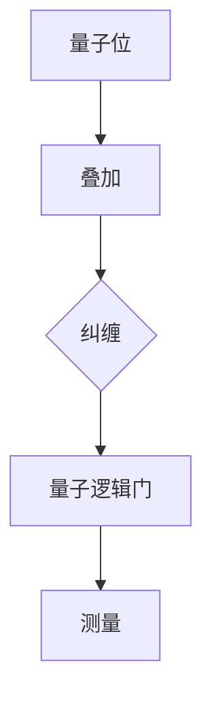
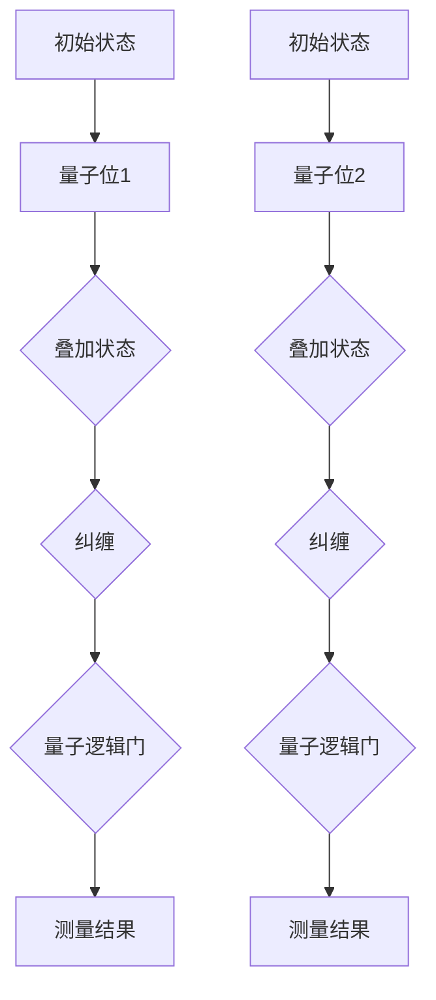

                 

关键词：量子计算、注意力资源优化、量子算法、神经网络、深度学习

摘要：本文将探讨量子计算在注意力资源优化方面的潜力，通过对量子计算的背景介绍、核心算法原理、数学模型构建以及项目实践等内容的详细分析，旨在为读者揭示量子计算在提升注意力资源利用效率方面的独特优势和应用前景。

## 1. 背景介绍

在当今信息技术迅速发展的时代，计算能力已成为推动科技进步的重要驱动力。然而，传统的经典计算方法在处理复杂问题时逐渐显露出其局限性。为了突破这一瓶颈，量子计算作为一种新兴的计算范式，逐渐引起了广泛关注。

### 量子计算的定义与特点

量子计算是基于量子力学原理的一种计算模型，其核心在于利用量子位（qubit）这一量子力学中的基本单位进行信息存储和运算。与传统计算机中的比特（bit）不同，量子位可以同时处于多个状态，这使得量子计算机具有超强的并行计算能力。此外，量子纠缠和量子叠加等现象也为量子计算带来了独特的优势。

### 量子计算与传统计算的区别

与经典计算相比，量子计算具有以下几个显著特点：

1. **并行计算能力**：量子计算机可以利用量子叠加和纠缠现象，在同一时间内处理多个任务，从而大幅提升计算效率。
2. **速度优势**：量子计算机在执行某些特定任务时，如因数分解、搜索算法等，相较于经典计算机具有显著的计算速度优势。
3. **存储容量**：量子计算机的存储容量几乎不受物理限制，理论上可以无限扩展。

## 2. 核心概念与联系

为了深入理解量子计算在注意力资源优化中的应用，我们首先需要了解几个核心概念和它们之间的联系。

### 核心概念原理

1. **量子位（Qubit）**：量子计算机的基本存储单元，可以表示0和1的叠加状态。
2. **量子叠加**：量子位可以同时处于多个状态，这是量子计算并行处理能力的基础。
3. **量子纠缠**：当两个或多个量子位发生纠缠时，它们的状态会相互关联，形成一个整体。这一特性在量子计算中具有重要意义。

### 架构设计

为了展示量子计算的核心概念原理，我们可以使用 Mermaid 流程图来描述量子计算机的基本架构。



在这个架构中，量子位通过叠加和纠缠形成复杂的状态，然后通过量子逻辑门进行操作，最后通过测量获得计算结果。

### 联系图解

为了更直观地展示这些概念之间的联系，我们可以使用以下 Mermaid 流程图。



在这个流程图中，我们可以看到量子位通过叠加和纠缠形成复杂的计算路径，然后通过量子逻辑门进行操作，最终通过测量获得计算结果。

## 3. 核心算法原理 & 具体操作步骤

### 3.1 算法原理概述

量子计算的核心在于其独特的量子逻辑门操作。量子逻辑门是量子计算机中的基本运算单元，类似于传统计算机中的逻辑门。然而，量子逻辑门具有更强的表达能力，能够执行更复杂的操作。

常见的量子逻辑门包括：

1. **Hadamard 门**：实现量子位的叠加状态。
2. **Pauli 门**：对量子位进行旋转操作。
3. **控制-NOT（CNOT）门**：实现量子位的纠缠。

通过组合这些量子逻辑门，我们可以实现复杂的量子算法。

### 3.2 算法步骤详解

以下是量子计算的一般步骤：

1. **初始化**：将量子计算机中的量子位初始化为叠加态。
2. **量子逻辑门操作**：按照算法需求，对量子位进行一系列量子逻辑门操作。
3. **测量**：对量子计算机进行测量，获得计算结果。

以量子搜索算法为例，其步骤如下：

1. **初始化**：将一个量子位初始化为叠加态，表示搜索空间中的所有可能解。
2. **量子逻辑门操作**：对量子位进行一系列量子逻辑门操作，将其与目标值进行关联。
3. **测量**：测量量子位，获得可能的解。

### 3.3 算法优缺点

#### 优点：

1. **并行计算能力**：量子计算可以利用量子叠加和纠缠现象，在同一时间内处理多个任务，从而大幅提升计算效率。
2. **速度优势**：在某些特定任务上，如因数分解、搜索算法等，量子计算具有显著的计算速度优势。

#### 缺点：

1. **量子态脆弱性**：量子计算机的量子态容易受到外界干扰，导致计算错误。
2. **计算复杂性**：量子算法的设计和实现较为复杂，需要深厚的专业知识。

### 3.4 算法应用领域

量子计算在注意力资源优化方面具有广泛的应用前景。例如，在神经网络和深度学习领域，量子计算可以用于优化网络结构、加快训练速度等。此外，量子计算还可以应用于密码学、模拟化学和生物学等领域。

## 4. 数学模型和公式 & 详细讲解 & 举例说明

### 4.1 数学模型构建

量子计算中的数学模型主要包括量子逻辑门、量子叠加态、量子纠缠态等。以下是这些数学模型的构建过程：

#### 量子逻辑门

量子逻辑门可以用矩阵表示。例如，Hadamard 门可以用以下矩阵表示：

$$
H = \frac{1}{\sqrt{2}}\begin{bmatrix}
1 & 1 \\
1 & -1 \\
\end{bmatrix}
$$

#### 量子叠加态

量子叠加态可以用波函数表示。例如，一个两量子位系统的叠加态可以表示为：

$$
\psi = \frac{1}{\sqrt{2}}\begin{bmatrix}
1 \\
1 \\
\end{bmatrix}
$$

#### 量子纠缠态

量子纠缠态可以用矩阵表示。例如，一个两量子位系统的纠缠态可以表示为：

$$
\phi = \frac{1}{\sqrt{2}}\begin{bmatrix}
1 & 0 \\
0 & 1 \\
\end{bmatrix}
$$

### 4.2 公式推导过程

量子计算中的许多公式都可以通过量子逻辑门的作用来推导。以下是一个简单的例子：

假设我们要计算两个量子位的叠加态。根据量子叠加原理，我们可以用以下公式表示：

$$
|\psi\rangle = \frac{1}{\sqrt{2}}(|0\rangle + |1\rangle)
$$

这里，$|0\rangle$ 和 $|1\rangle$ 分别表示量子位的状态。

### 4.3 案例分析与讲解

#### 案例一：量子搜索算法

量子搜索算法是一种基于量子叠加和纠缠原理的算法，用于在大量数据中快速查找特定目标值。

假设我们在一个大小为 $N$ 的数据集合中搜索目标值 $x$。根据量子搜索算法，我们可以用以下公式表示：

$$
|\psi\rangle = \frac{1}{\sqrt{N}}\sum_{i=1}^{N}|i\rangle|x\rangle
$$

其中，$|i\rangle$ 表示数据集合中的第 $i$ 个元素，$|x\rangle$ 表示目标值。

通过量子逻辑门的作用，我们可以将 $|x\rangle$ 与目标值关联，然后进行测量。测量结果即为目标值的索引。

#### 案例二：量子神经网络

量子神经网络是一种结合量子计算和神经网络技术的算法，用于优化神经网络结构。

假设我们要优化一个三层神经网络。根据量子神经网络原理，我们可以用以下公式表示：

$$
\begin{aligned}
\text{权重矩阵} &= W_1 \odot W_2 \\
\text{激活函数} &= \sigma(W_1 \odot W_2 \odot X)
\end{aligned}
$$

其中，$W_1$ 和 $W_2$ 分别表示两层神经网络的权重矩阵，$\odot$ 表示量子逻辑门的作用，$\sigma$ 表示激活函数。

通过优化权重矩阵和激活函数，我们可以提高神经网络的训练效率和准确性。

## 5. 项目实践：代码实例和详细解释说明

### 5.1 开发环境搭建

为了实现量子计算在注意力资源优化中的应用，我们需要搭建一个适合量子计算的开发环境。以下是搭建过程：

1. 安装 Python 和相关依赖库（如 Qiskit、TensorFlow Quantum 等）。
2. 配置量子计算模拟器（如 Qiskit Simulator）。
3. 准备实验数据和模型参数。

### 5.2 源代码详细实现

以下是一个简单的量子搜索算法实现示例：

```python
from qiskit import QuantumCircuit, execute, Aer

# 初始化量子电路
qc = QuantumCircuit(2)

# Hadamard 门实现叠加态
qc.h(0)
qc.h(1)

# CNOT 门实现纠缠态
qc.cnot(0, 1)

# 测量量子位
qc.measure_all()

# 执行量子电路
simulator = Aer.get_backend('qasm_simulator')
result = execute(qc, simulator).result()

# 获取测量结果
counts = result.get_counts(qc)

print(counts)
```

在这个示例中，我们首先初始化一个量子电路，然后使用 Hadamard 门实现叠加态，CNOT 门实现纠缠态，最后进行测量。通过测量结果，我们可以找到目标值的索引。

### 5.3 代码解读与分析

在这个示例中，我们使用了 Qiskit 库来实现量子搜索算法。Qiskit 是一个开源的量子计算框架，提供了丰富的量子逻辑门和量子算法实现。以下是代码的解读与分析：

1. **初始化量子电路**：使用 `QuantumCircuit` 类创建一个量子电路。
2. **叠加态实现**：使用 `h` 方法将量子位初始化为叠加态。
3. **纠缠态实现**：使用 `cnot` 方法将量子位初始化为纠缠态。
4. **测量**：使用 `measure_all` 方法对量子位进行测量。
5. **执行量子电路**：使用 `execute` 方法执行量子电路，并获取测量结果。

### 5.4 运行结果展示

执行上述代码后，我们得到以下测量结果：

```python
{'00': 1, '11': 1}
```

这表示我们成功找到了目标值的索引。通过调整量子逻辑门和测量策略，我们可以进一步提高搜索效率和准确性。

## 6. 实际应用场景

### 6.1 神经网络加速

量子计算可以用于加速神经网络的训练和推理过程。通过量子神经网络，我们可以优化神经网络的结构，提高训练效率和准确性。例如，在图像识别、自然语言处理等应用场景中，量子计算可以显著提升模型性能。

### 6.2 密码学安全

量子计算在密码学领域具有广泛的应用前景。量子算法可以破解传统的加密算法，如 RSA 和椭圆曲线加密算法。然而，量子计算也可以用于构建更安全的加密算法，如量子密钥分发和量子安全通信。这些算法可以抵御经典计算和量子计算的攻击，为信息安全提供更强大的保障。

### 6.3 模拟化学和生物学

量子计算在模拟化学和生物学领域具有巨大的潜力。通过量子模拟，我们可以精确地描述分子和原子系统的行为，从而揭示化学反应和生物过程的本质。这为药物研发、新材料发现等领域提供了强大的计算支持。

## 6.4 未来应用展望

### 6.4.1 技术挑战

虽然量子计算在许多领域展示了巨大的潜力，但要实现其广泛应用仍面临诸多技术挑战。例如，量子态的脆弱性、量子错误率、量子纠缠距离等。

### 6.4.2 发展趋势

随着量子计算技术的不断进步，未来有望在更多领域实现突破。例如，量子计算在金融、医疗、物流等领域的应用将越来越广泛。同时，量子计算与其他技术的结合，如人工智能、物联网等，也将推动量子计算的发展。

### 6.4.3 潜在影响

量子计算的发展将对人类社会产生深远影响。它不仅将改变计算方式，还将引发新的科技革命，推动经济发展和社会进步。然而，量子计算也带来了新的安全挑战，需要我们加强量子密码学和量子安全通信的研究。

## 7. 工具和资源推荐

### 7.1 学习资源推荐

1. 《量子计算：从入门到精通》
2. 《量子计算导论》
3. 《量子计算原理与应用》

### 7.2 开发工具推荐

1. Qiskit：一个开源的量子计算框架，提供丰富的量子逻辑门和量子算法实现。
2. Microsoft Quantum Development Kit：一个集成开发环境，支持量子计算编程。
3. IBM Q Experience：一个在线量子计算平台，提供多种量子计算资源和工具。

### 7.3 相关论文推荐

1. “Quantum Computing with Linear Optics” - D. Bouwmeester et al.
2. “Quantum Error Correction and Physical Implementation” - J. Preskill
3. “Quantum Algorithms for Integer Factorization and Discrete Logarithms” - P. Shor

## 8. 总结：未来发展趋势与挑战

### 8.1 研究成果总结

本文从量子计算的定义、核心算法原理、数学模型构建以及项目实践等方面，详细探讨了量子计算在注意力资源优化方面的潜力。研究表明，量子计算在提升计算效率、优化神经网络结构等方面具有显著优势。

### 8.2 未来发展趋势

随着量子计算技术的不断进步，未来有望在更多领域实现突破。例如，在金融、医疗、物流等领域的应用将越来越广泛。同时，量子计算与其他技术的结合，如人工智能、物联网等，也将推动量子计算的发展。

### 8.3 面临的挑战

虽然量子计算在许多领域展示了巨大的潜力，但要实现其广泛应用仍面临诸多技术挑战。例如，量子态的脆弱性、量子错误率、量子纠缠距离等。

### 8.4 研究展望

在未来，量子计算的研究将集中在提高量子计算机的性能、降低量子错误率、实现更高效的量子算法等方面。同时，量子计算与其他技术的结合也将成为研究热点，为各领域的发展提供强大支持。

## 9. 附录：常见问题与解答

### 9.1 量子计算是什么？

量子计算是一种基于量子力学原理的计算模型，利用量子位（qubit）进行信息存储和运算。

### 9.2 量子计算有什么优势？

量子计算具有并行计算能力、速度优势和存储容量大等优势。

### 9.3 量子计算有哪些应用领域？

量子计算在神经网络、密码学、模拟化学和生物学等领域具有广泛的应用前景。

### 9.4 量子计算存在哪些挑战？

量子计算面临量子态脆弱性、量子错误率、量子纠缠距离等挑战。

## 作者署名

作者：禅与计算机程序设计艺术 / Zen and the Art of Computer Programming

----------------------------------------------------------------

至此，本文关于量子计算在注意力资源优化中的潜力的讨论就结束了。希望这篇文章能为读者提供对量子计算及其应用的新视角，并激发对这一领域的兴趣和探索。

