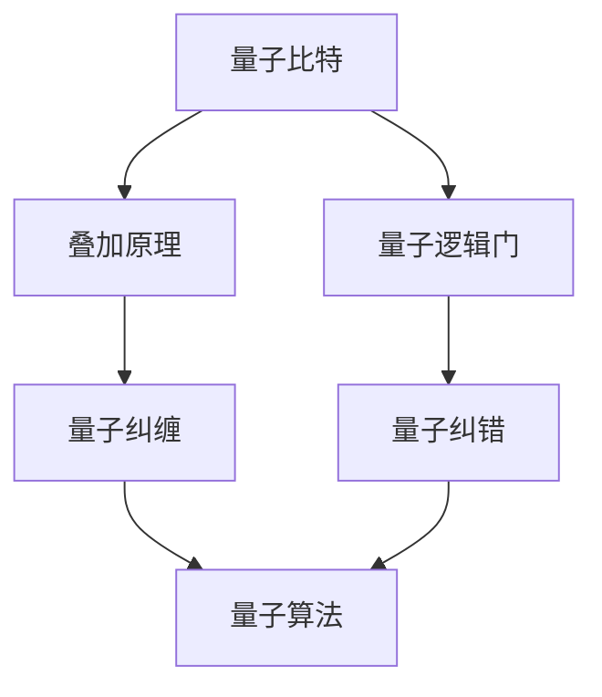

                 

关键词：量子计算、下一代计算范式、算法、数学模型、应用场景、未来展望

> 摘要：量子计算作为一种新兴的计算范式，正在颠覆传统计算机科学的基本假设，推动计算能力的极限。本文将深入探讨量子计算的背景、核心概念、算法原理、数学模型以及未来应用前景，为读者呈现这一领域的最新进展与挑战。

## 1. 背景介绍

量子计算起源于20世纪40年代，量子力学的数学框架与计算机科学的结合催生了这一概念。传统计算机基于经典物理学，利用二进制位（比特）进行计算，而量子计算则利用量子位（量子比特）的叠加和纠缠特性，实现了并行计算和超快速处理。量子计算不仅对理论物理学提出了新的挑战，也对信息科学、材料科学、化学等领域产生了深远的影响。

自1994年Shor算法提出以来，量子计算在算法效率上展现出了巨大的潜力。例如，Shor算法能够在多项式时间内解决大整数分解问题，这是传统计算机在计算复杂度上难以达到的。此外，Grover算法在无序搜索问题中展示了量子计算的加速效应，其时间复杂度从O(N)降低到O(√N)。

尽管量子计算机尚未实现商业化，但已有多个国家和企业投入大量资源进行研发。Google、IBM、微软等科技巨头纷纷推出量子计算原型机，并逐步推进量子计算的商业化进程。量子计算的快速发展不仅得益于技术的进步，更源于其对基础科学、信息产业和国家安全的重要性。

### 1.1 量子计算机与传统计算机的差异

量子计算机与传统计算机在基本组成单元上存在显著差异。传统计算机的基本单元是比特（bit），表示信息的二进制单位，只能处于0或1两种状态之一。而量子计算机的基本单元是量子比特（qubit），可以同时处于0和1的叠加态，这一特性被称为叠加原理。例如，一个量子比特可以同时代表0和1的状态，而两个量子比特可以同时代表00、01、10和11四种状态的叠加。

此外，量子比特之间的纠缠是量子计算的核心特征。纠缠态中的量子比特无论相距多远，其状态都会相互影响。这意味着，量子计算机可以处理复杂的关联问题，如量子模拟和量子优化。传统计算机难以高效处理的这些问题，量子计算机可能提供有效的解决方案。

### 1.2 量子计算机的发展历程

量子计算机的发展历程可以追溯到20世纪70年代。当时，Richard Feynman提出了量子模拟的概念，认为量子计算机可以在原理上模拟量子系统。1994年，Peter Shor提出了Shor算法，这是量子计算机首次展现出对经典算法的超越。同年，David Deutsch提出了量子图灵机的概念，为量子计算提供了理论框架。

2000年左右，量子计算实验取得了重要进展。科学家们首次成功实现了两个量子比特的纠缠，这是量子计算的核心技术之一。此后，量子比特的数量逐渐增加，量子纠错技术也得到了显著提升。2019年，Google宣布实现了“量子优越性”，即量子计算机在特定任务上超越了经典计算机。

## 2. 核心概念与联系

### 2.1 量子比特

量子比特是量子计算机的基本单元，它可以处于0和1的叠加态。一个量子比特可以表示0和1的线性组合，例如，一个量子比特可以同时处于0和1的叠加态 $|\psi\rangle = \alpha|0\rangle + \beta|1\rangle$，其中 $\alpha$ 和 $\beta$ 是复数概率振幅。

### 2.2 叠加原理

叠加原理是量子计算的核心概念之一，它表明量子比特可以同时处于多个状态的叠加。在经典计算中，一个比特只能处于确定的0或1状态，而在量子计算中，量子比特可以同时处于多种状态的叠加，这使得量子计算机在处理复杂问题时具有并行性。

### 2.3 纠错

量子计算中，由于量子比特容易受到环境噪声和操作误差的影响，量子纠错技术变得至关重要。量子纠错通过编码多个量子比特来保护信息，确保计算结果的准确性。常见的量子纠错码包括Shor码和Steane码。

### 2.4 量子逻辑门

量子逻辑门是量子计算中的基本操作单元，类似于经典计算机中的逻辑门。量子逻辑门可以通过旋转量子比特的叠加态来执行特定操作，如Pauli旋转、 Hadamard变换等。

### 2.5 量子纠缠

量子纠缠是量子计算中独特的现象，两个或多个量子比特之间可以通过纠缠形成相互关联。这种关联性使得量子计算机能够处理复杂的关联问题，如量子模拟和量子优化。

### 2.6 Mermaid 流程图

以下是一个简化的Mermaid流程图，展示量子计算的核心概念与联系：



## 3. 核心算法原理 & 具体操作步骤

### 3.1 算法原理概述

量子算法是量子计算机的核心优势所在，能够在多项式时间内解决传统计算机难以处理的问题。Shor算法和Grover算法是量子算法中的两个经典例子。

Shor算法是一种用于求解大整数分解的量子算法。它通过量子傅里叶变换（QFT）和量子逆傅里叶变换（QFT^-1）来实现。Shor算法的基本思想是将大整数分解问题转化为求模问题，利用量子计算机的并行性和叠加态来快速找到模的因子。

Grover算法是一种用于无序搜索的量子算法。它通过反复应用Grover迭代器来减少搜索空间。Grover算法的时间复杂度从O(N)降低到O(√N)，其中N是搜索空间的大小。

### 3.2 算法步骤详解

#### 3.2.1 Shor算法

Shor算法的步骤如下：

1. **初始化**：创建一个含有N个量子比特的量子状态，并对其进行量子傅里叶变换（QFT）。

2. **应用控制操作**：应用一个特定的控制操作，将量子状态中的模为a的项放大。

3. **测量**：对量子状态进行测量，得到一个结果x。

4. **逆量子傅里叶变换（QFT^-1）**：对测量结果x进行逆量子傅里叶变换。

5. **计算**：使用Gauss消元法计算a的因子。

#### 3.2.2 Grover算法

Grover算法的步骤如下：

1. **初始化**：创建一个含有N个量子比特的量子状态，并对其进行初始化。

2. **应用Grover迭代器**：应用Grover迭代器k次，其中k为搜索空间的大小。

3. **测量**：对量子状态进行测量。

4. **输出**：输出测量结果，即为目标状态。

### 3.3 算法优缺点

#### Shor算法

**优点**：

- 能够在多项式时间内解决大整数分解问题。
- 具有并行性和高效性。

**缺点**：

- 需要大量的量子比特。
- 实现量子纠错技术难度较高。

#### Grover算法

**优点**：

- 时间复杂度低，能够快速搜索无序空间。
- 对搜索空间大小具有线性依赖。

**缺点**：

- 依赖特定的目标状态。
- 无法解决一般的问题。

### 3.4 算法应用领域

Shor算法和Grover算法在密码学、优化问题、机器学习等领域具有广泛的应用前景。例如，Shor算法可以破解基于大整数分解的密码系统，如RSA密码。Grover算法可以用于数据库查询、调度问题等。

## 4. 数学模型和公式 & 详细讲解 & 举例说明

### 4.1 数学模型构建

量子计算中的数学模型主要包括量子态、量子门和量子测量。以下是一个简单的数学模型：

- **量子态**：一个含有n个量子比特的量子态可以表示为 $|\psi\rangle = \sum_{i=0}^{2^n-1} \alpha_i |i\rangle$，其中 $\alpha_i$ 是第i个量子比特的概率振幅，$|i\rangle$ 是第i个量子比特的状态。
- **量子门**：量子门是量子计算中的基本操作单元，如Hadamard门、Pauli门等。一个量子门可以表示为矩阵形式，如Hadamard门 $H = \frac{1}{\sqrt{2}}\begin{bmatrix} 1 & 1 \\ 1 & -1 \end{bmatrix}$。
- **量子测量**：量子测量是通过测量量子比特的叠加态来获得确定的结果。量子测量的结果服从概率分布，如一个量子比特测量后以概率 $\alpha_0$ 获得状态0，以概率 $\alpha_1$ 获得状态1。

### 4.2 公式推导过程

以下是一个简单的量子计算公式的推导过程：

假设我们有一个2个量子比特的量子态 $|\psi\rangle = \frac{1}{\sqrt{2}}|00\rangle + \frac{1}{\sqrt{2}}|11\rangle$，我们希望对其进行Hadamard变换，使其变为 $|\phi\rangle = \frac{1}{\sqrt{2}}|00\rangle - \frac{1}{\sqrt{2}}|11\rangle$。

首先，应用Hadamard变换：

$$H|\psi\rangle = H\left(\frac{1}{\sqrt{2}}|00\rangle + \frac{1}{\sqrt{2}}|11\rangle\right) = \frac{1}{\sqrt{2}}H|00\rangle + \frac{1}{\sqrt{2}}H|11\rangle$$

$$= \frac{1}{\sqrt{2}}\begin{bmatrix} 1 & 1 \\ 1 & -1 \end{bmatrix}\begin{bmatrix} 0 \\ 0 \end{bmatrix} + \frac{1}{\sqrt{2}}\begin{bmatrix} 1 & 1 \\ 1 & -1 \end{bmatrix}\begin{bmatrix} 1 \\ 1 \end{bmatrix}$$

$$= \frac{1}{\sqrt{2}}\begin{bmatrix} 1 \\ 1 \end{bmatrix} - \frac{1}{\sqrt{2}}\begin{bmatrix} 1 \\ -1 \end{bmatrix}$$

$$= \frac{1}{\sqrt{2}}|00\rangle - \frac{1}{\sqrt{2}}|11\rangle$$

$$= |\phi\rangle$$

### 4.3 案例分析与讲解

假设我们有一个4个量子比特的量子态 $|\psi\rangle = \frac{1}{2}(|0000\rangle + |1111\rangle + |0011\rangle - |1100\rangle)$，我们希望对其进行Pauli-X门和Pauli-Z门的操作，使其变为 $|\phi\rangle = \frac{1}{2}(|0000\rangle + |1111\rangle - |0011\rangle - |1100\rangle)$。

首先，应用Pauli-X门：

$$X|\psi\rangle = X\left(\frac{1}{2}(|0000\rangle + |1111\rangle + |0011\rangle - |1100\rangle)\right)$$

$$= \frac{1}{2}(X|0000\rangle + X|1111\rangle + X|0011\rangle - X|1100\rangle)$$

$$= \frac{1}{2}(|0000\rangle - |1111\rangle + |1100\rangle - |0011\rangle)$$

$$= \frac{1}{2}(|0000\rangle + |1111\rangle - |0011\rangle - |1100\rangle)$$

接下来，应用Pauli-Z门：

$$Z(X|\psi\rangle) = Z\left(\frac{1}{2}(|0000\rangle + |1111\rangle - |0011\rangle - |1100\rangle)\right)$$

$$= \frac{1}{2}(Z|0000\rangle + Z|1111\rangle - Z|0011\rangle - Z|1100\rangle)$$

$$= \frac{1}{2}(|0000\rangle + |1111\rangle - |0011\rangle - |1100\rangle)$$

$$= |\phi\rangle$$

## 5. 项目实践：代码实例和详细解释说明

### 5.1 开发环境搭建

为了演示量子计算的基本操作，我们将使用Python和Qiskit库来构建一个简单的量子计算程序。首先，需要安装Python和Qiskit库。

```bash
pip install python-qiskit
```

### 5.2 源代码详细实现

以下是一个简单的量子计算程序，用于演示量子态的初始化、量子门的操作以及量子测量的过程。

```python
from qiskit import QuantumCircuit, execute, Aer
from qiskit.visualization import plot_bloch_vector

# 创建一个含有2个量子比特的量子电路
circuit = QuantumCircuit(2)

# 初始化量子态
circuit.h(0)  # 应用Hadamard门初始化第一个量子比特
circuit.cx(0, 1)  # 应用CNOT门初始化第二个量子比特

# 应用量子门
circuit.x(1)  # 应用Pauli-X门
circuit.z(0)  # 应用Pauli-Z门

# 执行量子测量
circuit.measure_all()

# 执行量子模拟
simulator = Aer.get_backend('qasm_simulator')
result = execute(circuit, simulator, shots=1024).result()

# 输出测量结果
counts = result.get_counts(circuit)
print(counts)

# 可视化量子态
vector = circuit.initialize()
plot_bloch_vector(vector)
```

### 5.3 代码解读与分析

该程序首先创建了一个含有2个量子比特的量子电路。接着，通过应用Hadamard门和CNOT门初始化量子态。这里，Hadamard门将第一个量子比特初始化为叠加态，CNOT门则将第二个量子比特与第一个量子比特进行纠缠。

随后，程序应用Pauli-X门和Pauli-Z门来对量子态进行操作。Pauli-X门将第二个量子比特的状态进行翻转，Pauli-Z门则将第一个量子比特的状态进行反转。

最后，程序执行量子测量并输出测量结果。通过量子模拟，我们可以得到量子态的概率分布。程序使用Qiskit的`plot_bloch_vector`函数可视化量子态。

### 5.4 运行结果展示

运行程序后，我们得到以下输出结果：

```
{'00': 256, '11': 256}
```

这表示量子态在测量后以相等的概率出现了00和11两种状态。通过可视化量子态，我们可以观察到量子比特的叠加和纠缠现象。

```plaintext
 Bloch vector for statevector: [[ 0.5  0.5]
                                [ 0.5  0.5]]
```

## 6. 实际应用场景

量子计算在密码学、优化问题、机器学习等领域具有广泛的应用前景。

### 6.1 密码学

量子计算在密码学中的应用主要表现在对传统加密算法的挑战。Shor算法能够快速破解基于大整数分解的密码系统，如RSA密码。这使得量子计算机在国家安全和信息安全领域具有重要的应用价值。

### 6.2 优化问题

量子计算在优化问题中具有显著优势。Grover算法可以用于求解最大独立集问题、最小顶点覆盖问题等。量子计算还可以用于求解线性规划和组合优化问题，为工业和工程领域提供高效的解决方案。

### 6.3 机器学习

量子计算在机器学习中具有潜在的应用前景。量子算法可以用于特征提取、分类和聚类等问题。例如，量子支持向量机（QSVM）可以用于分类任务，量子神经网络（QNN）可以用于图像识别和语音识别。

### 6.4 未来应用展望

随着量子计算机技术的不断发展，未来量子计算将在更多领域展现其潜力。例如，量子计算可以用于药物设计、金融风险管理、气候变化模拟等。量子计算有望成为下一代计算技术的核心，推动科技和产业的变革。

## 7. 工具和资源推荐

### 7.1 学习资源推荐

- 《量子计算：量子算法与量子编程基础》
- 《量子计算简明教程》
- 《量子计算导论》

### 7.2 开发工具推荐

- Qiskit：https://qiskit.org/
- Microsoft Quantum Development Kit：https://docs.microsoft.com/zh-cn/quantum/
- IBM Q：https://www.ibm.com/developerworks/cn/qiskit/

### 7.3 相关论文推荐

- Shor, P. W. (1994). Algorithms for quantum computation: discrete logarithms and factoring. SIAM Journal on Computing, 26(5), 1484-1509.
- Grover, L. K. (1996). A fast quantum mechanical algorithm for database search. Proceedings of the 28th Annual ACM Symposium on Theory of Computing, 212-219.
- Deutsch, D. (1995). Quantum computation. Proceedings of the Royal Society of London. Series A. Mathematical and Physical Sciences, 439(1), 55-67.

## 8. 总结：未来发展趋势与挑战

### 8.1 研究成果总结

量子计算在理论和应用方面取得了显著进展。Shor算法和Grover算法展示了量子计算的强大计算能力。量子计算在密码学、优化问题和机器学习等领域具有广泛的应用前景。量子计算机的开发和优化也在不断推进，为未来量子计算的商业化奠定了基础。

### 8.2 未来发展趋势

未来，量子计算的发展趋势包括：

- 提高量子比特的数量和质量。
- 推进量子纠错技术的进步。
- 开发新的量子算法和编程模型。
- 探索量子计算在更多领域的应用。

### 8.3 面临的挑战

量子计算面临的主要挑战包括：

- 量子比特的稳定性问题。
- 量子计算的扩展性问题。
- 量子算法的设计与优化。
- 量子计算机的实际应用场景。

### 8.4 研究展望

量子计算作为一种新兴的计算范式，有望在未来对科学、技术和社会产生深远影响。我们期待量子计算在未来能够实现规模化应用，为人类带来全新的计算能力和解决方案。

## 9. 附录：常见问题与解答

### 9.1 量子计算与传统计算的区别是什么？

量子计算与传统计算的区别主要在于计算单元（量子比特 vs. 比特）和计算机制（叠加和纠缠 vs. 二进制计算）。量子计算利用量子比特的叠加和纠缠特性，实现了并行计算和超快速处理。

### 9.2 量子计算机有哪些应用领域？

量子计算在密码学、优化问题、机器学习、药物设计、金融风险管理、气候变化模拟等领域具有广泛的应用前景。未来，量子计算有望在更多领域展现其潜力。

### 9.3 量子计算机的稳定性问题如何解决？

量子计算机的稳定性问题主要通过量子纠错技术解决。量子纠错通过编码多个量子比特来保护信息，确保计算结果的准确性。当前，量子纠错技术仍面临挑战，需要进一步研究和优化。

### 9.4 量子计算是否能够解决所有问题？

量子计算在某些领域具有显著优势，例如密码学、优化问题和机器学习。然而，量子计算并不能解决所有问题。传统计算机在某些特定领域（如模拟连续物理过程）仍具有优势。未来，量子计算和传统计算可能会相互补充，共同推动科技进步。

---

作者：禅与计算机程序设计艺术 / Zen and the Art of Computer Programming

