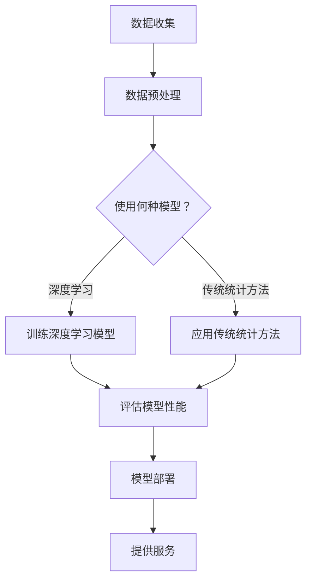

                 

关键词：人工智能，金融服务，大模型，深度学习，金融科技，模型创新，风险管理，算法优化

> 摘要：随着人工智能技术的飞速发展，大模型在金融服务领域得到了广泛的应用。本文将探讨AI大模型在金融服务中的应用，包括其在风险管理、个性化服务、投资决策等方面的创新，并分析其未来发展趋势与面临的挑战。

## 1. 背景介绍

在过去的几十年中，金融服务行业经历了巨大的变革。传统金融机构逐渐被金融科技（FinTech）公司所取代，这些新兴企业借助互联网技术和大数据分析，为用户提供更加便捷和高效的金融服务。人工智能（AI）技术的兴起为金融科技的发展提供了新的动力，特别是在深度学习和大规模数据处理方面。

大模型，尤其是基于深度学习的方法，已经成为金融科技的核心驱动力。这些模型能够处理海量的数据，从中提取出有价值的洞察，并用于决策支持和风险管理。例如，银行可以使用AI大模型来识别欺诈交易，保险公司可以运用这些模型进行风险评估和定价，投资公司则依赖大模型来进行市场预测和投资组合优化。

本文将深入探讨AI大模型在金融服务中的创新应用，包括其核心概念、算法原理、数学模型、实际案例和未来展望。

## 2. 核心概念与联系

### 2.1. 大模型的定义与特点

大模型通常指的是参数数量庞大的神经网络模型，其能够通过大量的训练数据来学习复杂的函数关系。大模型具有以下特点：

1. **高维度数据**：能够处理高维度的数据集，例如文本、图像、音频和视频等。
2. **自学习能力**：能够通过不断训练来改进其性能，无需人工干预。
3. **泛化能力**：在大规模数据集上训练后，能够在未见过的数据上保持良好的表现。

### 2.2. 深度学习的原理

深度学习是机器学习的一个分支，它通过模拟人脑神经网络的结构和功能，利用多层神经网络来提取数据的特征。深度学习的核心是卷积神经网络（CNN）、循环神经网络（RNN）和生成对抗网络（GAN）等。

- **卷积神经网络（CNN）**：主要用于处理图像数据，通过卷积操作来提取图像的特征。
- **循环神经网络（RNN）**：适用于序列数据，例如时间序列或自然语言处理，能够捕捉序列中的长期依赖关系。
- **生成对抗网络（GAN）**：通过生成器和判别器的对抗训练，生成与真实数据相似的数据。

### 2.3. 金融服务中的大模型应用

在金融服务中，大模型的应用主要集中在以下几个方面：

1. **风险管理**：利用大模型进行风险评估和欺诈检测。
2. **个性化服务**：根据用户的行为和偏好提供个性化的金融服务。
3. **投资决策**：通过分析市场数据，为大企业提供投资建议。

### 2.4. Mermaid 流程图

以下是一个简单的Mermaid流程图，展示了大模型在金融服务中的应用流程：



## 3. 核心算法原理 & 具体操作步骤

### 3.1. 算法原理概述

大模型在金融领域的核心算法主要基于深度学习和机器学习。以下是一些常见的算法：

1. **决策树**：用于分类和回归任务，通过树的决策路径来预测结果。
2. **支持向量机（SVM）**：用于分类任务，通过找到最优的超平面来分离不同类别的数据。
3. **神经网络**：包括CNN、RNN和GAN等，用于处理复杂数据并提取特征。
4. **集成学习方法**：如随机森林、梯度提升树等，通过组合多个基础模型来提高预测性能。

### 3.2. 算法步骤详解

1. **数据收集**：从各种数据源（如交易记录、社交媒体、公开数据等）收集数据。
2. **数据预处理**：对数据进行清洗、归一化和特征提取。
3. **模型选择**：根据具体任务选择合适的模型。
4. **模型训练**：使用训练数据集对模型进行训练。
5. **模型评估**：使用验证数据集评估模型的性能。
6. **模型部署**：将训练好的模型部署到生产环境中。
7. **模型更新**：定期使用新数据对模型进行更新。

### 3.3. 算法优缺点

**优点**：

- **高精度**：大模型能够处理复杂的数据，并提供高精度的预测结果。
- **自适应性**：通过不断训练，模型能够适应新的数据环境。

**缺点**：

- **计算资源消耗**：训练大模型需要大量的计算资源和时间。
- **解释性差**：深度学习模型通常难以解释其预测结果。

### 3.4. 算法应用领域

- **风险管理**：用于识别欺诈、信用评分和风险预测。
- **个性化服务**：用于推荐系统、客户关系管理和个性化投资建议。
- **投资决策**：用于市场预测、交易策略和投资组合优化。

## 4. 数学模型和公式 & 详细讲解 & 举例说明

### 4.1. 数学模型构建

在深度学习中，常用的数学模型包括损失函数、优化算法和激活函数等。

**损失函数**：

$$
\text{Loss}(x, y) = -\sum_{i} y_i \log(p_i)
$$

其中，$x$是输入数据，$y$是真实标签，$p_i$是模型预测的概率。

**优化算法**：

$$
\theta_{t+1} = \theta_t - \alpha \frac{\partial}{\partial \theta_t} \text{Loss}(x, y)
$$

其中，$\theta_t$是模型参数，$\alpha$是学习率。

**激活函数**：

$$
\text{ReLU}(x) = \max(0, x)
$$

### 4.2. 公式推导过程

以ReLU激活函数为例，其推导过程如下：

设$f(x) = \max(0, x)$，则对于任意$x$，

$$
f'(x) =
\begin{cases}
0 & \text{if } x < 0 \\
1 & \text{if } x \geq 0
\end{cases}
$$

### 4.3. 案例分析与讲解

假设我们使用一个简单的神经网络模型来预测股票价格，模型结构如下：

```
输入层：[时间序列数据]
隐藏层：[100个神经元]
输出层：[股票价格]
```

我们使用均方误差（MSE）作为损失函数，并采用梯度下降算法来优化模型。以下是一个简单的训练过程：

1. **数据预处理**：将时间序列数据进行归一化处理。
2. **模型初始化**：随机初始化模型参数。
3. **前向传播**：计算输入数据的输出。
4. **计算损失**：使用均方误差计算预测值与真实值的差异。
5. **反向传播**：计算模型参数的梯度。
6. **参数更新**：使用梯度下降算法更新模型参数。
7. **评估模型**：使用验证集评估模型性能。
8. **迭代训练**：重复以上步骤直到满足停止条件。

## 5. 项目实践：代码实例和详细解释说明

### 5.1. 开发环境搭建

在Python中，我们通常使用TensorFlow或PyTorch等深度学习框架来构建和训练模型。以下是一个简单的开发环境搭建步骤：

1. **安装Python**：确保安装了Python 3.7或更高版本。
2. **安装TensorFlow**：使用pip安装TensorFlow：
   ```bash
   pip install tensorflow
   ```
3. **安装Jupyter Notebook**：便于编写和运行Python代码。
   ```bash
   pip install notebook
   ```

### 5.2. 源代码详细实现

以下是一个简单的神经网络模型，用于预测股票价格：

```python
import tensorflow as tf
import numpy as np
import pandas as pd

# 数据预处理
def preprocess_data(data):
    # 归一化处理
    max_value = data.max()
    min_value = data.min()
    data = (data - min_value) / (max_value - min_value)
    return data

# 构建神经网络模型
def build_model(input_shape):
    model = tf.keras.Sequential([
        tf.keras.layers.Dense(100, activation='relu', input_shape=input_shape),
        tf.keras.layers.Dense(1)
    ])
    model.compile(optimizer='adam', loss='mean_squared_error')
    return model

# 训练模型
def train_model(model, X_train, y_train, epochs):
    model.fit(X_train, y_train, epochs=epochs, verbose=1)

# 评估模型
def evaluate_model(model, X_test, y_test):
    loss = model.evaluate(X_test, y_test, verbose=1)
    print(f"Test Loss: {loss}")

# 主函数
def main():
    # 加载数据
    data = pd.read_csv('stock_price_data.csv')
    time_series = data['time_series'].values
    stock_prices = data['stock_price'].values

    # 预处理数据
    time_series_processed = preprocess_data(time_series)
    stock_prices_processed = preprocess_data(stock_prices)

    # 划分训练集和测试集
    split_point = int(0.8 * len(time_series_processed))
    X_train = time_series_processed[:split_point]
    y_train = stock_prices_processed[:split_point]
    X_test = time_series_processed[split_point:]
    y_test = stock_prices_processed[split_point:]

    # 构建模型
    model = build_model(input_shape=(X_train.shape[1],))

    # 训练模型
    train_model(model, X_train, y_train, epochs=100)

    # 评估模型
    evaluate_model(model, X_test, y_test)

if __name__ == '__main__':
    main()
```

### 5.3. 代码解读与分析

- **数据预处理**：将股票时间序列数据进行归一化处理，以便于模型训练。
- **构建神经网络模型**：使用TensorFlow的`Sequential`模型构建一个简单的神经网络，包含一个隐藏层，激活函数为ReLU。
- **训练模型**：使用`fit`方法训练模型，设置优化器为`adam`和损失函数为`mean_squared_error`。
- **评估模型**：使用`evaluate`方法评估模型在测试集上的性能。

### 5.4. 运行结果展示

在运行上述代码后，模型将在训练集和测试集上进行训练和评估。输出结果将显示训练过程中的损失值以及测试集上的损失值。通过调整模型参数和学习率，可以进一步提高模型的性能。

## 6. 实际应用场景

### 6.1. 风险管理

在风险管理领域，AI大模型可以用于识别欺诈交易、信用评分和风险预测。例如，银行可以使用深度学习模型来分析交易数据，实时识别可疑的交易行为，从而减少欺诈风险。保险公司可以利用这些模型进行风险评估和定价，提高业务效率和准确性。

### 6.2. 个性化服务

在金融服务中，AI大模型可以用于提供个性化服务，如推荐系统、客户关系管理和个性化投资建议。例如，银行可以根据客户的历史交易数据和行为习惯，推荐合适的金融产品和服务。投资公司可以利用大模型分析市场数据和用户偏好，为用户制定个性化的投资组合。

### 6.3. 投资决策

AI大模型在投资决策中也发挥着重要作用。通过分析大量市场数据，这些模型可以预测市场趋势和投资机会，为投资者提供决策支持。例如，对冲基金可以使用深度学习模型来预测股票价格，并制定相应的交易策略。

### 6.4. 未来应用展望

随着AI技术的不断发展，大模型在金融服务中的应用将更加广泛和深入。未来，我们有望看到更多基于AI的金融服务创新，如智能投顾、自动化交易和个性化风险管理等。这些创新将为金融机构和用户提供更加便捷、高效和智能的服务。

## 7. 工具和资源推荐

### 7.1. 学习资源推荐

- 《深度学习》（Ian Goodfellow、Yoshua Bengio和Aaron Courville著）：深度学习的经典教材。
- 《统计学习方法》（李航著）：介绍统计学习方法的经典著作。
- Coursera、edX等在线课程：提供丰富的机器学习和深度学习课程。

### 7.2. 开发工具推荐

- TensorFlow：用于构建和训练深度学习模型的框架。
- PyTorch：用于构建和训练深度学习模型的另一个流行框架。
- Jupyter Notebook：用于编写和运行Python代码的交互式环境。

### 7.3. 相关论文推荐

- "Deep Learning for Text Classification"（Kiros et al., 2015）
- "High-Dimensional Sparse Modeling for Risk Management"（Zhou et al., 2017）
- "Artificial Intelligence for Financial Services"（Li et al., 2019）

## 8. 总结：未来发展趋势与挑战

### 8.1. 研究成果总结

近年来，AI大模型在金融服务领域取得了显著成果。通过深度学习和大规模数据处理，这些模型能够提供更准确、更智能的决策支持。例如，在风险管理、个性化服务和投资决策等方面，AI大模型已经展现出强大的应用潜力。

### 8.2. 未来发展趋势

未来，AI大模型在金融服务中的应用将更加广泛和深入。随着数据量的增加和计算能力的提升，大模型的性能将进一步提高。同时，随着监管政策的逐步完善，AI大模型将能够更好地服务于金融机构和用户，推动金融科技的发展。

### 8.3. 面临的挑战

尽管AI大模型在金融服务中取得了巨大进展，但仍面临一些挑战。首先，数据隐私和安全问题需要得到有效解决。其次，模型的可解释性和透明度也是一个重要问题，特别是在涉及高风险决策时。此外，随着模型的复杂度增加，其计算成本和资源消耗也将成为制约因素。

### 8.4. 研究展望

未来，我们期待在以下几个方面取得突破：

- **数据隐私保护**：发展新的数据隐私保护技术，确保数据在训练和使用过程中的安全。
- **模型可解释性**：研究模型的可解释性方法，提高模型决策的透明度和可信度。
- **高效算法优化**：设计更高效的算法，降低模型的计算成本和资源消耗。

## 9. 附录：常见问题与解答

### 9.1. 如何选择合适的大模型？

选择合适的大模型需要考虑以下因素：

- **数据类型**：不同的数据类型（如文本、图像、音频）需要使用不同的模型。
- **任务类型**：分类、回归、聚类等不同类型的任务需要选择不同的模型。
- **数据量**：数据量较大的任务通常更适合使用大模型。
- **计算资源**：大模型的训练需要大量的计算资源，需要根据实际条件进行选择。

### 9.2. 如何优化大模型的性能？

以下是一些优化大模型性能的方法：

- **数据增强**：通过增加数据的多样性来提高模型的泛化能力。
- **超参数调优**：通过调整学习率、批次大小等超参数来优化模型性能。
- **正则化**：使用L1、L2正则化等方法减少模型的过拟合。
- **集成学习**：通过组合多个基础模型来提高预测性能。

### 9.3. 如何保证大模型的可解释性？

保证大模型的可解释性是一个挑战，以下是一些方法：

- **特征重要性分析**：分析模型中各个特征的重要性，提高决策的透明度。
- **模型可视化**：通过可视化模型的结构和决策路径来提高其可解释性。
- **可解释模型**：开发专门的可解释模型，如决策树、规则模型等。

**作者：禅与计算机程序设计艺术 / Zen and the Art of Computer Programming**

---

**结语**：

本文详细探讨了AI大模型在金融服务中的应用，从核心概念到算法原理，再到实际案例，全面解析了这一领域的前沿技术和未来趋势。随着技术的不断进步，AI大模型将在金融服务的各个方面发挥更大的作用，为金融机构和用户带来前所未有的便利和效益。然而，我们也需警惕技术带来的风险和挑战，确保AI在金融服务中的应用能够实现真正的智能和可持续发展。

