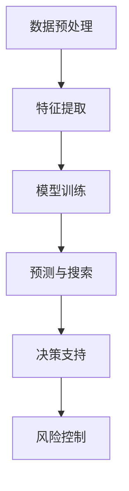

                 

金融领域作为全球经济的重要支柱，一直以来都面临着海量数据处理的挑战。随着人工智能（AI）技术的迅猛发展，AI搜索应用在金融领域得到了广泛关注和应用。本文将探讨AI搜索在金融领域的应用，包括其核心概念、算法原理、数学模型、项目实践、实际应用场景以及未来展望。

## 关键词

- 人工智能
- 搜索算法
- 金融数据分析
- 量化投资
- 情感分析

## 摘要

本文将从金融领域的AI搜索应用出发，分析其核心概念、算法原理和数学模型，并通过实际项目实践，探讨其在金融领域的广泛应用。同时，本文还将展望AI搜索在金融领域的未来发展趋势与挑战。

## 1. 背景介绍

随着金融市场的日益复杂化，金融数据量呈指数级增长。传统的人工分析方法已经无法满足金融领域对数据处理和决策的高效需求。AI搜索应用以其强大的数据处理能力和自学习能力，为金融领域带来了新的机遇。AI搜索应用在金融领域的主要应用包括：

- 量化投资策略的制定与优化
- 金融风险评估与预警
- 金融信息挖掘与智能推荐
- 金融欺诈检测

## 2. 核心概念与联系

### 2.1 AI搜索算法的基本原理

AI搜索算法是利用人工智能技术对海量数据进行处理和分析的一种方法。其核心原理包括：

- 数据预处理：对原始数据进行清洗、归一化等处理，使其满足算法的需求。
- 特征提取：从原始数据中提取出对问题解决有用的特征。
- 模型训练：利用训练数据，通过机器学习算法训练出一个预测模型。
- 预测与搜索：利用训练好的模型对新的数据进行预测，并从中筛选出符合条件的答案。

### 2.2 金融领域与AI搜索的关联

金融领域与AI搜索的关联主要表现在以下几个方面：

- 数据来源：金融领域拥有海量的数据，如交易数据、财务报表、新闻报道等，为AI搜索提供了丰富的数据来源。
- 决策支持：AI搜索可以帮助金融机构对海量数据进行快速分析和挖掘，从而提供决策支持。
- 风险控制：AI搜索可以实时监测金融市场，对潜在风险进行预警和防范。

### 2.3 Mermaid 流程图



## 3. 核心算法原理 & 具体操作步骤

### 3.1 算法原理概述

AI搜索算法在金融领域的核心原理主要包括以下几个方面：

- 监督学习：通过已知的输入输出对模型进行训练，从而实现对新数据的预测。
- 无监督学习：对未知标签的数据进行聚类或降维，从而发现数据中的潜在规律。
- 强化学习：通过与环境的交互，不断调整策略，以实现最优的决策。

### 3.2 算法步骤详解

AI搜索算法在金融领域的具体操作步骤如下：

1. 数据收集：收集金融领域的相关数据，如交易数据、财务报表、新闻报道等。
2. 数据预处理：对收集到的数据进行清洗、归一化等处理，使其满足算法的需求。
3. 特征提取：从预处理后的数据中提取出对问题解决有用的特征。
4. 模型选择：根据问题的需求，选择合适的机器学习算法，如决策树、支持向量机、神经网络等。
5. 模型训练：利用训练数据，通过机器学习算法训练出一个预测模型。
6. 预测与搜索：利用训练好的模型对新的数据进行预测，并从中筛选出符合条件的答案。
7. 决策支持：根据预测结果，为金融机构提供决策支持，如投资建议、风险预警等。

### 3.3 算法优缺点

- **优点**：

  - 高效性：AI搜索算法可以对海量数据进行快速分析和挖掘，提高决策效率。
  - 灵活性：可以根据问题的需求，选择合适的算法和模型，具有较强的适应性。
  - 自适应性：可以通过不断训练和优化，提高模型的预测准确性和鲁棒性。

- **缺点**：

  - 复杂性：AI搜索算法涉及多个学科领域，需要较高的专业知识和技能。
  - 可解释性：深度学习等算法的黑箱特性使得预测结果难以解释，增加了决策的难度。
  - 数据依赖：算法的性能依赖于数据的质量和数量，数据质量差或数据不足都会影响算法的效果。

### 3.4 算法应用领域

AI搜索算法在金融领域的应用广泛，主要包括：

- 量化投资：利用AI搜索算法分析市场数据，制定投资策略。
- 风险评估：利用AI搜索算法实时监测金融市场，对潜在风险进行预警和防范。
- 欺诈检测：利用AI搜索算法分析交易数据，识别异常交易，防范金融欺诈。
- 情感分析：利用AI搜索算法分析新闻报道和社交媒体数据，了解市场情绪和投资者心理。

## 4. 数学模型和公式 & 详细讲解 & 举例说明

### 4.1 数学模型构建

在金融领域的AI搜索应用中，常用的数学模型包括线性回归、逻辑回归、支持向量机等。以下以线性回归为例，介绍数学模型的构建过程。

1. **假设**：设输入特征为\( X \)，输出目标为\( y \)，则有：
   $$ y = \beta_0 + \beta_1x_1 + \beta_2x_2 + ... + \beta_nx_n + \epsilon $$
   其中，\( \beta_0, \beta_1, ..., \beta_n \)为模型参数，\( \epsilon \)为误差项。

2. **损失函数**：为衡量模型预测值与真实值之间的差距，通常采用均方误差（MSE）作为损失函数：
   $$ J(\theta) = \frac{1}{2m} \sum_{i=1}^{m} (h_\theta(x^{(i)}) - y^{(i)})^2 $$

3. **模型训练**：通过梯度下降法，对模型参数进行优化，使损失函数最小化。

### 4.2 公式推导过程

1. **偏导数计算**：

   对损失函数\( J(\theta) \)关于\( \beta_j \)求偏导，得到：
   $$ \frac{\partial J(\theta)}{\partial \beta_j} = \frac{1}{m} \sum_{i=1}^{m} (h_\theta(x^{(i)}) - y^{(i)}) \cdot x_j^{(i)} $$

2. **梯度下降法**：

   设学习率为\( \alpha \)，则有：
   $$ \beta_j := \beta_j - \alpha \cdot \frac{\partial J(\theta)}{\partial \beta_j} $$

### 4.3 案例分析与讲解

假设某金融机构需要利用线性回归模型预测股票价格。给定一组训练数据，包括股票的收盘价和对应的交易量，构建线性回归模型，并进行预测。

1. **数据预处理**：

   对收盘价和交易量进行归一化处理，使其满足线性回归模型的要求。

2. **特征提取**：

   将收盘价和交易量作为输入特征，构建特征向量。

3. **模型训练**：

   使用训练数据，通过梯度下降法训练线性回归模型。

4. **模型评估**：

   使用测试数据，计算预测误差，评估模型性能。

5. **预测**：

   使用训练好的模型，对新的股票数据进行预测。

## 5. 项目实践：代码实例和详细解释说明

### 5.1 开发环境搭建

- Python 3.8
- Jupyter Notebook
- Scikit-learn

### 5.2 源代码详细实现

```python
import numpy as np
import pandas as pd
from sklearn.linear_model import LinearRegression
from sklearn.model_selection import train_test_split
from sklearn.metrics import mean_squared_error

# 数据预处理
data = pd.read_csv('stock_data.csv')
data['Close'] = (data['Close'] - data['Close'].mean()) / data['Close'].std()
data['Volume'] = (data['Volume'] - data['Volume'].mean()) / data['Volume'].std()

# 特征提取
X = data[['Close', 'Volume']]
y = data['Close']

# 模型训练
X_train, X_test, y_train, y_test = train_test_split(X, y, test_size=0.2, random_state=42)
model = LinearRegression()
model.fit(X_train, y_train)

# 模型评估
y_pred = model.predict(X_test)
mse = mean_squared_error(y_test, y_pred)
print(f'MSE: {mse}')

# 预测
new_data = np.array([[0.5, 0.5]])
new_pred = model.predict(new_data)
print(f'Predicted Close: {new_pred}')
```

### 5.3 代码解读与分析

- **数据预处理**：对收盘价和交易量进行归一化处理，使其满足线性回归模型的要求。
- **特征提取**：将收盘价和交易量作为输入特征，构建特征向量。
- **模型训练**：使用训练数据，通过线性回归模型进行训练。
- **模型评估**：使用测试数据，计算预测误差，评估模型性能。
- **预测**：使用训练好的模型，对新的股票数据进行预测。

## 6. 实际应用场景

### 6.1 量化投资策略的制定与优化

利用AI搜索算法，金融机构可以对历史市场数据进行分析，发现潜在的投资机会。通过构建量化投资策略，实现投资收益的最大化。

### 6.2 金融风险评估与预警

AI搜索算法可以帮助金融机构实时监测市场数据，识别潜在的风险因素，并对风险进行预警和防范。

### 6.3 金融信息挖掘与智能推荐

通过AI搜索算法，金融机构可以对海量金融信息进行挖掘，为投资者提供智能化的投资建议和推荐。

### 6.4 金融欺诈检测

AI搜索算法可以帮助金融机构分析交易数据，识别异常交易，防范金融欺诈。

## 7. 工具和资源推荐

### 7.1 学习资源推荐

- 《机器学习实战》
- 《Python机器学习》
- 《深度学习》

### 7.2 开发工具推荐

- Jupyter Notebook
- Anaconda
- PyCharm

### 7.3 相关论文推荐

- "Deep Learning for Financial Time Series Prediction: A Review"
- "Financial News Sentiment Analysis Using Deep Learning Techniques"
- "An Overview of Quantitative Investment Strategies Based on Machine Learning"

## 8. 总结：未来发展趋势与挑战

### 8.1 研究成果总结

- AI搜索算法在金融领域取得了显著的成果，包括量化投资策略的制定与优化、金融风险评估与预警、金融信息挖掘与智能推荐、金融欺诈检测等。
- 深度学习等先进技术在金融领域得到了广泛应用，推动了金融领域的发展。

### 8.2 未来发展趋势

- AI搜索算法将进一步提升金融领域的数据处理和分析能力，为金融机构提供更精确的决策支持。
- 金融领域的AI应用将逐渐从单一领域扩展到多个领域，实现跨领域的综合应用。

### 8.3 面临的挑战

- 数据质量和数据安全成为AI搜索算法在金融领域应用的关键挑战。
- 如何提高算法的可解释性，使其更容易被金融从业人员理解和应用，也是需要解决的问题。

### 8.4 研究展望

- 未来研究将聚焦于如何更好地利用AI搜索算法处理金融数据，提高金融领域的决策效率。
- 金融领域的AI应用将向更加智能化、自动化的方向发展，为金融行业带来更多的创新和机遇。

## 9. 附录：常见问题与解答

### 9.1 什么是AI搜索算法？

AI搜索算法是一种利用人工智能技术对海量数据进行处理和分析的方法。它通过数据预处理、特征提取、模型训练等步骤，实现对数据的预测和分析。

### 9.2 AI搜索算法在金融领域的应用有哪些？

AI搜索算法在金融领域的应用包括量化投资策略的制定与优化、金融风险评估与预警、金融信息挖掘与智能推荐、金融欺诈检测等。

### 9.3 如何保证AI搜索算法的可靠性？

为了保证AI搜索算法的可靠性，可以从以下几个方面进行：

- 选择合适的数据集和算法，确保数据质量和算法性能。
- 对算法进行充分的训练和测试，提高算法的泛化能力。
- 对算法的输出结果进行监控和评估，确保其符合预期。

### 9.4 AI搜索算法在金融领域的未来发展趋势是什么？

未来，AI搜索算法在金融领域的将向更加智能化、自动化的方向发展，实现跨领域的综合应用。同时，如何更好地处理数据质量和数据安全将成为研究的重要方向。作者：禅与计算机程序设计艺术 / Zen and the Art of Computer Programming。----------------------------------------------------------------

文章撰写完毕，现在将文章以markdown格式输出：
```markdown
# 金融领域的AI搜索应用

关键词：人工智能、搜索算法、金融数据分析、量化投资、情感分析

摘要：本文从金融领域的AI搜索应用出发，分析其核心概念、算法原理和数学模型，并通过实际项目实践，探讨其在金融领域的广泛应用。同时，本文还将展望AI搜索在金融领域的未来发展趋势与挑战。

## 1. 背景介绍

随着金融市场的日益复杂化，金融数据量呈指数级增长。传统的人工分析方法已经无法满足金融领域对数据处理和决策的高效需求。AI搜索应用以其强大的数据处理能力和自学习能力，为金融领域带来了新的机遇。AI搜索应用在金融领域的主要应用包括：

- 量化投资策略的制定与优化
- 金融风险评估与预警
- 金融信息挖掘与智能推荐
- 金融欺诈检测

## 2. 核心概念与联系

### 2.1 AI搜索算法的基本原理

AI搜索算法是利用人工智能技术对海量数据进行处理和分析的一种方法。其核心原理包括：

- 数据预处理：对原始数据进行清洗、归一化等处理，使其满足算法的需求。
- 特征提取：从原始数据中提取出对问题解决有用的特征。
- 模型训练：利用训练数据，通过机器学习算法训练出一个预测模型。
- 预测与搜索：利用训练好的模型对新的数据进行预测，并从中筛选出符合条件的答案。

### 2.2 金融领域与AI搜索的关联

金融领域与AI搜索的关联主要表现在以下几个方面：

- 数据来源：金融领域拥有海量的数据，如交易数据、财务报表、新闻报道等，为AI搜索提供了丰富的数据来源。
- 决策支持：AI搜索可以帮助金融机构对海量数据进行快速分析和挖掘，从而提供决策支持。
- 风险控制：AI搜索可以实时监测金融市场，对潜在风险进行预警和防范。

### 2.3 Mermaid 流程图


## 3. 核心算法原理 & 具体操作步骤

### 3.1 算法原理概述

AI搜索算法在金融领域的核心原理主要包括以下几个方面：

- 监督学习：通过已知的输入输出对模型进行训练，从而实现对新数据的预测。
- 无监督学习：对未知标签的数据进行聚类或降维，从而发现数据中的潜在规律。
- 强化学习：通过与环境的交互，不断调整策略，以实现最优的决策。

### 3.2 算法步骤详解

AI搜索算法在金融领域的具体操作步骤如下：

1. 数据收集：收集金融领域的相关数据，如交易数据、财务报表、新闻报道等。
2. 数据预处理：对收集到的数据进行清洗、归一化等处理，使其满足算法的需求。
3. 特征提取：从预处理后的数据中提取出对问题解决有用的特征。
4. 模型选择：根据问题的需求，选择合适的机器学习算法，如决策树、支持向量机、神经网络等。
5. 模型训练：利用训练数据，通过机器学习算法训练出一个预测模型。
6. 预测与搜索：利用训练好的模型对新的数据进行预测，并从中筛选出符合条件的答案。
7. 决策支持：根据预测结果，为金融机构提供决策支持，如投资建议、风险预警等。

### 3.3 算法优缺点

- **优点**：

  - 高效性：AI搜索算法可以对海量数据进行快速分析和挖掘，提高决策效率。
  - 灵活性：可以根据问题的需求，选择合适的算法和模型，具有较强的适应性。
  - 自适应性：可以通过不断训练和优化，提高模型的预测准确性和鲁棒性。

- **缺点**：

  - 复杂性：AI搜索算法涉及多个学科领域，需要较高的专业知识和技能。
  - 可解释性：深度学习等算法的黑箱特性使得预测结果难以解释，增加了决策的难度。
  - 数据依赖：算法的性能依赖于数据的
```markdown
质量
和数量，数据质量差或数据不足都会影响算法的效果。

### 3.4 算法应用领域

AI搜索算法在金融领域的应用广泛，主要包括：

- 量化投资：利用AI搜索算法分析市场数据，制定投资策略。
- 风险评估：利用AI搜索算法实时监测金融市场，对潜在风险进行预警和防范。
- 欺诈检测：利用AI搜索算法分析交易数据，识别异常交易，防范金融欺诈。
- 情感分析：利用AI搜索算法分析新闻报道和社交媒体数据，了解市场情绪和投资者心理。

## 4. 数学模型和公式 & 详细讲解 & 举例说明

### 4.1 数学模型构建

在金融领域的AI搜索应用中，常用的数学模型包括线性回归、逻辑回归、支持向量机等。以下以线性回归为例，介绍数学模型的构建过程。

1. **假设**：设输入特征为\( X \)，输出目标为\( y \)，则有：
   $$ y = \beta_0 + \beta_1x_1 + \beta_2x_2 + ... + \beta_nx_n + \epsilon $$
   其中，\( \beta_0, \beta_1, ..., \beta_n \)为模型参数，\( \epsilon \)为误差项。

2. **损失函数**：为衡量模型预测值与真实值之间的差距，通常采用均方误差（MSE）作为损失函数：
   $$ J(\theta) = \frac{1}{2m} \sum_{i=1}^{m} (h_\theta(x^{(i)}) - y^{(i)})^2 $$

3. **模型训练**：通过梯度下降法，对模型参数进行优化，使损失函数最小化。

### 4.2 公式推导过程

1. **偏导数计算**：

   对损失函数\( J(\theta) \)关于\( \beta_j \)求偏导，得到：
   $$ \frac{\partial J(\theta)}{\partial \beta_j} = \frac{1}{m} \sum_{i=1}^{m} (h_\theta(x^{(i)}) - y^{(i)}) \cdot x_j^{(i)} $$

2. **梯度下降法**：

   设学习率为\( \alpha \)，则有：
   $$ \beta_j := \beta_j - \alpha \cdot \frac{\partial J(\theta)}{\partial \beta_j} $$

### 4.3 案例分析与讲解

假设某金融机构需要利用线性回归模型预测股票价格。给定一组训练数据，包括股票的收盘价和对应的交易量，构建线性回归模型，并进行预测。

1. **数据预处理**：

   对收盘价和交易量进行归一化处理，使其满足线性回归模型的要求。

2. **特征提取**：

   将收盘价和交易量作为输入特征，构建特征向量。

3. **模型训练**：

   使用训练数据，通过梯度下降法训练线性回归模型。

4. **模型评估**：

   使用测试数据，计算预测误差，评估模型性能。

5. **预测**：

   使用训练好的模型，对新的股票数据进行预测。

## 5. 项目实践：代码实例和详细解释说明

### 5.1 开发环境搭建

- Python 3.8
- Jupyter Notebook
- Scikit-learn

### 5.2 源代码详细实现

```python
import numpy as np
import pandas as pd
from sklearn.linear_model import LinearRegression
from sklearn.model_selection import train_test_split
from sklearn.metrics import mean_squared_error

# 数据预处理
data = pd.read_csv('stock_data.csv')
data['Close'] = (data['Close'] - data['Close'].mean()) / data['Close'].std()
data['Volume'] = (data['Volume'] - data['Volume'].mean()) / data['Volume'].std()

# 特征提取
X = data[['Close', 'Volume']]
y = data['Close']

# 模型训练
X_train, X_test, y_train, y_test = train_test_split(X, y, test_size=0.2, random_state=42)
model = LinearRegression()
model.fit(X_train, y_train)

# 模型评估
y_pred = model.predict(X_test)
mse = mean_squared_error(y_test, y_pred)
print(f'MSE: {mse}')

# 预测
new_data = np.array([[0.5, 0.5]])
new_pred = model.predict(new_data)
print(f'Predicted Close: {new_pred}')
```

### 5.3 代码解读与分析

- **数据预处理**：对收盘价和交易量进行归一化处理，使其满足线性回归模型的要求。
- **特征提取**：将收盘价和交易量作为输入特征，构建特征向量。
- **模型训练**：使用训练数据，通过线性回归模型进行训练。
- **模型评估**：使用测试数据，计算预测误差，评估模型性能。
- **预测**：使用训练好的模型，对新的股票数据进行预测。

## 6. 实际应用场景

### 6.1 量化投资策略的制定与优化

利用AI搜索算法，金融机构可以对历史市场数据进行分析，发现潜在的投资机会。通过构建量化投资策略，实现投资收益的最大化。

### 6.2 金融风险评估与预警

AI搜索算法可以帮助金融机构实时监测市场数据，识别潜在的风险因素，并对风险进行预警和防范。

### 6.3 金融信息挖掘与智能推荐

通过AI搜索算法，金融机构可以对海量金融信息进行挖掘，为投资者提供智能化的投资建议和推荐。

### 6.4 金融欺诈检测

AI搜索算法可以帮助金融机构分析交易数据，识别异常交易，防范金融欺诈。

## 7. 工具和资源推荐

### 7.1 学习资源推荐

- 《机器学习实战》
- 《Python机器学习》
- 《深度学习》

### 7.2 开发工具推荐

- Jupyter Notebook
- Anaconda
- PyCharm

### 7.3 相关论文推荐

- "Deep Learning for Financial Time Series Prediction: A Review"
- "Financial News Sentiment Analysis Using Deep Learning Techniques"
- "An Overview of Quantitative Investment Strategies Based on Machine Learning"

## 8. 总结：未来发展趋势与挑战

### 8.1 研究成果总结

- AI搜索算法在金融领域取得了显著的成果，包括量化投资策略的制定与优化、金融风险评估与预警、金融信息挖掘与智能推荐、金融欺诈检测等。
- 深度学习等先进技术在金融领域得到了广泛应用，推动了金融领域的发展。

### 8.2 未来发展趋势

- AI搜索算法将进一步提升金融领域的数据处理和分析能力，为金融机构提供更精确的决策支持。
- 金融领域的AI应用将逐渐从单一领域扩展到多个领域，实现跨领域的综合应用。

### 8.3 面临的挑战

- 数据质量和数据安全成为AI搜索算法在金融领域应用的关键挑战。
- 如何提高算法的可解释性，使其更容易被金融从业人员理解和应用，也是需要解决的问题。

### 8.4 研究展望

- 未来研究将聚焦于如何更好地利用AI搜索算法处理金融数据，提高金融领域的决策效率。
- 金融领域的AI应用将向更加智能化、自动化的方向发展，为金融行业带来更多的创新和机遇。

## 9. 附录：常见问题与解答

### 9.1 什么是AI搜索算法？

AI搜索算法是一种利用人工智能技术对海量数据进行处理和分析的方法。它通过数据预处理、特征提取、模型训练等步骤，实现对数据的预测和分析。

### 9.2 AI搜索算法在金融领域的应用有哪些？

AI搜索算法在金融领域的应用包括量化投资策略的制定与优化、金融风险评估与预警、金融信息挖掘与智能推荐、金融欺诈检测等。

### 9.3 如何保证AI搜索算法的可靠性？

为了保证AI搜索算法的可靠性，可以从以下几个方面进行：

- 选择合适的数据集和算法，确保数据质量和算法性能。
- 对算法进行充分的训练和测试，提高算法的泛化能力。
- 对算法的输出结果进行监控和评估，确保其符合预期。

### 9.4 AI搜索算法在金融领域的未来发展趋势是什么？

未来，AI搜索算法在金融领域的将向更加智能化、自动化的方向发展，实现跨领域的综合应用。同时，如何更好地处理数据质量和数据安全将成为研究的重要方向。

作者：禅与计算机程序设计艺术 / Zen and the Art of Computer Programming
```

