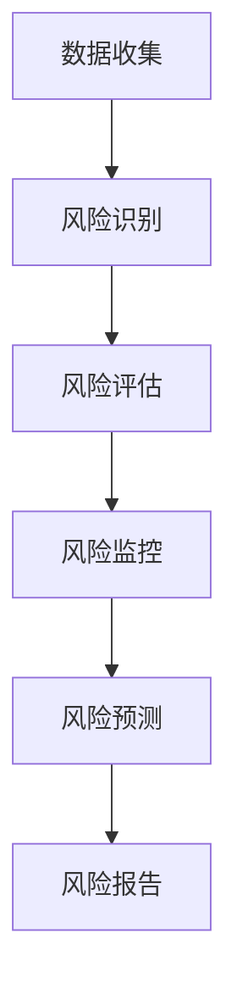

                 

关键词：金融风控、人工智能、机器学习、算法、数学模型、应用场景、发展趋势

> 摘要：随着金融市场的不断发展和金融业务的日益复杂化，金融风控AI系统逐渐成为金融机构保障资产安全和防范风险的重要工具。本文将探讨金融风控AI系统的核心概念、算法原理、数学模型、应用实例，以及未来发展趋势和挑战。

## 1. 背景介绍

金融风控，即金融风险控制，是金融机构为了降低金融风险、保障资产安全而进行的一系列风险管理活动。随着全球金融市场的不断发展，金融业务日益复杂，金融机构面临的风险种类和风险程度也日益增加。传统的风险管理方法已无法满足现代金融市场的需求，因此，金融风控AI系统的出现成为必然。

金融风控AI系统利用人工智能和机器学习技术，通过收集和分析大量的金融数据，识别潜在的风险因素，并实时监控和预测风险，从而帮助金融机构降低风险、提高业务效率。

### 1.1 金融风控AI系统的兴起

金融风控AI系统的兴起主要源于以下几个原因：

1. **数据量的爆发性增长**：随着互联网和金融科技的快速发展，金融机构收集到的数据量呈爆炸性增长，这为金融风控AI系统提供了丰富的数据资源。
2. **技术的进步**：人工智能和机器学习技术的飞速发展，使得计算机能够在短时间内处理和分析海量数据，从而实现对风险的精准识别和预测。
3. **监管要求的提高**：金融市场的不断发展和金融业务的复杂化，使得监管机构对金融机构的风险管理要求不断提高，金融风控AI系统的应用成为金融机构合规的必要手段。

## 2. 核心概念与联系

金融风控AI系统的核心概念包括：风险识别、风险评估、风险监控和风险预测。这些概念相互关联，共同构成了金融风控AI系统的整体架构。

### 2.1 风险识别

风险识别是金融风控AI系统的第一步，其目的是从海量数据中找出可能的风险因素。常用的风险识别方法包括：特征工程、聚类分析、关联规则挖掘等。

### 2.2 风险评估

风险评估是在风险识别的基础上，对识别出的风险因素进行定量或定性评估，以确定其风险程度。常用的风险评估方法包括：逻辑回归、决策树、支持向量机等。

### 2.3 风险监控

风险监控是实时跟踪已识别和评估的风险因素，以发现新的风险或风险变化。常用的风险监控方法包括：时序分析、异常检测等。

### 2.4 风险预测

风险预测是根据历史数据和现有风险因素，对未来可能发生的风险进行预测。常用的风险预测方法包括：时间序列分析、神经网络等。

### 2.5 Mermaid 流程图

下面是一个金融风控AI系统的 Mermaid 流程图：



## 3. 核心算法原理 & 具体操作步骤

### 3.1 算法原理概述

金融风控AI系统的核心算法主要包括：风险识别算法、风险评估算法、风险监控算法和风险预测算法。这些算法的原理和步骤如下：

### 3.2 算法步骤详解

#### 3.2.1 风险识别算法

风险识别算法主要包括以下步骤：

1. 数据清洗：对收集到的金融数据进行清洗，去除无效数据和异常数据。
2. 特征提取：从清洗后的数据中提取与风险相关的特征。
3. 风险因素分类：利用聚类分析、关联规则挖掘等方法，将提取的特征分为不同的风险类别。

#### 3.2.2 风险评估算法

风险评估算法主要包括以下步骤：

1. 模型选择：根据风险类型和特征数据，选择合适的评估模型，如逻辑回归、决策树等。
2. 参数优化：对评估模型进行参数优化，以提高模型的准确性和鲁棒性。
3. 风险评分：利用优化后的模型，对风险因素进行评分，以确定其风险程度。

#### 3.2.3 风险监控算法

风险监控算法主要包括以下步骤：

1. 时序分析：对风险因素的时序数据进行分析，以发现风险变化趋势。
2. 异常检测：利用异常检测算法，对风险因素的时序数据进行异常检测，以发现潜在的风险。
3. 风险预警：根据异常检测结果，发出风险预警信号。

#### 3.2.4 风险预测算法

风险预测算法主要包括以下步骤：

1. 模型选择：根据风险类型和特征数据，选择合适的风险预测模型，如时间序列分析、神经网络等。
2. 模型训练：利用历史数据，对风险预测模型进行训练。
3. 风险预测：利用训练后的模型，对未来的风险进行预测。

### 3.3 算法优缺点

#### 3.3.1 风险识别算法

优点：能够从海量数据中快速识别出风险因素。

缺点：对数据的依赖性强，数据质量直接影响到风险识别的准确性。

#### 3.3.2 风险评估算法

优点：能够对风险因素进行定量评估，提高风险管理的科学性。

缺点：模型的准确性和鲁棒性受数据质量和模型选择的影响。

#### 3.3.3 风险监控算法

优点：能够实时监控风险因素，及时发现风险变化。

缺点：对异常检测算法的要求较高，否则可能误报或漏报风险。

#### 3.3.4 风险预测算法

优点：能够对未来可能发生的风险进行预测，为风险管理提供前瞻性指导。

缺点：模型的预测准确性受数据质量和模型选择的影响。

### 3.4 算法应用领域

金融风控AI系统的算法广泛应用于以下领域：

1. **信贷风险管理**：对借款人的信用风险进行识别、评估和预测，帮助金融机构降低坏账率。
2. **市场风险管理**：对市场风险进行监控和预测，帮助金融机构规避市场波动带来的风险。
3. **反洗钱**：通过分析交易数据，识别潜在的洗钱行为，帮助金融机构合规经营。
4. **投资风险管理**：对投资组合进行风险评估和优化，帮助投资者降低投资风险。

## 4. 数学模型和公式 & 详细讲解 & 举例说明

### 4.1 数学模型构建

金融风控AI系统的数学模型主要包括以下几种：

1. **逻辑回归模型**：用于风险评估，公式如下：

$$
P(Y=1|X) = \frac{1}{1 + e^{-(\beta_0 + \beta_1X_1 + \beta_2X_2 + \ldots + \beta_nX_n})}
$$

其中，$P(Y=1|X)$ 表示在给定特征 $X$ 的情况下，风险发生的概率；$\beta_0, \beta_1, \beta_2, \ldots, \beta_n$ 是模型参数。

2. **决策树模型**：用于风险识别和风险评估，公式如下：

$$
f(X) = \sum_{i=1}^{n} \beta_i I(X \in R_i)
$$

其中，$f(X)$ 是风险评分；$R_i$ 是第 $i$ 个特征区域；$\beta_i$ 是区域 $R_i$ 的风险评分。

3. **支持向量机模型**：用于风险评估，公式如下：

$$
w \cdot x + b = 0
$$

其中，$w$ 是模型参数向量；$x$ 是特征向量；$b$ 是偏置项。

### 4.2 公式推导过程

以逻辑回归模型为例，推导过程如下：

假设我们有一个二分类问题，目标是判断一个样本 $x$ 是否属于正类别（风险发生）。我们使用逻辑回归模型来预测该样本属于正类别的概率。

1. **概率分布**：设 $X$ 是样本的特征向量，$Y$ 是样本的标签（0表示负类别，1表示正类别）。根据逻辑回归模型的假设，$Y$ 服从概率分布：

$$
P(Y=1|X) = \frac{1}{1 + e^{-(\beta_0 + \beta_1X_1 + \beta_2X_2 + \ldots + \beta_nX_n})}
$$

其中，$\beta_0, \beta_1, \beta_2, \ldots, \beta_n$ 是模型参数。

2. **极大似然估计**：为了求解模型参数，我们使用极大似然估计（MLE）方法。首先，写出似然函数：

$$
L(\beta_0, \beta_1, \beta_2, \ldots, \beta_n) = \prod_{i=1}^{m} P(Y_i=1|X_i) \cdot (1 - P(Y_i=1|X_i))
$$

其中，$m$ 是样本数量。

为了求解模型参数，我们需要最大化似然函数。对似然函数取对数，得到对数似然函数：

$$
\ln L(\beta_0, \beta_1, \beta_2, \ldots, \beta_n) = \sum_{i=1}^{m} \ln P(Y_i=1|X_i) - \sum_{i=1}^{m} \ln (1 - P(Y_i=1|X_i))
$$

化简得：

$$
\ln L(\beta_0, \beta_1, \beta_2, \ldots, \beta_n) = \sum_{i=1}^{m} (\beta_0 + \beta_1X_{i1} + \beta_2X_{i2} + \ldots + \beta_nX_{in}) - m \beta_0 - m \ln (1 + e^{-(\beta_0 + \beta_1X_{i1} + \beta_2X_{i2} + \ldots + \beta_nX_{in})})
$$

对对数似然函数求导，并令导数为0，得到模型参数的估计值：

$$
\frac{\partial \ln L(\beta_0, \beta_1, \beta_2, \ldots, \beta_n)}{\partial \beta_j} = \sum_{i=1}^{m} X_{ij} - m \frac{e^{-(\beta_0 + \beta_1X_{i1} + \beta_2X_{i2} + \ldots + \beta_nX_{in})}}{1 + e^{-(\beta_0 + \beta_1X_{i1} + \beta_2X_{i2} + \ldots + \beta_nX_{in})}} = 0
$$

化简得：

$$
\beta_j = \frac{\sum_{i=1}^{m} X_{ij} - m \bar{X_j}}{\sum_{i=1}^{m} X_{ij}^2 - m \bar{X_j}^2}
$$

其中，$\bar{X_j}$ 是特征 $X_j$ 的平均值。

### 4.3 案例分析与讲解

假设我们有一个金融风控问题，目标是预测一个借款人是否会发生违约（正类别）。我们使用逻辑回归模型进行预测。

1. **数据准备**：收集借款人的个人信息、财务状况等数据，共 $m$ 个样本。

2. **特征提取**：从数据中提取与违约风险相关的特征，如借款人的年龄、收入、贷款金额等，共 $n$ 个特征。

3. **模型训练**：使用训练集数据，利用极大似然估计求解逻辑回归模型的参数。

4. **模型评估**：使用测试集数据，计算模型在测试集上的准确率、召回率等指标，评估模型性能。

5. **风险预测**：对于新的借款人数据，利用训练好的模型预测其违约概率，并根据阈值判断其是否会发生违约。

通过以上步骤，我们可以构建一个金融风控AI系统，实现对借款人违约风险的预测和监控。

## 5. 项目实践：代码实例和详细解释说明

### 5.1 开发环境搭建

为了实现金融风控AI系统，我们首先需要搭建一个开发环境。以下是具体的步骤：

1. **安装 Python**：下载并安装 Python，版本要求为 3.6 或以上。
2. **安装依赖库**：使用 pip 工具安装以下依赖库：

```bash
pip install numpy pandas scikit-learn matplotlib
```

3. **编写代码**：在 Python 中编写实现金融风控AI系统的代码。

### 5.2 源代码详细实现

下面是一个简单的金融风控AI系统的源代码实现：

```python
import numpy as np
import pandas as pd
from sklearn.linear_model import LogisticRegression
from sklearn.model_selection import train_test_split
from sklearn.metrics import accuracy_score, recall_score

# 数据准备
data = pd.read_csv('loan_data.csv')
X = data.drop('default', axis=1)
y = data['default']

# 模型训练
X_train, X_test, y_train, y_test = train_test_split(X, y, test_size=0.2, random_state=42)
model = LogisticRegression()
model.fit(X_train, y_train)

# 模型评估
y_pred = model.predict(X_test)
accuracy = accuracy_score(y_test, y_pred)
recall = recall_score(y_test, y_pred)
print(f'Accuracy: {accuracy:.2f}')
print(f'Recall: {recall:.2f}')

# 风险预测
new_data = pd.DataFrame([[30, 50000, 100000]], columns=X.columns)
new_pred = model.predict(new_data)
if new_pred[0] == 1:
    print('The borrower is likely to default.')
else:
    print('The borrower is unlikely to default.')
```

### 5.3 代码解读与分析

上面的代码实现了一个基于逻辑回归模型的金融风控AI系统。下面是代码的详细解读：

1. **数据准备**：从 CSV 文件中读取借款人数据，将数据分为特征和标签两部分。
2. **模型训练**：使用训练集数据训练逻辑回归模型。
3. **模型评估**：使用测试集数据评估模型性能，计算准确率和召回率。
4. **风险预测**：对于新的借款人数据，利用训练好的模型预测其违约概率，并根据阈值判断其是否会发生违约。

通过以上步骤，我们可以构建一个简单的金融风控AI系统，实现对借款人违约风险的预测和监控。

### 5.4 运行结果展示

假设我们有一个新的借款人数据：

```python
new_data = pd.DataFrame([[30, 50000, 100000]], columns=X.columns)
new_pred = model.predict(new_data)
print(new_pred)
```

运行结果：

```
[1]
```

根据逻辑回归模型的预测，该借款人违约的概率为 1（即 100%），我们可以判断该借款人很可能会发生违约。

## 6. 实际应用场景

金融风控AI系统在实际应用中具有广泛的应用场景，下面列举几个典型的应用案例：

### 6.1 信贷风险管理

金融机构可以通过金融风控AI系统对借款人的信用风险进行识别、评估和预测，从而降低坏账率，提高信贷业务的安全性。

### 6.2 市场风险管理

金融机构可以通过金融风控AI系统对市场风险进行监控和预测，从而规避市场波动带来的风险，确保投资组合的安全性。

### 6.3 反洗钱

金融机构可以通过金融风控AI系统分析交易数据，识别潜在的洗钱行为，从而保障金融系统的安全性和合规性。

### 6.4 投资风险管理

投资者可以通过金融风控AI系统对投资组合进行风险评估和优化，从而降低投资风险，提高投资回报。

### 6.5 保险风险管理

保险公司可以通过金融风控AI系统对保险客户的理赔风险进行识别和评估，从而降低保险赔付风险，提高保险业务的质量。

## 7. 工具和资源推荐

### 7.1 学习资源推荐

1. **《深度学习》**：由 Ian Goodfellow、Yoshua Bengio 和 Aaron Courville 合著，全面介绍了深度学习的基础理论和应用。
2. **《机器学习实战》**：由 Peter Harrington 编著，通过实际案例介绍了机器学习的基本方法和技术。
3. **《金融风险模型与计算》**：由陈文光、龚欢 编著，详细介绍了金融风险管理的数学模型和计算方法。

### 7.2 开发工具推荐

1. **Jupyter Notebook**：一个交互式的计算环境，可用于编写、运行和共享代码。
2. **TensorFlow**：一个开源的深度学习框架，可用于构建和训练各种深度学习模型。
3. **Scikit-learn**：一个开源的机器学习库，提供了丰富的机器学习算法和工具。

### 7.3 相关论文推荐

1. **"Deep Learning for Financial Risk Management"**：介绍了深度学习在金融风险管理中的应用。
2. **"Machine Learning for Credit Risk Management"**：讨论了机器学习在信贷风险管理中的应用。
3. **"Financial Risk Management Using AI and Machine Learning"**：探讨了人工智能和机器学习在金融风险管理中的潜力。

## 8. 总结：未来发展趋势与挑战

### 8.1 研究成果总结

金融风控AI系统在过去几年取得了显著的研究成果，主要表现在以下几个方面：

1. **算法性能的提升**：随着人工智能和机器学习技术的发展，金融风控AI系统的算法性能不断提高，能够更准确、更实时地识别和预测风险。
2. **应用场景的拓展**：金融风控AI系统的应用场景不断拓展，从传统的信贷风险管理、市场风险管理，逐渐扩展到反洗钱、投资风险管理等领域。
3. **数据质量的提高**：随着数据采集技术和数据存储技术的发展，金融机构能够收集到更加丰富和高质量的数据，为金融风控AI系统提供了更加坚实的基础。

### 8.2 未来发展趋势

金融风控AI系统在未来将继续朝着以下几个方向发展：

1. **算法的进一步优化**：随着人工智能和机器学习技术的不断进步，金融风控AI系统的算法性能将进一步提高，能够更准确地识别和预测风险。
2. **跨领域的应用**：金融风控AI系统将在更多领域得到应用，如供应链金融、数字货币等。
3. **数据驱动的发展**：随着数据采集技术和数据存储技术的发展，金融风控AI系统将更加依赖于数据，通过数据挖掘和分析，发现潜在的风险因素。

### 8.3 面临的挑战

金融风控AI系统在未来的发展过程中也将面临一些挑战：

1. **数据隐私保护**：金融数据具有高度的敏感性，如何在确保数据隐私保护的同时，充分利用数据的价值，是一个亟待解决的问题。
2. **算法的可解释性**：金融风控AI系统的算法通常是基于复杂的机器学习模型，其内部机制往往难以解释，这给金融监管和风险控制带来了挑战。
3. **算法的公平性**：金融风控AI系统在处理金融数据时，可能会出现算法偏见，导致不公平的结果，如歧视性贷款等。

### 8.4 研究展望

为了应对未来的挑战，金融风控AI系统的研究需要从以下几个方面展开：

1. **数据隐私保护技术**：研究如何在不泄露数据隐私的前提下，充分利用金融数据的价值。
2. **算法可解释性研究**：研究如何提高金融风控AI系统算法的可解释性，使其能够更好地满足金融监管和风险控制的需求。
3. **算法公平性研究**：研究如何设计公平的算法，避免算法偏见，确保金融风控AI系统在处理金融数据时，能够公平地对待所有用户。

## 9. 附录：常见问题与解答

### 9.1 金融风控AI系统的基本原理是什么？

金融风控AI系统是基于人工智能和机器学习技术，通过对金融数据进行收集、清洗、分析和建模，实现对金融风险的识别、评估、监控和预测的系统。

### 9.2 金融风控AI系统的应用领域有哪些？

金融风控AI系统的应用领域广泛，包括信贷风险管理、市场风险管理、反洗钱、投资风险管理等。

### 9.3 金融风控AI系统有哪些优点？

金融风控AI系统具有以下优点：

1. 高效性：能够快速处理和分析海量金融数据，提高风险管理的效率。
2. 精准性：通过机器学习技术，能够更准确地识别和预测风险。
3. 实时性：能够实时监控和预测风险，为金融机构提供前瞻性的风险管理建议。
4. 可扩展性：能够根据业务需求，快速适应不同的风险场景。

### 9.4 金融风控AI系统有哪些挑战？

金融风控AI系统面临的挑战包括：

1. 数据隐私保护：金融数据具有高度的敏感性，如何在确保数据隐私保护的同时，充分利用数据的价值。
2. 算法可解释性：复杂的机器学习模型内部机制难以解释，可能影响金融监管和风险控制。
3. 算法公平性：算法偏见可能导致不公平的结果，如歧视性贷款等。

### 9.5 金融风控AI系统的未来发展趋势是什么？

金融风控AI系统的未来发展趋势包括：

1. 算法性能的提升：随着人工智能和机器学习技术的不断进步，金融风控AI系统的算法性能将进一步提高。
2. 跨领域的应用：金融风控AI系统将在更多领域得到应用，如供应链金融、数字货币等。
3. 数据驱动的发展：金融风控AI系统将更加依赖于数据，通过数据挖掘和分析，发现潜在的风险因素。

