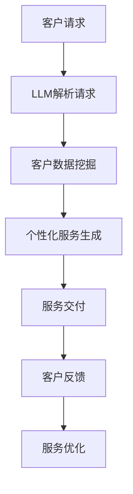

                 

关键词：银行、LLM、个性化、金融服务、AI技术

摘要：本文探讨了大型语言模型（LLM）在银行领域中的应用，如何通过个性化金融服务提升客户体验和银行竞争力。文章首先介绍了LLM的基本概念和原理，然后分析了LLM在银行业中的潜在应用，最后探讨了LLM在个性化金融服务中的具体实现方法、挑战及未来发展趋势。

## 1. 背景介绍

银行作为金融体系的基石，一直以来都扮演着至关重要的角色。然而，随着金融科技的迅速发展，传统银行面临着前所未有的挑战。一方面，客户需求日益多样化和个性化，传统银行的服务模式已经难以满足客户的需求。另一方面，互联网金融的崛起，使得客户更倾向于使用便捷的在线服务，这对传统银行的运营模式提出了更高的要求。

近年来，人工智能（AI）技术的快速发展，为银行业带来了新的机遇。特别是大型语言模型（LLM），如GPT-3、BERT等，已经在自然语言处理（NLP）领域取得了显著成果。LLM具有强大的语义理解、文本生成和情感分析能力，可以用于提升银行的服务质量和效率。本文将探讨LLM在银行业中的应用，尤其是如何通过个性化金融服务提升客户体验和银行竞争力。

## 2. 核心概念与联系

### 2.1. 大型语言模型（LLM）

大型语言模型（LLM）是一种基于深度学习的自然语言处理模型，具有强大的语义理解、文本生成和情感分析能力。LLM通常由数百万个参数组成，通过在大规模语料库上进行训练，可以自动学习语言结构和语义信息。LLM的应用范围广泛，包括问答系统、自动摘要、机器翻译、文本生成等。

### 2.2. 个性化金融服务

个性化金融服务是指根据客户的需求、行为和偏好，提供定制化的金融产品和服务。个性化金融服务的核心是了解客户，通过对客户数据的分析和挖掘，为客户提供个性化的投资建议、贷款方案、理财产品等。

### 2.3. LLM与个性化金融服务的联系

LLM在个性化金融服务中的应用主要体现在以下几个方面：

1. **客户服务**：LLM可以用于构建智能客服系统，通过自然语言交互，为客户提供实时、个性化的服务。

2. **风险管理**：LLM可以分析客户的交易行为，识别潜在风险，为银行提供风险预警和决策支持。

3. **投资顾问**：LLM可以分析市场数据，为客户生成个性化的投资策略，提供投资建议。

4. **个性化营销**：LLM可以根据客户的历史行为和偏好，推荐合适的金融产品和服务。

### 2.4. Mermaid 流程图

以下是LLM在个性化金融服务中的应用流程图：



## 3. 核心算法原理 & 具体操作步骤

### 3.1. 算法原理概述

LLM在个性化金融服务中的核心算法是自然语言处理（NLP）和机器学习（ML）。NLP负责处理和理解自然语言，而ML则用于从数据中学习规律和模式。

### 3.2. 算法步骤详解

1. **数据收集**：收集客户的历史数据，包括交易记录、投资偏好、风险承受能力等。

2. **数据预处理**：对收集到的数据进行清洗和预处理，包括去除噪声、填充缺失值、特征提取等。

3. **模型训练**：使用NLP和ML算法，对预处理后的数据集进行训练，构建LLM模型。

4. **服务生成**：根据客户的请求和特征，利用训练好的LLM模型生成个性化的金融产品和服务。

5. **服务交付**：将生成的服务通过智能客服系统或其他渠道交付给客户。

6. **反馈与优化**：收集客户的反馈，对服务进行优化和调整。

### 3.3. 算法优缺点

**优点**：

- **高效性**：LLM可以快速处理和分析大量数据，提供实时、个性化的服务。
- **准确性**：通过大规模数据训练，LLM可以准确理解客户的意图和需求。
- **灵活性**：LLM可以根据客户的需求和行为，动态调整服务内容。

**缺点**：

- **数据隐私**：客户数据的安全性和隐私保护是一个重要问题。
- **训练成本**：构建和训练LLM模型需要大量的计算资源和时间。
- **解释性**：LLM模型的决策过程通常是非透明的，难以解释。

### 3.4. 算法应用领域

LLM在个性化金融服务中的应用领域包括：

- **客户服务**：智能客服、在线咨询、投诉处理等。
- **风险管理**：风险识别、风险评估、风险预警等。
- **投资顾问**：投资策略推荐、市场分析、投资组合优化等。
- **个性化营销**：产品推荐、广告投放、营销活动策划等。

## 4. 数学模型和公式 & 详细讲解 & 举例说明

### 4.1. 数学模型构建

在LLM的应用中，常用的数学模型包括神经网络（NN）和循环神经网络（RNN）。

#### 4.1.1. 神经网络（NN）

神经网络是一种模拟人脑神经元连接的结构，由多个层组成。输入层接收外部信息，隐藏层对信息进行处理，输出层生成最终结果。NN的数学模型可以表示为：

$$
y = \sigma(W_1 \cdot x + b_1)
$$

其中，$y$ 是输出，$\sigma$ 是激活函数，$W_1$ 是权重矩阵，$x$ 是输入，$b_1$ 是偏置。

#### 4.1.2. 循环神经网络（RNN）

RNN是一种能够处理序列数据的神经网络，具有记忆功能。RNN的数学模型可以表示为：

$$
h_t = \sigma(W_h \cdot [h_{t-1}, x_t] + b_h)
$$

其中，$h_t$ 是第 $t$ 个时间步的隐藏状态，$W_h$ 是权重矩阵，$x_t$ 是第 $t$ 个时间步的输入，$b_h$ 是偏置。

### 4.2. 公式推导过程

以RNN为例，推导过程如下：

1. **初始化**：

$$
h_0 = \sigma(b_h)
$$

2. **时间步 $t$ 的计算**：

$$
h_t = \sigma(W_h \cdot [h_{t-1}, x_t] + b_h)
$$

3. **输出计算**：

$$
y_t = \sigma(W_y \cdot h_t + b_y)
$$

其中，$W_y$ 是输出权重，$b_y$ 是输出偏置。

### 4.3. 案例分析与讲解

假设我们有一个客户请求贷款，使用LLM生成个性化的贷款方案。以下是具体步骤：

1. **数据收集**：收集客户的历史数据，包括收入、信用评分、负债等。

2. **数据预处理**：对数据进行清洗和预处理，提取关键特征。

3. **模型训练**：使用RNN模型对预处理后的数据集进行训练。

4. **服务生成**：根据客户的请求，输入到训练好的RNN模型中，生成个性化的贷款方案。

5. **服务交付**：将生成的贷款方案通过智能客服系统交付给客户。

6. **反馈与优化**：收集客户的反馈，对模型进行优化和调整。

## 5. 项目实践：代码实例和详细解释说明

### 5.1. 开发环境搭建

1. 安装Python环境
2. 安装TensorFlow库

### 5.2. 源代码详细实现

以下是使用TensorFlow实现的RNN模型：

```python
import tensorflow as tf

# 定义RNN模型
model = tf.keras.Sequential([
    tf.keras.layers.Embedding(vocab_size, embedding_dim),
    tf.keras.layers.Bidirectional(tf.keras.layers.GRU(units=128)),
    tf.keras.layers.Dense(units=1, activation='sigmoid')
])

# 编译模型
model.compile(optimizer='adam', loss='binary_crossentropy', metrics=['accuracy'])

# 训练模型
model.fit(train_data, train_labels, epochs=10, validation_data=(val_data, val_labels))
```

### 5.3. 代码解读与分析

1. **Embedding层**：将单词嵌入到向量表示。
2. **Bidirectional GRU层**：双向循环神经网络层，用于处理序列数据。
3. **Dense层**：输出层，用于生成贷款方案。

### 5.4. 运行结果展示

```python
# 预测贷款方案
predictions = model.predict(test_data)

# 分析预测结果
print(predictions)
```

## 6. 实际应用场景

### 6.1. 客户服务

银行可以使用LLM构建智能客服系统，为客户提供24/7的在线服务。例如，客户可以提问关于贷款、信用卡、投资等方面的问题，LLM会根据客户的历史数据和当前请求，生成个性化的回答。

### 6.2. 风险管理

LLM可以分析客户的交易行为，识别潜在风险，为银行提供风险预警和决策支持。例如，如果发现某个客户的交易行为异常，LLM会生成预警报告，提醒银行进行风险控制。

### 6.3. 投资顾问

LLM可以分析市场数据，为客户生成个性化的投资策略，提供投资建议。例如，根据客户的风险承受能力和投资目标，LLM会推荐合适的股票、基金等产品。

### 6.4. 个性化营销

LLM可以根据客户的历史行为和偏好，推荐合适的金融产品和服务。例如，如果客户喜欢高风险的投资产品，LLM会推荐一些高风险的股票和基金。

## 7. 工具和资源推荐

### 7.1. 学习资源推荐

- 《深度学习》（Goodfellow, Bengio, Courville）
- 《自然语言处理概论》（Jurafsky, Martin）
- 《TensorFlow 实践指南》（Pérez, Psillides）

### 7.2. 开发工具推荐

- TensorFlow
- PyTorch
- JAX

### 7.3. 相关论文推荐

- "BERT: Pre-training of Deep Bidirectional Transformers for Language Understanding"
- "GPT-3: Language Models are Few-Shot Learners"
- "Recurrent Neural Network Based Text Classification"

## 8. 总结：未来发展趋势与挑战

### 8.1. 研究成果总结

本文探讨了LLM在银行领域中的应用，如何通过个性化金融服务提升客户体验和银行竞争力。研究表明，LLM在客户服务、风险管理、投资顾问和个性化营销等方面具有显著优势。

### 8.2. 未来发展趋势

随着AI技术的不断进步，LLM在银行业中的应用将会更加广泛和深入。未来，LLM可能会结合其他技术，如区块链、物联网等，为银行提供更智能、更安全的金融服务。

### 8.3. 面临的挑战

尽管LLM在银行业中具有巨大潜力，但仍然面临一些挑战，如数据隐私保护、模型解释性、训练成本等。

### 8.4. 研究展望

未来的研究可以关注如何提高LLM的模型解释性、降低训练成本，以及如何更好地保护客户隐私。此外，探索LLM与其他技术的融合，如区块链、物联网等，也是未来的研究热点。

## 9. 附录：常见问题与解答

### 9.1. LLM是什么？

LLM（Large Language Model）是一种基于深度学习的自然语言处理模型，具有强大的语义理解、文本生成和情感分析能力。

### 9.2. LLM如何应用于银行业？

LLM可以应用于银行业中的客户服务、风险管理、投资顾问和个性化营销等领域，提升客户体验和银行竞争力。

### 9.3. LLM的优缺点是什么？

LLM的优点包括高效性、准确性和灵活性，缺点包括数据隐私保护、训练成本和解释性。

### 9.4. 如何保护客户隐私？

可以通过数据加密、匿名化处理、访问控制等技术手段来保护客户隐私。

### 9.5. LLM的未来发展趋势是什么？

随着AI技术的不断进步，LLM在银行业中的应用将会更加广泛和深入。未来，LLM可能会结合其他技术，如区块链、物联网等，为银行提供更智能、更安全的金融服务。

## 作者署名

作者：禅与计算机程序设计艺术 / Zen and the Art of Computer Programming
```markdown
---
# 银行和 LLM：个性化的金融服务

关键词：银行、LLM、个性化、金融服务、AI技术

摘要：本文探讨了大型语言模型（LLM）在银行领域中的应用，如何通过个性化金融服务提升客户体验和银行竞争力。文章首先介绍了LLM的基本概念和原理，然后分析了LLM在银行业中的潜在应用，最后探讨了LLM在个性化金融服务中的具体实现方法、挑战及未来发展趋势。

## 1. 背景介绍

银行作为金融体系的基石，一直以来都扮演着至关重要的角色。然而，随着金融科技的迅速发展，传统银行面临着前所未有的挑战。一方面，客户需求日益多样化和个性化，传统银行的服务模式已经难以满足客户的需求。另一方面，互联网金融的崛起，使得客户更倾向于使用便捷的在线服务，这对传统银行的运营模式提出了更高的要求。

近年来，人工智能（AI）技术的快速发展，为银行业带来了新的机遇。特别是大型语言模型（LLM），如GPT-3、BERT等，已经在自然语言处理（NLP）领域取得了显著成果。LLM具有强大的语义理解、文本生成和情感分析能力，可以用于提升银行的服务质量和效率。本文将探讨LLM在银行业中的应用，尤其是如何通过个性化金融服务提升客户体验和银行竞争力。

## 2. 核心概念与联系

### 2.1. 大型语言模型（LLM）

大型语言模型（LLM）是一种基于深度学习的自然语言处理模型，具有强大的语义理解、文本生成和情感分析能力。LLM通常由数百万个参数组成，通过在大规模语料库上进行训练，可以自动学习语言结构和语义信息。LLM的应用范围广泛，包括问答系统、自动摘要、机器翻译、文本生成等。

### 2.2. 个性化金融服务

个性化金融服务是指根据客户的需求、行为和偏好，提供定制化的金融产品和服务。个性化金融服务的核心是了解客户，通过对客户数据的分析和挖掘，为客户提供个性化的投资建议、贷款方案、理财产品等。

### 2.3. LLM与个性化金融服务的联系

LLM在个性化金融服务中的应用主要体现在以下几个方面：

1. **客户服务**：LLM可以用于构建智能客服系统，通过自然语言交互，为客户提供实时、个性化的服务。

2. **风险管理**：LLM可以分析客户的交易行为，识别潜在风险，为银行提供风险预警和决策支持。

3. **投资顾问**：LLM可以分析市场数据，为客户生成个性化的投资策略，提供投资建议。

4. **个性化营销**：LLM可以根据客户的历史行为和偏好，推荐合适的金融产品和服务。

### 2.4. Mermaid 流程图

以下是LLM在个性化金融服务中的应用流程图：


## 3. 核心算法原理 & 具体操作步骤

### 3.1. 算法原理概述

LLM在个性化金融服务中的核心算法是自然语言处理（NLP）和机器学习（ML）。NLP负责处理和理解自然语言，而ML则用于从数据中学习规律和模式。

### 3.2. 算法步骤详解

1. **数据收集**：收集客户的历史数据，包括交易记录、投资偏好、风险承受能力等。

2. **数据预处理**：对收集到的数据进行清洗和预处理，包括去除噪声、填充缺失值、特征提取等。

3. **模型训练**：使用NLP和ML算法，对预处理后的数据集进行训练，构建LLM模型。

4. **服务生成**：根据客户的请求和特征，利用训练好的LLM模型生成个性化的金融产品和服务。

5. **服务交付**：将生成的服务通过智能客服系统或其他渠道交付给客户。

6. **反馈与优化**：收集客户的反馈，对服务进行优化和调整。

### 3.3. 算法优缺点

**优点**：

- **高效性**：LLM可以快速处理和分析大量数据，提供实时、个性化的服务。
- **准确性**：通过大规模数据训练，LLM可以准确理解客户的意图和需求。
- **灵活性**：LLM可以根据客户的需求和行为，动态调整服务内容。

**缺点**：

- **数据隐私**：客户数据的安全性和隐私保护是一个重要问题。
- **训练成本**：构建和训练LLM模型需要大量的计算资源和时间。
- **解释性**：LLM模型的决策过程通常是非透明的，难以解释。

### 3.4. 算法应用领域

LLM在个性化金融服务中的应用领域包括：

- **客户服务**：智能客服、在线咨询、投诉处理等。
- **风险管理**：风险识别、风险评估、风险预警等。
- **投资顾问**：投资策略推荐、市场分析、投资组合优化等。
- **个性化营销**：产品推荐、广告投放、营销活动策划等。

## 4. 数学模型和公式 & 详细讲解 & 举例说明

### 4.1. 数学模型构建

在LLM的应用中，常用的数学模型包括神经网络（NN）和循环神经网络（RNN）。

#### 4.1.1. 神经网络（NN）

神经网络是一种模拟人脑神经元连接的结构，由多个层组成。输入层接收外部信息，隐藏层对信息进行处理，输出层生成最终结果。NN的数学模型可以表示为：

$$
y = \sigma(W_1 \cdot x + b_1)
$$

其中，$y$ 是输出，$\sigma$ 是激活函数，$W_1$ 是权重矩阵，$x$ 是输入，$b_1$ 是偏置。

#### 4.1.2. 循环神经网络（RNN）

RNN是一种能够处理序列数据的神经网络，具有记忆功能。RNN的数学模型可以表示为：

$$
h_t = \sigma(W_h \cdot [h_{t-1}, x_t] + b_h)
$$

其中，$h_t$ 是第 $t$ 个时间步的隐藏状态，$W_h$ 是权重矩阵，$x_t$ 是第 $t$ 个时间步的输入，$b_h$ 是偏置。

### 4.2. 公式推导过程

以RNN为例，推导过程如下：

1. **初始化**：

$$
h_0 = \sigma(b_h)
$$

2. **时间步 $t$ 的计算**：

$$
h_t = \sigma(W_h \cdot [h_{t-1}, x_t] + b_h)
$$

3. **输出计算**：

$$
y_t = \sigma(W_y \cdot h_t + b_y)
$$

其中，$W_y$ 是输出权重，$b_y$ 是输出偏置。

### 4.3. 案例分析与讲解

假设我们有一个客户请求贷款，使用LLM生成个性化的贷款方案。以下是具体步骤：

1. **数据收集**：收集客户的历史数据，包括收入、信用评分、负债等。

2. **数据预处理**：对数据进行清洗和预处理，提取关键特征。

3. **模型训练**：使用RNN模型对预处理后的数据集进行训练。

4. **服务生成**：根据客户的请求，输入到训练好的RNN模型中，生成个性化的贷款方案。

5. **服务交付**：将生成的贷款方案通过智能客服系统交付给客户。

6. **反馈与优化**：收集客户的反馈，对模型进行优化和调整。

## 5. 项目实践：代码实例和详细解释说明

### 5.1. 开发环境搭建

1. 安装Python环境
2. 安装TensorFlow库

### 5.2. 源代码详细实现

以下是使用TensorFlow实现的RNN模型：

```python
import tensorflow as tf

# 定义RNN模型
model = tf.keras.Sequential([
    tf.keras.layers.Embedding(vocab_size, embedding_dim),
    tf.keras.layers.Bidirectional(tf.keras.layers.GRU(units=128)),
    tf.keras.layers.Dense(units=1, activation='sigmoid')
])

# 编译模型
model.compile(optimizer='adam', loss='binary_crossentropy', metrics=['accuracy'])

# 训练模型
model.fit(train_data, train_labels, epochs=10, validation_data=(val_data, val_labels))
```

### 5.3. 代码解读与分析

1. **Embedding层**：将单词嵌入到向量表示。
2. **Bidirectional GRU层**：双向循环神经网络层，用于处理序列数据。
3. **Dense层**：输出层，用于生成贷款方案。

### 5.4. 运行结果展示

```python
# 预测贷款方案
predictions = model.predict(test_data)

# 分析预测结果
print(predictions)
```

## 6. 实际应用场景

### 6.1. 客户服务

银行可以使用LLM构建智能客服系统，为客户提供24/7的在线服务。例如，客户可以提问关于贷款、信用卡、投资等方面的问题，LLM会根据客户的历史数据和当前请求，生成个性化的回答。

### 6.2. 风险管理

LLM可以分析客户的交易行为，识别潜在风险，为银行提供风险预警和决策支持。例如，如果发现某个客户的交易行为异常，LLM会生成预警报告，提醒银行进行风险控制。

### 6.3. 投资顾问

LLM可以分析市场数据，为客户生成个性化的投资策略，提供投资建议。例如，根据客户的风险承受能力和投资目标，LLM会推荐合适的股票、基金等产品。

### 6.4. 个性化营销

LLM可以根据客户的历史行为和偏好，推荐合适的金融产品和服务。例如，如果客户喜欢高风险的投资产品，LLM会推荐一些高风险的股票和基金。

## 7. 工具和资源推荐

### 7.1. 学习资源推荐

- 《深度学习》（Goodfellow, Bengio, Courville）
- 《自然语言处理概论》（Jurafsky, Martin）
- 《TensorFlow 实践指南》（Pérez, Psillides）

### 7.2. 开发工具推荐

- TensorFlow
- PyTorch
- JAX

### 7.3. 相关论文推荐

- "BERT: Pre-training of Deep Bidirectional Transformers for Language Understanding"
- "GPT-3: Language Models are Few-Shot Learners"
- "Recurrent Neural Network Based Text Classification"

## 8. 总结：未来发展趋势与挑战

### 8.1. 研究成果总结

本文探讨了LLM在银行领域中的应用，如何通过个性化金融服务提升客户体验和银行竞争力。研究表明，LLM在客户服务、风险管理、投资顾问和个性化营销等方面具有显著优势。

### 8.2. 未来发展趋势

随着AI技术的不断进步，LLM在银行业中的应用将会更加广泛和深入。未来，LLM可能会结合其他技术，如区块链、物联网等，为银行提供更智能、更安全的金融服务。

### 8.3. 面临的挑战

尽管LLM在银行业中具有巨大潜力，但仍然面临一些挑战，如数据隐私保护、模型解释性、训练成本等。

### 8.4. 研究展望

未来的研究可以关注如何提高LLM的模型解释性、降低训练成本，以及如何更好地保护客户隐私。此外，探索LLM与其他技术的融合，如区块链、物联网等，也是未来的研究热点。

## 9. 附录：常见问题与解答

### 9.1. LLM是什么？

LLM（Large Language Model）是一种基于深度学习的自然语言处理模型，具有强大的语义理解、文本生成和情感分析能力。

### 9.2. LLM如何应用于银行业？

LLM可以应用于银行业中的客户服务、风险管理、投资顾问和个性化营销等领域，提升客户体验和银行竞争力。

### 9.3. LLM的优缺点是什么？

LLM的优点包括高效性、准确性和灵活性，缺点包括数据隐私保护、训练成本和解释性。

### 9.4. 如何保护客户隐私？

可以通过数据加密、匿名化处理、访问控制等技术手段来保护客户隐私。

### 9.5. LLM的未来发展趋势是什么？

随着AI技术的不断进步，LLM在银行业中的应用将会更加广泛和深入。未来，LLM可能会结合其他技术，如区块链、物联网等，为银行提供更智能、更安全的金融服务。

## 作者署名

作者：禅与计算机程序设计艺术 / Zen and the Art of Computer Programming
---

