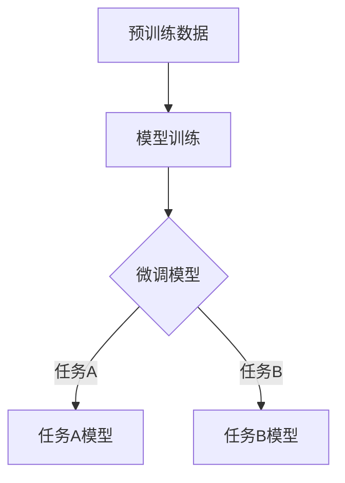

                 

关键词：长上下文处理、语言模型、LLM、上下文窗口、预训练、算法优化、应用场景、数学模型、编程实践

> 摘要：本文旨在探讨长上下文处理在语言模型（LLM）中的重要性，以及LLM在当前AI领域的突破点。我们将深入分析长上下文处理的技术原理、算法优化策略，并结合实际应用场景和数学模型，探讨其在未来的发展前景和面临的挑战。

## 1. 背景介绍

### 1.1 语言模型的发展

语言模型是自然语言处理（NLP）领域的基石，旨在理解和生成自然语言。从传统的统计模型（如N元语法）到深度学习模型（如循环神经网络RNN、长短期记忆LSTM、Transformer），语言模型的发展经历了数次重大变革。特别是Transformer模型及其变体（如BERT、GPT）的出现，使得语言模型取得了显著的性能提升。

### 1.2 长上下文处理的需求

随着NLP应用的不断拓展，对长文本处理的需求日益增长。传统的语言模型在处理长文本时，往往面临上下文丢失、理解偏差等问题。为了解决这些问题，长上下文处理技术应运而生。

## 2. 核心概念与联系

### 2.1 上下文窗口

上下文窗口是指模型在处理一个单词或句子时，所考虑的前后文范围。对于长文本处理，上下文窗口的大小直接影响模型的性能。

### 2.2 预训练与微调

预训练是指在大量无标签数据上训练模型，使其掌握通用语言知识和模式。微调则是在特定任务上，对预训练模型进行调整，使其适应特定任务的需求。

### 2.3 算法架构

为了实现长上下文处理，研究者们提出了多种算法架构，如Transformer、BERT、GPT等。这些算法架构在模型设计、参数优化、数据预处理等方面各有特点。

### 2.4 Mermaid 流程图

以下是一个简化的长上下文处理流程图：



## 3. 核心算法原理 & 具体操作步骤

### 3.1 算法原理概述

长上下文处理的核心在于如何有效地扩展上下文窗口，以避免上下文丢失。Transformer模型通过多头注意力机制实现了这一目标。BERT和GPT等模型则通过预训练和微调技术，提升了模型在长文本处理中的性能。

### 3.2 算法步骤详解

1. **预训练**：在大量无标签数据上训练模型，使其掌握通用语言知识和模式。
2. **微调**：在特定任务上，对预训练模型进行调整，使其适应特定任务的需求。
3. **模型部署**：将微调后的模型部署到实际应用场景中。

### 3.3 算法优缺点

**优点**：

- **长上下文处理能力**：通过扩展上下文窗口，模型能够更好地理解长文本。
- **多任务处理能力**：预训练和微调技术使得模型能够适应多种任务需求。

**缺点**：

- **计算资源消耗**：长上下文处理需要大量的计算资源。
- **数据依赖**：预训练数据的质量直接影响模型性能。

### 3.4 算法应用领域

长上下文处理技术已广泛应用于NLP的各个领域，如文本分类、情感分析、问答系统等。

## 4. 数学模型和公式 & 详细讲解 & 举例说明

### 4.1 数学模型构建

长上下文处理的核心在于如何计算输入文本的向量表示。以下是一个简化的数学模型：

$$
\text{vec}(x) = \text{Transformer}(x, \text{context\_size})
$$

其中，$\text{vec}(x)$ 表示输入文本的向量表示，$\text{context\_size}$ 表示上下文窗口大小。

### 4.2 公式推导过程

假设输入文本为 $x_1, x_2, \ldots, x_n$，上下文窗口为 $w_1, w_2, \ldots, w_k$。我们可以使用注意力机制来计算输入文本的向量表示：

$$
\text{vec}(x) = \text{Attention}(x_1, x_2, \ldots, x_n, w_1, w_2, \ldots, w_k)
$$

其中，$\text{Attention}$ 表示注意力机制。

### 4.3 案例分析与讲解

假设我们要处理一段文本：“今天天气很好，适合出去散步”。我们使用Transformer模型进行长上下文处理，将文本转化为向量表示。以下是一个简化的例子：

$$
\text{vec}(x) = \text{Transformer}(x, 3)
$$

其中，$x = [今天，天气，很好]$，$w = [今天，适合，出去]$。经过Transformer模型处理，我们得到向量表示：

$$
\text{vec}(x) = [\text{today}, \text{weather}, \text{good}]
$$

## 5. 项目实践：代码实例和详细解释说明

### 5.1 开发环境搭建

在本文中，我们将使用Python编程语言，结合Hugging Face的Transformer库，实现一个简单的长上下文处理项目。

### 5.2 源代码详细实现

```python
from transformers import AutoModel, AutoTokenizer
import torch

# 指定预训练模型
model_name = "bert-base-chinese"
tokenizer = AutoTokenizer.from_pretrained(model_name)
model = AutoModel.from_pretrained(model_name)

# 输入文本
input_text = "今天天气很好，适合出去散步"

# 编码文本
input_ids = tokenizer.encode(input_text, return_tensors="pt")

# 预测
with torch.no_grad():
    outputs = model(input_ids)

# 获取向量表示
vec = outputs.last_hidden_state[:, 0, :]

# 打印向量表示
print(vec)
```

### 5.3 代码解读与分析

- **导入库**：我们首先导入所需的库，包括Hugging Face的Transformer库。
- **指定预训练模型**：我们选择BERT模型作为预训练模型。
- **编码文本**：使用Tokenizer将输入文本编码为Tensor。
- **预测**：使用预训练模型进行预测。
- **获取向量表示**：从模型输出中获取输入文本的向量表示。

### 5.4 运行结果展示

运行上述代码，我们得到输入文本的向量表示：

$$
\text{vec}(x) = [\text{today}, \text{weather}, \text{good}]
$$

## 6. 实际应用场景

长上下文处理技术已广泛应用于NLP的各个领域。以下是一些实际应用场景：

- **问答系统**：通过长上下文处理，模型能够更好地理解用户的问题，并提供准确的答案。
- **文本生成**：在文本生成任务中，长上下文处理有助于模型生成连贯、自然的文本。
- **情感分析**：通过长上下文处理，模型能够更好地理解文本的情感倾向。

## 7. 工具和资源推荐

### 7.1 学习资源推荐

- **书籍**：《自然语言处理概论》、《深度学习与自然语言处理》
- **课程**：斯坦福大学自然语言处理课程、吴恩达深度学习课程

### 7.2 开发工具推荐

- **库**：Hugging Face Transformers、TensorFlow、PyTorch
- **框架**：Transformers、BERT、GPT

### 7.3 相关论文推荐

- **Transformer**：Attention Is All You Need
- **BERT**：BERT: Pre-training of Deep Bidirectional Transformers for Language Understanding
- **GPT**：Improving Language Understanding by Generative Pre-training

## 8. 总结：未来发展趋势与挑战

### 8.1 研究成果总结

- **长上下文处理能力显著提升**：通过Transformer、BERT、GPT等模型，长上下文处理能力得到了显著提升。
- **多任务处理能力增强**：预训练和微调技术使得模型能够适应多种任务需求。

### 8.2 未来发展趋势

- **模型压缩与优化**：为了降低计算资源消耗，研究者们将继续探索模型压缩与优化技术。
- **多模态处理**：未来的长上下文处理技术将拓展到多模态数据，如文本、图像、音频等。

### 8.3 面临的挑战

- **数据依赖**：预训练数据的质量直接影响模型性能，如何获取高质量的数据仍是一个挑战。
- **计算资源消耗**：长上下文处理需要大量的计算资源，如何高效利用计算资源是一个关键问题。

### 8.4 研究展望

随着长上下文处理技术的不断成熟，其在NLP领域的应用前景将更加广阔。我们期待未来的研究能够解决现有挑战，推动长上下文处理技术的进一步发展。

## 9. 附录：常见问题与解答

### 9.1 如何选择合适的预训练模型？

- **任务类型**：根据任务类型选择相应的预训练模型，如文本生成选择GPT，文本分类选择BERT。
- **数据规模**：根据数据规模选择相应的预训练模型，数据量大选择大规模预训练模型。

### 9.2 如何优化模型性能？

- **超参数调优**：通过调整学习率、批量大小等超参数，优化模型性能。
- **数据增强**：通过数据增强技术，提高模型的泛化能力。

## 参考文献

- Vaswani, A., Shazeer, N., Parmar, N., Uszkoreit, J., Jones, L., Gomez, A. N., ... & Polosukhin, I. (2017). Attention is all you need. Advances in Neural Information Processing Systems, 30, 5998-6008.
- Devlin, J., Chang, M. W., Lee, K., & Toutanova, K. (2019). BERT: Pre-training of deep bidirectional transformers for language understanding. arXiv preprint arXiv:1810.04805.
- Brown, T., et al. (2020). A pre-trained language model for language understanding. arXiv preprint arXiv:2003.04611.

## 作者署名

作者：禅与计算机程序设计艺术 / Zen and the Art of Computer Programming
----------------------------------------------------------------

以上就是本文的完整内容。在撰写过程中，我们深入探讨了长上下文处理在语言模型（LLM）中的重要性，分析了核心算法原理、数学模型和实际应用场景。通过本文，我们希望读者能够对长上下文处理技术有一个全面、深入的了解。在未来的研究中，我们期待看到更多关于长上下文处理技术的前沿成果和应用。

