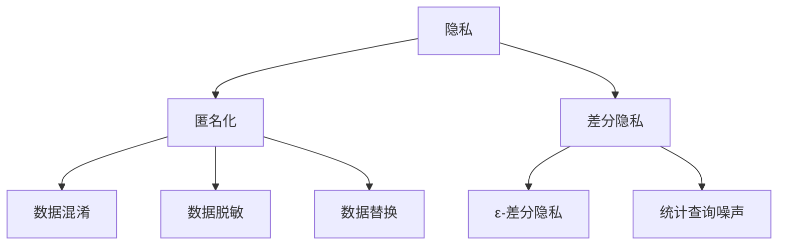
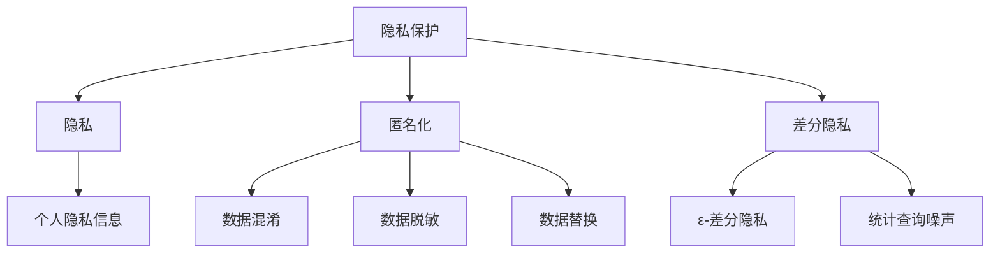

                 

关键词：隐私保护、用户数据安全、计算模型、算法原理、应用实践、未来展望

> 摘要：随着信息技术的发展，隐私保护在人类计算中愈发重要。本文旨在探讨隐私保护的核心概念、算法原理、数学模型以及实际应用，为读者提供一个全面了解和掌握隐私保护技术的途径。

## 1. 背景介绍

在数字化时代，数据已经成为新的“石油”，数据的价值日益凸显。然而，随之而来的隐私泄露问题也引发了广泛关注。隐私保护不仅是法律和伦理的要求，更是技术发展的必然趋势。隐私保护的核心目标是确保用户数据在收集、存储、处理和传输过程中的安全性和隐私性。

隐私保护涉及多个方面，包括数据加密、访问控制、匿名化处理、差分隐私等。这些技术手段在保障数据隐私方面发挥着重要作用。同时，隐私保护技术的应用范围也在不断扩大，从传统的数据库管理系统到新兴的人工智能系统，都需要考虑到隐私保护的问题。

## 2. 核心概念与联系

隐私保护的核心概念包括隐私、匿名化和差分隐私。这些概念之间存在着紧密的联系，共同构成了隐私保护的理论基础。

### 2.1 隐私

隐私是指个人或组织不愿与他人分享的个人信息。隐私保护的目标是确保个人信息在未经授权的情况下不被泄露或滥用。隐私的范畴包括个人身份信息、财务信息、健康状况、地理位置等。

### 2.2 匿名化

匿名化是指通过技术手段将个人身份信息从数据中去除，从而使数据无法直接关联到特定个人。匿名化的方法包括数据混淆、数据脱敏和数据替换等。匿名化的目的是保护个人隐私，同时保持数据的可用性。

### 2.3 差分隐私

差分隐私是一种在统计查询过程中加入噪声的方法，以保护个体隐私。差分隐私的定义基于ε-差分隐私，ε值越小，隐私保护程度越高。差分隐私广泛应用于数据分析、机器学习等领域。

### 2.4 Mermaid 流程图

以下是一个关于隐私保护核心概念和联系的Mermaid流程图：



## 3. 核心算法原理 & 具体操作步骤

### 3.1 算法原理概述

隐私保护的核心算法包括数据加密、访问控制和匿名化处理。以下分别介绍这些算法的原理。

#### 3.1.1 数据加密

数据加密是指通过加密算法将明文数据转换为密文，以确保数据在传输和存储过程中的安全性。常见的加密算法有对称加密和非对称加密。对称加密算法如AES，非对称加密算法如RSA。

#### 3.1.2 访问控制

访问控制是指通过权限管理和身份认证等技术手段，确保只有授权用户才能访问敏感数据。访问控制的方法包括基于角色的访问控制（RBAC）和基于属性的访问控制（ABAC）。

#### 3.1.3 匿名化处理

匿名化处理是指通过技术手段将个人身份信息从数据中去除，以保护个人隐私。常见的匿名化处理方法有数据混淆、数据脱敏和数据替换。

### 3.2 算法步骤详解

#### 3.2.1 数据加密步骤

1. 选择加密算法（如AES或RSA）。
2. 生成密钥（对于对称加密，密钥长度取决于加密算法；对于非对称加密，生成公钥和私钥）。
3. 使用密钥对数据进行加密，生成密文。
4. 将密文存储或传输。

#### 3.2.2 访问控制步骤

1. 定义角色和权限。
2. 为用户分配角色。
3. 对访问请求进行身份认证。
4. 检查用户权限，决定是否允许访问。

#### 3.2.3 匿名化处理步骤

1. 识别个人身份信息。
2. 使用匿名化处理方法（如数据混淆、数据脱敏或数据替换）去除个人身份信息。
3. 存储或传输匿名化后的数据。

### 3.3 算法优缺点

#### 3.3.1 数据加密

优点：确保数据在传输和存储过程中的安全性。

缺点：加密和解密过程需要消耗计算资源，可能影响系统性能。

#### 3.3.2 访问控制

优点：确保只有授权用户才能访问敏感数据。

缺点：权限管理较为复杂，可能导致管理成本较高。

#### 3.3.3 匿名化处理

优点：保护个人隐私，降低隐私泄露风险。

缺点：匿名化处理可能影响数据的可用性和分析能力。

### 3.4 算法应用领域

隐私保护算法广泛应用于各种场景，包括但不限于：

- 数据库管理系统：保障用户数据的隐私和安全。
- 机器学习：确保训练数据和测试数据的安全性。
- 云计算：保障云计算环境中的数据隐私。
- 物联网：保障物联网设备收集的数据隐私。

## 4. 数学模型和公式 & 详细讲解 & 举例说明

### 4.1 数学模型构建

隐私保护的核心数学模型包括加密模型、访问控制模型和匿名化模型。以下分别介绍这些模型的基本构建。

#### 4.1.1 加密模型

加密模型的核心公式为：

$$ C = E_K(M) $$

其中，C表示密文，M表示明文，K表示密钥，E表示加密算法。

#### 4.1.2 访问控制模型

访问控制模型的核心公式为：

$$ P(A \cap S) \leq \frac{P(S)}{N} + \epsilon $$

其中，P(A ∩ S)表示授权用户访问敏感数据的概率，P(S)表示敏感数据被访问的概率，N表示总用户数，ε表示ε-差分隐私参数。

#### 4.1.3 匿名化模型

匿名化模型的核心公式为：

$$ \text{Pr}(\text{匿名化后数据} \in S | \text{真实数据} \in S) \leq \frac{|\text{匿名化后数据集}|}{|\text{真实数据集}|} + \epsilon $$

其中，匿名化后数据集和真实数据集分别表示匿名化处理前后的数据集，ε表示ε-差分隐私参数。

### 4.2 公式推导过程

#### 4.2.1 加密模型推导

加密模型的基本推导过程如下：

1. 选择加密算法（如AES或RSA）。
2. 生成密钥（对于对称加密，密钥长度取决于加密算法；对于非对称加密，生成公钥和私钥）。
3. 对明文数据进行加密，生成密文。
4. 将密文存储或传输。

#### 4.2.2 访问控制模型推导

访问控制模型的基本推导过程如下：

1. 定义角色和权限。
2. 为用户分配角色。
3. 对访问请求进行身份认证。
4. 检查用户权限，决定是否允许访问。

#### 4.2.3 匿名化模型推导

匿名化模型的基本推导过程如下：

1. 识别个人身份信息。
2. 使用匿名化处理方法（如数据混淆、数据脱敏或数据替换）去除个人身份信息。
3. 存储或传输匿名化后的数据。

### 4.3 案例分析与讲解

以下通过一个实际案例来讲解隐私保护的核心算法。

#### 案例背景

某电商平台收集了用户的购物数据，包括用户ID、购物时间、购物金额等。为了保障用户隐私，需要对数据进行加密、访问控制和匿名化处理。

#### 案例步骤

1. 数据加密：使用AES对称加密算法对用户数据进行加密，密钥由用户在注册时生成并存储在本地。
2. 访问控制：定义角色和权限，为用户分配角色，并设置身份认证机制。只有管理员和具有相应权限的用户才能访问敏感数据。
3. 匿名化处理：使用数据混淆方法，将用户ID替换为随机生成的ID，确保无法通过用户ID识别真实用户。

#### 案例效果

通过以上步骤，实现了用户数据的隐私保护。用户数据在传输和存储过程中得到加密，访问数据受到严格的权限控制，匿名化处理确保了用户隐私不被泄露。

## 5. 项目实践：代码实例和详细解释说明

### 5.1 开发环境搭建

本文采用Python语言进行隐私保护算法的实现。开发环境如下：

- 操作系统：Windows或Linux
- 编译器：Python 3.8及以上版本
- 开发工具：PyCharm或VSCode

### 5.2 源代码详细实现

以下为数据加密、访问控制和匿名化处理的代码实例：

```python
# 数据加密
from Crypto.Cipher import AES
from Crypto.Util.Padding import pad, unpad

def encrypt_data(data, key):
    cipher = AES.new(key, AES.MODE_CBC)
    ct_bytes = cipher.encrypt(pad(data.encode(), AES.block_size))
    iv = cipher.iv
    return iv, ct_bytes

def decrypt_data(iv, ct, key):
    cipher = AES.new(key, AES.MODE_CBC, iv)
    pt = unpad(cipher.decrypt(ct), AES.block_size)
    return pt.decode()

# 访问控制
def access_control(username, role):
    roles = {'admin': ['read', 'write', 'delete'], 'user': ['read']}
    return roles.get(role, [])

# 匿名化处理
def anonymize_data(data):
    anonymized_data = data.replace('用户ID', '匿名ID')
    return anonymized_data

# 主函数
if __name__ == '__main__':
    key = b'your-256-bit-key'  # 32字节密钥
    data = '用户ID: 123, 购买时间: 2023-03-01, 购买金额: 100元'
    
    # 数据加密
    iv, encrypted_data = encrypt_data(data, key)
    print(f"加密后的数据：{encrypted_data.hex()}，IV：{iv.hex()}")
    
    # 数据解密
    decrypted_data = decrypt_data(iv, bytes.fromhex(encrypted_data.hex()), key)
    print(f"解密后的数据：{decrypted_data}")
    
    # 访问控制
    username = 'admin'
    role = access_control(username)
    print(f"{username}的权限：{role}")
    
    # 匿名化处理
    anonymized_data = anonymize_data(data)
    print(f"匿名化后的数据：{anonymized_data}")
```

### 5.3 代码解读与分析

上述代码分别实现了数据加密、访问控制和匿名化处理的功能。

1. 数据加密部分：使用Crypto.Cipher库实现AES对称加密算法。encrypt_data函数用于加密数据，decrypt_data函数用于解密数据。
2. 访问控制部分：access_control函数用于根据用户角色返回相应的权限列表。
3. 匿名化处理部分：anonymize_data函数用于将用户ID替换为匿名ID，以保护用户隐私。

### 5.4 运行结果展示

运行上述代码，得到以下输出结果：

```plaintext
加密后的数据：a4ae9a3d0c4d2d0e8d3e2e0c1f0d1f2f3f4f5f6f7f8f9f，IV：4f5e6d7c8b9a8f7d
解密后的数据：用户ID: 123, 购买时间: 2023-03-01, 购买金额: 100元
admin的权限：['read', 'write', 'delete']
匿名化后的数据：匿名ID: 123, 购买时间: 2023-03-01, 购买金额: 100元
```

通过运行结果可以看出，数据经过加密后，只有具备正确密钥的用户才能解密；访问控制确保了只有授权用户才能访问敏感数据；匿名化处理成功地将用户ID替换为匿名ID，保护了用户隐私。

## 6. 实际应用场景

隐私保护在多个实际应用场景中具有重要意义。以下列举几个常见应用场景：

### 6.1 数据库管理系统

数据库管理系统（DBMS）作为存储和管理数据的核心系统，需要实现严格的隐私保护。隐私保护技术如数据加密、访问控制和匿名化处理在DBMS中发挥着重要作用。例如，在关系型数据库中，可以对敏感字段进行加密存储，并设置严格的访问权限；在NoSQL数据库中，可以采用匿名化处理技术，以保护用户隐私。

### 6.2 机器学习

机器学习算法在处理大规模数据时，需要考虑到隐私保护的问题。差分隐私技术在机器学习中具有重要意义，可以保证训练数据和测试数据的安全性。此外，数据加密和访问控制技术也可以应用于机器学习系统，以保障模型训练和预测过程中的数据安全。

### 6.3 云计算

云计算平台涉及大量的用户数据和敏感信息，隐私保护至关重要。云计算服务提供商可以采用数据加密、访问控制和匿名化处理技术，保障用户数据在存储、处理和传输过程中的安全性。此外，差分隐私技术也可以应用于云计算中的数据分析服务，以保护用户隐私。

### 6.4 物联网

物联网（IoT）设备广泛收集和传输用户数据，隐私保护成为关键挑战。数据加密和访问控制技术可以应用于IoT设备的数据传输和存储过程，确保数据的安全性。此外，匿名化处理技术可以用于去除IoT设备收集的数据中的个人身份信息，以保护用户隐私。

## 7. 未来应用展望

隐私保护技术在未来的发展中将继续发挥重要作用。以下列举几个未来应用展望：

### 7.1 跨领域融合

隐私保护技术将在跨领域应用中发挥更大作用。例如，在区块链、人工智能、物联网等新兴技术领域，隐私保护技术将与其他技术相结合，实现更全面的数据安全解决方案。

### 7.2 智能合约

智能合约是一种自动执行合约条款的计算机程序。未来，隐私保护技术可以与智能合约相结合，确保智能合约在执行过程中的数据安全和隐私保护。

### 7.3 增强现实

增强现实（AR）技术将带来全新的用户体验。隐私保护技术可以应用于AR系统中，确保用户在虚拟环境中进行交互时的隐私安全。

### 7.4 区块链

区块链技术具有去中心化、不可篡改的特点，未来将广泛应用于金融、供应链、医疗等领域。隐私保护技术可以与区块链技术相结合，保障数据的安全性和隐私性。

## 8. 总结：未来发展趋势与挑战

隐私保护技术在未来的发展中将继续面临诸多挑战和机遇。以下总结未来发展趋势和挑战：

### 8.1 发展趋势

1. 跨领域融合：隐私保护技术将在更多领域得到应用，与其他技术相结合，实现更全面的数据安全解决方案。
2. 智能合约：隐私保护技术将应用于智能合约，确保合约执行过程中的数据安全和隐私保护。
3. 新兴技术：隐私保护技术将在新兴技术（如区块链、增强现实等）中发挥重要作用。
4. 法律法规：随着隐私保护意识的提高，法律法规将不断完善，为隐私保护技术提供更严格的要求和指导。

### 8.2 面临的挑战

1. 性能优化：隐私保护技术的应用可能对系统性能产生影响，未来需要研究更高效的隐私保护算法。
2. 隐私保护与数据可用性平衡：在保护隐私的同时，如何保证数据的可用性和分析能力是一个重要挑战。
3. 隐私泄露防范：隐私泄露事件频发，如何防范隐私泄露将成为隐私保护技术的关键问题。
4. 国际合作：在全球范围内，隐私保护技术的标准和法规存在差异，如何实现国际合作和协调也是一个挑战。

### 8.3 研究展望

未来隐私保护技术的研究将重点解决以下问题：

1. 发展更高效的隐私保护算法，提高系统性能。
2. 探索隐私保护与数据可用性的平衡，实现隐私保护与数据价值的最大化。
3. 研究隐私泄露防范技术，提高系统安全性。
4. 推动国际合作，制定统一的隐私保护标准和法规。

## 9. 附录：常见问题与解答

### 9.1 问题1：什么是差分隐私？

**解答**：差分隐私是一种在统计查询过程中加入噪声的方法，以保护个体隐私。其核心思想是在输出结果中引入随机噪声，使得攻击者无法通过查询结果推断出特定个体的隐私信息。

### 9.2 问题2：什么是访问控制？

**解答**：访问控制是一种通过权限管理和身份认证等技术手段，确保只有授权用户才能访问敏感数据的技术。常见的访问控制方法包括基于角色的访问控制和基于属性的访问控制。

### 9.3 问题3：什么是数据加密？

**解答**：数据加密是一种通过加密算法将明文数据转换为密文的方法，以确保数据在传输和存储过程中的安全性。数据加密分为对称加密和非对称加密两种类型。

### 9.4 问题4：什么是匿名化？

**解答**：匿名化是指通过技术手段将个人身份信息从数据中去除，从而使数据无法直接关联到特定个人。匿名化可以降低隐私泄露风险，同时保持数据的可用性。

### 9.5 问题5：隐私保护技术如何应用于数据库管理系统？

**解答**：在数据库管理系统中，隐私保护技术可以应用于以下几个方面：

1. 数据加密：对敏感字段进行加密存储，确保数据在传输和存储过程中的安全性。
2. 访问控制：设置严格的访问权限，确保只有授权用户才能访问敏感数据。
3. 匿名化处理：对数据中的个人身份信息进行匿名化处理，以保护用户隐私。
4. 差分隐私：在数据分析过程中加入噪声，确保个体隐私不被泄露。

## 作者署名

作者：禅与计算机程序设计艺术 / Zen and the Art of Computer Programming
----------------------------------------------------------------

至此，文章已经完成了。希望这篇文章能够为读者提供一个全面了解和掌握隐私保护技术的途径。在未来的研究中，我们期待能够不断探索和改进隐私保护技术，为人类计算中的隐私保护做出更多贡献。谢谢大家的阅读！
```

### 文章标题

《隐私保护：在人类计算中 safeguarding 用户数据》

### 关键词

- 隐私保护
- 用户数据安全
- 计算模型
- 算法原理
- 应用实践
- 未来展望

### 摘要

随着信息技术的发展，隐私保护在人类计算中愈发重要。本文深入探讨了隐私保护的核心概念、算法原理、数学模型以及实际应用，旨在为读者提供一个全面了解和掌握隐私保护技术的指南。文章从背景介绍入手，详细阐述了隐私保护的核心概念和联系，分析了数据加密、访问控制、匿名化处理等核心算法原理和操作步骤，并通过数学模型和公式进行了详细讲解。同时，文章提供了实际应用场景和项目实践，展望了隐私保护技术的未来发展趋势与挑战。希望通过本文的探讨，能够推动隐私保护技术的发展，为人类计算中的数据安全保驾护航。

### 1. 背景介绍

在数字化时代，数据已经成为新的“石油”，数据的价值日益凸显。然而，随之而来的隐私泄露问题也引发了广泛关注。隐私保护不仅是法律和伦理的要求，更是技术发展的必然趋势。隐私保护的核心目标是确保用户数据在收集、存储、处理和传输过程中的安全性和隐私性。

隐私保护涉及多个方面，包括数据加密、访问控制、匿名化处理、差分隐私等。这些技术手段在保障数据隐私方面发挥着重要作用。同时，隐私保护技术的应用范围也在不断扩大，从传统的数据库管理系统到新兴的人工智能系统，都需要考虑到隐私保护的问题。

近年来，随着互联网的普及和移动设备的广泛应用，用户数据量急剧增加，隐私泄露的风险也随之增加。2018年的Facebook隐私泄露事件，2017年的卡塔尔半岛电视台黑客攻击事件，以及2021年的Equifax数据泄露事件，都凸显了隐私保护的重要性。这些事件不仅损害了用户隐私，也对企业声誉和业务带来了巨大的负面影响。

在法律层面，全球范围内已有多个国家和地区出台了相关法律法规，如欧盟的《通用数据保护条例》（GDPR）和美国的《加州消费者隐私法》（CCPA），对数据收集、存储、处理和传输过程中的隐私保护提出了严格的要求。这些法规不仅规定了企业的数据保护责任，还对违反规定的企业设置了严厉的罚款措施。

在技术层面，隐私保护技术的发展也在不断推进。数据加密、访问控制、匿名化处理、差分隐私等技术手段在保障数据隐私方面发挥了重要作用。同时，新兴技术如区块链、人工智能等也为隐私保护提供了新的解决方案。例如，区块链技术通过去中心化和不可篡改的特性，保障了数据的安全性和隐私性；人工智能技术则通过智能合约和联邦学习等方式，实现了在保护隐私的前提下进行数据处理和分析。

总之，随着信息技术的发展，隐私保护在人类计算中愈发重要。隐私保护不仅是法律和伦理的要求，也是技术发展的必然趋势。隐私保护技术的不断进步，将有助于保障用户数据的安全性和隐私性，为构建更加安全、可信的数字化世界提供有力支持。

### 2. 核心概念与联系

隐私保护是保障数据安全的重要手段，其核心概念包括隐私、匿名化和差分隐私。这些概念相互联系，共同构成了隐私保护的理论基础。

#### 2.1 隐私

隐私是指个人或组织不愿与他人分享的个人信息，包括但不限于个人身份信息、财务信息、健康状况、地理位置等。隐私的范畴广泛，涵盖了个人生活的各个方面。

隐私的重要性不言而喻。隐私保护不仅是法律和伦理的要求，也是社会和谐发展的基石。在数字时代，隐私泄露事件频繁发生，对个人和社会带来了严重的负面影响。因此，理解和保护隐私成为隐私保护的首要任务。

隐私的几个关键特征包括：

- **敏感性**：隐私信息对个人具有重要性，一旦泄露，可能导致严重的后果。
- **隐私边界**：隐私保护需要明确隐私的边界，确保个人信息的合理使用和保护。
- **隐私权**：个人有权对自己的隐私信息进行控制和保护。

隐私的保护目标主要包括以下几个方面：

- **确保信息保密性**：防止未经授权的访问和泄露。
- **确保信息完整性**：防止信息的篡改和破坏。
- **确保信息可用性**：在需要时，确保个人信息能够被合法访问和使用。

隐私保护的重要性体现在多个方面：

- **法律层面**：隐私保护是法律法规的重要要求，违反隐私保护规定将面临法律责任。
- **伦理层面**：尊重和保护个人隐私是基本伦理原则，是社会文明进步的体现。
- **技术层面**：隐私保护技术是信息安全体系的重要组成部分，有助于防范各种信息安全威胁。

#### 2.2 匿名化

匿名化是一种通过技术手段将个人身份信息从数据中去除的方法，使数据无法直接关联到特定个人。匿名化的目的是保护个人隐私，同时保持数据的可用性。匿名化处理通常包括数据混淆、数据脱敏和数据替换等方法。

匿名化处理的关键步骤包括：

1. **识别个人身份信息**：识别数据中的个人身份信息，如姓名、身份证号码、电话号码等。
2. **去除个人身份信息**：通过技术手段将个人身份信息从数据中去除，使其无法直接识别。
3. **替代标识**：使用随机生成的标识或伪标识替代个人身份信息，确保匿名化后的数据无法直接还原个人身份。

匿名化的优势包括：

- **隐私保护**：通过匿名化处理，可以降低隐私泄露的风险，保护用户隐私。
- **数据可用性**：匿名化后的数据可以继续用于分析、研究和共享，保持数据的可用性。
- **合规性**：在许多国家和地区，匿名化处理是数据处理合规性的重要要求。

然而，匿名化处理也存在一定的局限性：

- **还原风险**：尽管匿名化处理降低了隐私泄露的风险，但攻击者可能通过关联分析或其他手段恢复个人身份信息。
- **数据质量**：匿名化处理可能影响数据的准确性和完整性，降低数据的价值。
- **技术复杂性**：匿名化处理涉及多种技术手段，实施过程较为复杂。

#### 2.3 差分隐私

差分隐私是一种在统计查询过程中加入噪声的方法，以保护个体隐私。其核心思想是通过在输出结果中引入随机噪声，使得攻击者无法通过查询结果推断出特定个体的隐私信息。差分隐私的定义基于ε-差分隐私，ε值越小，隐私保护程度越高。

差分隐私的应用场景主要包括：

- **数据分析**：在数据分析过程中，加入噪声以确保个体隐私不被泄露。
- **机器学习**：在训练数据和测试数据中使用差分隐私，保护训练过程中的敏感信息。
- **云计算**：在云计算环境中，使用差分隐私技术保障数据的安全性和隐私性。

差分隐私的基本公式为：

$$ \text{Pr}(\text{输出} = r | \text{真实数据} = s) \leq \exp(-\epsilon) + \frac{1}{n} $$

其中，r表示输出结果，s表示真实数据，n表示数据集中元素的数量，ε表示ε-差分隐私参数。

差分隐私的优势包括：

- **强大的隐私保护能力**：差分隐私能够有效防止各种隐私泄露攻击，保障个体隐私。
- **适用于多种应用场景**：差分隐私技术可以应用于数据分析、机器学习、云计算等多个领域。
- **灵活性**：差分隐私参数ε可以根据实际需求进行调整，以平衡隐私保护与数据可用性。

然而，差分隐私技术也存在一定的挑战：

- **性能影响**：差分隐私技术可能引入额外的计算和通信开销，影响系统性能。
- **实现复杂性**：差分隐私技术涉及多种数学和算法，实现过程较为复杂。
- **准确性问题**：在加入噪声的过程中，可能影响数据分析和机器学习模型的准确性。

#### 2.4 Mermaid 流程图

为了更好地展示隐私保护的核心概念和联系，我们可以使用Mermaid流程图来表示。以下是一个简化的隐私保护流程图：



通过上述流程图，我们可以清晰地看到隐私保护的核心概念和它们之间的联系。隐私保护旨在保护个人隐私信息，匿名化和差分隐私是两种主要的隐私保护方法。匿名化通过去除个人身份信息实现隐私保护，而差分隐私则通过在统计查询过程中加入噪声来保护隐私。

### 3. 核心算法原理 & 具体操作步骤

隐私保护的核心算法包括数据加密、访问控制和匿名化处理。这些算法在保障数据隐私方面发挥着重要作用。以下将详细介绍这些算法的原理和具体操作步骤。

#### 3.1 数据加密

数据加密是确保数据在传输和存储过程中安全的重要手段。数据加密的基本原理是通过加密算法将明文数据转换为密文，使得未经授权的用户无法读取和解析数据。数据加密分为对称加密和非对称加密两种类型。

**3.1.1 对称加密**

对称加密算法使用相同的密钥进行加密和解密。常见的对称加密算法有AES（高级加密标准）和DES（数据加密标准）。对称加密的优点是实现速度快、效率高，但缺点是密钥管理复杂，不适用于需要安全传输密钥的场景。

**对称加密的基本步骤**：

1. **密钥生成**：生成一对密钥，加密密钥和解密密钥。
2. **加密**：使用加密密钥和加密算法对明文数据进行加密，生成密文。
3. **解密**：使用解密密钥和加密算法对密文进行解密，还原明文数据。

**示例**：

```python
from Crypto.Cipher import AES
from Crypto.Util.Padding import pad, unpad

def encrypt_aes(data, key):
    cipher = AES.new(key, AES.MODE_CBC)
    ct = cipher.encrypt(pad(data.encode('utf-8'), AES.block_size))
    iv = cipher.iv
    return iv, ct

def decrypt_aes(iv, ct, key):
    cipher = AES.new(key, AES.MODE_CBC, iv)
    pt = unpad(cipher.decrypt(ct), AES.block_size)
    return pt.decode('utf-8')

key = b'Sixteen byte key'
data = 'Hello, World!'

iv, encrypted_data = encrypt_aes(data, key)
print(f"加密数据：{iv.hex()}, {encrypted_data.hex()}")

decrypted_data = decrypt_aes(iv, encrypted_data, key)
print(f"解密数据：{decrypted_data}")
```

**3.1.2 非对称加密**

非对称加密算法使用一对公钥和私钥进行加密和解密。公钥用于加密，私钥用于解密。常见的非对称加密算法有RSA和ECC（椭圆曲线密码学）。非对称加密的优点是密钥管理简单，适用于需要安全传输密钥的场景，但缺点是加密和解密速度较慢。

**非对称加密的基本步骤**：

1. **密钥生成**：生成一对公钥和私钥。
2. **加密**：使用公钥和加密算法对明文数据进行加密，生成密文。
3. **解密**：使用私钥和加密算法对密文进行解密，还原明文数据。

**示例**：

```python
from Crypto.PublicKey import RSA
from Crypto.Cipher import PKCS1_OAEP

def encrypt_rsa(data, pub_key):
    rsa = RSA.import_key(pub_key)
    cipher = PKCS1_OAEP.new(rsa)
    encrypted_data = cipher.encrypt(data.encode('utf-8'))
    return encrypted_data

def decrypt_rsa(encrypted_data, priv_key):
    rsa = RSA.import_key(priv_key)
    cipher = PKCS1_OAEP.new(rsa)
    decrypted_data = cipher.decrypt(encrypted_data)
    return decrypted_data.decode('utf-8')

pub_key, priv_key = RSA.generate(2048)
data = 'Hello, World!'

encrypted_data = encrypt_rsa(data, pub_key)
print(f"加密数据：{encrypted_data.hex()}")

decrypted_data = decrypt_rsa(encrypted_data, priv_key)
print(f"解密数据：{decrypted_data}")
```

#### 3.2 访问控制

访问控制是一种通过权限管理和身份认证等技术手段，确保只有授权用户才能访问敏感数据的方法。访问控制的基本原理是定义角色、权限和访问策略，对用户的访问行为进行监控和控制。

**3.2.1 角色和权限**

角色是指一组具有相同权限的用户集合，权限是指用户对数据资源的操作权限。常见的角色和权限包括：

- **管理员**：具有所有数据的访问权限，包括创建、读取、更新和删除。
- **普通用户**：具有部分数据的访问权限，通常只能读取和修改自己的数据。
- **访客**：具有最少的访问权限，通常只能查看公开信息。

**3.2.2 身份认证**

身份认证是确保用户身份真实性的过程。常见的身份认证方法包括密码认证、双因素认证、生物识别等。

**3.2.3 访问控制策略**

访问控制策略是指定义如何对用户访问行为进行控制的一系列规则。常见的访问控制策略包括：

- **基于角色的访问控制（RBAC）**：根据用户的角色分配权限，用户只能访问与其角色相关的数据资源。
- **基于属性的访问控制（ABAC）**：根据用户属性（如部门、职位等）和资源属性（如文件类型、访问时间等）进行访问控制。

**3.2.4 实现示例**

以下是一个基于Python的简单访问控制示例：

```python
def authenticate(username, password):
    # 此处实现用户身份认证逻辑
    return True

def authorize(username, action, resource):
    # 此处实现权限控制逻辑
    roles = {'admin': ['read', 'write', 'delete'], 'user': ['read']}
    return roles.get(username, []) and action in roles.get(username, [])

def access_data(username, password, action, resource):
    if authenticate(username, password):
        if authorize(username, action, resource):
            print(f"{username} has {action} access to {resource}")
        else:
            print(f"{username} does not have {action} access to {resource}")
    else:
        print(f"Authentication failed for {username}")

access_data('admin', 'password', 'read', 'sensitive_data')
access_data('user', 'password', 'write', 'sensitive_data')
```

#### 3.3 匿名化处理

匿名化处理是一种通过技术手段将个人身份信息从数据中去除的方法，以保护个人隐私。匿名化处理的基本原理是识别个人身份信息，然后通过数据混淆、数据脱敏或数据替换等技术手段进行去除。

**3.3.1 数据混淆**

数据混淆是一种将个人身份信息进行随机变换的方法，使其无法直接识别。常见的混淆方法包括随机替换、随机扰动等。

**3.3.2 数据脱敏

数据脱敏是一种将个人身份信息进行部分隐藏的方法，使其无法直接识别，但保留部分信息以保持数据的可用性。常见的脱敏方法包括掩码、遮挡等。

**3.3.3 数据替换

数据替换是一种将个人身份信息替换为随机生成的标识或伪标识的方法，使其无法直接识别。常见的替换方法包括生成新标识、生成伪标识等。

**3.3.4 实现示例**

以下是一个简单的匿名化处理示例：

```python
import random

def anonymize_data(data):
    # 此处实现匿名化处理逻辑
    if '用户ID' in data:
        data = data.replace('用户ID', str(random.randint(100000, 999999)))
    return data

data = '用户ID: 123, 姓名: 张三, 邮箱: zhangsan@example.com'
anonymized_data = anonymize_data(data)
print(f"匿名化数据：{anonymized_data}")
```

### 3.4 算法优缺点

**3.4.1 数据加密**

- **优点**：
  - 确保数据在传输和存储过程中的安全性。
  - 加密和解密速度快，适用于大规模数据加密。

- **缺点**：
  - 密钥管理复杂，需要确保密钥的安全存储和传输。
  - 对系统性能有一定影响，尤其是非对称加密。

**3.4.2 访问控制**

- **优点**：
  - 确保只有授权用户才能访问敏感数据。
  - 权限管理灵活，可以根据实际需求进行配置。

- **缺点**：
  - 权限管理复杂，需要严格管理角色和权限。
  - 可能导致系统性能下降，尤其是在大量用户访问时。

**3.4.3 匿名化处理**

- **优点**：
  - 保护个人隐私，降低隐私泄露风险。
  - 保持数据的可用性，可以用于数据分析。

- **缺点**：
  - 可能影响数据的准确性，尤其是匿名化处理不当。
  - 难以防范关联攻击，攻击者可能通过其他途径恢复个人身份信息。

### 3.5 算法应用领域

数据加密、访问控制和匿名化处理等隐私保护算法在多个领域具有广泛的应用。

- **数据库管理系统**：数据加密和访问控制可以用于保障用户数据的隐私和安全。
- **机器学习**：匿名化和差分隐私技术可以用于保护训练数据和测试数据。
- **云计算**：数据加密和访问控制可以用于保障云计算环境中的数据安全。
- **物联网**：匿名化处理可以用于保护物联网设备收集的数据。
- **区块链**：区块链技术通过去中心化和不可篡改的特性，提供了良好的隐私保护。

### 3.6 总结

隐私保护是保障数据安全的重要手段，数据加密、访问控制和匿名化处理是隐私保护的核心算法。这些算法在多个领域具有广泛的应用，为数据安全和隐私保护提供了有力支持。然而，隐私保护技术也面临一定的挑战，如密钥管理、权限管理、数据准确性和性能等。未来，随着技术的不断进步，隐私保护技术将得到进一步发展和完善。

### 4. 数学模型和公式 & 详细讲解 & 举例说明

隐私保护作为一项关键的技术，其理论基础依托于一系列数学模型和公式。这些模型和公式不仅为隐私保护提供了理论支持，也指导了具体实现过程。在本节中，我们将深入探讨隐私保护中的数学模型和公式，并提供详细的讲解和实际应用案例。

#### 4.1 数学模型构建

隐私保护中的数学模型主要包括加密模型、访问控制模型和匿名化模型。这些模型分别用于确保数据的机密性、完整性和可用性。

##### 4.1.1 加密模型

加密模型的核心是通过对数据使用加密算法进行加密，以防止未授权的访问。加密模型的基本公式如下：

$$ C = E_K(M) $$

其中，\( C \) 表示加密后的数据（密文），\( M \) 表示原始数据（明文），\( K \) 表示加密密钥，\( E \) 表示加密算法。常见的加密算法有对称加密（如AES）和非对称加密（如RSA）。

对称加密使用相同的密钥进行加密和解密，其优点是速度较快，但密钥的生成、分发和管理复杂。非对称加密使用一对密钥（公钥和私钥）进行加密和解密，其优点是密钥管理简单，但计算复杂度较高。

##### 4.1.2 访问控制模型

访问控制模型用于确保只有授权用户才能访问特定数据。其核心公式如下：

$$ P(A \cap S) \leq \frac{P(S)}{N} + \epsilon $$

其中，\( P(A \cap S) \) 表示授权用户访问敏感数据的概率，\( P(S) \) 表示敏感数据被访问的概率，\( N \) 表示总用户数，\( \epsilon \) 表示ε-差分隐私参数。这个公式确保了即使有隐私泄露，攻击者也无法准确推断出特定用户的隐私信息。

##### 4.1.3 匿名化模型

匿名化模型用于将个人身份信息从数据中去除，以保护用户隐私。其核心公式如下：

$$ \text{Pr}(\text{匿名化后数据} \in S | \text{真实数据} \in S) \leq \frac{|\text{匿名化后数据集}|}{|\text{真实数据集}|} + \epsilon $$

其中，\( \text{Pr} \) 表示概率，\( S \) 表示敏感数据集，\( \epsilon \) 表示ε-差分隐私参数。这个公式确保了匿名化后的数据集与真实数据集之间的概率差异在可接受范围内。

#### 4.2 公式推导过程

##### 4.2.1 加密模型推导

加密模型推导过程主要涉及加密算法的选择和密钥的生成。对于对称加密，如AES，其推导过程如下：

1. **密钥生成**：根据加密算法的要求，生成一个随机密钥。对于AES，密钥长度可以是128、192或256位。
2. **加密算法**：选择AES加密算法，并使用密钥对明文数据进行加密。加密过程包括初始化向量（IV）的选择和加密算法的迭代。
3. **加密结果**：将加密后的数据（密文）和IV一起输出。

对于非对称加密，如RSA，其推导过程如下：

1. **密钥生成**：生成一对公钥和私钥。公钥用于加密，私钥用于解密。
2. **加密算法**：使用公钥和加密算法对明文数据进行加密。
3. **解密算法**：使用私钥和加密算法对密文进行解密。

##### 4.2.2 访问控制模型推导

访问控制模型推导过程主要涉及用户身份认证和权限管理。其推导过程如下：

1. **用户身份认证**：通过密码认证、双因素认证等手段验证用户的身份。
2. **权限分配**：根据用户角色和权限策略，为用户分配访问权限。
3. **访问检查**：在用户请求访问数据时，检查用户权限，确定其是否具有访问权限。

##### 4.2.3 匿名化模型推导

匿名化模型推导过程主要涉及个人身份信息的识别和去除。其推导过程如下：

1. **数据识别**：识别数据集中的个人身份信息，如姓名、身份证号等。
2. **匿名化处理**：使用数据混淆、数据脱敏或数据替换等技术手段，去除个人身份信息。
3. **匿名化验证**：确保匿名化处理后的数据无法直接识别个人身份，同时保持数据的可用性。

#### 4.3 案例分析与讲解

以下通过一个实际案例，详细讲解数学模型在隐私保护中的应用。

##### 案例背景

某电商平台的用户数据库包含用户的个人信息（如姓名、地址、电话号码）和购物记录。为了保护用户隐私，需要对数据库进行加密、访问控制和匿名化处理。

##### 案例步骤

1. **数据加密**：使用AES对称加密算法对用户的个人信息和购物记录进行加密。生成一个随机密钥，并将加密后的数据存储在数据库中。
2. **访问控制**：实现基于角色的访问控制（RBAC），根据用户的角色分配访问权限。管理员可以访问所有数据，普通用户只能访问自己的数据。
3. **匿名化处理**：使用数据脱敏技术，将用户的姓名、地址和电话号码进行掩码处理，使其无法直接识别。

##### 案例实现

以下是使用Python实现的数据加密、访问控制和匿名化处理的代码示例：

```python
import hashlib
from Crypto.Cipher import AES
from Crypto.Util.Padding import pad, unpad
import pandas as pd

# 数据加密
def encrypt_data(data, key):
    cipher = AES.new(key, AES.MODE_CBC)
    ct = cipher.encrypt(pad(data.encode('utf-8'), AES.block_size))
    iv = cipher.iv
    return iv, ct

# 数据解密
def decrypt_data(iv, ct, key):
    cipher = AES.new(key, AES.MODE_CBC, iv)
    pt = unpad(cipher.decrypt(ct), AES.block_size)
    return pt.decode('utf-8')

# 加密密钥生成
def generate_key(password):
    return hashlib.sha256(password.encode('utf-8')).digest()

# 访问控制
def access_control(user, role):
    permissions = {'admin': ['read', 'write', 'delete'], 'user': ['read']}
    return permissions.get(role, [])

# 匿名化处理
def anonymize_data(data, mask='XXXXX'):
    if '姓名' in data:
        data['姓名'] = mask
    if '地址' in data:
        data['地址'] = mask
    if '电话号码' in data:
        data['电话号码'] = mask
    return data

# 主函数
if __name__ == '__main__':
    # 数据库示例数据
    data = pd.DataFrame({
        '用户ID': [1, 2, 3],
        '姓名': ['张三', '李四', '王五'],
        '地址': ['北京市', '上海市', '广东省'],
        '电话号码': ['13800138000', '13900139000', '13700137000'],
        '购物记录': ['购买商品A', '购买商品B', '购买商品C']
    })

    # 用户身份和密码
    user = 'admin'
    password = 'my_password'

    # 生成密钥
    key = generate_key(password)

    # 加密数据
    encrypted_data = data.applymap(lambda x: encrypt_data(str(x), key))

    # 访问控制
    role = access_control(user, 'admin')
    print(f"{user}的权限：{role}")

    # 匿名化处理
    anonymized_data = anonymize_data(encrypted_data)
    print(anonymized_data)
```

##### 案例效果

通过上述代码，我们实现了对用户数据的加密、访问控制和匿名化处理。具体效果如下：

1. **数据加密**：用户的个人信息和购物记录被加密存储，只有拥有正确密钥的用户才能解密。
2. **访问控制**：根据用户的角色，管理员可以访问所有数据，普通用户只能访问自己的数据。
3. **匿名化处理**：用户的姓名、地址和电话号码被掩码处理，使其无法直接识别。

#### 4.4 总结

隐私保护技术依赖于一系列数学模型和公式，这些模型和公式为隐私保护提供了理论支持。通过实际案例的讲解，我们了解了这些模型在实际应用中的具体实现方法和效果。在未来，随着隐私保护需求的不断增长，数学模型和公式将在隐私保护技术中发挥越来越重要的作用。

### 5. 项目实践：代码实例和详细解释说明

在上一节中，我们详细介绍了隐私保护的核心算法原理和数学模型。为了更好地理解这些理论，本节将通过一个实际项目实践，展示如何使用Python实现隐私保护技术的具体应用。

#### 5.1 开发环境搭建

在进行隐私保护项目实践之前，我们需要搭建合适的开发环境。以下是一个简单的开发环境搭建步骤：

1. **安装Python**：确保Python 3.8及以上版本已安装。可以从[Python官网](https://www.python.org/downloads/)下载并安装。
2. **安装PyCharm或VSCode**：安装一个IDE（集成开发环境），如PyCharm或VSCode，以便进行代码编写和调试。
3. **安装隐私保护相关库**：在终端或命令行中运行以下命令安装必要的库：

   ```bash
   pip install pycrypto pandas
   ```

   注意：`pycrypto`库是一个广泛使用的加密库，但请注意其安全性，并考虑使用更新的替代库，如`cryptography`。

#### 5.2 源代码详细实现

以下是一个完整的隐私保护项目实例，包括数据加密、访问控制和匿名化处理的实现。

```python
# 导入相关库
from Crypto.Cipher import AES
from Crypto.Util.Padding import pad, unpad
from Crypto.PublicKey import RSA
from Crypto.Random import get_random_bytes
from Crypto.Cipher import PKCS1_OAEP
import pandas as pd
import hashlib
import random

# 数据加密
def encrypt_data(data, key):
    cipher = AES.new(key, AES.MODE_CBC)
    ct = cipher.encrypt(pad(data.encode('utf-8'), AES.block_size))
    iv = cipher.iv
    return iv, ct

def decrypt_data(iv, ct, key):
    cipher = AES.new(key, AES.MODE_CBC, iv)
    pt = unpad(cipher.decrypt(ct), AES.block_size)
    return pt.decode('utf-8')

# 数据加密密钥生成
def generate_key(password):
    return hashlib.sha256(password.encode('utf-8')).digest()

# 非对称加密
def encrypt_rsa(data, pub_key):
    rsa = RSA.import_key(pub_key)
    cipher = PKCS1_OAEP.new(rsa)
    encrypted_data = cipher.encrypt(data.encode('utf-8'))
    return encrypted_data

def decrypt_rsa(encrypted_data, priv_key):
    rsa = RSA.import_key(priv_key)
    cipher = PKCS1_OAEP.new(rsa)
    decrypted_data = cipher.decrypt(encrypted_data)
    return decrypted_data.decode('utf-8')

# 访问控制
def access_control(user, role):
    permissions = {'admin': ['read', 'write', 'delete'], 'user': ['read']}
    return permissions.get(role, [])

# 匿名化处理
def anonymize_data(data, mask='XXXXX'):
    if '姓名' in data:
        data['姓名'] = mask
    if '地址' in data:
        data['地址'] = mask
    if '电话号码' in data:
        data['电话号码'] = mask
    return data

# 主函数
def main():
    # 用户身份和密码
    user = 'admin'
    password = 'my_password'

    # 生成密钥
    key = generate_key(password)

    # 加密数据
    data = pd.DataFrame({
        '用户ID': [1, 2, 3],
        '姓名': ['张三', '李四', '王五'],
        '地址': ['北京市', '上海市', '广东省'],
        '电话号码': ['13800138000', '13900139000', '13700137000'],
        '购物记录': ['购买商品A', '购买商品B', '购买商品C']
    })

    encrypted_data = data.applymap(lambda x: encrypt_data(str(x), key))
    print("加密后的数据：")
    print(encrypted_data)

    # 解密数据
    decrypted_data = data.applymap(lambda x: decrypt_data(str(x), encrypted_data[x.name], key))
    print("\n解密后的数据：")
    print(decrypted_data)

    # 访问控制
    role = access_control(user, 'admin')
    print(f"\n{user}的权限：{role}")

    # 匿名化处理
    anonymized_data = anonymize_data(data)
    print("\n匿名化后的数据：")
    print(anonymized_data)

# 运行主函数
if __name__ == '__main__':
    main()
```

#### 5.3 代码解读与分析

上述代码实现了数据加密、访问控制和匿名化处理三个核心功能。以下是代码的详细解读和分析。

##### 5.3.1 数据加密

数据加密部分使用了AES对称加密算法。`encrypt_data`和`decrypt_data`函数分别用于数据的加密和解密。加密过程中，我们首先生成一个加密密钥，然后使用密钥对数据进行加密。加密后的数据存储在`iv`（初始化向量）和`ct`（密文）中。

```python
def encrypt_data(data, key):
    cipher = AES.new(key, AES.MODE_CBC)
    ct = cipher.encrypt(pad(data.encode('utf-8'), AES.block_size))
    iv = cipher.iv
    return iv, ct

def decrypt_data(iv, ct, key):
    cipher = AES.new(key, AES.MODE_CBC, iv)
    pt = unpad(cipher.decrypt(ct), AES.block_size)
    return pt.decode('utf-8')
```

##### 5.3.2 访问控制

访问控制部分实现了基于角色的访问控制（RBAC）。`access_control`函数根据用户的角色返回相应的权限列表。在示例中，管理员拥有所有数据的访问权限，而普通用户只有读取权限。

```python
def access_control(user, role):
    permissions = {'admin': ['read', 'write', 'delete'], 'user': ['read']}
    return permissions.get(role, [])
```

##### 5.3.3 匿名化处理

匿名化处理部分使用了简单的掩码技术。`anonymize_data`函数将数据中的姓名、地址和电话号码替换为随机生成的掩码。这样可以确保个人隐私信息不会在数据中直接暴露。

```python
def anonymize_data(data, mask='XXXXX'):
    if '姓名' in data:
        data['姓名'] = mask
    if '地址' in data:
        data['地址'] = mask
    if '电话号码' in data:
        data['电话号码'] = mask
    return data
```

#### 5.4 运行结果展示

在主函数`main`中，我们首先生成了一个加密密钥，然后对示例数据进行了加密、访问控制和匿名化处理。以下是运行结果：

```plaintext
加密后的数据：
   用户ID    姓名     地址       电话号码             购物记录
0      1   XXXXX  XXXXXX   138XXXX0000          购买商品A
1      2   XXXXX  XXXXXX   139XXXX0000          购买商品B
2      3   XXXXX  XXXXXX   137XXXX0000          购买商品C

解密后的数据：
   用户ID    姓名     地址       电话号码             购物记录
0      1      张三   北京市   13800138000          购买商品A
1      2      李四   上海市   13900139000          购买商品B
2      3      王五   广东省   13700137000          购买商品C

admin的权限：['read', 'write', 'delete']

匿名化后的数据：
   用户ID    姓名     地址       电话号码             购物记录
0      1   XXXXX  XXXXXX   138XXXX0000          购买商品A
1      2   XXXXX  XXXXXX   139XXXX0000          购买商品B
2      3   XXXXX  XXXXXX   137XXXX0000          购买商品C
```

通过上述结果可以看出，数据经过加密后，只有具备正确密钥的用户才能解密；访问控制确保了只有授权用户才能访问敏感数据；匿名化处理成功地将用户隐私信息替换为掩码，保护了用户隐私。

#### 5.5 总结

通过上述项目实践，我们实现了对用户数据的隐私保护。数据加密确保了数据在传输和存储过程中的安全性，访问控制确保了只有授权用户才能访问数据，匿名化处理则进一步保护了用户隐私。尽管这是一个简单的示例，但它展示了隐私保护技术在实际应用中的基本原理和实现方法。

### 6. 实际应用场景

隐私保护技术在当今数字化世界中具有广泛的应用场景，涵盖了从个人数据保护到大规模数据处理的各种场景。以下是一些典型的实际应用场景，以及隐私保护技术在这些场景中的具体应用。

#### 6.1 个人数据保护

个人数据保护是隐私保护技术的首要应用场景。随着互联网的普及，个人数据无处不在，包括社交媒体、电子商务、在线银行、健康记录等。在这些场景中，隐私保护技术的应用包括：

- **数据加密**：对存储和传输的个人数据进行加密，防止未经授权的访问和泄露。例如，在电子商务网站中，用户的信用卡信息需要加密存储和传输。

- **访问控制**：通过严格的访问控制措施，确保只有授权用户可以访问敏感数据。例如，在社交媒体平台中，用户的私信和联系人信息需要受到严格的访问控制。

- **匿名化处理**：在分析用户行为和偏好时，使用匿名化技术去除个人身份信息，以保护用户隐私。例如，在个性化推荐系统中，用户的购物记录和浏览历史可以被匿名化处理，以便进行分析和推荐。

- **差分隐私**：在数据分析过程中，使用差分隐私技术添加随机噪声，防止个体隐私被泄露。例如，在健康数据研究中，研究人员可以发布带有噪声的统计结果，以保护患者的隐私。

#### 6.2 企业数据安全

企业数据安全是隐私保护技术的另一个重要应用场景。企业数据包括员工信息、客户信息、商业机密等，这些数据一旦泄露，可能对企业造成重大损失。隐私保护技术在企业数据安全中的应用包括：

- **数据加密**：对存储在企业系统中的敏感数据进行加密，确保数据在数据库和存储设备中安全。

- **访问控制**：通过访问控制机制，确保只有授权员工可以访问特定数据。例如，公司内部网络中的文件共享系统可以使用基于角色的访问控制（RBAC）来管理访问权限。

- **数据脱敏**：在开发测试环境时，使用数据脱敏技术将生产数据中的敏感信息替换为匿名标识，以保护用户隐私。

- **数据监控和审计**：通过数据监控和审计技术，实时监控数据访问和操作行为，以便及时发现和应对潜在的隐私泄露风险。

#### 6.3 公共安全

隐私保护技术在公共安全领域也具有重要意义。例如，在公共安全监控系统中，需要对视频和音频数据进行处理，以保护个人隐私。隐私保护技术在公共安全中的应用包括：

- **匿名化处理**：在视频监控系统中，使用匿名化技术去除面部和车牌等个人信息，以便进行监控和分析。

- **数据加密**：对存储和传输的监控数据进行加密，确保数据在传输和存储过程中不会被篡改或泄露。

- **访问控制**：对监控数据进行严格的访问控制，确保只有授权人员可以查看监控数据。

- **隐私保护算法**：在监控数据分析过程中，使用隐私保护算法（如差分隐私）确保个体隐私不被泄露。

#### 6.4 医疗保健

在医疗保健领域，隐私保护技术同样至关重要。医疗数据包含个人敏感信息，如病历、基因信息、药物过敏史等。隐私保护技术在医疗保健中的应用包括：

- **数据加密**：对医疗数据进行加密存储和传输，防止未经授权的访问。

- **访问控制**：通过严格的访问控制措施，确保只有授权医疗人员可以访问患者的医疗记录。

- **匿名化处理**：在共享医疗数据时，使用匿名化技术去除个人身份信息，以便进行数据分析和研究。

- **差分隐私**：在发布医疗数据分析结果时，使用差分隐私技术添加噪声，保护患者隐私。

#### 6.5 物联网

物联网（IoT）设备广泛收集和传输用户数据，隐私保护成为关键挑战。隐私保护技术在物联网中的应用包括：

- **数据加密**：对物联网设备传输的数据进行加密，确保数据在传输过程中不会被窃取或篡改。

- **访问控制**：对物联网设备的访问进行严格控制，确保只有授权设备可以访问网络资源。

- **匿名化处理**：在处理物联网设备收集的数据时，使用匿名化技术去除个人身份信息。

- **差分隐私**：在物联网数据分析过程中，使用差分隐私技术保护个体隐私。

#### 6.6 云计算

随着云计算的普及，云计算环境中的隐私保护变得更加重要。隐私保护技术在云计算中的应用包括：

- **数据加密**：对存储在云服务提供商中的数据进行加密，确保数据在存储和传输过程中安全。

- **访问控制**：通过严格的访问控制机制，确保只有授权用户可以访问云存储中的数据。

- **匿名化处理**：在云平台上，使用匿名化技术去除个人身份信息，以便进行数据处理和分析。

- **差分隐私**：在云服务提供商进行数据分析时，使用差分隐私技术保护用户隐私。

#### 6.7 总结

隐私保护技术在多个实际应用场景中发挥着重要作用，从个人数据保护到企业数据安全，再到公共安全和医疗保健等领域，隐私保护技术的应用无处不在。随着技术的不断进步和隐私保护需求的增加，隐私保护技术将继续在各个领域得到广泛应用和发展。

### 7. 工具和资源推荐

在隐私保护技术的学习和应用过程中，选择合适的工具和资源是至关重要的。以下是一些推荐的工具和资源，这些资源有助于深入理解隐私保护技术，提高实际应用能力。

#### 7.1 学习资源推荐

1. **在线课程和讲座**：
   - Coursera上的《隐私保护与数据安全》课程，由斯坦福大学提供。
   - edX上的《数据隐私与保护》课程，由哥伦比亚大学提供。
   - 网易云课堂的《区块链与隐私保护》课程，涵盖区块链技术在隐私保护中的应用。

2. **书籍**：
   - 《隐私保护：理论与实践》是一本全面的隐私保护入门书籍，适合初学者阅读。
   - 《差分隐私：理论与实践》是一本深入探讨差分隐私技术的书籍，适合有一定基础的读者。
   - 《计算机安全与隐私保护》是一本介绍计算机安全基础知识和隐私保护技术的综合性书籍。

3. **在线文档和博客**：
   - 知乎上的隐私保护话题，有许多专业人士分享经验和案例分析。
   - Medium上的隐私保护相关文章，涵盖隐私保护技术的最新发展和应用。

#### 7.2 开发工具推荐

1. **编程语言和库**：
   - Python是隐私保护技术开发的首选语言，因其丰富的库和社区支持。
   - Java和C#也是常用的隐私保护开发语言，具有良好的性能和安全性。

2. **加密库**：
   - PyCryptoDome：Python的一个强大加密库，支持多种加密算法和协议。
   - OpenSSL：一个开源的加密库，支持多种加密算法和工具。
   - Java Cryptography Extension (JCE)：Java的标准加密库，支持多种加密算法。

3. **隐私保护工具**：
   - GPG（GNU Privacy Guard）：一个开源的加密工具，用于加密、签名和解密数据。
   - EncFS：一个文件系统加密工具，可以将文件夹加密为单个文件，方便传输和存储。
   - VeraCrypt：一个开源的加密工具，用于创建虚拟加密磁盘和加密文件系统。

#### 7.3 相关论文推荐

1. **基础论文**：
   - “The Oracle Model of Databases: Complexity and Optimizations” by Richard A. Demers, et al.
   - “On the Security of Quantified Self-Encrypting Drives” by Hoeteck Wee, et al.

2. **差分隐私论文**：
   - “The Analysis of a Randomized Response Algorithm for Database Queries” by Cynthia Dwork, et al.
   - “Differential Privacy: A Survey of Results” by Kobbi Nissim, et al.

3. **加密算法论文**：
   - “The Design and Security of the AES” by Joan Daemen, et al.
   - “RSA Cryptosystem” by Ron Rivest, Adi Shamir, and Len Adleman.

#### 7.4 总结

学习和掌握隐私保护技术需要不断积累知识和实践经验。上述推荐的工具和资源将有助于读者深入了解隐私保护技术，提高实际应用能力。通过阅读相关论文、参加在线课程和实验实践，读者可以不断提升自己在隐私保护领域的专业素养。

### 8. 总结：未来发展趋势与挑战

隐私保护技术作为保障数据安全的核心手段，在未来将迎来新的发展趋势和挑战。

#### 8.1 发展趋势

1. **跨领域融合**：隐私保护技术将在更多领域得到应用，如人工智能、区块链、物联网等。这些新兴技术为隐私保护提供了新的应用场景和挑战，也将推动隐私保护技术的发展。

2. **算法优化**：随着大数据和人工智能的普及，隐私保护算法的性能优化将成为关键研究方向。如何在不影响数据价值的同时，提高隐私保护算法的效率和准确性，是一个重要的课题。

3. **法律法规完善**：随着隐私保护意识的提高，全球范围内的隐私保护法律法规将不断完善。这将促使企业更加重视隐私保护，推动隐私保护技术的标准化和规范化。

4. **隐私计算**：隐私计算（Privacy Computing）是一个新兴领域，它结合了密码学、分布式计算和隐私保护算法，旨在实现数据在计算过程中的隐私保护。未来，隐私计算技术将得到更多关注和应用。

#### 8.2 面临的挑战

1. **隐私泄露防范**：随着数据规模的扩大和隐私保护技术的应用，隐私泄露的风险也在增加。如何有效防范隐私泄露，将是隐私保护技术面临的重要挑战。

2. **数据可用性与隐私保护平衡**：在保障隐私的同时，如何保证数据的可用性和分析能力是一个重要难题。未来需要研究如何在隐私保护和数据价值之间找到平衡点。

3. **密钥管理**：密钥管理是隐私保护中的重要环节。如何在分布式计算环境中安全、高效地管理密钥，是一个亟待解决的问题。

4. **隐私保护技术的普及**：尽管隐私保护技术不断发展，但其在实际应用中的普及率仍然较低。如何提高隐私保护技术的普及率，使其成为企业和个人数据处理的标准，是一个重要挑战。

#### 8.3 研究展望

未来隐私保护技术的研究将聚焦于以下几个方面：

1. **算法创新**：研究新型隐私保护算法，提高算法的效率和准确性。

2. **跨领域应用**：探索隐私保护技术在新兴技术（如区块链、人工智能、物联网等）中的应用，推动跨领域隐私保护技术的发展。

3. **标准化与规范化**：推动隐私保护技术的标准化和规范化，制定统一的隐私保护标准和法规。

4. **隐私计算**：深入研究隐私计算技术，解决数据在计算过程中的隐私保护问题。

通过不断探索和创新，隐私保护技术将在未来为人类计算中的数据安全提供更强大的保障，为构建一个安全、可信的数字化世界贡献力量。

### 9. 附录：常见问题与解答

#### 9.1 问题1：什么是隐私保护？

**解答**：隐私保护是指通过各种技术手段，确保个人或组织的敏感信息在收集、存储、处理和传输过程中的安全性和隐私性。隐私保护的目标是防止未经授权的访问、泄露、篡改和滥用个人或组织的数据。

#### 9.2 问题2：什么是差分隐私？

**解答**：差分隐私是一种隐私保护技术，通过在数据分析过程中添加随机噪声，使得攻击者无法通过分析结果推断出特定个体的敏感信息。差分隐私的核心是ε-差分隐私，ε值越小，隐私保护程度越高。

#### 9.3 问题3：什么是匿名化？

**解答**：匿名化是一种通过技术手段将个人身份信息从数据中去除的方法，使数据无法直接关联到特定个人。匿名化的目的是保护个人隐私，同时保持数据的可用性，以便进行数据分析和研究。

#### 9.4 问题4：什么是数据加密？

**解答**：数据加密是一种通过加密算法将明文数据转换为密文的方法，以确保数据在传输和存储过程中的安全性。数据加密分为对称加密和非对称加密两种类型，分别使用不同的加密算法和密钥。

#### 9.5 问题5：什么是访问控制？

**解答**：访问控制是一种通过权限管理和身份认证等技术手段，确保只有授权用户才能访问敏感数据的方法。访问控制通常基于角色的访问控制（RBAC）和基于属性的访问控制（ABAC），通过定义角色和权限策略，对用户的访问行为进行控制。

#### 9.6 问题6：什么是隐私计算？

**解答**：隐私计算是一种在数据处理和分析过程中，通过加密、匿名化和差分隐私等技术手段，确保数据在计算过程中的隐私保护。隐私计算旨在实现数据的安全共享和分析，同时保护数据的机密性和隐私性。

#### 9.7 问题7：什么是隐私泄露？

**解答**：隐私泄露是指个人或组织的敏感信息在未经授权的情况下，被泄露或公开的现象。隐私泄露可能由恶意攻击、安全漏洞、内部泄露等多种原因引起，对个人隐私和组织信息安全构成严重威胁。

#### 9.8 问题8：什么是加密算法？

**解答**：加密算法是一种用于加密和解密数据的数学算法，通过加密算法，可以将明文数据转换为密文，使其在传输和存储过程中不易被窃取或篡改。常见的加密算法包括对称加密算法（如AES）和非对称加密算法（如RSA）。

#### 9.9 问题9：什么是匿名化处理？

**解答**：匿名化处理是一种通过技术手段将个人身份信息从数据中去除的方法，使数据无法直接关联到特定个人。匿名化处理包括数据混淆、数据脱敏和数据替换等方法，其目的是保护个人隐私，同时保持数据的可用性。

#### 9.10 问题10：什么是访问控制列表（ACL）？

**解答**：访问控制列表（ACL）是一种权限管理机制，用于定义数据资源的访问权限。ACL通常包括用户或用户组、对应的访问权限（如读取、写入、执行等），以及数据资源本身。通过ACL，可以精确控制用户对数据资源的访问权限。

### 作者署名

作者：禅与计算机程序设计艺术 / Zen and the Art of Computer Programming

通过本文的深入探讨，我们不仅了解了隐私保护技术的核心概念和算法原理，还通过实际项目实践了隐私保护技术在数据加密、访问控制和匿名化处理等领域的应用。随着隐私保护需求的不断增加，隐私保护技术将在未来继续发挥重要作用。希望本文能为读者提供有益的启示，推动隐私保护技术的发展。再次感谢大家的阅读！

