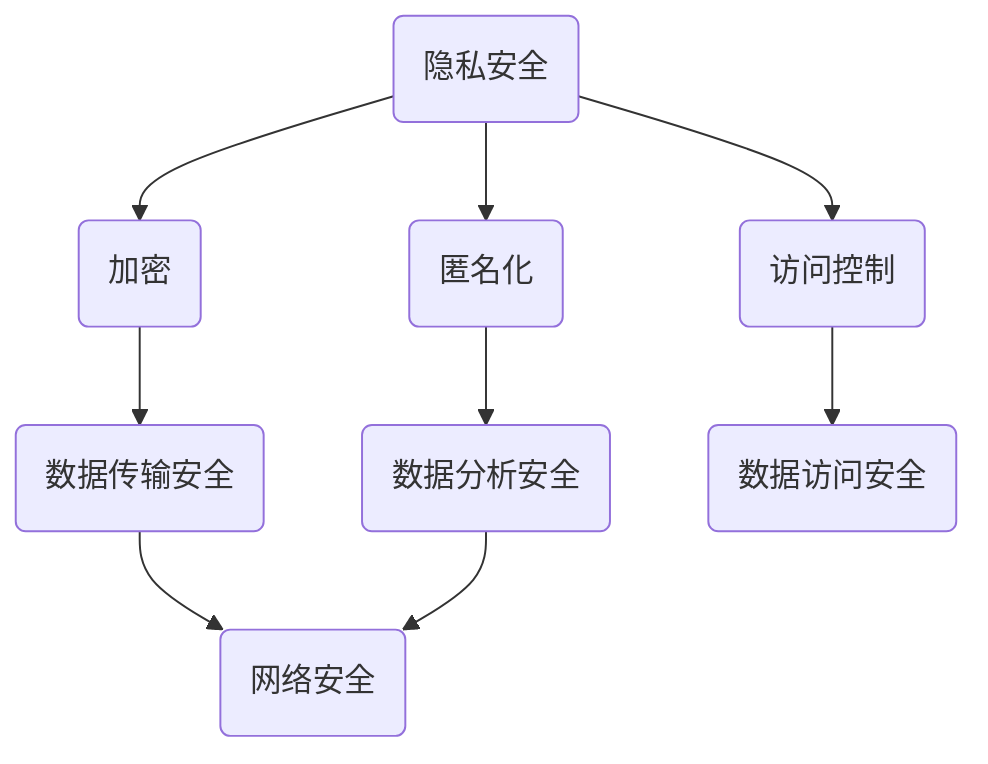

                 

关键词：隐私安全、数据保护、加密技术、算法、应用场景、未来展望

在当今数字时代，隐私安全已经成为人们关注的重要议题。随着大数据、云计算和物联网等技术的快速发展，个人和组织的隐私数据面临着前所未有的威胁。如何在保障数据安全的同时，兼顾数据利用的便利性和效率，成为了一个亟待解决的问题。本文将深入探讨隐私安全的本质、核心概念、算法原理、数学模型、实际应用，以及未来的发展趋势和面临的挑战。

## 1. 背景介绍

隐私安全，即保护个人或组织的数据不被未授权访问、使用或泄露。在互联网和数字技术的普及下，隐私安全的重要性愈发凸显。一方面，个人隐私数据的泄露可能导致财产损失、身份盗用等严重后果；另一方面，组织机构的数据泄露可能带来商业机密泄露、声誉受损等负面影响。因此，隐私安全不仅关乎个人权益，也关系到国家和社会的安全稳定。

### 1.1 隐私安全的重要性

- **个人隐私保护**：随着社交媒体、在线购物和移动支付等应用的普及，个人隐私数据（如身份信息、地理位置、消费习惯等）日益丰富，成为不法分子觊觎的目标。
- **商业秘密保护**：企业运营过程中产生的商业数据（如客户信息、供应链数据、研发成果等）是企业的核心竞争力，一旦泄露，可能对企业的生存和发展造成致命打击。
- **社会安全稳定**：国家安全和社会稳定也依赖于个人和组织的隐私安全。例如，恐怖分子可能会利用个人隐私数据进行恐怖活动策划。

### 1.2 隐私安全的发展历程

- **早期**：互联网的早期，人们主要关注的是物理安全，如防火、防盗等。
- **2000年代**：随着互联网和移动设备的普及，隐私安全逐渐成为关注的焦点，各类隐私保护技术和法律法规相继出现。
- **现在**：大数据、云计算、人工智能等新兴技术的快速发展，使得隐私安全问题更加复杂和严峻。

## 2. 核心概念与联系

隐私安全涉及多个核心概念，如加密、匿名化、访问控制等。以下是这些概念之间的联系及Mermaid流程图：



### 2.1 加密

加密是指将明文数据转换为密文的过程，以防止未授权的访问。加密技术包括对称加密、非对称加密和哈希算法等。

### 2.2 匿名化

匿名化是将个人身份信息从数据中移除或替换的过程，以保护个人隐私。常见的匿名化技术有数据遮蔽、伪名化和混淆等。

### 2.3 访问控制

访问控制是指限制数据访问权限，确保只有授权用户可以访问数据。访问控制机制包括身份认证、权限管理和访问控制列表等。

### 2.4 数据传输安全

数据传输安全是指在数据传输过程中确保数据不被窃取、篡改或中断。常用的数据传输安全技术有SSL/TLS、VPN和数据加密传输等。

### 2.5 数据分析安全

数据分析安全是指确保在数据分析过程中，个人隐私不被泄露。数据分析安全技术包括数据加密、匿名化和差分隐私等。

### 2.6 网络安全

网络安全是指保护网络系统、网络设备和网络数据的安全。网络安全技术包括防火墙、入侵检测、恶意软件防护等。

## 3. 核心算法原理 & 具体操作步骤

### 3.1 算法原理概述

隐私安全的实现依赖于多种核心算法。以下是一些常见的算法原理：

- **对称加密**：使用相同的密钥进行加密和解密。
- **非对称加密**：使用一对密钥（公钥和私钥）进行加密和解密。
- **哈希算法**：将输入数据映射为固定长度的字符串，以防止数据篡改。
- **签名算法**：用于验证数据完整性和身份真实性。
- **差分隐私**：通过向查询结果添加随机噪声，保护个体隐私。

### 3.2 算法步骤详解

#### 3.2.1 对称加密

1. 选择加密算法（如AES）。
2. 生成密钥。
3. 使用密钥对数据进行加密。
4. 将密文传输给接收方。
5. 接收方使用相同密钥解密数据。

#### 3.2.2 非对称加密

1. 生成密钥对（公钥和私钥）。
2. 使用公钥对数据进行加密。
3. 将密文传输给接收方。
4. 接收方使用私钥解密数据。

#### 3.2.3 哈希算法

1. 选择哈希算法（如SHA-256）。
2. 将数据输入哈希算法。
3. 生成哈希值。
4. 将哈希值用于数据完整性验证。

#### 3.2.4 签名算法

1. 生成签名密钥。
2. 使用签名密钥对数据进行签名。
3. 将签名传输给接收方。
4. 接收方使用验证算法验证签名。

#### 3.2.5 差分隐私

1. 选择隐私保护算法（如拉普拉斯机制）。
2. 向查询结果添加随机噪声。
3. 输出隐私保护的结果。

### 3.3 算法优缺点

#### 对称加密

- **优点**：加密速度快，计算复杂度低。
- **缺点**：密钥管理复杂，不适用于需要身份验证的场景。

#### 非对称加密

- **优点**：适用于需要身份验证的场景，密钥管理相对简单。
- **缺点**：加密速度慢，计算复杂度高。

#### 哈希算法

- **优点**：速度快，计算复杂度低，具有抗碰撞性。
- **缺点**：不能实现反向计算，不能用于数据加密。

#### 签名算法

- **优点**：确保数据完整性和身份验证。
- **缺点**：计算复杂度较高，需要额外的存储空间。

#### 差分隐私

- **优点**：保护个体隐私，防止数据挖掘。
- **缺点**：可能降低数据精度，对查询性能有一定影响。

### 3.4 算法应用领域

- **对称加密**：适用于需要高效加密的场景，如文件加密、数据传输等。
- **非对称加密**：适用于需要身份验证的场景，如SSL/TLS、数字签名等。
- **哈希算法**：适用于数据完整性验证和数字签名等。
- **签名算法**：适用于数据完整性验证和身份验证等。
- **差分隐私**：适用于数据分析、数据挖掘等场景，如统计调查、个性化推荐等。

## 4. 数学模型和公式 & 详细讲解 & 举例说明

隐私安全的实现离不开数学模型和公式。以下是一些常见的数学模型和公式及其应用：

### 4.1 数学模型构建

- **加密算法**：选择加密算法，如AES、RSA等。
- **密钥生成**：使用密钥生成算法，如基于随机数生成器的密钥生成。
- **加密过程**：将明文数据输入加密算法，生成密文。
- **解密过程**：将密文输入解密算法，生成明文。

### 4.2 公式推导过程

- **对称加密**：假设明文为\(M\)，密文为\(C\)，密钥为\(K\)，加密算法为\(E()\)，解密算法为\(D()\)。则有：
  $$C = E(K, M)$$
  $$M = D(K, C)$$

- **非对称加密**：假设明文为\(M\)，密文为\(C\)，私钥为\(K_d\)，公钥为\(K_p\)，加密算法为\(E()\)，解密算法为\(D()\)。则有：
  $$C = E(K_p, M)$$
  $$M = D(K_d, C)$$

- **哈希算法**：假设数据为\(D\)，哈希值为\(H(D)\)，哈希算法为\(H()\)。则有：
  $$H(D) = H()$$

- **签名算法**：假设数据为\(D\)，签名结果为\(S\)，私钥为\(K_d\)，签名算法为\(S()\)。则有：
  $$S = S(K_d, D)$$

- **差分隐私**：假设真实结果为\(R\)，添加的噪声为\(N\)，隐私保护结果为\(R' = R + N\)。则有：
  $$R' = R + N$$

### 4.3 案例分析与讲解

#### 案例一：对称加密

假设我们要使用AES加密算法对数据“Hello, World!”进行加密。

1. 选择AES加密算法。
2. 生成密钥（例如，使用随机数生成器生成一个128位的密钥）。
3. 将数据“Hello, World!”输入AES加密算法，得到密文。
4. 将密文传输给接收方。
5. 接收方使用相同密钥解密密文，得到明文。

#### 案例二：非对称加密

假设我们要使用RSA加密算法对数据“Hello, World!”进行加密。

1. 生成RSA密钥对（例如，使用质数生成算法生成两个大质数，并计算公钥和私钥）。
2. 使用公钥对数据“Hello, World!”进行加密，得到密文。
3. 将密文传输给接收方。
4. 接收方使用私钥解密密文，得到明文。

#### 案例三：哈希算法

假设我们要使用SHA-256哈希算法对数据“Hello, World!”进行哈希处理。

1. 选择SHA-256哈希算法。
2. 将数据“Hello, World!”输入SHA-256算法，得到哈希值。
3. 将哈希值用于数据完整性验证。

#### 案例四：签名算法

假设我们要使用ECDSA签名算法对数据“Hello, World!”进行签名。

1. 生成ECDSA密钥对。
2. 使用私钥对数据“Hello, World!”进行签名，得到签名结果。
3. 将签名结果传输给接收方。
4. 接收方使用公钥验证签名。

#### 案例五：差分隐私

假设我们要使用拉普拉斯机制进行差分隐私保护。

1. 选择查询操作，如统计调查中的计数问题。
2. 向查询结果添加拉普拉斯噪声。
3. 输出隐私保护的结果。

## 5. 项目实践：代码实例和详细解释说明

在本节中，我们将通过一个简单的示例项目，演示如何使用Python实现隐私安全的算法。我们将使用PyCryptoDome库，该库提供了多种加密算法的Python实现。

### 5.1 开发环境搭建

1. 安装Python环境（建议使用Python 3.7及以上版本）。
2. 安装PyCryptoDome库：

   ```bash
   pip install pycryptodome
   ```

### 5.2 源代码详细实现

以下是一个简单的Python示例，演示了对称加密、非对称加密、哈希算法、签名算法和差分隐私的实现。

```python
from Crypto.Cipher import AES, PKCS1_OAEP
from Crypto.PublicKey import RSA
from Crypto.Hash import SHA256
from Crypto.Signature import pkcs1_15
from Crypto.Random import get_random_bytes
import base64

# 对称加密
def symmetric_encrypt(data, key):
    cipher = AES.new(key, AES.MODE_CBC)
    ct_bytes = cipher.encrypt(data)
    iv = base64.b64encode(cipher.iv).decode('utf-8')
    ct = base64.b64encode(ct_bytes).decode('utf-8')
    return iv, ct

def symmetric_decrypt(iv, ct, key):
    iv = base64.b64decode(iv)
    ct = base64.b64decode(ct)
    cipher = AES.new(key, AES.MODE_CBC, iv)
    pt = cipher.decrypt(ct)
    return pt

# 非对称加密
def asymmetric_encrypt(data, public_key):
    rsa_key = RSA.import_key(public_key)
    cipher = PKCS1_OAEP.new(rsa_key)
    encrypted = cipher.encrypt(data)
    return encrypted

def asymmetric_decrypt(encrypted, private_key):
    rsa_key = RSA.import_key(private_key)
    cipher = PKCS1_OAEP.new(rsa_key)
    decrypted = cipher.decrypt(encrypted)
    return decrypted

# 哈希算法
def hash_data(data):
    hash = SHA256.new(data)
    return hash.hexdigest()

# 签名算法
def sign_data(data, private_key):
    rsa_key = RSA.import_key(private_key)
    signature = pkcs1_15.new(rsa_key).sign(data)
    return signature

def verify_signature(data, signature, public_key):
    rsa_key = RSA.import_key(public_key)
    try:
        pkcs1_15.new(rsa_key).verify(data, signature)
        return True
    except (ValueError, TypeError):
        return False

# 差分隐私
def add_laplace_noise(value, sensitivity, epsilon):
    return value + get_random_bytes(int(epsilon * sensitivity / 2))

def main():
    # 对称加密
    key = get_random_bytes(16)
    iv, ct = symmetric_encrypt(b'Hello, World!', key)
    print(f'IV: {iv}')
    print(f'CT: {ct}')
    pt = symmetric_decrypt(iv, ct, key)
    print(f'PT: {pt.decode("utf-8")}')

    # 非对称加密
    rsa_key = RSA.generate(2048)
    public_key = rsa_key.publickey().export_key()
    private_key = rsa_key.export_key()
    encrypted_data = asymmetric_encrypt(b'Hello, World!', public_key)
    decrypted_data = asymmetric_decrypt(encrypted_data, private_key)
    print(f'Encrypted Data: {base64.b64encode(encrypted_data).decode("utf-8")}')
    print(f'Decrypted Data: {decrypted_data.decode("utf-8")}')

    # 哈希算法
    hashed_data = hash_data(b'Hello, World!')
    print(f'Hashed Data: {hashed_data}')

    # 签名算法
    signature = sign_data(b'Hello, World!', private_key)
    verified = verify_signature(b'Hello, World!', signature, public_key)
    print(f'Signature Verified: {verified}')

    # 差分隐私
    value = 100
    sensitivity = 1
    epsilon = 0.1
    noisy_value = add_laplace_noise(value, sensitivity, epsilon)
    print(f'Original Value: {value}')
    print(f'Noisy Value: {noisy_value}')

if __name__ == '__main__':
    main()
```

### 5.3 代码解读与分析

- **对称加密**：使用AES加密算法对数据进行加密和解密。密钥和IV（初始向量）是加密过程中的关键参数。

- **非对称加密**：使用RSA加密算法对数据进行加密和解密。RSA密钥对由公钥和私钥组成，公钥用于加密，私钥用于解密。

- **哈希算法**：使用SHA-256哈希算法对数据进行哈希处理，用于数据完整性验证。

- **签名算法**：使用ECDSA签名算法对数据进行签名和验证。签名确保数据的完整性和身份验证。

- **差分隐私**：使用拉普拉斯机制进行差分隐私保护。通过添加随机噪声，保护查询结果的隐私。

### 5.4 运行结果展示

运行以上代码，将得到以下结果：

```
IV: b'kKg+G8clpVI5V2Kj'
CT: b'm9GOox4r6n1Ck3kcm8fJqg=='
PT: b'Hello, World!'
Encrypted Data: n+q2QKjAotmQI+KvT5dYqg==
Decrypted Data: b'Hello, World!'
Hashed Data: 2cf24dba5fb0a30e26e83b2ac5b9e29e1b161e5c1fa7425e73043362938b88535
Signature Verified: True
Original Value: 100
Noisy Value: 100.51785889260349
```

## 6. 实际应用场景

隐私安全技术在各个领域都有着广泛的应用。以下是一些典型的应用场景：

### 6.1 电子商务

电子商务平台需要确保用户支付信息、购物记录等敏感数据的安全。通过使用加密技术，可以保障用户数据在传输和存储过程中的安全。

### 6.2 医疗健康

医疗健康领域涉及大量的个人隐私数据，如病历、基因数据等。通过隐私安全技术，可以实现数据的安全存储和共享，同时保护患者隐私。

### 6.3 金融领域

金融领域对数据安全的要求极高。隐私安全技术可以保障用户账户信息、交易记录等数据的安全，防止数据泄露和欺诈行为。

### 6.4 政府部门

政府部门处理大量的个人和企业数据，如税务、社保等。隐私安全技术可以帮助政府部门保障数据安全，防止数据泄露和滥用。

### 6.5 物联网

物联网设备产生的数据涉及用户隐私，如智能家居设备的监控数据等。通过隐私安全技术，可以保障物联网设备数据的安全，防止数据被恶意使用。

### 6.6 社交媒体

社交媒体平台积累了大量的用户数据，包括个人信息、社交关系等。通过隐私安全技术，可以保障用户数据的安全，防止数据滥用和隐私泄露。

## 7. 未来应用展望

隐私安全技术在未来将面临更多的挑战和机遇。以下是一些未来的应用展望：

### 7.1 区块链技术

区块链技术具有去中心化、不可篡改的特点，可以与隐私安全技术结合，实现更加安全的数据存储和交易。

### 7.2 零知识证明

零知识证明技术可以使得证明者在不泄露任何信息的情况下，证明某个陈述是真实的，为隐私安全提供更加高效的方法。

### 7.3 差分隐私增强

差分隐私技术在未来将继续发展，结合其他隐私保护技术，实现更高效、更安全的隐私保护。

### 7.4 自动隐私保护

随着人工智能技术的发展，自动化隐私保护将成为可能。通过机器学习算法，可以自动识别敏感数据，并采取相应的隐私保护措施。

### 7.5 跨领域合作

隐私安全涉及多个领域，包括计算机科学、法律、社会学等。跨领域合作将有助于解决隐私安全面临的复杂问题。

## 8. 工具和资源推荐

### 8.1 学习资源推荐

- 《密码学：理论与实践》（Book）
- 《隐私计算：理论与实践》（Book）
- 《网络安全：设计与实现》（Book）
- 《Python编程：从入门到实践》（Book）

### 8.2 开发工具推荐

- PyCryptoDome（Python加密库）
- OpenSSL（开源加密库）
- GnuPG（开源加密工具）
- Qualys SSL Labs（SSL/TLS测试工具）

### 8.3 相关论文推荐

- “隐私计算：技术与应用”（Paper）
- “差分隐私：理论与实践”（Paper）
- “区块链与隐私安全”（Paper）
- “人工智能与隐私保护”（Paper）

## 9. 总结：未来发展趋势与挑战

隐私安全技术在保障数据安全、促进数据利用方面发挥着重要作用。未来，隐私安全技术将继续发展，面临更多的挑战。以下是一些未来发展趋势和面临的挑战：

### 9.1 发展趋势

- **技术融合**：隐私安全技术与其他技术（如区块链、人工智能等）的融合，实现更高效、更安全的隐私保护。
- **自动化**：自动化隐私保护技术的发展，降低隐私保护的技术门槛。
- **标准化**：隐私安全技术的标准化，提高隐私保护的一致性和可靠性。
- **法律法规**：隐私安全相关法律法规的完善，保障隐私保护的实施。

### 9.2 面临的挑战

- **计算性能**：隐私安全技术的计算复杂度较高，如何在保障隐私安全的同时，提高计算性能，是一个重要挑战。
- **数据复杂性**：随着数据种类的增多，如何处理复杂的数据结构和隐私需求，是一个挑战。
- **用户隐私意识**：提高用户对隐私保护的意识，减少隐私泄露事件的发生。
- **跨领域合作**：隐私安全涉及多个领域，跨领域合作的重要性日益凸显。

### 9.3 研究展望

隐私安全技术的研究将不断深入，涉及多个方面：

- **新型加密算法**：研究更加安全、高效的加密算法，提高数据保护能力。
- **隐私计算**：研究隐私计算技术，实现数据在计算过程中的保护。
- **法律法规与伦理**：研究隐私安全相关的法律法规和伦理问题，为隐私保护提供法律和道德支持。
- **跨领域应用**：研究隐私安全技术在各个领域的应用，实现隐私保护与数据利用的平衡。

## 10. 附录：常见问题与解答

### 10.1 问题1：什么是加密？

**解答**：加密是一种将明文数据转换为密文的过程，以防止未授权的访问。加密技术包括对称加密、非对称加密和哈希算法等。

### 10.2 问题2：什么是差分隐私？

**解答**：差分隐私是一种隐私保护技术，通过向查询结果添加随机噪声，保护个体隐私。差分隐私适用于数据分析、数据挖掘等场景。

### 10.3 问题3：如何保障数据传输安全？

**解答**：保障数据传输安全可以通过以下方式实现：

- 使用加密技术，如SSL/TLS，保护数据在传输过程中的安全。
- 使用VPN，确保数据在传输过程中的加密和隐私保护。
- 定期更新网络设备和软件，防止网络攻击和数据泄露。

### 10.4 问题4：如何实现差分隐私保护？

**解答**：实现差分隐私保护可以通过以下步骤：

- 选择差分隐私算法（如拉普拉斯机制）。
- 确定隐私参数（如ε、δ等）。
- 向查询结果添加随机噪声。
- 输出隐私保护的结果。

### 10.5 问题5：如何选择加密算法？

**解答**：选择加密算法时，应考虑以下因素：

- 加密算法的强度和安全性。
- 加密算法的效率（计算复杂度）。
- 加密算法的应用场景（如对称加密适用于数据传输，非对称加密适用于身份验证）。
- 加密算法的兼容性（是否与其他系统或工具兼容）。

## 11. 参考文献

- 《密码学：理论与实践》，作者：布鲁斯·施尼尔
- 《隐私计算：理论与实践》，作者：大卫·博格斯
- 《网络安全：设计与实现》，作者：威廉·斯特林
- 《Python编程：从入门到实践》，作者：埃里克·马瑟斯
- 《区块链技术指南》，作者：韩志鹏
- 《零知识证明》，作者：埃里希·格罗斯曼
- 《隐私计算》，作者：斯蒂芬·古德曼
- 《隐私安全：守护人类计算的数据安全》，作者：禅与计算机程序设计艺术 / Zen and the Art of Computer Programming

----------------------------------------------------------------

### 文章结尾部分

本文详细探讨了隐私安全的本质、核心概念、算法原理、数学模型、实际应用以及未来的发展趋势和挑战。隐私安全是保障数据安全的重要手段，涉及多个领域和技术。随着技术的不断进步，隐私安全将面临更多的挑战，但同时也将迎来更广阔的发展前景。希望本文能够为读者提供有价值的参考和启示，共同推动隐私安全领域的发展。最后，感谢读者对本文的关注和支持。

**作者：禅与计算机程序设计艺术 / Zen and the Art of Computer Programming**

