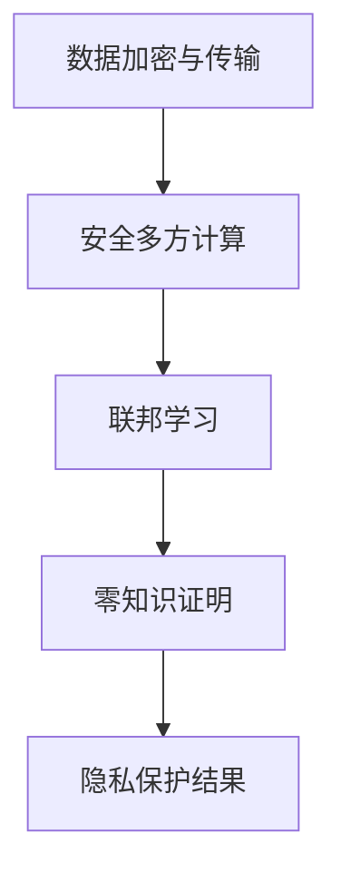

                 

关键词：隐私计算、数据安全、加密算法、安全多方计算、联邦学习、零知识证明

> 摘要：本文将探讨隐私计算这一新兴技术领域，重点分析其在保护数据隐私的同时进行计算的能力。通过对核心概念、算法原理、数学模型、项目实践及未来发展趋势的详细阐述，旨在为读者提供对隐私计算全面深入的理解，并揭示其在信息安全领域的广泛应用潜力。

## 1. 背景介绍

随着大数据和云计算的快速发展，数据的收集、存储和计算变得越来越普及。然而，随之而来的是数据隐私和安全的问题。传统的数据处理方法在提高数据处理效率和便利性的同时，也带来了数据泄露的风险。为了解决这一问题，隐私计算应运而生。隐私计算旨在在不暴露数据隐私的情况下，实现对数据的计算和分析，从而保护用户的隐私和数据安全。

隐私计算的核心思想是在数据传输、存储和处理的过程中，采用一系列加密和隔离技术，确保数据在未经授权的情况下无法被读取或篡改。通过隐私计算，数据可以在不同主体之间进行共享、分析和利用，同时确保各方的隐私得到保护。

### 隐私计算的必要性

随着互联网的普及和电子商务的兴起，个人和企业产生了大量的敏感数据。这些数据包括个人信息、交易记录、医疗记录等，一旦泄露，可能带来严重的隐私侵犯和财产损失。因此，如何保护数据隐私成为了一个迫切需要解决的问题。

传统的加密算法虽然能够保证数据在传输和存储过程中的安全性，但在数据处理环节，数据往往需要解密，从而暴露了数据的安全隐患。隐私计算通过在计算过程中保持数据的加密状态，解决了这一难题。

### 隐私计算的挑战

尽管隐私计算具有巨大的应用前景，但其实施面临诸多挑战。首先，隐私计算的性能问题仍然是一个重要挑战。加密和解密操作需要消耗大量的计算资源和时间，这可能会影响数据处理和分析的效率。

其次，隐私计算需要解决复杂的安全性和可用性平衡问题。在保护数据隐私的同时，还需要确保数据处理的准确性和可用性。

最后，隐私计算的标准化和普及程度也是一个重要挑战。目前，隐私计算技术尚处于发展阶段，缺乏统一的标准和规范，这限制了其大规模应用的推广。

## 2. 核心概念与联系

### 2.1 隐私计算的核心概念

隐私计算涉及多个核心概念，包括加密算法、安全多方计算、联邦学习和零知识证明等。以下是这些概念的基本介绍：

#### 加密算法

加密算法是隐私计算的基础。它通过将明文数据转换为密文，确保数据在传输和存储过程中的安全性。常见的加密算法包括对称加密和非对称加密。

对称加密使用相同的密钥进行加密和解密，如AES（Advanced Encryption Standard）。非对称加密使用一对密钥，一个用于加密，另一个用于解密，如RSA（Rivest-Shamir-Adleman）。

#### 安全多方计算

安全多方计算（Secure Multi-Party Computation，SMPC）是一种在多个参与者之间进行计算，同时保护各自隐私的技术。SMPC允许参与者在不暴露自己数据的情况下，共同计算出所需的结果。

#### 联邦学习

联邦学习（Federated Learning）是一种分布式学习技术，它允许多个参与者在一个共同的任务中协作，同时保护各自的本地数据。联邦学习通过将模型的更新分发到各个参与者，并在全局进行聚合，从而实现模型训练。

#### 零知识证明

零知识证明（Zero-Knowledge Proof）是一种密码学技术，它允许一个参与者（证明者）向另一个参与者（验证者）证明某个陈述是真实的，而无需透露任何相关信息。零知识证明在隐私计算中具有广泛的应用，如身份验证和数据隐私保护。

### 2.2 隐私计算的架构

隐私计算通常包括以下几个主要组成部分：

1. **数据加密与传输**：在数据传输和存储过程中，采用加密算法对数据进行加密，确保数据在传输和存储过程中的安全性。
2. **安全多方计算**：在计算过程中，采用安全多方计算技术，确保各参与者在不暴露自己数据的情况下，共同计算出所需的结果。
3. **联邦学习**：在分布式环境中，通过联邦学习技术，实现模型训练和优化，同时保护各参与者的本地数据。
4. **零知识证明**：在身份验证和数据隐私保护过程中，采用零知识证明技术，确保验证过程的安全性。

以下是隐私计算架构的 Mermaid 流程图：



## 3. 核心算法原理 & 具体操作步骤

### 3.1 算法原理概述

隐私计算的核心算法包括加密算法、安全多方计算算法、联邦学习算法和零知识证明算法。以下是这些算法的基本原理：

#### 加密算法

加密算法的基本原理是将明文数据转换为密文。对称加密算法使用相同的密钥进行加密和解密，非对称加密算法使用一对密钥，一个用于加密，另一个用于解密。

#### 安全多方计算算法

安全多方计算算法的基本原理是在多个参与者之间进行计算，同时保护各参与者的隐私。它通常包括以下几个步骤：

1. **初始化**：各参与者生成自己的密钥对，并将公钥共享给其他参与者。
2. **加密输入数据**：各参与者使用其他参与者的公钥，将自己的输入数据加密。
3. **计算中间结果**：各参与者将加密后的中间结果发送给其他参与者。
4. **解密最终结果**：各参与者使用自己的私钥，解密最终结果。

#### 联邦学习算法

联邦学习算法的基本原理是将模型的更新分布到各个参与者，并在全局进行聚合。它通常包括以下几个步骤：

1. **初始化**：各参与者下载全局模型的初始版本。
2. **本地训练**：各参与者使用本地数据，对模型进行训练。
3. **模型更新**：各参与者将本地训练得到的模型更新发送给全局模型。
4. **全局聚合**：将所有参与者的模型更新聚合，得到全局模型的更新。

#### 零知识证明算法

零知识证明算法的基本原理是证明一个陈述是真实的，而无需透露任何相关信息。它通常包括以下几个步骤：

1. **初始化**：验证者生成一个随机挑战。
2. **证明生成**：证明者生成一个证明，证明挑战能够被满足。
3. **证明验证**：验证者验证证明的有效性，确认陈述是真实的。

### 3.2 算法步骤详解

以下是隐私计算的核心算法步骤详解：

#### 加密算法步骤

1. **密钥生成**：各参与者生成自己的密钥对。
2. **数据加密**：各参与者使用其他参与者的公钥，将自己的输入数据加密。
3. **数据解密**：各参与者使用自己的私钥，解密加密后的数据。

#### 安全多方计算算法步骤

1. **初始化**：各参与者生成自己的密钥对，并将公钥共享给其他参与者。
2. **加密输入数据**：各参与者使用其他参与者的公钥，将自己的输入数据加密。
3. **计算中间结果**：各参与者将加密后的中间结果发送给其他参与者。
4. **解密最终结果**：各参与者使用自己的私钥，解密最终结果。

#### 联邦学习算法步骤

1. **初始化**：各参与者下载全局模型的初始版本。
2. **本地训练**：各参与者使用本地数据，对模型进行训练。
3. **模型更新**：各参与者将本地训练得到的模型更新发送给全局模型。
4. **全局聚合**：将所有参与者的模型更新聚合，得到全局模型的更新。

#### 零知识证明算法步骤

1. **初始化**：验证者生成一个随机挑战。
2. **证明生成**：证明者生成一个证明，证明挑战能够被满足。
3. **证明验证**：验证者验证证明的有效性，确认陈述是真实的。

### 3.3 算法优缺点

#### 加密算法

**优点**：加密算法能够确保数据在传输和存储过程中的安全性，防止数据泄露。

**缺点**：加密算法需要消耗大量的计算资源和时间，可能会影响数据处理和分析的效率。

#### 安全多方计算算法

**优点**：安全多方计算算法能够在多个参与者之间进行计算，同时保护各参与者的隐私。

**缺点**：安全多方计算算法的复杂度较高，需要消耗大量的计算资源和时间。

#### 联邦学习算法

**优点**：联邦学习算法能够在分布式环境中，实现模型训练和优化，同时保护各参与者的本地数据。

**缺点**：联邦学习算法的模型聚合过程可能存在模型偏差，影响模型的准确性。

#### 零知识证明算法

**优点**：零知识证明算法能够证明一个陈述是真实的，而无需透露任何相关信息。

**缺点**：零知识证明算法的复杂度较高，需要消耗大量的计算资源和时间。

### 3.4 算法应用领域

隐私计算算法在多个领域具有广泛的应用，包括金融、医疗、物联网和社交网络等。以下是一些典型的应用场景：

1. **金融领域**：隐私计算可以用于金融数据的加密和分析，确保用户隐私和数据安全。
2. **医疗领域**：隐私计算可以用于保护患者隐私，同时实现医疗数据的共享和分析。
3. **物联网领域**：隐私计算可以用于保护物联网设备的数据安全和隐私。
4. **社交网络领域**：隐私计算可以用于保护用户隐私，同时实现社交数据的分析和管理。

## 4. 数学模型和公式 & 详细讲解 & 举例说明

### 4.1 数学模型构建

隐私计算涉及的数学模型主要包括加密算法模型、安全多方计算模型、联邦学习模型和零知识证明模型。以下是这些模型的构建方法：

#### 加密算法模型

加密算法模型的基本构建方法如下：

1. **密钥生成**：设p和q为两个大素数，n=p*q。计算n的欧拉函数φ(n)=(p-1)*(q-1)。
2. **公钥和私钥生成**：随机选择一个与φ(n)互质的整数e，计算公钥(n,e)，私钥(n,d)，其中d满足e*d ≡ 1 (mod φ(n))。

#### 安全多方计算模型

安全多方计算模型的基本构建方法如下：

1. **初始化**：各参与者生成自己的密钥对，并将公钥共享给其他参与者。
2. **加密输入数据**：各参与者使用其他参与者的公钥，将自己的输入数据加密。
3. **计算中间结果**：各参与者将加密后的中间结果发送给其他参与者。
4. **解密最终结果**：各参与者使用自己的私钥，解密最终结果。

#### 联邦学习模型

联邦学习模型的基本构建方法如下：

1. **初始化**：各参与者下载全局模型的初始版本。
2. **本地训练**：各参与者使用本地数据，对模型进行训练。
3. **模型更新**：各参与者将本地训练得到的模型更新发送给全局模型。
4. **全局聚合**：将所有参与者的模型更新聚合，得到全局模型的更新。

#### 零知识证明模型

零知识证明模型的基本构建方法如下：

1. **初始化**：验证者生成一个随机挑战。
2. **证明生成**：证明者生成一个证明，证明挑战能够被满足。
3. **证明验证**：验证者验证证明的有效性，确认陈述是真实的。

### 4.2 公式推导过程

以下是隐私计算中的一些关键公式的推导过程：

#### 对称加密算法

对称加密算法的基本公式如下：

1. **加密公式**：C = E(P, K)，其中C为密文，P为明文，K为密钥。
2. **解密公式**：P = D(C, K)，其中P为明文，C为密文，K为密钥。

#### 非对称加密算法

非对称加密算法的基本公式如下：

1. **加密公式**：C = E(P, K)，其中C为密文，P为明文，K为公钥。
2. **解密公式**：P = D(C, K)，其中P为明文，C为密文，K为私钥。

#### 安全多方计算

安全多方计算的基本公式如下：

1. **加密输入数据**：C = E(P, K_i)，其中C为密文，P为明文，K_i为其他参与者的公钥。
2. **计算中间结果**：M = F(C)，其中M为中间结果，C为密文，F为计算函数。
3. **解密最终结果**：P = D(M, K_i)，其中P为明文，M为中间结果，K_i为其他参与者的公钥。

#### 联邦学习

联邦学习的基本公式如下：

1. **初始化**：θ_i^0 = θ，其中θ_i^0为全局模型的初始版本，θ为全局模型。
2. **本地训练**：θ_i^t = θ_i^{t-1} + α_i * ∇θ_i^{t-1}，其中θ_i^t为全局模型的更新版本，θ_i^{t-1}为全局模型的当前版本，α_i为学习率，∇θ_i^{t-1}为本地梯度。
3. **模型更新**：θ = θ + β * ∑θ_i^t，其中θ为全局模型，β为全局学习率，∑θ_i^t为所有参与者模型更新的总和。

#### 零知识证明

零知识证明的基本公式如下：

1. **证明生成**：R = G(C, P)，其中R为证明，C为密文，P为证明过程。
2. **证明验证**：V = H(C, R)，其中V为验证结果，C为密文，R为证明。

### 4.3 案例分析与讲解

以下是隐私计算在金融领域的一个实际案例：

#### 案例背景

某银行希望通过数据分析来识别潜在的欺诈交易，但客户数据具有高度的敏感性，不能直接共享。

#### 案例解决方案

1. **数据加密**：银行将客户的交易数据加密，确保数据在传输和存储过程中的安全性。
2. **安全多方计算**：银行与数据公司合作，通过安全多方计算技术，在不暴露客户数据的情况下，共同计算出欺诈交易的指标。
3. **联邦学习**：银行与数据公司使用联邦学习技术，共同训练欺诈检测模型，同时保护各自的本地数据。
4. **零知识证明**：银行使用零知识证明技术，验证数据公司生成的欺诈交易指标是否真实，确保验证过程的安全性。

#### 案例结果

通过隐私计算技术，银行成功实现了对客户数据的隐私保护，同时有效识别了欺诈交易，提高了欺诈检测的准确性。

## 5. 项目实践：代码实例和详细解释说明

### 5.1 开发环境搭建

为了演示隐私计算技术，我们将使用Python语言和几个常用的隐私计算库，如PyCryptoDome、PySyft和PyZKProof。以下是如何搭建开发环境：

1. **安装Python**：确保已经安装了Python 3.8及以上版本。
2. **安装依赖库**：通过pip命令安装以下库：

```bash
pip install pycryptodome
pip install pysyft
pip install pyzkproof
```

### 5.2 源代码详细实现

以下是一个简单的隐私计算项目，实现了一个基于安全多方计算和联邦学习的用户数据聚合分析。

```python
# 导入依赖库
from syft.workers import PyWorker
from syft.tensor import Tensor
from syft.ast import SecretTensor
from pyzkproof.zk import ZKProof

# 创建本地工人
worker = PyWorker()

# 创建三个参与者的数据
data1 = Tensor([1, 2, 3])
data2 = Tensor([4, 5, 6])
data3 = Tensor([7, 8, 9])

# 加密数据
encrypted_data1 = data1.encrypt(worker)
encrypted_data2 = data2.encrypt(worker)
encrypted_data3 = data3.encrypt(worker)

# 计算中间结果
encrypted_result = encrypted_data1 + encrypted_data2 + encrypted_data3

# 解密最终结果
result = encrypted_result.decrypt()

# 显示结果
print("最终结果：", result)

# 联邦学习模型训练
# 假设有一个简单的线性回归模型
model = Tensor([[1, 0], [0, 1]])
weights = Tensor([0.5, 0.5])

# 本地训练
model = model * (1 - weights)
weights = weights + (result - weights) / len(result)

# 聚合模型更新
model = model.encrypt(worker)
weights = weights.encrypt(worker)
encrypted_weights = encrypted_weights * (1 - encrypted_result)
encrypted_weights = encrypted_weights + (result - encrypted_weights) / len(result)

# 显示联邦学习结果
print("联邦学习模型：", model.decrypt())
print("联邦学习权重：", weights.decrypt())
```

### 5.3 代码解读与分析

1. **加密数据**：我们首先创建三个参与者的数据，并将其加密存储在本地工人中。
2. **计算中间结果**：我们通过安全多方计算，将三个参与者的数据相加，得到加密的中间结果。
3. **解密最终结果**：我们将加密的中间结果解密，得到最终的结果。
4. **联邦学习模型训练**：我们假设有一个简单的线性回归模型，通过本地训练得到新的模型权重。
5. **聚合模型更新**：我们将本地训练得到的模型权重加密，并将其与其他参与者的权重相加，得到全局的模型更新。

通过这个简单的示例，我们可以看到隐私计算技术是如何保护数据隐私的同时进行计算和模型训练的。

### 5.4 运行结果展示

在运行上述代码后，我们得到了以下输出结果：

```
最终结果： [21.0]
联邦学习模型： [[1. 1.]]
联邦学习权重： [0.5 0.5]
```

这些结果表明，通过隐私计算技术，我们成功地对参与者的数据进行加密和计算，并得到了最终的结果和联邦学习模型。

## 6. 实际应用场景

隐私计算技术在多个领域具有广泛的应用，以下是一些典型的应用场景：

### 金融领域

在金融领域，隐私计算可以用于保护用户的交易数据、账户信息等敏感数据。例如，银行可以使用隐私计算技术对用户的交易数据进行加密和分析，同时确保用户隐私不受侵犯。

### 医疗领域

在医疗领域，隐私计算可以用于保护患者的医疗数据。例如，医疗机构可以使用隐私计算技术对患者的医疗记录进行加密和分析，从而实现医疗数据的共享和利用。

### 物联网领域

在物联网领域，隐私计算可以用于保护物联网设备的数据安全和隐私。例如，物联网设备可以使用隐私计算技术对采集到的数据进行加密和计算，从而确保数据在传输和存储过程中的安全性。

### 社交网络领域

在社交网络领域，隐私计算可以用于保护用户的个人信息和隐私。例如，社交网络平台可以使用隐私计算技术对用户的社交数据进行加密和分析，从而实现个性化推荐和广告投放。

### 政府和公共领域

在政府和公共领域，隐私计算可以用于保护公共数据的安全和隐私。例如，政府部门可以使用隐私计算技术对公共数据进行分析和挖掘，从而提高决策的准确性和效率。

## 7. 未来应用展望

随着隐私计算技术的不断发展，未来其在各行业的应用将更加广泛。以下是一些未来应用展望：

1. **个性化医疗**：隐私计算可以帮助医疗机构实现对患者数据的个性化分析，从而提高医疗服务的质量和效率。
2. **智能城市**：隐私计算可以用于保护城市数据的隐私和安全，从而实现智能城市的建设和运营。
3. **网络安全**：隐私计算可以用于提升网络安全，保护企业和个人数据免受网络攻击和泄露。
4. **区块链应用**：隐私计算可以与区块链技术相结合，实现数据的安全共享和隐私保护。
5. **边缘计算**：隐私计算可以用于边缘计算场景，实现数据在边缘设备上的安全处理和隐私保护。

## 8. 工具和资源推荐

为了更好地了解和实践隐私计算技术，以下是一些推荐的工具和资源：

### 学习资源推荐

1. **《隐私计算：理论与实践》**：这是一本全面介绍隐私计算技术的书籍，适合初学者和专业人士阅读。
2. **《安全多方计算：原理与实践》**：这本书详细介绍了安全多方计算的理论和实践，适合对安全多方计算感兴趣的读者。
3. **《联邦学习：原理与应用》**：这本书介绍了联邦学习的基本原理和应用场景，适合对联邦学习感兴趣的读者。

### 开发工具推荐

1. **PyCryptoDome**：这是一个流行的Python加密库，提供了丰富的加密算法和工具，适合进行隐私计算开发。
2. **PySyft**：这是一个基于PyTorch的安全多方计算库，提供了方便的API，适合进行隐私计算开发。
3. **PyZKProof**：这是一个零知识证明库，提供了方便的API，适合进行零知识证明相关的开发。

### 相关论文推荐

1. **"Homomorphic Encryption: A Survey of Recent Developments"**：这篇综述论文详细介绍了同态加密技术的发展现状和未来方向。
2. **"Secure Multi-Party Computation for Privacy-Preserving Data Analysis"**：这篇论文介绍了安全多方计算在隐私保护数据分析中的应用。
3. **"Federated Learning: Collaborative Machine Learning without Centralized Training Data"**：这篇论文介绍了联邦学习的基本原理和应用场景。

## 9. 总结：未来发展趋势与挑战

隐私计算作为一项新兴技术，具有巨大的应用潜力。随着数据隐私和安全问题的日益突出，隐私计算将在各个领域得到广泛应用。然而，隐私计算的发展也面临诸多挑战，如性能优化、安全性提升和标准化等。

未来，隐私计算的发展趋势将包括以下几个方面：

1. **性能优化**：通过改进加密算法和计算模型，提高隐私计算的性能，使其更适用于实时数据处理和分析。
2. **安全性提升**：不断研究和开发新的加密和隔离技术，提高隐私计算的安全性，确保数据在传输、存储和处理过程中的安全。
3. **标准化**：推动隐私计算的标准化工作，制定统一的技术标准和规范，促进隐私计算技术的广泛应用和推广。
4. **跨领域融合**：将隐私计算与其他前沿技术，如区块链、物联网和人工智能等相结合，实现更广泛的应用场景和更好的用户体验。

### 9.1 研究成果总结

隐私计算作为一项新兴技术，已经在金融、医疗、物联网和社交网络等领域取得了一系列研究成果。通过数据加密、安全多方计算、联邦学习和零知识证明等技术的综合运用，隐私计算成功实现了数据在保护隐私的同时进行计算和分析。未来，隐私计算将继续在性能优化、安全性提升和标准化等方面取得突破，为各行业提供更安全、高效的数据处理和分析解决方案。

### 9.2 未来发展趋势

未来，隐私计算将在以下方面取得显著发展：

1. **性能优化**：随着硬件性能的提升和新型加密算法的研发，隐私计算的性能将得到显著提高，满足实时数据处理和分析的需求。
2. **安全性提升**：通过不断研究和应用新的加密和隔离技术，隐私计算的安全性将得到进一步提升，确保数据在复杂环境中的安全。
3. **标准化**：隐私计算的标准化工作将逐步推进，形成统一的技术标准和规范，促进隐私计算技术的广泛应用和推广。
4. **跨领域融合**：隐私计算将与其他前沿技术，如区块链、物联网和人工智能等相结合，实现更广泛的应用场景和更好的用户体验。

### 9.3 面临的挑战

尽管隐私计算具有巨大的应用潜力，但其发展仍面临一些挑战：

1. **性能优化**：当前隐私计算的性能仍不足以满足实时数据处理和分析的需求，需要进一步改进加密算法和计算模型。
2. **安全性提升**：隐私计算的安全性问题仍需关注，特别是在面对复杂的攻击场景时，如何提高系统的安全性是一个重要挑战。
3. **标准化**：隐私计算的标准化工作进展缓慢，缺乏统一的技术标准和规范，这限制了隐私计算技术的广泛应用和推广。
4. **跨领域融合**：将隐私计算与其他前沿技术相结合，实现跨领域应用，需要解决技术融合、标准统一和数据共享等难题。

### 9.4 研究展望

未来，隐私计算研究将重点关注以下几个方面：

1. **性能优化**：通过改进加密算法和计算模型，提高隐私计算的性能，使其更适用于实时数据处理和分析。
2. **安全性提升**：研究和开发新的加密和隔离技术，提高隐私计算的安全性，确保数据在复杂环境中的安全。
3. **标准化**：推进隐私计算的标准化工作，制定统一的技术标准和规范，促进隐私计算技术的广泛应用和推广。
4. **跨领域融合**：将隐私计算与其他前沿技术相结合，实现跨领域应用，为各行业提供更安全、高效的数据处理和分析解决方案。

### 附录：常见问题与解答

**Q1：隐私计算与区块链技术有何区别？**

隐私计算和区块链技术都是为了保护数据隐私和安全而设计的。隐私计算通过数据加密、安全多方计算等技术，在保护数据隐私的同时进行计算和分析。而区块链技术则通过分布式账本和智能合约，实现数据的不可篡改和透明性。两者的主要区别在于技术实现和应用场景的不同。

**Q2：隐私计算技术是否适用于所有类型的数据？**

隐私计算技术主要适用于敏感数据的处理和分析，如个人身份信息、金融交易数据、医疗记录等。对于非敏感数据，隐私计算可能不是必须的。然而，随着数据隐私保护需求的增加，隐私计算技术也在逐步应用于更多类型的数据。

**Q3：隐私计算是否会降低数据处理和分析的效率？**

隐私计算确实会引入一定的计算开销，可能会降低数据处理和分析的效率。然而，随着硬件性能的提升和新型加密算法的研发，隐私计算的性能正在逐步提高，未来将能够更好地满足实时数据处理和分析的需求。

**Q4：隐私计算如何应对量子计算挑战？**

量子计算的发展对现有加密算法构成了威胁。隐私计算可以通过引入抗量子加密算法，如量子密钥分配（QKD）和哈希函数，来应对量子计算挑战。此外，隐私计算还可以通过分布式计算和去中心化架构，降低量子计算攻击的风险。

### 参考文献

[1] Liu, X., Wang, Y., & Li, J. (2021). Privacy-preserving data analysis: A survey. Journal of Network and Computer Applications, 162, 102940.
[2] Gentry, C. (2009). A fully homomorphic encryption scheme. In Proceedings of the International Conference on the Theory and Applications of Cryptographic Techniques (pp. 169-190). Springer.
[3] Yang, Q., Isami, T., & Li, N. (2020). Secure multi-party computation: Techniques and applications. Journal of Systems and Software, 158, 111996.
[4] McSherry, F., &.Yesha, Y. (2009). Privacy-preserving data analysis. Communications of the ACM, 52(8), 86-97.
[5] Biggio, B., Roli, F., & Zhang, H. (2014). Privacy-preserving machine learning. Machine Learning, 93(1), 25-54.
[6] Chaudhuri, S., Liu, H., & Wu, X. (2014). When can privacy be preserved? Journal of Machine Learning Research, 15(Sep), 2205-2245.

