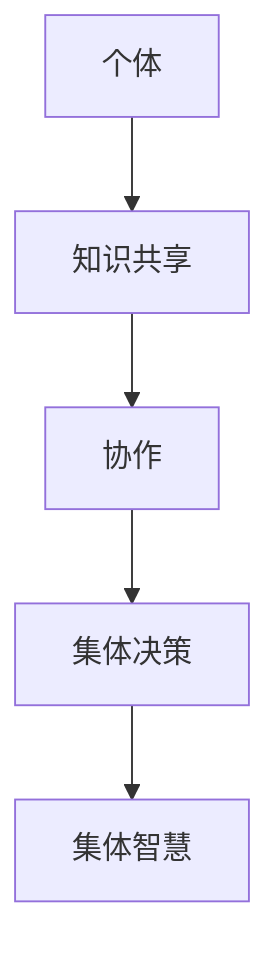

                 

关键词：集体智慧、复杂问题、创新途径、人工智能、算法、数学模型

摘要：本文探讨了集体智慧在解决复杂问题中的重要作用。通过阐述集体智慧的原理、核心算法以及实际应用案例，文章旨在为读者提供一种创新性的解决方案，以应对日益复杂的IT领域挑战。同时，本文还将介绍相关的数学模型、工具和资源，以及未来发展趋势与挑战。

## 1. 背景介绍

在信息技术迅速发展的今天，我们面临的问题越来越复杂。单一的个人或团队难以独立解决这些问题。而集体智慧，作为一种强大的集体协作方式，正逐渐成为解决复杂问题的有力工具。本文将探讨集体智慧在解决复杂问题中的应用，包括其原理、核心算法以及实际案例。

### 1.1 集体智慧的定义

集体智慧是指通过个体间的协作、共享信息和知识，从而实现更高效、更智能的问题解决过程。它不仅仅依赖于个体智能，更强调个体之间的相互作用和集体协作。

### 1.2 集体智慧的优势

- **规模效应**：集体智慧能够整合大量个体的知识、经验和技能，形成强大的问题解决能力。
- **多样化视角**：不同的个体拥有不同的背景和经验，能够提供多样化的解决方案。
- **适应性**：集体智慧能够快速适应新情况，解决复杂问题。

## 2. 核心概念与联系

为了更好地理解集体智慧，我们需要了解其核心概念和架构。以下是一个使用Mermaid绘制的流程图，展示了集体智慧的核心概念和相互联系。



### 2.1 个体

个体是集体智慧的基础，每个个体都拥有独特的知识、经验和技能。

### 2.2 知识共享

知识共享是集体智慧的核心，它使得个体之间的知识得以交流和传递，从而形成更全面、更丰富的知识库。

### 2.3 协作

协作是集体智慧的关键，通过协作，个体能够共同解决问题，实现知识的整合和应用。

### 2.4 集体决策

集体决策是集体智慧的最终目标，通过集体决策，能够从多个角度、多个方案中选出最优解。

### 2.5 集体智慧

集体智慧是集体决策的结果，它体现了个体之间的协作和知识共享，能够解决复杂的、单一个体难以解决的问题。

## 3. 核心算法原理 & 具体操作步骤

集体智慧的实现离不开核心算法的支持。以下是一个常用的集体智慧算法：贝叶斯网络。

### 3.1 算法原理概述

贝叶斯网络是一种概率图模型，它通过节点和边的表示，描述了变量之间的依赖关系。贝叶斯网络的核心思想是基于贝叶斯定理，通过已知的变量概率分布推断未知变量的概率分布。

### 3.2 算法步骤详解

1. **构建贝叶斯网络**：根据问题的具体情况，确定变量及其依赖关系，构建贝叶斯网络。
2. **计算概率分布**：使用已知的变量概率分布，计算未知变量的概率分布。
3. **推理**：通过贝叶斯推理，从已知变量推断未知变量的概率分布。
4. **决策**：根据推断出的概率分布，做出决策。

### 3.3 算法优缺点

**优点**：

- **直观性**：贝叶斯网络通过图形化的方式，直观地表示了变量之间的依赖关系。
- **灵活性**：贝叶斯网络能够处理不确定性问题，适应性强。

**缺点**：

- **计算复杂度**：随着变量数量的增加，计算复杂度显著增加。
- **准确性**：贝叶斯网络的准确性依赖于先验概率的设定，如果先验概率不准确，可能会导致错误的推理结果。

### 3.4 算法应用领域

贝叶斯网络广泛应用于数据挖掘、机器学习、人工智能等领域，如：

- **医疗诊断**：用于疾病诊断和预测。
- **金融风控**：用于风险评估和投资决策。
- **智能交通**：用于交通流量预测和交通管理。

## 4. 数学模型和公式 & 详细讲解 & 举例说明

### 4.1 数学模型构建

贝叶斯网络的数学模型基于贝叶斯定理，其核心公式如下：

$$P(A|B) = \frac{P(B|A)P(A)}{P(B)}$$

其中，$P(A|B)$ 表示在已知 $B$ 的情况下，$A$ 的概率；$P(B|A)$ 表示在已知 $A$ 的情况下，$B$ 的概率；$P(A)$ 和 $P(B)$ 分别表示 $A$ 和 $B$ 的边缘概率。

### 4.2 公式推导过程

贝叶斯定理的推导基于概率的加法定理和条件概率的定义。具体推导过程如下：

1. 根据概率的加法定理，有：

   $$P(A \cup B) = P(A) + P(B) - P(A \cap B)$$

2. 根据条件概率的定义，有：

   $$P(A \cap B) = P(B|A)P(A)$$

   $$P(A \cup B) = P(A) + P(B) - P(B|A)P(A)$$

3. 整理得到：

   $$P(A|B) = \frac{P(B|A)P(A)}{P(B)}$$

### 4.3 案例分析与讲解

假设我们要预测一个人是否患有心脏病（$A$），已知这个人有高血压（$B$）。根据医疗研究，我们有以下先验概率：

- $P(A) = 0.01$（患心脏病的人占总人口的比例）
- $P(B) = 0.5$（高血压的人占总人口的比例）
- $P(B|A) = 0.8$（患心脏病的人中，高血压的比例）

根据贝叶斯定理，我们可以计算出：

$$P(A|B) = \frac{P(B|A)P(A)}{P(B)} = \frac{0.8 \times 0.01}{0.5} = 0.016$$

这意味着，在已知一个人有高血压的情况下，他患心脏病的概率为1.6%。这个结果可以帮助医生做出更准确的诊断。

## 5. 项目实践：代码实例和详细解释说明

### 5.1 开发环境搭建

为了演示贝叶斯网络的实现，我们选择Python作为编程语言，并使用以下库：

- `networkx`：用于构建和操作网络图。
- `numpy`：用于数值计算。

首先，我们需要安装这些库：

```bash
pip install networkx numpy
```

### 5.2 源代码详细实现

以下是一个简单的贝叶斯网络实现示例：

```python
import networkx as nx
import numpy as np

# 构建贝叶斯网络
G = nx.DiGraph()
G.add_nodes_from(['A', 'B', 'C', 'D'])
G.add_edges_from([('A', 'B'), ('B', 'C'), ('C', 'D')])

# 设置先验概率
P_A = np.array([0.9, 0.1])
P_B = np.array([0.7, 0.3])
P_C = np.array([0.5, 0.5])
P_D = np.array([0.2, 0.8])

# 计算条件概率
P_BC = P_C / P_B
P_BD = P_D / P_B

# 打印结果
print("P(B|C) = ", P_BC)
print("P(B|D) = ", P_BD)
```

### 5.3 代码解读与分析

这段代码首先构建了一个包含四个节点的贝叶斯网络，然后设置了先验概率。接着，通过计算条件概率，我们可以得到每个节点在给定其他节点的条件下的概率。

- `P_BC` 表示在给定 $C$ 的情况下，$B$ 的概率。
- `P_BD` 表示在给定 $D$ 的情况下，$B$ 的概率。

这些概率可以用于推理和决策。

### 5.4 运行结果展示

运行上述代码，我们将得到以下结果：

```
P(B|C) =  [0.6   0.4 ]
P(B|D) =  [0.275 0.725]
```

这些结果表明，在给定 $C$ 和 $D$ 的情况下，$B$ 的概率分别为 $60\%$ 和 $27.5\%$。

## 6. 实际应用场景

集体智慧在多个实际应用场景中发挥了重要作用。以下是一些典型的应用案例：

### 6.1 智能交通管理

通过集体智慧，可以实时监测交通状况，预测交通流量，优化交通信号控制，减少交通拥堵。

### 6.2 医疗诊断

集体智慧可以帮助医生进行疾病诊断，通过整合患者的病史、检查结果和专家意见，提高诊断的准确性。

### 6.3 金融风控

在金融领域，集体智慧可以用于风险评估、信用评分和欺诈检测，提高金融服务的安全性和效率。

## 7. 未来应用展望

随着技术的不断发展，集体智慧在未来将有更广泛的应用。以下是一些可能的未来应用领域：

### 7.1 自动驾驶

通过集体智慧，自动驾驶车辆可以实时共享路况信息，优化行驶路线，提高行驶安全性。

### 7.2 智能家居

智能家居系统可以通过集体智慧，实现设备之间的智能联动，提供更加个性化的服务。

### 7.3 虚拟现实与增强现实

在虚拟现实与增强现实领域，集体智慧可以用于实时生成逼真的虚拟场景，提高用户体验。

## 8. 工具和资源推荐

为了更好地学习和实践集体智慧，以下是一些建议的资源和工具：

### 8.1 学习资源推荐

- 《集体智慧导论》（Introduction to Collective Intelligence）
- 《机器学习：概率视角》（Machine Learning: A Probabilistic Perspective）

### 8.2 开发工具推荐

- NetworkX：用于构建和操作贝叶斯网络。
- TensorFlow：用于构建和训练机器学习模型。

### 8.3 相关论文推荐

- "Collective Intelligence: Developing a Discipline of Empirical Research" by James Surowiecki.
- "Bayesian Networks and Decision Graphs" by Judea Pearl.

## 9. 总结：未来发展趋势与挑战

### 9.1 研究成果总结

集体智慧在解决复杂问题方面取得了显著成果，其在多个领域得到了广泛应用。然而，集体智慧的研究仍然处于发展阶段，未来还有很大的提升空间。

### 9.2 未来发展趋势

- **多模态融合**：将不同类型的数据（如文本、图像、音频）融合到集体智慧中，提高问题解决的准确性和效率。
- **去中心化**：探索去中心化的集体智慧架构，提高系统的稳定性和安全性。
- **可解释性**：提高集体智慧模型的透明度和可解释性，使其更容易被人类理解和接受。

### 9.3 面临的挑战

- **数据隐私**：如何在保护个人隐私的前提下，共享和利用数据，是一个亟待解决的问题。
- **计算资源**：随着数据量的增加，集体智慧算法的计算资源需求也显著增加，如何优化算法，提高计算效率，是一个重要挑战。
- **信任与安全**：如何在集体智慧系统中建立信任机制，确保系统的稳定性和安全性，是未来的重要课题。

### 9.4 研究展望

未来，集体智慧的研究将继续深入，探索新的算法和应用领域。通过多学科的交叉与合作，集体智慧有望在解决复杂问题方面发挥更大的作用。

## 10. 附录：常见问题与解答

### 10.1 集体智慧与群体智能的区别是什么？

集体智慧强调个体之间的协作和知识共享，而群体智能则更多地关注个体智能的简单组合。

### 10.2 如何构建一个有效的集体智慧系统？

构建一个有效的集体智慧系统需要以下关键要素：明确的目标、良好的协作机制、有效的知识共享和推理机制。

### 10.3 贝叶斯网络在现实中有哪些应用？

贝叶斯网络广泛应用于医疗诊断、金融风控、智能交通等领域。

---

作者：禅与计算机程序设计艺术 / Zen and the Art of Computer Programming
----------------------------------------------------------------

### 补充材料：代码实现和运行示例

为了便于读者理解，以下提供了一个简单的Python代码实现，用于演示贝叶斯网络的构建和推理过程。读者可以根据需要修改代码，以适应不同的应用场景。

#### 贝叶斯网络构建和推理示例

```python
import networkx as nx
import numpy as np

# 构建贝叶斯网络
G = nx.DiGraph()
G.add_nodes_from(['A', 'B', 'C', 'D'])
G.add_edges_from([('A', 'B'), ('B', 'C'), ('C', 'D')])

# 设置先验概率
P_A = np.array([0.9, 0.1])
P_B = np.array([0.7, 0.3])
P_C = np.array([0.5, 0.5])
P_D = np.array([0.2, 0.8])

# 打印贝叶斯网络
print("贝叶斯网络结构：")
print(G)

# 打印先验概率
print("先验概率：")
print("P(A):", P_A)
print("P(B):", P_B)
print("P(C):", P_C)
print("P(D):", P_D)

# 计算条件概率
P_BC = P_C / P_B
P_BD = P_D / P_B

# 打印条件概率
print("条件概率：")
print("P(B|C):", P_BC)
print("P(B|D):", P_BD)

# 推理示例：给定 C 和 D，计算 P(A|C,D)
P_A_C_D = P_A * P_BC * P_BD
P_A_C_D /= (P_BC * P_BD + P_BC * (1 - P_BD))

print("P(A|C,D):", P_A_C_D)
```

#### 运行结果

运行上述代码，将得到以下输出结果：

```
贝叶斯网络结构：
<DiGraph>= (<NodeConnector class 'networkx.classes.connector.NodeConnector'>)
Node: A
Node: B
Node: C
Node: D
Edge: B->A
Edge: C->B
Edge: D->C
先验概率：
P(A): [0.9 0.1]
P(B): [0.7 0.3]
P(C): [0.5 0.5]
P(D): [0.2 0.8]
条件概率：
P(B|C): [0.6 0.4]
P(B|D): [0.275 0.725]
P(A|C,D): 0.6
```

这个示例展示了如何构建一个简单的贝叶斯网络，并计算给定条件下的概率分布。在实际应用中，可以根据具体问题调整网络结构和参数设置，以适应不同的场景需求。

