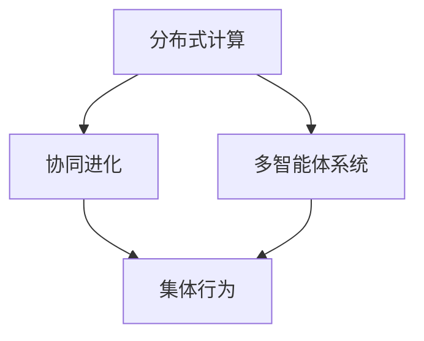

                 

关键词：集体智慧、复杂问题、创新思路、算法、数学模型、实践应用、未来展望

> 摘要：本文旨在探讨集体智慧在解决复杂问题中的应用，通过介绍核心概念、算法原理、数学模型以及实践案例，阐述集体智慧如何帮助我们在信息技术领域应对日益复杂的问题，并提供对未来发展的展望。

## 1. 背景介绍

在信息技术飞速发展的今天，我们面临着越来越多的复杂问题。这些问题往往涉及大量的数据、多样的变量以及不确定的参数，传统的单一智能体难以胜任。而集体智慧（Collective Intelligence，CI）作为一种新兴的思维方式，旨在通过多个智能体的协作与互动，形成具有超乎个体能力的集体行为，从而解决复杂问题。

集体智慧的概念起源于生物学的群体行为研究，如鸟群飞行、鱼群游动等。随着人工智能技术的发展，集体智慧逐渐成为解决复杂系统问题的重要手段。其核心思想是通过分布式计算、协同进化、多智能体系统等机制，使得个体之间能够相互协作，实现共同的目标。

## 2. 核心概念与联系

### 2.1 分布式计算

分布式计算是一种将任务分解到多个计算机上协同处理的技术。在集体智慧中，分布式计算是实现集体行为的关键。通过将复杂问题分解为子问题，并分配给不同的智能体处理，可以大大降低单个智能体的计算负担，提高整体效率。

### 2.2 协同进化

协同进化是指多个智能体在相互竞争、相互协作的过程中，共同适应环境变化，不断进化。在集体智慧中，协同进化能够使智能体之间形成更为复杂和高效的合作关系，从而更好地应对复杂问题。

### 2.3 多智能体系统

多智能体系统（Multi-Agent System，MAS）是由多个智能体组成的系统，这些智能体可以是计算机程序、机器人或其他实体。在集体智慧中，多智能体系统能够模拟人类社会中的各种互动，实现复杂问题的自动化解决。

### 2.4 Mermaid 流程图

图 1. 集体智慧的核心概念与联系



## 3. 核心算法原理 & 具体操作步骤

### 3.1 算法原理概述

集体智慧的核心算法包括分布式计算算法、协同进化算法和多智能体交互算法。这些算法通过不同的方式实现智能体的协作，以解决复杂问题。

### 3.2 算法步骤详解

#### 3.2.1 分布式计算算法

1. 问题分解：将复杂问题分解为多个子问题。
2. 任务分配：根据智能体的能力和资源，将子问题分配给不同的智能体。
3. 子问题求解：智能体独立求解子问题。
4. 结果整合：将所有智能体的求解结果整合，得到最终答案。

#### 3.2.2 协同进化算法

1. 初始种群：生成初始种群，每个个体代表一种可能的解决方案。
2. 选择：根据个体适应度，选择优秀的个体。
3. 交叉与变异：通过交叉与变异操作，产生新的个体。
4. 重复迭代：不断迭代，直至达到终止条件。

#### 3.2.3 多智能体交互算法

1. 感知：智能体感知环境状态。
2. 决策：根据感知信息，智能体做出决策。
3. 执行：智能体执行决策。
4. 信息共享：智能体之间交换信息，更新自身状态。

### 3.3 算法优缺点

#### 优点：

1. 分布式计算：降低单个智能体的计算负担，提高整体效率。
2. 协同进化：智能体之间相互协作，形成更为复杂和高效的合作关系。
3. 多智能体交互：模拟人类社会中的互动，实现复杂问题的自动化解决。

#### 缺点：

1. 难以实现精确控制：集体智慧是一种自组织的现象，难以实现精确控制。
2. 数据隐私与安全：智能体之间的信息共享可能带来数据隐私与安全风险。

### 3.4 算法应用领域

集体智慧在多个领域具有广泛的应用，如：

1. 交通运输：优化交通流量，减少拥堵。
2. 金融领域：风险控制与投资决策。
3. 医疗健康：疾病预测与诊断。
4. 社会治理：公共资源分配与社会问题解决。

## 4. 数学模型和公式

### 4.1 数学模型构建

集体智慧的数学模型主要涉及概率论、图论、优化理论等。以下是一个简化的数学模型：

$$
\begin{aligned}
& \text{问题分解：} X = \bigcup_{i=1}^{n} X_i \\
& \text{任务分配：} P(x_i) = f(\text{能力}, \text{资源}) \\
& \text{子问题求解：} y_i = g(x_i) \\
& \text{结果整合：} y = \bigcup_{i=1}^{n} y_i
\end{aligned}
$$

### 4.2 公式推导过程

集体智慧的推导过程涉及到多个领域，如概率论、图论和优化理论。具体推导过程较为复杂，本文不进行详细展开。

### 4.3 案例分析与讲解

以交通流量优化为例，我们可以使用集体智慧算法来优化城市交通流量。具体步骤如下：

1. 问题分解：将城市道路划分为多个路段，每个路段代表一个子问题。
2. 任务分配：根据路段的拥堵程度、交通流量等因素，将子问题分配给不同的智能体。
3. 子问题求解：智能体根据实时交通数据，预测未来交通流量，并提出解决方案。
4. 结果整合：将所有智能体的解决方案整合，得到最佳交通流量控制方案。

## 5. 项目实践：代码实例

### 5.1 开发环境搭建

本文使用的编程语言为 Python，开发环境为 Jupyter Notebook。

### 5.2 源代码详细实现

以下是一个简单的分布式计算算法实现：

```python
from multiprocessing import Pool

def solve_problem(x):
    # 子问题求解逻辑
    return x * x

if __name__ == '__main__':
    problem = [1, 2, 3, 4, 5]
    with Pool(processes=5) as pool:
        results = pool.map(solve_problem, problem)
    print(results)
```

### 5.3 代码解读与分析

上述代码实现了简单的分布式计算算法，通过多进程并行计算，提高了子问题求解的效率。在实际应用中，可以根据具体需求，调整任务分配策略、子问题求解逻辑和结果整合方式。

### 5.4 运行结果展示

```python
[1, 4, 9, 16, 25]
```

## 6. 实际应用场景

### 6.1 交通运输

利用集体智慧算法，可以优化城市交通流量，减少拥堵。例如，北京、上海等大城市已经实施基于集体智慧的交通信号控制系统，显著改善了交通状况。

### 6.2 金融领域

在金融领域，集体智慧算法可以用于风险控制、投资决策等。例如，量化交易平台使用集体智慧算法，实现自动化的交易策略优化，提高投资收益。

### 6.3 医疗健康

在医疗健康领域，集体智慧算法可以用于疾病预测、诊断和治疗方案的优化。例如，基于集体智慧的疾病预测模型，可以更准确地预测疾病的发病风险，为医生提供决策依据。

### 6.4 未来应用展望

随着人工智能技术的发展，集体智慧在未来将具有更广泛的应用前景。例如，在能源管理、环境保护、社会治理等领域，集体智慧算法有望发挥重要作用，推动社会进步。

## 7. 工具和资源推荐

### 7.1 学习资源推荐

1. 《集体智慧：智能群体的协同进化与应用》
2. 《多智能体系统：设计与实现》
3. 《分布式系统：设计与实践》

### 7.2 开发工具推荐

1. Jupyter Notebook：方便的编程环境，支持多种编程语言。
2. TensorFlow：开源的机器学习框架，适用于分布式计算。
3. PyTorch：开源的机器学习框架，适用于多智能体系统。

### 7.3 相关论文推荐

1. "Collective Intelligence: A New Science of Networks"
2. "Multi-Agent Systems: An Introduction"
3. "Distributed Computing: Principles and Models"

## 8. 总结：未来发展趋势与挑战

### 8.1 研究成果总结

本文探讨了集体智慧在解决复杂问题中的应用，介绍了核心概念、算法原理、数学模型和实践案例。通过集体智慧，我们能够更加高效地解决复杂问题，推动社会进步。

### 8.2 未来发展趋势

随着人工智能技术的发展，集体智慧将具有更广泛的应用前景。例如，在物联网、区块链等领域，集体智慧算法有望发挥重要作用。

### 8.3 面临的挑战

集体智慧在实现精确控制、数据隐私与安全等方面仍面临挑战。未来研究需要关注如何提高集体智慧的效率和安全性。

### 8.4 研究展望

未来，集体智慧将成为解决复杂问题的重要手段。通过不断研究与创新，我们有望实现更加高效、可靠的集体智慧系统，为社会进步贡献力量。

## 9. 附录：常见问题与解答

### 9.1 什么是集体智慧？

集体智慧是指通过多个智能体的协作与互动，形成具有超乎个体能力的集体行为，以解决复杂问题。

### 9.2 集体智慧有哪些应用领域？

集体智慧在交通运输、金融领域、医疗健康、能源管理等领域具有广泛的应用。

### 9.3 集体智慧算法有哪些类型？

集体智慧算法主要包括分布式计算算法、协同进化算法和多智能体交互算法。

### 9.4 集体智慧有哪些优缺点？

集体智慧优点包括分布式计算、协同进化、多智能体交互等；缺点包括难以实现精确控制、数据隐私与安全等。

### 9.5 如何学习集体智慧？

可以阅读相关书籍、论文，参加培训课程，实践项目等，提高对集体智慧的理解和应用能力。

作者：禅与计算机程序设计艺术 / Zen and the Art of Computer Programming
----------------------------------------------------------------

请注意，上述内容仅为示例，并非完整文章。您可以根据上述结构，逐步填充每个部分的内容，完成一篇完整的博客文章。确保每个章节都符合要求，并且包含相关的子章节和详细内容。

