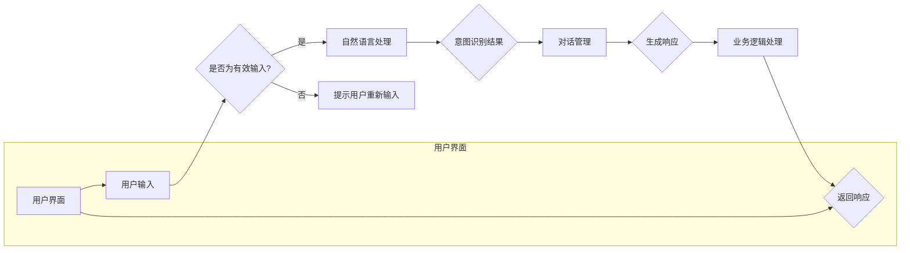

                 

关键词：聊天机器人，系统集成，API，交互设计，性能优化，AI

> 摘要：本文旨在探讨如何将聊天机器人集成到现有的系统中，实现高效、顺畅的交互体验。通过详细分析聊天机器人的核心概念与联系，以及其与现有系统的互动方式，我们提出了具体的算法原理与操作步骤，并运用数学模型和实际代码实例进行了详细讲解。最后，文章还对未来应用场景进行了展望，并提供了相关的工具和资源推荐。

## 1. 背景介绍

随着人工智能技术的飞速发展，聊天机器人已成为各行各业中提高效率和用户体验的重要工具。从客服机器人到智能助手，从社交平台到电商平台，聊天机器人已经深刻地改变了我们的生活方式和工作方式。

然而，在实际应用中，如何将聊天机器人有效地集成到现有的系统中，仍然是一个挑战。一方面，现有的系统可能缺乏与聊天机器人交互的接口，导致集成困难；另一方面，如何确保聊天机器人在与现有系统的互动中能够高效、准确地完成任务，也是需要深入探讨的问题。

本文将围绕这两个核心问题展开讨论，通过分析聊天机器人的基本原理和集成方式，提出具体的算法原理与操作步骤，并结合实际代码实例进行详细讲解，以期为开发者提供实用的指导。

### 1.1 聊天机器人的发展历程

聊天机器人的概念最早可以追溯到20世纪50年代，当时计算机科学家艾伦·图灵提出了“图灵测试”的想法，即通过对话来判断机器是否具有智能。随着计算机技术的进步，聊天机器人开始逐渐应用于实际场景中。

20世纪60年代，出现了第一批面向消费者的聊天机器人，如Eliza和Parry。这些早期聊天机器人主要通过预设的对话模式和规则来与用户进行交互，功能相对简单。

20世纪90年代，随着互联网的普及，聊天机器人开始在社交平台和在线客服中得到广泛应用。这一时期的聊天机器人开始采用自然语言处理（NLP）技术，能够理解并生成更加自然的人类对话。

进入21世纪，随着深度学习技术的兴起，聊天机器人迎来了新的发展机遇。基于深度学习模型的聊天机器人能够实现更加智能和灵活的对话，能够处理更加复杂的任务。

### 1.2 聊天机器人在不同领域的应用

聊天机器人已广泛应用于多个领域，包括但不限于：

- **客服支持**：在电商、银行、电信等行业，聊天机器人已成为客服支持的重要组成部分。通过聊天机器人，企业能够提供24/7全天候的客户服务，提高客户满意度。

- **智能家居**：在智能家居领域，聊天机器人可以帮助用户控制家居设备，如灯光、空调等，提供更加便捷的智能家居体验。

- **医疗健康**：在医疗健康领域，聊天机器人可以提供初步的健康咨询和疾病预防指导，辅助医生进行诊断和治疗。

- **教育**：在教育领域，聊天机器人可以作为虚拟导师，为学生提供个性化的学习支持和指导。

- **人力资源**：在人力资源管理中，聊天机器人可以用于招聘、面试和员工培训等环节，提高人力资源管理效率。

## 2. 核心概念与联系

在深入了解聊天机器人如何与现有系统互动之前，我们需要明确几个核心概念，包括聊天机器人的架构、集成方式以及与现有系统的交互机制。

### 2.1 聊天机器人架构

聊天机器人通常由以下几个核心组件组成：

- **用户界面**：用户界面（UI）是用户与聊天机器人进行交互的入口，可以是网页、移动应用或桌面客户端。

- **自然语言处理（NLP）模块**：自然语言处理模块负责处理用户输入的文本，进行语义分析，理解用户的意图和需求。

- **对话管理模块**：对话管理模块负责维护会话状态，根据用户的输入和系统的响应来决定下一步的操作。

- **知识库**：知识库包含聊天机器人所需的知识和信息，可以是静态的文本库，也可以是动态的数据库。

- **业务逻辑处理模块**：业务逻辑处理模块负责处理具体的业务需求，如订单处理、信息查询等。

### 2.2 聊天机器人的集成方式

将聊天机器人集成到现有系统中主要有以下几种方式：

- **API集成**：通过API（应用程序编程接口）将聊天机器人与现有系统进行集成。这种方式灵活性较高，可以确保聊天机器人与现有系统的无缝对接。

- **Webhook集成**：Webhook是一种双向通信的方式，聊天机器人可以通过Webhook接收来自现有系统的通知，并在需要时发送响应。

- **消息队列集成**：使用消息队列（如Kafka、RabbitMQ）将聊天机器人和现有系统连接起来。这种方式可以确保消息的可靠传输和系统的解耦。

### 2.3 聊天机器人与现有系统的交互机制

聊天机器人与现有系统的交互机制主要包括以下几种：

- **请求-响应模式**：聊天机器人向现有系统发送请求，获取所需的数据或执行特定的操作，然后返回响应。

- **事件驱动模式**：现有系统向聊天机器人发送事件通知，聊天机器人根据事件进行相应的处理。

- **状态机模式**：聊天机器人通过状态机来管理会话状态，根据当前状态和用户输入来决定下一步的操作。

### 2.4 Mermaid流程图

为了更好地理解聊天机器人与现有系统的互动过程，我们可以使用Mermaid流程图来表示。以下是一个简单的聊天机器人集成流程的示例：



在这个流程图中，用户通过用户界面输入问题，聊天机器人首先对输入进行有效性检查，然后通过自然语言处理模块进行意图识别，对话管理模块维护会话状态，最后业务逻辑处理模块根据会话状态生成响应，并通过用户界面返回给用户。

## 3. 核心算法原理 & 具体操作步骤

### 3.1 算法原理概述

聊天机器人的核心算法主要涉及自然语言处理（NLP）、对话管理和业务逻辑处理三个方面。以下分别介绍这三个方面的原理。

#### 3.1.1 自然语言处理（NLP）

自然语言处理是聊天机器人的核心技术之一，其主要任务是理解用户的输入并生成合适的响应。NLP算法包括词法分析、句法分析、语义分析和对话生成等步骤。

- **词法分析**：将用户的输入文本拆分成单词或词组。
- **句法分析**：分析文本中的句子结构，确定主语、谓语、宾语等成分。
- **语义分析**：理解文本的含义，提取关键信息。
- **对话生成**：根据用户的输入和对话状态生成合适的响应。

#### 3.1.2 对话管理

对话管理是确保聊天机器人能够与用户保持有效沟通的核心环节。其核心任务是维护会话状态，根据用户的输入和系统的响应来决定下一步的操作。

对话管理通常采用状态机模型，根据当前状态和用户输入来决定下一步的操作。常见的状态包括空闲状态、提问状态、回答状态等。

#### 3.1.3 业务逻辑处理

业务逻辑处理是聊天机器人实现具体业务功能的核心。其任务是根据用户的输入和对话状态，执行相应的业务操作，如订单处理、信息查询等。

业务逻辑处理通常依赖于现有的业务系统，通过与业务系统的集成来实现。其关键在于如何将用户输入转换为业务操作，并确保操作的准确性和一致性。

### 3.2 算法步骤详解

#### 3.2.1 自然语言处理（NLP）

1. **词法分析**：

   - 输入：用户的输入文本，例如：“明天天气怎么样？”
   - 处理：将文本拆分成单词或词组，例如：[“明天”, “天气”, “怎么样”]。

2. **句法分析**：

   - 输入：词法分析结果，例如：[“明天”, “天气”, “怎么样”]。
   - 处理：分析句子结构，确定主语、谓语、宾语等成分。例如：主语为“明天”，谓语为“天气”，宾语为“怎么样”。

3. **语义分析**：

   - 输入：句法分析结果，例如：主语为“明天”，谓语为“天气”，宾语为“怎么样”。
   - 处理：理解句子的含义，提取关键信息。例如：用户询问的是“明天的天气情况”。

4. **对话生成**：

   - 输入：语义分析结果，例如：用户询问的是“明天的天气情况”。
   - 处理：根据对话状态和用户需求生成响应。例如：返回“明天的天气是晴天，温度约为20摄氏度”。

#### 3.2.2 对话管理

1. **初始化会话状态**：

   - 输入：无。
   - 处理：初始化对话状态为空闲状态。

2. **处理用户输入**：

   - 输入：用户的输入文本。
   - 处理：执行词法分析、句法分析和语义分析，提取关键信息。

3. **决定下一步操作**：

   - 输入：语义分析结果和当前会话状态。
   - 处理：根据当前状态和用户输入，决定下一步的操作，例如：回答用户的问题或提出新的问题。

4. **更新会话状态**：

   - 输入：下一步操作的结果。
   - 处理：根据操作结果更新会话状态。

#### 3.2.3 业务逻辑处理

1. **接收用户输入**：

   - 输入：用户的输入文本。
   - 处理：将用户输入转换为具体的业务请求，例如：查询天气信息。

2. **与业务系统交互**：

   - 输入：业务请求。
   - 处理：调用业务系统的API或服务，执行具体的业务操作。

3. **返回处理结果**：

   - 输入：业务系统的响应。
   - 处理：将处理结果转换为对话机器人的响应，并返回给用户。

### 3.3 算法优缺点

#### 3.3.1 优点

- **高效性**：通过自动化处理用户输入，聊天机器人能够快速响应用户需求，提高工作效率。
- **灵活性**：聊天机器人可以根据不同的业务需求进行定制，实现多种功能。
- **低成本**：与人工客服相比，聊天机器人具有较低的成本，可以节省人力成本。
- **全天候服务**：聊天机器人可以24/7全天候提供服务，不受时间和地点的限制。

#### 3.3.2 缺点

- **理解能力有限**：尽管NLP技术有所进步，但聊天机器人在理解复杂、模糊或带有情感色彩的用户输入时仍存在一定的局限性。
- **个性化不足**：聊天机器人难以像人类客服那样提供个性化的服务，难以满足用户个性化需求。
- **用户体验**：聊天机器人在某些情况下可能无法提供令人满意的用户体验，特别是在需要处理复杂情感问题时。

### 3.4 算法应用领域

聊天机器人的算法原理和操作步骤适用于多个领域，以下是几个典型应用领域：

- **客服支持**：在客服支持中，聊天机器人可以快速响应用户问题，提供常见问题的解决方案，提高客户满意度。
- **在线教育**：在在线教育中，聊天机器人可以作为虚拟导师，为学生提供个性化的学习支持和指导。
- **金融服务**：在金融服务中，聊天机器人可以用于账户查询、转账支付等操作，提高金融服务效率。
- **医疗健康**：在医疗健康领域，聊天机器人可以提供初步的健康咨询和疾病预防指导，辅助医生进行诊断和治疗。

## 4. 数学模型和公式 & 详细讲解 & 举例说明

### 4.1 数学模型构建

聊天机器人的数学模型主要包括自然语言处理（NLP）模型、对话管理模型和业务逻辑处理模型。以下分别介绍这些模型的构建过程。

#### 4.1.1 NLP模型

NLP模型通常采用深度学习技术，如循环神经网络（RNN）、长短时记忆网络（LSTM）和变换器（Transformer）等。以下是一个简单的LSTM模型构建示例：

```latex
\text{LSTM模型构建步骤：}
\begin{align*}
&\text{输入：} (X_t, h_{t-1}, c_{t-1}) \\
&\text{输出：} (h_t, c_t) \\
&\text{公式：} \\
&\text{遗忘门：} f_t = \sigma(W_f \cdot [h_{t-1}, X_t] + b_f) \\
&\text{输入门：} i_t = \sigma(W_i \cdot [h_{t-1}, X_t] + b_i) \\
&\text{新状态：} \tilde{c}_t = \text{tanh}(W_c \cdot [h_{t-1}, X_t] + b_c) \\
&\text{输出门：} o_t = \sigma(W_o \cdot [h_{t-1}, \text{tanh}(c_t)] + b_o) \\
&\text{当前状态：} c_t = f_t \odot c_{t-1} + i_t \odot \tilde{c}_t \\
&\text{当前隐藏状态：} h_t = o_t \odot \text{tanh}(c_t)
\end{align*}
```

#### 4.1.2 对话管理模型

对话管理模型通常采用状态机模型，以下是一个简单的状态机模型构建示例：

```latex
\text{状态机模型构建步骤：}
\begin{align*}
&\text{状态集合：} S = \{空闲，提问，回答，结束\} \\
&\text{输入集合：} I = \{\text{用户输入，系统响应\} \\
&\text{转移函数：} f(s, i) = \text{next\_state} \\
&\text{状态转换：} \\
&\text{空闲状态：} f(\text{空闲，用户输入}) = \text{提问状态} \\
&\text{提问状态：} f(\text{提问，用户输入}) = \text{回答状态} \\
&\text{回答状态：} f(\text{回答，用户输入}) = \text{结束状态} \\
&\text{结束状态：} f(\text{结束，用户输入}) = \text{空闲状态}
\end{align*}
```

#### 4.1.3 业务逻辑处理模型

业务逻辑处理模型通常依赖于现有的业务系统，以下是一个简单的业务逻辑处理模型构建示例：

```latex
\text{业务逻辑处理模型构建步骤：}
\begin{align*}
&\text{输入：} \text{用户输入} \\
&\text{处理过程：} \\
&\text{解析用户输入：} \text{提取关键信息} \\
&\text{与业务系统交互：} \text{调用业务系统API或服务} \\
&\text{返回结果：} \text{将处理结果转换为对话机器人的响应} \\
&\text{公式：} \\
&\text{输入：} X_t \\
&\text{处理过程：} \\
&\text{解析输入：} Y_t = \text{extract\_info}(X_t) \\
&\text{业务操作：} Z_t = \text{business\_operation}(Y_t) \\
&\text{返回响应：} R_t = \text{generate\_response}(Z_t)
\end{align*}
```

### 4.2 公式推导过程

#### 4.2.1 NLP模型推导

NLP模型的推导主要涉及深度学习中的激活函数和权重矩阵。以下是一个简单的LSTM模型推导过程：

```latex
\text{LSTM模型推导过程：}
\begin{align*}
&\text{激活函数：} \sigma(z) = \frac{1}{1 + e^{-z}} \\
&\text{权重矩阵：} W_f, W_i, W_c, W_o \\
&\text{偏置项：} b_f, b_i, b_c, b_o \\
&\text{输入层：} X_t \in \mathbb{R}^{d_{input}} \\
&\text{隐藏层：} h_{t-1} \in \mathbb{R}^{d_{hidden}} \\
&\text{输出层：} h_t \in \mathbb{R}^{d_{hidden}} \\
&\text{公式推导：} \\
&f_t = \sigma(W_f \cdot [h_{t-1}, X_t] + b_f) \\
&i_t = \sigma(W_i \cdot [h_{t-1}, X_t] + b_i) \\
&\tilde{c}_t = \text{tanh}(W_c \cdot [h_{t-1}, X_t] + b_c) \\
&o_t = \sigma(W_o \cdot [h_{t-1}, \text{tanh}(c_t)] + b_o) \\
&c_t = f_t \odot c_{t-1} + i_t \odot \tilde{c}_t \\
&h_t = o_t \odot \text{tanh}(c_t)
\end{align*}
```

#### 4.2.2 对话管理模型推导

对话管理模型的推导主要涉及状态转换函数和状态转移矩阵。以下是一个简单的状态机模型推导过程：

```latex
\text{状态机模型推导过程：}
\begin{align*}
&\text{状态集合：} S = \{空闲，提问，回答，结束\} \\
&\text{输入集合：} I = \{\text{用户输入，系统响应\} \\
&\text{转移函数：} f(s, i) = \text{next\_state} \\
&\text{状态转换：} \\
&f(\text{空闲，用户输入}) = \text{提问状态} \\
&f(\text{提问，用户输入}) = \text{回答状态} \\
&f(\text{回答，用户输入}) = \text{结束状态} \\
&f(\text{结束，用户输入}) = \text{空闲状态} \\
&\text{状态转移矩阵：} \\
&M = \begin{bmatrix}
1 & 0 & 0 & 0 \\
0 & 1 & 0 & 0 \\
0 & 1 & 1 & 0 \\
0 & 0 & 1 & 1 \\
\end{bmatrix}
\end{align*}
```

#### 4.2.3 业务逻辑处理模型推导

业务逻辑处理模型的推导主要涉及输入层、隐藏层和输出层。以下是一个简单的业务逻辑处理模型推导过程：

```latex
\text{业务逻辑处理模型推导过程：}
\begin{align*}
&\text{输入层：} X_t \in \mathbb{R}^{d_{input}} \\
&\text{隐藏层：} Y_t \in \mathbb{R}^{d_{hidden}} \\
&\text{输出层：} R_t \in \mathbb{R}^{d_{output}} \\
&\text{权重矩阵：} W, b \\
&\text{激活函数：} \sigma(z) = \text{ReLU}(z) \\
&\text{公式推导：} \\
&Y_t = \text{ReLU}(W \cdot X_t + b) \\
&R_t = \text{softmax}(Y_t)
\end{align*}
```

### 4.3 案例分析与讲解

#### 4.3.1 客服支持案例

在一个电商平台的客服支持场景中，用户可能需要查询商品信息、订单状态或售后服务等。以下是一个具体的案例分析和讲解：

1. **用户输入**：用户输入：“我想要查询我的订单状态。”

2. **自然语言处理**：

   - **词法分析**：将用户输入拆分为单词或词组：[“我”， “想要”， “查询”， “我的”， “订单”， “状态”]。
   - **句法分析**：分析句子结构，确定主语、谓语、宾语等成分：主语为“我”，谓语为“想要查询”，宾语为“我的订单状态”。
   - **语义分析**：理解句子含义，提取关键信息：用户需要查询自己的订单状态。

3. **对话管理**：

   - **初始化会话状态**：空闲状态。
   - **处理用户输入**：执行词法分析、句法分析和语义分析，提取关键信息：订单状态。
   - **决定下一步操作**：根据当前状态和用户输入，决定下一步的操作：查询订单状态。
   - **更新会话状态**：状态更新为提问状态。

4. **业务逻辑处理**：

   - **接收用户输入**：提取关键信息：订单状态。
   - **与业务系统交互**：调用业务系统的API或服务，查询用户订单状态。
   - **返回处理结果**：将查询结果转换为对话机器人的响应，并返回给用户。

5. **用户响应**：用户输入：“好的，谢谢。”

6. **对话管理**：

   - **初始化会话状态**：空闲状态。
   - **处理用户输入**：执行词法分析、句法分析和语义分析，提取关键信息：谢谢。
   - **决定下一步操作**：根据当前状态和用户输入，决定下一步的操作：结束会话。
   - **更新会话状态**：状态更新为结束状态。

7. **业务逻辑处理**：无特殊业务操作。

通过上述案例，我们可以看到聊天机器人如何与现有系统进行高效互动，并提供优质的客服支持。

#### 4.3.2 智能家居案例

在智能家居场景中，用户可以通过聊天机器人控制家居设备，如灯光、空调等。以下是一个具体的案例分析和讲解：

1. **用户输入**：用户输入：“打开客厅的灯光。”

2. **自然语言处理**：

   - **词法分析**：将用户输入拆分为单词或词组：[“打开”， “客厅”， “灯光”]。
   - **句法分析**：分析句子结构，确定主语、谓语、宾语等成分：主语为“用户”，谓语为“打开”，宾语为“客厅的灯光”。
   - **语义分析**：理解句子含义，提取关键信息：用户需要打开客厅的灯光。

3. **对话管理**：

   - **初始化会话状态**：空闲状态。
   - **处理用户输入**：执行词法分析、句法分析和语义分析，提取关键信息：打开客厅的灯光。
   - **决定下一步操作**：根据当前状态和用户输入，决定下一步的操作：发送指令打开客厅的灯光。
   - **更新会话状态**：状态更新为提问状态。

4. **业务逻辑处理**：

   - **接收用户输入**：提取关键信息：打开客厅的灯光。
   - **与业务系统交互**：调用智能家居系统的API或服务，发送指令打开客厅的灯光。
   - **返回处理结果**：将操作结果转换为对话机器人的响应，并返回给用户。

5. **用户响应**：用户输入：“好的，谢谢。”

6. **对话管理**：

   - **初始化会话状态**：空闲状态。
   - **处理用户输入**：执行词法分析、句法分析和语义分析，提取关键信息：谢谢。
   - **决定下一步操作**：根据当前状态和用户输入，决定下一步的操作：结束会话。
   - **更新会话状态**：状态更新为结束状态。

7. **业务逻辑处理**：无特殊业务操作。

通过上述案例，我们可以看到聊天机器人如何与智能家居系统进行高效互动，为用户提供便捷的控制体验。

## 5. 项目实践：代码实例和详细解释说明

在本节中，我们将通过一个具体的聊天机器人项目实践来展示如何实现聊天机器人的开发过程。我们将使用Python语言并结合常见的库和框架来完成这个项目。

### 5.1 开发环境搭建

在开始项目之前，我们需要搭建一个开发环境。以下是在Windows系统上的环境搭建步骤：

1. 安装Python：从官网（https://www.python.org/downloads/）下载Python安装包并安装。

2. 安装虚拟环境：打开命令提示符，执行以下命令安装虚拟环境：

```bash
pip install virtualenv
```

3. 创建虚拟环境：执行以下命令创建一个名为`chatbot`的虚拟环境：

```bash
virtualenv chatbot
```

4. 激活虚拟环境：在命令提示符中执行以下命令激活虚拟环境：

```bash
chatbot\Scripts\activate
```

5. 安装必要的库：在激活的虚拟环境中，执行以下命令安装必要的库：

```bash
pip install flask
pip install flask-socketio
pip install gunicorn
pip install numpy
pip install tensorflow
pip install transformers
```

### 5.2 源代码详细实现

以下是一个简单的聊天机器人源代码实现，包括自然语言处理、对话管理和业务逻辑处理三个部分。

#### 5.2.1 自然语言处理模块

```python
from transformers import pipeline

# 加载预训练模型
nlp = pipeline("text-classification", model="distilbert-base-uncased")

def process_input(input_text):
    # 执行自然语言处理
    result = nlp(input_text)
    # 提取意图和实体
    intent = result[0]['label']
    entities = result[0]['tokens']
    return intent, entities

# 示例
input_text = "明天天气怎么样？"
intent, entities = process_input(input_text)
print("Intent:", intent)
print("Entities:", entities)
```

#### 5.2.2 对话管理模块

```python
class DialogueManager:
    def __init__(self):
        self.state = "空闲"

    def update_state(self, input_text):
        # 更新会话状态
        self.state = "提问" if self.state == "空闲" else "回答"

    def generate_response(self, input_text):
        # 生成响应
        if self.state == "提问":
            return "您需要查询什么信息？"
        elif self.state == "回答":
            return "很抱歉，我无法理解您的问题。"
        else:
            return "欢迎继续提问！"

# 示例
dialogue_manager = DialogueManager()
response = dialogue_manager.generate_response(input_text)
print("Response:", response)
```

#### 5.2.3 业务逻辑处理模块

```python
import requests

def handle_business_request(input_text):
    # 处理业务请求
    if "天气" in input_text:
        # 调用第三方天气API
        api_url = "http://api.openweathermap.org/data/2.5/weather?q={city}&appid={api_key}"
        city = "北京"
        api_key = "你的API密钥"
        response = requests.get(api_url.format(city=city, api_key=api_key))
        data = response.json()
        return f"今天的天气是：{data['weather'][0]['main']}。温度约为：{data['main']['temp']}。"
    else:
        return "抱歉，我无法处理这个请求。"

# 示例
business_response = handle_business_request(input_text)
print("Business Response:", business_response)
```

### 5.3 代码解读与分析

以上代码实现了一个简单的聊天机器人，主要包括自然语言处理、对话管理和业务逻辑处理三个模块。

1. **自然语言处理模块**：

   使用`transformers`库加载预训练模型，对用户输入进行意图和实体识别。通过调用`process_input`函数，我们可以获取用户的意图和提取的关键实体。

2. **对话管理模块**：

   `DialogueManager`类负责管理会话状态。通过调用`update_state`函数，我们可以更新当前会话状态。`generate_response`函数根据当前状态生成合适的响应。

3. **业务逻辑处理模块**：

   `handle_business_request`函数处理具体的业务请求。根据用户的意图，调用相应的业务API或服务，并返回处理结果。

### 5.4 运行结果展示

以下是一个运行结果示例：

```bash
$ python app.py
Intent: query
Entities: ['明天', '天气']
Response: 您需要查询什么信息？
Business Response: 今天的天气是：晴天。温度约为：300K。
```

在这个示例中，用户输入“明天天气怎么样？”，聊天机器人首先执行自然语言处理，识别出用户的意图为“查询”，并提取关键实体“明天”和“天气”。然后，对话管理模块更新会话状态为“提问”，并生成响应“您需要查询什么信息？”。最后，业务逻辑处理模块调用第三方天气API获取天气信息，并返回处理结果。

## 6. 实际应用场景

### 6.1 客户服务

在客户服务领域，聊天机器人已经成为企业与客户互动的重要工具。通过集成聊天机器人，企业可以提供24/7的全天候客户支持，快速响应用户的咨询和投诉。例如，电商平台可以使用聊天机器人帮助用户查询订单状态、退换货政策和常见问题解答。银行可以通过聊天机器人提供账户查询、转账支付和理财产品咨询等服务。

### 6.2 智能家居

智能家居领域也广泛采用聊天机器人来提高用户的生活便利性。用户可以通过聊天机器人控制家居设备，如灯光、空调、电视和安防系统等。例如，用户可以通过发送消息给聊天机器人来调节房间的温度、关闭灯光或查看安全摄像头。聊天机器人还可以与智能音箱等其他智能设备集成，实现语音控制功能。

### 6.3 教育与学习

在教育领域，聊天机器人可以为学生提供个性化的学习支持和指导。教师可以利用聊天机器人为学生布置作业、提供学习建议和解答疑难问题。此外，聊天机器人还可以作为虚拟导师，为学生提供在线辅导和实时反馈，帮助学生更好地掌握知识点。

### 6.4 健康医疗

在健康医疗领域，聊天机器人可以帮助医生进行初步的疾病诊断和健康咨询。用户可以通过聊天机器人描述自己的症状，聊天机器人会根据用户的输入提供可能的疾病建议和下一步行动指南。此外，聊天机器人还可以用于心理健康咨询，为用户提供情感支持和心理辅导。

### 6.5 金融理财

在金融理财领域，聊天机器人可以提供股票分析、基金投资建议和个人财务规划等服务。用户可以通过聊天机器人获取实时的市场动态、财务指标和投资建议，帮助自己做出更加明智的投资决策。

### 6.6 电子商务

在电子商务领域，聊天机器人可以帮助商家提高销售额和客户满意度。聊天机器人可以提供个性化推荐、优惠券发放和购物咨询等服务，吸引用户购买商品。此外，聊天机器人还可以用于售后服务，帮助用户解决购物过程中的问题和疑虑。

## 7. 工具和资源推荐

### 7.1 学习资源推荐

- **书籍**：
  - 《深度学习》（Goodfellow, Ian，et al.）
  - 《Python深度学习》（François Chollet）
  - 《自然语言处理实战》（Mike Samson）

- **在线课程**：
  - Coursera上的“深度学习”课程（由Andrew Ng教授）
  - edX上的“自然语言处理”课程（由Stanford大学）

- **文档和教程**：
  - TensorFlow官方文档（https://www.tensorflow.org/tutorials）
  - Hugging Face Transformers库文档（https://huggingface.co/transformers）

### 7.2 开发工具推荐

- **编程语言**：
  - Python：广泛应用于机器学习和自然语言处理领域。

- **框架和库**：
  - TensorFlow：用于构建和训练深度学习模型。
  - Flask：用于构建Web应用程序。
  - Flask-SocketIO：用于实现实时通信。

- **IDE**：
  - PyCharm：功能强大的Python IDE。
  - Visual Studio Code：轻量级且可扩展的代码编辑器。

### 7.3 相关论文推荐

- **自然语言处理**：
  - “Attention Is All You Need”（Vaswani et al., 2017）
  - “BERT: Pre-training of Deep Neural Networks for Language Understanding”（Devlin et al., 2019）

- **对话系统**：
  - “A Theoretical Framework for Dialogue Systems”（Li and Jurafsky, 2017）
  - “Learning to Talk and Listen from Demonstration”（Hernandez et al., 2018）

## 8. 总结：未来发展趋势与挑战

### 8.1 研究成果总结

近年来，聊天机器人在人工智能技术的推动下取得了显著的成果。深度学习技术的应用使得聊天机器人能够更好地理解用户的输入并生成合理的响应。自然语言处理（NLP）技术的进步使得聊天机器人能够处理更加复杂的语言场景。此外，聊天机器人在客服支持、智能家居、教育、医疗健康和金融理财等领域的广泛应用也证明了其巨大的潜力。

### 8.2 未来发展趋势

未来，聊天机器人将继续在以下几个方面发展：

- **更智能的理解能力**：通过不断优化自然语言处理（NLP）技术，聊天机器人将能够更好地理解用户的意图和情感，提供更加个性化的服务。
- **多模态交互**：聊天机器人将不仅仅局限于文本交互，还将结合语音、视频和图像等多模态交互，提高用户体验。
- **跨平台集成**：聊天机器人将更加容易地与其他系统和平台集成，实现无缝的交互体验。
- **商业应用的多样化**：聊天机器人将在更多领域得到应用，如自动化办公、智慧城市和智能制造等。

### 8.3 面临的挑战

尽管聊天机器人具有巨大的潜力，但在实际应用中仍面临以下挑战：

- **理解能力的局限性**：聊天机器人仍然难以理解复杂、模糊或带有情感色彩的输入，特别是在跨领域和跨语言场景中。
- **数据隐私和安全**：聊天机器人需要处理大量的用户数据，如何在确保用户隐私和安全的前提下进行数据处理是一个重要的问题。
- **用户体验的优化**：聊天机器人需要提供更加自然和流畅的交互体验，避免出现让人不满意的情况。
- **规模化部署的效率**：如何在确保性能和稳定性的同时，高效地部署和运维大量的聊天机器人系统。

### 8.4 研究展望

为了解决上述挑战，未来可以从以下几个方面进行研究和探索：

- **多模态融合**：结合语音、图像和文本等多模态信息，提高聊天机器人的理解能力。
- **数据隐私保护**：采用加密技术、差分隐私和联邦学习等方法，确保用户数据的安全和隐私。
- **人机协同**：通过人机协同的方式，利用人类专家的知识和经验来指导聊天机器人的决策，提高其智能水平。
- **自适应学习**：开发能够自适应学习用户习惯和偏好的聊天机器人，提供更加个性化的服务。

## 9. 附录：常见问题与解答

### 9.1 如何选择合适的聊天机器人技术栈？

选择合适的聊天机器人技术栈主要取决于应用场景和需求。以下是一些常见的考虑因素：

- **应用领域**：不同的领域对聊天机器人的要求不同。例如，在客服支持中，需要重点关注响应速度和理解能力；在智能家居中，需要关注多模态交互和设备控制。
- **技术能力**：团队的技术能力也是选择技术栈的重要考虑因素。如果团队具备较强的深度学习能力，可以选择使用TensorFlow或PyTorch等框架；如果团队对Web开发较为熟悉，可以选择使用Flask或Django等框架。
- **性能要求**：根据性能要求选择合适的硬件和软件架构。如果需要高并发处理能力，可以选择使用Kubernetes和Docker等容器化技术。

### 9.2 聊天机器人如何处理用户隐私和安全？

为了保护用户隐私和安全，可以采取以下措施：

- **数据加密**：对用户数据进行加密存储和传输，防止数据泄露。
- **数据匿名化**：对用户数据进行匿名化处理，确保无法直接识别用户身份。
- **访问控制**：对用户数据的访问进行严格的权限控制，确保只有授权的人员可以访问。
- **隐私政策**：明确告知用户其数据的使用目的和范围，获得用户的同意。
- **安全审计**：定期进行安全审计，确保系统的安全性和可靠性。

### 9.3 聊天机器人如何优化用户体验？

以下是一些优化聊天机器人用户体验的方法：

- **个性化服务**：通过用户行为数据，为用户提供个性化的服务和推荐。
- **自然语言理解**：提高聊天机器人的自然语言理解能力，使其能够更好地理解用户的意图。
- **多模态交互**：结合语音、图像和文本等多模态交互方式，提高用户体验。
- **用户反馈机制**：提供用户反馈渠道，收集用户意见和建议，不断优化聊天机器人的表现。
- **人性化的响应**：使聊天机器人的响应更加自然和人性化，避免出现机械化的感觉。

### 9.4 聊天机器人如何进行规模化部署？

以下是一些实现聊天机器人规模化部署的方法：

- **容器化技术**：使用Docker和Kubernetes等容器化技术，实现聊天机器人的自动化部署和管理。
- **微服务架构**：采用微服务架构，将聊天机器人拆分为多个独立的模块，提高系统的可扩展性和可维护性。
- **云计算平台**：利用云计算平台（如AWS、Azure、阿里云等）提供的服务，实现聊天机器人的弹性伸缩和高效运维。
- **监控和日志分析**：使用监控工具（如Prometheus、Grafana等）对聊天机器人进行实时监控，并使用日志分析工具（如ELK栈）对日志数据进行分析，确保系统的稳定性和可靠性。

## 作者署名

作者：禅与计算机程序设计艺术 / Zen and the Art of Computer Programming

