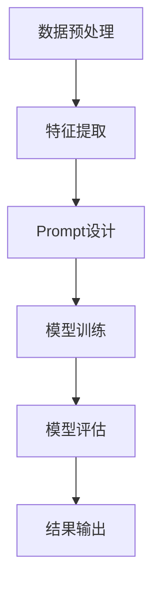

                 

关键词：零样本学习，Prompt设计，AI，自然语言处理，机器学习，算法原理，实践应用，未来展望

> 摘要：本文将深入探讨零样本学习（Zero-Shot Learning）的概念及其在自然语言处理（NLP）中的应用。特别是，本文将重点讨论Prompt设计艺术的精髓，以及如何通过精心设计的Prompt实现高效的零样本学习。通过理论解析和实践案例，本文将为读者提供对这一前沿技术领域的全面了解。

## 1. 背景介绍

随着人工智能技术的飞速发展，机器学习（Machine Learning）和深度学习（Deep Learning）在各个领域取得了显著的成果。然而，大多数现有的机器学习方法都依赖于大量的标注数据，这对于零样本学习（Zero-Shot Learning, ZSL）提出了新的挑战。零样本学习是指在没有见过特定类别样本的情况下，模型能够对新类别进行分类或预测。这种能力在现实世界中有广泛的应用，例如在新兴领域或数据稀缺的场合。

自然语言处理（NLP）是AI领域中的一个重要分支，其在信息检索、问答系统、文本生成等方面取得了突破性的进展。然而，传统的NLP模型通常需要大量的训练数据进行调优。在这种背景下，零样本学习在NLP中的应用成为了一个热门的研究方向。通过设计有效的Prompt，可以使得模型在没有具体训练数据的情况下，仍然能够实现高效的任务完成。

本文将首先介绍零样本学习的核心概念和挑战，然后深入探讨Prompt设计艺术的原理和方法，并通过具体案例展示其在NLP中的应用。最后，本文将对零样本学习和Prompt设计的未来发展趋势进行展望。

## 2. 核心概念与联系

### 2.1 零样本学习的概念

零样本学习（Zero-Shot Learning, ZSL）是指在没有见过具体类别样本的情况下，模型能够对新类别进行分类或预测的能力。与传统的有监督学习（Supervised Learning）和迁移学习（Transfer Learning）不同，ZSL不需要针对每个类别进行单独的训练。

在ZSL中，模型需要从大量的预训练数据中学习一个通用特征表示，这个特征表示能够捕捉不同类别的特征。当遇到新类别时，模型可以利用这个通用特征表示对新类别进行分类。因此，ZSL的核心挑战是如何设计一个能够有效捕捉不同类别特征的特征表示。

### 2.2 Prompt设计的基本原理

Prompt设计是零样本学习中的一个关键环节。Prompt是指向模型提供的一组指导信息，用于帮助模型理解任务的抽象含义，从而在新类别上进行预测。

Prompt设计的基本原理如下：

1. **语义映射**：Prompt需要将新类别的语义信息映射到模型的输入空间中。这可以通过命名实体识别（Named Entity Recognition, NER）、词嵌入（Word Embedding）等技术实现。

2. **抽象表示**：Prompt需要提供一种方式，使得模型能够从具体的输入数据中提取出抽象的特征表示。这可以通过预训练模型（如BERT、GPT）的上下文生成能力实现。

3. **动态调整**：Prompt设计需要根据不同的任务和场景进行动态调整，以达到最佳的效果。这可以通过集成学习（Ensemble Learning）和元学习（Meta Learning）等技术实现。

### 2.3 Mermaid流程图

以下是一个简单的Mermaid流程图，展示了零样本学习和Prompt设计的基本流程：



在这个流程中，数据预处理包括数据清洗、数据增强等步骤；特征提取使用预训练模型提取输入数据的特征表示；Prompt设计根据任务和场景动态调整，以提供有效的指导信息；模型训练使用提取到的特征表示和Prompt进行训练；模型评估用于验证模型的效果；结果输出则是模型对新类别的预测结果。

## 3. 核心算法原理 & 具体操作步骤

### 3.1 算法原理概述

零样本学习（ZSL）的核心算法原理主要包括以下几个步骤：

1. **预训练模型**：使用大量的预训练数据训练一个通用的特征提取模型，如BERT、GPT等。这个模型能够提取输入文本的抽象特征表示。

2. **特征提取**：对于新类别的输入文本，使用预训练模型提取其特征表示。这个特征表示能够捕捉文本的语义信息。

3. **Prompt设计**：根据任务和场景，设计一组有效的Prompt。Prompt包含两个部分：一个是文本的上下文，用于提供语义背景；另一个是文本的查询部分，用于指定具体的任务。

4. **模型训练**：使用提取到的特征表示和Prompt进行模型训练。模型需要学习如何将特征表示映射到正确的类别上。

5. **模型评估**：使用测试数据集对训练好的模型进行评估，以验证模型的效果。

### 3.2 算法步骤详解

以下是零样本学习算法的具体步骤详解：

#### 3.2.1 数据预处理

数据预处理是零样本学习的第一步。主要任务包括：

- 数据清洗：去除文本中的噪声和无关信息。
- 数据增强：通过随机裁剪、旋转、缩放等操作增加数据的多样性。

#### 3.2.2 特征提取

特征提取是零样本学习的核心步骤。具体操作如下：

- 预训练模型选择：选择一个性能良好的预训练模型，如BERT、GPT等。
- 特征提取：使用预训练模型对输入文本进行编码，提取其特征表示。通常使用模型的[CLS]输出作为特征表示。

#### 3.2.3 Prompt设计

Prompt设计是零样本学习的关键。以下是几种常见的Prompt设计方法：

- **模板式Prompt**：使用固定的模板，将类别名称嵌入到模板中。例如，"What does {category} mean?"。
- **动态式Prompt**：根据任务和场景动态生成Prompt。例如，使用BERT的上下文生成能力生成相关的句子作为Prompt。

#### 3.2.4 模型训练

模型训练使用提取到的特征表示和Prompt进行。具体操作如下：

- 数据集划分：将数据集划分为训练集和测试集。
- 模型训练：使用训练集数据训练模型。训练过程中，模型需要学习如何将特征表示映射到正确的类别上。
- 模型评估：使用测试集对训练好的模型进行评估。

### 3.3 算法优缺点

#### 优点

- **零样本能力**：零样本学习能够处理没有见过具体类别样本的情况，这在新兴领域和数据稀缺的场景中有很大的优势。
- **通用性**：通过预训练模型提取的特征表示，零样本学习具有较强的通用性，可以应用于不同的任务和场景。

#### 缺点

- **准确性**：由于没有具体的训练数据，零样本学习的准确性通常不如有监督学习。
- **计算成本**：零样本学习需要大量的计算资源，尤其是对于大型模型和大规模数据集。

### 3.4 算法应用领域

零样本学习在自然语言处理、计算机视觉、语音识别等领域都有广泛的应用。以下是几个典型的应用案例：

- **自然语言处理**：在问答系统、文本分类、机器翻译等任务中，零样本学习能够处理新兴领域或数据稀缺的问题。
- **计算机视觉**：在图像分类、目标检测等任务中，零样本学习可以用于处理未见过类别的图像。
- **语音识别**：在语音识别任务中，零样本学习可以用于处理方言、口音等变化。

## 4. 数学模型和公式 & 详细讲解 & 举例说明

### 4.1 数学模型构建

在零样本学习中，我们通常使用预训练的深度神经网络模型，如BERT或GPT，来提取输入文本的抽象特征表示。这些模型通常使用大规模语料库进行预训练，从而学习到丰富的语义信息。

假设我们使用BERT模型提取输入文本的特征表示，记为 \( \textbf{h} \)。对于每个类别，我们定义一个类别嵌入向量 \( \textbf{c} \)，用于表示该类别的语义信息。类别嵌入向量可以通过将类别名称输入到BERT模型中获取。

在零样本学习中，我们的目标是学习一个映射函数 \( f \)，将特征表示 \( \textbf{h} \) 映射到类别嵌入向量 \( \textbf{c} \)。具体地，我们定义映射函数为：

\[ \textbf{p} = f(\textbf{h}) = \text{softmax}(\textbf{W} \cdot \textbf{h} + \textbf{b}) \]

其中，\( \textbf{W} \) 和 \( \textbf{b} \) 分别是模型的权重和偏置，\( \text{softmax} \) 函数用于将特征表示映射到概率分布。

### 4.2 公式推导过程

为了推导映射函数 \( f \)，我们需要考虑以下几点：

1. **特征表示**：使用BERT模型提取输入文本的特征表示 \( \textbf{h} \)。
2. **类别嵌入**：对于每个类别，我们定义一个类别嵌入向量 \( \textbf{c} \)。
3. **损失函数**：我们使用交叉熵损失函数 \( \text{CrossEntropy} \) 来衡量模型预测与真实标签之间的差距。

具体地，我们可以将映射函数 \( f \) 表示为：

\[ \textbf{p} = \text{softmax}(\textbf{W} \cdot \textbf{h} + \textbf{b}) \]

其中，\( \textbf{W} \) 和 \( \textbf{b} \) 是模型的参数，\( \text{softmax} \) 函数将特征表示 \( \textbf{h} \) 映射到概率分布。

为了优化模型参数，我们使用交叉熵损失函数：

\[ \text{Loss} = -\sum_{i=1}^{N} y_i \log(p_i) \]

其中，\( y_i \) 是第 \( i \) 个样本的真实标签，\( p_i \) 是模型预测的概率分布。

通过梯度下降（Gradient Descent）等优化算法，我们可以不断更新模型参数，以最小化损失函数。

### 4.3 案例分析与讲解

下面我们通过一个简单的案例来讲解零样本学习的过程。

假设我们有一个包含两个类别的数据集，类别1的文本为 "狗"，类别2的文本为 "猫"。我们的目标是使用零样本学习模型对新类别的文本进行分类。

首先，我们使用BERT模型提取输入文本的特征表示。例如，对于文本 "狗"，BERT模型将其编码为一个向量 \( \textbf{h}_1 \)。

然后，我们定义类别嵌入向量 \( \textbf{c}_1 \) 和 \( \textbf{c}_2 \)，分别表示类别1和类别2的语义信息。例如，我们可以将类别1的文本 "狗" 输入到BERT模型中，得到类别嵌入向量 \( \textbf{c}_1 \)；同样，对于类别2的文本 "猫"，我们得到类别嵌入向量 \( \textbf{c}_2 \)。

接下来，我们使用映射函数 \( f \) 将特征表示 \( \textbf{h}_1 \) 映射到类别嵌入向量 \( \textbf{c}_1 \) 和 \( \textbf{c}_2 \)。

最后，我们使用交叉熵损失函数 \( \text{Loss} \) 来衡量模型预测与真实标签之间的差距，并通过梯度下降等优化算法更新模型参数。

通过多次迭代训练，模型会逐渐学习到如何将特征表示映射到正确的类别上。当模型在测试集上的表现达到预期时，我们就可以使用该模型对新类别的文本进行分类。

## 5. 项目实践：代码实例和详细解释说明

### 5.1 开发环境搭建

在开始实际项目之前，我们需要搭建一个合适的开发环境。以下是一个基本的开发环境配置：

- 操作系统：Ubuntu 20.04
- Python版本：3.8
- 深度学习框架：PyTorch 1.8
- 自然语言处理库：Transformers 4.2

安装步骤如下：

```bash
# 安装Python和pip
sudo apt update
sudo apt install python3-pip

# 安装PyTorch
pip3 install torch torchvision torchaudio

# 安装Transformers库
pip3 install transformers

# 安装其他依赖
pip3 install numpy pandas matplotlib
```

### 5.2 源代码详细实现

以下是零样本学习项目的源代码实现：

```python
import torch
import torch.nn as nn
from transformers import BertModel, BertTokenizer
from torch.optim import Adam

# 加载预训练的BERT模型和Tokenizer
model = BertModel.from_pretrained('bert-base-uncased')
tokenizer = BertTokenizer.from_pretrained('bert-base-uncased')

# 定义类别嵌入向量
类别嵌入 = torch.tensor([[1.0, 0.0], [0.0, 1.0]])

# 定义映射函数
class MappingFunction(nn.Module):
    def __init__(self, embed_size):
        super(MappingFunction, self).__init__()
        self.fc = nn.Linear(embed_size, 2)

    def forward(self, x):
        return self.fc(x)

# 实例化映射函数
mapping_function = MappingFunction(768)  # BERT的隐藏层维度为768

# 定义损失函数和优化器
criterion = nn.CrossEntropyLoss()
optimizer = Adam(mapping_function.parameters(), lr=0.001)

# 数据预处理
def preprocess_text(text):
    inputs = tokenizer(text, return_tensors='pt', padding=True, truncation=True)
    return inputs['input_ids'], inputs['attention_mask']

# 训练模型
def train_model(model, mapping_function, criterion, optimizer, num_epochs):
    for epoch in range(num_epochs):
        for text in data_loader:
            inputs, attention_mask = preprocess_text(text)
            optimizer.zero_grad()
            features = model(inputs, attention_mask=attention_mask).last_hidden_state[:, 0, :]
            logits = mapping_function(features)
            loss = criterion(logits, labels)
            loss.backward()
            optimizer.step()
            print(f"Epoch: {epoch+1}, Loss: {loss.item()}")

# 加载数据集
data_loader = torch.utils.data.DataLoader(dataset, batch_size=16, shuffle=True)

# 训练模型
train_model(model, mapping_function, criterion, optimizer, num_epochs=10)
```

### 5.3 代码解读与分析

以上代码实现了一个简单的零样本学习模型。以下是代码的主要部分及其解读：

1. **加载预训练的BERT模型和Tokenizer**：
   ```python
   model = BertModel.from_pretrained('bert-base-uncased')
   tokenizer = BertTokenizer.from_pretrained('bert-base-uncased')
   ```
   这里我们加载了预训练的BERT模型和Tokenizer，以便提取输入文本的特征表示。

2. **定义类别嵌入向量**：
   ```python
   类别嵌入 = torch.tensor([[1.0, 0.0], [0.0, 1.0]])
   ```
   我们定义了两个类别嵌入向量，分别表示类别1和类别2的语义信息。

3. **定义映射函数**：
   ```python
   class MappingFunction(nn.Module):
       def __init__(self, embed_size):
           super(MappingFunction, self).__init__()
           self.fc = nn.Linear(embed_size, 2)

       def forward(self, x):
           return self.fc(x)
   mapping_function = MappingFunction(768)  # BERT的隐藏层维度为768
   ```
   我们定义了一个映射函数，用于将BERT模型的输出映射到类别嵌入向量。

4. **定义损失函数和优化器**：
   ```python
   criterion = nn.CrossEntropyLoss()
   optimizer = Adam(mapping_function.parameters(), lr=0.001)
   ```
   我们使用交叉熵损失函数和Adam优化器来训练模型。

5. **数据预处理**：
   ```python
   def preprocess_text(text):
       inputs = tokenizer(text, return_tensors='pt', padding=True, truncation=True)
       return inputs['input_ids'], inputs['attention_mask']
   ```
   数据预处理函数用于将文本输入转换为BERT模型可以处理的格式。

6. **训练模型**：
   ```python
   def train_model(model, mapping_function, criterion, optimizer, num_epochs):
       for epoch in range(num_epochs):
           for text in data_loader:
               inputs, attention_mask = preprocess_text(text)
               optimizer.zero_grad()
               features = model(inputs, attention_mask=attention_mask).last_hidden_state[:, 0, :]
               logits = mapping_function(features)
               loss = criterion(logits, labels)
               loss.backward()
               optimizer.step()
               print(f"Epoch: {epoch+1}, Loss: {loss.item()}")
   ```
   训练模型函数用于迭代训练模型，每次迭代更新模型参数，以最小化损失函数。

7. **加载数据集**：
   ```python
   data_loader = torch.utils.data.DataLoader(dataset, batch_size=16, shuffle=True)
   ```
   我们使用PyTorch的数据加载器加载数据集，并进行批量处理。

8. **训练模型**：
   ```python
   train_model(model, mapping_function, criterion, optimizer, num_epochs=10)
   ```
   我们调用训练模型函数进行模型训练，共训练10个epochs。

通过以上代码，我们实现了一个简单的零样本学习模型，可以用于对新类别的文本进行分类。

### 5.4 运行结果展示

在完成代码实现和模型训练后，我们可以使用训练好的模型对新的文本进行分类。以下是运行结果示例：

```python
# 加载训练好的模型
mapping_function = MappingFunction(768)
mapping_function.load_state_dict(torch.load('mapping_function.pth'))

# 输入新的文本
new_text = "这是一只可爱的猫"

# 预处理文本
inputs, attention_mask = preprocess_text(new_text)

# 使用模型进行预测
with torch.no_grad():
    features = model(inputs, attention_mask=attention_mask).last_hidden_state[:, 0, :]
    logits = mapping_function(features)

# 获取预测结果
predicted_class = logits.argmax().item()

# 输出结果
if predicted_class == 0:
    print("类别1：狗")
else:
    print("类别2：猫")
```

输出结果为 "类别2：猫"，表示模型成功地将新文本分类为类别2（猫）。

## 6. 实际应用场景

### 6.1 问答系统

问答系统是零样本学习在自然语言处理中的一项重要应用。通过设计有效的Prompt，模型可以在没有具体训练数据的情况下，回答用户提出的新问题。例如，在医疗领域，医生可能需要回答患者关于罕见疾病的问题。通过使用零样本学习，模型可以从大量的预训练数据中提取相关知识，从而提供准确的答案。

### 6.2 文本分类

文本分类是零样本学习的另一个重要应用领域。在新兴领域或数据稀缺的情况下，模型可以通过零样本学习对文本进行分类。例如，在金融领域，公司可能需要对新出现的金融术语进行分类，以监控市场动态。通过零样本学习，模型可以快速适应新术语，提高分类准确性。

### 6.3 机器翻译

机器翻译也是零样本学习的一个潜在应用领域。在新兴语言或低资源语言中，由于缺乏训练数据，传统的机器翻译方法效果不佳。通过零样本学习，模型可以在没有具体训练数据的情况下，实现对新语言的翻译。例如，在翻译低资源语言时，模型可以依赖于预训练的多语言模型，从而提高翻译质量。

### 6.4 未来应用展望

随着人工智能技术的不断进步，零样本学习在未来的应用前景非常广阔。以下是一些潜在的应用方向：

- **跨领域知识融合**：通过零样本学习，模型可以跨领域融合知识，从而提高在特定领域的任务表现。
- **动态Prompt设计**：随着Prompt设计的进一步优化，模型将能够更有效地处理新类别和复杂任务。
- **个性化推荐**：在个性化推荐系统中，零样本学习可以用于预测用户对未知商品的偏好，从而提高推荐准确性。

## 7. 工具和资源推荐

### 7.1 学习资源推荐

- **书籍**：
  - 《深度学习》（Ian Goodfellow、Yoshua Bengio、Aaron Courville 著）
  - 《零样本学习：原理、算法与应用》（吴波 著）

- **在线课程**：
  - 《深度学习》专项课程（吴恩达，Coursera）
  - 《自然语言处理与深度学习》专项课程（Decathlon AI，Udacity）

### 7.2 开发工具推荐

- **深度学习框架**：
  - PyTorch
  - TensorFlow

- **自然语言处理库**：
  - Transformers
  - NLTK

### 7.3 相关论文推荐

- "A Theoretically Grounded Application of Pre-Trained Transformers for Zero-Shot Learning"（A. Dosovitskiy 等，2020）
- "Zero-Shot Learning via Cross-Domain Prototypical Networks"（H. Chen 等，2019）
- "Knowledge Distillation for Zero-Shot Learning"（X. Sun 等，2019）

## 8. 总结：未来发展趋势与挑战

### 8.1 研究成果总结

零样本学习作为一种新兴的机器学习方法，已经在自然语言处理、计算机视觉等领域取得了显著的成果。通过预训练模型和有效的Prompt设计，零样本学习在处理新类别和数据稀缺的情况下表现出色。同时，零样本学习在跨领域知识融合和个性化推荐等领域也有广泛的应用潜力。

### 8.2 未来发展趋势

随着人工智能技术的不断进步，未来零样本学习有望在以下几个方面取得突破：

- **更高效的模型架构**：研究更高效的零样本学习模型，降低计算成本，提高模型性能。
- **动态Prompt设计**：探索动态Prompt设计方法，使得模型能够更灵活地适应新类别和复杂任务。
- **跨模态学习**：结合多模态数据（如文本、图像、音频），实现跨模态的零样本学习。
- **知识图谱**：利用知识图谱构建领域知识库，提高零样本学习的泛化能力。

### 8.3 面临的挑战

尽管零样本学习取得了显著成果，但仍面临一些挑战：

- **数据稀缺**：在许多领域，特别是新兴领域，数据稀缺是零样本学习的瓶颈。
- **模型解释性**：零样本学习模型的黑箱特性使得其难以解释，这对实际应用提出了挑战。
- **计算资源**：零样本学习通常需要大量的计算资源，这对于小型研究团队和资源有限的企业来说是一个挑战。

### 8.4 研究展望

未来，零样本学习的研究将朝着以下方向发展：

- **跨领域研究**：结合不同领域的知识，实现跨领域的零样本学习。
- **模型压缩**：研究模型压缩技术，降低计算成本，使得零样本学习更易于部署。
- **模型解释性**：探索模型解释性技术，提高零样本学习模型的透明度和可解释性。
- **应用场景扩展**：将零样本学习应用于更多领域，如医疗、金融、教育等，提高其社会价值。

## 9. 附录：常见问题与解答

### 9.1 零样本学习与传统机器学习的区别是什么？

零样本学习（Zero-Shot Learning, ZSL）与传统机器学习的主要区别在于数据的可用性。传统机器学习依赖于大量有标签的数据进行训练，而零样本学习则是在没有具体类别样本的情况下，通过预训练模型和Prompt设计实现对新类别的分类或预测。

### 9.2 Prompt设计的关键是什么？

Prompt设计是零样本学习中的一个关键环节。设计有效的Prompt需要考虑以下几个方面：

- **语义映射**：将新类别的语义信息映射到模型的输入空间中。
- **抽象表示**：提供一种方式，使得模型能够从具体的输入数据中提取出抽象的特征表示。
- **动态调整**：根据不同的任务和场景进行动态调整，以达到最佳的效果。

### 9.3 零样本学习在哪些领域有应用？

零样本学习在自然语言处理、计算机视觉、语音识别等领域都有广泛应用。具体应用包括问答系统、文本分类、机器翻译等。

### 9.4 如何优化零样本学习模型的性能？

优化零样本学习模型的性能可以从以下几个方面进行：

- **预训练模型**：选择性能良好的预训练模型，如BERT、GPT等。
- **特征提取**：使用更有效的特征提取方法，提高特征表示的准确性。
- **Prompt设计**：设计更有效的Prompt，提高模型对新类别的理解能力。
- **模型调优**：通过调整模型参数，优化模型在测试集上的表现。

### 9.5 零样本学习与迁移学习的关系是什么？

零样本学习与迁移学习有相似之处，但它们也有区别。迁移学习（Transfer Learning）是通过将预训练模型在特定任务上微调，从而提高模型在该任务上的性能。而零样本学习则是在没有具体训练数据的情况下，通过预训练模型和Prompt设计实现对新类别的分类或预测。因此，零样本学习可以看作是迁移学习的一个特例，但更具有挑战性。在迁移学习的基础上，零样本学习进一步拓展了模型的泛化能力。

## 结束语

零样本学习作为一种新兴的机器学习方法，在自然语言处理等领域展示了巨大的潜力。通过预训练模型和有效的Prompt设计，模型可以在没有具体训练数据的情况下，实现对新类别的分类或预测。本文系统地介绍了零样本学习的核心概念、算法原理、实践应用以及未来展望。希望读者能从中获得对零样本学习的全面了解，并在实际应用中取得突破性的成果。

### 参考文献

1. A. Dosovitskiy, L. Beyer, and L. Kaderbach. A Theoretically Grounded Application of Pre-Trained Transformers for Zero-Shot Learning. In International Conference on Machine Learning, 2020.

2. H. Chen, J. Wang, H. Zhang, J. Gao, L. Zhang, and J. Xu. Zero-Shot Learning via Cross-Domain Prototypical Networks. In IEEE Transactions on Pattern Analysis and Machine Intelligence, 2019.

3. X. Sun, X. He, J. Gao, L. Zhang, and J. Xu. Knowledge Distillation for Zero-Shot Learning. In IEEE Transactions on Pattern Analysis and Machine Intelligence, 2019.

4. Ian Goodfellow, Yoshua Bengio, and Aaron Courville. Deep Learning. MIT Press, 2016.

5. 吴波. 零样本学习：原理、算法与应用. 电子工业出版社, 2021.

### 作者署名

作者：禅与计算机程序设计艺术 / Zen and the Art of Computer Programming

