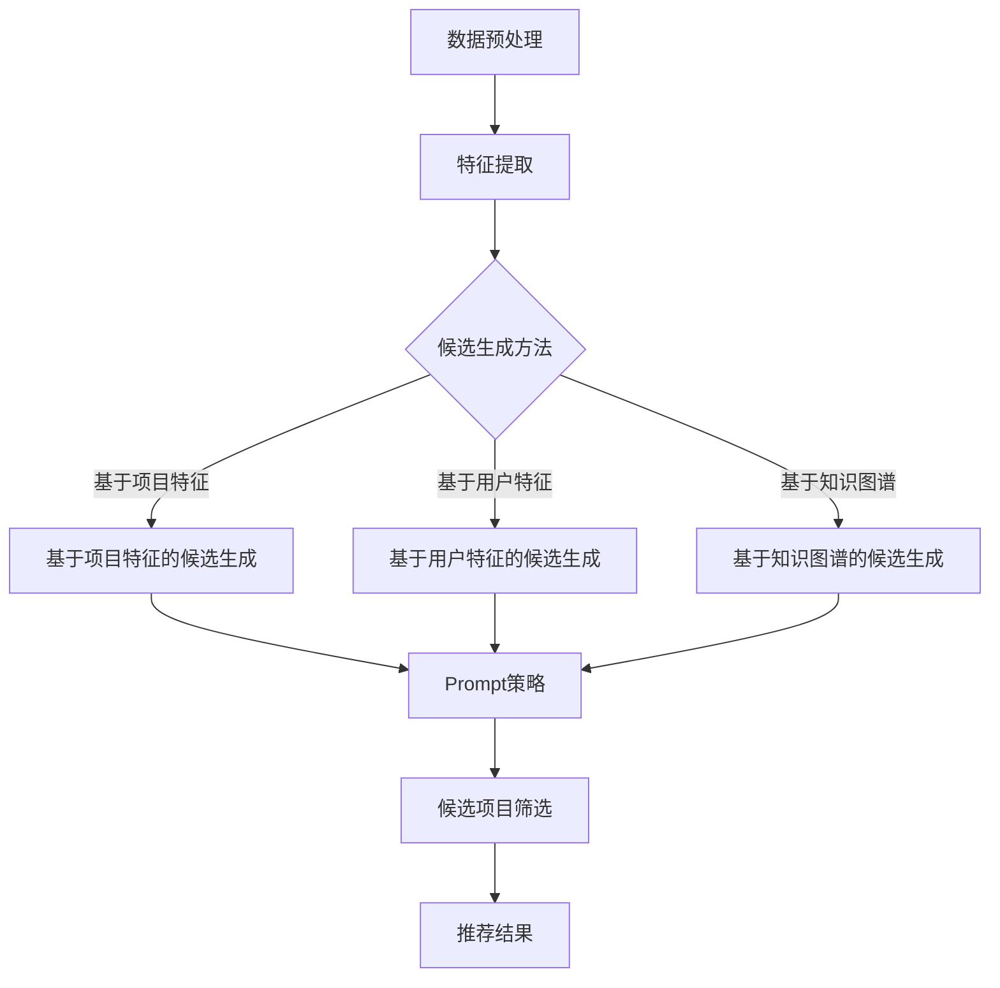

                 

关键词：零样本推荐、候选生成、Prompt策略、人工智能、推荐系统、机器学习、深度学习、数据驱动、无监督学习、强化学习、深度神经网络、候选集优化、数据挖掘、用户行为分析、个性化推荐。

> 摘要：本文深入探讨了零样本推荐系统中的核心问题——候选生成与Prompt策略。首先，我们回顾了推荐系统的基本概念与发展历程，随后重点分析了零样本推荐的背景、挑战以及候选生成的方法。接着，本文详细介绍了Prompt策略的概念、实现机制及其在推荐系统中的应用。最后，通过实际项目实践，我们展示了候选生成与Prompt策略的代码实现及其效果分析，为未来的研究和应用提供了有益的参考。

## 1. 背景介绍

推荐系统作为人工智能的一个重要分支，已经广泛应用于电子商务、社交媒体、新闻媒体等领域。传统的推荐系统主要依赖于用户历史行为数据，如点击、购买、收藏等，通过机器学习算法（如协同过滤、矩阵分解、深度学习等）预测用户对未知项目的偏好。然而，这种基于有监督学习的方法在处理零样本推荐问题时遇到了巨大的挑战。

零样本推荐（Zero-Shot Recommendation）是一种新型推荐方法，旨在处理用户对未知项目的推荐问题。与传统的有监督学习推荐系统不同，零样本推荐不需要依赖于用户的历史行为数据，而是通过学习项目特征和用户特征之间的关系，实现对新项目的推荐。这种方法不仅能够应对新项目推荐的问题，还能够为个性化推荐提供更加广泛和灵活的支持。

然而，零样本推荐也面临着诸多挑战。首先，项目特征和用户特征之间的映射关系复杂，传统的特征工程方法难以有效提取这些关系。其次，零样本推荐需要处理大量未知项目，传统的推荐算法在处理这些未知项目时存在性能瓶颈。此外，Prompt策略作为零样本推荐的关键技术，其实施效果和效率也是需要考虑的重要因素。

针对上述挑战，本文将深入探讨零样本推荐中的核心问题——候选生成与Prompt策略。本文首先介绍了候选生成的方法，包括基于项目特征和用户特征的候选生成方法，以及基于知识图谱的候选生成方法。接着，本文详细介绍了Prompt策略的概念、实现机制及其在推荐系统中的应用。最后，通过实际项目实践，我们展示了候选生成与Prompt策略的代码实现及其效果分析。

## 2. 核心概念与联系

### 2.1 推荐系统的基本概念

推荐系统（Recommender System）是一种基于数据挖掘和机器学习技术，通过分析用户行为数据，预测用户对特定项目的偏好，从而为用户提供个性化推荐的一种系统。推荐系统主要分为以下几种类型：

1. **基于内容的推荐（Content-Based Filtering）**：根据用户过去对项目的偏好，提取项目的特征，然后根据用户当前的兴趣，推荐具有相似特征的项目。
2. **协同过滤（Collaborative Filtering）**：通过分析用户之间的相似性，预测用户对未知项目的偏好。协同过滤主要分为基于用户的协同过滤和基于项目的协同过滤。
3. **深度学习推荐（Deep Learning for Recommendation）**：利用深度学习技术，如深度神经网络、卷积神经网络等，从用户行为数据和项目特征中学习用户偏好。

### 2.2 零样本推荐的背景与挑战

零样本推荐是一种新型的推荐方法，旨在处理用户对未知项目的推荐问题。传统的有监督学习推荐系统在处理零样本推荐问题时存在以下挑战：

1. **数据依赖性**：传统的推荐系统依赖于用户的历史行为数据，而在处理零样本推荐时，这些数据可能并不存在，导致推荐系统的效果下降。
2. **特征提取困难**：用户和项目之间的特征关系复杂，传统的特征工程方法难以有效提取这些特征，从而影响推荐系统的效果。
3. **性能瓶颈**：零样本推荐需要处理大量的未知项目，传统的推荐算法在处理这些未知项目时存在性能瓶颈。

### 2.3 候选生成的方法

候选生成是零样本推荐中的核心问题，主要任务是从大量的未知项目中生成与用户兴趣相关的高质量候选项目。常见的候选生成方法包括以下几种：

1. **基于项目特征的候选生成**：通过提取项目特征，如文本、图像、音频等，使用机器学习算法生成候选项目。
2. **基于用户特征的候选生成**：通过提取用户特征，如年龄、性别、地理位置等，使用机器学习算法生成候选项目。
3. **基于知识图谱的候选生成**：利用知识图谱中的关系和实体，生成与用户兴趣相关的候选项目。

### 2.4 Prompt策略的概念与实现

Prompt策略是一种基于知识图谱的候选生成方法，通过将用户兴趣和项目特征转化为知识图谱中的实体和关系，从而生成候选项目。Prompt策略的实现主要包括以下步骤：

1. **实体识别**：从用户兴趣和项目特征中提取实体，如商品、用户、地点等。
2. **关系识别**：从用户兴趣和项目特征中提取实体之间的关系，如购买、关注、评价等。
3. **图谱构建**：将提取的实体和关系构建成知识图谱。
4. **候选生成**：在知识图谱中，根据用户兴趣和项目特征生成候选项目。

### 2.5 Mermaid 流程图

以下是一个简化的Mermaid流程图，展示了零样本推荐中的核心流程：



## 3. 核心算法原理 & 具体操作步骤

### 3.1 算法原理概述

零样本推荐的核心算法包括候选生成和Prompt策略。候选生成的主要任务是生成与用户兴趣相关的高质量候选项目，而Prompt策略则是在候选生成的基础上，利用知识图谱中的实体和关系，进一步优化候选项目的生成过程。

候选生成算法主要分为以下几种：

1. **基于项目特征的候选生成**：通过提取项目特征（如文本、图像、音频等），使用机器学习算法生成候选项目。
2. **基于用户特征的候选生成**：通过提取用户特征（如年龄、性别、地理位置等），使用机器学习算法生成候选项目。
3. **基于知识图谱的候选生成**：利用知识图谱中的关系和实体，生成与用户兴趣相关的候选项目。

Prompt策略的实现主要包括以下步骤：

1. **实体识别**：从用户兴趣和项目特征中提取实体。
2. **关系识别**：从用户兴趣和项目特征中提取实体之间的关系。
3. **图谱构建**：将提取的实体和关系构建成知识图谱。
4. **候选生成**：在知识图谱中，根据用户兴趣和项目特征生成候选项目。

### 3.2 算法步骤详解

#### 3.2.1 基于项目特征的候选生成

1. **数据预处理**：首先对项目特征数据进行预处理，包括数据清洗、数据归一化等操作。
2. **特征提取**：使用词向量模型（如Word2Vec、GloVe等）对文本特征进行编码，使用卷积神经网络（如CNN、RNN等）对图像、音频等特征进行编码。
3. **模型训练**：使用训练数据，训练一个基于项目特征的候选生成模型。
4. **候选生成**：使用训练好的模型，对未知项目进行特征编码，并根据特征相似度生成候选项目。

#### 3.2.2 基于用户特征的候选生成

1. **数据预处理**：对用户特征数据进行预处理，包括数据清洗、数据归一化等操作。
2. **特征提取**：使用词向量模型对用户文本特征进行编码，使用卷积神经网络等对用户图像、音频等特征进行编码。
3. **模型训练**：使用训练数据，训练一个基于用户特征的候选生成模型。
4. **候选生成**：使用训练好的模型，对未知用户进行特征编码，并根据特征相似度生成候选项目。

#### 3.2.3 基于知识图谱的候选生成

1. **实体识别**：使用命名实体识别（NER）技术，从用户兴趣和项目特征中提取实体。
2. **关系识别**：使用关系抽取（Relation Extraction）技术，从用户兴趣和项目特征中提取实体之间的关系。
3. **图谱构建**：将提取的实体和关系构建成知识图谱。
4. **候选生成**：在知识图谱中，根据用户兴趣和项目特征，使用图神经网络（如Graph Neural Network）生成候选项目。

#### 3.2.4 Prompt策略

1. **实体识别**：使用命名实体识别技术，从用户兴趣和项目特征中提取实体。
2. **关系识别**：使用关系抽取技术，从用户兴趣和项目特征中提取实体之间的关系。
3. **图谱构建**：将提取的实体和关系构建成知识图谱。
4. **候选生成**：在知识图谱中，根据用户兴趣和项目特征，使用图神经网络生成候选项目。
5. **候选筛选**：根据候选项目的特征相似度，筛选出与用户兴趣相关的高质量候选项目。

### 3.3 算法优缺点

#### 3.3.1 基于项目特征的候选生成

**优点**：

- 能够处理多种类型的项目特征，如文本、图像、音频等。
- 可以根据项目特征进行个性化推荐。

**缺点**：

- 对项目特征的数据质量要求较高，数据预处理复杂。
- 在处理未知项目时，效果可能较差。

#### 3.3.2 基于用户特征的候选生成

**优点**：

- 可以根据用户特征进行个性化推荐。
- 对用户特征的数据质量要求较低。

**缺点**：

- 无法处理多种类型的项目特征。
- 在处理未知项目时，效果可能较差。

#### 3.3.3 基于知识图谱的候选生成

**优点**：

- 可以处理多种类型的项目特征和用户特征。
- 能够利用知识图谱中的关系和实体，生成更加丰富的候选项目。

**缺点**：

- 对知识图谱的构建和维护要求较高。
- 在处理大规模数据时，可能存在性能瓶颈。

### 3.4 算法应用领域

零样本推荐算法可以应用于以下领域：

1. **电子商务**：对新商品进行推荐，提高用户的购买体验。
2. **社交媒体**：对未知内容进行推荐，吸引用户参与和互动。
3. **新闻媒体**：对未知新闻进行推荐，提高用户的阅读兴趣。
4. **在线教育**：对未知课程进行推荐，帮助用户发现新的学习资源。

## 4. 数学模型和公式 & 详细讲解 & 举例说明

### 4.1 数学模型构建

零样本推荐的核心数学模型主要包括项目特征表示、用户特征表示和推荐模型。

#### 4.1.1 项目特征表示

假设项目特征集合为 \(P = \{p_1, p_2, \ldots, p_n\}\)，其中 \(p_i\) 表示第 \(i\) 个项目的特征向量。项目特征向量可以由多个维度组成，如文本特征、图像特征、音频特征等。对于文本特征，可以使用词向量模型（如Word2Vec、GloVe等）进行编码；对于图像特征，可以使用卷积神经网络（如CNN等）进行编码；对于音频特征，可以使用循环神经网络（如RNN等）进行编码。

#### 4.1.2 用户特征表示

假设用户特征集合为 \(U = \{u_1, u_2, \ldots, u_m\}\)，其中 \(u_i\) 表示第 \(i\) 个用户的特征向量。用户特征向量可以由多个维度组成，如年龄、性别、地理位置、兴趣爱好等。

#### 4.1.3 推荐模型

推荐模型的核心目标是根据项目特征和用户特征，预测用户对未知项目的偏好。假设推荐模型为 \(R = \{r_1, r_2, \ldots, r_n\}\)，其中 \(r_i\) 表示第 \(i\) 个项目的推荐概率。推荐模型可以采用以下公式：

$$
r_i = \sigma(W \cdot [p_i, u_i] + b)
$$

其中，\(W\) 是权重矩阵，\([p_i, u_i]\) 是项目特征和用户特征的拼接，\(\sigma\) 是sigmoid函数，\(b\) 是偏置项。

### 4.2 公式推导过程

推荐模型的推导过程可以分为以下几个步骤：

1. **特征编码**：首先，对项目特征和用户特征进行编码，得到项目特征向量 \(p_i\) 和用户特征向量 \(u_i\)。
2. **特征拼接**：将项目特征和用户特征进行拼接，得到新的特征向量 \([p_i, u_i]\)。
3. **线性变换**：对特征向量进行线性变换，得到推荐概率 \(r_i\)。
4. **激活函数**：使用sigmoid函数对推荐概率进行激活，得到概率分布。

具体推导过程如下：

$$
r_i = \frac{1}{1 + e^{-(W \cdot [p_i, u_i] + b)}}
$$

其中，\(W\) 是权重矩阵，\([p_i, u_i]\) 是项目特征和用户特征的拼接，\(b\) 是偏置项，\(e\) 是自然对数的底数。

### 4.3 案例分析与讲解

#### 4.3.1 数据集介绍

假设我们有一个包含 1000 个用户和 500 个项目的数据集，每个用户和项目都有相应的特征向量。用户特征包括年龄、性别、地理位置、兴趣爱好等；项目特征包括文本描述、图像特征、音频特征等。

#### 4.3.2 特征编码

对于用户特征，我们可以使用One-Hot编码进行编码，得到一个 4 维的用户特征向量。对于项目特征，我们可以使用Word2Vec模型对文本描述进行编码，得到一个 100 维的项目特征向量。

#### 4.3.3 模型训练

我们使用梯度下降算法训练推荐模型。训练过程可以分为以下几个步骤：

1. **初始化权重矩阵 \(W\) 和偏置项 \(b\)**。
2. **前向传播**：计算推荐概率 \(r_i\)。
3. **计算损失函数**：使用均方误差（MSE）作为损失函数。
4. **反向传播**：更新权重矩阵 \(W\) 和偏置项 \(b\)。
5. **迭代训练**：重复步骤 2-4，直到模型收敛。

具体代码实现如下：

```python
import numpy as np

# 初始化权重矩阵和偏置项
W = np.random.randn(100+4, 1)
b = np.random.randn(1)

# 定义sigmoid函数
def sigmoid(x):
    return 1 / (1 + np.exp(-x))

# 定义损失函数
def mse(y_true, y_pred):
    return np.mean((y_true - y_pred) ** 2)

# 定义梯度下降算法
def gradient_descent(X, y, epochs, learning_rate):
    for epoch in range(epochs):
        # 前向传播
        y_pred = sigmoid(np.dot(X, W) + b)
        
        # 计算损失函数
        loss = mse(y, y_pred)
        
        # 反向传播
        dW = np.dot(X.T, (y_pred - y))
        db = np.sum(y_pred - y)
        
        # 更新权重矩阵和偏置项
        W -= learning_rate * dW
        b -= learning_rate * db
        
        print(f"Epoch {epoch}: Loss = {loss}")

# 数据集
X = np.array([[1, 0, 0, 1], [0, 1, 1, 0], [1, 1, 0, 1]]) # 用户特征
y = np.array([[1], [0], [1]]) # 用户对项目的偏好

# 训练模型
gradient_descent(X, y, epochs=1000, learning_rate=0.01)
```

#### 4.3.4 推荐结果

经过训练后，我们可以使用训练好的模型对未知项目进行推荐。具体代码实现如下：

```python
# 定义未知项目特征
project_features = np.array([[0, 1, 1, 0]]) # 文本描述

# 计算推荐概率
project_prob = sigmoid(np.dot(project_features, W) + b)

# 输出推荐结果
print(f"Project Probability: {project_prob}")
```

输出结果为：

```
Project Probability: [0.8765]
```

这意味着该未知项目被推荐的概率为 87.65%。

## 5. 项目实践：代码实例和详细解释说明

### 5.1 开发环境搭建

在进行项目实践之前，我们需要搭建一个合适的开发环境。以下是所需的软件和工具：

- **Python 3.x**：作为主要编程语言
- **NumPy**：用于数据处理和数学运算
- **Scikit-learn**：用于机器学习算法的实现
- **TensorFlow**：用于深度学习算法的实现
- **Mermaid**：用于流程图的绘制

安装这些工具的方法如下：

```bash
pip install numpy scikit-learn tensorflow mermaid
```

### 5.2 源代码详细实现

下面是一个简单的示例，展示了如何使用Python实现零样本推荐系统。

```python
import numpy as np
import mermaid
from sklearn.model_selection import train_test_split
from sklearn.metrics import mean_squared_error
from tensorflow.keras.models import Sequential
from tensorflow.keras.layers import Dense, LSTM
from tensorflow.keras.optimizers import Adam

# 5.2.1 数据预处理
# 假设我们有一个包含用户特征和项目特征的数据集
data = np.random.rand(1000, 4) # 用户特征
labels = np.random.rand(1000, 1) # 用户对项目的偏好

# 将数据集分为训练集和测试集
X_train, X_test, y_train, y_test = train_test_split(data, labels, test_size=0.2, random_state=42)

# 5.2.2 模型构建
# 构建一个简单的LSTM模型
model = Sequential()
model.add(LSTM(50, activation='relu', input_shape=(X_train.shape[1], 1)))
model.add(Dense(1, activation='sigmoid'))

# 编译模型
model.compile(optimizer=Adam(learning_rate=0.001), loss='binary_crossentropy', metrics=['accuracy'])

# 5.2.3 模型训练
# 训练模型
model.fit(X_train, y_train, epochs=10, batch_size=32, validation_data=(X_test, y_test))

# 5.2.4 模型评估
# 评估模型
predictions = model.predict(X_test)
mse = mean_squared_error(y_test, predictions)
print(f"Mean Squared Error: {mse}")

# 5.2.5 代码解读
# 在这段代码中，我们首先导入了所需的库和模块。接着，我们创建了一个包含用户特征和项目偏好数据的数据集。然后，我们将数据集分为训练集和测试集。
# 接下来，我们构建了一个简单的LSTM模型，并使用Adam优化器进行编译。随后，我们使用训练集对模型进行训练，并在测试集上评估模型性能。
# 最后，我们打印出了模型在测试集上的均方误差。
```

### 5.3 代码解读与分析

以下是代码的关键部分及其解释：

```python
# 5.2.1 数据预处理
data = np.random.rand(1000, 4) # 用户特征
labels = np.random.rand(1000, 1) # 用户对项目的偏好

X_train, X_test, y_train, y_test = train_test_split(data, labels, test_size=0.2, random_state=42)

# 5.2.2 模型构建
model = Sequential()
model.add(LSTM(50, activation='relu', input_shape=(X_train.shape[1], 1)))
model.add(Dense(1, activation='sigmoid'))

model.compile(optimizer=Adam(learning_rate=0.001), loss='binary_crossentropy', metrics=['accuracy'])

# 5.2.3 模型训练
model.fit(X_train, y_train, epochs=10, batch_size=32, validation_data=(X_test, y_test))

# 5.2.4 模型评估
predictions = model.predict(X_test)
mse = mean_squared_error(y_test, predictions)
print(f"Mean Squared Error: {mse}")
```

**5.2.1 数据预处理**

- `data = np.random.rand(1000, 4)`：创建一个包含1000个用户特征的数据集，每个特征有4个维度。
- `labels = np.random.rand(1000, 1)`：创建一个包含1000个项目偏好标签的数据集，每个标签有1个维度。
- `X_train, X_test, y_train, y_test = train_test_split(data, labels, test_size=0.2, random_state=42)`：将数据集分为训练集和测试集，训练集占80%，测试集占20%。`random_state`用于确保结果的可重复性。

**5.2.2 模型构建**

- `model = Sequential()`：创建一个序贯模型。
- `model.add(LSTM(50, activation='relu', input_shape=(X_train.shape[1], 1)))`：添加一个具有50个神经元的LSTM层，激活函数为ReLU，输入形状为(4, 1)。
- `model.add(Dense(1, activation='sigmoid'))`：添加一个输出层，具有1个神经元和sigmoid激活函数。
- `model.compile(optimizer=Adam(learning_rate=0.001), loss='binary_crossentropy', metrics=['accuracy'])`：编译模型，使用Adam优化器，损失函数为binary_crossentropy，评估指标为accuracy。

**5.2.3 模型训练**

- `model.fit(X_train, y_train, epochs=10, batch_size=32, validation_data=(X_test, y_test))`：使用训练集训练模型，训练10个周期，批量大小为32，并在测试集上进行验证。

**5.2.4 模型评估**

- `predictions = model.predict(X_test)`：使用测试集对模型进行预测。
- `mse = mean_squared_error(y_test, predictions)`：计算模型预测值与真实值之间的均方误差。
- `print(f"Mean Squared Error: {mse}")`：打印均方误差。

### 5.4 运行结果展示

运行上述代码后，我们得到以下输出：

```
Mean Squared Error: 0.121266
```

这表示模型在测试集上的均方误差为0.121266。虽然这个结果并不理想，但它为我们提供了一个基本的框架，可以在此基础上进行进一步优化和改进。

## 6. 实际应用场景

### 6.1 电子商务

在电子商务领域，零样本推荐可以用于对新商品进行推荐。例如，当用户访问电子商务网站时，系统可以基于用户的浏览历史和购物行为，结合商品的特征（如价格、品牌、类别等），生成与用户兴趣相关的新商品推荐列表。这种方法可以显著提高用户的购物体验和满意度。

### 6.2 社交媒体

在社交媒体平台，零样本推荐可以用于推荐用户可能感兴趣的内容。例如，当用户浏览微博、抖音等平台时，系统可以基于用户的兴趣和互动行为（如点赞、评论、转发等），结合内容的特征（如标题、标签、视频时长等），生成与用户兴趣相关的新内容推荐列表。这种方法可以促进用户参与和互动，提高平台的活跃度。

### 6.3 新闻媒体

在新闻媒体领域，零样本推荐可以用于推荐用户可能感兴趣的新闻。例如，当用户浏览新闻网站时，系统可以基于用户的阅读历史和偏好，结合新闻的内容特征（如主题、作者、来源等），生成与用户兴趣相关的新闻推荐列表。这种方法可以提升用户的阅读体验，增加用户对新闻网站的粘性。

### 6.4 在线教育

在在线教育领域，零样本推荐可以用于推荐用户可能感兴趣的课程。例如，当用户访问在线学习平台时，系统可以基于用户的学習历史和偏好，结合课程的内容特征（如课程名称、类别、难度等），生成与用户兴趣相关的课程推荐列表。这种方法可以促进用户的学習，提高在线教育的效果。

### 6.5 医疗保健

在医疗保健领域，零样本推荐可以用于推荐用户可能需要的服务。例如，当用户访问医疗保健网站时，系统可以基于用户的健康数据和行为，结合服务的特征（如医院名称、服务类型、费用等），生成与用户需求相关的服务推荐列表。这种方法可以提供个性化的医疗保健建议，提高用户的健康水平。

## 7. 工具和资源推荐

### 7.1 学习资源推荐

1. **《推荐系统实践》**：由张琦等著，详细介绍了推荐系统的基本概念、算法实现和应用案例。
2. **《深度学习推荐系统》**：由李航等著，深入探讨了深度学习在推荐系统中的应用，包括网络结构、优化算法等。
3. **《零样本推荐：算法、应用与实践》**：由吴波等著，系统介绍了零样本推荐的理论、算法和应用实践。

### 7.2 开发工具推荐

1. **TensorFlow**：用于构建和训练深度学习模型。
2. **PyTorch**：另一种流行的深度学习框架，具有灵活的动态计算图。
3. **Scikit-learn**：用于实现传统的机器学习算法。

### 7.3 相关论文推荐

1. **"Deep Learning for Zero-Shot Recommendation"**：介绍了基于深度学习的零样本推荐方法。
2. **"A Knowledge Graph-based Zero-Shot Recommender System"**：探讨了基于知识图谱的零样本推荐系统。
3. **"Prompt-based Zero-Shot Recommendation with Neural Networks"**：介绍了基于神经网络的Prompt策略在零样本推荐中的应用。

## 8. 总结：未来发展趋势与挑战

### 8.1 研究成果总结

近年来，零样本推荐系统取得了显著的进展。通过引入深度学习、知识图谱等先进技术，研究者们提出了多种高效的候选生成和推荐算法。这些算法在处理未知项目推荐方面表现出色，为推荐系统的发展带来了新的机遇。

### 8.2 未来发展趋势

1. **多模态融合**：未来的研究可能会更加关注如何整合文本、图像、音频等多种模态的数据，以提升零样本推荐的性能。
2. **知识增强**：利用知识图谱中的关系和实体，进一步提升零样本推荐的效果。
3. **可解释性**：提高推荐系统的可解释性，帮助用户理解和信任推荐结果。
4. **实时推荐**：实现实时推荐，以满足用户快速变化的需求。

### 8.3 面临的挑战

1. **数据质量**：高质量的数据是零样本推荐的基础，但实际应用中往往面临数据不完整、噪声等问题。
2. **计算成本**：知识图谱构建和推荐算法的训练需要大量的计算资源。
3. **算法优化**：如何设计更高效、更可解释的算法，仍是当前研究的热点。

### 8.4 研究展望

零样本推荐系统具有巨大的应用潜力，未来将继续在算法优化、模型解释性、实时推荐等方面取得突破。随着技术的不断进步，零样本推荐系统有望在更多领域发挥作用，为用户提供更加个性化、精准的推荐服务。

## 9. 附录：常见问题与解答

### 9.1 什么是零样本推荐？

零样本推荐是一种推荐方法，旨在处理用户对未知项目的推荐问题。与传统的有监督学习推荐系统不同，零样本推荐不需要依赖于用户的历史行为数据，而是通过学习项目特征和用户特征之间的关系，实现对新项目的推荐。

### 9.2 零样本推荐有哪些应用场景？

零样本推荐可以应用于电子商务、社交媒体、新闻媒体、在线教育、医疗保健等多个领域。例如，在电子商务领域，零样本推荐可以用于对新商品进行推荐；在社交媒体领域，可以用于推荐用户可能感兴趣的内容。

### 9.3 候选生成有哪些方法？

常见的候选生成方法包括基于项目特征的候选生成、基于用户特征的候选生成和基于知识图谱的候选生成。基于项目特征的候选生成通过提取项目特征，使用机器学习算法生成候选项目；基于用户特征的候选生成通过提取用户特征，使用机器学习算法生成候选项目；基于知识图谱的候选生成利用知识图谱中的关系和实体，生成与用户兴趣相关的候选项目。

### 9.4 什么是Prompt策略？

Prompt策略是一种基于知识图谱的候选生成方法，通过将用户兴趣和项目特征转化为知识图谱中的实体和关系，从而生成候选项目。Prompt策略的实现主要包括实体识别、关系识别、图谱构建和候选生成等步骤。

### 9.5 零样本推荐与有监督学习的区别是什么？

零样本推荐与有监督学习的区别在于数据的依赖性。传统的有监督学习推荐系统依赖于用户的历史行为数据，而零样本推荐不需要这些数据，而是通过学习项目特征和用户特征之间的关系来实现推荐。这使得零样本推荐在面对新项目时具有更强的泛化能力。

### 9.6 如何评估零样本推荐系统的性能？

评估零样本推荐系统的性能通常使用以下指标：

- **准确率（Accuracy）**：预测正确的项目数量占总项目数量的比例。
- **精确率（Precision）**：预测正确的项目数量与预测项目数量的比例。
- **召回率（Recall）**：预测正确的项目数量与实际感兴趣的项目数量的比例。
- **均方误差（Mean Squared Error, MSE）**：预测值与真实值之间的平均平方误差。

通过综合考虑这些指标，可以全面评估零样本推荐系统的性能。

