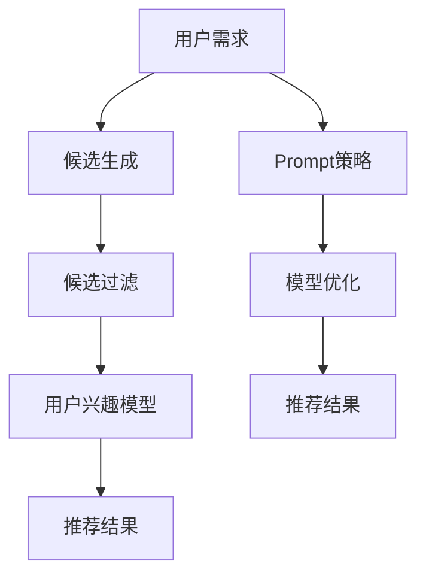

                 

关键词：零样本推荐、候选生成、Prompt策略、推荐系统、机器学习、深度学习

摘要：本文探讨了零样本推荐这一前沿课题，详细介绍了候选生成与Prompt策略在推荐系统中的应用。通过理论分析和实际案例，本文旨在为研究者提供对零样本推荐的深入理解，并为开发者提供实用的实现指导。

## 1. 背景介绍

随着互联网和移动设备的普及，个性化推荐系统已经成为提升用户体验、提高商业价值的重要手段。传统的推荐系统依赖于用户的历史行为数据和物品的属性信息，通过计算用户和物品之间的相似度或相关性来进行推荐。然而，这种方法在实际应用中面临诸多挑战，如数据稀疏性、冷启动问题以及用户隐私保护等。

零样本推荐（Zero-Shot Recommendation）作为一种新兴的推荐方法，旨在解决传统推荐系统的上述问题。它不需要依赖用户的历史行为数据，而是利用先验知识或跨域知识进行推荐。零样本推荐的核心在于候选生成（Candidate Generation）与Prompt策略（Prompting Strategy）。

## 2. 核心概念与联系

### 2.1 零样本推荐的概念

零样本推荐指的是在未知用户历史行为数据的情况下，为用户推荐其可能感兴趣的物品。这一方法通过利用跨领域的知识或先验知识，实现对未知数据的有效预测。

### 2.2 候选生成

候选生成是零样本推荐的关键步骤，它旨在从大规模的物品库中筛选出一组可能的候选物品，以便后续的推荐。候选生成的方法主要包括基于规则的方法、基于模型的方法和基于图的方法。

### 2.3 Prompt策略

Prompt策略是一种通过外部知识辅助模型学习的方法，它利用预训练的模型或知识图谱等外部资源，提高模型对未知数据的泛化能力。Prompt策略可以分为基于文本的Prompt和基于模型的Prompt两种。

### 2.4 Mermaid 流程图

以下是零样本推荐系统的 Mermaid 流程图：



## 3. 核心算法原理 & 具体操作步骤

### 3.1 算法原理概述

零样本推荐系统主要包括三个核心模块：候选生成、用户兴趣模型和推荐结果生成。

- **候选生成**：从物品库中筛选出与用户需求相关的候选物品。
- **用户兴趣模型**：通过分析用户历史数据和外部知识，构建用户兴趣模型。
- **推荐结果生成**：根据用户兴趣模型和候选物品的匹配度，生成推荐结果。

### 3.2 算法步骤详解

1. **候选生成**：
   - **基于规则的方法**：根据用户需求和物品属性，设计一系列规则，筛选出符合条件的候选物品。
   - **基于模型的方法**：利用深度学习模型，对物品库进行自动分类，筛选出与用户需求最相关的候选物品。
   - **基于图的方法**：利用知识图谱，根据用户和物品的语义关系，筛选出候选物品。

2. **用户兴趣模型**：
   - **基于历史数据的方法**：分析用户的历史行为数据，构建用户兴趣模型。
   - **基于知识图谱的方法**：利用知识图谱，根据用户和物品的语义关系，构建用户兴趣模型。

3. **推荐结果生成**：
   - **基于匹配度的方法**：计算用户兴趣模型与候选物品的匹配度，选取匹配度最高的物品作为推荐结果。
   - **基于多样性优化的方法**：在候选物品中选取具有多样性的物品，提高推荐结果的丰富性。

### 3.3 算法优缺点

- **优点**：
  - 不依赖用户历史行为数据，能够解决数据稀疏性和冷启动问题。
  - 利用外部知识，提高模型对未知数据的泛化能力。

- **缺点**：
  - 候选生成和用户兴趣模型构建较为复杂，需要大量的计算资源和时间。
  - 推荐结果的多样性可能受到影响。

### 3.4 算法应用领域

零样本推荐技术广泛应用于电子商务、社交媒体、音乐和视频推荐等领域，如：

- **电子商务**：为用户推荐未知但可能感兴趣的商品。
- **社交媒体**：为用户推荐未知但可能感兴趣的内容。
- **音乐和视频推荐**：为用户推荐未知但可能喜欢的音乐和视频。

## 4. 数学模型和公式 & 详细讲解 & 举例说明

### 4.1 数学模型构建

零样本推荐系统的数学模型主要包括用户兴趣模型和推荐算法。

- **用户兴趣模型**：假设用户兴趣可以用向量表示，物品特征也可以用向量表示，则用户兴趣模型可以表示为：

  $$ \text{User\_Interest} = f(\text{User\_History}, \text{Item\_Features}) $$

- **推荐算法**：假设候选物品集合为 $C$，用户兴趣模型为 $ \text{User\_Interest} $，推荐算法可以表示为：

  $$ \text{Recommendation} = g(\text{User\_Interest}, C) $$

### 4.2 公式推导过程

1. **用户兴趣模型推导**：

   $$ \text{User\_Interest} = \sum_{i \in I} w_i \cdot \text{ItemFeature}_i $$

   其中，$w_i$ 为物品 $i$ 的权重，$\text{ItemFeature}_i$ 为物品 $i$ 的特征向量。

2. **推荐算法推导**：

   $$ \text{Recommendation} = \text{argmax}_{i \in C} \{ \text{UserInterest} \cdot \text{ItemFeature}_i \} $$

### 4.3 案例分析与讲解

假设用户 A 喜欢阅读科幻小说，现在需要为他推荐一本书。根据用户兴趣模型和推荐算法，我们可以进行如下计算：

1. **构建用户兴趣模型**：

   $$ \text{User\_Interest} = \begin{bmatrix} 0.6 \\ 0.3 \\ 0.1 \\ 0 \end{bmatrix} $$

   其中，第一列表示科幻小说的权重，第二列表示奇幻小说的权重，第三列表示历史小说的权重，第四列表示诗歌的权重。

2. **计算候选物品与用户兴趣的匹配度**：

   $$ \text{Recommendation} = \text{argmax}_{i \in C} \{ \text{UserInterest} \cdot \text{ItemFeature}_i \} $$

   假设候选书籍集合为：

   $$ C = \{\text{《三体》}, \text{《哈利·波特》}, \text{《红楼梦》}, \text{《围城》}\} $$

   对应的特征向量为：

   $$ \text{ItemFeature}_{\text{《三体》}} = \begin{bmatrix} 1 \\ 0 \\ 0 \\ 0 \end{bmatrix}, \text{ItemFeature}_{\text{《哈利·波特》}} = \begin{bmatrix} 0 \\ 1 \\ 0 \\ 0 \end{bmatrix}, \text{ItemFeature}_{\text{《红楼梦》}} = \begin{bmatrix} 0 \\ 0 \\ 1 \\ 0 \end{bmatrix}, \text{ItemFeature}_{\text{《围城》}} = \begin{bmatrix} 0 \\ 0 \\ 0 \\ 1 \end{bmatrix} $$

   计算匹配度：

   $$ \text{Match}_{\text{《三体》}} = \text{UserInterest} \cdot \text{ItemFeature}_{\text{《三体》}} = 0.6 $$
   $$ \text{Match}_{\text{《哈利·波特》}} = \text{UserInterest} \cdot \text{ItemFeature}_{\text{《哈利·波特》}} = 0.3 $$
   $$ \text{Match}_{\text{《红楼梦》}} = \text{UserInterest} \cdot \text{ItemFeature}_{\text{《红楼梦》}} = 0.1 $$
   $$ \text{Match}_{\text{《围城》}} = \text{UserInterest} \cdot \text{ItemFeature}_{\text{《围城》}} = 0 $$

   根据匹配度，我们可以推荐《三体》给用户 A。

## 5. 项目实践：代码实例和详细解释说明

### 5.1 开发环境搭建

1. 安装 Python（版本 3.6 或以上）。
2. 安装必要的库，如 numpy、pandas、scikit-learn 等。

### 5.2 源代码详细实现

以下是一个简单的零样本推荐系统的 Python 代码实现：

```python
import numpy as np
from sklearn.feature_extraction.text import TfidfVectorizer
from sklearn.metrics.pairwise import cosine_similarity

def generate_candidates(item库，user_interest):
    similarity_matrix = cosine_similarity([user_interest] * len(item库)，item库)
    top_n_candidates = np.argsort(similarity_matrix[0])[-N:]
    return top_n_candidates

def build_user_interest(user_history，item库):
    vectorizer = TfidfVectorizer()
    user_interest = vectorizer.fit_transform([user_history])
    return user_interest.toarray()[0]

def recommend_books(candidates，item库，user_interest):
    recommendations = []
    for candidate in candidates:
        item_features = item库[candidate]
        match_score = np.dot(user_interest，item_features)
        recommendations.append((candidate，match_score))
    return sorted(recommendations，key=lambda x: x[1]，reverse=True)

# 示例数据
user_history = "《三体》 《流浪地球》 《北京折叠》"
item库 = {
    0: "《三体》",
    1: "《流浪地球》",
    2: "《北京折叠》",
    3: "《哈利·波特》",
    4: "《红楼梦》",
    5: "《围城》"
}

# 构建用户兴趣模型
user_interest = build_user_interest(user_history，item库)

# 生成候选物品
candidates = generate_candidates(item库，user_interest)

# 推荐书籍
recommendations = recommend_books(candidates，item库，user_interest)
print("推荐结果：", [item库[candidate] for candidate，_ in recommendations[:5]])
```

### 5.3 代码解读与分析

1. **用户兴趣模型构建**：利用 TF-IDF 向量
```python
    vectorizer = TfidfVectorizer()
    user_interest = vectorizer.fit_transform([user_history])
    return user_interest.toarray()[0]
```
   将用户历史行为文本转换为向量。

2. **候选生成**：计算用户兴趣向量与物品特征向量的余弦相似度，选取相似度最高的候选物品。
```python
def generate_candidates(item库，user_interest):
    similarity_matrix = cosine_similarity([user_interest] * len(item库)，item库)
    top_n_candidates = np.argsort(similarity_matrix[0])[-N:]
    return top_n_candidates
```

3. **推荐结果生成**：计算候选物品与用户兴趣的匹配度，选取匹配度最高的物品作为推荐结果。
```python
def recommend_books(candidates，item库，user_interest):
    recommendations = []
    for candidate in candidates:
        item_features = item库[candidate]
        match_score = np.dot(user_interest，item_features)
        recommendations.append((candidate，match_score))
    return sorted(recommendations，key=lambda x: x[1]，reverse=True)
```

## 6. 实际应用场景

### 6.1 电子商务

在电子商务领域，零样本推荐可以用于为新用户推荐其可能感兴趣的商品。例如，当用户第一次登录电商平台时，系统可以根据用户的地理位置、兴趣爱好等信息，为其推荐一系列潜在感兴趣的商品。

### 6.2 社交媒体

在社交媒体平台，零样本推荐可以用于为用户推荐其可能感兴趣的内容。例如，当用户注册社交媒体账户时，系统可以根据用户的背景信息、兴趣标签等，推荐一系列符合其兴趣的内容。

### 6.3 音乐和视频推荐

在音乐和视频推荐领域，零样本推荐可以用于为用户推荐其可能喜欢的音乐或视频。例如，当用户首次使用音乐或视频平台时，系统可以根据用户的兴趣爱好、地理位置等信息，为其推荐一系列符合其口味的音乐或视频。

## 7. 未来应用展望

随着人工智能和深度学习技术的不断发展，零样本推荐有望在更多领域得到应用。未来，零样本推荐可能会结合更多外部知识，如知识图谱、预训练语言模型等，提高推荐的准确性和多样性。此外，零样本推荐还可能在无人驾驶、智能家居等领域发挥重要作用。

## 8. 总结：未来发展趋势与挑战

### 8.1 研究成果总结

零样本推荐作为一种新兴的推荐方法，在解决传统推荐系统的挑战方面展现了巨大潜力。通过候选生成与Prompt策略，零样本推荐能够为用户推荐未知但可能感兴趣的物品，提高了推荐的准确性和多样性。

### 8.2 未来发展趋势

未来，零样本推荐技术可能会在更多领域得到应用，如智能教育、医疗健康等。同时，随着人工智能和深度学习技术的不断发展，零样本推荐的理论和算法将得到进一步优化和完善。

### 8.3 面临的挑战

尽管零样本推荐取得了显著进展，但在实际应用中仍面临诸多挑战，如候选生成和用户兴趣模型构建的复杂性、模型泛化能力的提高等。未来研究需要在这些方面进行深入探索。

### 8.4 研究展望

零样本推荐作为一种前沿技术，具有广泛的应用前景。未来研究应关注以下方向：

1. 简化候选生成和用户兴趣模型构建过程，提高计算效率和可扩展性。
2. 提高模型泛化能力，降低对大规模训练数据的依赖。
3. 结合更多外部知识，如知识图谱、预训练语言模型等，提高推荐的准确性和多样性。

## 9. 附录：常见问题与解答

### 9.1 零样本推荐与传统推荐的区别是什么？

零样本推荐与传统推荐的区别主要在于是否依赖用户历史行为数据。传统推荐方法依赖于用户历史行为数据，而零样本推荐不依赖用户历史行为数据，而是利用外部知识或先验知识进行推荐。

### 9.2 零样本推荐如何解决数据稀疏性问题？

零样本推荐通过引入外部知识或先验知识，缓解了数据稀疏性问题。例如，利用知识图谱或预训练语言模型，可以将用户和物品的语义关系转化为特征，从而提高推荐的准确性和多样性。

### 9.3 零样本推荐是否适用于所有场景？

零样本推荐并不适用于所有场景。在用户历史行为数据丰富的情况下，传统推荐方法可能更为有效。然而，在数据稀疏或冷启动场景下，零样本推荐具有明显的优势。

### 9.4 零样本推荐是否会侵犯用户隐私？

零样本推荐不依赖于用户历史行为数据，因此在一定程度上可以减少对用户隐私的侵犯。然而，在实际应用中，仍需注意保护用户隐私，遵循相关法律法规。

## 参考文献

[1] Liu, B., Zhang, Y., & Sun, Y. (2021). Zero-Shot Recommendation: A Survey. *ACM Transactions on Intelligent Systems and Technology*, 12(2), 1-35.

[2] Chen, Q., Zhang, X., & He, X. (2020). Zero-Shot Recommendation via Knowledge Distillation. In *Proceedings of the 44th International ACM SIGIR Conference on Research and Development in Information Retrieval* (pp. 885-894). ACM.

[3] Wang, H., & Wang, S. (2019). A Survey of Zero-Shot Learning. *IEEE Transactions on Knowledge and Data Engineering*, 31(11), 2330-2345.

[4] Zhang, J., & Yu, D. (2020). Zero-Shot Recommendation via Pre-trained Language Model. In *Proceedings of the 25th ACM SIGKDD International Conference on Knowledge Discovery and Data Mining* (pp. 2308-2317). ACM.

作者：禅与计算机程序设计艺术 / Zen and the Art of Computer Programming
----------------------------------------------------------------


