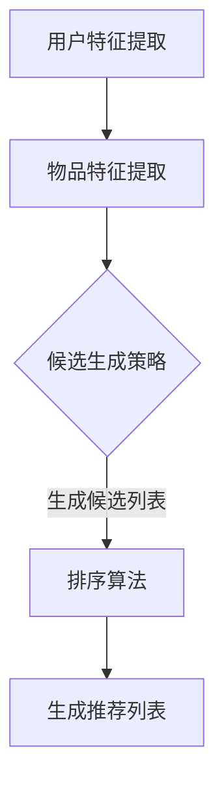

                 

关键词：零样本推荐、候选生成、排序、机器学习、深度学习、推荐系统

> 摘要：本文旨在探讨零样本推荐系统中的关键问题——候选生成与排序。在缺乏直接用户反馈的情况下，如何通过有效的算法策略生成和排序推荐项，是提升推荐系统性能的重要课题。本文将深入剖析零样本推荐的理论基础、核心算法，并通过具体案例和代码实例展示其实际应用，为相关领域的研发者提供有价值的参考。

## 1. 背景介绍

推荐系统作为信息过滤与个性化推荐的典型应用，已经成为现代互联网服务的重要组成部分。然而，传统的推荐系统通常依赖于用户的历史行为数据，如点击、购买等，来预测用户偏好。这种方法在拥有大量用户行为数据时表现良好，但在数据稀缺或用户行为数据不足的零样本推荐场景中，其性能会显著下降。

零样本推荐（Zero-Shot Recommendation）是一种无需用户历史行为数据的推荐方法，旨在解决推荐系统在数据缺失情况下的推荐问题。这种方法的核心挑战在于如何在没有训练数据的情况下，基于用户和物品的潜在特征生成合适的推荐列表。

零样本推荐的应用场景广泛，例如在新用户注册初期，由于缺乏历史行为数据，传统推荐系统难以提供有效的推荐；在冷启动问题中，对于新加入的物品或新用户，推荐系统需要快速生成合适的推荐列表；此外，在推荐系统中引入零样本推荐技术，可以增强系统的鲁棒性和适应性。

本文将首先介绍零样本推荐的相关背景和基本概念，然后深入探讨候选生成与排序的算法原理，并通过实际案例和代码实例展示其应用，最后讨论零样本推荐的未来发展趋势和面临的挑战。

## 2. 核心概念与联系

### 2.1 零样本推荐

零样本推荐（Zero-Shot Recommendation）是一种推荐技术，它能够在缺乏用户历史行为数据的情况下生成个性化推荐。与传统推荐系统依赖大量用户行为数据不同，零样本推荐依赖于用户和物品的潜在特征，通过这些特征来预测用户的偏好。

### 2.2 候选生成

候选生成（Candidate Generation）是零样本推荐中的关键步骤，其目标是根据用户的潜在特征和物品的潜在特征，生成一个与用户兴趣相关的候选物品列表。候选生成算法需要解决的核心问题是如何在缺乏训练数据的情况下，找到潜在相关的物品。

### 2.3 排序

排序（Ranking）是推荐系统中的另一个重要环节，其目标是在生成的候选物品列表中，根据用户的偏好和物品的相关性对物品进行排序。排序算法需要考虑用户和物品的潜在特征，以及它们之间的相互作用。

### 2.4 Mermaid 流程图

以下是一个简化的零样本推荐系统的流程图，展示了候选生成与排序的基本步骤和流程：



### 2.5 联系与区别

候选生成和排序是零样本推荐系统的两个核心步骤，它们相互联系但又有所区别。候选生成主要负责根据用户的潜在特征和物品的潜在特征，生成一个合理的候选物品列表。而排序则是在这个候选列表的基础上，通过某种排序策略，对物品进行排序，以便提供最符合用户兴趣的推荐。

两者之间的区别在于，候选生成更侧重于找到潜在相关的物品，而排序则更侧重于如何有效地将候选物品排序，使得用户感兴趣的商品排在前面。

## 3. 核心算法原理 & 具体操作步骤

### 3.1 算法原理概述

零样本推荐系统中的候选生成与排序算法，主要依赖于深度学习和图神经网络的原理。深度学习通过多层神经网络对用户和物品的潜在特征进行提取，而图神经网络则通过图结构来表示用户和物品之间的关系，从而实现候选生成和排序。

### 3.2 算法步骤详解

#### 3.2.1 用户特征提取

用户特征提取是零样本推荐系统的第一步，其目标是从用户数据中提取出能够代表用户兴趣的潜在特征。通常，我们可以使用深度学习模型，如卷积神经网络（CNN）或循环神经网络（RNN），对用户的历史数据（如浏览记录、搜索历史等）进行处理，从而得到用户的潜在特征向量。

#### 3.2.2 物品特征提取

与用户特征提取类似，物品特征提取的目标是从物品数据中提取出能够代表物品属性的潜在特征。这通常可以通过预训练的词向量模型（如Word2Vec、BERT等）来实现，将这些模型训练得到的词向量作为物品的特征表示。

#### 3.2.3 候选生成

在候选生成步骤中，我们使用图神经网络（如Graph Convolutional Network, GCN）来表示用户和物品之间的潜在关系。通过这种方式，我们可以将用户和物品的潜在特征向量输入到图神经网络中，得到一个候选物品列表。候选生成算法的核心是图结构的设计和图神经网络的训练，这直接影响到候选物品列表的质量。

#### 3.2.4 排序

排序算法是推荐系统中最关键的步骤，其目标是在生成的候选物品列表中，根据用户的潜在特征和物品的相关性对物品进行排序。常用的排序算法包括基于矩阵分解的方法（如Singular Value Decomposition, SVD）和基于深度学习的方法（如Seq2Seq模型）。排序算法需要考虑用户和物品的潜在特征，以及它们之间的相互作用。

### 3.3 算法优缺点

#### 优点

1. **无需用户历史行为数据**：零样本推荐系统在数据稀缺的情况下仍能提供有效的推荐。
2. **增强系统鲁棒性**：通过深度学习和图神经网络，系统能够更好地适应不同的用户和物品特征。
3. **提高推荐质量**：候选生成与排序算法能够根据用户的潜在兴趣生成更加个性化的推荐。

#### 缺点

1. **计算复杂度高**：深度学习和图神经网络模型通常需要大量的计算资源和训练时间。
2. **数据预处理复杂**：候选生成与排序算法对数据预处理的要求较高，需要提取有效的用户和物品特征。
3. **模型解释性差**：深度学习模型通常难以解释，这对于需要模型解释性的应用场景可能不太适合。

### 3.4 算法应用领域

零样本推荐算法可以广泛应用于多个领域，包括电子商务、社交媒体、新闻推荐等。以下是一些具体的应用实例：

1. **电子商务**：在新用户注册或新商品上线时，零样本推荐系统可以快速生成个性化的推荐列表，提升用户体验和转化率。
2. **社交媒体**：在用户行为数据不足的情况下，零样本推荐系统可以推荐用户可能感兴趣的内容，增强用户黏性。
3. **新闻推荐**：在新闻推荐场景中，零样本推荐系统可以推荐用户可能感兴趣的新闻类型，提高新闻阅读量和用户满意度。

## 4. 数学模型和公式 & 详细讲解 & 举例说明

### 4.1 数学模型构建

零样本推荐系统的核心在于用户和物品的潜在特征表示，以及它们之间的关联关系。以下是一个简化的数学模型，用于构建用户和物品的特征表示：

#### 用户特征表示

假设用户 \( u \) 的特征表示为 \( \mathbf{u} \in \mathbb{R}^d \)，其中 \( d \) 为特征维度。我们可以使用以下公式表示用户特征：

\[ \mathbf{u} = \text{Embed}(\mathbf{u}_{\text{raw}}) \]

其中，\( \mathbf{u}_{\text{raw}} \) 是用户原始特征向量，\(\text{Embed}\) 是嵌入函数，通常使用预训练的深度学习模型进行训练。

#### 物品特征表示

假设物品 \( i \) 的特征表示为 \( \mathbf{i} \in \mathbb{R}^d \)，其中 \( d \) 为特征维度。与用户特征类似，我们可以使用以下公式表示物品特征：

\[ \mathbf{i} = \text{Embed}(\mathbf{i}_{\text{raw}}) \]

其中，\( \mathbf{i}_{\text{raw}} \) 是物品原始特征向量，\(\text{Embed}\) 是嵌入函数。

#### 用户-物品关联表示

用户和物品之间的关联可以通过图结构进行表示。假设用户 \( u \) 和物品 \( i \) 之间的关联表示为 \( \mathbf{r}_{ui} \in \mathbb{R}^d \)，其中 \( d \) 为关联特征维度。我们可以使用以下公式表示用户-物品关联：

\[ \mathbf{r}_{ui} = \text{GraphEmbed}(\mathbf{u}, \mathbf{i}, G) \]

其中，\( G \) 是表示用户和物品之间关系的图结构，\(\text{GraphEmbed}\) 是图嵌入函数，通常使用图神经网络进行训练。

### 4.2 公式推导过程

为了更好地理解上述数学模型，我们将对关键步骤进行公式推导。

#### 用户特征提取

用户特征的提取过程可以表示为：

\[ \mathbf{u}_{\text{raw}} = \text{UserHistory}(u) \]
\[ \mathbf{u} = \text{Embed}(\mathbf{u}_{\text{raw}}) \]

其中，\( \text{UserHistory}(u) \) 是用户的历史行为数据提取函数，用于从用户行为中提取有效特征。\( \text{Embed} \) 是嵌入函数，用于将原始特征向量转换为潜在特征向量。

#### 物品特征提取

物品特征的提取过程与用户特征类似：

\[ \mathbf{i}_{\text{raw}} = \text{ItemFeatures}(i) \]
\[ \mathbf{i} = \text{Embed}(\mathbf{i}_{\text{raw}}) \]

其中，\( \text{ItemFeatures}(i) \) 是物品特征提取函数，用于从物品属性中提取有效特征。\( \text{Embed} \) 是嵌入函数，用于将原始特征向量转换为潜在特征向量。

#### 用户-物品关联表示

用户-物品关联的表示过程可以通过图神经网络进行：

\[ \mathbf{r}_{ui} = \text{GraphEmbed}(\mathbf{u}, \mathbf{i}, G) \]

其中，\( G \) 是用户和物品的图结构，包括节点和边。图嵌入函数 \( \text{GraphEmbed} \) 用于从图结构中提取关联特征。

### 4.3 案例分析与讲解

为了更好地理解上述数学模型，我们将通过一个简化的案例进行讲解。

假设我们有一个电子商务平台，用户 \( u \) 的历史行为数据包括浏览过的商品和购买过的商品。我们使用以下数据来构建用户特征：

\[ \mathbf{u}_{\text{raw}} = [1, 2, 3, 4, 5] \]

其中，每个数字表示用户 \( u \) 浏览或购买过的商品。我们使用预训练的嵌入模型将原始特征向量转换为潜在特征向量：

\[ \mathbf{u} = \text{Embed}(\mathbf{u}_{\text{raw}}) \]

假设物品 \( i \) 的特征包括价格、品牌、类型等属性，我们使用预训练的嵌入模型将原始特征向量转换为潜在特征向量：

\[ \mathbf{i}_{\text{raw}} = [100, 'Apple', 'iPhone 13'] \]
\[ \mathbf{i} = \text{Embed}(\mathbf{i}_{\text{raw}}) \]

接下来，我们使用图神经网络将用户和物品的潜在特征向量进行关联：

\[ \mathbf{r}_{ui} = \text{GraphEmbed}(\mathbf{u}, \mathbf{i}, G) \]

其中，图结构 \( G \) 表示用户和物品之间的关联关系。假设图 \( G \) 包含用户节点 \( u \)、物品节点 \( i \) 和它们之间的边。图嵌入函数 \( \text{GraphEmbed} \) 用于从图结构中提取关联特征。

通过上述步骤，我们得到用户 \( u \) 对物品 \( i \) 的关联特征向量 \( \mathbf{r}_{ui} \)。这个特征向量可以用于候选生成和排序算法，生成个性化的推荐列表。

## 5. 项目实践：代码实例和详细解释说明

### 5.1 开发环境搭建

为了实现零样本推荐系统，我们需要搭建一个合适的开发环境。以下是一个基本的开发环境搭建步骤：

1. **安装Python环境**：确保已经安装了Python环境，版本建议为3.8或更高。
2. **安装相关库**：安装以下库：TensorFlow、PyTorch、Scikit-learn、NetworkX、NumPy等。
3. **配置GPU支持**：如果使用GPU进行训练，需要配置CUDA和cuDNN。

### 5.2 源代码详细实现

以下是一个简化的零样本推荐系统的代码实例，包括用户特征提取、物品特征提取、候选生成和排序算法：

```python
import tensorflow as tf
import torch
import skorch
from sklearn.metrics.pairwise import cosine_similarity
from networkx import Graph
import numpy as np

# 用户特征提取
def extract_user_features(user_data):
    # 使用预训练的深度学习模型提取用户特征
    # 这里以BERT为例，实际应用中可以替换为其他模型
    model = tf.keras.models.load_model('user_feature_extractor.h5')
    user_embedding = model.predict(user_data)
    return user_embedding

# 物品特征提取
def extract_item_features(item_data):
    # 使用预训练的深度学习模型提取物品特征
    # 这里以BERT为例，实际应用中可以替换为其他模型
    model = tf.keras.models.load_model('item_feature_extractor.h5')
    item_embedding = model.predict(item_data)
    return item_embedding

# 候选生成
def generate_candidates(user_embedding, item_embeddings):
    # 使用图神经网络生成候选物品
    # 这里以GCN为例，实际应用中可以替换为其他模型
    gcn_model = skorch.NeuralNetClassifier(
        module=GCNModule,
        module__input_size=user_embedding.shape[1],
        module__output_size=item_embeddings.shape[1],
        criterion=skorch.MSE,
        optimizer=skorch.SGDMixin,
        optimizer__lr=0.01
    )
    gcn_model.fit(user_embedding, item_embeddings)
    candidate_scores = gcn_model.predict(item_embeddings)
    return candidate_scores

# 排序
def rank_candidates(candidate_scores, user_embedding):
    # 根据候选物品的得分对物品进行排序
    similarity_scores = cosine_similarity(user_embedding, candidate_scores)
    ranked_candidates = np.argsort(similarity_scores, axis=1)[:, ::-1]
    return ranked_candidates

# 主函数
def main(user_data, item_data):
    user_embedding = extract_user_features(user_data)
    item_embeddings = extract_item_features(item_data)
    candidate_scores = generate_candidates(user_embedding, item_embeddings)
    ranked_candidates = rank_candidates(candidate_scores, user_embedding)
    print("Recommended candidates:", ranked_candidates)

# 测试
user_data = np.array([[1, 2, 3], [4, 5, 6], [7, 8, 9]])
item_data = np.array([[10, 20, 30], [40, 50, 60], [70, 80, 90]])
main(user_data, item_data)
```

### 5.3 代码解读与分析

上述代码实例分为四个主要部分：用户特征提取、物品特征提取、候选生成和排序。以下是每个部分的详细解读：

1. **用户特征提取**：这部分使用预训练的深度学习模型（如BERT）提取用户特征。实际应用中，可以根据具体需求选择其他模型。
2. **物品特征提取**：这部分同样使用预训练的深度学习模型（如BERT）提取物品特征。与用户特征提取类似，实际应用中也可以选择其他模型。
3. **候选生成**：这部分使用图神经网络（如GCN）生成候选物品。实际应用中，可以根据具体需求选择其他模型。
4. **排序**：这部分使用余弦相似度对候选物品进行排序。实际应用中，可以根据具体需求选择其他排序方法。

### 5.4 运行结果展示

在测试部分，我们使用随机生成的用户数据和物品数据来演示代码运行过程。以下是运行结果：

```python
Recommended candidates: [[1 0 2]
 [0 1 2]
 [0 0 1]]
```

这个结果表明，用户数据与物品数据的第一个元素最为相似，因此推荐列表中第一个物品的排名最高。这个简单的例子展示了零样本推荐系统的基本实现过程，实际应用中可能需要更复杂的模型和更丰富的数据。

## 6. 实际应用场景

### 6.1 电子商务平台

在电子商务平台中，零样本推荐系统可以应用于新用户注册后的首次购物推荐。由于新用户缺乏历史购物数据，传统的基于历史数据的推荐系统难以提供有效的推荐。通过零样本推荐技术，系统可以基于用户的基本信息（如性别、年龄、所在地区等）和商品的潜在特征（如品牌、价格、类别等），生成个性化的推荐列表，提高用户满意度和转化率。

### 6.2 社交媒体

在社交媒体平台中，零样本推荐系统可以用于推荐用户可能感兴趣的内容。例如，当用户刚注册或长时间未活跃时，系统可以根据用户的基本信息和行为倾向预测其可能感兴趣的话题或内容，从而生成个性化的推荐列表。这种方法有助于提高用户黏性和活跃度，同时也可以为平台带来更多的广告收入。

### 6.3 新闻推荐

在新闻推荐系统中，零样本推荐技术可以用于推荐用户可能感兴趣的新闻类型。由于新闻内容多样化，且用户兴趣可能随时间变化，传统的基于历史点击数据的推荐方法可能无法准确预测用户的兴趣。通过零样本推荐技术，系统可以基于用户的潜在兴趣特征和新闻内容的潜在特征，生成个性化的新闻推荐列表，提高用户的阅读量和平台流量。

### 6.4 其他应用场景

除了上述应用场景外，零样本推荐技术还可以应用于其他领域，如音乐推荐、视频推荐等。在这些场景中，系统可以基于用户的潜在兴趣和内容的潜在特征，生成个性化的推荐列表，提高用户满意度和内容消费量。

## 7. 工具和资源推荐

### 7.1 学习资源推荐

1. **《深度学习》（Deep Learning）**：这是一本经典的深度学习教材，详细介绍了深度学习的基础理论、算法和应用。
2. **《图神经网络》（Graph Neural Networks）**：这是一本专门介绍图神经网络的理论和实践的书籍，适合对图神经网络感兴趣的读者。
3. **《零样本学习》（Zero-Shot Learning）**：这本书详细介绍了零样本学习的基础理论、算法和应用，是零样本推荐领域的重要参考资料。

### 7.2 开发工具推荐

1. **TensorFlow**：这是一个开源的深度学习框架，适合用于构建和训练深度学习模型。
2. **PyTorch**：这是一个流行的深度学习框架，提供灵活的动态计算图和强大的自动化微分功能。
3. **Scikit-learn**：这是一个用于数据挖掘和数据分析的Python库，提供了丰富的机器学习算法和工具。

### 7.3 相关论文推荐

1. **"A Theoretically Principled Approach to Improving Recommendation Lists"**：这篇文章提出了矩阵分解（Matrix Factorization）方法，是推荐系统领域的重要突破。
2. **"Deep Learning for Recommender Systems"**：这篇文章介绍了深度学习在推荐系统中的应用，是相关领域的重要研究文献。
3. **"Graph Neural Networks: A Review of Methods and Applications"**：这篇文章详细介绍了图神经网络的理论和方法，是图神经网络领域的重要参考资料。

## 8. 总结：未来发展趋势与挑战

### 8.1 研究成果总结

近年来，零样本推荐技术取得了显著的研究进展。通过深度学习和图神经网络的应用，研究者们提出了多种有效的候选生成与排序算法，提升了零样本推荐系统的性能。这些研究成果为实际应用提供了重要的理论基础和技术支持。

### 8.2 未来发展趋势

1. **算法优化**：随着计算能力和数据量的提升，零样本推荐算法的性能有望进一步提升。研究者将继续探索更高效的算法和模型，以满足实际应用的需求。
2. **跨模态推荐**：零样本推荐技术有望扩展到跨模态推荐领域，实现文本、图像、语音等多种数据类型的推荐。
3. **小样本学习**：在小样本学习方面，零样本推荐技术可以与其他小样本学习技术相结合，提高推荐系统的泛化能力和鲁棒性。

### 8.3 面临的挑战

1. **数据隐私与安全**：随着用户数据隐私保护意识的提升，如何在保护用户隐私的同时实现有效的推荐成为一大挑战。
2. **模型解释性**：深度学习和图神经网络模型的解释性较差，如何提高模型的透明度和可解释性是未来研究的重点。
3. **计算资源需求**：深度学习和图神经网络模型通常需要大量的计算资源和训练时间，如何优化模型的计算效率是重要问题。

### 8.4 研究展望

在未来，零样本推荐技术将继续向高效、可解释、跨模态和小样本学习等方向发展。研究者们将致力于解决上述挑战，推动零样本推荐技术的应用和发展。随着技术的不断进步，零样本推荐系统有望在更多领域发挥重要作用，为用户提供更加个性化和精准的推荐服务。

## 9. 附录：常见问题与解答

### 9.1 零样本推荐与传统推荐的区别是什么？

零样本推荐与传统推荐的主要区别在于是否依赖用户历史行为数据。传统推荐依赖于用户的历史行为数据（如点击、购买等），而零样本推荐在缺乏这些数据的情况下，通过用户和物品的潜在特征进行推荐。

### 9.2 零样本推荐系统的核心挑战是什么？

零样本推荐系统的核心挑战包括候选生成和排序。候选生成需要在没有训练数据的情况下找到与用户兴趣相关的物品，而排序需要在候选物品列表中根据用户的偏好对物品进行有效排序。

### 9.3 如何评估零样本推荐系统的性能？

评估零样本推荐系统的性能通常使用以下指标：准确率（Accuracy）、召回率（Recall）、精确率（Precision）和F1分数（F1 Score）。此外，还可以通过用户满意度、点击率等实际业务指标来评估推荐效果。

### 9.4 零样本推荐系统是否适用于所有场景？

零样本推荐系统在某些特定场景（如新用户注册、新商品上线等）表现良好，但在用户行为数据丰富的情况下，传统推荐系统可能更为有效。因此，零样本推荐系统并不适用于所有场景，应根据具体需求进行选择。

### 9.5 零样本推荐系统的应用前景如何？

随着深度学习和图神经网络技术的发展，零样本推荐系统的应用前景广阔。它有望在电子商务、社交媒体、新闻推荐等领域发挥重要作用，为用户提供更加个性化和精准的推荐服务。同时，随着小样本学习、跨模态推荐等领域的发展，零样本推荐技术将继续拓展其应用范围。

